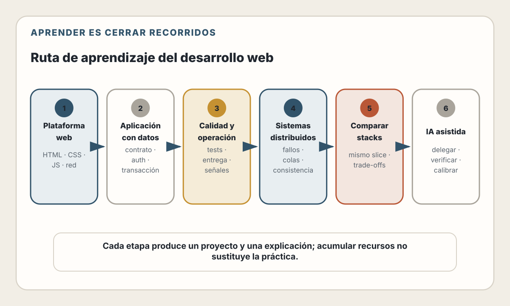

# Apéndice C. Recursos y Rutas de Aprendizaje

> Aprende construyendo modelos mentales y cerrando recorridos completos, no
> acumulando tutoriales inconexos.

Este apéndice organiza fuentes y práctica. No presupone una duración fija. Una
persona con experiencia en otro stack puede avanzar rápidamente; otra puede
necesitar repetir un proyecto con menos abstracciones.

---

## Cómo usar una fuente técnica

Combina cuatro tipos:

| Fuente | Aporta | Limitación |
|--------|--------|------------|
| Especificación | Semántica normativa | Puede ser difícil para comenzar |
| Documentación oficial | API y uso mantenido | Puede enfocarse en la herramienta |
| Libro o curso | Recorrido y explicación | Envejece y selecciona una perspectiva |
| Proyecto propio | Retroalimentación y memoria | Puede reforzar errores sin revisión |

Un ciclo útil:

1. formula una pregunta;
2. lee una explicación;
3. consulta la fuente primaria;
4. implementa el caso mínimo;
5. rompe un supuesto;
6. mide o prueba;
7. explica el resultado con tus palabras;
8. registra lo que todavía no entiendes.

No leas una especificación completa para resolver cada duda. Aprende a localizar
la sección normativa que decide el comportamiento.

<picture>
  <source media="(max-width: 820px)" srcset="../assets/diagrams/apc-ruta-aprendizaje-mobile.svg">
  
</picture>

---

## Ruta 1. Plataforma web

### Resultado esperado

Construir una interfaz funcional sin framework, explicar el recorrido de una
URL y depurarla con DevTools.

### Temas

1. URL, DNS, TLS y HTTP.
2. HTML semántico.
3. Formularios y validación.
4. CSS: cascade, box model, layout y responsive.
5. JavaScript: valores, módulos, eventos y asincronía.
6. DOM, Fetch, storage y seguridad de origen.
7. Accesibilidad y mejora progresiva.

### Fuentes

- MDN Learn Web Development para una introducción guiada;
- WHATWG HTML para semántica exacta;
- CSS specifications y MDN para propiedades;
- javascript.info o MDN para práctica, contrastados con ECMAScript;
- HTTP Semantics y Fetch para comportamiento de red.

### Proyecto

Construye un sitio de registro a un evento:

- documento semántico;
- navegación por teclado;
- formulario que funciona con envío HTML;
- mejora con JavaScript para validación y estado pendiente;
- layout desde móvil hasta escritorio;
- página de confirmación;
- medición de accesibilidad y rendimiento.

Restricción: no uses un framework ni biblioteca de componentes. El objetivo es
ver la plataforma.

### Evidencia de aprendizaje

Debes poder explicar:

- diferencia entre URL, origen y dominio;
- cuándo se envía una cookie;
- por qué un label importa;
- qué provoca layout y paint;
- qué sucede al usar `await fetch(...)`;
- qué validación debe repetirse en el servidor.

---

## Ruta 2. Aplicación con datos

### Resultado esperado

Llevar una capacidad desde interfaz hasta base de datos con contrato,
autorización, migración y pruebas.

### Temas

1. Modelado del problema.
2. API y errores.
3. Esquema relacional.
4. Restricciones e índices.
5. Sesión y autorización por objeto.
6. Transacciones.
7. Pruebas unitarias, integración y E2E.
8. Configuración y secretos.

### Proyecto

Construye una aplicación de notas privadas:

- crear, listar, editar y archivar;
- usuario autenticado;
- búsqueda acotada;
- paginación;
- migraciones incrementales;
- prueba usuario A contra nota de B;
- backup y restauración en ambiente local.

No implementes criptografía ni contraseñas desde cero. Usa una biblioteca o
proveedor mantenido y estudia el contrato que ofrece.

### Lecturas

- tutorial de PostgreSQL y documentación de restricciones;
- OWASP Cheat Sheets para sesión, autorización y entrada;
- documentación del framework elegido;
- OpenAPI cuando la API tenga consumidores;
- capítulos 9–20 de este libro como guía de decisiones.

### Evidencia de aprendizaje

- un diagrama o texto de fronteras;
- migración revisada;
- contrato de errores;
- prueba de aislamiento;
- explicación de una transacción;
- plan para agregar un campo obligatorio sin reset.

---

## Ruta 3. Calidad y operación

### Resultado esperado

Publicar una aplicación pequeña, observarla y recuperarla.

### Temas

1. Pipeline reproducible.
2. Artefactos inmutables.
3. Despliegue y rollback.
4. Logs, métricas y trazas.
5. SLI, SLO y alertas.
6. Rendimiento y capacidad.
7. Threat model y cadena de suministro.
8. Incidentes y aprendizaje.

### Proyecto

Opera la aplicación de notas:

- build en CI;
- contenedor sin privilegios;
- migración como etapa separada;
- endpoint de readiness;
- logs estructurados con request ID;
- métrica de éxito de la operación principal;
- prueba de carga pequeña;
- alerta basada en síntomas;
- rollback ensayado;
- restauración desde backup;
- postmortem ficticio.

No necesitas un clúster complejo. Una plataforma administrada puede enseñar el
recorrido si puedes observar artefacto, configuración, logs y release.

### Fuentes

- Google SRE Books;
- OpenTelemetry;
- documentación de tu plataforma;
- OWASP ASVS;
- documentación oficial de Docker y CI;
- capítulos 21–26 de este libro.

### Evidencia de aprendizaje

Debes responder:

- ¿qué commit está en producción?;
- ¿qué migración se aplicó?;
- ¿cómo sabes que la capacidad funciona?;
- ¿cuándo revertirías?;
- ¿qué dato no aparece en logs?;
- ¿cuántas conexiones puede abrir el máximo de réplicas?;
- ¿cuánto tardarías en restaurar?

---

## Ruta 4. Sistemas distribuidos

### Resultado esperado

Razonar sobre fallos parciales, entrega de mensajes, consistencia y capacidad
sin adoptar complejidad innecesaria.

### Temas

1. Timeouts, deadlines y cancelación.
2. Reintentos, backoff y jitter.
3. Idempotencia.
4. Colas y semántica de entrega.
5. Outbox transaccional.
6. Caché e invalidación.
7. Replicación y particionamiento.
8. Sobrecarga y backpressure.

### Proyecto

Extiende la aplicación con exportación asíncrona:

- request crea un trabajo;
- outbox conserva publicación;
- worker genera un archivo;
- consumidor idempotente;
- reintentos acotados;
- estado consultable;
- cancelación;
- dead-letter o estado terminal;
- métrica de backlog;
- prueba que mata el proceso entre pasos.

Empieza con una base y un worker. Introduce un broker solo cuando el experimento
muestre una necesidad.

### Fuentes

- *Designing Data-Intensive Applications*;
- Google SRE sobre cascading failures y overload;
- documentación del broker elegido;
- RFCs de HTTP para reintentos y caché;
- capítulos 18–20 y 24–25.

### Evidencia de aprendizaje

Explica las ventanas de fallo. Si tu respuesta es “exactly once”, describe
exactamente qué frontera lo garantiza y cómo se identifica una repetición.

---

## Ruta 5. Comparación de stacks

### Resultado esperado

Separar dominio de herramienta y elegir mediante trade-offs.

### Ejercicio

Implementa el slice de solicitudes de soporte de los capítulos 27–29 en:

1. tu stack principal;
2. un stack con modelo de concurrencia o composición diferente.

Conserva:

- mismo contrato;
- mismo esquema;
- mismos casos de autorización;
- mismos objetivos de latencia;
- mismo escenario de despliegue.

Compara:

| Dimensión | Pregunta |
|-----------|----------|
| Claridad | ¿Dónde viven reglas y fronteras? |
| Feedback | ¿Qué detectan compilador, tipos y tests? |
| Datos | ¿Cómo se controlan consultas y transacciones? |
| Concurrencia | ¿Cómo se cancela y limita trabajo? |
| Artefacto | ¿Qué necesita el runtime? |
| Operación | ¿Cómo se observa y escala? |
| Equipo | ¿Qué conocimiento requiere? |

No uses líneas de código como métrica principal. Incluye tiempo de depuración,
pruebas, actualización y operación.

---

## Ruta 6. Desarrollo asistido por IA

### Resultado esperado

Delegar trabajo acotado sin perder comprensión, seguridad ni responsabilidad.

### Progresión

1. explicación de código existente;
2. generación de tests para una regla conocida;
3. cambio pequeño con diff;
4. investigación de un bug reproducible;
5. refactor con contrato estable;
6. implementación de un slice con plan;
7. agente con herramientas y permisos limitados;
8. evaluación repetible.

### Diario de calibración

Para cada tarea registra:

```text
Tarea:
Riesgo:
Predicción de confianza:
Contexto entregado:
Herramientas permitidas:
Resultado:
Pruebas ejecutadas:
Defectos encontrados en revisión:
Retrabajo:
Qué instrucción mejoraría:
```

Busca calibración, no una tasa artificial de aceptación. Un cambio rechazado
puede haber revelado una ambigüedad valiosa.

### Proyecto

Crea una herramienta de lectura para que un agente consulte solicitudes de
soporte:

- esquema estricto;
- identidad del actor;
- scope de solo lectura;
- límite de resultados;
- redacción de datos sensibles;
- trace y auditoría;
- eval con intentos de leer otro usuario;
- sin herramienta de escritura.

Después diseña, pero no habilites, la escritura: define preview, aprobación,
idempotencia y rollback.

---

## Cómo leer documentación oficial

### Empieza por el mapa

Busca:

- overview;
- getting started;
- concepts;
- API reference;
- security;
- deployment;
- testing;
- release notes;
- migration guide;
- support policy.

### Comprueba la versión

Una URL puede mostrar documentación:

- latest;
- una versión estable;
- un release antiguo;
- canary/nightly;
- un borrador.

Registra la versión que usa tu repositorio. Si una IA propone una API, búscala
en esa versión.

### Reproduce lo mínimo

Crea un ejemplo pequeño fuera de la aplicación cuando:

- una API tiene semántica dudosa;
- existe interacción entre caché y render;
- una transacción parece comportarse distinto;
- un runtime podría bloquear;
- una configuración de seguridad es sensible.

Un experimento de veinte líneas puede ser evidencia más clara que otro hilo de
opiniones.

---

## Cómo estudiar un RFC o estándar

No todos los documentos usan lenguaje igual, pero un recorrido práctico es:

1. estado del documento;
2. abstract;
3. terminología;
4. sección de la operación relevante;
5. requisitos con MUST/SHOULD/MAY cuando aplique;
6. seguridad;
7. privacidad;
8. compatibilidad y referencias.

Pregunta si la implementación que usas cumple esa versión. Una especificación y
el comportamiento desplegado pueden divergir por bugs, extensiones o soporte
parcial.

---

## Práctica deliberada

Un proyecto enseña más cuando impone una restricción:

- sin framework para aprender la plataforma;
- con dos identidades para aprender autorización;
- con una caída inyectada para aprender idempotencia;
- con un presupuesto de JavaScript para aprender rendimiento;
- con teclado únicamente para aprender accesibilidad;
- con una migración compatible para aprender despliegue;
- con un agente de solo lectura para aprender permisos.

Repetir el mismo tutorial con otro framework cambia sintaxis. Cambiar la
restricción cambia el modelo mental.

---

## Revisión por hitos

### Puedo construir

- una UI semántica;
- un endpoint validado;
- una tabla con restricciones;
- una prueba automatizada.

### Puedo integrar

- identidad con autorización de objeto;
- interfaz con caso de uso;
- transacción con evento;
- build con migración.

### Puedo operar

- observar recorrido;
- estimar capacidad;
- desplegar y revertir;
- restaurar datos;
- responder a un incidente.

### Puedo evaluar

- leer una fuente primaria;
- distinguir estándar y propuesta;
- diseñar experimento;
- explicar trade-offs;
- rechazar complejidad innecesaria.

### Puedo colaborar con IA

- delimitar tarea y permisos;
- seleccionar contexto;
- verificar resultado;
- diseñar eval;
- conservar responsabilidad.

No necesitas completar cada punto para trabajar. Úsalos para identificar la
siguiente práctica con mayor rendimiento educativo.

---

## Recursos primarios por tema

| Tema | Punto de entrada |
|------|------------------|
| HTML | WHATWG HTML |
| CSS | W3C CSS Snapshot y MDN |
| JavaScript | ECMA-262 y MDN |
| HTTP | RFC 9110 |
| Accesibilidad | WCAG 2.2 y WAI tutorials |
| APIs | OpenAPI Specification |
| Datos | PostgreSQL Documentation |
| Seguridad | OWASP Cheat Sheets y ASVS |
| Operación | Google SRE y OpenTelemetry |
| Contenedores | OCI Specifications y Docker docs |
| WebAssembly | W3C Wasm y WASI |
| IA y herramientas | Especificación y docs del proveedor/protocolo |

---

## Referencias

- [MDN Learn Web Development](https://developer.mozilla.org/en-US/docs/Learn_web_development)
- [WHATWG HTML Living Standard](https://html.spec.whatwg.org/)
- [ECMAScript Language Specification](https://tc39.es/ecma262/)
- [IETF RFC 9110 — HTTP Semantics](https://www.rfc-editor.org/rfc/rfc9110)
- [W3C — WCAG 2.2](https://www.w3.org/TR/WCAG22/)
- [WAI Tutorials](https://www.w3.org/WAI/tutorials/)
- [OpenAPI Specification](https://spec.openapis.org/oas/latest.html)
- [PostgreSQL Documentation](https://www.postgresql.org/docs/current/)
- [OWASP Cheat Sheet Series](https://cheatsheetseries.owasp.org/)
- [OWASP ASVS](https://owasp.org/www-project-application-security-verification-standard/)
- [Google Site Reliability Engineering](https://sre.google/books/)
- [OpenTelemetry Documentation](https://opentelemetry.io/docs/)
- [OCI Specifications](https://opencontainers.org/about/overview/)
- [W3C — WebAssembly](https://www.w3.org/TR/wasm-core/)
- [WASI](https://wasi.dev/)
- Kleppmann, M. (2017). *Designing Data-Intensive Applications*. O'Reilly.
- Beyer, B., Jones, C., Petoff, J. y Murphy, N. R. (2016). *Site Reliability Engineering*. O'Reilly.
