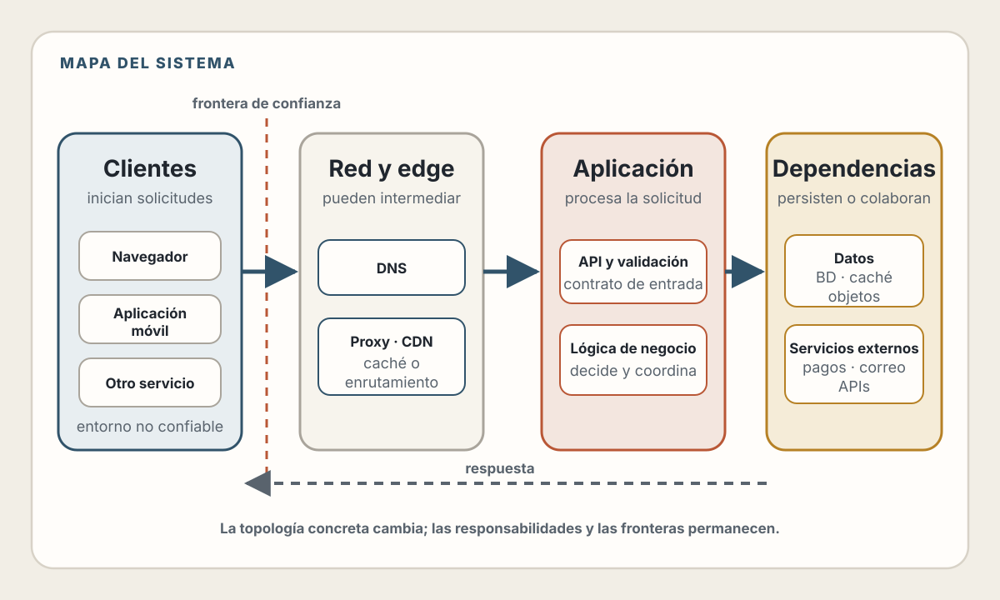
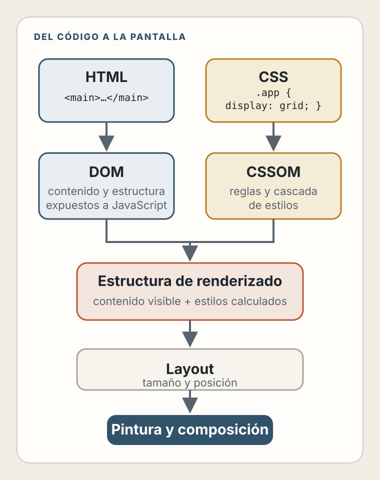
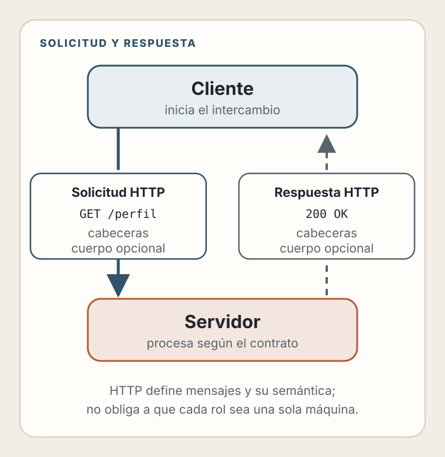
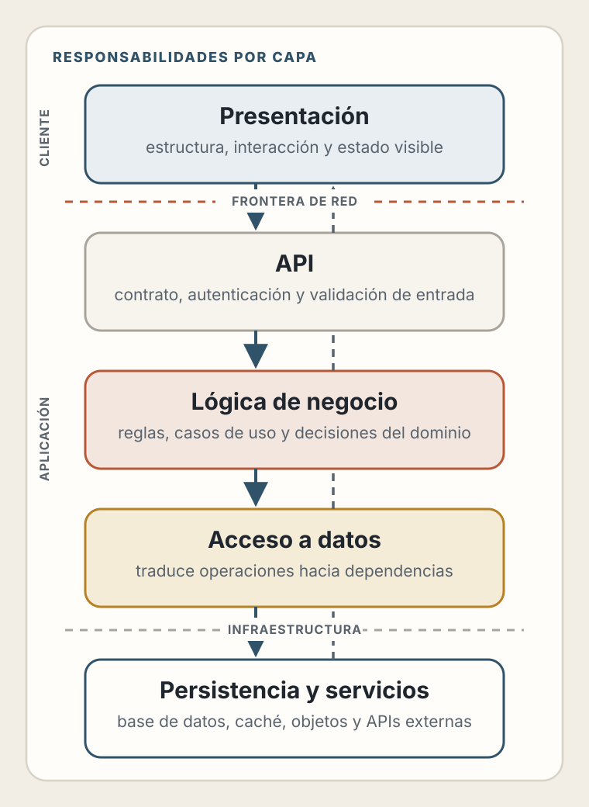
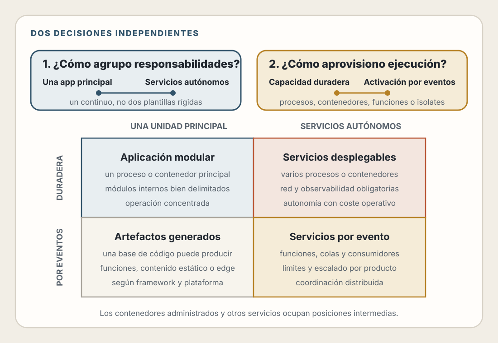
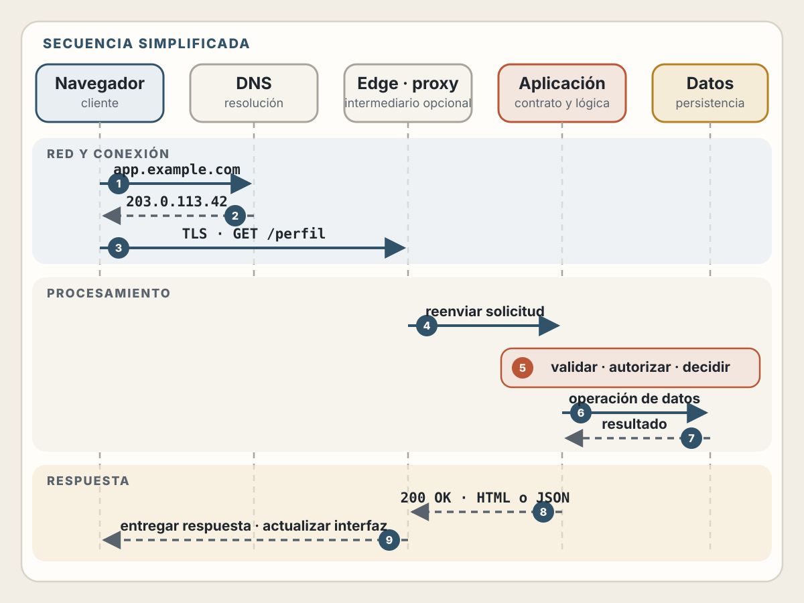

# 1. Anatomía de una Aplicación Web Moderna

> ¿Qué sucede realmente entre el momento en que un usuario hace clic y ve el resultado en pantalla?

## Objetivos de Aprendizaje

Al finalizar este capítulo, serás capaz de:

- Identificar los componentes fundamentales de una aplicación web
- Entender la diferencia entre cliente, servidor y servicios en la nube
- Separar la organización del código del modelo en que se ejecuta
- Comparar monolitos, microservicios, procesos, contenedores, funciones e isolates
- Trazar el flujo completo de una petición desde el navegador hasta la base de datos y de vuelta

---

## El mapa del territorio

Antes de profundizar en técnicas específicas, necesitas un mapa mental de cómo encajan todas las piezas. Este capítulo te da ese mapa.

Una aplicación web moderna no es un programa que corre en una computadora. Es un **sistema distribuido**: múltiples programas, corriendo en múltiples computadoras, comunicándose a través de la red.

<picture>
  <source media="(max-width: 600px)" srcset="../assets/diagrams/cap01-mapa-aplicacion-mobile.svg">
  
</picture>

No te preocupes si esto parece complejo. Vamos a desarmarlo pieza por pieza.

---

## Cliente y Servidor: la división fundamental

📖 **Concepto**: En la web, hay dos roles fundamentales: el **cliente** (quien pide) y el **servidor** (quien responde). Esta división existe desde los orígenes de Internet y sigue siendo el modelo mental más importante.

### El Cliente

El cliente es cualquier programa que inicia una petición. En el contexto web, típicamente es:

- **El navegador** (Chrome, Firefox, Safari)
- **Una app móvil** que consume APIs
- **Otro servidor** que necesita datos de tu servicio

Cuando el cliente es un navegador o una app móvil, se ejecuta en el dispositivo
del usuario. Puedes decidir qué código entregas, pero no controlar el entorno en
que terminará ejecutándose:

| Puedes decidir | Debes tratar como variable |
|----------------|-----------------------------|
| El HTML, CSS y JavaScript que entregas | El navegador y sus capacidades |
| Las respuestas y políticas de tu servidor | La velocidad y estabilidad de la red |
| La mejora progresiva y los estados de error | El tamaño de pantalla y los métodos de entrada |
| Qué operaciones expones al cliente | Extensiones, configuración y código manipulado |

Un cliente también puede ser otro servidor. En ese caso quizá controles su
código, pero la comunicación sigue cruzando una frontera: ambos lados pueden
fallar, cambiar o recibir datos manipulados.

⚠️ **Advertencia**: Nunca confíes en el cliente. Todo lo que viene del navegador puede ser manipulado. La validación en el cliente es para UX; la validación real ocurre en el servidor.

### Cómo el navegador muestra una página: el DOM

Cuando el navegador recibe HTML, lo analiza y construye el **DOM (Document
Object Model)**. También analiza el CSS para construir el CSSOM. Con ambas
estructuras determina qué debe mostrarse, calcula tamaños y posiciones, pinta
los elementos y compone el resultado final en pantalla.



📖 **Concepto**: El DOM representa la estructura y el contenido del documento
como un **árbol de objetos**. Cada elemento HTML (`<div>`, `<p>`, `<button>`)
se convierte en un nodo. JavaScript puede consultar o modificar ese árbol y
registrar manejadores para eventos como clics y pulsaciones de teclado. El DOM
no contiene por sí solo el estilo calculado ni la posición final de cada
elemento: esas tareas forman parte del proceso de renderizado del navegador.

**¿Por qué importa el DOM?**

JavaScript puede modificar el DOM para cambiar la página sin recargarla:

```javascript
// Encontrar un elemento en el DOM
const titulo = document.querySelector('h1');

// Modificarlo
titulo.textContent = '¡Hola modificado!';  // Cambia el texto
titulo.style.color = 'blue';               // Cambia el estilo

// Crear nuevos elementos
const nuevoParrafo = document.createElement('p');
nuevoParrafo.textContent = 'Soy nuevo';
document.body.appendChild(nuevoParrafo);   // Lo añade a la página
```

Después de ejecutar este código, el navegador programa el trabajo de estilo,
layout y pintura que sea necesario para reflejar los cambios. No toda
modificación obliga a repetir todas las etapas ni se dibuja de forma inmediata.
Comprender esta diferencia será importante cuando estudiemos rendimiento.

💡 **Insight**: Frameworks como React, Vue y Svelte permiten describir la
interfaz a partir del estado y coordinan los cambios necesarios en la plataforma
web. El resultado visible termina pasando por el proceso de renderizado del
navegador, aunque la estrategia para actualizarlo varía entre frameworks.

### El Servidor

El servidor es un programa que escucha peticiones y responde. Normalmente tienes
**más control** sobre su entorno que sobre el dispositivo del usuario, pero el
límite depende de dónde y cómo lo despliegues:

- En una máquina propia puedes administrar hardware, sistema operativo y proceso
- En una máquina virtual controlas el sistema operativo, pero no el hardware
- En un contenedor administrado eliges imagen y configuración; el proveedor opera la infraestructura
- En una función o isolate trabajas dentro de APIs y límites definidos por la plataforma

En todos los casos, tu aplicación debe validar las entradas, proteger los
secretos y manejar fallos de sus dependencias.

```javascript
// Ejemplo conceptual de un servidor minimalista
const server = createServer((request, response) => {
  // 1. Recibe la petición
  const { url, method, headers, body } = request;

  // 2. Procesa (lógica de negocio, base de datos, etc.)
  const result = processRequest(url, method, body);

  // 3. Envía respuesta
  response.send(result);
});

server.listen(3000); // Escucha en puerto 3000
```

### La comunicación: HTTP

Cliente y servidor hablan a través de **HTTP** (HyperText Transfer Protocol). Es un protocolo de petición-respuesta:



Los métodos HTTP más comunes:

| Método | Intención habitual | Propiedad relevante |
|--------|--------------------|---------------------|
| GET | Pedir datos o contenido | Es seguro e idempotente |
| POST | Enviar datos para crear algo o iniciar una acción | No se garantiza que sea seguro ni idempotente |
| PUT | Crear o reemplazar por completo algo en una dirección específica, como `/usuarios/42` | Es idempotente |
| PATCH | Cambiar solo una parte de algo existente | La idempotencia depende del tipo de cambio |
| DELETE | Eliminar algo | Es idempotente en su intención |

**URI** significa *Uniform Resource Identifier* —en español, **identificador
uniforme de recursos**—. Es el nombre técnico de un texto que identifica algo
en la web. Por ejemplo, `/usuarios/42` identifica al usuario 42. Una **URL** es
una URI que además indica cómo y dónde acceder a ese recurso, como
`https://ejemplo.com/usuarios/42`. Profundizaremos en esta diferencia en el
capítulo 5.

**Idempotente** significa que repetir una solicitud produce el mismo estado
deseado que ejecutarla una sola vez; no implica que todas las respuestas deban
ser idénticas. **Seguro** significa que el método no solicita un cambio de estado
en el servidor, aunque acciones auxiliares como registrar métricas puedan ocurrir.

---

## Las capas de una aplicación

Una aplicación web moderna tiene múltiples capas, cada una con responsabilidades específicas.

### Vista de capas (de arriba hacia abajo)



💡 **Insight**: Las capas no son una burocracia. Cada una tiene una razón de existir: separar responsabilidades hace que el código sea más fácil de entender, probar y modificar. Cuando todo está mezclado, un cambio en la UI puede romper la base de datos.

Estas son **responsabilidades conceptuales**, no una orden de crear cinco
servidores. Todas pueden convivir en un solo proceso o distribuirse entre varios
componentes. La separación lógica y la separación física son decisiones distintas.

---

## Dos decisiones arquitectónicas fundamentales

Cuando diseñas la arquitectura de tu aplicación, conviene separar **dos
decisiones independientes**: cómo organizas el sistema y cómo ejecutas sus
componentes.

Estas dos dimensiones son **ortogonales**: puedes combinarlas de cualquier manera. Veamos cada una.

---

### Decisión 1: Organización del código

Esta decisión responde: *¿Cómo divido las responsabilidades de mi aplicación?*

#### Monolito

El sistema se entrega principalmente como una unidad desplegable. Puede estar
bien dividido en módulos y no exige un único repositorio ni una única base de
datos. Lo que lo caracteriza es que sus partes principales se versionan y
despliegan juntas.

**Ventajas:**
- Simple de desarrollar y depurar
- Las transacciones locales son más directas cuando los módulos comparten datos
- Una unidad principal de despliegue reduce la complejidad operativa inicial
- Ideal para equipos pequeños

**Desventajas:**
- Sus componentes suelen escalar juntos, aunque solo una parte necesite más capacidad
- Un fallo puede afectar una superficie mayor si no existe aislamiento interno
- El código tiende a acoplarse con el tiempo
- Los despliegues pueden volverse más riesgosos a medida que crece

#### Microservicios

La aplicación se divide en servicios independientes que se comunican por red y
pueden evolucionar o desplegarse por separado. «Pequeño» no describe un número
de líneas: un servicio debe corresponder a una responsabilidad coherente.

**Ventajas:**
- Permite escalar servicios de forma independiente
- Puede dar autonomía a equipos cuando existen límites y contratos claros
- Puede reducir el radio de impacto si se diseñan timeouts, límites y degradación
- Libertad tecnológica por servicio

**Desventajas:**
- Mayor complejidad operativa
- Latencia de red entre servicios
- Las transacciones distribuidas son difíciles
- El diagnóstico exige correlacionar información entre servicios

⚠️ **Advertencia**: Los microservicios pueden responder a límites
organizacionales, de despliegue o de escalado, pero introducen red, observabilidad
y consistencia distribuida. El tamaño del equipo por sí solo no determina la
decisión. Empieza delimitando módulos; separa procesos cuando exista una razón
medible y capacidad operativa para sostenerlos.

---

### Decisión 2: Modelo de ejecución

Esta decisión responde: *¿Cómo y dónde corre mi código?*

#### Procesos y contenedores de larga duración

Tu aplicación corre como uno o varios procesos de larga duración en máquinas
virtuales, servidores o contenedores. La infraestructura puede ser propia o
administrada y también puede escalar automáticamente.

**Ventajas:**
- Mayor control sobre runtime, proceso y ciclo de vida
- Instancias calientes mientras permanecen aprovisionadas
- Conexiones persistentes y trabajo continuo encajan naturalmente
- Capacidad reservada con un coste relativamente predecible

**Desventajas:**
- Puede existir capacidad ociosa
- Alguien debe configurar escalado, parches y recuperación
- La responsabilidad exacta depende del servicio administrado

#### Functions as a Service (FaaS)

Tu código se despliega como funciones activadas por HTTP, colas, cron u otros
eventos. El proveedor administra el aprovisionamiento y aplica límites de
ejecución definidos por cada producto.

📖 **Concepto**: «Lambda» es el nombre del producto FaaS de AWS y a veces se usa
coloquialmente para cualquier función, pero no todos los runtimes son
equivalentes. Una función sobre un runtime de proceso, un isolate de edge y un
contenedor administrado difieren en APIs, aislamiento, concurrencia,
persistencia, ubicación y límites.

**Ventajas:**
- El proveedor administra gran parte del ciclo de vida
- Muchos productos pueden escalar a cero
- Escalado por eventos dentro de cuotas configuradas
- Buen encaje para trabajo breve y desacoplado

**Desventajas:**
- Puede existir latencia de inicialización
- Límites de duración, concurrencia, red y tamaño específicos del proveedor
- Portabilidad condicionada por eventos y servicios integrados
- Las conexiones persistentes dependen de las capacidades del producto

#### Isolates de edge y contenedores administrados

Los **edge runtimes** suelen ejecutar código cerca del usuario mediante isolates
y APIs web, con compatibilidad variable con Node.js. Los **contenedores
administrados** aceptan una imagen o proceso más convencional y delegan
aprovisionamiento y escalado al proveedor; algunos también escalan a cero.

«Serverless» describe un modelo operativo y comercial amplio, no un runtime
único. Para decidir, compara las APIs disponibles, tiempo de CPU frente a tiempo
de pared, concurrencia por instancia, conexiones salientes, almacenamiento
efímero, observabilidad y comportamiento de escalado.

---

### La matriz: combinando las dos decisiones

Aquí está la clave conceptual: **puedes combinar cualquier organización con cualquier ejecución**.

<picture>
  <source media="(max-width: 600px)" srcset="../assets/diagrams/cap01-decisiones-arquitectura-mobile.svg">
  
</picture>

📖 **Concepto**: Un proyecto full-stack puede conservar una organización de
monolito modular y desplegarse como varios artefactos: contenido estático,
funciones, edge runtime o procesos administrados. El resultado concreto depende
del framework, adaptador, configuración y plataforma; un repositorio no implica
una única unidad de ejecución.

### Combinaciones frecuentes

| Organización y ejecución | Cuándo puede encajar |
|--------------------------|----------------------|
| **Unidad desplegable + proceso duradero** | Producto cohesivo, equipo pequeño o mediano y operación sencilla |
| **Unidad de código + artefactos administrados** | Un framework genera contenido estático, funciones o procesos a partir del mismo proyecto |
| **Servicios autónomos + procesos duraderos** | Dominios y equipos necesitan desplegar, escalar y operar de forma independiente |
| **Servicios + ejecuciones por evento** | Flujos desacoplados por colas, tareas breves o cargas muy variables |

Son patrones, no recetas. Una arquitectura real puede mezclar varios: por
ejemplo, un monolito modular para el producto principal y una función separada
para procesar imágenes.

---

### Guía de decisión

Ahora que entiendes que son dos decisiones separadas, aquí está cómo tomar cada una:

| Pregunta | Evidencia para concentrar | Evidencia para separar |
|----------|---------------------------|------------------------|
| **Organización** | Cambios coordinados, transacciones locales, un equipo responsable | Ritmos de despliegue distintos, límites de dominio claros, propiedad independiente |
| **Ejecución** | Conexiones persistentes, trabajo continuo, carga predecible | Eventos independientes, carga intermitente, tareas breves y paralelizables |

Antes de separar, identifica qué problema medible resolverás y qué coste
operativo asumirás. No adoptes distribución solo porque una tecnología lo permita.

---

## El viaje de una petición

Veamos qué sucede cuando un usuario hace clic en "Ver mi perfil" en una aplicación típica.

### Paso a paso

<picture>
  <source media="(max-width: 820px)" srcset="../assets/diagrams/cap01-viaje-peticion-mobile.svg">
  
</picture>

### ¿Dónde puede fallar?

Cada paso es un punto potencial de falla:

| Paso | Posibles fallas |
|------|-----------------|
| DNS | Resolución lenta, configuración incorrecta, dominio expirado |
| Red y TLS | Conexión inestable, certificado inválido, timeout |
| Edge o proxy | Ruta incorrecta, origen sin instancias saludables |
| Autenticación | Token expirado, inválido |
| Aplicación | Error en código, memoria agotada, dependencia caída |
| Base de datos | Consulta lenta, conexión agotada, bloqueo |
| Respuesta | Timeout del cliente |

💡 **Insight**: Entender este flujo completo te ayuda a depurar problemas. Cuando algo falla, puedes preguntarte: "¿En qué paso está fallando?" y acotar el problema rápidamente.

---

## El stack moderno: piezas comunes

Una aplicación web moderna típicamente incluye:

### Frontend
| Categoría | Ejemplos que conviene evaluar |
|-----------|---------------------------|
| Framework | React, Vue, Svelte, Solid |
| Meta-framework | Next.js, Nuxt, SvelteKit, Astro |
| Estilos | Tailwind CSS, CSS Modules, Styled Components |
| Estado | Zustand, Jotai, Redux Toolkit, TanStack Query |

### Backend
| Categoría | Ejemplos que conviene evaluar |
|-----------|---------------------------|
| Runtime | Node.js, Deno, Bun, Python, Go |
| Framework | Express, Fastify, Hono, FastAPI, Gin |
| ORM | Prisma, Drizzle, SQLAlchemy, GORM |
| Validación | Zod, Yup, Pydantic |

### Datos
| Categoría | Ejemplos que conviene evaluar |
|-----------|---------------------------|
| SQL | PostgreSQL, MySQL, SQLite |
| NoSQL | MongoDB, DynamoDB, Firestore |
| Cache | Redis, Memcached |
| Búsqueda | Elasticsearch, Meilisearch, Algolia |

### Infraestructura
| Categoría | Ejemplos que conviene evaluar |
|-----------|---------------------------|
| Hosting | Vercel, Railway, Fly.io, AWS, GCP |
| CDN | Cloudflare, Fastly, AWS CloudFront |
| Contenedores | Docker, Kubernetes |
| CI/CD | GitHub Actions, GitLab CI, CircleCI |

⚠️ **Advertencia**: Son ejemplos, no un ranking ni una recomendación fechada.
Comprueba mantenimiento, compatibilidad, modelo operativo y coste antes de
elegir. Aprende primero los fundamentos que permanecen entre herramientas.

---

## Resumen

- Una aplicación web es un **sistema distribuido**: múltiples programas comunicándose por red
- La división **cliente-servidor** sigue siendo fundamental: cliente pide, servidor responde
- Las aplicaciones tienen **capas** (presentación, API, lógica de negocio, datos) para separar responsabilidades
- La arquitectura combina decisiones de **organización** con un modelo de
  **ejecución**: procesos, contenedores, funciones o isolates pueden coexistir
- Una petición atraviesa múltiples componentes; entender este flujo es clave para depurar
- El stack moderno tiene muchas opciones; elige uno y domínalo antes de explorar otros

---

## Ejercicios

1. **Diagrama mental**: Dibuja en papel el flujo completo de una petición en una aplicación que conozcas (puede ser una que uses diariamente). Identifica cada componente.

2. **Investigación**: Elige una empresa tech que admires. Investiga qué arquitectura usan (monolito, microservicios, híbrida). ¿Por qué crees que eligieron esa opción?

3. **Análisis de stack**: Mira los requisitos de trabajo de 5 ofertas de empleo para desarrollador web en tu región. ¿Qué tecnologías se repiten más?

---

## Referencias

- MDN Web Docs. *Overview of HTTP*. https://developer.mozilla.org/en-US/docs/Web/HTTP/Guides/Overview
- MDN Web Docs. *Critical rendering path*. https://developer.mozilla.org/docs/Web/Performance/Critical_rendering_path
- Fowler, M. (2014). *Microservices* — https://martinfowler.com/articles/microservices.html
- Kleppmann, M. (2017). *Designing Data-Intensive Applications*. O'Reilly.
- Newman, S. (2021). *Building Microservices*, 2nd Edition. O'Reilly.
- AWS. *AWS Lambda concepts*. https://docs.aws.amazon.com/lambda/latest/dg/gettingstarted-concepts.html
- Cloudflare. *How Workers works*. https://developers.cloudflare.com/workers/reference/how-workers-works/
- Google Cloud. *Cloud Run container runtime contract*. https://cloud.google.com/run/docs/container-contract

---

**Siguiente**: [HTML Semántico, Formularios y Mejora Progresiva](./02-html-semantico-formularios.md)
