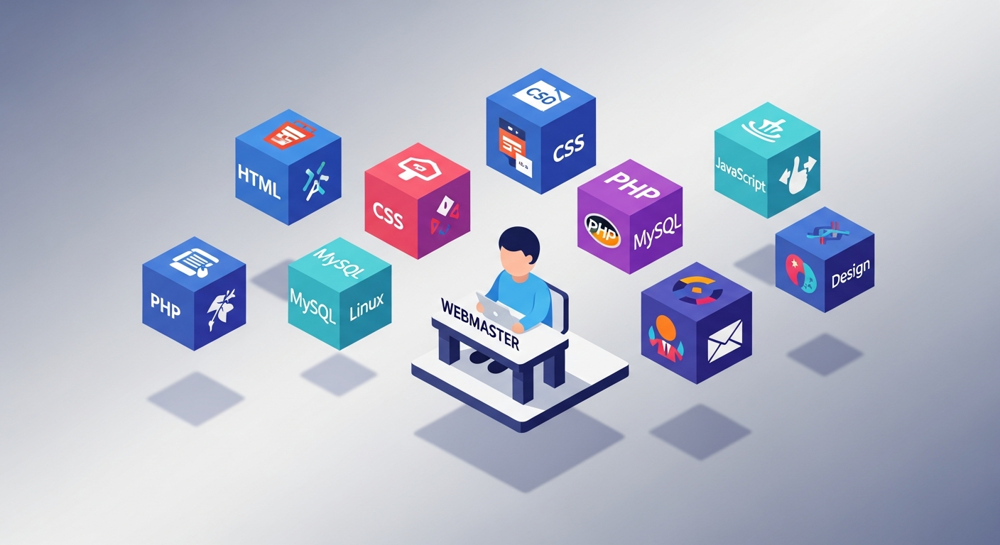
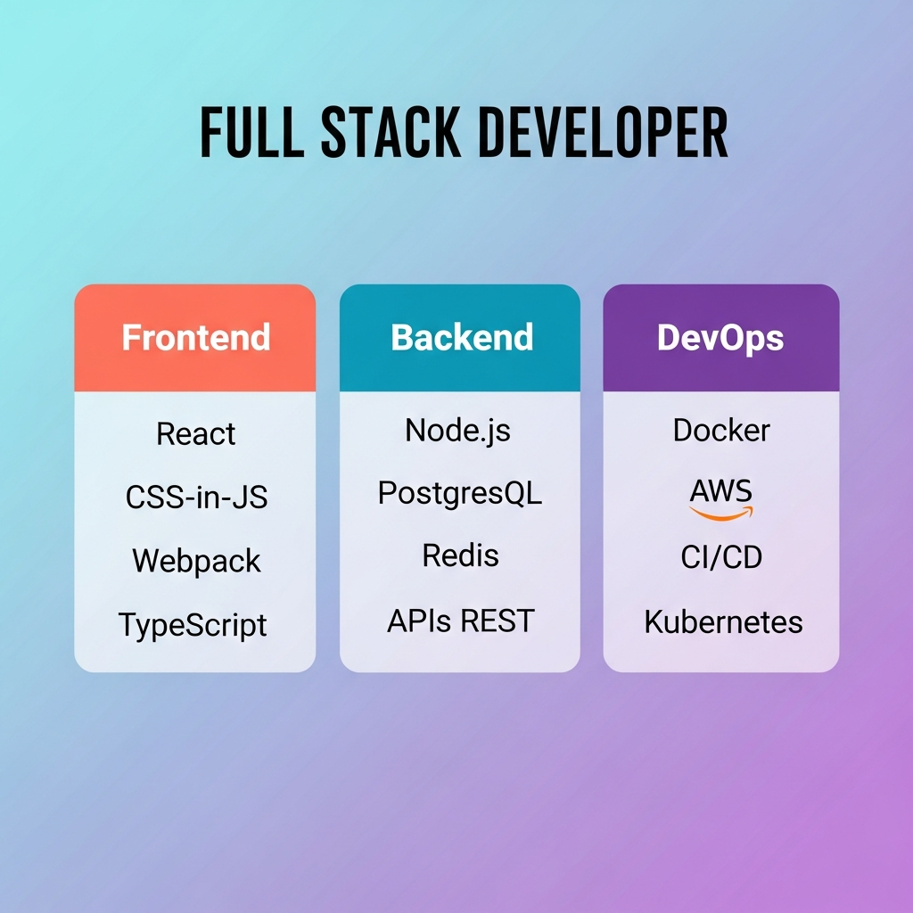
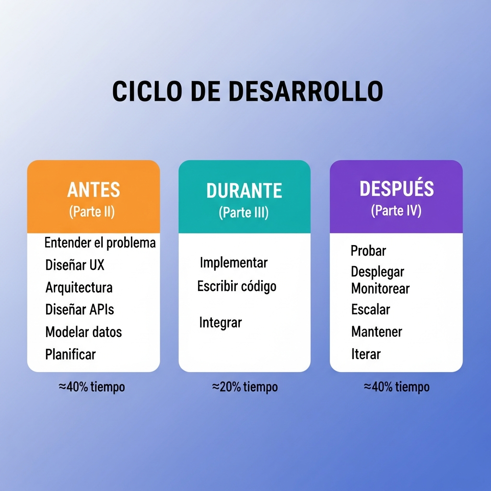

# 1. La Evolución del Desarrollador Web

> "El mejor código es el que no tienes que escribir."

## Objetivos de Aprendizaje

Al finalizar este capítulo, serás capaz de:
- Entender cómo ha evolucionado el rol del desarrollador web en las últimas décadas
- Identificar las habilidades que se han vuelto más valiosas en la era de la IA
- Reconocer el ciclo completo del desarrollo: antes, durante y después del código
- Posicionarte estratégicamente para el futuro de la profesión

---

## La historia que nadie te cuenta

Si le preguntas a alguien qué hace un desarrollador web, probablemente te dirá: "escribe código". Y durante mucho tiempo, esa respuesta fue suficiente.

Pero la realidad siempre fue más compleja.

### Del webmaster al especialista (1995-2010)

En los primeros días de la web, existía una figura casi mitológica: el **webmaster**. Una sola persona que hacía todo: diseñaba las páginas en Photoshop, las cortaba en tablas HTML, escribía los CGI scripts en Perl, configuraba el servidor Apache, y hasta respondía los emails de contacto.



Era insostenible, pero funcionaba porque las expectativas eran bajas. Una página que tardaba 30 segundos en cargar era aceptable. Un formulario de contacto que enviaba un email era tecnología de punta.

Luego llegó la especialización. La complejidad creció y el webmaster se fragmentó:

- **Diseñadores web** que dominaban Photoshop y Flash
- **Maquetadores** que convertían diseños en HTML/CSS
- **Programadores backend** que escribían la lógica en PHP, Java o .NET
- **Administradores de sistemas** que mantenían los servidores

### La era del Full Stack (2010-2020)

Algo curioso ocurrió con la llegada de Node.js en 2009: JavaScript, el lenguaje del navegador, podía correr en el servidor. De pronto, un desarrollador podía escribir frontend y backend en el mismo lenguaje.

Nació el término **Full Stack Developer**, y con él, una nueva presión: se esperaba que una persona dominara todo el stack tecnológico.



El problema es que la profundidad del conocimiento se sacrificó por la amplitud. Muchos desarrolladores sabían un poco de todo, pero no dominaban nada en particular.

### El presente: la era de la IA (2020-hoy)

Y entonces llegó algo que nadie anticipó del todo: herramientas de IA capaces de escribir código.

No código perfecto. No código que reemplace a los desarrolladores. Pero sí código funcional, código que antes tomaba horas escribir y ahora toma minutos generar.

Esto cambia fundamentalmente la ecuación.

---

## El nuevo valor del desarrollador

📖 **Concepto**: El valor de un profesional se determina por la escasez de su habilidad y el impacto de su contribución.

Durante décadas, **saber programar** era la habilidad escasa. Pocas personas entendían cómo hablar con las máquinas. Esa escasez creaba valor.

Pero cuando una IA puede generar código funcional a partir de una descripción en lenguaje natural, la habilidad de "escribir código" se commoditiza. No desaparece—sigue siendo necesaria—pero ya no es el diferenciador principal.

### Lo que la IA hace bien

Seamos honestos sobre las capacidades actuales:

- ✅ Generar código boilerplate y estructuras repetitivas
- ✅ Implementar algoritmos conocidos y patrones comunes
- ✅ Traducir entre lenguajes de programación
- ✅ Escribir tests para código existente
- ✅ Explicar código y documentarlo
- ✅ Detectar bugs obvios y sugerir correcciones
- ✅ Responder preguntas técnicas con contexto

### Lo que la IA no hace (todavía)

Y aquí está la oportunidad:

- ❌ Entender el problema de negocio real detrás de un requerimiento
- ❌ Decidir qué NO construir
- ❌ Evaluar trade-offs arquitectónicos con contexto organizacional
- ❌ Navegar la política y comunicación de un equipo
- ❌ Validar que la solución resuelve el problema correcto
- ❌ Tomar responsabilidad por las decisiones
- ❌ Entender el contexto histórico de un sistema legacy

💡 **Insight**: La IA es extraordinariamente buena ejecutando. Pero alguien tiene que decidir qué ejecutar, validar que se ejecutó correctamente, y hacerse responsable del resultado.

---

## Las nuevas habilidades críticas

Si el código se commoditiza, ¿qué habilidades se vuelven más valiosas?

### 1. Pensamiento en sistemas

No es suficiente saber cómo funciona un componente. Necesitas entender cómo interactúa con otros componentes, cómo fluyen los datos, dónde están los cuellos de botella, qué pasa cuando algo falla.

```
Antes: "Sé escribir una función que ordena una lista"

Ahora: "Entiendo por qué ordenar del lado del cliente vs.
        del servidor tiene implicaciones diferentes en
        performance, costos y experiencia de usuario"
```

### 2. Comunicación técnica

La habilidad de traducir entre mundos:

- Traducir requerimientos de negocio a especificaciones técnicas
- Explicar limitaciones técnicas a stakeholders no técnicos
- Documentar decisiones para tu yo del futuro (y tu equipo)
- Escribir prompts efectivos para herramientas de IA

### 3. Diseño de soluciones

Antes de escribir código, alguien tiene que decidir:

- ¿Qué arquitectura usamos?
- ¿Qué tecnologías elegimos?
- ¿Cómo modelamos los datos?
- ¿Cómo dividimos el trabajo?
- ¿Qué construimos primero?

Estas decisiones tienen impacto duradero. Un error arquitectónico temprano puede costar meses de retrabajo.

### 4. Validación y testing

El código generado por IA puede ser correcto sintácticamente pero incorrecto semánticamente. Puede compilar y pasar tests superficiales, pero fallar en casos borde.

La habilidad de diseñar estrategias de testing, identificar casos borde, y validar que el software hace lo que debe hacer se vuelve crítica.

### 5. Operaciones y observabilidad

Escribir código es solo el comienzo. Luego hay que:

- Desplegarlo sin romper producción
- Monitorearlo para detectar problemas
- Escalarlo cuando crece la demanda
- Debuggearlo cuando algo falla a las 3 AM

---

## El ciclo completo: Antes, Durante, Después

Este libro está organizado alrededor de una idea central: el desarrollo de software es mucho más que escribir código.



Observa los porcentajes. En un proyecto bien ejecutado, escribir código es quizás el 20% del trabajo. El 80% restante está en entender qué construir y asegurar que funciona correctamente.

⚠️ **Advertencia**: Estos porcentajes varían según el proyecto. Un prototipo rápido puede ser 80% código. Un sistema crítico en producción puede ser 10% código y 90% validación y operaciones. El punto no son los números exactos, sino reconocer que el código es solo una parte del todo.

### El Antes: donde se gana o se pierde

La mayoría de los proyectos de software no fallan por código mal escrito. Fallan porque:

- Resolvieron el problema equivocado
- No entendieron las necesidades del usuario
- Eligieron una arquitectura que no escalaba
- No consideraron casos borde críticos
- Subestimaron la complejidad

Dedicar tiempo al "antes" no es burocracia. Es inversión que paga dividendos enormes.

### El Durante: donde la IA brilla

Aquí es donde las herramientas de IA tienen mayor impacto. Pueden:

- Generar código boilerplate instantáneamente
- Sugerir implementaciones de funciones
- Autocompletar patrones comunes
- Escribir tests unitarios
- Refactorizar código existente

Tu rol durante esta fase se transforma: de escribir cada línea a **dirigir, revisar y refinar**.

### El Después: donde la realidad golpea

El software en producción es un animal diferente al software en desarrollo. Usuarios reales hacen cosas que nunca anticipaste. La carga aumenta en momentos inesperados. Las dependencias se actualizan y rompen cosas.

Las habilidades de operaciones, monitoreo, debugging y mantenimiento son las que separan al software que funciona del software que sobrevive.

---

## Posicionándote para el futuro

¿Qué significa todo esto para tu carrera?

### Si estás empezando

No te enfoques solo en aprender a programar. Aprende a:

1. **Hacer preguntas** - La habilidad más subestimada en tecnología
2. **Leer código ajeno** - Vas a leer 10x más código del que escribes
3. **Entender sistemas** - Cómo las piezas encajan entre sí
4. **Comunicar ideas técnicas** - A otros desarrolladores y a no-desarrolladores

Sí, aprende a programar. Pero no te detengas ahí.

### Si ya tienes experiencia

El conocimiento que tienes es más valioso que nunca—pero de una forma diferente. Tu experiencia con sistemas en producción, con proyectos que fallaron, con arquitecturas que escalaron (o no), es exactamente lo que las herramientas de IA no pueden replicar.

Enfócate en:

1. **Mentorear** - Tu experiencia es valiosa para otros
2. **Arquitectura** - Decisiones de alto nivel que definen proyectos
3. **Evaluación de tecnología** - Separar el hype de lo útil
4. **Liderazgo técnico** - Guiar equipos, no solo escribir código

### Para todos

Desarrolla estas meta-habilidades:

- **Aprender a aprender** - La tecnología cambia, la habilidad de adaptarse no
- **Pensamiento crítico** - Cuestionar, validar, verificar
- **Colaboración** - El software moderno se construye en equipo
- **Resiliencia** - Las cosas van a fallar; la pregunta es cómo respondes

---

## Resumen

- El rol del desarrollador web ha evolucionado: del webmaster generalista, al especialista, al full stack, y ahora al **desarrollador aumentado por IA**
- La habilidad de escribir código se está commoditizando; el valor se desplaza hacia el "antes" (diseño, arquitectura) y el "después" (operaciones, validación)
- Las nuevas habilidades críticas son: pensamiento en sistemas, comunicación técnica, diseño de soluciones, validación/testing, y operaciones
- El desarrollo de software es un ciclo completo donde el código es solo ~20% del trabajo
- Independientemente de tu nivel de experiencia, enfócate en habilidades que las herramientas de IA no pueden replicar

---

## Ejercicios

1. **Reflexión**: Piensa en el último proyecto en el que trabajaste. ¿Qué porcentaje del tiempo se dedicó al "antes", al "durante" y al "después"? ¿El resultado habría sido mejor con una distribución diferente?

2. **Análisis**: Elige una herramienta de IA para desarrollo (Claude Code, Cursor, Codex, GitHub Copilot, etc.). Úsala para una tarea pequeña. Documenta: ¿Qué hizo bien? ¿Dónde necesitó corrección? ¿Qué decisiones tuviste que tomar tú?

3. **Planificación personal**: Lista tres habilidades del "antes" y tres del "después" que quieras desarrollar en los próximos seis meses. ¿Qué acciones concretas puedes tomar para cada una?

---

## Referencias

- Brooks, F. (1975). *The Mythical Man-Month*. Addison-Wesley. — Clásico atemporal sobre la naturaleza del desarrollo de software
- DeMarco, T. & Lister, T. (1987). *Peopleware*. Dorset House. — Sobre el factor humano en el desarrollo
- Fowler, M. (2018). *Refactoring*. Addison-Wesley. — La importancia del "después" del código

---

**Siguiente**: [Anatomía de una Aplicación Web Moderna](./02-anatomia-aplicacion.md)
