# 2. Anatomía de una Aplicación Web Moderna

> ¿Qué sucede realmente entre el momento en que un usuario hace clic y ve el resultado en pantalla?

## Objetivos de Aprendizaje

Al finalizar este capítulo, serás capaz de:
- Identificar los componentes fundamentales de una aplicación web
- Entender la diferencia entre cliente, servidor y servicios en la nube
- Comparar arquitecturas: monolitos, microservicios y serverless
- Trazar el flujo completo de una petición desde el navegador hasta la base de datos y de vuelta

---

## El mapa del territorio

Antes de profundizar en técnicas específicas, necesitas un mapa mental de cómo encajan todas las piezas. Este capítulo te da ese mapa.

Una aplicación web moderna no es un programa que corre en una computadora. Es un **sistema distribuido**: múltiples programas, corriendo en múltiples computadoras, comunicándose a través de la red.


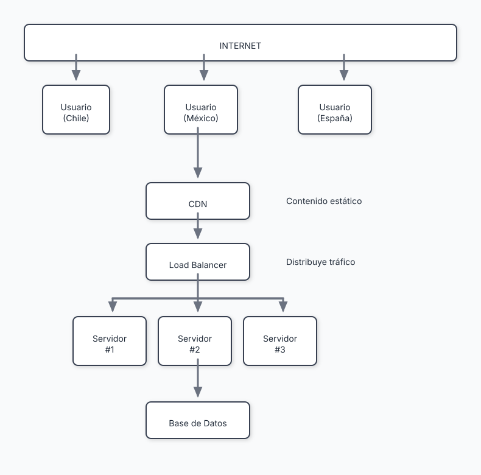

No te preocupes si esto parece complejo. Vamos a desarmarlo pieza por pieza.

---

## Cliente y Servidor: la división fundamental

📖 **Concepto**: En la web, hay dos roles fundamentales: el **cliente** (quien pide) y el **servidor** (quien responde). Esta división existe desde los orígenes de Internet y sigue siendo el modelo mental más importante.

### El Cliente

El cliente es cualquier programa que inicia una petición. En el contexto web, típicamente es:

- **El navegador** (Chrome, Firefox, Safari)
- **Una app móvil** que consume APIs
- **Otro servidor** que necesita datos de tu servicio

El cliente vive en el dispositivo del usuario. Tú no controlas ese ambiente:

```
Lo que controlas:          Lo que NO controlas:
──────────────────────────────────────────────────
El código que envías       El navegador del usuario
                           La velocidad de conexión
                           El tamaño de pantalla
                           Si tiene JavaScript habilitado
                           Las extensiones instaladas
                           Si está en modo avión
```

⚠️ **Advertencia**: Nunca confíes en el cliente. Todo lo que viene del navegador puede ser manipulado. La validación en el cliente es para UX; la validación real ocurre en el servidor.

### Cómo el navegador muestra una página: el DOM

Cuando el navegador recibe HTML del servidor, no lo muestra directamente. Primero lo convierte en una estructura de datos llamada **DOM (Document Object Model)**.


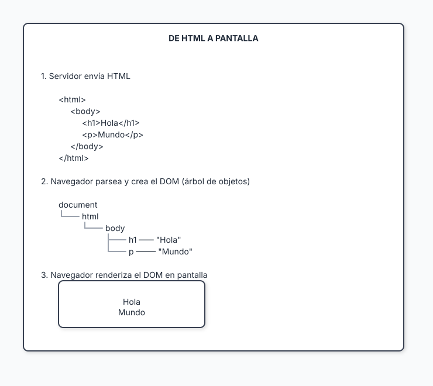

📖 **Concepto**: El DOM es una representación en memoria de la página web como un **árbol de objetos**. Cada elemento HTML (`<div>`, `<p>`, `<button>`) se convierte en un "nodo" del árbol. El navegador usa este árbol para:
- Calcular dónde va cada elemento (layout)
- Aplicar estilos CSS
- Responder a eventos (clicks, teclas)
- Permitir que JavaScript modifique la página

**¿Por qué importa el DOM?**

JavaScript puede modificar el DOM para cambiar la página sin recargarla:

```javascript
// Encontrar un elemento en el DOM
const titulo = document.querySelector('h1');

// Modificarlo
titulo.textContent = '¡Hola modificado!';  // Cambia el texto
titulo.style.color = 'blue';               // Cambia el estilo

// Crear nuevos elementos
const nuevoParrafo = document.createElement('p');
nuevoParrafo.textContent = 'Soy nuevo';
document.body.appendChild(nuevoParrafo);   // Lo añade a la página
```

Cuando ejecutas este código, **el navegador actualiza la pantalla automáticamente** para reflejar los cambios en el DOM. Esta es la base de toda interactividad web.

💡 **Insight**: Los frameworks modernos como React, Vue y Svelte abstraen la manipulación directa del DOM. En lugar de escribir `document.querySelector()`, describes cómo debería verse la UI y el framework actualiza el DOM por ti. Pero por debajo, todo sigue siendo manipulación del DOM.

### El Servidor

El servidor es un programa que escucha peticiones y responde. A diferencia del cliente, el servidor está bajo tu control total:

- Decides qué hardware usar
- Controlas el sistema operativo
- Instalas las dependencias exactas que necesitas
- Manejas los secretos (API keys, contraseñas de BD)

```javascript
// Ejemplo conceptual de un servidor minimalista
const server = createServer((request, response) => {
  // 1. Recibe la petición
  const { url, method, headers, body } = request;

  // 2. Procesa (lógica de negocio, base de datos, etc.)
  const result = processRequest(url, method, body);

  // 3. Envía respuesta
  response.send(result);
});

server.listen(3000); // Escucha en puerto 3000
```

### La comunicación: HTTP

Cliente y servidor hablan a través de **HTTP** (HyperText Transfer Protocol). Es un protocolo de petición-respuesta:


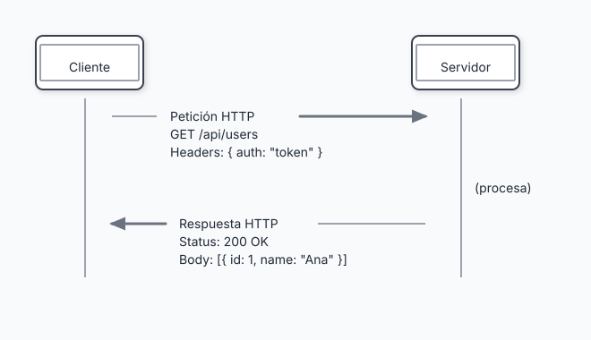

Los métodos HTTP más comunes:

| Método | Propósito | ¿Modifica datos? |
|--------|-----------|------------------|
| GET | Obtener datos | No |
| POST | Crear nuevo recurso | Sí |
| PUT | Reemplazar recurso completo | Sí |
| PATCH | Modificar parcialmente | Sí |
| DELETE | Eliminar recurso | Sí |

---

## Las capas de una aplicación

Una aplicación web moderna tiene múltiples capas, cada una con responsabilidades específicas.

### Vista de capas (de arriba hacia abajo)


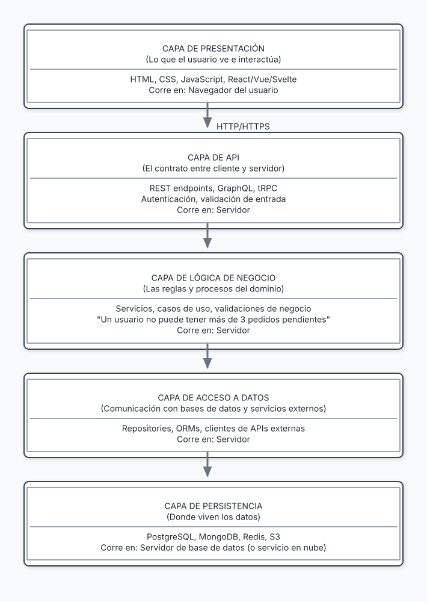

💡 **Insight**: Las capas no son una burocracia. Cada una tiene una razón de existir: separar responsabilidades hace que el código sea más fácil de entender, probar y modificar. Cuando todo está mezclado, un cambio en la UI puede romper la base de datos.

---

## Dos decisiones arquitectónicas fundamentales

Cuando diseñas la arquitectura de tu aplicación, no tomas una decisión—tomas **dos decisiones independientes** que se pueden combinar:


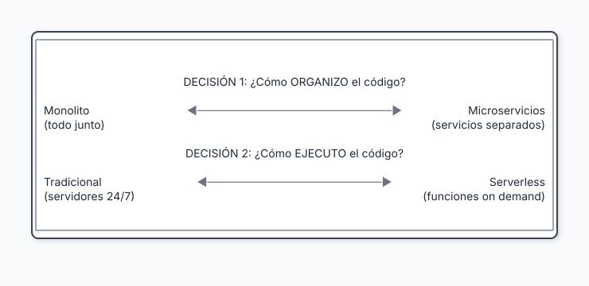

Estas dos dimensiones son **ortogonales**: puedes combinarlas de cualquier manera. Veamos cada una.

---

### Decisión 1: Organización del código

Esta decisión responde: *¿Cómo divido las responsabilidades de mi aplicación?*

#### Monolito

Todo el código del servidor vive en una sola aplicación, un solo repositorio, un solo deployment.


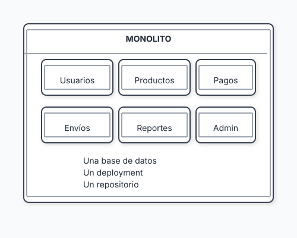

**Ventajas:**
- Simple de desarrollar y debuggear
- Una sola base de datos = transacciones ACID fáciles
- Un solo deployment = menos complejidad operacional
- Ideal para equipos pequeños

**Desventajas:**
- Todo escala junto (aunque solo necesites escalar una parte)
- Un error puede tumbar todo el sistema
- El código tiende a acoplarse con el tiempo
- Deployments más riesgosos a medida que crece

#### Microservicios

La aplicación se divide en servicios pequeños e independientes que se comunican por red.


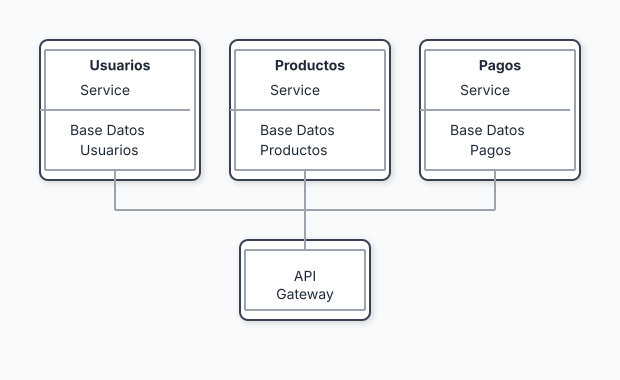

**Ventajas:**
- Escala independiente por servicio
- Equipos pueden trabajar de forma autónoma
- Fallo aislado (un servicio puede caer sin tumbar todo)
- Libertad tecnológica por servicio

**Desventajas:**
- Complejidad operacional masiva
- Latencia de red entre servicios
- Transacciones distribuidas son difíciles
- Debugging es más complicado

⚠️ **Advertencia**: Los microservicios resuelven problemas **organizacionales**, no técnicos. Si tienes un equipo de 5 personas, probablemente no necesitas microservicios. La regla informal: considera microservicios cuando tengas más desarrolladores que los que pueden trabajar efectivamente en un solo repositorio (~10-15 personas).

---

### Decisión 2: Modelo de ejecución

Esta decisión responde: *¿Cómo y dónde corre mi código?*

#### Servidores tradicionales

Tu aplicación corre como un proceso (o varios) en servidores que están encendidos 24/7, esperando peticiones.


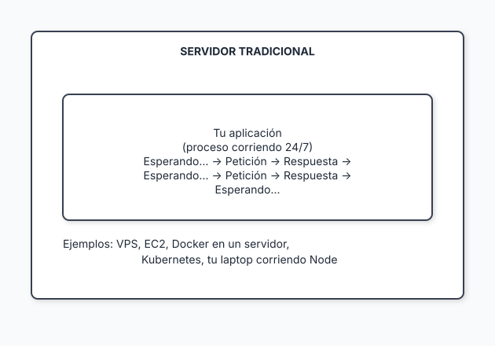

**Ventajas:**
- Control total sobre el ambiente
- Sin cold starts (siempre listo)
- Costo predecible
- Conexiones persistentes fáciles (WebSockets)
- Sin límites de tiempo de ejecución

**Desventajas:**
- Pagas aunque no haya tráfico
- Tú manejas el escalado
- Mantenimiento de servidores (actualizaciones, seguridad)

#### Serverless (Functions as a Service)

Tu código se empaqueta como funciones que se ejecutan **solo cuando hay una petición**. El proveedor maneja todo lo demás.


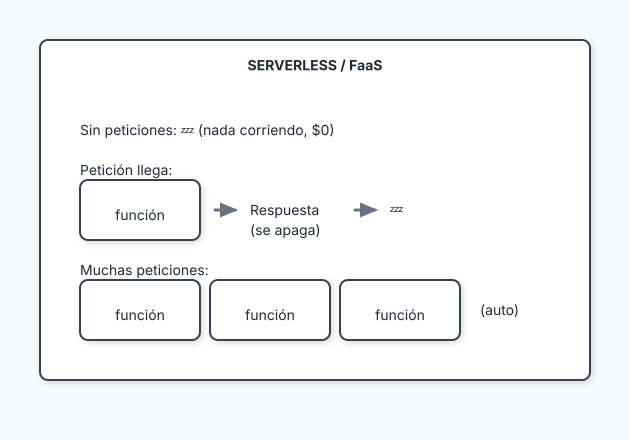

📖 **Concepto**: ¿Qué es una "Lambda"? **AWS Lambda** fue el primer servicio popular de este tipo (lanzado en 2014). El nombre viene de la letra griega λ, usada en programación funcional para representar funciones anónimas. Hoy "Lambda" se usa coloquialmente como sinónimo de "función serverless", aunque cada proveedor tiene su nombre: Vercel Functions, Cloudflare Workers, Google Cloud Functions, Azure Functions. Todos funcionan igual: tu código duerme hasta que llega una petición, se ejecuta, responde, y vuelve a dormir.

**Ventajas:**
- No manejas servidores
- Escala a cero (no pagas si no hay tráfico)
- Escala automáticamente bajo carga
- Menos código de infraestructura

**Desventajas:**
- Cold starts (latencia cuando la función "despierta")
- Límites de tiempo de ejecución (típicamente 10-30 segundos)
- Vendor lock-in
- WebSockets y conexiones persistentes son más difíciles

---

### La matriz: combinando las dos decisiones

Aquí está la clave conceptual: **puedes combinar cualquier organización con cualquier ejecución**.


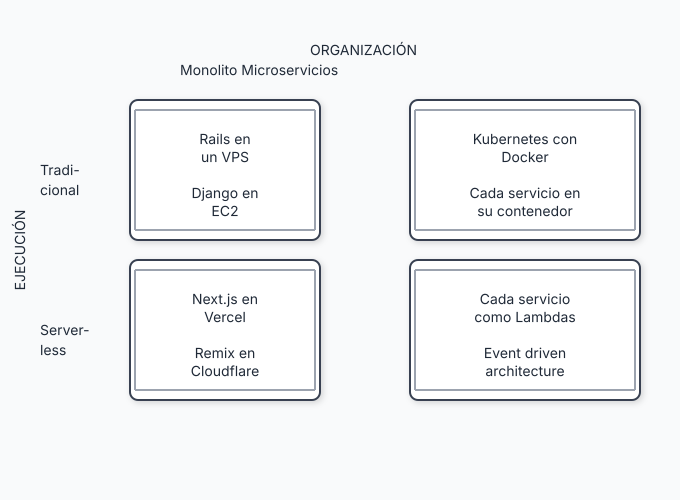

📖 **Concepto**: Next.js desplegado en Vercel es un **monolito serverless**: organización de monolito (un repo, un proyecto, frontend y API juntos) con ejecución serverless (cada ruta es una función Lambda).

### Ejemplos del mundo real

| Combinación | Ejemplo | Por qué funciona |
|-------------|---------|------------------|
| **Monolito + Tradicional** | Basecamp (Rails), Shopify | Simplicidad, equipo cohesivo, control total |
| **Monolito + Serverless** | Next.js en Vercel, Remix en Cloudflare | Simplicidad de desarrollo + escala automática |
| **Microservicios + Tradicional** | Netflix, Uber (Kubernetes) | Múltiples equipos, escala masiva, control fino |
| **Microservicios + Serverless** | Backend distribuido en AWS Lambda | Escala por servicio, pago granular por uso |

---

### Guía de decisión

Ahora que entiendes que son dos decisiones separadas, aquí está cómo tomar cada una:


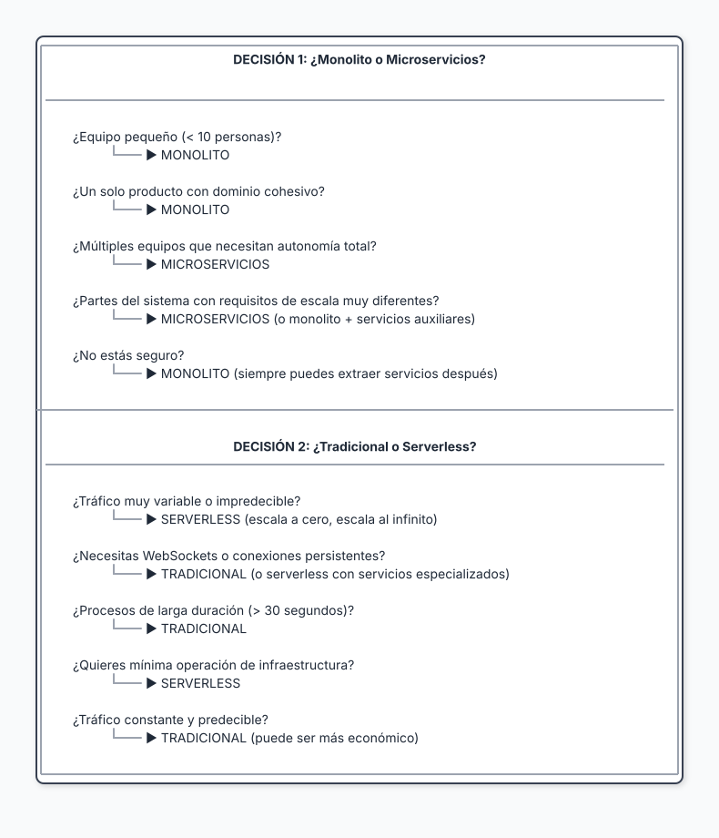

---

## El viaje de una petición

Veamos qué sucede cuando un usuario hace clic en "Ver mi perfil" en una aplicación típica.

### Paso a paso


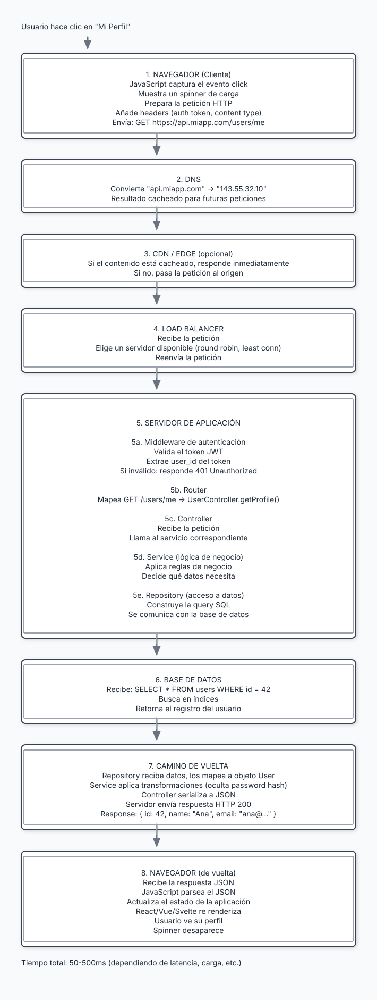

### ¿Dónde puede fallar?

Cada paso es un punto potencial de falla:

| Paso | Posibles fallas |
|------|-----------------|
| DNS | Timeout, dominio expirado |
| Red | Conexión lenta, pérdida de paquetes |
| Load Balancer | Ningún servidor disponible |
| Autenticación | Token expirado, inválido |
| Servidor | Error en código, out of memory |
| Base de datos | Query lenta, conexión agotada |
| Respuesta | Timeout del cliente |

💡 **Insight**: Entender este flujo completo te ayuda a debuggear problemas. Cuando algo falla, puedes preguntarte: "¿En qué paso está fallando?" y acotar el problema rápidamente.

---

## El stack moderno: piezas comunes

Una aplicación web moderna típicamente incluye:

### Frontend
| Categoría | Opciones populares (2025) |
|-----------|---------------------------|
| Framework | React, Vue, Svelte, Solid |
| Meta-framework | Next.js, Nuxt, SvelteKit, Astro |
| Estilos | Tailwind CSS, CSS Modules, Styled Components |
| Estado | Zustand, Jotai, Redux Toolkit, TanStack Query |

### Backend
| Categoría | Opciones populares (2025) |
|-----------|---------------------------|
| Runtime | Node.js, Deno, Bun, Python, Go |
| Framework | Express, Fastify, Hono, FastAPI, Gin |
| ORM | Prisma, Drizzle, SQLAlchemy, GORM |
| Validación | Zod, Yup, Pydantic |

### Datos
| Categoría | Opciones populares (2025) |
|-----------|---------------------------|
| SQL | PostgreSQL, MySQL, SQLite |
| NoSQL | MongoDB, DynamoDB, Firestore |
| Cache | Redis, Memcached |
| Búsqueda | Elasticsearch, Meilisearch, Algolia |

### Infraestructura
| Categoría | Opciones populares (2025) |
|-----------|---------------------------|
| Hosting | Vercel, Railway, Fly.io, AWS, GCP |
| CDN | Cloudflare, Fastly, AWS CloudFront |
| Contenedores | Docker, Kubernetes |
| CI/CD | GitHub Actions, GitLab CI, CircleCI |

⚠️ **Advertencia**: Esta lista cambia constantemente. No intentes aprenderlo todo. Elige un stack, domínalo, y expande gradualmente.

---

## Resumen

- Una aplicación web es un **sistema distribuido**: múltiples programas comunicándose por red
- La división **cliente-servidor** sigue siendo fundamental: cliente pide, servidor responde
- Las aplicaciones tienen **capas** (presentación, API, lógica de negocio, datos) para separar responsabilidades
- La arquitectura implica **dos decisiones ortogonales**: organización (monolito vs microservicios) y ejecución (tradicional vs serverless)—se pueden combinar
- Una petición atraviesa múltiples componentes; entender este flujo es clave para debuggear
- El stack moderno tiene muchas opciones; elige uno y domínalo antes de explorar otros

---

## Ejercicios

1. **Diagrama mental**: Dibuja en papel el flujo completo de una petición en una aplicación que conozcas (puede ser una que uses diariamente). Identifica cada componente.

2. **Investigación**: Elige una empresa tech que admires. Investiga qué arquitectura usan (monolito, microservicios, híbrida). ¿Por qué crees que eligieron esa opción?

3. **Análisis de stack**: Mira los requisitos de trabajo de 5 ofertas de empleo para desarrollador web en tu región. ¿Qué tecnologías se repiten más?

---

## Referencias

- Fowler, M. (2014). *Microservices* — https://martinfowler.com/articles/microservices.html
- Kleppmann, M. (2017). *Designing Data-Intensive Applications*. O'Reilly.
- Newman, S. (2021). *Building Microservices*, 2nd Edition. O'Reilly.

---

**Anterior**: [La Evolución del Desarrollador Web](./01-evolucion-desarrollador.md) | **Siguiente**: [Pensamiento en Sistemas](./03-pensamiento-sistemas.md)
