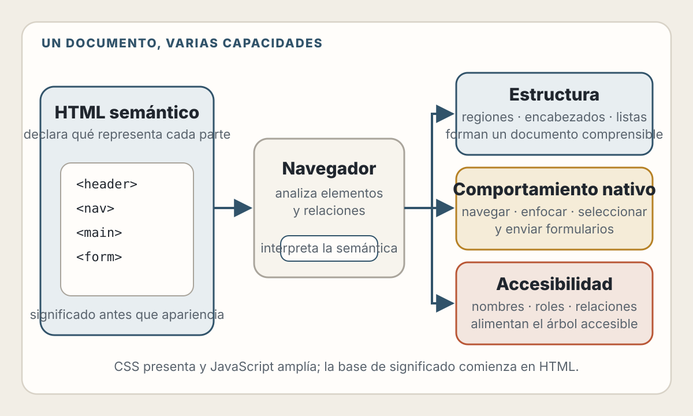
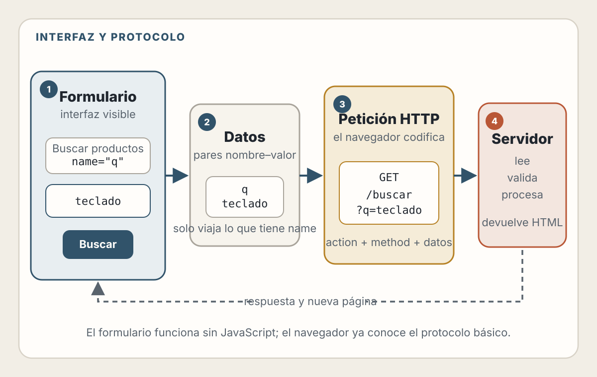
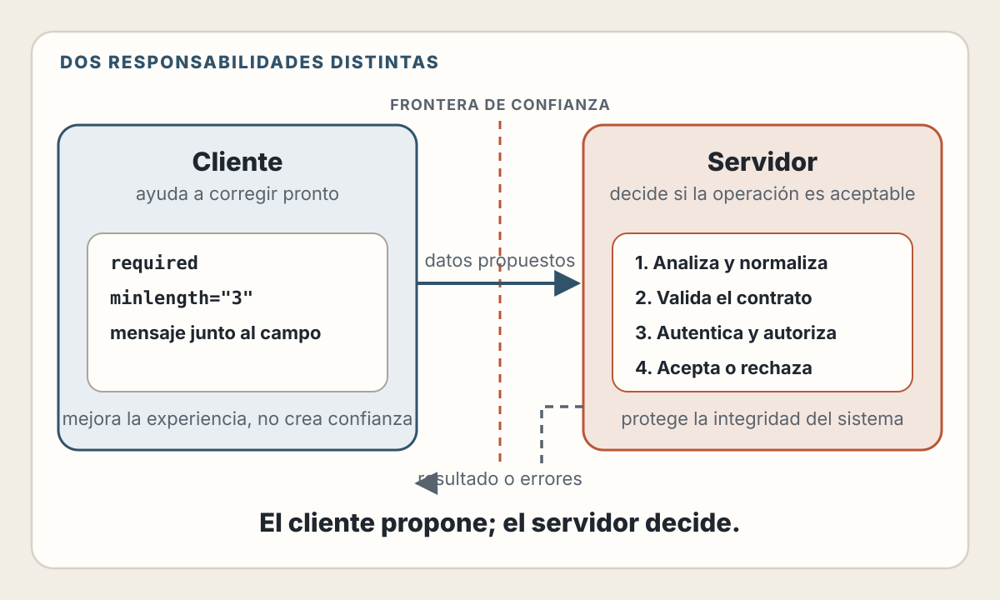
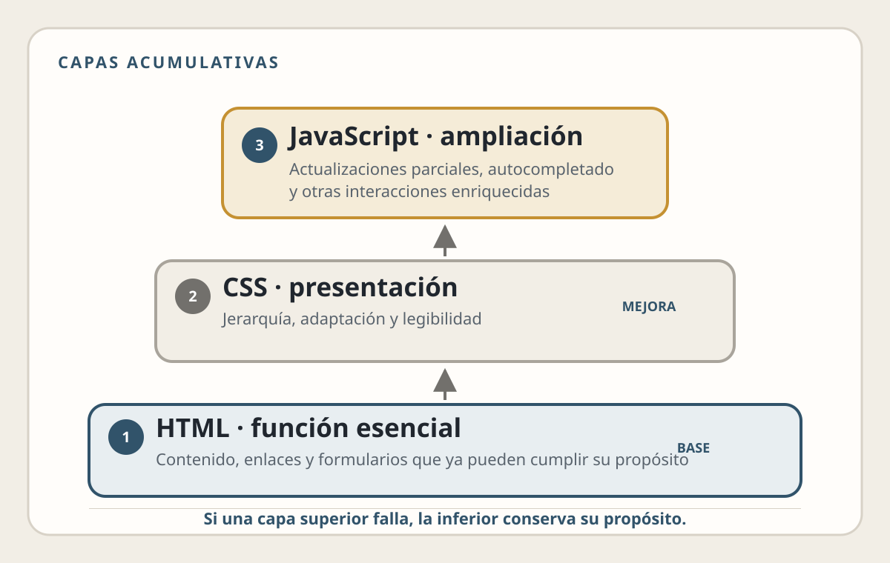

# 2. HTML Semántico, Formularios y Mejora Progresiva

> Antes de elegir un framework, aprende el lenguaje que el navegador ya entiende.

## Objetivos de Aprendizaje

Al finalizar este capítulo, serás capaz de:

- Tratar HTML como una capa de significado y comportamiento, no solo como una forma de dibujar cajas
- Estructurar una página para que sea comprensible por navegadores y tecnologías de asistencia
- Elegir entre enlaces, botones y controles de formulario según su comportamiento nativo
- Construir formularios que funcionen antes de añadir JavaScript
- Distinguir validación para experiencia de usuario de validación para seguridad
- Aplicar mejora progresiva para crear aplicaciones más resilientes
- Revisar con criterio el HTML generado por una herramienta de IA

---

## Modelo Mental: HTML Es el Contrato Inicial

Una página web atraviesa varias representaciones:

1. El servidor envía bytes.
2. El navegador interpreta esos bytes como HTML.
3. Construye el DOM.
4. Asigna significado y comportamiento a los elementos.
5. Aplica CSS.
6. Ejecuta JavaScript.
7. Expone una representación a las tecnologías de asistencia.

HTML participa desde el principio. Si el documento ya contiene una estructura clara y controles con comportamiento nativo, la página conserva una base útil incluso cuando el CSS tarda, un script falla o la red es inestable.

📖 **Concepto:** HTML es un lenguaje de marcado. Describe qué representa cada parte del documento: un encabezado, una navegación, un artículo, un botón, un campo o una tabla. CSS decide principalmente cómo se presenta y JavaScript amplía cómo se comporta.

Esta separación no es absoluta, pero constituye un modelo mental valioso:

| Capa | Pregunta principal | Ejemplos |
|------|--------------------|----------|
| HTML | ¿Qué es esto? | Navegación, título, botón, formulario |
| CSS | ¿Cómo se presenta? | Color, tamaño, layout, adaptación |
| JavaScript | ¿Cómo se amplía su comportamiento? | Autocompletado, actualización parcial, drag and drop |

<picture>
  <source media="(max-width: 820px)" srcset="../assets/diagrams/cap02-html-contrato-mobile.svg">
  
</picture>

Un `<button>` sin CSS sigue siendo un botón. Un `<div>` con apariencia de botón sigue siendo un contenedor sin el comportamiento completo de un botón.

### El navegador ya incluye una biblioteca de componentes

Antes de instalar dependencias, la plataforma ofrece:

- Enlaces que pueden abrirse en otra pestaña, copiarse y visitarse con el teclado
- Botones activables con teclado, ratón, tacto y tecnologías de asistencia
- Campos con teclados móviles adaptados al tipo de dato
- Formularios con envío, validación básica y serialización de datos
- Elementos desplegables como `<details>`
- Diálogos, barras de progreso, medidores y contenido multimedia

Estos componentes no resuelven todas las necesidades de producto, pero ofrecen semántica, comportamiento y compatibilidad como punto de partida.

💡 **Insight:** cuanto más se aproxima un requisito a un control nativo, mayor es el costo oculto de reconstruirlo desde cero. Ese costo incluye teclado, foco, estados, accesibilidad, dispositivos táctiles, traducción y pruebas entre navegadores.

---

## La Estructura de un Documento

Un documento mínimo debería declarar su tipo, idioma, codificación y configuración de viewport:

```html
<!doctype html>
<html lang="es">
  <head>
    <meta charset="utf-8">
    <meta name="viewport" content="width=device-width, initial-scale=1">
    <title>Panel de pedidos</title>
  </head>
  <body>
    <h1>Panel de pedidos</h1>
  </body>
</html>
```

Cada pieza cumple una función:

- `<!doctype html>` activa el modo estándar del navegador.
- `lang="es"` identifica el idioma principal del documento.
- `charset="utf-8"` permite interpretar correctamente los caracteres.
- `viewport` hace que el layout responda al ancho real del dispositivo.
- `<title>` identifica la página en pestañas, historial y marcadores.
- `<h1>` presenta el tema principal dentro del contenido.

⚠️ **Advertencia:** el título visible y el `<title>` no son intercambiables. Uno pertenece al contenido; el otro identifica el documento en el navegador.

### Regiones reconocibles

HTML incluye elementos para describir las regiones habituales:

```html
<body>
  <header>
    <a href="/">Acme</a>
    <nav aria-label="Principal">
      <a href="/productos">Productos</a>
      <a href="/pedidos">Pedidos</a>
    </nav>
  </header>

  <main>
    <h1>Pedidos recientes</h1>

    <section aria-labelledby="pending-title">
      <h2 id="pending-title">Pendientes</h2>
      <!-- Lista de pedidos -->
    </section>
  </main>

  <footer>
    <a href="/privacidad">Privacidad</a>
  </footer>
</body>
```

Los nombres importan:

- `<header>` introduce una página o sección.
- `<nav>` agrupa enlaces de navegación importantes.
- `<main>` contiene el propósito dominante de la página.
- `<section>` agrupa contenido temático, normalmente con un encabezado.
- `<article>` representa contenido que conserva sentido por sí mismo.
- `<aside>` contiene información relacionada pero secundaria.
- `<footer>` cierra una página o sección con información complementaria.

No necesitas reemplazar cada `<div>`. Un `<div>` es apropiado cuando solo necesitas agrupar elementos para layout o scripting y no existe una semántica más precisa.

### Los encabezados forman un mapa

Los encabezados no son tamaños tipográficos. Expresan jerarquía:

```html
<h1>Configuración de la cuenta</h1>

<h2>Perfil</h2>
<h3>Nombre público</h3>
<h3>Fotografía</h3>

<h2>Seguridad</h2>
<h3>Contraseña</h3>
<h3>Sesiones activas</h3>
```

Una convención clara es usar un `h1` para el tema principal y descender niveles sin saltos arbitrarios. CSS puede cambiar el tamaño visual sin alterar esa jerarquía.

🛠️ **Práctica:** navega una página usando únicamente sus encabezados. Si la lista resultante no explica la estructura del contenido, el problema es editorial antes que visual.

---

## Semántica Interactiva: Enlace o Botón

Una de las decisiones más frecuentes del frontend puede resolverse con dos preguntas:

1. ¿La acción lleva a otro recurso o URL?
2. ¿La acción cambia algo en la interfaz o en el sistema?

### Usa un enlace para navegar

```html
<a href="/pedidos/123">Ver pedido</a>
```

Un enlace tiene una dirección. El navegador permite abrirlo en otra pestaña, copiar su destino, guardarlo como marcador y mostrarlo en el historial.

No simules navegación con un contenedor y un evento:

```html
<!-- Incorrecto -->
<div onclick="location.href='/pedidos/123'">Ver pedido</div>
```

Además de perder semántica, esta versión no ofrece por sí sola las capacidades habituales de un enlace.

### Usa un botón para ejecutar una acción

```html
<button type="button">Abrir filtros</button>
```

Un botón comunica que ocurrirá una acción. El navegador ya aporta foco, activación mediante teclado y un rol reconocible.

Dentro de un formulario, declara el tipo explícitamente:

```html
<button type="submit">Guardar</button>
<button type="button">Añadir otro teléfono</button>
```

Un `<button>` asociado a un formulario se comporta como botón de envío si no se especifica otro tipo. Escribir `type` evita envíos accidentales y hace visible la intención.

### Evita reconstruir controles con ARIA

ARIA puede comunicar roles, estados y relaciones a tecnologías de asistencia, pero no añade automáticamente comportamiento de teclado:

```html
<!-- Parece prometer un botón, pero todavía no se comporta como uno -->
<div role="button">Guardar</div>
```

Para igualar un botón nativo tendrías que implementar, probar y mantener foco, activación por teclado, estados deshabilitados y otras expectativas.

📖 **Regla práctica:** primero busca un elemento HTML nativo. Añade ARIA cuando necesites expresar información que la semántica nativa no puede comunicar por sí sola.

---

## Semántica para Contenido y Datos

### Listas

Si el orden importa, usa una lista ordenada:

```html
<ol>
  <li>Confirma el correo electrónico.</li>
  <li>Configura la autenticación multifactor.</li>
  <li>Guarda los códigos de recuperación.</li>
</ol>
```

Si el orden no importa, usa `<ul>`. Un conjunto visual de tarjetas puede seguir siendo una lista si conceptualmente representa una colección.

### Tablas

Las tablas son apropiadas para datos con relaciones entre filas y columnas:

```html
<table>
  <caption>Facturas de julio</caption>
  <thead>
    <tr>
      <th scope="col">Número</th>
      <th scope="col">Fecha</th>
      <th scope="col">Total</th>
    </tr>
  </thead>
  <tbody>
    <tr>
      <th scope="row">F-1042</th>
      <td>15 de julio</td>
      <td>89,00 CAD</td>
    </tr>
  </tbody>
</table>
```

No uses tablas para maquetar columnas. CSS dispone de herramientas más apropiadas y una tabla comunica relaciones tabulares.

### Imágenes

El atributo `alt` comunica la alternativa textual:

```html

```

El texto alternativo depende del propósito, no solo de lo que contiene la imagen:

- Una imagen informativa necesita transmitir la información relevante.
- Una imagen decorativa puede usar `alt=""`.
- Una imagen que funciona como enlace necesita describir el destino o la acción.
- Un gráfico complejo suele necesitar una explicación cercana además de un `alt` breve.

Esto será especialmente importante cuando los diagramas actuales del libro se reemplacen por un sistema visual consistente.

---

## Formularios: Una Interfaz y un Protocolo

Un formulario no es solamente un conjunto de campos. También define cómo el navegador construye y envía una petición.

```html
<form action="/buscar" method="get">
  <label for="query">Buscar productos</label>
  <input id="query" name="q" type="search">
  <button type="submit">Buscar</button>
</form>
```

Cuando se envía:

1. El navegador identifica los controles que pertenecen al formulario.
2. Construye pares de nombre y valor.
3. Codifica los datos.
4. Crea una petición para la URL de `action`.
5. Navega a la respuesta.

Si el usuario busca `teclado`, la URL resultante puede ser:

```text
/buscar?q=teclado
```

<picture>
  <source media="(max-width: 820px)" srcset="../assets/diagrams/cap02-formulario-peticion-mobile.svg">
  
</picture>

El atributo `name` es crucial: determina el nombre con el que se envía el valor. Un campo con `id` pero sin `name` puede estar asociado a una etiqueta y aun así no participar en los datos enviados.

### GET y POST expresan intenciones distintas

Usa `GET` para pedir datos o contenido sin solicitar un cambio de estado:

```html
<form action="/buscar" method="get">
  <!-- Los parámetros aparecen en la URL -->
</form>
```

Esto permite compartir, guardar y repetir la búsqueda.

Usa `POST` para solicitar una operación que crea o modifica estado:

```html
<form action="/cuenta/perfil" method="post">
  <!-- Los datos se envían en el cuerpo de la petición -->
</form>
```

⚠️ **Advertencia de seguridad:** usar `POST` no cifra los datos ni impide ataques. TLS protege el tránsito; la aplicación todavía debe autenticar, autorizar, validar, limitar abuso y proteger operaciones sensibles contra solicitudes falsificadas cuando corresponda.

### Etiquetas visibles y relaciones explícitas

Cada control necesita un nombre comprensible:

```html
<label for="email">Correo electrónico</label>
<input
  id="email"
  name="email"
  type="email"
  autocomplete="email"
  required
>
```

La relación entre `for="email"` e `id="email"`:

- Permite activar o enfocar el control al seleccionar la etiqueta
- Aumenta el área interactiva
- Comunica el nombre del campo a tecnologías de asistencia

Un `placeholder` no sustituye a una etiqueta. Desaparece al escribir, puede tener contraste insuficiente y no siempre comunica bien el propósito.

### Agrupa opciones relacionadas

```html
<fieldset>
  <legend>Frecuencia del resumen</legend>

  <label>
    <input type="radio" name="frequency" value="daily">
    Diario
  </label>

  <label>
    <input type="radio" name="frequency" value="weekly">
    Semanal
  </label>
</fieldset>
```

`fieldset` y `legend` comunican que varias opciones forman una pregunta común. Compartir el mismo `name` hace que los botones de radio constituyan un grupo de selección única.

### Elige tipos y atributos que expresen la restricción

```html
<label for="team-size">Tamaño del equipo</label>
<input
  id="team-size"
  name="teamSize"
  type="number"
  min="1"
  max="500"
  step="1"
  required
>
```

Los atributos nativos aportan información al navegador:

- `type="email"` espera una dirección de correo con sintaxis básica válida.
- `type="url"` espera una URL.
- `type="number"` representa una cantidad numérica.
- `required` exige un valor antes del envío interactivo.
- `min`, `max` y `step` acotan rangos numéricos o temporales.
- `minlength` y `maxlength` expresan límites de longitud.
- `autocomplete` ayuda al navegador a completar datos conocidos.

No elijas un tipo por el teclado visual que produce en un dispositivo. El tipo también define semántica, conversión de valor y validación. Para códigos postales o números de documento, que no son cantidades matemáticas, suele ser más apropiado un campo textual acompañado de atributos como `inputmode`.

---

## Validación: Ayuda en el Cliente, Autoridad en el Servidor

La validación responde a preguntas diferentes:

- **¿Puede el navegador ayudar al usuario a corregir un dato pronto?**
- **¿Puede el servidor aceptar esta operación de forma segura?**

La primera mejora la experiencia. La segunda protege la integridad del sistema.

<picture>
  <source media="(max-width: 820px)" srcset="../assets/diagrams/cap02-validacion-fronteras-mobile.svg">
  
</picture>

### Validación declarativa

```html
<label for="username">Nombre de usuario</label>
<input
  id="username"
  name="username"
  type="text"
  minlength="3"
  maxlength="30"
  pattern="[A-Za-z0-9_-]+"
  aria-describedby="username-help"
  required
>
<p id="username-help">
  Entre 3 y 30 caracteres: letras, números, guion o guion bajo.
</p>
```

El navegador puede impedir el envío interactivo cuando el valor no satisface las restricciones. JavaScript también puede consultar APIs como `checkValidity()` y `reportValidity()`.

Sin embargo, cualquier persona o programa puede modificar el HTML, desactivar JavaScript o construir una petición HTTP manual. Por eso el servidor debe validar nuevamente:

```javascript
// Ejemplo conceptual: la API decide si el dato es aceptable.
function parseUsername(value) {
  if (typeof value !== 'string') {
    throw new ValidationError('El nombre de usuario es obligatorio');
  }

  const normalized = value.trim();

  if (!/^[A-Za-z0-9_-]{3,30}$/.test(normalized)) {
    throw new ValidationError('El nombre de usuario no tiene un formato válido');
  }

  return normalized;
}
```

📖 **Principio:** los datos del cliente son una propuesta. Solo se convierten en datos confiables después de ser analizados, validados y autorizados por el sistema que los recibe.

### Los mensajes deben permitir corregir

“Formulario inválido” informa que algo falló, pero no ayuda. Un mensaje útil identifica el campo, explica el problema, indica cómo resolverlo y conserva los datos válidos ya introducidos.

```html
<label for="start-date">Fecha de inicio</label>
<input
  id="start-date"
  name="startDate"
  type="date"
  aria-describedby="start-date-error"
  aria-invalid="true"
>
<p id="start-date-error">
  Elige una fecha igual o posterior al 1 de agosto de 2026.
</p>
```

No dependas únicamente del color rojo. El texto, la relación programática y el foco deben comunicar el error.

### Validar no es sanitizar

Estos conceptos suelen confundirse:

- **Validar:** decidir si un valor cumple el contrato.
- **Normalizar:** convertir representaciones equivalentes a una forma consistente.
- **Escapar o codificar:** representar un valor de manera segura para un contexto de salida.
- **Sanitizar:** eliminar o transformar partes peligrosas cuando se permite un subconjunto de contenido.

Una cadena válida para un comentario no es automáticamente segura al insertarla como HTML, SQL, una URL o un comando. La protección depende del contexto de uso.

---

## Mejora Progresiva: Construir desde una Base Funcional

📖 **Concepto:** la mejora progresiva ofrece primero el contenido y la funcionalidad esencial, y añade experiencias más ricas cuando el navegador, la conexión y el código lo permiten.

No significa diseñar para navegadores antiguos. Significa reconocer que las capacidades pueden fallar de forma independiente:

- El HTML puede llegar antes que el JavaScript.
- Un paquete puede fallar al descargarse.
- Una extensión puede bloquear un recurso.
- La conexión puede interrumpirse durante una interacción.
- Una API puede no estar disponible en un contexto concreto.
- Un error en un componente puede impedir la hidratación.

### Tres capas

Una estrategia sencilla:

1. **Base:** contenido, enlaces y formularios HTML funcionales.
2. **Presentación:** CSS que mejora jerarquía, adaptación y legibilidad.
3. **Comportamiento:** JavaScript que reduce latencia percibida o añade capacidades.

La capa superior no debería borrar innecesariamente las garantías de la inferior.

<picture>
  <source media="(max-width: 820px)" srcset="../assets/diagrams/cap02-mejora-progresiva-mobile.svg">
  
</picture>

### Ejemplo: búsqueda mejorada

La base funciona mediante navegación:

```html
<form action="/buscar" method="get" role="search" id="search-form">
  <label for="search-query">Buscar en el catálogo</label>
  <input id="search-query" name="q" type="search" required>
  <button type="submit">Buscar</button>
</form>

<section aria-live="polite" aria-labelledby="results-title">
  <h2 id="results-title">Resultados</h2>
  <div id="search-results"></div>
</section>
```

Sin JavaScript, el navegador visita `/buscar?q=...` y el servidor devuelve una página de resultados. Después puedes mejorar la interacción:

```javascript
// Ejemplo conceptual: requiere que el servidor también pueda devolver JSON.
const form = document.querySelector('#search-form');
const results = document.querySelector('#search-results');

if (form && results && 'fetch' in window) {
  form.addEventListener('submit', async (event) => {
    if (!form.checkValidity()) return;

    event.preventDefault();

    const url = new URL(form.action, window.location.origin);
    url.search = new URLSearchParams(new FormData(form)).toString();

    try {
      const response = await fetch(url, {
        headers: { Accept: 'application/json' }
      });

      if (!response.ok) throw new Error(`HTTP ${response.status}`);

      const data = await response.json();
      results.replaceChildren(renderResults(data.items));
      history.pushState(null, '', url);
    } catch {
      // GET es seguro de repetir: recuperamos el comportamiento de navegación.
      window.location.assign(url);
    }
  });
}
```

La mejora evita una navegación completa cuando todo funciona. Si el script no carga, el formulario nativo sigue disponible. Si la petición mejorada falla, la operación `GET` puede recuperarse mediante navegación.

⚠️ **Advertencia:** no repitas automáticamente una petición que modifica estado después de un fallo ambiguo. Si la conexión se perdió, el servidor pudo haber procesado la operación aunque el cliente no recibiera la respuesta. La recuperación de `POST`, pagos o creación de recursos requiere idempotencia y un diseño explícito.

### Mejora progresiva no significa experiencia idéntica

La experiencia base puede ser más sencilla:

- Navegación completa en lugar de actualización parcial
- Selector nativo en lugar de componente personalizado
- Carga manual en lugar de actualización en tiempo real
- Texto y tabla en lugar de visualización interactiva

El objetivo no es que todas las capacidades sean idénticas. Es conservar el propósito esencial y comunicar con claridad las limitaciones.

---

## Un Ejemplo Integrado: Solicitud de Soporte

El siguiente ejemplo es **conceptual**. Muestra el contrato del documento, pero no incluye autenticación, protección contra abuso, almacenamiento ni el handler del servidor.

```html
<main>
  <h1>Solicitar soporte</h1>
  <p id="form-intro">
    Describe el problema. Los campos marcados como obligatorios deben completarse.
  </p>

  <form action="/solicitudes" method="post" aria-describedby="form-intro">
    <div>
      <label for="subject">Asunto</label>
      <input
        id="subject"
        name="subject"
        type="text"
        minlength="5"
        maxlength="120"
        required
      >
    </div>

    <div>
      <label for="description">Descripción</label>
      <textarea
        id="description"
        name="description"
        rows="8"
        minlength="20"
        aria-describedby="description-help"
        required
      ></textarea>
      <p id="description-help">
        Indica qué esperabas, qué ocurrió y cómo podemos reproducirlo.
      </p>
    </div>

    <fieldset>
      <legend>Impacto</legend>

      <label>
        <input type="radio" name="impact" value="low" required>
        Bajo: puedo continuar trabajando
      </label>

      <label>
        <input type="radio" name="impact" value="medium">
        Medio: una función importante no está disponible
      </label>

      <label>
        <input type="radio" name="impact" value="high">
        Alto: no puedo continuar trabajando
      </label>
    </fieldset>

    <button type="submit">Enviar solicitud</button>
  </form>
</main>
```

Antes de considerarlo listo para producción, todavía debes decidir:

- Quién puede crear solicitudes
- Cómo se valida y normaliza cada campo en el servidor
- Cómo se evita el spam y el abuso
- Qué sucede ante envíos duplicados
- Qué datos pueden incluir información personal
- Cuánto tiempo se conservan los datos
- Cómo se muestran errores del servidor sin perder lo ya escrito
- Cómo se confirma el resultado

💡 **Insight:** el HTML correcto no reemplaza el diseño del sistema. Hace que las decisiones de interfaz y contrato sean más explícitas.

---

## La IA Puede Generar HTML Válido y Aun Así Equivocarse

Las herramientas de IA suelen producir interfaces visualmente convincentes. Eso no garantiza que el documento tenga una estructura adecuada.

### Fallos frecuentes

Revisa especialmente:

- Contenedores con `onclick` en lugar de enlaces o botones
- Campos sin etiquetas visibles
- Botones sin `type`
- Formularios que solo funcionan mediante JavaScript
- `placeholder` usado como único nombre del campo
- Jerarquías de encabezados elegidas por tamaño visual
- ARIA redundante o contradictoria con el elemento nativo
- Mensajes de error que dependen únicamente del color
- Validación implementada solo en el cliente
- Datos insertados en HTML sin codificación para el contexto
- Componentes personalizados que no gestionan teclado y foco

### Un encargo más útil para revisar

En lugar de pedir “haz este formulario accesible”, proporciona criterios observables:

```text
Revisa este formulario sin cambiar su propósito.

Criterios:
- Cada control tiene una etiqueta visible y asociada.
- Los grupos de opciones usan fieldset y legend.
- Los botones declaran su tipo.
- El envío básico funciona sin JavaScript.
- La validación del cliente se describe como ayuda, no como seguridad.
- Los errores se relacionan con su campo y no dependen solo del color.
- Se prefieren elementos HTML nativos antes que roles ARIA.

Entrega:
1. Problemas encontrados con referencia al fragmento.
2. HTML corregido.
3. Verificaciones manuales con teclado y lector de pantalla.
4. Supuestos que todavía requieren confirmación.
```

La respuesta sigue necesitando verificación. Un buen encargo mejora la probabilidad de recibir algo útil; no demuestra que el resultado sea correcto.

### Evidencia mínima

Para revisar una interfaz:

1. Inspecciona el DOM resultante, no solo el código fuente o el componente.
2. Recorre los controles usando el teclado.
3. Comprueba nombres, roles y estados en el árbol de accesibilidad.
4. Prueba el formulario con JavaScript deshabilitado cuando la función esencial deba sobrevivir.
5. Envía datos inválidos directamente al servidor.
6. Verifica estados de error, carga, éxito y reintento.

---

## Decisiones y Trade-offs

### ¿Cuánta funcionalidad debe existir sin JavaScript?

No hay una respuesta universal. Depende del producto y del riesgo.

| Contexto | Base razonable |
|----------|----------------|
| Contenido público | Lectura, navegación y enlaces |
| Comercio | Consulta de productos y continuidad de operaciones críticas |
| Panel interno complejo | Documento comprensible y errores recuperables |
| Editor gráfico | Mensaje de requisitos y recuperación del trabajo |
| Flujo regulado | Acceso, instrucciones y alternativa definida |

La mejora progresiva es una estrategia de resiliencia, no una regla que obliga a replicar toda una aplicación avanzada sin JavaScript.

### ¿Control nativo o personalizado?

Prefiere el control nativo cuando cumple el comportamiento esencial, la consistencia visual exacta no es indispensable y accesibilidad o velocidad de implementación tienen prioridad.

Considera uno personalizado cuando existe una necesidad que el control nativo no cubre, el equipo puede implementar y probar teclado, foco y estados, y el valor para el usuario justifica el costo permanente.

Documenta la decisión. “El diseño lo pidió” no explica el costo ni las alternativas.

---

## Lista de Verificación

### Documento

- [ ] El idioma principal está declarado
- [ ] El `<title>` identifica la página
- [ ] Existe un encabezado principal claro
- [ ] Los encabezados describen una jerarquía comprensible
- [ ] Las regiones usan elementos semánticos cuando corresponde
- [ ] Las listas y tablas representan relaciones reales
- [ ] Las imágenes tienen una alternativa adecuada a su propósito

### Interacción

- [ ] Los enlaces navegan y tienen un `href`
- [ ] Los botones ejecutan acciones y declaran su `type`
- [ ] Los controles nativos se prefieren antes que imitaciones
- [ ] Todas las acciones esenciales pueden operarse con teclado
- [ ] El foco permanece visible y predecible

### Formularios

- [ ] Cada control tiene `name`
- [ ] Cada campo tiene una etiqueta asociada
- [ ] Las opciones relacionadas usan `fieldset` y `legend`
- [ ] `GET` y `POST` se eligen según la intención
- [ ] Los tipos y atributos expresan restricciones útiles
- [ ] Los errores identifican el problema y cómo corregirlo
- [ ] El servidor vuelve a validar y autorizar
- [ ] Los datos se codifican de forma segura al usarlos

### Mejora progresiva

- [ ] La función esencial tiene una base explícita
- [ ] JavaScript mejora el flujo en lugar de ser una dependencia accidental
- [ ] Se han probado fallos de red y carga parcial
- [ ] Los reintentos de operaciones con efectos están diseñados para evitar duplicados

---

## Resumen

- HTML describe significado, estructura y comportamiento nativo
- Los elementos semánticos reducen la cantidad de comportamiento que debes reconstruir
- Los enlaces navegan; los botones ejecutan acciones
- ARIA complementa HTML, pero no reemplaza el comportamiento de un control nativo
- Un formulario es a la vez una interfaz y un mecanismo para construir peticiones
- La validación del cliente ayuda al usuario; el servidor protege el sistema
- La mejora progresiva parte de una función esencial y añade capacidades
- La IA puede acelerar la escritura, pero el DOM, el teclado, el servidor y los fallos reales proporcionan la evidencia

---

## Ejercicios

1. **Auditoría semántica:** elige una página real y desactiva sus estilos. ¿La estructura sigue siendo comprensible? Identifica tres decisiones que pertenecen a HTML y no a CSS.

2. **Enlace o botón:** revisa diez elementos interactivos de una aplicación. Clasifícalos según naveguen o ejecuten una acción. Comprueba si el elemento utilizado coincide con esa intención.

3. **Formulario base:** construye un formulario de búsqueda que funcione con navegación tradicional. Después añade resultados parciales con JavaScript sin eliminar el comportamiento inicial.

4. **Validación hostil:** crea una petición manual que omita un campo `required`. Explica por qué el servidor debe rechazarla aunque el navegador no la generaría normalmente.

5. **Revisión con IA:** entrega un formulario a una herramienta de IA usando los criterios de este capítulo. Verifica cada cambio en el DOM y registra al menos una afirmación que necesitó corrección.

---

## Referencias

- WHATWG. *HTML Living Standard: Semantics, structure, and APIs of HTML documents* — https://html.spec.whatwg.org/
- WHATWG. *HTML Living Standard: Forms* — https://html.spec.whatwg.org/multipage/forms.html
- W3C Web Accessibility Initiative. *Forms Tutorial* — https://www.w3.org/WAI/tutorials/forms/
- W3C Web Accessibility Initiative. *ARIA Authoring Practices Guide: Read Me First* — https://www.w3.org/WAI/ARIA/apg/practices/read-me-first/
- MDN Web Docs. *Progressive enhancement* — https://developer.mozilla.org/en-US/docs/Glossary/Progressive_Enhancement
- MDN Web Docs. *Constraint validation* — https://developer.mozilla.org/en-US/docs/Web/HTML/Guides/Constraint_validation

---

**Anterior**: [Anatomía de una Aplicación Web Moderna](./01-anatomia-aplicacion.md) | **Siguiente**: [CSS, Layout Adaptable y Sistema Visual](./03-css-layout-sistema-visual.md)
