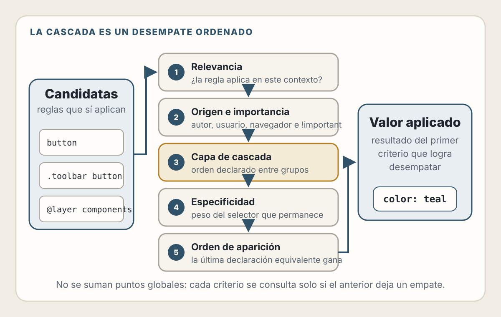
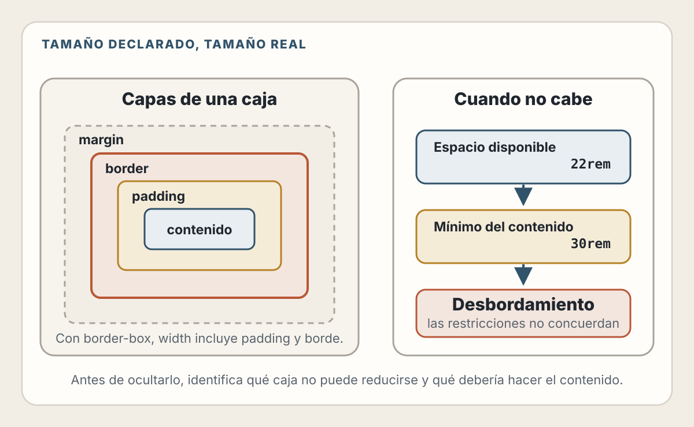
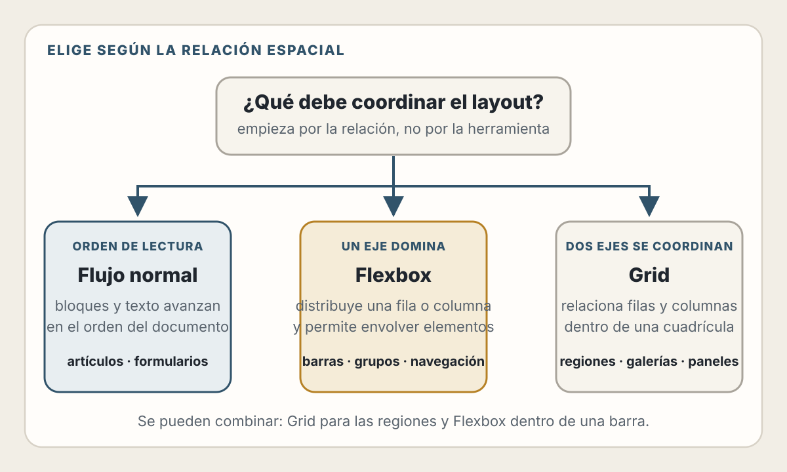
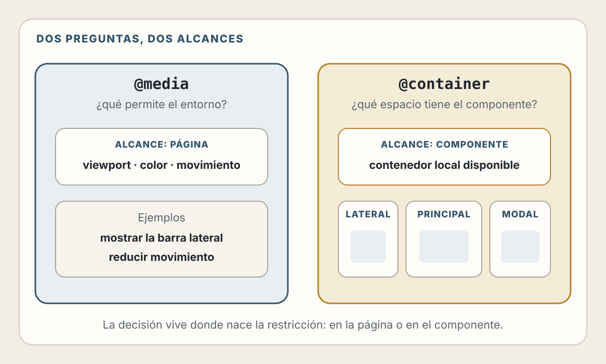

# 3. CSS, Layout Adaptable y Sistema Visual

> CSS no consiste en empujar píxeles hasta que la página “se vea bien”. Consiste en declarar cómo debe responder el documento a restricciones cambiantes.

## Objetivos de Aprendizaje

Al finalizar este capítulo, serás capaz de:

- Explicar la cascada, la herencia y la especificidad sin recurrir a prueba y error
- Razonar sobre cajas, flujo, tamaños mínimos y desbordamiento
- Elegir entre flujo normal, Flexbox y Grid según la relación espacial
- Diseñar layouts que se adapten al contenido y al espacio disponible
- Usar media queries y container queries con criterios claros
- Convertir decisiones visuales en tokens y componentes reutilizables
- Respetar preferencias de contraste, color y movimiento
- Revisar CSS generado por IA mediante evidencia del navegador

---

## Modelo Mental: Restricciones, No Capturas

Una captura representa una combinación particular:

- Un contenido concreto
- Un idioma
- Un tamaño de viewport
- Una escala de texto
- Una fuente disponible
- Un navegador
- Un estado de interacción

La interfaz real debe funcionar cuando esas variables cambian.

📖 **Concepto:** CSS es un lenguaje de reglas que participa en varios algoritmos del navegador: cascada, herencia, generación de cajas, layout, pintura y composición. Una declaración no ordena una coordenada absoluta; aporta información para resolver restricciones.

Por eso este enfoque es frágil:

```css
.card-title {
  width: 263px;
  height: 48px;
  margin-left: 17px;
}
```

Solo funciona mientras el título, la tipografía y el contenedor coincidan con el diseño original.

Una intención más adaptable podría ser:

```css
.card {
  display: grid;
  gap: 0.75rem;
  padding: clamp(1rem, 2vw, 1.5rem);
}

.card-title {
  max-inline-size: 30ch;
  text-wrap: balance;
}
```

No elimina todas las decisiones. Las expresa en términos de contenido, ritmo y espacio.

---

## La Cascada: Cómo se Decide un Valor

“Cascading” no es una palabra decorativa en el nombre de CSS. Es el mecanismo que combina reglas procedentes de diferentes lugares.

Cuando varias declaraciones intentan asignar una propiedad al mismo elemento, el navegador considera, de forma simplificada:

1. Relevancia de la regla
2. Origen e importancia
3. Capa de cascada
4. Especificidad
5. Orden de aparición

Cada criterio solo interviene si el anterior todavía deja declaraciones empatadas.

<picture>
  <source media="(max-width: 820px)" srcset="../assets/diagrams/cap03-cascada-resolucion-mobile.svg">
  
</picture>

### Herencia y valores iniciales

Algunas propiedades, como `color` y `font-family`, suelen heredarse. Otras, como `margin` o `border`, no:

```css
body {
  color: #1b2430;
  font-family: system-ui, sans-serif;
}
```

Los descendientes reciben esos valores salvo que una regla más específica los cambie.

La herencia permite definir decisiones globales sin repetirlas. También explica por qué un problema visual puede originarse varios niveles arriba.

### Especificidad

Estos selectores no tienen el mismo peso:

```css
button { color: navy; }
.toolbar button { color: teal; }
#checkout .toolbar button { color: purple; }
```

Aumentar continuamente la especificidad produce una escalada de selectores difíciles de sobrescribir. `!important` puede ser útil en casos delimitados, pero no repara una arquitectura de cascada confusa.

### Capas de cascada

Las capas permiten declarar un orden entre grupos de estilos:

```css
@layer reset, base, components, utilities;

@layer base {
  button {
    font: inherit;
  }
}

@layer components {
  .button-primary {
    background: var(--color-action);
    color: var(--color-on-action);
  }
}
```

Una regla normal en una capa posterior tiene prioridad sobre una regla normal equivalente de una capa anterior, aunque el selector anterior sea más específico. Esto reduce la necesidad de competir mediante selectores.

🛠️ **Práctica:** define el orden de las capas una sola vez. No permitas que el orden dependa accidentalmente de qué archivo terminó cargándose primero.

---

## El Modelo de Caja

Cada elemento genera una o más cajas. La caja principal puede incluir:

- Contenido
- `padding`
- `border`
- `margin`

Con el valor inicial `content-box`, `width` describe el contenido. El padding y el borde se suman:

```css
.panel {
  width: 300px;
  padding: 20px;
  border: 2px solid;
  /* Ancho exterior: 344px, sin contar márgenes */
}
```

Una base habitual es:

```css
*,
*::before,
*::after {
  box-sizing: border-box;
}
```

Con `border-box`, el tamaño declarado incluye padding y borde. Esto suele hacer más predecible la composición.

<picture>
  <source media="(max-width: 820px)" srcset="../assets/diagrams/cap03-caja-desbordamiento-mobile.svg">
  
</picture>

### Tamaño disponible y tamaño mínimo

Muchos bugs de layout no se deben al ancho deseado, sino al tamaño mínimo del contenido. Una palabra larga, una URL o una columna flex puede impedir que una caja se reduzca:

```css
.content {
  min-inline-size: 0;
}

.long-value {
  overflow-wrap: anywhere;
}
```

No apliques estas propiedades de forma ritual. Primero identifica qué caja se niega a reducirse y por qué.

### El desbordamiento comunica un contrato roto

Ocultar todo con `overflow: hidden` puede eliminar evidencia sin resolver el problema. Antes de usarlo, pregunta:

- ¿El contenido debería envolver?
- ¿La región debería desplazarse?
- ¿La caja puede crecer?
- ¿El dato necesita truncamiento y acceso al valor completo?
- ¿Existe un tamaño mínimo no previsto?

El desbordamiento es una señal de que contenido y restricciones no han llegado a un acuerdo.

---

## Flujo Normal, Flexbox y Grid

No existe un sistema de layout “mejor”. Cada uno resuelve relaciones diferentes.

<picture>
  <source media="(max-width: 820px)" srcset="../assets/diagrams/cap03-eleccion-layout-mobile.svg">
  
</picture>

### Flujo normal

El flujo normal ya coloca contenido en orden de lectura. Es la opción correcta para gran parte de un documento:

```css
.article {
  max-inline-size: 70ch;
  margin-inline: auto;
  padding-inline: 1rem;
}

.article > * + * {
  margin-block-start: 1em;
}
```

Empieza aquí. Cambia de modelo cuando exista una relación espacial que el flujo normal no exprese bien.

### Flexbox: distribución en un eje

Flexbox es apropiado cuando los elementos forman principalmente una fila o columna:

```css
.toolbar {
  display: flex;
  flex-wrap: wrap;
  align-items: center;
  gap: 0.75rem;
}

.toolbar-search {
  flex: 1 1 16rem;
}
```

Casos habituales:

- Barra de acciones
- Grupo de etiquetas
- Navegación
- Alineación de icono y texto
- Distribución de controles que pueden envolver

⚠️ **Advertencia:** `order` cambia el orden visual, no necesariamente el orden de lectura o foco. No lo uses para ocultar una estructura HTML incorrecta.

### Grid: relaciones en dos ejes

Grid es apropiado cuando filas y columnas deben coordinarse:

```css
.product-grid {
  display: grid;
  grid-template-columns: repeat(
    auto-fit,
    minmax(min(100%, 16rem), 1fr)
  );
  gap: 1.5rem;
}
```

Esta cuadrícula:

- Crea tantas columnas como quepan
- Evita que una tarjeta sea más ancha que su contenedor
- Mantiene un mínimo deseable
- Distribuye el espacio sobrante

Grid y Flexbox se combinan. Una página puede usar Grid para sus regiones y Flexbox dentro de una barra de acciones.

### Posicionamiento

`position: absolute` retira una caja del flujo. Es útil para superponer elementos vinculados a un contenedor, pero frágil para construir el esqueleto completo de una página:

```css
.field {
  position: relative;
}

.field-status {
  position: absolute;
  inset-inline-end: 0.75rem;
  inset-block-start: 50%;
  translate: 0 -50%;
}
```

Antes de posicionar absolutamente, define cuál es el bloque contenedor, qué ocurre al crecer el texto y si la superposición puede tapar contenido.

---

## Diseño Adaptable: Dejar que el Contenido Participe

“Responsive” no significa tener tres capturas: móvil, tableta y escritorio. Significa que el sistema responde a un rango continuo de condiciones.

### Unidades con propósito

| Unidad | Relación útil |
|--------|---------------|
| `rem` | Escala tipográfica raíz |
| `em` | Tamaño tipográfico del contexto |
| `%` | Tamaño disponible del contenedor |
| `ch` | Medida aproximada para longitud de línea |
| `vw`, `vh` | Dimensiones del viewport |
| `dvh` | Altura dinámica del viewport |
| `fr` | Fracción del espacio de Grid |

No existe una prohibición universal contra `px`. Es útil para bordes o detalles que no deben escalar igual que el texto. El problema aparece cuando toda la interfaz supone dimensiones rígidas.

### Tamaños fluidos con límites

```css
:root {
  --space-page: clamp(1rem, 4vw, 4rem);
  --font-heading: clamp(2rem, 1.4rem + 3vw, 4.5rem);
}

main {
  padding-inline: var(--space-page);
}
```

`clamp(mínimo, preferido, máximo)` permite interpolar dentro de límites explícitos. La interfaz no crece indefinidamente.

### Media queries

Una media query consulta características del entorno:

```css
.shell {
  display: grid;
  gap: 1rem;
}

@media (width >= 60rem) {
  .shell {
    grid-template-columns: 16rem minmax(0, 1fr);
  }
}
```

El breakpoint debería aparecer cuando el contenido deja de funcionar bien, no porque un dispositivo popular tenga cierto ancho.

Las media queries también expresan preferencias:

```css
@media (prefers-reduced-motion: reduce) {
  *,
  *::before,
  *::after {
    scroll-behavior: auto;
    animation-duration: 0.01ms;
    animation-iteration-count: 1;
  }
}

@media (prefers-color-scheme: dark) {
  :root {
    color-scheme: dark;
  }
}
```

Reducir movimiento no exige borrar toda transición. Exige evitar movimiento innecesario o problemático y conservar retroalimentación comprensible.

### Container queries

Una media query pregunta por el entorno; una container query pregunta por el contenedor:

```css
.card-region {
  container-type: inline-size;
}

.card {
  display: grid;
  gap: 1rem;
}

@container (inline-size >= 32rem) {
  .card {
    grid-template-columns: 10rem 1fr;
  }
}
```

Esto permite que el mismo componente se adapte si aparece en una columna principal, un panel lateral o un modal.

💡 **Insight:** usa media queries para decisiones de página o preferencias del usuario; usa container queries cuando la decisión pertenece al componente.

<picture>
  <source media="(max-width: 820px)" srcset="../assets/diagrams/cap03-media-container-mobile.svg">
  
</picture>

---

## Tipografía, Color y Ritmo

Un sistema visual no empieza con botones. Empieza con decisiones compartidas.

### Longitud de línea y jerarquía

```css
.prose {
  max-inline-size: 68ch;
  font-size: 1rem;
  line-height: 1.6;
}

.prose h2 {
  margin-block: 2.5em 0.75em;
  line-height: 1.2;
}
```

La legibilidad depende de:

- Tamaño y diseño de la fuente
- Longitud de línea
- Altura de línea
- Contraste
- Espacio entre grupos relacionados
- Jerarquía de encabezados

No reduzcas texto para hacer caber un diseño. Permite que el layout responda.

### El color necesita roles

Evita nombres ligados a un valor concreto:

```css
/* Frágil */
--blue-500: #2563eb;

/* Expresa intención */
--color-action: #2457d6;
--color-danger: #b42318;
--color-surface: #ffffff;
--color-text: #17202a;
```

Los tokens de rol permiten cambiar un tema sin reescribir la intención.

El color no debe ser la única señal:

```html
<p class="field-error">
  <span aria-hidden="true">⚠</span>
  La fecha de inicio es obligatoria.
</p>
```

---

## Del Estilo Aislado al Sistema Visual

Un sistema visual convierte decisiones repetidas en un vocabulario.

### Tres niveles de tokens

1. **Primitivos:** valores disponibles, como escalas de color o espacio.
2. **Semánticos:** propósito, como `--color-text-muted`.
3. **De componente:** decisiones locales, como `--button-primary-bg`.

```css
:root {
  --space-1: 0.25rem;
  --space-2: 0.5rem;
  --space-3: 0.75rem;
  --space-4: 1rem;
  --space-6: 1.5rem;

  --color-brand-600: #2457d6;
  --color-neutral-900: #17202a;
  --color-neutral-0: #ffffff;

  --color-action: var(--color-brand-600);
  --color-on-action: var(--color-neutral-0);
  --color-text: var(--color-neutral-900);
}
```

Los tokens no garantizan coherencia. También necesitas reglas:

- Cuándo usar cada rol
- Qué combinaciones cumplen contraste
- Cómo se escala el espacio
- Qué estados debe tener cada componente
- Qué decisiones pueden personalizarse

### Un componente es un contrato de estados

Un botón no está terminado porque tenga color y radio:

```css
.button {
  border: 0;
  border-radius: 0.5rem;
  padding: 0.65rem 1rem;
  font: inherit;
  font-weight: 650;
  cursor: pointer;
}

.button:focus-visible {
  outline: 3px solid color-mix(in srgb, var(--color-action), white 35%);
  outline-offset: 3px;
}

.button:disabled {
  cursor: not-allowed;
  opacity: 0.55;
}
```

Considera al menos:

- Reposo
- Hover cuando exista un puntero
- Foco visible
- Activación
- Deshabilitado
- Carga
- Error o confirmación cuando corresponda

No elimines el `outline` sin proporcionar un indicador de foco equivalente o mejor.

---

## Rendimiento y Estabilidad Visual

CSS también influye en el rendimiento percibido.

### Evita cambios de layout inesperados

Reserva espacio para recursos cuyo tamaño conoces:

```html

```

Los atributos permiten calcular una relación de aspecto antes de descargar la imagen.

### Anima propiedades deliberadamente

Cambiar layout repetidamente puede ser costoso. Para movimientos simples, `transform` y `opacity` suelen evitar parte del trabajo de layout y pintura:

```css
.menu {
  opacity: 0;
  transform: translateY(-0.5rem);
  transition: opacity 150ms ease, transform 150ms ease;
}
```

Esto no significa añadir `will-change` a todo. Reservar capas sin necesidad también consume recursos.

### Mide en el navegador real

Verifica:

- Layout en tamaños intermedios, no solo breakpoints
- Zoom y aumento de texto
- Contenido más largo y traducciones
- Carga lenta de fuentes e imágenes
- Preferencias de movimiento y color
- Estados vacíos, errores y datos extremos

---

## IA y CSS: El Peligro del Parche Plausible

La IA puede generar estilos visualmente cercanos con rapidez. También puede acumular excepciones:

- Valores mágicos
- Selectores excesivamente específicos
- `!important` para tapar conflictos
- Alturas fijas que cortan texto
- Media queries basadas en capturas aisladas
- Posicionamiento absoluto para layout principal
- Duplicación de colores y espacios
- Foco eliminado

Un mejor encargo define restricciones:

```text
Implementa este componente con CSS nativo.

Restricciones:
- Debe admitir texto 200 % y contenido traducido.
- No uses alturas fijas para contenido textual.
- Usa flujo normal, Flexbox o Grid antes de posicionamiento absoluto.
- El breakpoint debe justificarse por el contenido.
- Conserva foco visible y respeta prefers-reduced-motion.
- Reutiliza los tokens existentes.

Entrega:
1. CSS.
2. Explicación del modelo de layout.
3. Casos extremos probados.
4. Reglas que podrían eliminarse si cambia el diseño.
```

La verificación no consiste en preguntar si “se ve bien”. Inspecciona estilos computados, cajas, overflow, orden de foco y comportamiento entre tamaños.

---

## Lista de Verificación

### Cascada

- [ ] El orden de precedencia es comprensible
- [ ] Los selectores mantienen especificidad baja y predecible
- [ ] Las capas tienen un orden declarado
- [ ] `!important` tiene una razón delimitada

### Layout

- [ ] El flujo normal es el punto de partida
- [ ] Flexbox se usa para relaciones de un eje
- [ ] Grid se usa para coordinar filas y columnas
- [ ] El contenido largo no produce overflow inesperado
- [ ] El orden visual coincide con el orden lógico

### Adaptación

- [ ] El layout funciona entre breakpoints
- [ ] El texto puede aumentar sin quedar cortado
- [ ] Los componentes responden a su contenedor cuando corresponde
- [ ] Las preferencias de movimiento y color se respetan
- [ ] Los estados de carga y error conservan estabilidad

### Sistema visual

- [ ] Los tokens expresan intención
- [ ] El contraste se ha verificado
- [ ] El color no es la única señal
- [ ] Todos los estados interactivos están definidos
- [ ] El foco es visible

---

## Resumen

- CSS resuelve restricciones mediante cascada, herencia y algoritmos de layout
- El modelo de caja explica gran parte de los problemas de tamaño y overflow
- El flujo normal, Flexbox y Grid sirven para relaciones diferentes
- Un layout adaptable responde al contenido, al contenedor y a preferencias
- Los tokens convierten valores repetidos en un vocabulario visual
- Un componente incluye estados, foco y casos extremos
- La IA acelera la primera versión, pero el navegador proporciona la evidencia

---

## Ejercicios

1. **Cascada:** toma un componente con `!important` y explica qué reglas compiten. Reorganízalo con selectores más simples o capas.

2. **Layout intrínseco:** crea una cuadrícula de tarjetas que pase de una a varias columnas sin breakpoints explícitos.

3. **Container query:** utiliza la misma tarjeta en una barra lateral y en contenido principal. Haz que cambie según el contenedor.

4. **Contenido hostil:** prueba nombres de 80 caracteres, zoom de 200 %, una imagen lenta y un mensaje de error de tres líneas.

5. **Auditoría de IA:** pide una implementación a una herramienta de IA y registra cada valor mágico, estado ausente o supuesto no verificado.

---

## Referencias

- W3C. *CSS Cascading and Inheritance Level 5* — https://www.w3.org/TR/css-cascade-5/
- W3C. *CSS Flexible Box Layout Module Level 1* — https://www.w3.org/TR/css-flexbox-1/
- W3C. *CSS Grid Layout Module Level 2* — https://www.w3.org/TR/css-grid-2/
- W3C. *CSS Containment Module Level 3* — https://www.w3.org/TR/css-contain-3/
- W3C. *Media Queries Level 5* — https://www.w3.org/TR/mediaqueries-5/
- W3C. *CSS Values and Units Level 4* — https://www.w3.org/TR/css-values-4/

---

**Anterior**: [HTML Semántico, Formularios y Mejora Progresiva](./02-html-semantico-formularios.md) | **Siguiente**: [JavaScript, Eventos y Runtime del Navegador](./04-javascript-eventos-runtime.md)
