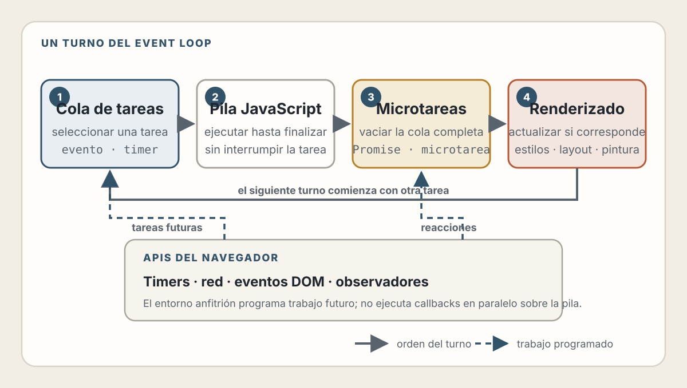

# 4. JavaScript, Eventos y Runtime del Navegador

> JavaScript no ejecuta una página por sí solo. El navegador le proporciona documentos, eventos, red, tiempo y un ciclo de ejecución.

## Objetivos de Aprendizaje

Al finalizar este capítulo, serás capaz de:

- Distinguir el lenguaje ECMAScript de las APIs proporcionadas por el navegador
- Razonar sobre pila de llamadas, tareas, microtareas y oportunidades de renderizado
- Entender propagación, comportamiento predeterminado y delegación de eventos
- Diseñar operaciones asíncronas cancelables y resistentes a respuestas fuera de orden
- Evitar bloquear el hilo principal con trabajo prolongado
- Tratar el DOM, la red y el almacenamiento como fronteras del sistema
- Revisar JavaScript generado por IA mediante estados y secuencias observables

---

## Dos Capas: Lenguaje y Entorno Anfitrión

En una aplicación web solemos llamar “JavaScript” a dos conjuntos de capacidades.

### ECMAScript

La especificación del lenguaje define, entre otras cosas:

- Valores, objetos y funciones
- Ámbitos y cierres
- Clases y prototipos
- Módulos
- Promesas
- Sintaxis de `async` y `await`
- Reglas de evaluación

### La plataforma web

El navegador proporciona APIs que no pertenecen al lenguaje:

- `document` y el DOM
- `addEventListener`
- `fetch`
- `setTimeout`
- `URL`
- `localStorage`
- `Worker`
- `requestAnimationFrame`

Este código usa ambas capas:

```javascript
const button = document.querySelector('#save');

button?.addEventListener('click', async () => {
  const response = await fetch('/api/profile');
  const profile = await response.json();
  console.log(profile.name);
});
```

`const`, funciones, promesas y `await` son parte del lenguaje. DOM, eventos y `fetch` pertenecen al entorno del navegador.

💡 **Insight:** JavaScript también se ejecuta en servidores, herramientas de build y dispositivos. Lo que cambia no es necesariamente el lenguaje, sino el conjunto de APIs y reglas que ofrece el anfitrión.

---

## Ejecución: Pila, Contextos y Finalización

Cuando se invoca una función, el motor crea un contexto de ejecución y lo coloca en una pila conceptual:

```javascript
function formatTotal(amount) {
  return addCurrency(round(amount));
}

function round(value) {
  return Math.round(value * 100) / 100;
}

function addCurrency(value) {
  return `${value.toFixed(2)} CAD`;
}

formatTotal(19.995);
```

Cada llamada debe terminar antes de que continúe la anterior. En un mismo agente de ejecución, el código activo no se interrumpe a mitad de una función para ejecutar arbitrariamente otro callback.

Esto permite razonar localmente, pero tiene una consecuencia: una operación larga bloquea otras tareas del mismo hilo.

```javascript
button.addEventListener('click', () => {
  const end = Date.now() + 5_000;

  while (Date.now() < end) {
    // Bloquea interacción y renderizado durante aproximadamente cinco segundos.
  }
});
```

El navegador puede seguir recibiendo eventos, pero el callback correspondiente no podrá ejecutarse hasta que la pila quede libre.

### Ámbito y cierres

Una función conserva acceso a las variables del entorno donde fue creada:

```javascript
function createCounter() {
  let value = 0;

  return function increment() {
    value += 1;
    return value;
  };
}

const next = createCounter();
next(); // 1
next(); // 2
```

Este cierre permite encapsular estado. También puede retener memoria y referencias al DOM más tiempo de lo necesario. Eliminar un nodo visible no garantiza que pueda liberarse si un listener, timer o colección todavía lo referencia.

---

## Módulos: Fronteras Explícitas

Los módulos permiten declarar dependencias:

```javascript
// currency.js
export function formatCurrency(amount, currency = 'CAD') {
  return new Intl.NumberFormat('es', {
    style: 'currency',
    currency
  }).format(amount);
}
```

```javascript
// order-summary.js
import { formatCurrency } from './currency.js';

export function renderOrderTotal(element, total) {
  element.textContent = formatCurrency(total);
}
```

En HTML:

```html
<script type="module" src="/scripts/order-summary.js"></script>
```

Los módulos:

- Tienen su propio ámbito
- Declaran importaciones y exportaciones
- Se evalúan una vez por módulo dentro del grafo
- Facilitan analizar dependencias
- Se cargan con semántica diferente a un script clásico

No conviertas cada función en un archivo. Una frontera de módulo debería representar una responsabilidad o contrato comprensible.

---

## El Event Loop: Coordinar Trabajo sin Ejecutarlo Todo a la Vez

El navegador coordina fuentes de trabajo como:

- Eventos de usuario
- Timers
- Respuestas de red
- Mensajes entre contextos
- Mutaciones y promesas
- Renderizado

Un modelo simplificado:

1. Seleccionar y ejecutar una tarea.
2. Cuando la pila queda vacía, realizar un checkpoint de microtareas.
3. Cuando corresponda, actualizar el renderizado.
4. Repetir.

<picture>
  <source media="(max-width: 600px)" srcset="../assets/diagrams/cap04-event-loop-mobile.svg">
  
</picture>

No debes interpretar esto como un reloj que garantiza un render después de cada tarea. El navegador decide cuándo existe una oportunidad de renderizado.

### Tareas

Eventos, timers y otros mecanismos pueden encolar tareas:

```javascript
setTimeout(() => {
  console.log('timer');
}, 0);

console.log('script');
```

El resultado empieza por `script`. Un retraso de cero no significa “ejecuta ahora”; significa que el callback podrá convertirse en trabajo futuro una vez satisfechas las reglas del timer.

### Microtareas

Las reacciones de promesas se procesan como microtareas:

```javascript
console.log('A');

queueMicrotask(() => console.log('B'));

Promise.resolve().then(() => console.log('C'));

setTimeout(() => console.log('D'), 0);

console.log('E');
```

Un resultado habitual es:

```text
A
E
B
C
D
```

Primero termina el script actual. Después se vacía la cola de microtareas antes de tomar la siguiente tarea.

⚠️ **Advertencia:** una cadena que añade microtareas sin terminar puede retrasar tareas y renderizado. “Asíncrono” no significa automáticamente “no bloqueante”.

### Renderizado

Para coordinar una actualización visual con el próximo render:

```javascript
requestAnimationFrame(() => {
  indicator.style.transform = `translateX(${progress}%)`;
});
```

`requestAnimationFrame` no es un timer de precisión. El navegador lo alinea con oportunidades de renderizado y puede reducir su frecuencia cuando la página no está visible.

---

## Eventos del DOM

Un evento comunica que algo ocurrió: activación, entrada, cambio, foco o envío.

```javascript
const form = document.querySelector('#profile-form');

form?.addEventListener('submit', (event) => {
  if (!form.checkValidity()) return;

  event.preventDefault();
  // Mejora opcional del envío nativo.
});
```

### Escucha el evento semántico

Para un formulario, escucha `submit`, no solamente el evento `click` de un
botón. El formulario también puede enviarse mediante el teclado o una API.

Para detectar un cambio confirmado en ciertos controles, `change` puede ser apropiado. Para responder a cada modificación textual, usa `input`.

La elección depende del significado, no del dispositivo.

### Propagación

Un evento atraviesa fases conceptuales:

1. Captura: desde ancestros hacia el objetivo.
2. Objetivo: el elemento donde se originó.
3. Burbujeo: desde el objetivo hacia ancestros, cuando el evento lo permite.

```html
<ul id="tasks">
  <li data-task-id="42">
    Preparar informe
    <button type="button" data-action="complete">Completar</button>
  </li>
</ul>
```

Puedes delegar la interacción:

```javascript
const list = document.querySelector('#tasks');

list?.addEventListener('click', (event) => {
  const button = event.target.closest('button[data-action="complete"]');
  if (!button || !list.contains(button)) return;

  const item = button.closest('[data-task-id]');
  if (!item) return;

  completeTask(item.dataset.taskId);
});
```

La delegación:

- Reduce listeners repetidos
- Funciona con descendientes añadidos después
- Centraliza el contrato de interacción

No debe depender de una estructura visual accidental. Usa atributos o elementos que expresen la intención.

### Comportamiento predeterminado

Muchos eventos tienen una acción nativa:

- Un enlace navega
- Un formulario se envía
- Una casilla cambia de estado
- Una tecla introduce texto

`preventDefault()` cancela esa acción cuando el evento es cancelable. No lo llames por rutina. Al hacerlo, tu código asume la responsabilidad de proporcionar un comportamiento correcto.

### Cancelar listeners

`AbortController` puede delimitar la vida de varios listeners:

```javascript
const controller = new AbortController();

window.addEventListener('resize', updateLayoutMetrics, {
  signal: controller.signal
});

dialog.addEventListener('close', () => {
  controller.abort();
}, { once: true });
```

Esto ayuda a evitar listeners huérfanos cuando una vista desaparece.

---

## Promesas y `async`/`await`

Una promesa representa la eventual finalización o fallo de una operación.

```javascript
async function loadProfile(userId, signal) {
  const response = await fetch(`/api/users/${encodeURIComponent(userId)}`, {
    signal,
    headers: { Accept: 'application/json' }
  });

  if (!response.ok) {
    throw new Error(`No se pudo cargar el perfil: HTTP ${response.status}`);
  }

  return response.json();
}
```

`await` pausa esa función asíncrona, no el navegador completo. La continuación se programará cuando la promesa se resuelva.

### Una respuesta HTTP de error no rechaza automáticamente `fetch`

`fetch` rechaza ante ciertos fallos de red o cancelación. Un `404` o `500` sigue siendo una respuesta HTTP y debe comprobarse mediante `response.ok` o `status`.

### Cancelación

Si una búsqueda cambia, la petición anterior puede dejar de ser relevante:

```javascript
let activeSearch;

async function search(query) {
  activeSearch?.abort();
  activeSearch = new AbortController();

  try {
    return await fetchResults(query, activeSearch.signal);
  } catch (error) {
    if (error.name === 'AbortError') return [];
    throw error;
  }
}
```

Cancelar ahorra trabajo y evita que resultados obsoletos actualicen la interfaz.

### Respuestas fuera de orden

Aunque no canceles, una petición más antigua puede terminar después:

```javascript
let searchVersion = 0;

async function updateResults(query) {
  const version = ++searchVersion;
  const items = await fetchResults(query);

  if (version !== searchVersion) return;

  renderResults(items);
}
```

Este contador convierte una carrera implícita en una regla visible: solo la búsqueda más reciente puede modificar el estado.

💡 **Insight:** gran parte de la dificultad del frontend moderno no es “asincronía”, sino decidir qué resultado sigue siendo válido cuando termina.

---

## Estado y Renderizado

Una interfaz combina:

- Estado del servidor
- Estado local de interacción
- Estado derivado
- Estado representado en la URL

Evita almacenar el mismo hecho en varios lugares:

```javascript
// Frágil: tres valores pueden contradecirse.
let items = [];
let itemCount = 0;
let hasItems = false;
```

Mantén la fuente y deriva el resto:

```javascript
let items = [];

function getSummary() {
  return {
    itemCount: items.length,
    hasItems: items.length > 0
  };
}
```

### Actualizaciones atómicas

Una interacción debería conducir a un estado coherente:

```javascript
function render(state) {
  count.textContent = String(state.items.length);
  empty.hidden = state.items.length !== 0;
  list.replaceChildren(...state.items.map(renderItem));
}
```

Los frameworks cambian cómo se expresa esta relación, pero no eliminan la necesidad de identificar fuentes, derivados y transiciones.

### La URL también es estado

Filtros, búsqueda, paginación y selección navegable suelen beneficiarse de una URL representativa:

```javascript
const url = new URL(window.location.href);
url.searchParams.set('status', 'open');
history.pushState(null, '', url);
```

Esto mejora enlaces compartibles, historial y recuperación. No todo estado merece estar en la URL; una animación efímera o el hover de un control no.

---

## Trabajo Pesado y Hilo Principal

El hilo principal suele coordinar JavaScript, eventos, estilo y layout. Una tarea larga perjudica la capacidad de respuesta.

### Divide trabajo

Procesar una colección enorme de una sola vez puede bloquear:

```javascript
function processInChunks(items) {
  const remaining = [...items];

  function runChunk() {
    const deadline = performance.now() + 8;

    while (remaining.length && performance.now() < deadline) {
      processItem(remaining.shift());
    }

    if (remaining.length) {
      setTimeout(runChunk, 0);
    }
  }

  runChunk();
}
```

Este ejemplo es conceptual. En producción deberías evitar `shift()` sobre colecciones grandes y medir el presupuesto adecuado.

### Usa workers cuando el trabajo sea independiente del DOM

Un Web Worker ejecuta código en otro contexto y se comunica mediante mensajes:

```javascript
// main.js
const worker = new Worker('/workers/report.js', { type: 'module' });

worker.postMessage({ rows });

worker.addEventListener('message', (event) => {
  renderReport(event.data);
});
```

```javascript
// report.js
self.addEventListener('message', (event) => {
  const report = aggregate(event.data.rows);
  self.postMessage(report);
});
```

Un worker no puede manipular directamente el DOM. Esa frontera obliga a diseñar los datos que cruzan entre contextos.

---

## El DOM y la Red Son Fronteras

### No conviertas texto no confiable en HTML

```javascript
// Peligroso si comment proviene de un usuario.
container.innerHTML = comment;
```

Para texto:

```javascript
container.textContent = comment;
```

Si el producto permite un subconjunto de HTML, utiliza un sanitizador mantenido y una política explícita. Escapar para SQL, una URL o HTML son operaciones distintas.

### Construye URLs con APIs

```javascript
const url = new URL('/api/search', window.location.origin);
url.searchParams.set('q', query);

const response = await fetch(url);
```

Concatenar fragmentos manualmente puede romper codificación y límites entre componentes.

### Almacenamiento no equivale a confianza

Los valores de `localStorage`, IndexedDB o una caché pueden estar desactualizados, dañados o haber sido escritos por código comprometido en el mismo origen. Valídalos antes de usarlos.

---

## Manejo de Errores y Observabilidad

No captures un error para hacerlo desaparecer:

```javascript
try {
  await saveProfile(profile);
} catch {
  // El usuario no sabe qué ocurrió y el sistema pierde evidencia.
}
```

Clasifica:

- Error esperado y recuperable
- Cancelación intencional
- Respuesta inválida
- Fallo de red
- Bug de programación

```javascript
try {
  await saveProfile(profile);
  showSuccess('Perfil actualizado');
} catch (error) {
  if (error.name === 'AbortError') return;

  reportError(error, { operation: 'save-profile' });
  showError('No pudimos guardar los cambios. Inténtalo nuevamente.');
}
```

No envíes secretos, tokens o datos personales completos al sistema de observabilidad.

---

## IA y JavaScript: Verificar Secuencias, No Solo Líneas

El código generado puede parecer correcto en el camino feliz y fallar por orden:

- Dos respuestas llegan invertidas
- Un componente desaparece antes de terminar una petición
- Un listener se registra varias veces
- Un timer modifica estado obsoleto
- Un error HTTP se interpreta como éxito
- Un valor no confiable llega a `innerHTML`
- Una tarea larga congela la interfaz

Un encargo útil incluye secuencias:

```text
Implementa una búsqueda incremental.

Requisitos:
- Cancela la petición anterior cuando cambia la consulta.
- Una respuesta antigua nunca puede reemplazar resultados recientes.
- Un HTTP 4xx o 5xx se trata como error.
- La cancelación no se muestra como fallo al usuario.
- El estado de carga termina en éxito, vacío o error.
- No insertes contenido remoto mediante innerHTML.

Incluye pruebas para:
1. Respuestas fuera de orden.
2. Cancelación.
3. Respuesta 500.
4. JSON inválido.
5. Vista desmontada antes de completar.
```

Las pruebas deben controlar el tiempo y el orden. Ejecutar el flujo una vez no revela una carrera.

---

## Lista de Verificación

### Runtime

- [ ] Se distingue ECMAScript de las APIs del navegador
- [ ] Las tareas largas se han medido
- [ ] Las microtareas no forman ciclos sin límite
- [ ] El trabajo pesado se divide o mueve a un worker cuando corresponde

### Eventos

- [ ] Se escucha el evento semántico correcto
- [ ] `preventDefault()` tiene una razón explícita
- [ ] La propagación no se detiene por rutina
- [ ] Los listeners tienen una vida delimitada
- [ ] La delegación usa contratos estables

### Asincronía

- [ ] Los estados de carga, vacío, éxito y error están definidos
- [ ] Las respuestas HTTP se comprueban
- [ ] Las operaciones obsoletas se cancelan o ignoran
- [ ] Las carreras tienen una política
- [ ] Los reintentos consideran idempotencia

### Seguridad

- [ ] Los datos remotos se validan
- [ ] El texto no confiable no se inserta como HTML
- [ ] Las URLs se construyen con APIs
- [ ] El almacenamiento del cliente no se considera confiable
- [ ] Los errores observados no contienen secretos

---

## Resumen

- ECMAScript define el lenguaje; el navegador aporta DOM, red, eventos y tiempo
- La ejecución activa termina antes de que otro callback use la misma pila
- Las microtareas se procesan antes de tomar una nueva tarea
- Los eventos tienen propagación y comportamiento predeterminado
- La asincronía requiere políticas para cancelación y respuestas fuera de orden
- El hilo principal es un recurso compartido con interacción y renderizado
- DOM, red y almacenamiento son fronteras que exigen validación
- La IA debe evaluarse mediante secuencias y estados observables

---

## Ejercicios

1. **Orden de ejecución:** predice la salida de un programa que combine script, promesas, `queueMicrotask` y timers. Después compruébala.

2. **Delegación:** implementa una lista dinámica con un único listener. Explica qué contrato evita depender del layout.

3. **Carrera:** simula dos búsquedas cuyas respuestas llegan invertidas. Implementa cancelación y una verificación de versión.

4. **Long task:** crea una operación que bloquee la interfaz, mídela y divídela en fragmentos o muévela a un worker.

5. **Revisión de IA:** pide una función asíncrona a una herramienta de IA. Añade casos de cancelación, HTTP 500, JSON inválido y desmontaje.

---

## Referencias

- TC39. *ECMAScript Language Specification* — https://tc39.es/ecma262/
- WHATWG. *HTML: Web application APIs and event loops* — https://html.spec.whatwg.org/multipage/webappapis.html
- WHATWG. *DOM Standard: Events* — https://dom.spec.whatwg.org/#events
- WHATWG. *Fetch Standard* — https://fetch.spec.whatwg.org/
- WHATWG. *URL Standard* — https://url.spec.whatwg.org/
- W3C. *Web Workers* — https://www.w3.org/TR/workers/

---

**Anterior**: [CSS, Layout Adaptable y Sistema Visual](./03-css-layout-sistema-visual.md) | **Siguiente**: [URL, DNS, TLS, HTTP, Caché y Seguridad del Navegador](./05-url-dns-tls-http-seguridad.md)
