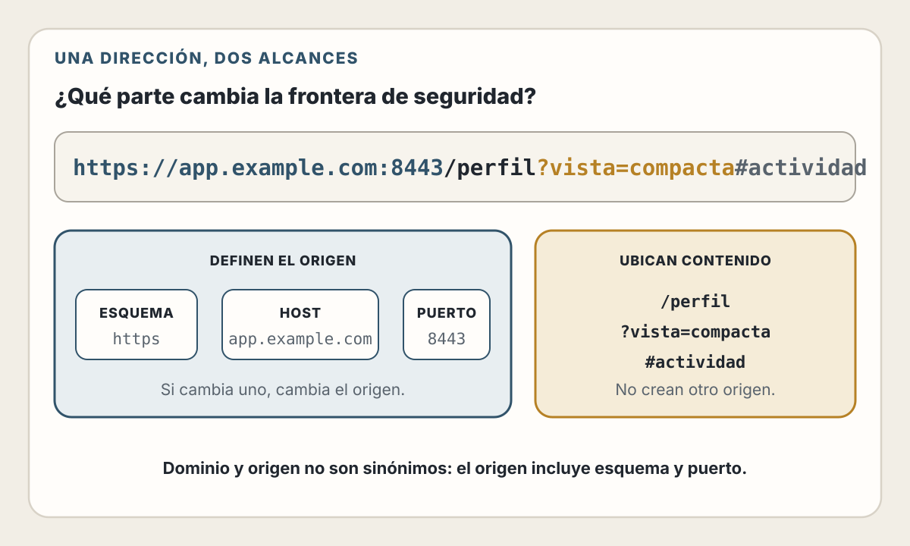
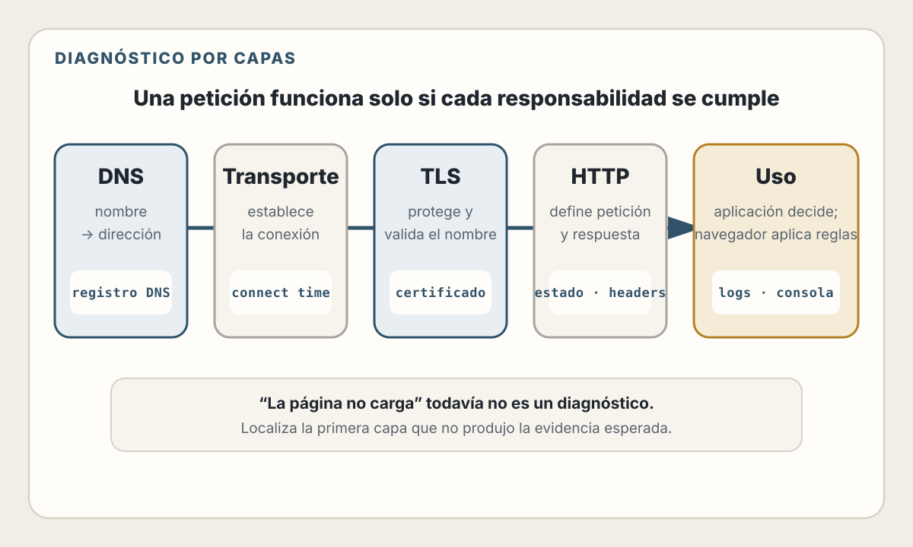
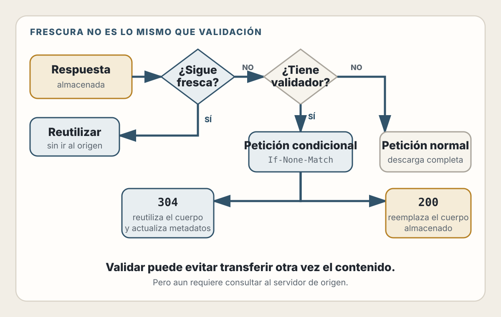
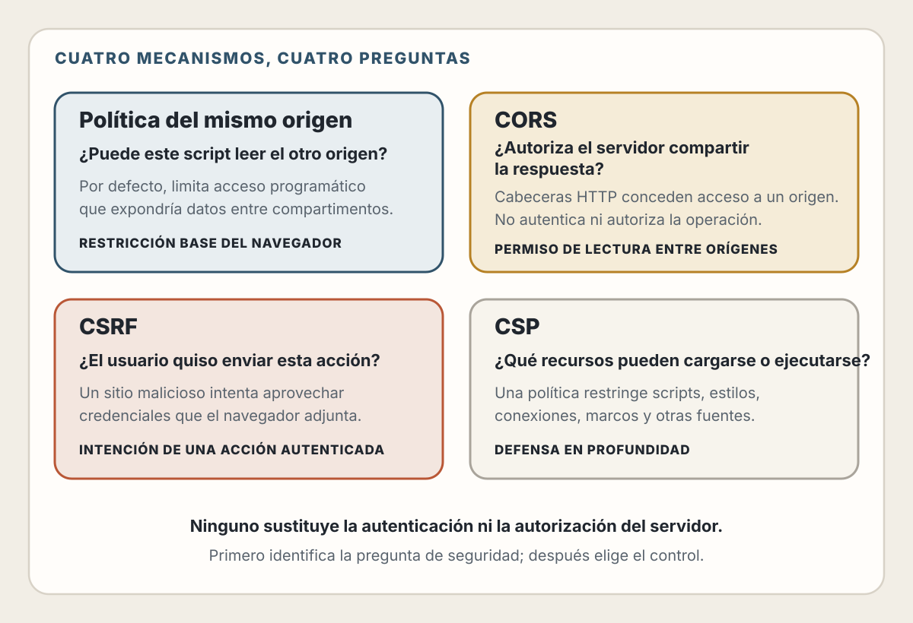

# 5. URL, DNS, TLS, HTTP, Caché y Seguridad del Navegador

> Cuando una página “no carga”, el fallo puede estar en el nombre, la conexión, el cifrado, la petición, la caché, el servidor o una política del navegador.

## Objetivos de Aprendizaje

Al finalizar este capítulo, serás capaz de:

- Descomponer una URL y reconocer qué partes definen un origen
- Explicar el papel de DNS sin confundir nombres con servidores
- Entender qué protege TLS y qué queda fuera de su alcance
- Leer una petición y una respuesta HTTP como contratos
- Razonar sobre seguridad, idempotencia y códigos de estado
- Diseñar caché mediante frescura, validación y variantes
- Distinguir same-origin policy, CORS, cookies, CSRF y CSP
- Seguir una petición de extremo a extremo para diagnosticar fallos
- Verificar configuraciones de red o seguridad propuestas por IA

---

## Una URL Es una Dirección Estructurada

Considera:

```text
https://app.example.com:8443/orders/42?view=compact#history
```

| Parte | Valor | Propósito |
|-------|-------|-----------|
| Esquema | `https` | Cómo se accede al recurso |
| Host | `app.example.com` | Nombre del host |
| Puerto | `8443` | Punto de servicio, explícito en este caso |
| Ruta | `/orders/42` | Recurso dentro del servicio |
| Query | `view=compact` | Parámetros de la representación o acción |
| Fragmento | `history` | Referencia dentro del recurso |

El fragmento se interpreta en el cliente y normalmente no forma parte de la petición HTTP enviada al servidor.

### Usa el parser de la plataforma

```javascript
const url = new URL(
  'https://app.example.com:8443/orders/42?view=compact#history'
);

console.log(url.protocol);   // "https:"
console.log(url.hostname);   // "app.example.com"
console.log(url.port);       // "8443"
console.log(url.pathname);   // "/orders/42"
console.log(url.searchParams.get('view')); // "compact"
console.log(url.hash);       // "#history"
```

No dividas una URL con expresiones regulares improvisadas. Codificación, caracteres internacionales, puertos y URLs relativas contienen casos que el parser estándar ya define.

### URL relativa y URL absoluta

```javascript
const absolute = new URL('../invoices?year=2026', document.baseURI);
```

La URL resultante depende de una base. Esta regla afecta enlaces, módulos, imágenes, CSS y peticiones.

### El origen

Para URLs HTTP(S), un origen se basa en:

- Esquema
- Host
- Puerto

Estas URLs no comparten origen:

```text
https://example.com
http://example.com
https://api.example.com
https://example.com:8443
```

Cambiar ruta o query no crea un origen distinto.

💡 **Insight:** un dominio es una relación de nombres. Un origen es una frontera de seguridad del navegador. No son conceptos equivalentes.

<picture>
  <source media="(max-width: 820px)" srcset="../assets/diagrams/cap05-url-origen-mobile.svg?v=2">
  
</picture>

---

## DNS: Del Nombre a Información de Red

Los usuarios recuerdan nombres; las conexiones necesitan información que permita localizar un servicio.

DNS es un sistema distribuido y jerárquico de nombres y registros. Una resolución típica puede involucrar:

1. Caché del navegador o sistema operativo
2. Resolver configurado para el dispositivo o red
3. Servidores raíz
4. Servidores del dominio de nivel superior
5. Servidores autoritativos del dominio

Las respuestas intermedias se almacenan según sus tiempos de vida, por lo que no todas las consultas recorren la jerarquía completa.

### Registros habituales

| Tipo | Uso general |
|------|-------------|
| `A` | Dirección IPv4 |
| `AAAA` | Dirección IPv6 |
| `CNAME` | Alias hacia otro nombre |
| `MX` | Servidores de correo |
| `TXT` | Texto usado por diversos protocolos |
| `NS` | Servidores autoritativos de una zona |

DNS no decide qué ruta HTTP responderá ni qué certificado será válido. Proporciona información asociada al nombre.

### Propagación no es un interruptor global

Cuando cambia un registro, distintos resolvers pueden conservar respuestas anteriores hasta que expiren. “Ya cambié DNS” no implica que todos observarán inmediatamente el mismo valor.

Al diagnosticar:

- Consulta el registro y su TTL
- Distingue respuesta autoritativa de caché
- Comprueba resolvers diferentes solo si existe una hipótesis
- Verifica IPv4 e IPv6
- Recuerda que un CDN o proxy puede responder por múltiples orígenes

⚠️ **Advertencia:** no uses direcciones obtenidas de DNS como una autorización permanente. Pueden cambiar, existir múltiples respuestas o depender del lugar de consulta.

---

## De la Resolución a la Conexión

Una vez localizado el destino, cliente y servidor necesitan un transporte.

En términos generales:

- HTTP/1.1 y HTTP/2 suelen operar sobre TCP.
- HTTP/3 opera sobre QUIC, que utiliza UDP como base.
- HTTPS añade TLS para proteger la comunicación HTTP.

Las versiones cambian detalles de multiplexación, bloqueo y establecimiento de conexión, pero no cambian la semántica fundamental de los métodos, campos y estados HTTP.

### Latencia acumulada

Antes de recibir contenido pueden ocurrir:

- Resolución DNS
- Establecimiento del transporte
- Negociación TLS
- Envío de la petición
- Espera del procesamiento del servidor
- Transferencia de la respuesta

Conexiones reutilizadas, cachés y protocolos modernos pueden evitar parte de este trabajo. Para optimizar, identifica qué fase consume tiempo.

<picture>
  <source media="(max-width: 820px)" srcset="../assets/diagrams/cap05-capas-conexion-mobile.svg">
  
</picture>

---

## TLS: Confidencialidad, Integridad y Autenticación

TLS protege los bytes en tránsito. En una conexión HTTPS correctamente validada proporciona principalmente:

- **Confidencialidad:** un observador de la red no debería leer el contenido protegido.
- **Integridad:** una modificación en tránsito puede detectarse.
- **Autenticación del servidor:** el cliente verifica que el certificado presentado es válido para el nombre y una cadena de confianza aceptada.

El handshake negocia parámetros criptográficos y establece claves para proteger los datos de aplicación.

### Lo que TLS no resuelve

TLS no garantiza:

- Que la aplicación no tenga XSS o inyección SQL
- Que el usuario haya elegido un sitio legítimo
- Que el servidor proteja correctamente sus datos
- Que una operación esté autorizada
- Que el contenido sea verdadero
- Que el dispositivo del usuario no esté comprometido

Una página maliciosa también puede usar HTTPS. El candado indica protección de la conexión con el origen mostrado, no que el producto sea confiable.

### Certificados y nombres

Un certificado se valida contra el nombre solicitado, su vigencia, la cadena de confianza y otras reglas. Acceder directamente por una dirección IP puede fallar aunque el servicio funcione por nombre.

Al diagnosticar TLS, comprueba:

- Nombre incluido en el certificado
- Fechas de validez
- Cadena intermedia
- Reloj del cliente
- Terminación TLS en proxy, CDN o balanceador

---

## HTTP: Mensajes con Semántica

HTTP es un protocolo de petición y respuesta con mensajes autodescriptivos.

```http
GET /orders/42 HTTP/1.1
Host: api.example.com
Accept: application/json
Authorization: Bearer <token>
```

```http
HTTP/1.1 200 OK
Content-Type: application/json
Cache-Control: private, max-age=60
ETag: "order-42-v7"

{"id":"42","status":"paid"}
```

Una petición comunica:

- Método
- Recurso objetivo
- Campos de cabecera
- Cuerpo opcional

Una respuesta comunica:

- Código de estado
- Campos de cabecera
- Representación opcional

### Métodos, seguridad e idempotencia

En terminología HTTP, un método **seguro** expresa una operación esencialmente de lectura. Un método **idempotente** puede repetirse con la misma intención sin acumular efectos adicionales atribuibles a la repetición.

| Método | Intención habitual | Seguro | Idempotente |
|--------|-------------------|--------|-------------|
| `GET` | Pedir datos o contenido | Sí | Sí |
| `HEAD` | Obtener metadatos | Sí | Sí |
| `POST` | Procesar o crear según el recurso | No | No por definición |
| `PUT` | Crear o reemplazar en una URL conocida | No | Sí |
| `PATCH` | Aplicar una modificación parcial | No | Depende del formato y operación |
| `DELETE` | Eliminar el recurso | No | Sí en intención HTTP |

“Idempotente” no significa que cada respuesta sea idéntica ni que no se generen logs. Significa que repetir la intención no debería producir efectos acumulativos diferentes en el estado deseado.

### Reintentos

Reintentar un `GET` tras una desconexión suele ser razonable. Reintentar un `POST` de pago puede duplicar una operación.

Para operaciones sensibles:

- Usa una clave de idempotencia
- Registra el resultado asociado a esa clave
- Devuelve el mismo resultado ante una repetición equivalente
- Define expiración y alcance

La idempotencia es una propiedad del contrato completo, no una cabecera mágica.

### Códigos de estado

| Familia | Significado general |
|---------|---------------------|
| `1xx` | Información provisional |
| `2xx` | La petición fue procesada según el estado indicado |
| `3xx` | Redirección o uso de representación existente |
| `4xx` | La petición no puede procesarse como fue enviada |
| `5xx` | El servidor falló al cumplir una petición válida o procesable |

Algunos códigos comunes:

- `200 OK`: respuesta exitosa general
- `201 Created`: se creó un recurso
- `204 No Content`: éxito sin cuerpo de respuesta
- `304 Not Modified`: el validador permite reutilizar una respuesta almacenada
- `400 Bad Request`: petición inválida
- `401 Unauthorized`: faltan credenciales válidas; el nombre histórico es confuso
- `403 Forbidden`: la identidad no tiene permiso o la política rechaza
- `404 Not Found`: no existe una representación accesible
- `409 Conflict`: conflicto con el estado actual
- `422 Unprocessable Content`: contenido entendido pero semánticamente inválido
- `429 Too Many Requests`: límite de solicitudes
- `500 Internal Server Error`: fallo inesperado del servidor
- `503 Service Unavailable`: indisponibilidad temporal

No conviertas todos los errores en `200` con `{ "success": false }`. Se pierde semántica utilizada por clientes, cachés, proxies y observabilidad.

### Tipo de contenido y negociación

`Content-Type` describe la representación enviada:

```http
Content-Type: application/json; charset=utf-8
```

`Accept` expresa formatos que el cliente puede procesar:

```http
Accept: application/json
```

No confíes en la extensión de una URL para determinar el tipo real.

---

## Caché HTTP: Reutilizar con Reglas

Una caché almacena respuestas para reducir latencia y transferencia. El reto no es guardar, sino saber cuándo reutilizar.

### Caché privada y compartida

- Una caché privada pertenece a un usuario, como la del navegador.
- Una caché compartida puede servir a múltiples usuarios, como un proxy o CDN.

Una respuesta personalizada puede ser apropiada para caché privada y peligrosa en una compartida.

### Frescura

```http
Cache-Control: public, max-age=300
```

La respuesta puede considerarse fresca durante 300 segundos. Mientras sea fresca, una caché compatible puede reutilizarla sin contactar al origen.

Directivas comunes:

- `max-age`: vida fresca para cachés
- `s-maxage`: vida fresca específica de cachés compartidas
- `private`: no almacenar en caché compartida
- `public`: permite almacenamiento compartido cuando otras reglas lo admiten
- `no-store`: no almacenar la respuesta
- `no-cache`: puede almacenarse, pero debe validarse antes de reutilizarse
- `must-revalidate`: una respuesta obsoleta debe validarse según las reglas aplicables

⚠️ **Error frecuente:** `no-cache` no significa “no guardar”. Para impedir almacenamiento, la directiva es `no-store`.

### Validación

Un servidor puede proporcionar un validador:

```http
ETag: "catalog-v18"
```

Después, el cliente pregunta:

```http
If-None-Match: "catalog-v18"
```

Si la representación no cambió:

```http
HTTP/1.1 304 Not Modified
```

La caché reutiliza el cuerpo almacenado y actualiza metadatos según corresponda.

<picture>
  <source media="(max-width: 820px)" srcset="../assets/diagrams/cap05-cache-revalidacion-mobile.svg?v=2">
  
</picture>

### Variantes

Si la respuesta depende de una cabecera de la petición:

```http
Vary: Accept-Encoding
```

`Vary` indica qué campos forman parte de la clave de selección de la respuesta. Usarlo sin criterio puede fragmentar la caché; omitirlo puede servir la variante equivocada.

### Contenido versionado

Un asset cuyo nombre cambia con su contenido puede tener una vida larga:

```http
Cache-Control: public, max-age=31536000, immutable
```

```text
/assets/app.a4f08c2.js
```

Cuando cambia el archivo, cambia la URL. No apliques esta estrategia a una URL cuyo contenido cambia sin versionarse.

### Diseña la invalidación antes de celebrar el hit rate

Pregunta:

- ¿Qué usuario puede recibir esta respuesta?
- ¿Qué cambio la vuelve obsoleta?
- ¿Cuánto daño causa servirla desactualizada?
- ¿Quién puede purgarla?
- ¿Cómo sabremos si se sirvió una variante incorrecta?

---

## Cookies y Sesiones

HTTP es sin estado entre mensajes, pero una aplicación puede relacionarlos mediante cookies.

> **Estado del ecosistema — verificado el 30 de julio de 2026:** la revisión
> que incorpora formalmente `SameSite` y los prefijos de cookies sigue siendo
> un Internet-Draft. El IETF Datatracker la sitúa en la cola del RFC Editor,
> pero aún no debe citarse como un RFC publicado.

```http
Set-Cookie: __Host-session=<opaque>; Path=/; Secure; HttpOnly; SameSite=Lax
```

Una cookie de sesión debería contener normalmente un identificador opaco, no toda la información sensible del usuario.

Atributos importantes:

- `Secure`: enviar solo mediante un canal seguro
- `HttpOnly`: impedir acceso mediante APIs de script
- `SameSite`: limitar ciertos envíos entre sitios
- `Path` y `Domain`: delimitar alcance
- `Max-Age` o `Expires`: controlar persistencia

El prefijo `__Host-` exige restricciones que ayudan a evitar un alcance de host demasiado amplio cuando el navegador lo implementa según la especificación.

### Cookies no son autorización

El servidor debe:

- Validar la sesión
- Comprobar expiración o revocación
- Autorizar cada operación
- Rotar identificadores cuando cambia el nivel de confianza
- Proteger operaciones ante CSRF según el contexto

`HttpOnly` reduce la posibilidad de leer una cookie desde JavaScript, pero un XSS todavía puede realizar acciones como el usuario mientras el script malicioso se ejecute en el origen.

---

## El Modelo de Seguridad del Navegador

La web ejecuta contenido de múltiples partes en un mismo dispositivo. El navegador necesita compartimentos.

### Same-origin policy

La política del mismo origen restringe cómo un documento o script de un origen interactúa con recursos de otro. No bloquea toda comunicación entre sitios; limita especialmente la lectura y acceso programático que podrían exponer datos.

Por ejemplo, un sitio puede enviar ciertos formularios o cargar imágenes de otro origen, pero un script no obtiene automáticamente permiso para leer cualquier respuesta.

### CORS

CORS es un protocolo mediante cabeceras HTTP por el que un servidor permite que una respuesta sea compartida con código de otro origen.

```http
Access-Control-Allow-Origin: https://app.example.com
```

Para algunas peticiones, el navegador envía antes una solicitud `OPTIONS` de preflight.

CORS:

- Es una política aplicada por navegadores
- Protege la lectura de respuestas desde scripts
- Requiere participación del servidor
- No reemplaza autenticación ni autorización
- No impide que clientes no navegador llamen a una API
- No es una defensa completa contra CSRF

⚠️ **Error frecuente:** “arreglar CORS” con `Access-Control-Allow-Origin: *` sin analizar credenciales, datos y consumidores puede ampliar exposición.

### CSRF

En una falsificación de solicitud entre sitios, un navegador autenticado envía una operación que el usuario no pretendía.

Defensas habituales:

- Cookies `SameSite` apropiadas
- Tokens anti-CSRF vinculados a la sesión
- Verificación de `Origin` o señales equivalentes cuando corresponda
- Métodos seguros sin efectos
- Reautenticación para acciones de alto riesgo

La defensa depende de cómo se transportan las credenciales y del flujo completo.

### CSP

Content Security Policy permite restringir fuentes de scripts, estilos, conexiones y otros recursos:

```http
Content-Security-Policy:
  default-src 'self';
  script-src 'self' 'nonce-r4nd0m';
  object-src 'none';
  base-uri 'none';
  frame-ancestors 'none'
```

CSP es defensa en profundidad. No sustituye validación, codificación de salida ni eliminación de sinks peligrosos.

Antes de aplicar una política estricta:

1. Inventaría recursos necesarios.
2. Despliega `Content-Security-Policy-Report-Only`.
3. Revisa violaciones y falsos positivos.
4. Elimina dependencias de inline inseguro.
5. Activa la política y monitoriza.

No copies una CSP generada sin comprender cada directiva.

<picture>
  <source media="(max-width: 820px)" srcset="../assets/diagrams/cap05-seguridad-navegador-mobile.svg">
  
</picture>

---

## El Viaje Completo de una Petición

Al visitar una URL HTTPS, puede ocurrir:

1. El navegador analiza y normaliza la URL.
2. Comprueba políticas locales, Service Workers y cachés aplicables.
3. Resuelve el nombre mediante DNS si necesita una dirección.
4. Reutiliza o establece una conexión de transporte.
5. Negocia TLS y valida el certificado.
6. Construye la petición HTTP, incluyendo cookies y cabeceras permitidas.
7. Un CDN, proxy o balanceador puede recibirla primero.
8. La aplicación autentica, autoriza, valida y procesa.
9. La respuesta atraviesa intermediarios.
10. El navegador aplica caché, CORS, CSP, cookies y otras políticas.
11. Entrega la representación al subsistema correspondiente.

No todos los pasos ocurren en cada petición. Cachés y conexiones reutilizadas cambian el camino.

### Diagnóstico por capas

Cuando algo falla, evita cambiar varias cosas a la vez:

1. **URL:** ¿es la dirección y codificación esperada?
2. **DNS:** ¿el nombre resuelve a destinos correctos?
3. **Conexión:** ¿se establece transporte?
4. **TLS:** ¿nombre, certificado y cadena son válidos?
5. **HTTP:** ¿qué petición se envió y qué respuesta llegó?
6. **Caché:** ¿la respuesta provino de almacenamiento?
7. **Aplicación:** ¿qué decisión tomó el servidor?
8. **Navegador:** ¿CORS, CSP o mixed content bloqueó el uso?

Las herramientas de red del navegador, `curl`, registros del proxy y trazas del backend muestran partes diferentes del recorrido.

---

## IA y Configuración de Red: Los Errores Tienen Gran Alcance

Una sugerencia plausible puede:

- Hacer pública una respuesta personalizada
- Desactivar validación TLS
- Abrir CORS a orígenes no previstos
- Permitir scripts inline en CSP
- Reintentar pagos sin idempotencia
- Guardar tokens accesibles a JavaScript
- Confundir `no-cache` con `no-store`
- Introducir un DNS record que afecta correo u otros servicios

Para cambios de infraestructura o seguridad, pide:

```text
Propón la configuración, pero no la apliques.

Incluye:
- Actores y datos protegidos.
- Flujo exacto de petición y respuesta.
- Efecto de cada cabecera o registro.
- Diferencia entre caché privada y compartida.
- Comportamiento con credenciales.
- Plan de despliegue gradual y rollback.
- Comandos de verificación no destructivos.
- Riesgos que requieren revisión humana.
```

Después verifica contra la especificación y en un entorno controlado. Una configuración que “soluciona” el síntoma puede haber eliminado la protección que lo hacía visible.

---

## Lista de Verificación

### Dirección y conexión

- [ ] La URL se construye con un parser
- [ ] Origen y sitio no se confunden
- [ ] DNS, transporte y TLS se diagnostican por separado
- [ ] El certificado corresponde al nombre solicitado

### HTTP

- [ ] El método expresa la intención
- [ ] Los reintentos consideran idempotencia
- [ ] Los códigos de estado conservan semántica
- [ ] `Content-Type` y `Accept` son coherentes
- [ ] Los límites de tamaño y tiempo están definidos

### Caché

- [ ] Se distingue caché privada de compartida
- [ ] La frescura tiene un límite explícito
- [ ] Los validadores se usan cuando aportan valor
- [ ] `Vary` refleja las variantes necesarias
- [ ] Las respuestas personalizadas no se comparten accidentalmente
- [ ] La invalidación y purga están diseñadas

### Seguridad del navegador

- [ ] CORS enumera orígenes y credenciales deliberadamente
- [ ] CSRF se analiza según el transporte de credenciales
- [ ] Las cookies sensibles usan atributos apropiados
- [ ] CSP se trata como defensa en profundidad
- [ ] Autenticación y autorización siguen ocurriendo en el servidor

---

## Resumen

- Una URL estructura una dirección y contribuye a definir el origen
- DNS relaciona nombres con registros; no implementa rutas HTTP
- TLS protege la conexión, no la lógica de la aplicación
- HTTP expresa intención mediante métodos, estados y campos
- La idempotencia determina qué operaciones pueden repetirse con seguridad
- La caché requiere frescura, validación, variantes e invalidación
- Cookies, same-origin policy, CORS, CSRF y CSP resuelven problemas distintos
- Diagnosticar por capas evita parches que esconden la causa
- Los cambios de IA en red o seguridad requieren revisión y verificación primaria

---

## Ejercicios

1. **Anatomía de URL:** compara cinco URLs y agrúpalas por origen. Explica qué cambios afectan solo ruta, query o fragmento.

2. **Petición HTTP:** captura una navegación y documenta método, estado, tipo de contenido, caché y cookies sin copiar valores sensibles.

3. **Caché:** diseña cabeceras para un asset versionado, una página pública que cambia cada minuto y un panel personalizado.

4. **Carrera de reintentos:** diseña un endpoint de pago con clave de idempotencia. Explica qué devuelve ante una repetición.

5. **CORS y CSRF:** describe por qué permitir lectura cross-origin y evitar solicitudes falsificadas son problemas relacionados pero diferentes.

6. **Diagnóstico:** simula un fallo de certificado, un DNS antiguo y una respuesta bloqueada por CSP. Identifica evidencia para cada capa.

---

## Referencias

- WHATWG. *URL Standard* — https://url.spec.whatwg.org/
- IETF. *STD 13: Domain Name System, RFC 1034 y RFC 1035* — https://www.rfc-editor.org/info/std13/
- IETF. *RFC 8446: The Transport Layer Security Protocol Version 1.3* — https://www.rfc-editor.org/rfc/rfc8446.html
- IETF. *RFC 9110: HTTP Semantics* — https://www.rfc-editor.org/rfc/rfc9110.html
- IETF. *RFC 9111: HTTP Caching* — https://www.rfc-editor.org/rfc/rfc9111.html
- WHATWG. *Fetch Standard* — https://fetch.spec.whatwg.org/
- W3C. *Content Security Policy Level 3* — https://www.w3.org/TR/CSP3/
- IETF. *Cookies: HTTP State Management Mechanism* (Internet-Draft) — https://datatracker.ietf.org/doc/html/draft-ietf-httpbis-rfc6265bis

---

**Anterior**: [JavaScript, Eventos y Runtime del Navegador](./04-javascript-eventos-runtime.md) | **Siguiente**: [La Evolución del Desarrollador Web](./06-evolucion-desarrollador.md)
