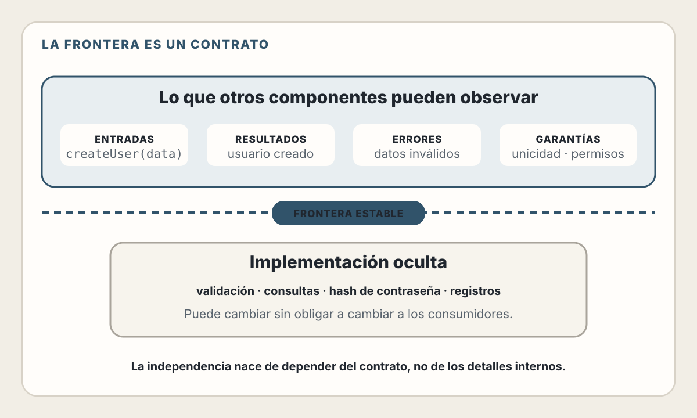
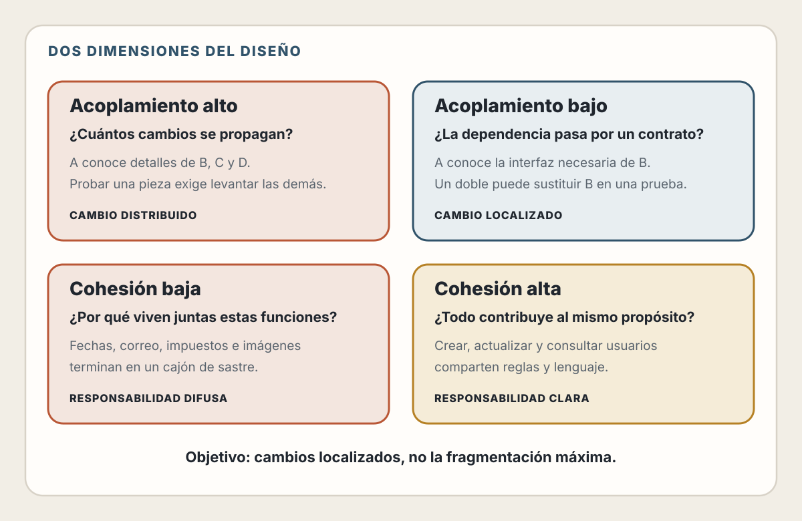
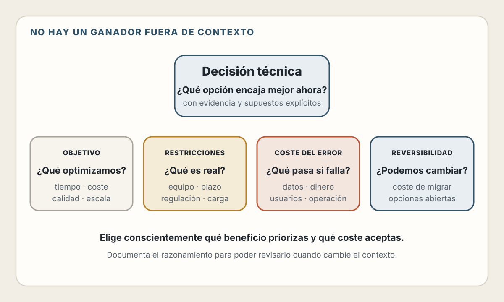
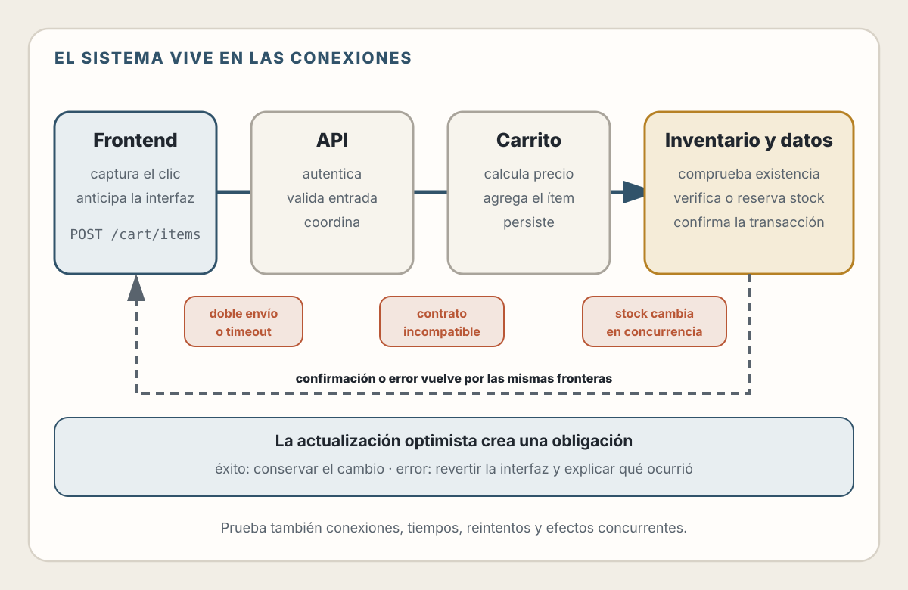

# 7. Pensamiento en Sistemas

> Un sistema es más que la suma de sus partes.

## Objetivos de Aprendizaje

Al finalizar este capítulo, serás capaz de:
- Pensar en software como sistemas de componentes interconectados, no como líneas de código
- Evaluar el acoplamiento y la cohesión de un diseño
- Reconocer y navegar trade-offs en decisiones técnicas
- Documentar decisiones arquitectónicas usando ADRs

---

## Más allá del código

Cuando empezamos a programar, pensamos en **código**: funciones, variables, loops. Con experiencia, empezamos a pensar en **sistemas**: componentes que interactúan, datos que fluyen, fallos que se propagan.

| Pregunta local | Pregunta sistémica |
|---|---|
| ¿Cómo escribo esta función? | ¿Cómo interactúa este componente con los demás? |
| ¿Funciona mi código? | ¿Qué ocurre cuando una dependencia no está disponible? |
| ¿Cómo optimizo este bucle? | ¿Dónde está el cuello de botella del sistema completo? |

📖 **Concepto**: Un **sistema** es un conjunto de componentes interconectados que trabajan juntos para lograr un propósito. El comportamiento del sistema emerge de las interacciones entre componentes, no solo de los componentes individuales.

### El todo es diferente a las partes

Considera un e-commerce simple: frontend, API, pagos y base de datos
pueden superar sus pruebas de forma aislada. El sistema completo todavía puede
fallar cuando esas piezas intercambian datos, esperan una respuesta o compiten
por modificar el mismo estado. Más adelante seguiremos uno de esos flujos de
principio a fin.

Cada componente puede tener tests pasando, código limpio, y cero bugs. Pero el sistema puede fallar por:

- Latencia en la red entre componentes
- Timeouts mal configurados
- Datos inconsistentes entre servicios
- Fallos en cascada cuando un componente se cae
- Race conditions entre peticiones concurrentes

💡 **Insight**: Los bugs más difíciles de encontrar no están *en* los componentes, sino *entre* ellos. Por eso pensar en sistemas es esencial.

---

## Componentes y sus fronteras

Un componente es una unidad de software con:
- Una **responsabilidad** definida
- Una **interfaz** (cómo otros interactúan con él)
- Una **implementación** (cómo hace su trabajo internamente)

<picture>
  <source media="(max-width: 820px)" srcset="../assets/diagrams/cap07-frontera-componente-mobile.svg">
  
</picture>

### La importancia de las fronteras

Las fronteras entre componentes son **contratos**. Definen:
- Qué puede pedir un componente a otro
- Qué formato tienen los datos
- Qué errores pueden ocurrir
- Qué garantías ofrece cada lado

Cuando las fronteras son claras:
- Puedes cambiar la implementación sin afectar a otros
- Puedes probar componentes de forma aislada
- Puedes razonar sobre el sistema por partes

Cuando las fronteras son difusas:
- Un cambio aquí rompe algo allá
- Los tests requieren el sistema completo
- Nadie entiende qué hace qué

---

## Acoplamiento y cohesión

Estos dos conceptos son fundamentales para evaluar la calidad de un diseño.

### Acoplamiento: qué tan conectados están los componentes

Un **acoplamiento alto** hace que un cambio se propague y que probar una pieza
requiera muchas dependencias reales. Con **acoplamiento bajo**, cada componente
conoce solo el contrato que necesita y una prueba puede sustituir la dependencia
por un doble controlado.

### Cohesión: qué tan relacionadas están las cosas dentro de un componente

Con **cohesión alta**, las reglas y operaciones reunidas contribuyen a un mismo
propósito. Con **cohesión baja**, funciones de fechas, correo, impuestos e
imágenes terminan juntas en un servicio genérico sin una razón de cambio común.

<picture>
  <source media="(max-width: 820px)" srcset="../assets/diagrams/cap07-acoplamiento-cohesion-mobile.svg">
  
</picture>

### El objetivo

Una síntesis útil es **bajo acoplamiento + alta cohesión**: dependencias
explícitas, responsabilidades claras y cambios localizados.

⚠️ **Advertencia**: Llevar esto al extremo también es problemático. Si tienes 200 microcomponentes con una función cada uno, el acoplamiento baja pero la complejidad del sistema explota. Como todo en arquitectura: balance.

---

## Trade-offs: no hay soluciones perfectas

Esta es quizás la lección más importante del capítulo:

> En ingeniería de software, cada decisión tiene costos y beneficios. No existen soluciones perfectas, solo trade-offs.

### Objetivos en tensión

Mejorar una dimensión suele consumir tiempo, dinero o complejidad en otra, pero
no existe una ley universal de «elige dos». La tensión concreta depende del
problema, del equipo y de la etapa del producto.

<picture>
  <source media="(max-width: 820px)" srcset="../assets/diagrams/cap07-tradeoffs-contexto-mobile.svg">
  
</picture>

**Ejemplos reales:**

| Decisión | Ganas | Pierdes |
|----------|-------|---------|
| Monolito | Simplicidad, velocidad inicial | Escalabilidad independiente |
| Microservicios | Escalabilidad, autonomía | Simplicidad operacional |
| ORM completo | Productividad, abstracción | Control fino, performance |
| SQL crudo | Control, performance | Productividad, portabilidad |
| Framework pesado | Features listos | Flexibilidad, tamaño bundle |
| Sin framework | Flexibilidad, control | Tiempo de desarrollo |

### Cómo navegar trade-offs

1. **Entiende el contexto**: ¿Qué es más importante para *este* proyecto, *este* equipo, *este* momento?

2. **Haz las preguntas correctas**:
   - ¿Qué estoy optimizando? (velocidad, costo, mantenibilidad, escala)
   - ¿Cuáles son las restricciones reales?
   - ¿Qué pasa si me equivoco? ¿Es reversible?

3. **Acepta la imperfección**: No existe la decisión que gana en todo. Elige conscientemente qué sacrificar.

4. **Documenta el razonamiento**: El "por qué" de una decisión es más valioso que el "qué" (ver ADRs más adelante).

### Ejemplo: eligiendo una base de datos

**Contexto:** una startup construye un e-commerce con pagos y un modelo inicial
de usuarios, productos y órdenes.

| Opción | Fortalezas para este caso | Costes y preguntas pendientes |
|---|---|---|
| PostgreSQL | Transacciones sólidas, restricciones de integridad, esquema explícito y ecosistema maduro | Cambios de esquema requieren migraciones; distribuir escritura añade complejidad |
| MongoDB | Modelo documental flexible y opciones nativas de distribución | Hay que diseñar límites de documentos, consistencia, índices y transacciones según el flujo real |

**Decisión ilustrativa:** PostgreSQL. El flujo de pagos y órdenes prioriza
integridad transaccional; el equipo conoce SQL y no necesita distribuir las
escrituras hoy. La decisión no afirma que PostgreSQL sea universalmente superior
ni que MongoDB carezca de transacciones: expresa qué propiedades pesan más en
este contexto.

💡 **Insight**: La mejor decisión no es la técnicamente superior. Es la que mejor encaja con tu contexto, restricciones y prioridades.

---

## Documentando decisiones: ADRs

Seis meses después, alguien (incluyendo tu yo del futuro) preguntará: "¿Por qué usamos X en lugar de Y?"

Si no documentas las decisiones, se pierde el contexto. Y sin contexto, las personas:
- Repiten discusiones ya resueltas
- Cambian cosas sin entender las consecuencias
- Asumen que "está mal" cuando en realidad era un trade-off consciente

### Architecture Decision Records (ADRs)

Un ADR es un documento corto que captura una decisión arquitectónica y su contexto.

**Estructura básica:**

```markdown
# ADR-001: Usar PostgreSQL como base de datos principal

## Estado
Aceptado (2025-01-15)

## Contexto
Estamos construyendo un e-commerce que procesará pagos.
Necesitamos una base de datos para usuarios, productos y órdenes.
El equipo tiene experiencia con SQL.

## Decisión
Usaremos PostgreSQL como base de datos principal.

## Razones
- Transacciones ACID son críticas para procesar pagos
- El esquema de datos es predecible (usuarios, productos, órdenes)
- El equipo ya conoce SQL y PostgreSQL
- Amplio ecosistema de herramientas (backups, monitoreo)

## Alternativas consideradas
- **MongoDB**: Viable, pero el modelo documental no aporta una ventaja clara
  para este dominio y el equipo tendría que diseñar nuevos límites y prácticas.
- **MySQL**: Viable, pero PostgreSQL tiene mejor soporte para
  JSON y tipos de datos complejos que podríamos necesitar.

## Consecuencias
- Necesitamos manejar migraciones de esquema cuidadosamente
- Si necesitamos escala horizontal masiva, evaluaremos
  soluciones como Citus o particionamiento
- El equipo de datos puede usar SQL directamente para analytics
```

### Por qué funcionan los ADRs

1. **Son cortos**: Un ADR no es un documento de 50 páginas. Es 1-2 páginas máximo.

2. **Capturan el "por qué"**: No solo qué decidiste, sino el razonamiento.

3. **Son inmutables**: No editas un ADR viejo. Si la decisión cambia, creas un nuevo ADR que referencia al anterior.

4. **Viven con el código**: Típicamente en una carpeta `/docs/adr/` en el repositorio.

### Cuándo escribir un ADR

No todo necesita un ADR. Escríbelo cuando:

- La decisión afecta a múltiples componentes
- Elegiste entre alternativas significativas
- La decisión es difícil de revertir
- Futuras personas podrían cuestionar la decisión

No lo escribas para:
- Decisiones triviales (qué linter usar)
- Decisiones fácilmente reversibles
- Preferencias personales sin impacto en el sistema

---

## Pensando en flujos, no en cajas

Un error común es detenerse en una lista de cajas estáticas: «tenemos un
frontend, un backend y una base de datos».

Es más útil pensar en **flujos**: cómo se mueven los datos y las peticiones a través del sistema.

### Ejemplo: flujo de "agregar al carrito"

<picture>
  <source media="(max-width: 820px)" srcset="../assets/diagrams/cap07-flujo-carrito-mobile.svg">
  
</picture>

La secuencia completa conserva estos pasos:

1. El frontend captura el clic, anticipa el cambio visual y envía `POST /api/cart/items`.
2. La API autentica la solicitud, valida `productId` y `quantity`, y llama al servicio de carrito.
3. El servicio comprueba el producto y el stock, calcula el precio vigente y agrega el ítem.
4. La capa de datos persiste el carrito y, si el modelo lo requiere, reserva stock dentro de las garantías definidas.
5. La respuesta vuelve a la interfaz: confirma el cambio optimista o lo revierte y muestra un error útil.

### Preguntas que surgen al pensar en flujos

- ¿Qué pasa si el paso 8 falla (sin stock)?
- ¿Qué pasa si el paso 11 falla (BD no disponible)?
- ¿Qué pasa si el usuario hace clic dos veces rápidamente?
- ¿Qué pasa si el precio cambia entre el paso 2 y el paso 9?
- ¿Cuánto tarda este flujo? ¿Dónde está el cuello de botella?

Estas preguntas no surgen cuando piensas en cajas. Surgen cuando piensas en flujos.

---

## Resumen

- Pensar en sistemas significa ver más allá del código individual hacia las **interacciones entre componentes**
- Los componentes tienen **interfaces** (lo que exponen) e **implementaciones** (cómo funcionan internamente)
- **Bajo acoplamiento + alta cohesión** = componentes independientes que hacen una cosa bien
- **No existen soluciones perfectas**, solo trade-offs. Entiende qué sacrificas con cada decisión
- **Documenta las decisiones** importantes con ADRs para que el "por qué" no se pierda
- Piensa en **flujos** (cómo se mueven datos y peticiones), no solo en cajas estáticas

---

## Ejercicios

1. **Análisis de acoplamiento**: Elige un proyecto en el que hayas trabajado. Dibuja los componentes principales y sus conexiones. ¿Hay componentes muy acoplados? ¿Cómo podrías reducir el acoplamiento?

2. **Práctica de trade-offs**: Tu equipo debe elegir entre Redux y Zustand para estado global. Escribe los trade-offs de cada opción considerando: curva de aprendizaje, tamaño del bundle, features disponibles, y experiencia del equipo.

3. **Escribe un ADR**: Piensa en una decisión técnica reciente (puede ser personal o de trabajo). Documéntala siguiendo la estructura de ADR presentada en este capítulo.

4. **Flujo de datos**: Elige una funcionalidad común (login, checkout, búsqueda). Dibuja el flujo completo desde que el usuario interactúa hasta que ve el resultado. Identifica al menos 3 puntos donde podría fallar.

---

## Referencias

- Fowler, M. (2003). *Patterns of Enterprise Application Architecture*. Addison-Wesley.
- Nygard, M. (2018). *Release It!*, 2nd Edition. Pragmatic Bookshelf. — Excelente sobre pensamiento en sistemas para producción
- Richards, M. & Ford, N. (2020). *Fundamentals of Software Architecture*. O'Reilly. — Sobre trade-offs y documentación de decisiones
- ADR GitHub Organization: https://adr.github.io/ — Recursos sobre Architecture Decision Records

---

**Anterior**: [La Evolución del Desarrollador Web](./06-evolucion-desarrollador.md) | **Siguiente**: [Desarrollo Asistido por IA](./08-desarrollo-asistido-ia.md)
