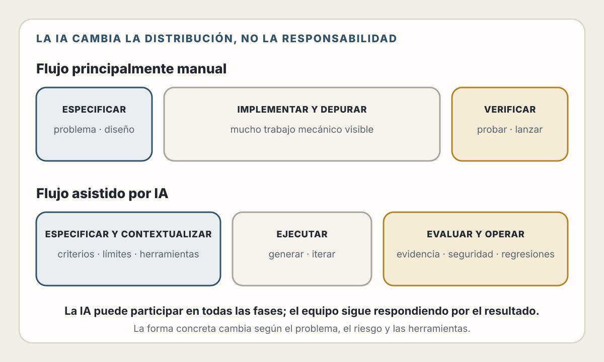
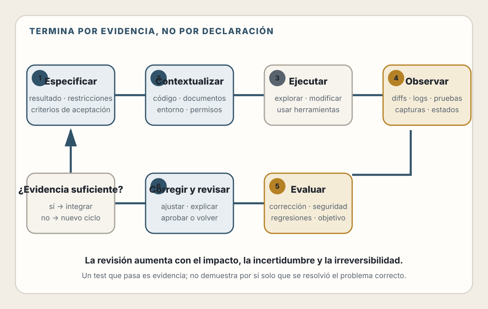
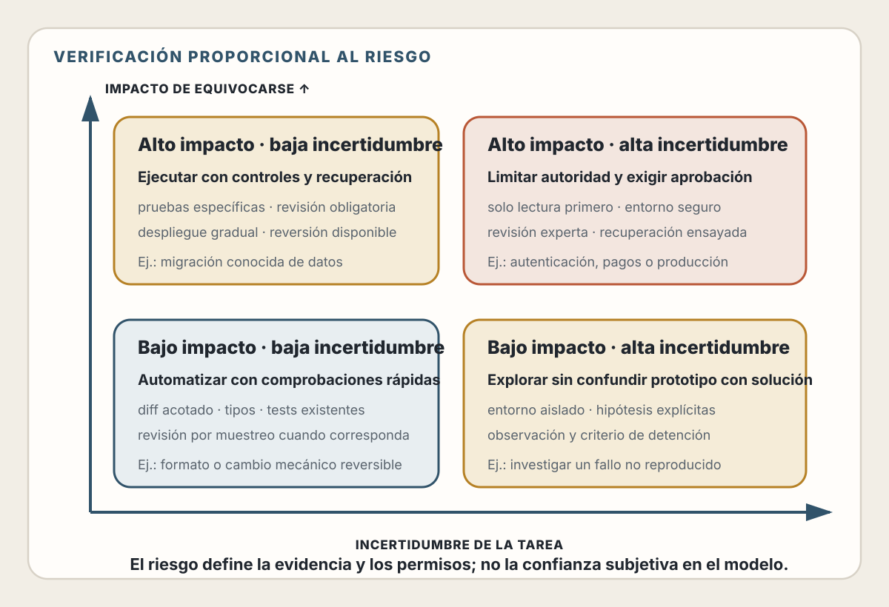

# 8. Desarrollo Asistido por IA

> La IA amplifica la capacidad del equipo, pero no asume la responsabilidad por
> el resultado.

## Objetivos de Aprendizaje

Al finalizar este capítulo, serás capaz de:
- Entender qué puede y qué NO puede hacer la IA en desarrollo de software
- Aplicar un ciclo de desarrollo asistido basado en evidencia
- Preparar instrucciones, contexto, herramientas y criterios de aceptación
- Ajustar la verificación al riesgo y al alcance de cada tarea
- Evitar los antipatrones más comunes del desarrollo asistido por IA

---

## El Cambio de Paradigma

Desde 2022, algo fundamental cambió en el desarrollo de software. Herramientas como Claude Code, Codex, GitHub Copilot y Cursor transformaron cómo escribimos código.

| Flujo tradicional | Flujo asistido posible |
|---|---|
| Buscar una solución y adaptar fragmentos | Pedir alternativas contextualizadas y comprobar sus fuentes |
| Recorrer documentación manualmente | Consultarla con ayuda, sin omitir la fuente primaria |
| Escribir estructuras repetitivas | Generarlas y concentrar la revisión en contratos y comportamiento |
| Depurar solo desde el código | Usar al agente para formular hipótesis y contrastarlas con evidencia |

### El "middle" que desaparece

Una forma útil de describir el cambio es que parte del trabajo mecánico de
implementación se comprime y aumenta la importancia relativa de especificar y
verificar.

<picture>
  <source media="(max-width: 820px)" srcset="../assets/diagrams/cap08-redistribucion-trabajo-mobile.svg">
  
</picture>

El tiempo que antes pasabas escribiendo código ahora se redistribuye hacia los extremos:

- **El antes** absorbe más esfuerzo: entender el problema, diseñar la solución, dar contexto a la IA, tomar decisiones arquitectónicas
- **El después** también crece: revisar la salida, validar la corrección, probar
  casos límite y asegurar la calidad

> 💡 **Insight**: El trabajo asistido por IA se parece menos a solicitar una
> respuesta aislada y más a preparar las condiciones para obtener y comprobar
> un resultado útil.

Esta redistribución tiene consecuencias importantes que veremos a lo largo del libro.

---

Pero este cambio viene con una trampa: **la IA hace que sea muy fácil generar código que no entiendes**.

Y código que no entiendes es código que no puedes:
- Depurar cuando falla
- Modificar cuando cambian los requisitos
- Optimizar cuando hay problemas de rendimiento
- Mantener cuando crece el proyecto

Por eso este capítulo existe tan temprano en el libro. La IA es una herramienta poderosa, pero necesitas bases sólidas para usarla bien.

---

## Qué Puede y Qué No Puede Hacer la IA

### Lo que la IA hace bien

Las tareas con patrones conocidos, contexto suficiente y verificación barata
suelen beneficiarse más:

- generar estructuras repetitivas y borradores;
- explicar código existente y proponer hipótesis de depuración;
- traducir entre lenguajes o APIs documentadas;
- preparar pruebas a partir de comportamientos explícitos;
- documentar y aplicar refactorizaciones mecánicas;
- comparar alternativas conocidas, siempre que se contrasten los supuestos.

### Lo que la IA no puede garantizar

Las capacidades dependen del modelo, las herramientas, los permisos, el
contexto disponible y la calidad del entorno. Un agente puede explorar un
repositorio, ejecutar pruebas o consultar documentación si tiene acceso; eso no
significa que comprenda correctamente el dominio ni que su resultado sea
válido.

Por sí sola, la IA no puede garantizar:

- que el contexto no documentado se haya inferido correctamente;
- una visión completa y vigente del sistema;
- que el código funcione o resuelva el problema correcto;
- seguridad, rendimiento o comportamiento a una escala no medida;
- que una observación parcial represente toda la realidad;
- que las decisiones correspondan al riesgo y al entorno organizacional.

💡 **Insight**: La distinción útil no es “la IA ejecuta y el humano piensa”.
Ambos pueden participar en análisis y ejecución. La diferencia fundamental es
que el equipo define los criterios, controla los permisos, valida la evidencia
y responde por el resultado.

### 📊 El Precipicio de la Complejidad

El rendimiento de un agente no disminuye de manera lineal. Una tarea puede
parecer sencilla hasta que combina varias fuentes de incertidumbre:

- requisitos implícitos;
- cambios distribuidos entre muchos archivos;
- dependencias o documentación desactualizadas;
- estados externos difíciles de reproducir;
- criterios de éxito ambiguos;
- acciones irreversibles o de alto impacto.

No existe un porcentaje universal de éxito para “tareas simples” o “tareas
complejas”. El resultado depende del modelo, el entorno, las herramientas, el
tiempo disponible y la forma de evaluar. Por eso, compara agentes con tareas
representativas de tu propio sistema.

**Implicación práctica**: divide el trabajo en unidades verificables, no
necesariamente en instrucciones diminutas. Cada unidad debe tener un resultado
observable y criterios de aceptación. En autenticación, por ejemplo, conviene
separar el modelo de identidad, el almacenamiento de credenciales, la sesión,
la autorización y las pruebas de abuso, manteniendo explícitas sus relaciones.

### El Divide de Capacidades

Una forma más precisa de entender qué delegar:

| IA Fuerte | IA Débil |
|-----------|----------|
| Lógica y flujo de datos | Decisiones de diseño visual |
| Scaffolding y boilerplate | Juicio estético ("gusto") |
| Convertir specs explícitas en código | Jerarquía visual y decisiones UX |
| Patrones conocidos y documentados | Integraciones multi-paso sin contexto fuerte |
| Refactoring mecánico | Arquitectura de sistemas complejos |

> 💡 **Insight**: "You are still the architect." El éxito depende menos del modelo que uses y más de la especificidad del prompt, los guardrails que establezcas, y cómo estructures el workflow. — Addy Osmani

---

## El Ciclo de Desarrollo con IA

No se trata de pedir código y pegarlo. El desarrollo efectivo con IA sigue un
ciclo basado en evidencia:

<picture>
  <source media="(max-width: 820px)" srcset="../assets/diagrams/cap08-ciclo-evidencia-mobile.svg">
  
</picture>

### Paso 1: Especificar

Define el problema, el resultado esperado, las restricciones, los casos que no
deben cambiar y la evidencia que demostrará que el trabajo está terminado.

### Paso 2: Contextualizar

Proporciona instrucciones, documentación, código y herramientas relevantes.
Más contexto no siempre es mejor: busca la menor cantidad de información que
permita tomar una buena decisión.

### Paso 3: Ejecutar y observar

Permite que el agente explore y ejecute dentro de permisos proporcionados al
riesgo. Conserva la evidencia del entorno: diffs, logs, resultados de
compilación, pruebas y capturas cuando sean pertinentes.

### Paso 4: Evaluar, corregir y revisar

Comprueba criterios de aceptación, regresiones, seguridad y comportamiento
observable. Un test que pasa es evidencia, pero no demuestra por sí solo que se
resolvió el problema correcto. La revisión humana debe aumentar con la
irreversibilidad, sensibilidad y alcance del cambio.

---

## Instrucciones y Contexto Efectivos para Código

La calidad del resultado depende de las instrucciones, pero también del
contexto, las herramientas, el entorno, los permisos y las evaluaciones.

### Context Engineering: La Nueva Habilidad Crítica

No basta con escribir buenas instrucciones. Necesitas **diseñar el contexto**:
estructurar la información que entregas a la IA para mejorar la calidad de la
salida.

Tres prácticas concentran el contexto útil:

1. **Maximiza la señal:** entrega la función, sus consumidores y las reglas
   relevantes; no vuelques archivos completos sin necesidad.
2. **Codifica convenciones antes:** deja en el repositorio las decisiones de
   stack, estilo, seguridad, pruebas y estructura que deben repetirse.
3. **Divide por resultados verificables:** pide unidades con un estado final y
   criterios observables, sin romper las relaciones que necesitas evaluar.

> 💡 **Insight**: El modelo importa, pero no actúa solo. Una tarea bien
> especificada, un entorno reproducible y evaluaciones confiables pueden aportar
> más que una larga lista de instrucciones.

### Anatomía de un buen prompt

Una instrucción efectiva suele contener:

1. **Contexto:** sistema, tecnologías y estado inicial relevante.
2. **Tarea:** cambio o diagnóstico concreto.
3. **Restricciones:** comportamiento que debe preservarse, límites y permisos.
4. **Criterios de aceptación:** evidencia que demostraría el resultado.
5. **Ejemplos:** entradas, salidas o patrones existentes cuando reduzcan
   ambigüedad.

### Ejemplo: Prompt malo vs bueno

**❌ Prompt vago:**
```
Haz un login
```

**✅ Prompt específico:**
```
Contexto: Aplicación React con TypeScript, usando React Hook Form
para formularios y Zod para validación.

Tarea: Crear un componente LoginForm que:
1. Tenga campos de email y password
2. Valide email con formato correcto
3. Valide password mínimo 8 caracteres
4. Muestre errores debajo de cada campo
5. Deshabilite el botón mientras se envía
6. Llame a onSubmit(data) cuando el form sea válido

Restricciones:
- Usar solo Tailwind CSS para estilos
- No usar bibliotecas adicionales
- Manejar estado de loading

Incluye tipos TypeScript para las props del componente.
```

### Técnicas avanzadas de prompting

#### 1. Dar ejemplos de código existente

```
Este es mi patrón actual para servicios:

```typescript
// userService.ts
export const userService = {
  async getById(id: string): Promise<User> {
    const response = await api.get(`/users/${id}`);
    return response.data;
  }
};
```

Crea un productService siguiendo el mismo patrón con métodos:
getAll, getById, create, update, delete
```

La IA aprenderá tu estilo del ejemplo.

#### 2. Pedir razonamiento

```
Necesito decidir entre usar Redis o PostgreSQL para
almacenar sesiones de usuario.

Contexto:
- 10,000 usuarios activos diarios
- Sesiones expiran en 24 horas
- Ya tenemos PostgreSQL en producción
- No tenemos Redis configurado

Explica los tradeoffs de cada opción para MI caso específico
y dame tu recomendación con justificación.
```

#### 3. Iterar con feedback específico

```
[Después de recibir código]

El código funciona pero:
1. El manejo de errores es muy genérico, necesito errores
   específicos para "usuario no encontrado" vs "credenciales
   inválidas"
2. Falta validación de que el email no esté vacío antes
   del trim()
3. Prefiero async/await en lugar de .then()

Ajusta el código con estos cambios.
```

#### 4. Pedir alternativas

```
Dame 3 formas diferentes de implementar un sistema de
caché en esta aplicación Express, con pros y cons de cada una.
```

---

## Cuándo Confiar y Cuándo Verificar

No todo el código generado por IA requiere el mismo nivel de escrutinio.

### Matriz de riesgo

<picture>
  <source media="(max-width: 820px)" srcset="../assets/diagrams/cap08-verificacion-riesgo-mobile.svg">
  
</picture>

### Señales de alerta: cuándo desconfiar

🚩 **Desconfía cuando:**

1. **El código es demasiado complejo para lo que pediste**
   - Si pediste algo simple y recibiste 200 líneas, algo está mal

2. **Usa APIs o métodos que no reconoces**
   - Verifica que existan y estén actualizados

3. **Maneja datos sensibles (passwords, tokens, PII)**
   - Siempre revisa el manejo de seguridad manualmente

4. **Hace operaciones destructivas (DELETE, DROP, rm -rf)**
   - Lee cada línea antes de ejecutar

5. **La IA dice "no estoy seguro" o "podría ser"**
   - Esa incertidumbre es información importante

6. **Involucra dependencias externas que no conoces**
   - Verifica que los paquetes existan y sean confiables

### Verificaciones mínimas obligatorias

- [ ] Entiendo el cambio y sus supuestos principales.
- [ ] Las dependencias, imports y APIs existen en la versión utilizada.
- [ ] Probé el comportamiento esperado, casos límite y errores relevantes.
- [ ] El diff no debilita pruebas ni controles existentes.
- [ ] Las consultas y salidas resisten inyección y exposición de datos.
- [ ] La autenticación y la autorización se revisaron por separado.
- [ ] La evidencia producida coincide con lo que se afirma en la entrega.

---

## Evaluaciones: Medir el Sistema, No la Impresión

Una demostración convincente no demuestra que un agente sea confiable. Para
adoptarlo en un flujo de trabajo necesitas **evaluaciones**: tareas
representativas con un estado inicial conocido, criterios explícitos y una
forma de calificar el resultado.

### Tres capas de evaluación

| Capa | Qué comprueba | Ejemplos |
|------|---------------|----------|
| **Determinística** | Propiedades que el software puede verificar | Compilación, tipos, lint, tests, análisis de seguridad |
| **De resultado** | Que el sistema terminó en el estado correcto | Bug reproducido y corregido, migración aplicada, flujo E2E completado |
| **Humana** | Aspectos donde importa el juicio contextual | Claridad, UX, trade-offs, mantenibilidad, riesgo residual |

Una buena evaluación no pregunta solamente “¿pasan los tests?”. También
comprueba:

- que los tests existentes no se debilitaron ni se eliminaron;
- que el cambio resuelve el comportamiento solicitado;
- que no aparecieron regresiones fuera del camino feliz;
- que las afirmaciones del agente coinciden con la evidencia;
- que el coste y el número de intervenciones son aceptables.

### Construye un conjunto pequeño de tareas reales

Empieza con entre cinco y diez tareas extraídas del trabajo cotidiano:

1. corregir un bug con una reproducción conocida;
2. implementar un cambio pequeño con criterios de aceptación;
3. modificar una funcionalidad que cruza varias capas;
4. diagnosticar un fallo sin solución predeterminada;
5. ejecutar una tarea donde deba detenerse y pedir intervención humana.

Conserva el estado inicial y la forma de calificar cada tarea. Cuando cambies de
modelo, herramienta, instrucciones o permisos, repite el conjunto. Así podrás
detectar mejoras y regresiones sin depender de la memoria o de una impresión
subjetiva.

⚠️ **Advertencia**: cualquier criterio visible puede convertirse en un objetivo
mal optimizado. Un agente podría hacer que una prueba pase debilitándola,
ocultar un error o satisfacer la métrica sin resolver el problema. Protege los
controles importantes y revisa el resultado observable, no solo la puntuación.

---

## Herramientas del Ecosistema Actual

> **Estado del ecosistema — verificado el 30 de julio de 2026.** Las categorías son
> más duraderas que los nombres comerciales. Compara herramientas mediante
> tareas reales de tu repositorio y revisa privacidad, permisos, coste,
> compatibilidad y calidad de la evidencia que producen.

### IDEs y editores con IA

El rol del IDE está cambiando. Antes era una **herramienta de escritura** — pasabas horas tecleando, navegando código, refactorizando manualmente. Ahora se está convirtiendo en una **herramienta de revisión y navegación** — un visor de código más que un editor.

> 💡 **Insight**: "The IDE becomes more of a code viewer than a writing tool." — Karri Saarinen. Esto no significa que los IDEs sean menos importantes, sino que su función principal cambia: de escribir a supervisar, navegar y validar.

Las herramientas de esta categoría ofrecen sugerencias en línea, chat sobre el
repositorio y ediciones delimitadas. Evalúa cuánto contexto envían fuera del
equipo, si respetan archivos excluidos y si permiten revisar cada cambio antes
de aplicarlo.

### Agentes de coding (autónomos)

Los agentes no solo sugieren código: pueden inspeccionar repositorios, modificar
múltiples archivos, ejecutar herramientas y preparar cambios para revisión.
Compara la calidad de sus diffs, su capacidad para obtener evidencia y sus
controles de permisos, no solo la fluidez de sus respuestas.

### Asistentes conversacionales

Son útiles para explorar conceptos, comparar alternativas y preparar una
especificación. Si no tienen acceso al repositorio o al entorno, sus respuestas
deben tratarse como hipótesis que todavía necesitan contraste.

### Herramientas especializadas

Existen herramientas especializadas en interfaces, migraciones, revisión de
código, pruebas, terminales y generación de aplicaciones. Su especialización
puede mejorar el resultado, pero no elimina la necesidad de revisar
accesibilidad, seguridad, mantenibilidad y dependencia del proveedor.

### ¿Cuál usar?

Selecciona con una prueba representativa:

1. Define tres tareas reales: una pequeña, una transversal y una de diagnóstico.
2. Usa el mismo estado inicial y los mismos criterios de aceptación.
3. Registra tiempo, coste, intervenciones, regresiones y calidad de la evidencia.
4. Revisa privacidad, retención de datos, permisos y dependencia del proveedor.
5. Elige la herramienta que mejore el sistema de trabajo del equipo, no la que
   produzca la demostración más llamativa.

---

## Antipatterns: Lo que NO Debes Hacer

### 1. Copiar sin entender

```
❌ MAL:
"Funciona, no sé cómo, pero funciona. Siguiente tarea."

✅ BIEN:
"Funciona. Ahora déjame entender por qué funciona antes
de seguir."
```

**El problema**: Cuando algo falle (y fallará), no sabrás por dónde empezar a
depurar.

### 2. Prompts de una sola iteración

```
❌ MAL:
Prompt → Código → Copiar → Siguiente

✅ BIEN:
Prompt → Código → Revisar → "Ajusta X" → Código v2 →
Revisar → "¿Por qué Y?" → Entender → Código final
```

**El problema**: La primera salida rara vez es óptima. La iteración mejora la
calidad.

### 3. Confiar en código de seguridad generado

```
❌ MAL:
"La IA generó el hash de passwords, debe estar bien"

✅ BIEN:
"Voy a verificar que use bcrypt con salt apropiado, y voy a
revisar contra OWASP guidelines"
```

**El problema**: Las vulnerabilidades de seguridad no son obvias. La IA puede generar código que "funciona" pero es inseguro.

### 4. No dar contexto

```
❌ MAL:
"Haz un formulario"

✅ BIEN:
"Haz un formulario de registro para una app React con
TypeScript. Usa React Hook Form. Campos: nombre, email,
password. Validación con Zod. Estilos con Tailwind."
```

**El problema**: Sin contexto, la IA asume cosas que probablemente no aplican a tu proyecto.

### 5. Usar IA para todo

```
❌ MAL:
Usar IA para escribir console.log('hello')

✅ BIEN:
Escribir código trivial tú mismo, usar IA para tareas
que realmente te ahorran tiempo
```

**El problema**: Dependencia excesiva atrofia tus habilidades y a veces es más lento que hacerlo tú mismo.

### 6. No versionar el código generado

```
❌ MAL:
Generar código → Pegarlo → Modificarlo → Perder el original

✅ BIEN:
Generar código → Commit → Modificar → Commit con cambios claros
```

**El problema**: Si algo se rompe, no puedes volver atrás ni entender qué cambió.

---

## Mejores Prácticas

### 1. Establece un flujo consistente

```
1. Define el resultado y los criterios de aceptación
2. Comprueba el estado inicial del sistema
3. Proporciona contexto y permisos proporcionales al riesgo
4. Conserva el diff y la evidencia de las herramientas
5. Ejecuta pruebas y evaluaciones relevantes
6. Revisa supuestos, seguridad y regresiones antes de integrar
```

### 2. Usa la IA para aprender, no solo para producir

```
En lugar de solo:
"Genera un hook de React para fetch de datos"

También pregunta:
"Explícame por qué usaste useEffect con ese array de
dependencias"
"¿Qué pasaría si no incluyera el cleanup?"
"¿Hay alternativas a este enfoque? ¿Cuáles son los tradeoffs?"
```

### 3. Mantén el código generado mantenible

Si la IA genera código complejo, simplifica:

```
❌ Código generado:
const result = data.filter(x => x.active).map(x => ({
  ...x,
  fullName: `${x.firstName} ${x.lastName}`,
  age: new Date().getFullYear() - new Date(x.birthDate).getFullYear()
})).sort((a, b) => a.age - b.age).slice(0, 10);

✅ Refactorizado para claridad:
const activeUsers = data.filter(user => user.active);

const usersWithComputedFields = activeUsers.map(user => ({
  ...user,
  fullName: formatFullName(user),
  age: calculateAge(user.birthDate),
}));

const topTenYoungest = usersWithComputedFields
  .sort((a, b) => a.age - b.age)
  .slice(0, 10);
```

### 4. Documenta decisiones, no solo código

Cuando la IA te ayude a tomar una decisión arquitectónica, documenta el razonamiento:

```javascript
// Usamos Redis para sesiones (en lugar de PostgreSQL) porque:
// - Sesiones son efímeras (24h TTL)
// - Necesitamos lecturas muy rápidas en cada request
// - Ya teníamos Redis para caché
// Decisión tomada con análisis de Claude, validada con el equipo.
```

---

## MCP: Conectando la IA con el Mundo

Hasta ahora hemos hablado de la IA como una herramienta que recibe texto y devuelve texto. Pero las herramientas modernas van más allá: pueden interactuar con sistemas externos.

### El protocolo MCP

**MCP** (Model Context Protocol) es un protocolo abierto que permite a los
agentes de IA conectarse con herramientas externas mediante una interfaz común.
El cliente de IA descubre las capacidades de un servidor MCP y realiza llamadas
estructuradas; el servidor media el acceso al sistema externo y devuelve
resultados o errores. La compatibilidad del protocolo no concede permisos por
sí sola: las credenciales y políticas siguen definiendo qué acciones son posibles.

Con MCP configurado, puedes hacer cosas como:
- "Revisa el PR #123 en GitHub"
- "¿Qué errores nuevos hay en Sentry?"
- "Ejecuta esta query en la base de datos"

El agente usa las herramientas sin que tengas que copiar y pegar datos manualmente.

### Por qué importa

Sin MCP, conectar cada herramienta de IA con cada sistema externo requiere código específico. Con MCP:
- Escribes un conector una vez
- Funciona con cualquier herramienta compatible
- Los clientes y servidores pueden negociar las capacidades que soportan

### Configuración básica

La configuración concreta depende del cliente. Este ejemplo es deliberadamente
conceptual:

```bash
# Consulta primero la documentación del cliente y del servidor.
cliente-mcp agregar <servidor> --credenciales-desde=<gestor-seguro>
```

Antes de habilitar un servidor, revisa quién lo mantiene, qué datos recibe, qué
acciones permite y cómo se revocan sus credenciales. Empieza con permisos de
solo lectura cuando sea posible.

> 📚 **Para profundizar**: El capítulo 30 "La Nueva Capa de Abstracción"
> explora MCP en detalle, junto con agentes, subagentes, hooks, skills y el
> modelo mental necesario para el desarrollo agéntico moderno.

---

## La IA en el resto del libro

A lo largo de los siguientes capítulos, encontrarás notas marcadas con 🤖 que explican cómo aplicar IA en contextos específicos:

- **Diseño de APIs**: Generar documentación OpenAPI, sugerir endpoints
- **Modelado de datos**: Proponer schemas, identificar relaciones
- **Frontend**: Generar componentes, convertir diseños a código
- **Testing**: Crear casos de prueba, generar mocks
- **Debugging**: Analizar errores, sugerir soluciones
- **Code review**: Identificar problemas, sugerir mejoras

Cada nota asumirá que entiendes los principios de este capítulo: la importancia de revisar, iterar y validar.

---

## Resumen

- La IA **acelera** el desarrollo pero **no reemplaza** el entendimiento
- El ciclo efectivo es: **especificar → contextualizar → ejecutar → observar →
  evaluar → corregir → revisar**
- La calidad depende del sistema completo: **modelo, contexto, herramientas,
  entorno, permisos y evaluaciones**
- **Confía más** en código de bajo riesgo (boilerplate, CRUD)
- **Verifica más** código de alto riesgo (seguridad, lógica de negocio)
- Evita los antipatterns: copiar sin entender, no iterar, confiar ciegamente
- Usa la IA también para **aprender**, no solo para producir código

---

## Ejercicios

1. **Análisis de prompt**: Toma un prompt que hayas usado recientemente. Reescríbelo aplicando la estructura (contexto, tarea, restricciones, formato). Compara los resultados.

2. **Verificación activa**: Genera código con IA para una función que calcule el precio con descuento de un producto. Luego:
   - Identifica tres casos límite que podrían fallar
   - Escribe tests para esos casos
   - Verifica si el código pasa los tests

3. **Entendimiento profundo**: Pide a una IA que genere un middleware de rate limiting para Express. Antes de usarlo:
   - Pide explicación de cada línea
   - Identifica qué pasaría si hay múltiples instancias del servidor
   - Pregunta por alternativas y sus tradeoffs

4. **Detección de problemas**: Copia este código generado por IA y encuentra los problemas:
   ```javascript
   app.get('/user/:id', (req, res) => {
     const query = `SELECT * FROM users WHERE id = ${req.params.id}`;
     db.query(query).then(user => res.json(user));
   });
   ```

---

## Referencias

- Simon Willison (2023-2024). Blog posts sobre desarrollo con LLMs. https://simonwillison.net/
- Ethan Mollick (2024). *Co-Intelligence: Living and Working with AI*. Penguin.
- Osmani, A. (2025). *How Good is AI at Coding React Really?* https://addyo.substack.com/
- Anthropic. (2025). *Effective context engineering for AI agents*. https://www.anthropic.com/engineering/effective-context-engineering-for-ai-agents
- Anthropic. (2026). *Demystifying evals for AI agents*. https://www.anthropic.com/engineering/demystifying-evals-for-ai-agents
- OpenAI. (2026). *Harness engineering: leveraging Codex in an agent-first world*. https://openai.com/index/harness-engineering/
- OWASP. *OWASP Top 10 for Large Language Model Applications*. https://owasp.org/www-project-top-10-for-large-language-model-applications/

---

**Anterior**: [Pensamiento en Sistemas](./07-pensamiento-sistemas.md) | **Siguiente**: [Entendiendo el Problema](./09-entendiendo-problema.md)
