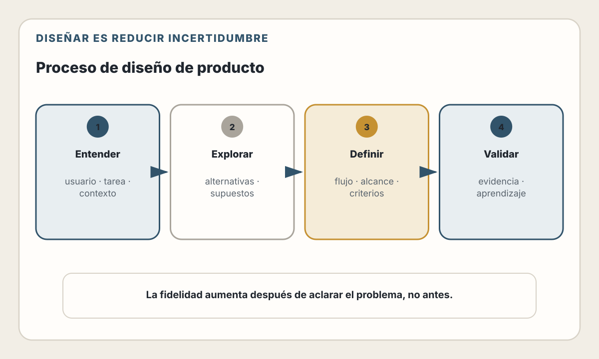
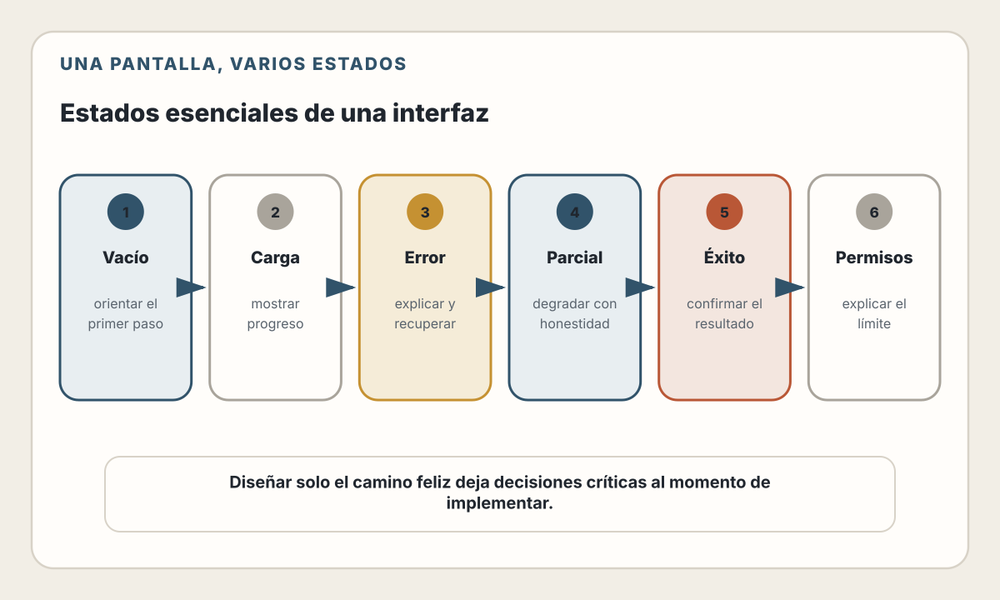

# 10. Diseño de Producto y UX

> "Design is not about artifacts or tools. It is about forming and shaping clarity of the intent through ideas, exploration, research, and discussion."
> — Karri Saarinen

> El mejor código del mundo no salva un producto mal diseñado.

## Objetivos de Aprendizaje

Al finalizar este capítulo, serás capaz de:
- Aplicar pensamiento centrado en el usuario al diseñar funcionalidades
- Distinguir entre wireframes, mockups y prototipos, y saber cuándo usar cada uno
- Entender qué es un sistema de diseño y por qué importa
- Incorporar accesibilidad desde las etapas tempranas del diseño

---

## Por qué los desarrolladores deben entender UX

"Eso es trabajo del diseñador, no mío."

Ese pensamiento es común, pero problemático. Como desarrollador:

- **Tomas decisiones de UX constantemente** — Estados de carga, mensajes de error, flujos de navegación, comportamiento de formularios
- **Implementas lo que otros diseñan** — Si no entiendes el "por qué" detrás de un diseño, es fácil romperlo durante la implementación
- **No siempre hay diseñador** — En startups, proyectos pequeños, o features rápidas, a menudo el desarrollador es quien diseña

📖 **Concepto**: **UX (User Experience)** es cómo se siente usar un producto. **UI (User Interface)** es cómo se ve. Puedes tener una UI hermosa con una UX terrible (bonito pero imposible de usar) o una UI simple con una UX excelente (feo pero funciona perfectamente).

---

## Pensamiento centrado en el usuario

El error más común: diseñar para ti mismo en lugar de para el usuario real.

### El usuario no es como tú

| Tu entorno de desarrollo | Un posible entorno real |
|---|---|
| Conexión rápida y estable | Conexión móvil inestable en el metro |
| Equipo reciente con memoria abundante | Teléfono de varios años con recursos limitados |
| Los mensajes técnicos te resultan familiares | «Error 500» no explica qué hacer |
| Conoces atajos de teclado | La persona puede usar solo mouse o pantalla táctil |
| Reconoces cuándo una acción sigue en curso | Sin feedback, la persona puede repetir la acción |

### Preguntas que deberías hacer siempre

Antes de diseñar cualquier funcionalidad:

1. **¿Quién es el usuario?**
   - ¿Qué tan técnico es?
   - ¿Con qué frecuencia usa el sistema?
   - ¿En qué contexto lo usa? (oficina, móvil, multitasking)

2. **¿Cuál es su objetivo?**
   - ¿Qué quiere lograr?
   - ¿Qué tan rápido necesita lograrlo?
   - ¿Qué pasa si no lo logra?

3. **¿Cuál es su estado mental?**
   - ¿Está apurado? ¿Estresado? ¿Relajado?
   - ¿Está haciendo esto porque quiere o porque tiene que?

### El concepto de "Jobs to be Done"

En lugar de pensar "el usuario quiere un botón de exportar", piensa:

> "El usuario quiere **terminar su trabajo de conciliación** para poder **irse a su casa a tiempo**."

El botón de exportar es solo un medio. El "job" real es terminar el trabajo.

| Pregunta | Perspectiva centrada en la función | Perspectiva centrada en el trabajo |
|---|---|---|
| ¿Qué construimos? | Un botón para exportar | Una forma de completar la conciliación bancaria mensual |
| ¿Qué medimos? | Clics en el botón | Tiempo y errores al completar la conciliación |
| ¿Qué significa éxito? | El botón responde | La persona termina el trabajo con menos tiempo y fricción |

💡 **Insight**: Cuando entiendes el "job", a veces descubres que la solución no es lo que pidieron. Quizás no necesitan exportar a Excel—necesitan que el sistema haga la conciliación automáticamente.

---

## El diseño es claridad, no artefactos

Antes de hablar del proceso y las herramientas, es importante entender qué es realmente diseñar.

Es tentador pensar que diseñar es:
- Crear wireframes en Figma
- Hacer mockups bonitos
- Entregar especificaciones visuales

Pero esos son **artefactos** — subproductos del diseño, no el diseño en sí.

**Diseñar es el proceso de clarificar la intención.** Es responder:
- ¿Qué problema estamos resolviendo?
- ¿Para quién?
- ¿Qué tradeoffs aceptamos?
- ¿Cómo sabremos si funciona?

Los wireframes y mockups son útiles porque **fuerzan claridad** — es difícil dibujar algo si no has decidido qué es. Pero el valor está en las decisiones que tomas, no en los píxeles que produces.

> 💡 **Insight**: En la era de agentes de IA que pueden generar interfaces
> completas en segundos, crear artefactos visuales se vuelve una capacidad más
> accesible. Lo que permanece valioso es **aclarar qué debe existir y por qué**:
> el trabajo intelectual de diseño que ninguna IA puede hacer por ti sin tu
> guía.

Esta perspectiva cambia cómo evalúas tu trabajo de diseño:

| Métrica superficial | Métrica real |
|---------------------|--------------|
| "Hice 5 wireframes" | "El equipo entiende qué construir" |
| "El mockup está en Figma" | "Las decisiones están documentadas" |
| "Se ve profesional" | "Resuelve el problema del usuario" |

---

## El proceso de diseño (simplificado)

No necesitas ser diseñador profesional para seguir un proceso básico:

<picture>
  <source media="(max-width: 820px)" srcset="../assets/diagrams/cap10-proceso-diseno-mobile.svg">
  
</picture>

### 1. Entender

Ya cubrimos esto en el capítulo 9. Antes de diseñar, asegúrate de entender:
- El problema real
- Quién es el usuario
- El contexto de uso

### 2. Explorar

Genera múltiples opciones antes de comprometerte con una:

- **Bocetos rápidos** — 5 ideas en 5 minutos, en papel
- **Benchmarking** — ¿Cómo resuelven esto otras aplicaciones?
- **"¿Qué pasaría si...?"** — Explora ideas locas sin juzgar

⚠️ **Advertencia**: El error más común es saltar directo a la primera idea que parece funcionar. Forzarte a generar al menos 3 alternativas te lleva a mejores soluciones.

### 3. Definir

Elige la mejor opción y detállala:

- Wireframes para la estructura
- Mockups para la apariencia
- Prototipos para el comportamiento

### 4. Validar

Prueba con usuarios reales antes de implementar:

- ¿Entienden qué hacer?
- ¿Logran completar la tarea?
- ¿Dónde se confunden o frustran?

---

## Wireframes, mockups y prototipos

Estos términos se confunden frecuentemente. Cada uno tiene un propósito diferente.

### Wireframe

**Qué es**: Esquema estructural, sin estilo visual. Solo cajas y texto.

**Para qué sirve**: Definir qué elementos hay y dónde van, sin distraerse con colores o tipografías.

Un wireframe de una portada, por ejemplo, puede reservar una franja superior
para marca y navegación, un bloque principal para título, explicación y acción
primaria, y una zona inferior para capacidades secundarias. Lo importante no
es su apariencia, sino poder discutir **jerarquía, orden y agrupación** antes de
invertir en detalle visual.

**Cuándo usarlo**:
- Al inicio, para discutir estructura con el equipo
- Para iterar rápido sin invertir en diseño visual
- Cuando el contenido y la jerarquía son más importantes que la estética

**Herramientas**: Papel y lápiz, Excalidraw, Balsamiq, Figma (modo wireframe)

### Mockup

**Qué es**: Diseño visual estático. Tiene colores, tipografías, imágenes reales.

**Para qué sirve**: Mostrar cómo se verá el producto final. No es interactivo.

**Cuándo usarlo**:
- Para aprobación de stakeholders
- Para entregar a desarrolladores como referencia visual
- Cuando la marca y estética son importantes

**Herramientas**: papel o pizarra para explorar; una herramienta de diseño
vectorial y colaboración para documentar.

### Prototipo

**Qué es**: Simulación interactiva que permite probar flujos antes de implementar.

**Para qué sirve**: Validar ideas con usuarios reales antes de invertir en desarrollo completo.

**Cuándo usarlo**:
- Para pruebas de usabilidad
- Para comunicar interacciones complejas
- Cuando necesitas validar antes de comprometerte con una arquitectura

**Herramientas**: editores de prototipos enlazados, código desechable o
generadores asistidos por IA.

> **Estado del ecosistema — verificado el 30 de julio de 2026.** Figma permite crear
> y compartir flujos de prototipo. Herramientas generativas como v0, Bolt y
> Lovable pueden producir desde una interfaz hasta una aplicación funcional.
> La categoría y el alcance cambian con rapidez: evalúa la salida, no la promesa
> comercial.

Estas herramientas reducen el coste de crear algo interactivo para aprender de
usuarios y stakeholders. La velocidad debe medirse en el flujo real del equipo,
no asumirse a partir de una demostración.

⚠️ **Advertencia crítica**: “Funciona como prototipo” no equivale a “está listo
para producción”. Verifica arquitectura, manejo de errores, seguridad,
privacidad, pruebas, accesibilidad, operación y propiedad del código antes de
reutilizar el resultado.

### Comparación rápida

| Aspecto | Wireframe | Mockup | Prototipo |
|---------|-----------|--------|-----------|
| Fidelidad | Baja | Alta | Variable |
| Interactivo | No | No | Sí |
| Tiempo de crear | Minutos | Horas/días | Horas |
| Para validar | Estructura | Estética | Comportamiento |
| Audiencia | Equipo interno | Stakeholders | Usuarios |

💡 **Insight**: No siempre necesitas los tres. Para un feature pequeño, un wireframe en papel puede ser suficiente. Para un producto nuevo, probablemente necesitas los tres.

---

## Sistemas de diseño

Un sistema de diseño es un conjunto de componentes reutilizables y reglas que garantizan consistencia.

### El problema que resuelve

Sin sistema de diseño:

| Decisión sin sistema | Pantalla A | Pantalla B | Pantalla C |
|---|---:|---:|---:|
| Azul del botón | `#0066CC` | `#0055BB` | `#0077DD` |
| Radio | `4px` | `8px` | `2px` |
| Espaciado interno | `12px 24px` | `10px 20px` | `16px 32px` |

Sin tokens y componentes compartidos, cada persona interpreta «un botón azul»
de forma distinta.

Con sistema de diseño:

```
<Button variant="primary">   →   Siempre igual:
                                 - Color: #0066CC
                                 - Radio: 4px
                                 - Padding: 12px 24px
                                 - Hover, focus, disabled definidos
```

### Componentes de un sistema de diseño

Un sistema de diseño combina cuatro niveles:

1. **Fundamentos o tokens:** color, tipografía, espaciado, sombras, bordes y radios.
2. **Componentes:** botones, campos, selectores, tarjetas, tablas y navegación.
3. **Patrones:** composición de formularios, búsqueda, feedback, estados vacíos y errores.
4. **Documentación:** criterios de uso, ejemplos y decisiones que evitan variantes arbitrarias.

### Sistemas de diseño populares (2025)

| Sistema | Creador | Framework |
|---------|---------|-----------|
| Material UI | Google | React |
| Ant Design | Alibaba | React |
| Chakra UI | Comunidad | React |
| Radix UI | WorkOS | React (headless) |
| shadcn/ui | shadcn | React + Tailwind |
| Vuetify | Comunidad | Vue |
| PrimeVue | PrimeTek | Vue |

📖 **Concepto**: Los componentes **headless** (como Radix) proveen funcionalidad y accesibilidad sin estilos. Tú aplicas tu propio diseño. Los componentes **styled** (como Material UI) vienen con estilos predefinidos.

### ¿Crear o usar uno existente?

| Crear tu propio sistema | Usar uno existente |
|-------------------------|-------------------|
| Control total sobre la estética | Más rápido para empezar |
| Diferenciación de marca | Patrones probados |
| Requiere tiempo y expertise | Menos flexibilidad visual |
| Mantenimiento continuo | Actualizaciones externas |

**Criterio de decisión**: reutiliza un sistema existente cuando cubra tus
requisitos de interacción, accesibilidad, marca y mantenimiento. Construye o
extiende uno propio cuando las restricciones del producto lo justifiquen y
exista capacidad para gobernarlo. Herramientas como `shadcn/ui` distribuyen el
código de los componentes; eso ofrece control, pero también transfiere al equipo
la responsabilidad de mantenerlo.

---

## Accesibilidad desde el diseño

La accesibilidad (a11y) no es un feature opcional ni algo que "se agrega después". Es un requisito fundamental.

### Por qué importa

- La OMS estima que **1,3 mil millones de personas —aproximadamente el 16 % de
  la población mundial— experimentan una discapacidad significativa**
- **Usuarios temporalmente limitados**: brazo roto, migraña, sol en la pantalla
- **Las obligaciones legales varían por jurisdicción**; WCAG es un estándar
  técnico, no una ley universal
- **Mejor UX para todos**: lo que ayuda a usuarios con discapacidad mejora la experiencia de todos

### Principios básicos (WCAG 2.2)

> **Estado del ecosistema — verificado el 30 de julio de 2026.** WCAG 2.2 es la
> recomendación vigente de W3C. Amplía WCAG 2.1 e incorpora, entre otros,
> criterios sobre foco visible, tamaño mínimo de objetivos, ayuda consistente y
> autenticación accesible.

```
P - Perceptible     ¿Puede el usuario percibir el contenido?
O - Operable        ¿Puede el usuario interactuar?
C - Comprensible    ¿Puede el usuario entender?
R - Robusto         ¿Funciona con diferentes tecnologías?
```

### Checklist mínimo para desarrolladores

**Visual:**
- [ ] Contraste de color suficiente (4.5:1 para texto normal)
- [ ] No usar solo color para comunicar información
- [ ] Texto redimensionable hasta 200% sin perder funcionalidad
- [ ] Contenido visible sin scroll horizontal en 320px

**Interacción:**
- [ ] Todo es accesible con teclado (Tab, Enter, Escape)
- [ ] Focus visible en elementos interactivos
- [ ] Objetivos de interacción de al menos 24x24 píxeles CSS, o con el
      espaciado y las excepciones admitidas por WCAG 2.2
- [ ] Siempre que el diseño lo permita, áreas de toque de 44x44 píxeles CSS
      para ofrecer una experiencia más cómoda
- [ ] No hay trampas de teclado (poder salir de modales, etc.)

**Contenido:**
- [ ] Imágenes tienen alt text descriptivo
- [ ] Videos tienen subtítulos
- [ ] Formularios tienen labels asociados
- [ ] Mensajes de error son claros y específicos

**Estructura:**
- [ ] Jerarquía de headings correcta (h1, h2, h3...)
- [ ] Landmarks semánticos (header, main, nav, footer)
- [ ] Los enlaces tienen texto descriptivo (no "haz clic aquí")

### Herramientas para verificar accesibilidad

| Herramienta | Qué hace |
|-------------|----------|
| axe DevTools | Extensión de Chrome que audita la página |
| Lighthouse | Auditoría integrada en Chrome DevTools |
| WAVE | Evaluador web de accesibilidad |
| Contrast Checker | Verifica ratios de contraste |
| Screen reader | VoiceOver (Mac), NVDA (Windows) |

Las herramientas automáticas solo detectan una parte de los problemas. Combina
análisis automático, navegación con teclado, revisión con tecnologías de
asistencia y pruebas con personas cuando el riesgo lo amerite.

### Ejemplo: diseñando un formulario accesible

```html
<!-- ❌ Mal -->
<input type="text" placeholder="Email">
<div class="error" style="color: red;">Invalid</div>

<!-- ✅ Bien -->
<label for="email">Correo electrónico</label>
<input
  type="email"
  id="email"
  aria-describedby="email-error"
  aria-invalid="true"
>
<div id="email-error" role="alert">
  Por favor ingresa un correo válido, por ejemplo: nombre@empresa.com
</div>
```

Diferencias clave:
- Label explícito asociado al input
- Tipo de input correcto (`email`)
- `aria-describedby` conecta el error con el input
- `aria-invalid` indica estado de error
- `role="alert"` anuncia el error a screen readers
- Mensaje de error específico y útil

---

## Estados de UI que siempre debes diseñar

Un error común es diseñar solo el "happy path". Estos estados son igualmente importantes:

<picture>
  <source media="(max-width: 820px)" srcset="../assets/diagrams/cap10-estados-ui-mobile.svg">
  
</picture>

### 1. Estado vacío (Empty state)

Cuando no hay datos, explica por qué está vacío, qué aparecerá allí y cuál es
el siguiente paso útil. Por ejemplo: «Todavía no tienes mensajes. Invita a una
persona para iniciar una conversación».

### 2. Estado de carga (Loading state)

Mientras se obtienen datos, conserva la estructura prevista, comunica progreso
y evita que una pantalla vacía parezca un fallo. Un skeleton solo ayuda si se
parece al contenido que llegará y no simula actividad indefinida.

### 3. Estado de error

Cuando algo falla, di qué no pudo completarse, conserva los datos introducidos
cuando sea seguro y ofrece una recuperación concreta, como reintentar. No
atribuyas el fallo a la conexión del usuario si no tienes evidencia de ello.

### 4. Estado parcial

Cuando hay algunos datos pero no todos.

### 5. Estado de éxito

Confirmación de que una acción se completó.

### 6. Estado de permisos

Cuando el usuario no tiene acceso.

💡 **Insight**: Antes de dar por terminado un diseño, pregúntate: "¿Qué ve el usuario cuando está vacío? ¿Cuando está cargando? ¿Cuando falla? ¿Cuando no tiene permiso?" Si no tienes respuesta, el diseño está incompleto.

---

## 🤖 Usando IA para Diseño de Producto

La IA está transformando el diseño de interfaces, pero su rol es acelerar la exploración, no reemplazar el pensamiento de diseño.

### Herramientas especializadas

**Para generar UI desde descripciones:**
- **v0.dev** (Vercel) — Genera componentes React desde texto. Ideal para explorar variaciones rápidamente.
- **Lovable** — Genera aplicaciones web completas. Útil para prototipos funcionales en horas.

**Para diseño visual:**
- **Figma AI** — Genera variantes, sugiere layouts, auto-completa diseños.
- **Galileo AI** — Crea interfaces completas desde descripciones.

### Prompts útiles para diseño

**Explorar alternativas:**
```
Prompt: "Dame 5 formas diferentes de diseñar una pantalla de
onboarding para una app de fitness. Para cada una, explica
qué tipo de usuario se beneficiaría más."
```

**Mejorar un diseño existente:**
```
Prompt: "Este es el wireframe de mi checkout [descripción/imagen].
¿Qué problemas de usabilidad ves? ¿Qué cambios sugerirías para
reducir el abandono del carrito?"
```

**Generar copy para UI:**
```
Prompt: "Escribe el microcopy para estos estados de un formulario
de registro: campo vacío, email inválido, contraseña muy corta,
éxito. Tono: amigable pero profesional."
```

**Validar accesibilidad:**
```
Prompt: "Revisa esta estructura HTML de formulario. ¿Cumple con
WCAG 2.1 nivel AA? ¿Qué atributos ARIA faltan?"
```

### Limitaciones importantes

- **La IA no conoce a TUS usuarios** — Puede sugerir "mejores prácticas" que no aplican a tu audiencia específica
- **Sesgo hacia lo común** — Tiende a generar diseños genéricos que has visto mil veces
- **No prueba con usuarios reales** — Un diseño "bonito" de IA puede fallar completamente en usabilidad
- **Ignora tu sistema de diseño** — Genera componentes que pueden no integrarse con lo que ya tienes

### Cuándo usar IA vs diseñador humano

| Usa IA para... | Usa humano para... |
|----------------|-------------------|
| Explorar muchas variantes rápido | Decisiones estratégicas de producto |
| Generar borradores iniciales | Investigación con usuarios |
| Prototipos desechables | Diseño de sistema coherente |
| Ideas cuando estás bloqueado | Problemas de UX complejos |

⚠️ **Advertencia**: No uses diseños generados por IA directamente en producción sin validar con usuarios reales. La IA optimiza para "verse bien", no para "funcionar bien".

---

## Resumen

- Los desarrolladores toman decisiones de UX constantemente—entender los principios básicos es esencial
- **Piensa en el usuario**, no en ti mismo. El usuario no es técnico, puede estar apurado, y usa el sistema de formas que no anticipas
- **Jobs to be Done**: enfócate en lo que el usuario quiere lograr, no en los features que pide
- **Wireframes** (estructura), **mockups** (visual), **prototipos** (interactivo)—cada uno tiene su momento
- Los **sistemas de diseño** garantizan consistencia y aceleran el desarrollo
- La **accesibilidad** no es opcional—es requisito fundamental que mejora la UX de todos
- Siempre diseña los **estados de UI**: vacío, cargando, error, éxito, sin permisos

---

## Ejercicios

1. **Auditoría de accesibilidad**: Elige una aplicación web que uses frecuentemente. Usa la extensión axe DevTools para auditar una página. ¿Cuántos errores de accesibilidad encuentras?

2. **Diseño de estados**: Toma una pantalla de lista de productos. Diseña (pueden ser bocetos en papel) los 5 estados: vacío, cargando, con datos, error, y sin permisos.

3. **Jobs to be Done**: Tu jefe dice "necesitamos agregar notificaciones push". Antes de diseñar, escribe 5 preguntas que harías para entender el "job" real que el usuario quiere completar.

4. **Wireframe rápido**: En 10 minutos, dibuja 3 versiones diferentes de cómo podría verse una página de checkout de e-commerce. No te preocupes por que sean bonitas—enfócate en explorar diferentes estructuras.

---

## Referencias

- Krug, S. (2014). *Don't Make Me Think*, 3rd Edition. New Riders. — Clásico sobre usabilidad web
- Norman, D. (2013). *The Design of Everyday Things*. Basic Books. — Principios fundamentales de diseño
- Organización Mundial de la Salud. *Disability*. https://www.who.int/news-room/fact-sheets/detail/disability-and-health
- W3C. *Web Content Accessibility Guidelines (WCAG) 2.2*. https://www.w3.org/TR/WCAG22/
- W3C. *Understanding Success Criterion 2.5.8: Target Size (Minimum)*. https://www.w3.org/WAI/WCAG22/Understanding/target-size-minimum.html
- Vercel. *What is v0?*. https://v0.dev/docs/introduction
- Christensen, C. (2016). *Competing Against Luck*. Harper Business. — Jobs to be Done

---

**Anterior**: [Entendiendo el Problema](./09-entendiendo-problema.md) | **Siguiente**: [Arquitectura de Software](./11-arquitectura-software.md)
