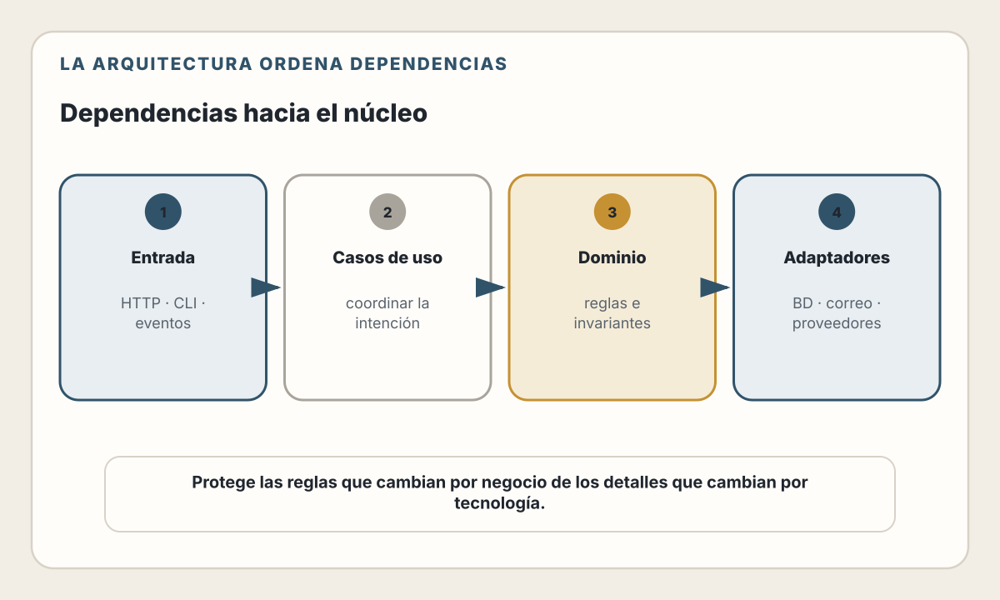
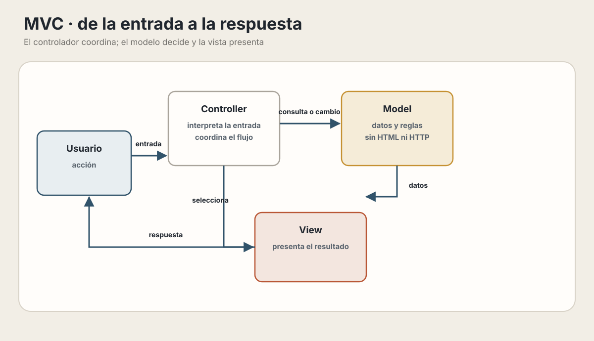
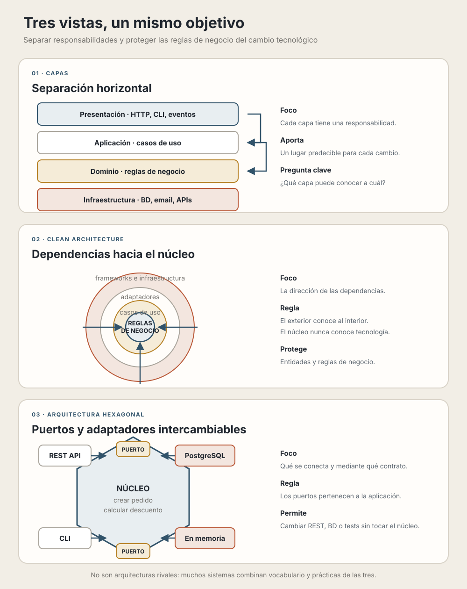

# 11. Arquitectura de Software

> La arquitectura es las decisiones que desearías haber tomado correctamente al principio del proyecto.

## Objetivos de Aprendizaje

Al finalizar este capítulo, serás capaz de:
- Entender por qué necesitamos organizar el código de cierta manera
- Aplicar el principio de separación de responsabilidades
- Comprender qué son las dependencias y cómo manejarlas
- Usar interfaces para desacoplar componentes
- Conocer los patrones arquitectónicos más comunes y cuándo aplicarlos

## Ruta de lectura y alcance

Este capítulo funciona como referencia en tres recorridos:

1. **Fundamentos**: separación de responsabilidades, módulos, dependencias e
   inyección.
2. **Patrones**: capas, MVC, Clean Architecture y arquitectura hexagonal.
3. **Evolución**: elección proporcional, diseño para el cambio, fitness
   functions y ADRs.

En una primera lectura, sigue los fundamentos y la sección “Cuándo usar qué
patrón”; vuelve a los ejemplos completos cuando debas aplicar uno. El capítulo
16 lleva estas ideas al backend. El capítulo 13 se ocupa del modelo de datos y
el 19 de transacciones, acceso y caché: aquí solo importa cómo esas decisiones
afectan los límites y dependencias del sistema.

---

## El problema: código espagueti

Antes de hablar de arquitectura, veamos el problema que intenta resolver.

Imagina que estás construyendo una funcionalidad simple: registrar un usuario. Esta es una primera implementación que "funciona":

```javascript
// Un solo archivo: app.js
const express = require('express');
const bcrypt = require('bcrypt');
const { Pool } = require('pg');
const nodemailer = require('nodemailer');

const app = express();
const db = new Pool({ connectionString: 'postgres://...' });
const mailer = nodemailer.createTransport({ /* config */ });

app.post('/register', async (req, res) => {
  // 1. Obtener datos
  const { email, password, name } = req.body;

  // 2. Validar
  if (!email) {
    return res.status(400).json({ error: 'Email es requerido' });
  }
  if (!email.includes('@')) {
    return res.status(400).json({ error: 'Email inválido' });
  }
  if (!password || password.length < 8) {
    return res.status(400).json({ error: 'Password debe tener al menos 8 caracteres' });
  }

  // 3. Verificar si ya existe
  const existing = await db.query(
    'SELECT id FROM users WHERE email = $1',
    [email]
  );
  if (existing.rows.length > 0) {
    return res.status(409).json({ error: 'El usuario ya existe' });
  }

  // 4. Hashear password
  const hashedPassword = await bcrypt.hash(password, 10);

  // 5. Guardar en base de datos
  const result = await db.query(
    'INSERT INTO users (email, password, name, created_at) VALUES ($1, $2, $3, NOW()) RETURNING id, email, name',
    [email, hashedPassword, name]
  );

  // 6. Enviar email de bienvenida
  await mailer.sendMail({
    from: 'noreply@miapp.com',
    to: email,
    subject: 'Bienvenido a MiApp',
    html: `<h1>Hola ${name}!</h1><p>Gracias por registrarte.</p>`
  });

  // 7. Responder
  res.status(201).json({
    id: result.rows[0].id,
    email: result.rows[0].email,
    name: result.rows[0].name
  });
});

app.listen(3000);
```

**Este código funciona.** Hace exactamente lo que necesita hacer. Entonces, ¿cuál es el problema?

### Los problemas aparecen cuando el código crece

**Problema 1: ¿Cómo pruebo esto?**

Para probar este código necesitas:
- Una base de datos PostgreSQL real corriendo
- Un servidor de email configurado
- Hacer requests HTTP reales

No puedes probar solo la lógica de "verificar que el email tiene @" sin levantar todo el sistema.

**Problema 2: ¿Qué pasa si necesito registrar usuarios desde otro lugar?**

Digamos que ahora también quieres poder crear usuarios desde:
- Un comando de línea de comandos para admins
- Un proceso que importa usuarios de un CSV
- Un webhook de otro sistema

¿Copias y pegas las 50 líneas? ¿Qué pasa cuando cambias algo y olvidas actualizar una de las copias?

**Problema 3: ¿Qué pasa si cambio el proveedor de email?**

Decides cambiar de Nodemailer a SendGrid. Tienes que buscar en todo el código dónde usas Nodemailer y cambiarlo. Si tienes 20 lugares donde envías emails, son 20 cambios.

**Problema 4: ¿Quién puede trabajar en qué?**

Si dos desarrolladores necesitan modificar este archivo al mismo tiempo (uno trabajando en validación, otro en emails), van a tener conflictos constantes.

**Problema 5: ¿Dónde pongo el nuevo código?**

Cuando agregas una nueva funcionalidad, ¿va en este archivo que ya tiene 500 líneas? ¿Creas uno nuevo? ¿Cómo se relacionan?

📖 **Concepto**: El código "espagueti" no es código que no funciona. Es código que funciona pero es **difícil de cambiar, probar, entender y escalar**. La arquitectura existe para resolver estos problemas.

---

## El concepto fundamental: Separación de Responsabilidades

La idea más importante de toda la arquitectura de software es esta:

> **Cada pieza de código debe tener una sola razón para cambiar.**

Esto se conoce como el **Principio de Responsabilidad Única** (Single Responsibility Principle o SRP).

### ¿Qué significa "responsabilidad"?

Una responsabilidad es una "razón para cambiar". Veamos el código anterior. ¿Cuántas razones para cambiar tiene?

```
Razones por las que tendría que modificar este código:

1. Cambiar las reglas de validación del email
2. Cambiar las reglas de validación del password
3. Cambiar cómo se verifica si el usuario existe
4. Cambiar el algoritmo de hash
5. Cambiar la estructura de la tabla en la base de datos
6. Cambiar el proveedor de email
7. Cambiar el contenido del email de bienvenida
8. Cambiar el formato de la respuesta JSON
9. Cambiar los códigos de error HTTP
```

¡9 razones para cambiar en un solo bloque de código! Cada vez que cambias algo, corres el riesgo de romper algo no relacionado.

### Separando responsabilidades: el primer paso

Vamos a reorganizar el código separando cada responsabilidad en su propia función:

```javascript
// Ahora con funciones separadas

// ===== VALIDACIÓN =====
function validateEmail(email) {
  if (!email) {
    return { valid: false, error: 'Email es requerido' };
  }
  if (!email.includes('@')) {
    return { valid: false, error: 'Email inválido' };
  }
  return { valid: true };
}

function validatePassword(password) {
  if (!password || password.length < 8) {
    return { valid: false, error: 'Password debe tener al menos 8 caracteres' };
  }
  return { valid: true };
}

// ===== BASE DE DATOS =====
async function findUserByEmail(email) {
  const result = await db.query(
    'SELECT id FROM users WHERE email = $1',
    [email]
  );
  return result.rows[0] || null;
}

async function createUser(email, hashedPassword, name) {
  const result = await db.query(
    'INSERT INTO users (email, password, name, created_at) VALUES ($1, $2, $3, NOW()) RETURNING id, email, name',
    [email, hashedPassword, name]
  );
  return result.rows[0];
}

// ===== SEGURIDAD =====
async function hashPassword(password) {
  return bcrypt.hash(password, 10);
}

// ===== EMAIL =====
async function sendWelcomeEmail(email, name) {
  await mailer.sendMail({
    from: 'noreply@miapp.com',
    to: email,
    subject: 'Bienvenido a MiApp',
    html: `<h1>Hola ${name}!</h1><p>Gracias por registrarte.</p>`
  });
}

// ===== ENDPOINT =====
app.post('/register', async (req, res) => {
  const { email, password, name } = req.body;

  // Validar
  const emailValidation = validateEmail(email);
  if (!emailValidation.valid) {
    return res.status(400).json({ error: emailValidation.error });
  }

  const passwordValidation = validatePassword(password);
  if (!passwordValidation.valid) {
    return res.status(400).json({ error: passwordValidation.error });
  }

  // Verificar existencia
  const existingUser = await findUserByEmail(email);
  if (existingUser) {
    return res.status(409).json({ error: 'El usuario ya existe' });
  }

  // Crear usuario
  const hashedPassword = await hashPassword(password);
  const user = await createUser(email, hashedPassword, name);

  // Enviar email
  await sendWelcomeEmail(email, name);

  // Responder
  res.status(201).json(user);
});
```

### ¿Qué ganamos con esto?

1. **Puedo probar cada función por separado**:
```javascript
// Puedo probar la validación sin base de datos
test('validateEmail rechaza emails sin @', () => {
  const result = validateEmail('invalido');
  expect(result.valid).toBe(false);
});
```

2. **Puedo reusar las funciones**:
```javascript
// En otro endpoint
app.post('/invite', async (req, res) => {
  const validation = validateEmail(req.body.email);
  // ... reusar la misma validación
});
```

3. **Los cambios están localizados**:
   - ¿Cambiar reglas de password? Solo toco `validatePassword`
   - ¿Cambiar query de búsqueda? Solo toco `findUserByEmail`

4. **El código principal es legible**: El endpoint ahora lee como una historia: validar, verificar, crear, enviar, responder.

💡 **Insight**: Este es el primer paso de la arquitectura. No necesitas frameworks ni patrones complicados. Solo separar responsabilidades en funciones con nombres claros.

---

## Organizando en archivos: módulos

El siguiente paso natural es separar estas funciones en archivos diferentes:

```
src/
├── app.js                 # Configuración de Express
├── routes/
│   └── userRoutes.js      # Endpoints de usuario
├── validators/
│   └── userValidators.js  # Funciones de validación
├── services/
│   └── userService.js     # Lógica de negocio
├── repositories/
│   └── userRepository.js  # Acceso a base de datos
└── emails/
    └── emailService.js    # Envío de emails
```

Veamos cómo queda cada archivo:

### validators/userValidators.js
```javascript
// Solo validación, nada más
function validateEmail(email) {
  if (!email) {
    return { valid: false, error: 'Email es requerido' };
  }
  if (!email.includes('@')) {
    return { valid: false, error: 'Email inválido' };
  }
  return { valid: true };
}

function validatePassword(password) {
  if (!password || password.length < 8) {
    return { valid: false, error: 'Password debe tener al menos 8 caracteres' };
  }
  return { valid: true };
}

module.exports = { validateEmail, validatePassword };
```

### repositories/userRepository.js
```javascript
// Solo acceso a base de datos
const db = require('../config/database');

async function findByEmail(email) {
  const result = await db.query(
    'SELECT * FROM users WHERE email = $1',
    [email]
  );
  return result.rows[0] || null;
}

async function create(userData) {
  const result = await db.query(
    'INSERT INTO users (email, password, name, created_at) VALUES ($1, $2, $3, NOW()) RETURNING id, email, name',
    [userData.email, userData.password, userData.name]
  );
  return result.rows[0];
}

module.exports = { findByEmail, create };
```

### emails/emailService.js
```javascript
// Solo envío de emails
const mailer = require('../config/mailer');

async function sendWelcomeEmail(email, name) {
  await mailer.sendMail({
    from: 'noreply@miapp.com',
    to: email,
    subject: 'Bienvenido a MiApp',
    html: `<h1>Hola ${name}!</h1><p>Gracias por registrarte.</p>`
  });
}

module.exports = { sendWelcomeEmail };
```

### services/userService.js
```javascript
// Orquesta la lógica de negocio
const bcrypt = require('bcrypt');
const userRepository = require('../repositories/userRepository');
const emailService = require('../emails/emailService');

async function registerUser(email, password, name) {
  // Verificar si existe
  const existingUser = await userRepository.findByEmail(email);
  if (existingUser) {
    throw new Error('USER_ALREADY_EXISTS');
  }

  // Crear usuario
  const hashedPassword = await bcrypt.hash(password, 10);
  const user = await userRepository.create({
    email,
    password: hashedPassword,
    name
  });

  // Enviar email de bienvenida
  await emailService.sendWelcomeEmail(email, name);

  return user;
}

module.exports = { registerUser };
```

### routes/userRoutes.js
```javascript
// Solo maneja HTTP requests/responses
const express = require('express');
const { validateEmail, validatePassword } = require('../validators/userValidators');
const userService = require('../services/userService');

const router = express.Router();

router.post('/register', async (req, res) => {
  const { email, password, name } = req.body;

  // Validar input
  const emailValidation = validateEmail(email);
  if (!emailValidation.valid) {
    return res.status(400).json({ error: emailValidation.error });
  }

  const passwordValidation = validatePassword(password);
  if (!passwordValidation.valid) {
    return res.status(400).json({ error: passwordValidation.error });
  }

  // Ejecutar lógica de negocio
  try {
    const user = await userService.registerUser(email, password, name);
    res.status(201).json(user);
  } catch (error) {
    if (error.message === 'USER_ALREADY_EXISTS') {
      return res.status(409).json({ error: 'El usuario ya existe' });
    }
    res.status(500).json({ error: 'Error interno' });
  }
});

module.exports = router;
```

### ¿Qué ganamos con los módulos?

| Pregunta | Módulo responsable |
|---|---|
| ¿Dónde está la validación? | `validators/userValidators.js` |
| ¿Quién habla con la base de datos? | `repositories/userRepository.js` |
| ¿Cómo se envían correos? | `emails/emailService.js` |
| ¿Cuál es la lógica de negocio? | `services/userService.js` |
| ¿Cómo se manejan las peticiones? | `routes/userRoutes.js` |

Ahora cuando alguien nuevo llega al proyecto, sabe dónde buscar cada cosa.

---

## Entendiendo las dependencias

Cuando un módulo usa otro módulo, decimos que tiene una **dependencia** sobre él.

### Visualizando dependencias

<picture>
  <source media="(max-width: 820px)" srcset="../assets/diagrams/cap11-dependencias-arquitectura-mobile.svg">
  
</picture>

Esto significa:
- Si un adaptador cambia su interfaz, debe seguir cumpliendo el contrato que consume la aplicación.
- Si cambia una regla del negocio, el dominio y el caso de uso pueden evolucionar sin obligar a reemplazar todos los detalles técnicos.
- La dirección de las dependencias determina qué partes quedan protegidas de los cambios externos.

### El problema de las dependencias rígidas

En nuestro código actual:

```javascript
// services/userService.js
const userRepository = require('../repositories/userRepository');

async function registerUser(email, password, name) {
  const existingUser = await userRepository.findByEmail(email);
  // ...
}
```

`userService` está **directamente acoplado** a `userRepository`. Esto significa:

1. **No puedo probar `userService` sin una base de datos real**
2. **No puedo usar un repositorio diferente** (ej: uno en memoria para tests)
3. **Si cambio la implementación del repositorio, podría romper el servicio**

📖 **Concepto**: El **acoplamiento** es qué tan dependiente es un módulo de los detalles internos de otro. **Alto acoplamiento** = cambios en uno requieren cambios en el otro. **Bajo acoplamiento** = pueden cambiar independientemente.

---

## Desacoplando con Inyección de Dependencias

La **inyección de dependencias** es una técnica que reduce el acoplamiento. En lugar de que un módulo cree o importe sus dependencias, las **recibe desde afuera**.

### Antes: dependencia rígida

```javascript
// services/userService.js
const userRepository = require('../repositories/userRepository');  // Rígido

async function registerUser(email, password, name) {
  const existingUser = await userRepository.findByEmail(email);
  // ...
}
```

### Después: dependencia inyectada

```javascript
// services/userService.js
// Ya no importa el repositorio, lo recibe como parámetro

function createUserService(userRepository, emailService) {
  return {
    async registerUser(email, password, name) {
      const existingUser = await userRepository.findByEmail(email);

      if (existingUser) {
        throw new Error('USER_ALREADY_EXISTS');
      }

      const hashedPassword = await bcrypt.hash(password, 10);
      const user = await userRepository.create({
        email,
        password: hashedPassword,
        name
      });

      await emailService.sendWelcomeEmail(email, name);

      return user;
    }
  };
}

module.exports = { createUserService };
```

### Configurando las dependencias

```javascript
// app.js o un archivo de configuración
const { createUserService } = require('./services/userService');
const userRepository = require('./repositories/userRepository');
const emailService = require('./emails/emailService');

// Creo el servicio inyectando sus dependencias
const userService = createUserService(userRepository, emailService);

// Ahora uso userService en mis routes
```

### ¿Qué ganamos?

**1. Puedo probar con dependencias falsas (mocks):**

```javascript
// En mis tests
test('registerUser crea usuario correctamente', async () => {
  // Creo repositorio falso que no usa base de datos real
  const fakeRepository = {
    findByEmail: async () => null,  // Simula que no existe
    create: async (data) => ({ id: 1, ...data })  // Simula creación
  };

  // Creo servicio de email falso
  const fakeEmailService = {
    sendWelcomeEmail: async () => {}  // No hace nada
  };

  // Creo el servicio con las dependencias falsas
  const userService = createUserService(fakeRepository, fakeEmailService);

  // Ahora puedo probar la lógica sin BD ni emails reales
  const user = await userService.registerUser('test@test.com', 'password123', 'Test');

  expect(user.email).toBe('test@test.com');
});
```

**2. Puedo intercambiar implementaciones:**

```javascript
// En desarrollo, uso base de datos real
const prodUserService = createUserService(
  postgresUserRepository,
  sendgridEmailService
);

// En tests, uso implementaciones en memoria
const testUserService = createUserService(
  inMemoryUserRepository,
  mockEmailService
);
```

💡 **Insight**: La inyección de dependencias parece más trabajo al principio, pero paga dividendos enormes cuando necesitas probar o cambiar componentes.

---

## Interfaces: contratos entre módulos

Una **interfaz** es un contrato que define qué métodos debe tener un objeto, sin especificar cómo los implementa.

### El problema

Cuando `userService` recibe un `userRepository`, ¿cómo sabe qué métodos tiene? En nuestro código actual, lo asumimos:

```javascript
function createUserService(userRepository, emailService) {
  return {
    async registerUser(email, password, name) {
      // Asumimos que userRepository tiene findByEmail y create
      const existingUser = await userRepository.findByEmail(email);
      // ...
    }
  };
}
```

Si alguien pasa un objeto que no tiene `findByEmail`, el código explota en runtime.

### Definiendo interfaces (contratos)

En JavaScript puro, podemos documentar las interfaces con comentarios o usar TypeScript:

```javascript
/**
 * Interfaz IUserRepository
 *
 * Cualquier repositorio de usuarios debe implementar estos métodos:
 *
 * - findByEmail(email: string): Promise<User | null>
 * - findById(id: number): Promise<User | null>
 * - create(userData: object): Promise<User>
 * - update(id: number, userData: object): Promise<User>
 * - delete(id: number): Promise<void>
 */
```

En TypeScript (más explícito):

```typescript
// interfaces/IUserRepository.ts
interface IUserRepository {
  findByEmail(email: string): Promise<User | null>;
  findById(id: number): Promise<User | null>;
  create(userData: CreateUserData): Promise<User>;
  update(id: number, userData: UpdateUserData): Promise<User>;
  delete(id: number): Promise<void>;
}

// Ahora el servicio declara qué tipo espera
function createUserService(
  userRepository: IUserRepository,
  emailService: IEmailService
) {
  // ...
}
```

### Múltiples implementaciones de la misma interfaz

El poder de las interfaces es que puedes tener varias implementaciones:

`IUserRepository` puede ser implementado por un repositorio PostgreSQL, otro
almacenamiento o una versión en memoria para pruebas. La interfaz solo resulta
útil si esas implementaciones comparten una semántica que el consumidor puede
comprobar mediante tests de contrato.

```javascript
// repositories/postgresUserRepository.js
// Implementación para PostgreSQL
const db = require('../config/database');

module.exports = {
  async findByEmail(email) {
    const result = await db.query('SELECT * FROM users WHERE email = $1', [email]);
    return result.rows[0] || null;
  },
  async create(userData) {
    const result = await db.query(
      'INSERT INTO users (email, password, name) VALUES ($1, $2, $3) RETURNING *',
      [userData.email, userData.password, userData.name]
    );
    return result.rows[0];
  }
};

// repositories/inMemoryUserRepository.js
// Implementación en memoria para tests
const users = [];
let nextId = 1;

module.exports = {
  async findByEmail(email) {
    return users.find(u => u.email === email) || null;
  },
  async create(userData) {
    const user = { id: nextId++, ...userData };
    users.push(user);
    return user;
  },
  // Para tests: limpiar datos
  _reset() {
    users.length = 0;
    nextId = 1;
  }
};
```

### El servicio no sabe (ni le importa) qué implementación usa

```javascript
// El servicio solo sabe que recibe "algo" que cumple con IUserRepository
function createUserService(userRepository, emailService) {
  return {
    async registerUser(email, password, name) {
      // Este código funciona igual con Postgres, MongoDB, o InMemory
      const existingUser = await userRepository.findByEmail(email);
      // ...
    }
  };
}
```

📖 **Concepto**: Las interfaces crean una **capa de abstracción**. El servicio depende de la abstracción (la interfaz), no de la implementación concreta (PostgreSQL). Esto permite cambiar implementaciones sin modificar el servicio.

---

## El patrón de capas

Ahora que entendemos separación de responsabilidades, dependencias e interfaces, podemos hablar del patrón de capas.

### La idea

Organizar el código en **capas horizontales** donde cada capa tiene una responsabilidad específica y solo puede comunicarse con ciertas otras capas.

| Capa | Responsabilidad | Ejemplos | Dependencias permitidas |
|---|---|---|---|
| Presentación | Traducir entradas y salidas del mundo exterior | Controladores, rutas, validación de forma | Aplicación |
| Aplicación | Coordinar casos de uso | Servicios de aplicación, comandos, consultas | Dominio y puertos |
| Dominio | Proteger reglas e invariantes | Entidades, objetos de valor, políticas | Ningún detalle externo |
| Infraestructura | Comunicarse con sistemas externos | Repositorios, correo, APIs, archivos | Contratos definidos hacia el interior |

La dependencia apunta hacia las reglas que queremos proteger. La
infraestructura implementa capacidades requeridas por la aplicación; el
dominio no importa drivers ni conoce el protocolo de entrada.

### Ejemplo concreto: estructura de carpetas

```
src/
├── presentation/           # Capa de Presentación
│   ├── routes/
│   │   └── userRoutes.js
│   ├── controllers/
│   │   └── userController.js
│   └── validators/
│       └── userValidators.js
│
├── application/            # Capa de Aplicación
│   └── services/
│       └── userService.js
│
├── domain/                 # Capa de Dominio
│   ├── entities/
│   │   └── User.js
│   └── interfaces/         # Contratos
│       ├── IUserRepository.js
│       └── IEmailService.js
│
└── infrastructure/         # Capa de Infraestructura
    ├── repositories/
    │   └── postgresUserRepository.js
    ├── email/
    │   └── sendgridEmailService.js
    └── config/
        └── database.js
```

### ¿Por qué capas?

**1. Cada capa puede cambiar independientemente:**
- Cambiar de Express a Fastify → solo cambia Presentación
- Cambiar de PostgreSQL a MongoDB → solo cambia Infraestructura
- Cambiar reglas de negocio → solo cambia Dominio

**2. Las capas se pueden probar por separado:**
- Probar Dominio → no necesita nada externo
- Probar Aplicación → usar mocks de Infraestructura
- Probar Presentación → usar mocks de Aplicación

**3. Los nuevos desarrolladores saben dónde buscar:**
- "¿Dónde está la lógica de calcular descuentos?" → Dominio
- "¿Dónde se guardan los pedidos?" → Infraestructura
- "¿Cómo se formatea la respuesta del API?" → Presentación

---

## El patrón MVC explicado

MVC (Model-View-Controller) es probablemente el patrón más conocido. Muchos frameworks lo usan: Rails, Laravel, Django, Spring.

### Los tres componentes

<picture>
  <source media="(max-width: 820px)" srcset="../assets/diagrams/cap11-mvc-flujo-mobile.svg">
  
</picture>

**CONTROLLER** (Controlador):
- Recibe la entrada del usuario (petición HTTP, clic, etc.)
- Decide qué hacer con ese input
- Llama al Model para obtener/modificar datos
- Elige qué View usar para mostrar el resultado

**MODEL** (Modelo):
- Contiene los datos y la lógica de negocio
- Sabe cómo validar, calcular, guardar
- No sabe nada sobre HTTP ni HTML

**VIEW** (Vista):
- Presenta los datos al usuario
- HTML, JSON, XML, etc.
- No contiene lógica de negocio

### Ejemplo en código

```javascript
// ===== MODEL =====
// models/User.js
class User {
  constructor(data) {
    this.id = data.id;
    this.email = data.email;
    this.name = data.name;
    this.createdAt = data.created_at;
  }

  // Lógica de negocio
  isEmailValid() {
    return this.email && this.email.includes('@');
  }

  // Acceso a datos (en MVC tradicional, el model conoce la BD)
  static async findById(id) {
    const result = await db.query('SELECT * FROM users WHERE id = $1', [id]);
    return result.rows[0] ? new User(result.rows[0]) : null;
  }

  static async create(data) {
    const result = await db.query(
      'INSERT INTO users (email, name) VALUES ($1, $2) RETURNING *',
      [data.email, data.name]
    );
    return new User(result.rows[0]);
  }

  toJSON() {
    return {
      id: this.id,
      email: this.email,
      name: this.name
    };
  }
}

// ===== CONTROLLER =====
// controllers/userController.js
class UserController {
  // GET /users/:id
  async show(req, res) {
    const user = await User.findById(req.params.id);

    if (!user) {
      return res.status(404).json({ error: 'Usuario no encontrado' });
    }

    // Usa la "view" (en APIs REST, la view es el JSON)
    res.json(user.toJSON());
  }

  // POST /users
  async create(req, res) {
    const { email, name } = req.body;

    // Validación simple
    if (!email || !email.includes('@')) {
      return res.status(400).json({ error: 'Email inválido' });
    }

    const user = await User.create({ email, name });

    res.status(201).json(user.toJSON());
  }
}

// ===== ROUTES =====
// routes/users.js
const userController = new UserController();

router.get('/users/:id', (req, res) => userController.show(req, res));
router.post('/users', (req, res) => userController.create(req, res));
```

### Ventajas de MVC

- **Simple de entender**: tres conceptos claros
- **Muy documentado**: miles de tutoriales y ejemplos
- **Funciona bien para CRUD**: aplicaciones simples con operaciones básicas

### Limitaciones de MVC

- **El Model hace demasiado**: datos + lógica + acceso a BD, todo junto
- **Difícil de escalar**: cuando la lógica crece, el Model se vuelve enorme
- **Acoplamiento a la BD**: el Model conoce directamente cómo se guarda

Por eso surgieron patrones más sofisticados. Vamos a verlos, pero antes necesitamos entender un concepto fundamental.

---

## La regla de oro: Proteger lo que importa

Antes de hablar de Clean Architecture o Arquitectura Hexagonal, necesitas entender **por qué existen**.

### Una metáfora: tu casa

Imagina que estás diseñando tu casa. ¿Qué es lo más importante?

No es el color de la pintura. No es la marca del refrigerador. No son las cortinas.

Lo más importante es **cómo vives en ella**: las habitaciones, el flujo entre espacios, dónde pones la cocina, cuántos baños necesitas. Eso es lo que hace que la casa funcione para ti.

La pintura la puedes cambiar. El refrigerador se puede reemplazar. Las cortinas van y vienen. Pero si diseñas mal la distribución de los espacios, vas a vivir incómodo por años.

En software es igual:

| Exterior: cambia por tecnología o canal | Interior: cambia por decisiones del negocio |
|---|---|
| Framework web, base de datos y proveedor de correo | Un pedido debe contener al menos un producto |
| Diseño de la API e interfaz de entrada | Un pedido enviado ya no puede cancelarse |
| Servicios externos y mecanismos de persistencia | El inventario se descuenta al confirmar la compra |

“Exterior” no significa poco importante: significa que esas decisiones no
deberían filtrarse innecesariamente hacia las reglas del dominio.

Las **reglas de tu negocio** son la "distribución de la casa". Es lo que hace que tu aplicación sea **tu aplicación** y no otra.

📖 **Concepto**: Los patrones arquitectónicos como Clean Architecture y Hexagonal tienen un solo objetivo: **proteger las reglas de negocio de los cambios tecnológicos**.

---

## Clean Architecture: la metáfora de la cebolla

Imagina una cebolla. Tiene capas que van desde el exterior hacia el centro.

### Las capas de la cebolla

<picture>
  <source media="(max-width: 820px)" srcset="../assets/diagrams/cap11-comparacion-patrones-mobile.svg">
  
</picture>

La lámina anticipa dos notaciones que veremos a continuación. Clean
Architecture representa la protección del núcleo mediante capas concéntricas;
la arquitectura hexagonal expresa la misma intención mediante puertos y
adaptadores alrededor del dominio.

### La única regla: las flechas apuntan hacia adentro

Esta es la regla más importante de Clean Architecture:

> **Las capas externas conocen a las internas. Las internas NUNCA conocen a las externas.**

¿Qué significa esto en la práctica?

```javascript
// ❌ PROHIBIDO: El núcleo conoce la capa externa
// entities/Order.js
const db = require('../infrastructure/database');  // ¡NO!

class Order {
  async save() {
    await db.query('INSERT INTO orders...');  // El núcleo sabe de PostgreSQL
  }
}

// ✅ CORRECTO: El núcleo no sabe nada del exterior
// entities/Order.js
class Order {
  constructor(id, customerId, items) {
    this.id = id;
    this.customerId = customerId;
    this.items = items;
    this.status = 'pending';
  }

  // Solo reglas de negocio, nada de tecnología
  calculateTotal() {
    return this.items.reduce((sum, item) => sum + item.price * item.quantity, 0);
  }

  canBeCancelled() {
    return this.status !== 'shipped';
  }
}
```

### ¿Por qué esta regla es tan importante?

Piénsalo así: si el núcleo (tus reglas de negocio) conoce PostgreSQL, entonces cuando quieras cambiar a MongoDB, tendrás que modificar tus reglas de negocio.

Pero tus reglas de negocio no cambiaron. "Un pedido debe tener al menos un producto" sigue siendo verdad sin importar si usas PostgreSQL, MongoDB, o escribes los datos en papel.

| Núcleo acoplado al almacenamiento | Núcleo aislado mediante un puerto |
|---|---|
| La migración invade reglas y consultas mezcladas | La mayor parte del cambio queda en el adaptador |
| Aumenta la superficie de regresión del dominio | El dominio conserva sus pruebas y se agregan pruebas de contrato del adaptador |
| El costo depende de cada uso concreto de la base | El costo disminuye, pero migración de datos y diferencias semánticas siguen existiendo |

Una interfaz no vuelve trivial una migración. MongoDB y PostgreSQL ofrecen
consultas, transacciones y restricciones diferentes; el límite arquitectónico
reduce el alcance del cambio, no elimina esas diferencias.

### Las capas explicadas con un ejemplo real

Vamos a construir un sistema de pedidos paso a paso.

**Capa 1: El Núcleo (Entidades)**

Aquí viven las reglas que son verdad siempre, sin importar la tecnología:

```javascript
// domain/entities/Order.js

class Order {
  constructor({ id, customerId, items, createdAt }) {
    this.id = id;
    this.customerId = customerId;
    this.items = items || [];
    this.status = 'pending';
    this.createdAt = createdAt || new Date();
  }

  // REGLA: Un pedido válido tiene al menos un item
  isValid() {
    return this.items.length > 0;
  }

  // REGLA: El total es la suma de precio × cantidad
  calculateTotal() {
    return this.items.reduce(
      (sum, item) => sum + (item.price * item.quantity),
      0
    );
  }

  // REGLA: No se puede cancelar si ya fue enviado
  canBeCancelled() {
    return this.status === 'pending' || this.status === 'confirmed';
  }

  // REGLA: Al cancelar, el estado cambia
  cancel() {
    if (!this.canBeCancelled()) {
      throw new Error('No se puede cancelar un pedido enviado');
    }
    this.status = 'cancelled';
  }

  // REGLA: Un pedido puede tener descuento VIP
  applyDiscount(percent) {
    if (percent < 0 || percent > 50) {
      throw new Error('El descuento debe estar entre 0% y 50%');
    }
    const total = this.calculateTotal();
    return total * (1 - percent / 100);
  }
}
```

Observa que esta clase:
- No sabe qué es HTTP
- No sabe qué es PostgreSQL
- No sabe qué es Express
- Solo sabe **las reglas del negocio de pedidos**

Si en 5 años cambias toda tu tecnología, esta clase sigue funcionando igual.

**Capa 2: Casos de Uso**

Los casos de uso son los "verbos" de tu aplicación. Son las **acciones** que un usuario puede realizar:

- "Crear un pedido"
- "Cancelar un pedido"
- "Consultar mis pedidos"

```javascript
// application/useCases/CreateOrder.js

class CreateOrderUseCase {
  // Recibe sus dependencias (inyección de dependencias)
  constructor({ orderRepository, customerRepository, notificationService }) {
    this.orderRepository = orderRepository;
    this.customerRepository = customerRepository;
    this.notificationService = notificationService;
  }

  async execute({ customerId, items }) {
    // Paso 1: Verificar que el cliente existe
    const customer = await this.customerRepository.findById(customerId);
    if (!customer) {
      throw new Error('CUSTOMER_NOT_FOUND');
    }

    // Paso 2: Crear la entidad Order
    const order = new Order({ customerId, items });

    // Paso 3: Validar usando las reglas de negocio
    if (!order.isValid()) {
      throw new Error('ORDER_MUST_HAVE_ITEMS');
    }

    // Paso 4: Aplicar descuento si el cliente es VIP
    let finalTotal = order.calculateTotal();
    if (customer.isVIP) {
      finalTotal = order.applyDiscount(20);  // 20% para VIP
    }

    // Paso 5: Guardar el pedido
    const savedOrder = await this.orderRepository.save(order);

    // Paso 6: Notificar al cliente
    await this.notificationService.notify(customer.email, {
      subject: 'Pedido confirmado',
      message: `Tu pedido #${savedOrder.id} ha sido recibido. Total: $${finalTotal}`
    });

    return savedOrder;
  }
}
```

Observa algo importante: el caso de uso **no sabe cómo** se guarda el pedido ni **cómo** se envía la notificación. Solo sabe que necesita algo que pueda hacerlo.

Esto es como un chef: sabe que necesita un horno para cocinar, pero no le importa si es de gas o eléctrico. Solo necesita algo que caliente.

**Capa 3: Adaptadores**

Los adaptadores traducen entre el mundo exterior y los casos de uso.

Piénsalo como un traductor en las Naciones Unidas: el delegado de Francia habla francés, el de Japón habla japonés, pero el traductor permite que se entiendan.

```javascript
// adapters/controllers/OrderController.js

class OrderController {
  constructor(createOrderUseCase) {
    this.createOrderUseCase = createOrderUseCase;
  }

  // Traduce HTTP → Caso de Uso → HTTP
  async create(req, res) {
    try {
      // Traduce: HTTP request → datos que el caso de uso entiende
      const { customerId, items } = req.body;

      // Ejecuta el caso de uso
      const order = await this.createOrderUseCase.execute({ customerId, items });

      // Traduce: resultado del caso de uso → HTTP response
      res.status(201).json({
        success: true,
        data: {
          orderId: order.id,
          status: order.status,
          total: order.calculateTotal()
        }
      });
    } catch (error) {
      // Traduce: errores de negocio → errores HTTP
      if (error.message === 'CUSTOMER_NOT_FOUND') {
        return res.status(404).json({ error: 'Cliente no encontrado' });
      }
      if (error.message === 'ORDER_MUST_HAVE_ITEMS') {
        return res.status(400).json({ error: 'El pedido debe tener productos' });
      }
      res.status(500).json({ error: 'Error interno del servidor' });
    }
  }
}
```

El controller solo sabe de HTTP. No sabe cómo funcionan los pedidos internamente. Solo traduce.

**Capa 4: Infraestructura**

Aquí viven las implementaciones concretas: PostgreSQL, SendGrid, AWS, etc.

```javascript
// infrastructure/repositories/PostgresOrderRepository.js

class PostgresOrderRepository {
  constructor(databaseConnection) {
    this.db = databaseConnection;
  }

  async save(order) {
    const result = await this.db.query(
      `INSERT INTO orders (customer_id, items, status, created_at)
       VALUES ($1, $2, $3, $4)
       RETURNING id`,
      [order.customerId, JSON.stringify(order.items), order.status, order.createdAt]
    );

    order.id = result.rows[0].id;
    return order;
  }

  async findById(id) {
    const result = await this.db.query(
      'SELECT * FROM orders WHERE id = $1',
      [id]
    );

    if (result.rows.length === 0) return null;

    const row = result.rows[0];
    return new Order({
      id: row.id,
      customerId: row.customer_id,
      items: JSON.parse(row.items),
      createdAt: row.created_at
    });
  }
}

// infrastructure/notifications/EmailNotificationService.js

class EmailNotificationService {
  constructor(emailClient) {
    this.emailClient = emailClient;  // SendGrid, Mailgun, etc.
  }

  async notify(email, { subject, message }) {
    await this.emailClient.send({
      to: email,
      subject: subject,
      html: `<p>${message}</p>`
    });
  }
}
```

### Conectando todo: la composición

En algún lugar (generalmente al iniciar la aplicación), conectamos todas las piezas:

```javascript
// main.js - Donde todo se une

// Importar implementaciones concretas
const { Pool } = require('pg');
const sendgrid = require('@sendgrid/mail');

// Crear conexiones
const database = new Pool({ connectionString: process.env.DATABASE_URL });
sendgrid.setApiKey(process.env.SENDGRID_API_KEY);

// Crear repositorios (infraestructura)
const orderRepository = new PostgresOrderRepository(database);
const customerRepository = new PostgresCustomerRepository(database);
const notificationService = new EmailNotificationService(sendgrid);

// Crear casos de uso (inyectando dependencias)
const createOrderUseCase = new CreateOrderUseCase({
  orderRepository,
  customerRepository,
  notificationService
});

// Crear controllers (inyectando casos de uso)
const orderController = new OrderController(createOrderUseCase);

// Crear rutas
app.post('/orders', (req, res) => orderController.create(req, res));
```

### El poder de esta separación

Ahora imagina estos escenarios:

**Escenario 1: Cambiar de PostgreSQL a MongoDB**

Cambian el adaptador de persistencia, la migración y las pruebas de contrato.
Las entidades y los casos de uso pueden permanecer estables si el nuevo
almacenamiento satisface el mismo puerto.

**Escenario 2: Agregar una app móvil además de la web**

Se agrega un adaptador de entrada o un cliente que consume la API existente.
El dominio y los casos de uso no deberían duplicarse por el nuevo canal.

**Escenario 3: La regla de descuento VIP cambia de 20% a 25%**

Cambia la regla del dominio y sus pruebas. Las entradas y la persistencia solo
cambian si el contrato o los datos necesarios para aplicar la regla también
cambian.

📖 **Concepto**: Clean Architecture es como diseñar una casa donde puedes cambiar los electrodomésticos, la pintura, y hasta los pisos, sin tener que demoler las paredes. Las paredes (tu lógica de negocio) permanecen intactas.

---

## Arquitectura Hexagonal: puertos y adaptadores

La Arquitectura Hexagonal es otra forma de pensar lo mismo. Fue propuesta por Alistair Cockburn y usa una metáfora diferente: **enchufes y adaptadores**.

> 💡 **¿Por qué "hexagonal"? ¿Cuáles son los 6 lados?**
>
> El número 6 no significa nada específico. Cockburn eligió el hexágono por razones visuales:
> - **Romper con los diagramas de capas** — Las arquitecturas tradicionales se dibujan como rectángulos apilados. El hexágono es visualmente diferente.
> - **No hay "arriba" ni "abajo"** — Cualquier lado puede conectar con el exterior, no hay jerarquía implícita.
> - **Espacio para múltiples puertos** — Tiene suficientes lados para dibujar varios puertos sin verse amontonado.
>
> Podría haber sido un octágono o un pentágono. Lo importante es la idea de **puertos alrededor de un núcleo**, no el número de lados.

### La metáfora del enchufe

¿Has viajado a otro país y necesitado un adaptador de corriente?

Tu laptop tiene un enchufe específico (por ejemplo, enchufe americano de dos patas). En Europa, los enchufes de pared son diferentes (redondos, tres hoyos). Pero tu laptop funciona igual en ambos lugares si usas un **adaptador**.

La laptop representa el núcleo, el enchufe de pared representa el exterior y
el adaptador traduce entre ambos. La laptop no cambia cuando cambia el formato
del enchufe; del mismo modo, una regla del negocio no debería cambiar solo
porque reemplazas la base de datos o el protocolo de entrada.

Tu laptop no sabe ni le importa si está en México, España o Japón. Solo necesita electricidad. El adaptador se encarga de la traducción.

### Aplicando la metáfora al software

En la comparación anterior, REST y CLI son adaptadores de entrada. PostgreSQL
y una implementación en memoria son adaptadores de salida. Todos dependen de
puertos definidos alrededor de las necesidades de la aplicación; el núcleo no
importa sus bibliotecas concretas.

### Puertos: los enchufes de tu aplicación

Un **puerto** define **qué puede conectarse**, pero no **cómo funciona internamente**.

Piensa en un enchufe de pared: define que acepta un plug de cierto tamaño y voltaje, pero no le importa si conectas una lámpara, un televisor, o un cargador de teléfono.

```javascript
// ports/OrderRepository.js
// Este es un "puerto" - define QUÉ se necesita, no CÓMO

/**
 * Puerto de persistencia de pedidos
 *
 * Cualquier adaptador que quiera conectarse aquí
 * debe implementar estos métodos:
 */

// En TypeScript sería una interface:
// interface OrderRepository {
//   save(order: Order): Promise<Order>;
//   findById(id: string): Promise<Order | null>;
//   findByCustomer(customerId: string): Promise<Order[]>;
// }

// En JavaScript, documentamos el contrato:
/**
 * @interface OrderRepository
 * @method save(order) - Guarda un pedido, retorna el pedido con ID
 * @method findById(id) - Busca por ID, retorna Order o null
 * @method findByCustomer(customerId) - Lista pedidos del cliente
 */
```

### Adaptadores: los enchufes concretos

Un **adaptador** es una implementación específica que "enchufa" en un puerto.

```javascript
// adapters/persistence/PostgresOrderRepository.js
// Este es un "adaptador" - implementa el puerto para PostgreSQL

class PostgresOrderRepository {
  constructor(db) {
    this.db = db;
  }

  async save(order) {
    const result = await this.db.query(
      'INSERT INTO orders (customer_id, items, status) VALUES ($1, $2, $3) RETURNING *',
      [order.customerId, JSON.stringify(order.items), order.status]
    );
    return this.mapToOrder(result.rows[0]);
  }

  async findById(id) {
    const result = await this.db.query('SELECT * FROM orders WHERE id = $1', [id]);
    return result.rows[0] ? this.mapToOrder(result.rows[0]) : null;
  }

  async findByCustomer(customerId) {
    const result = await this.db.query(
      'SELECT * FROM orders WHERE customer_id = $1',
      [customerId]
    );
    return result.rows.map(row => this.mapToOrder(row));
  }

  mapToOrder(row) {
    return new Order({
      id: row.id,
      customerId: row.customer_id,
      items: JSON.parse(row.items)
    });
  }
}

// adapters/persistence/MongoOrderRepository.js
// Otro adaptador para el mismo puerto, pero con MongoDB

class MongoOrderRepository {
  constructor(mongoClient) {
    this.collection = mongoClient.db('myapp').collection('orders');
  }

  async save(order) {
    const result = await this.collection.insertOne({
      customerId: order.customerId,
      items: order.items,
      status: order.status
    });
    order.id = result.insertedId.toString();
    return order;
  }

  async findById(id) {
    const doc = await this.collection.findOne({ _id: new ObjectId(id) });
    return doc ? this.mapToOrder(doc) : null;
  }

  async findByCustomer(customerId) {
    const docs = await this.collection.find({ customerId }).toArray();
    return docs.map(doc => this.mapToOrder(doc));
  }

  mapToOrder(doc) {
    return new Order({
      id: doc._id.toString(),
      customerId: doc.customerId,
      items: doc.items
    });
  }
}

// adapters/persistence/InMemoryOrderRepository.js
// Adaptador para tests - no necesita base de datos real

class InMemoryOrderRepository {
  constructor() {
    this.orders = new Map();
    this.nextId = 1;
  }

  async save(order) {
    order.id = String(this.nextId++);
    this.orders.set(order.id, order);
    return order;
  }

  async findById(id) {
    return this.orders.get(id) || null;
  }

  async findByCustomer(customerId) {
    return Array.from(this.orders.values())
      .filter(order => order.customerId === customerId);
  }

  // Útil para tests: limpiar datos
  clear() {
    this.orders.clear();
    this.nextId = 1;
  }
}
```

### El poder de los adaptadores intercambiables

```javascript
// En producción
const orderRepository = new PostgresOrderRepository(pgPool);

// En tests unitarios
const orderRepository = new InMemoryOrderRepository();

// En un ambiente de staging con MongoDB
const orderRepository = new MongoOrderRepository(mongoClient);

// El caso de uso no sabe cuál está usando
// Solo sabe que "algo" puede guardar y buscar pedidos
const createOrderUseCase = new CreateOrderUseCase({ orderRepository });
```

### Ejemplo práctico: sistema de notificaciones

Imagina que tu aplicación necesita enviar notificaciones. Hoy usas email, pero mañana podrías necesitar SMS, push notifications, o Slack.

**El puerto (el contrato):**

```javascript
// ports/NotificationPort.js

/**
 * Puerto de Notificaciones
 *
 * Cualquier servicio de notificación debe poder:
 * - send(recipient, message): Enviar un mensaje a un destinatario
 * - sendBulk(recipients, message): Enviar a múltiples destinatarios
 */
```

**Los adaptadores (las implementaciones):**

```javascript
// adapters/notifications/EmailAdapter.js
class EmailAdapter {
  constructor(emailClient) {
    this.client = emailClient;
  }

  async send(recipient, message) {
    await this.client.send({
      to: recipient,
      subject: message.title,
      html: message.body
    });
  }

  async sendBulk(recipients, message) {
    await Promise.all(recipients.map(r => this.send(r, message)));
  }
}

// adapters/notifications/SmsAdapter.js
class SmsAdapter {
  constructor(smsClient) {
    this.client = smsClient;
  }

  async send(recipient, message) {
    // SMS no tiene "subject", concatenamos
    await this.client.sendSms({
      to: recipient,
      text: `${message.title}: ${message.body}`
    });
  }

  async sendBulk(recipients, message) {
    await Promise.all(recipients.map(r => this.send(r, message)));
  }
}

// adapters/notifications/SlackAdapter.js
class SlackAdapter {
  constructor(slackClient) {
    this.client = slackClient;
  }

  async send(recipient, message) {
    await this.client.chat.postMessage({
      channel: recipient,  // En Slack, el "recipient" es un canal o usuario
      text: `*${message.title}*\n${message.body}`
    });
  }

  async sendBulk(recipients, message) {
    await Promise.all(recipients.map(r => this.send(r, message)));
  }
}

// adapters/notifications/MockAdapter.js (para tests)
class MockNotificationAdapter {
  constructor() {
    this.sent = [];
  }

  async send(recipient, message) {
    this.sent.push({ recipient, message, timestamp: new Date() });
  }

  async sendBulk(recipients, message) {
    recipients.forEach(r => this.sent.push({ recipient: r, message }));
  }

  // Para tests
  getSentNotifications() {
    return this.sent;
  }

  clear() {
    this.sent = [];
  }
}
```

**El caso de uso no sabe qué adaptador está usando:**

```javascript
// application/NotifyCustomerUseCase.js
class NotifyCustomerUseCase {
  constructor({ notificationService }) {
    this.notificationService = notificationService;
  }

  async execute(customer, eventType) {
    const messages = {
      orderConfirmed: {
        title: 'Pedido confirmado',
        body: `Hola ${customer.name}, tu pedido ha sido confirmado.`
      },
      orderShipped: {
        title: 'Pedido enviado',
        body: `Tu pedido está en camino.`
      }
    };

    await this.notificationService.send(
      customer.contact,
      messages[eventType]
    );
  }
}

// Uso en producción con email
const notifyUseCase = new NotifyCustomerUseCase({
  notificationService: new EmailAdapter(sendgrid)
});

// Uso en tests
const mockNotifications = new MockNotificationAdapter();
const testNotifyUseCase = new NotifyCustomerUseCase({
  notificationService: mockNotifications
});

// Después de ejecutar el test:
expect(mockNotifications.getSentNotifications()).toHaveLength(1);
expect(mockNotifications.getSentNotifications()[0].message.title).toBe('Pedido confirmado');
```

### ¿Hexagonal vs Clean Architecture?

Son primas hermanas. Usan metáforas diferentes para la misma idea:

| Aspecto | Clean Architecture | Hexagonal |
|---------|-------------------|-----------|
| Metáfora | Capas de cebolla | Enchufes y adaptadores |
| Foco | Dirección de dependencias (hacia adentro) | Intercambiabilidad (enchufar/desenchufar) |
| Vocabulario | Entidades, Casos de Uso, Adaptadores | Dominio, Puertos, Adaptadores |
| Resultado | El núcleo no conoce al exterior | El núcleo no conoce al exterior |

En la práctica, muchos equipos mezclan ambos conceptos. No hay policía de arquitectura que te multe por usar vocabulario de ambos.

📖 **Concepto**: La Arquitectura Hexagonal te hace pensar en tu aplicación como algo con "enchufes" estándar donde puedes conectar diferentes tecnologías sin modificar el núcleo.

---

## Cuándo usar qué patrón

Después de ver MVC, Capas, Clean Architecture y Hexagonal, la pregunta obvia es: ¿cuál uso?

### La respuesta honesta

No existe el "mejor patrón". Existe el **patrón más apropiado para tu situación**.

Usar Clean Architecture para un script de 100 líneas es como usar un camión de mudanzas para ir al supermercado. Funciona, pero es absurdo.

Usar "todo en un archivo" para un sistema de pagos bancario es como llevar la mudanza de una casa en el asiento trasero de un taxi. No va a funcionar.

### Guía visual de decisión

La complejidad arquitectónica debe crecer con la complejidad que necesitas
controlar. Un script breve puede vivir con funciones y módulos; una aplicación
CRUD suele beneficiarse de MVC o capas; un dominio con reglas complejas,
múltiples interfaces y larga vida puede justificar Clean o Hexagonal.

### Preguntas para elegir

Hazte estas preguntas:

**1. ¿Cuánto tiempo va a vivir este código?**

- En un prototipo o script desechable, prioriza funciones y módulos claros.
- Si el código seguirá evolucionando, establece capas y convenciones.
- Si concentra reglas críticas y tendrá larga vida, protege el núcleo con
  límites y contratos explícitos.

**2. ¿Cuántas personas van a trabajar en él?**

- Una sola persona todavía necesita claridad, pero puede tolerar menos
  ceremonia.
- Conforme aumenta el equipo, crece el valor de convenciones, módulos y APIs
  internas estables.

**3. ¿Qué tan compleja es la lógica de negocio?**

- CRUD simple: MVC o capas ligeras suelen bastar.
- Validaciones, cálculos y procesos coordinados: separa aplicación y dominio.
- Reglas, estados e invariantes complejas: considera Clean o Hexagonal.

**4. ¿Cuántas interfaces tiene la aplicación?**

Una sola interfaz reduce el beneficio de abstraer entradas. Web, API, móvil,
CLI y eventos alrededor de un mismo núcleo aumentan el valor de puertos y
adaptadores.

**5. ¿Qué tan probable es que cambie la tecnología?**

No abstraigas por una posibilidad remota. Haz explícito un puerto cuando el
cambio sea plausible, costoso o útil para probar el dominio de forma aislada.

### Señales de que necesitas más estructura

Si experimentas alguna de estas, considera evolucionar hacia un patrón más robusto:

- No sabes dónde colocar una conducta nueva: faltan responsabilidades claras.
- Probar una regla exige levantar la base de datos: el dominio está acoplado a
  infraestructura.
- Cambiar correo rompe el registro: una dependencia externa se filtró a otros
  módulos.
- La misma regla aparece con variaciones: falta un núcleo compartido.
- Incorporar personas al equipo depende de explicaciones orales: la estructura
  no comunica suficiente intención.

### Señales de que tienes demasiada estructura

También puede pasarte lo opuesto:

- Un cambio trivial atraviesa muchas capas sin aportar control real.
- Hay más código de traducción que reglas del dominio.
- Las abstracciones no permiten sustituir, probar ni aislar nada relevante.
- El patrón ralentiza al equipo sin reducir un riesgo observable.

### Tabla resumen

| Patrón | Complejidad | Cuándo usar | Cuándo evitar |
|--------|-------------|-------------|---------------|
| Funciones simples | Muy baja | Scripts, prototipos, MVPs | Proyectos grandes, equipos |
| MVC | Baja | CRUD, frameworks que lo incluyen | Lógica compleja, múltiples interfaces |
| Capas | Media | Apps medianas, equipos pequeños | Scripts, sobre-ingeniería en pequeño |
| Clean/Hexagonal | Alta | Lógica compleja, largo plazo, múltiples interfaces | Prototipos, proyectos pequeños |

💡 **Insight**: La arquitectura correcta es la **mínima necesaria** para resolver tu problema. Ni más, ni menos. Si tienes dudas, empieza simple y evoluciona cuando duela.

---

## Diseñando para el cambio

Una verdad incómoda: **todo va a cambiar**.

- Los requisitos van a cambiar
- La tecnología va a cambiar
- El equipo va a cambiar
- Tu entendimiento del problema va a cambiar

La arquitectura no puede evitar el cambio. Pero puede hacer que sea **menos doloroso**.

### El costo del cambio

Imagina dos escenarios:

**Escenario A: Código acoplado**

El nombre del proveedor aparece en muchos módulos, cada uso traduce errores de
forma distinta y no existen pruebas aisladas. Cambiarlo exige localizar usos,
unificar semántica y probar una superficie amplia.

**Escenario B: Código desacoplado**

La aplicación depende de un puerto de notificaciones. El cambio se concentra
en un adaptador y la configuración, mientras pruebas de contrato verifican
éxito, errores y reintentos. El tiempo real sigue dependiendo de las diferencias
del proveedor y de la estrategia de migración.

### Principios para diseñar para el cambio

**1. Aislar lo que cambia de lo que permanece estable**

Ya lo vimos: la lógica de negocio es estable, la tecnología cambia. Sepáralos.

```javascript
// ❌ Cambio difícil: tecnología mezclada con lógica
async function createOrder(customerId, items) {
  const result = await db.query('SELECT vip FROM customers WHERE id = $1', [customerId]);
  const isVip = result.rows[0].vip;

  let total = items.reduce((sum, item) => sum + item.price * item.quantity, 0);
  if (isVip) {
    total = total * 0.8;  // Regla de negocio mezclada con acceso a BD
  }

  await db.query('INSERT INTO orders...', [total]);
  await sendgrid.send({ to: '...' });  // Tecnología específica
}

// ✅ Cambio fácil: separación clara
class Order {
  calculateTotal(items) {
    return items.reduce((sum, item) => sum + item.price * item.quantity, 0);
  }

  applyVipDiscount(total) {
    return total * 0.8;  // Regla aislada
  }
}

// El uso de BD y email está en adaptadores separados
```

**2. Depender de abstracciones, no de implementaciones**

```javascript
// ❌ Dependencia concreta
const sendgrid = require('@sendgrid/mail');

async function notifyCustomer(email, message) {
  await sendgrid.send({ to: email, text: message });  // Atado a SendGrid
}

// ✅ Dependencia abstracta
async function notifyCustomer(email, message, emailService) {
  await emailService.send(email, message);  // Cualquier servicio sirve
}

// Puedo pasar SendGrid, Mailgun, o un mock para tests
```

**3. Hacer cambios incrementales posibles**

En lugar de "big bang" (cambiar todo de una vez), diseña para poder cambiar gradualmente.

```javascript
// Usando feature flags para migración gradual
const features = {
  useNewPaymentGateway: process.env.FF_NEW_PAYMENT === 'true'
};

async function processPayment(order) {
  if (features.useNewPaymentGateway) {
    return newStripeGateway.charge(order);  // Nueva implementación
  }
  return legacyPaypalGateway.charge(order);  // Vieja implementación
}

// Puedo activar para 10% de usuarios, luego 50%, luego 100%
// Si algo falla, desactivo el flag instantáneamente
```

**4. Documentar las decisiones (ADRs)**

Un **Architecture Decision Record** captura por qué tomaste una decisión. Es invaluable cuando:
- Alguien nuevo pregunta "¿por qué usamos PostgreSQL?"
- Tú mismo olvidas en 6 meses por qué elegiste algo
- Necesitas decidir si cambiar algo

```markdown
# ADR-004: Usar SendGrid como proveedor de email

## Estado
Aceptado (2025-01-15)

## Contexto
Necesitamos enviar emails transaccionales (bienvenida, confirmación de pedido,
recuperación de contraseña).

Evaluamos: SendGrid, Mailgun, Amazon SES, Postmark

## Decisión
Usaremos SendGrid porque:
- El equipo ya tiene experiencia con su API
- Tiene buen soporte para templates HTML
- El pricing encaja con nuestro volumen (< 100k emails/mes)
- Buena reputación de deliverability

## Consecuencias
Positivas:
- Integración rápida (~2 días)
- No necesitamos aprender herramienta nueva

Negativas:
- Más caro que SES para volúmenes altos
- Vendor lock-in si usamos sus templates propietarios

Mitigación:
- Usaremos un adaptador para poder cambiar proveedor
- Los templates serán HTML simple, no propietario de SendGrid

## Alternativas consideradas
- Amazon SES: más barato pero más complejo de configurar
- Mailgun: similar a SendGrid pero menos experiencia del equipo
- Postmark: excelente deliverability pero más caro
```

Cuando en 2 años alguien pregunte "¿por qué no usamos Amazon SES que es más barato?", el ADR explica el contexto de la decisión.

---

## Arquitectura evolutiva

La arquitectura perfecta no existe. Pero una arquitectura que **evoluciona bien** sí es posible.

### El mito del diseño perfecto inicial

Hay una tentación de querer diseñar toda la arquitectura perfecta antes de escribir código. El problema:

```
Al inicio:       alta incertidumbre, pocas observaciones
Tras entregar:   aparecen uso real, fallos y restricciones
Con operación:   crece la evidencia, pero también cambia el contexto
```

Al inicio existe menos evidencia, aunque algunas decisiones deben tomarse de
inmediato. Por eso conviene distinguir decisiones reversibles de compromisos
costosos y registrar qué supuesto justificaría revisarlas.

### La solución: evolucionar

En lugar de intentar predecir el futuro, diseña para poder **cambiar fácilmente**:

1. **MVP:** pocos módulos y el mínimo patrón necesario para validar la idea.
2. **Aplicación pequeña:** responsabilidades visibles, MVC o capas ligeras y
   pruebas de las conductas críticas.
3. **Aplicación mediana:** límites definidos, dependencias inyectadas y pruebas
   de integración que permitan cambiar con seguridad.
4. **Aplicación grande o de larga vida:** módulos con contratos explícitos y,
   cuando el dominio lo exige, Clean o Hexagonal para permitir evolución y
   trabajo en paralelo.

### Toma decisiones reversibles

Cuando puedas elegir, prefiere decisiones que sean fáciles de cambiar:

Una decisión es difícil de revertir cuando invade gran parte del sistema, como
adoptar un lenguaje sin experiencia operativa para todos los módulos. Es más
reversible cuando queda detrás de un límite probado. Incluso así, cambiar una
base de datos también implica migrar información y conciliar diferencias de
consulta, consistencia y operación.

### Retrasa decisiones costosas

No necesitas decidir todo el día 1. Algunas decisiones pueden esperar hasta tener más información:

```javascript
// Semana 1: No estás seguro si necesitas cache

// En lugar de instalar Redis y configurarlo...
const cache = new Map();  // Empieza con cache simple en memoria

function getCachedUser(id) {
  if (cache.has(id)) return cache.get(id);
  const user = await userRepository.findById(id);
  cache.set(id, user);
  return user;
}

// Semana 10: Ahora sabes que SÍ necesitas Redis
// porque tienes múltiples servidores

// Solo cambias la implementación, no el uso
const cache = new RedisCache(redisClient);

// La función getCachedUser sigue funcionando igual
// si el cache tiene los mismos métodos (has, get, set)
```

### Fitness Functions: tests de arquitectura

Son tests automáticos que verifican que tu arquitectura se mantiene saludable:

```javascript
// tests/architecture.test.js

const fs = require('fs');
const glob = require('glob');

// Test: El dominio no debe importar infraestructura
test('domain/ no importa de infrastructure/', () => {
  const domainFiles = glob.sync('src/domain/**/*.js');

  domainFiles.forEach(file => {
    const content = fs.readFileSync(file, 'utf8');

    // Buscar imports problemáticos
    expect(content).not.toMatch(/require\(['"]\.\.\/infrastructure/);
    expect(content).not.toMatch(/from ['"]\.\.\/infrastructure/);
  });
});

// Test: Los controllers no acceden directamente a la BD
test('controllers/ no usa queries SQL directos', () => {
  const controllerFiles = glob.sync('src/controllers/**/*.js');

  controllerFiles.forEach(file => {
    const content = fs.readFileSync(file, 'utf8');

    expect(content).not.toMatch(/\.query\(/);
    expect(content).not.toMatch(/SELECT .* FROM/);
    expect(content).not.toMatch(/INSERT INTO/);
  });
});

// Test: Todos los repositorios implementan los métodos requeridos
test('repositorios implementan la interfaz completa', () => {
  const requiredMethods = ['findById', 'save', 'delete'];
  const repoFiles = glob.sync('src/infrastructure/repositories/*.js');

  repoFiles.forEach(file => {
    const content = fs.readFileSync(file, 'utf8');

    requiredMethods.forEach(method => {
      expect(content).toContain(method);
    });
  });
});
```

Estos tests se ejecutan en cada commit y avisan si alguien rompe las reglas de arquitectura accidentalmente.

📖 **Concepto**: La arquitectura evolutiva acepta que no puedes predecir el futuro, pero puedes crear estructuras que **absorban cambios** sin requerir reescrituras masivas. Empieza simple, evoluciona cuando duela, documenta por qué.

---

## Progresión de aprendizaje

Hemos visto una progresión natural:

1. Separar una conducta en funciones.
2. Agrupar responsabilidades en módulos.
3. Recibir dependencias desde el exterior.
4. Definir contratos cuando exista una frontera real.
5. Organizar recorridos con MVC o capas.
6. Proteger un dominio complejo mediante Clean o Hexagonal.

**No necesitas saltar al nivel 6 desde el día 1.** Empieza simple y evoluciona cuando el código lo necesite. La mejor arquitectura es la mínima necesaria para resolver tu problema.

---

## 🤖 Usando IA para Decisiones de Arquitectura

La IA puede ayudar a explorar opciones y redactar artefactos arquitectónicos.
Su utilidad debe evaluarse con tareas del propio sistema: calidad de los
trade-offs identificados, supuestos descubiertos y decisiones que resisten una
revisión técnica.

### Dónde brilla la IA en arquitectura

**1. Evaluar trade-offs y simular escenarios**

```
Prompt efectivo:
"Estoy diseñando un sistema de e-commerce que manejará
10,000 pedidos/día. Compara estas opciones de arquitectura:

Opción A: Monolito modular con PostgreSQL
Opción B: Microservicios con eventos y MongoDB

Analiza: escalabilidad, complejidad operativa,
costos de infraestructura, curva de aprendizaje del equipo"
```

La IA puede enumerar escenarios y preguntas que conviene investigar. No puede
predecir el comportamiento real sin modelos, datos y mediciones adecuados.

**2. Documentar decisiones (ADRs)**

```
Prompt efectivo:
"Genera un ADR (Architecture Decision Record) para la decisión
de usar Redis como sistema de caché en lugar de Memcached.

Contexto: API REST con 50ms de latencia objetivo
Equipo: 3 desarrolladores, experiencia intermedia
Incluye: alternativas consideradas, consecuencias, riesgos"
```

La IA puede producir un primer borrador de ADR. El ahorro solo es real si el
equipo verifica contexto, alternativas y consecuencias en menos tiempo del que
emplearía escribiéndolo directamente.

**3. Revisar código contra estándares arquitectónicos**

Los agentes de IA pueden actuar como "guardianes arquitectónicos":

- **En pull requests**: detectan violaciones como llamadas directas a la base de datos desde la capa de presentación
- **En revisiones de diseño**: analizan diagramas y documentación buscando inconsistencias
- **En tiempo real**: responden preguntas sobre patrones y señalan desviaciones de los estándares internos

**4. Explorar patrones y refactoring**

```
Prompt efectivo:
"Este módulo de pagos tiene 2000 líneas en un solo archivo.
Sugiere cómo dividirlo siguiendo Clean Architecture.
Muestra la estructura de carpetas propuesta y
qué responsabilidades iría en cada capa."
```

### Categorías de herramientas

| Categoría | Uso posible | Evidencia necesaria |
|-----------|-------------|---------------------|
| Asistente conversacional | Explorar trade-offs y redactar ADRs | Fuentes, supuestos y revisión |
| Agente sobre el repositorio | Proponer refactorizaciones | Diff, pruebas y análisis estático |
| Reglas y tests de arquitectura | Comprobar dependencias permitidas | Ejecución reproducible en CI |
| Generador de diagramas | Comunicar una vista del sistema | Contraste con código e infraestructura |

### Limitaciones importantes

| ❌ No confíes ciegamente en... | ✅ Usa IA para... |
|-------------------------------|-------------------|
| Decisiones sin contexto de negocio | Generar opciones que luego evalúas |
| Estimaciones de rendimiento exactas | Identificar qué métricas deberías medir |
| Conocimiento de tu infraestructura específica | Documentar y comunicar decisiones |
| "La mejor arquitectura" universal | Entender trade-offs de cada opción |

### Ejemplo práctico: refactoring guiado

```
Prompt:
"Tengo este código que viola la arquitectura hexagonal:

// api/routes/users.js
import { db } from '../database/connection';

app.get('/users/:id', async (req, res) => {
  const user = await db.query('SELECT * FROM users WHERE id = ?', [req.params.id]);
  res.json(user);
});

Refactorízalo para que siga puertos y adaptadores.
Muestra todos los archivos necesarios."
```

La IA puede proponer una separación en capas, pero el equipo debe comprobar que
preserva el comportamiento y decidir si la complejidad adicional compensa.

> 🤖 **Nota**: La arquitectura es fundamentalmente sobre **decisiones humanas** basadas en contexto de negocio, capacidades del equipo y restricciones organizacionales. La IA acelera la exploración y documentación, pero las decisiones finales requieren juicio humano.

---

## Resumen

- Separa responsabilidades que cambian por razones diferentes.
- Haz visibles las dependencias antes de introducir abstracciones.
- MVC, capas, Clean Architecture y arquitectura hexagonal organizan límites
  relacionados; no son una escala obligatoria.
- Elige la estructura mínima que permita probar y cambiar el sistema con un
  coste aceptable.
- Registra supuestos y consecuencias para poder evolucionar la decisión.

---

## Ejercicios

1. **Refactoring básico**: Toma un script o endpoint que tenga todo mezclado. Sepáralo en funciones con responsabilidades claras. ¿Cuántas funciones creaste? ¿Qué nombres les pusiste?

2. **Identificar dependencias**: Dibuja un diagrama de las dependencias de un proyecto pequeño en el que hayas trabajado. ¿Hay ciclos? ¿Hay módulos que dependen de demasiadas cosas?

3. **Inyección de dependencias**: Toma una función que importe directamente una dependencia (ej: base de datos). Refactorízala para que reciba la dependencia como parámetro. Luego escribe un test usando una dependencia falsa.

4. **Definir una interfaz**: Para un sistema de notificaciones, define la interfaz `INotificationService`. ¿Qué métodos tendría? Piensa en al menos 3 implementaciones diferentes (email, SMS, push).

---

## Referencias

- Martin, R. C. (2008). *Clean Code*. Prentice Hall. — Fundamentos de código limpio y principios SOLID
- Martin, R. C. (2017). *Clean Architecture*. Prentice Hall. — La referencia definitiva sobre capas y dependencias
- Fowler, M. (2004). *Inversion of Control Containers and the Dependency Injection pattern*. https://martinfowler.com/articles/injection.html — Artículo clásico sobre inyección de dependencias
- Cockburn, A. (2005). *Hexagonal Architecture*. https://alistair.cockburn.us/hexagonal-architecture/ — El artículo original sobre puertos y adaptadores
- Ford, N., Parsons, R., Kua, P. (2017). *Building Evolutionary Architectures*. O'Reilly. — Arquitectura que evoluciona con el tiempo
- Vernon, V. (2013). *Implementing Domain-Driven Design*. Addison-Wesley. — Para profundizar en diseño orientado al dominio

---

**Anterior**: [Diseño de Producto y UX](./10-diseno-producto-ux.md) | **Siguiente**: [Diseño de APIs](./12-diseno-apis.md)
