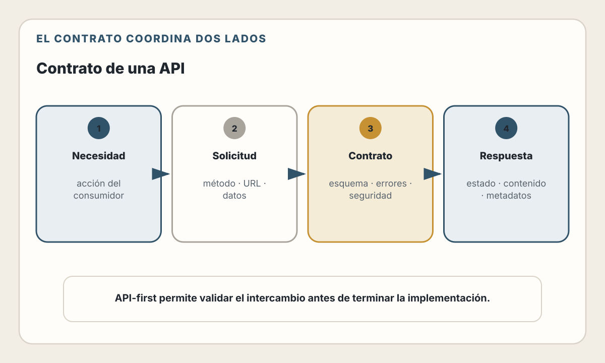
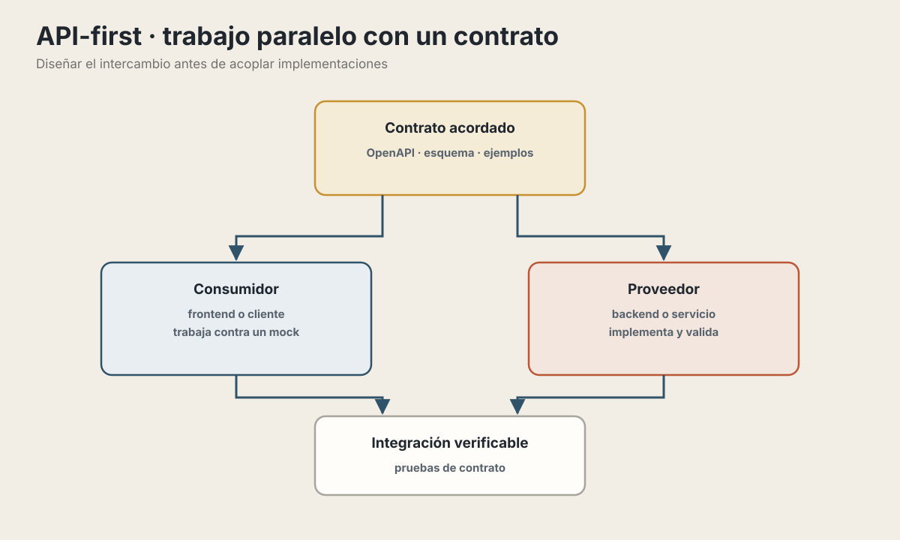
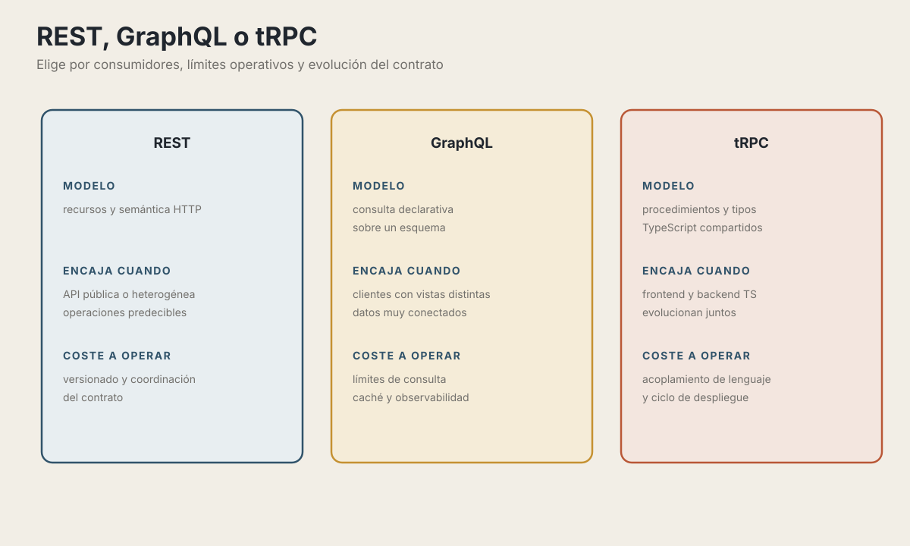

# 12. Diseño de APIs

> Una API es un contrato. Y como todo contrato, es mejor pensarlo bien antes de firmarlo.

## Objetivos de Aprendizaje

Al finalizar este capítulo, serás capaz de:
- Entender qué es una API y por qué su diseño importa
- Aplicar el enfoque API-First en tus proyectos
- Diseñar APIs REST siguiendo principios y convenciones
- Conocer cuándo GraphQL es mejor opción que REST
- Entender tRPC y el type-safety de extremo a extremo
- Versionar APIs sin romper clientes existentes
- Documentar APIs de forma que sean fáciles de usar

## Ruta de lectura y alcance

El recorrido principal es: contrato → semántica HTTP → evolución →
documentación. REST, GraphQL y tRPC son alternativas con restricciones
distintas, no niveles de madurez. Si necesitas elegir una, lee primero sus
criterios de adopción y después el ejemplo correspondiente.

Este capítulo diseña el contrato visible para los consumidores. El capítulo 16
explica cómo implementarlo en el backend; el 17 aplica identidad y permisos; y
el 18 compara transportes de actualización continua.

---

## ¿Qué es una API?

API significa **Application Programming Interface** (Interfaz de Programación de Aplicaciones). Es la forma en que dos piezas de software se comunican entre sí.

### La metáfora del restaurante

Imagina un restaurante:

La metáfora funciona por responsabilidades:

1. El cliente expresa una intención usando opciones conocidas, como una persona que elige del menú.
2. El mesero recibe el pedido en una forma acordada y lo lleva a la cocina; ese papel representa la API.
3. La cocina ejecuta el trabajo sin exponer al cliente todos sus procesos internos.
4. El resultado vuelve mediante el mismo contrato, incluido un error comprensible si el pedido no puede completarse.

El mesero es la API:
- **No necesitas saber cómo funciona la cocina** — Solo pides lo que quieres
- **Hay un menú con opciones definidas** — No puedes pedir cualquier cosa
- **El mesero traduce tu pedido** — La cocina recibe instrucciones en su formato
- **Recibes el resultado en un formato consistente** — Siempre en un plato, no en una olla

### APIs en el mundo del software

En una aplicación web, el frontend actúa como consumidor y el backend como
proveedor. HTTP transporta los mensajes; JSON puede representar los datos; y
la API define el contrato que evita que ambos lados dependan de detalles
internos del otro.

La API define:
- **Qué operaciones puedes hacer** — "Obtener usuarios", "Crear pedido", "Eliminar producto"
- **Qué datos necesitas enviar** — "Para crear un usuario, envía email y nombre"
- **Qué datos recibirás** — "Te devolveré el usuario con su ID generado"
- **Qué errores pueden ocurrir** — "Si el email ya existe, recibirás error 409"

📖 **Concepto**: Una API es un **contrato** entre quien provee un servicio y quien lo consume. Define las reglas del juego: qué puedes pedir, cómo pedirlo, y qué esperar a cambio.

---

## API-First: diseñar antes de codificar

### El problema del desarrollo tradicional

En el desarrollo tradicional, el flujo suele ser:

```
1. Backend desarrolla la funcionalidad
2. Backend expone un endpoint "como le queda"
3. Frontend intenta consumirlo
4. Frontend: "Esto no es lo que necesitaba"
5. Backend modifica
6. Frontend: "Mejor, pero falta X"
7. Repiten 5 veces
8. Nadie está contento
```

Esto genera:
- **Tiempo perdido** en ida y vuelta
- **APIs inconsistentes** donde cada endpoint tiene su propio estilo
- **Frustración** de ambos equipos
- **Documentación inexistente** o desactualizada

### El enfoque API-First

API-First invierte el proceso:

<picture>
  <source media="(max-width: 820px)" srcset="../assets/diagrams/cap12-contrato-api-mobile.svg">
  
</picture>

Primero se diseña y revisa el contrato. Después, frontend y backend pueden
desarrollar en paralelo contra ejemplos y pruebas compartidas, e integrar sin
descubrir al final las reglas del intercambio.

### ¿Cómo se ve un contrato de API?

El estándar más común es **OpenAPI** (antes llamado Swagger):

> **Estado del ecosistema — verificado el 30 de julio de 2026.** La versión publicada
> más reciente de la especificación es OpenAPI 3.2.0. El siguiente ejemplo usa
> OpenAPI 3.1 porque su soporte está más extendido y porque muestra todo lo
> necesario para este contrato. La versión de la especificación no es la
> versión de tu API.

```yaml
# api-spec.yaml
openapi: 3.1.0
info:
  title: API de Usuarios
  version: 1.0.0

paths:
  /users:
    get:
      summary: Listar todos los usuarios
      responses:
        '200':
          description: Lista de usuarios
          content:
            application/json:
              schema:
                type: array
                items:
                  $ref: '#/components/schemas/User'

    post:
      summary: Crear un nuevo usuario
      requestBody:
        required: true
        content:
          application/json:
            schema:
              type: object
              required:
                - email
                - name
              properties:
                email:
                  type: string
                  format: email
                name:
                  type: string
                  minLength: 2
      responses:
        '201':
          description: Usuario creado
          content:
            application/json:
              schema:
                $ref: '#/components/schemas/User'
        '409':
          description: El email ya existe

  /users/{id}:
    get:
      summary: Obtener un usuario por ID
      parameters:
        - name: id
          in: path
          required: true
          schema:
            type: integer
      responses:
        '200':
          description: Usuario encontrado
          content:
            application/json:
              schema:
                $ref: '#/components/schemas/User'
        '404':
          description: Usuario no encontrado

components:
  schemas:
    User:
      type: object
      properties:
        id:
          type: integer
        email:
          type: string
        name:
          type: string
        createdAt:
          type: string
          format: date-time
```

Este archivo define:
- Los endpoints disponibles (`/users`, `/users/{id}`)
- Los métodos HTTP permitidos (GET, POST)
- Los parámetros requeridos y opcionales
- El formato de los datos de entrada y salida
- Los posibles códigos de respuesta

### Beneficios de API-First

**1. Frontend y Backend pueden trabajar en paralelo**

<picture>
  <source media="(max-width: 820px)" srcset="../assets/diagrams/cap12-api-first-paralelo-mobile.svg">
  
</picture>

**2. Puedes generar código automáticamente**

Desde un archivo OpenAPI puedes generar:
- Clientes HTTP (JavaScript, Python, Go, etc.)
- Stubs del servidor
- Documentación interactiva
- Tests de contrato

**3. El contrato puede alimentar la documentación**

El contrato describe la interfaz legible por máquinas y puede generar una
referencia. No sustituye ejemplos, conceptos del dominio ni guías de uso. La
documentación solo permanece alineada si el pipeline valida que implementación,
contrato y artefactos publicados corresponden.

**4. Puedes validar requests y responses**

Herramientas pueden verificar automáticamente que el servidor cumple con el contrato.

### Herramientas para API-First

> **Estado del ecosistema — verificado el 30 de julio de 2026.** Los productos cambian;
> conserva el contrato en control de versiones y evita depender de un formato
> propietario.

- **Editor y linter**: escritura, validación y reglas organizacionales
- **Mock server**: ejemplos consumibles antes de implementar
- **Generador**: clientes o stubs revisables
- **Contract testing**: comparación entre contrato y comportamiento observado
- **Insomnia**: Similar a Postman, más ligero

💡 **Insight**: Diseñar la API primero parece más trabajo inicial, pero ahorra muchísimo tiempo en integración y evita retrabajos. Con herramientas de IA actuales, generar un contrato OpenAPI desde una descripción en lenguaje natural toma minutos.

---

## REST: Representational State Transfer

REST es el estilo de API más común en la web. Fue definido por Roy Fielding en su tesis doctoral del año 2000.

### La metáfora de los recursos

Imagina una biblioteca:

| Recurso | Colección | Elemento específico |
|---|---|---|
| Libros | `/libros` | `/libros/123` |
| Autores | `/autores` | `/autores/456` |

Los métodos expresan la intención sobre esas direcciones: `GET` consulta,
`POST` envía una acción o crea dentro de una colección, `PUT` reemplaza una
representación completa, `PATCH` aplica un cambio parcial y `DELETE` solicita
eliminar el recurso.

### Los verbos HTTP explicados

**GET: Obtener información**

```http
GET /users
→ Dame todos los usuarios

GET /users/123
→ Dame el usuario con ID 123

GET /users?status=active
→ Dame los usuarios que están activos
```

GET es **seguro** e **idempotente**:
- **Seguro**: No modifica nada en el servidor
- **Idempotente**: Llamarlo 1 o 100 veces da el mismo resultado

**POST: Crear algo nuevo**

```http
POST /users
Content-Type: application/json

{
  "email": "nuevo@ejemplo.com",
  "name": "Usuario Nuevo"
}

→ Crea un nuevo usuario con estos datos
→ Responde con el usuario creado (incluyendo su ID generado)
```

POST NO es idempotente: cada llamada crea un nuevo recurso.

**PUT: Reemplazar completamente**

```http
PUT /users/123
Content-Type: application/json

{
  "email": "actualizado@ejemplo.com",
  "name": "Nombre Actualizado"
}

→ Reemplaza TODOS los datos del usuario 123
→ Si no envías un campo, se borra o se pone en null
```

PUT es idempotente: llamarlo 10 veces con los mismos datos deja el recurso igual.

**PATCH: Modificar parcialmente**

```http
PATCH /users/123
Content-Type: application/json

{
  "name": "Solo cambio el nombre"
}

→ Solo actualiza los campos enviados
→ Los demás campos quedan igual
```

**DELETE: Eliminar**

```http
DELETE /users/123

→ Elimina el usuario 123
```

DELETE es idempotente: eliminarlo una vez o intentar eliminarlo 10 veces, el resultado es el mismo (no existe).

### Diseñando URLs REST

**Usa sustantivos, no verbos**

```http
❌ Incorrecto:
GET /getUsers
GET /fetchAllUsers
POST /createUser
POST /deleteUser/123

✅ Correcto:
GET /users
GET /users
POST /users
DELETE /users/123
```

El verbo ya está en el método HTTP (GET, POST, DELETE). La URL describe el recurso.

**Usa plural para colecciones**

```http
❌ Inconsistente:
GET /user      → ¿Uno o todos?
GET /user/123

✅ Consistente:
GET /users      → Todos los usuarios
GET /users/123  → Un usuario específico
```

**Anida recursos relacionados (con moderación)**

```http
# Obtener los pedidos del usuario 123
GET /users/123/orders

# Obtener el pedido 456 del usuario 123
GET /users/123/orders/456

# Pero no anides demasiado:
❌ /users/123/orders/456/products/789/reviews/101
   → Demasiado profundo, difícil de mantener

✅ /orders/456/products
   → Más simple, si el contexto es claro
```

**Usa query params para filtrar, ordenar, paginar**

```http
# Filtrar
GET /products?category=electronics&inStock=true

# Ordenar
GET /products?sort=price&order=desc

# Paginar
GET /products?page=2&limit=20

# Combinar
GET /products?category=electronics&sort=price&page=1&limit=10
```

### Códigos de respuesta HTTP

Los códigos de estado comunican qué pasó:

| Código | Significado útil para el consumidor |
|---:|---|
| `200 OK` | La operación tuvo éxito y hay una representación en la respuesta |
| `201 Created` | Se creó un recurso; conviene identificar su ubicación |
| `204 No Content` | La operación tuvo éxito sin cuerpo de respuesta |
| `301 Moved Permanently` | El recurso tiene una ubicación permanente distinta |
| `304 Not Modified` | La representación cacheada del cliente todavía es válida |
| `400 Bad Request` | La petición no puede interpretarse o incumple el contrato básico |
| `401 Unauthorized` | Faltan credenciales válidas; el nombre histórico no significa “sin permisos” |
| `403 Forbidden` | La identidad puede estar autenticada, pero la acción no está autorizada |
| `404 Not Found` | El recurso no existe o no debe revelarse al consumidor |
| `409 Conflict` | El estado actual impide completar la operación |
| `422 Unprocessable Content` | La sintaxis se entiende, pero el contenido no satisface las reglas aplicables |
| `429 Too Many Requests` | El consumidor superó un límite y debe respetar la política de reintento |
| `500 Internal Server Error` | Ocurrió un fallo no expuesto en detalle al consumidor |
| `502 Bad Gateway` | Un intermediario recibió una respuesta inválida de otra dependencia |
| `503 Service Unavailable` | El servicio no puede atender temporalmente la petición |

### Estructura de respuestas

**Respuesta exitosa simple:**

```json
// GET /users/123
{
  "id": 123,
  "email": "usuario@ejemplo.com",
  "name": "Juan Pérez",
  "createdAt": "2025-01-15T10:30:00Z"
}
```

**Respuesta con colección:**

```json
// GET /users?page=1&limit=10
{
  "data": [
    { "id": 1, "name": "Usuario 1", ... },
    { "id": 2, "name": "Usuario 2", ... }
  ],
  "pagination": {
    "page": 1,
    "limit": 10,
    "total": 156,
    "totalPages": 16
  }
}
```

**Respuesta de error:**

```json
// POST /users con email duplicado
// Status: 409 Conflict
{
  "error": {
    "code": "EMAIL_ALREADY_EXISTS",
    "message": "Ya existe un usuario con este email",
    "field": "email"
  }
}
```

### Ejemplo completo: API de productos

```yaml
# Recursos y operaciones

GET    /products           # Listar productos (con filtros, paginación)
POST   /products           # Crear producto
GET    /products/:id       # Obtener un producto
PUT    /products/:id       # Actualizar producto completo
PATCH  /products/:id       # Actualizar campos específicos
DELETE /products/:id       # Eliminar producto

GET    /products/:id/reviews      # Reviews de un producto
POST   /products/:id/reviews      # Crear review para un producto

GET    /categories                 # Listar categorías
GET    /categories/:id/products   # Productos de una categoría
```

```javascript
// Implementación con Express

const express = require('express');
const router = express.Router();

// GET /products
router.get('/products', async (req, res) => {
  const { category, minPrice, maxPrice, sort, page = 1, limit = 20 } = req.query;

  const products = await productService.find({
    filters: { category, minPrice, maxPrice },
    sort,
    pagination: { page: Number(page), limit: Number(limit) }
  });

  res.json({
    data: products.items,
    pagination: {
      page: products.page,
      limit: products.limit,
      total: products.total,
      totalPages: products.totalPages
    }
  });
});

// GET /products/:id
router.get('/products/:id', async (req, res) => {
  const product = await productService.findById(req.params.id);

  if (!product) {
    return res.status(404).json({
      error: {
        code: 'PRODUCT_NOT_FOUND',
        message: `No existe el producto con ID ${req.params.id}`
      }
    });
  }

  res.json(product);
});

// POST /products
router.post('/products', async (req, res) => {
  const { name, price, category, description } = req.body;

  // Validación
  if (!name || !price) {
    return res.status(400).json({
      error: {
        code: 'VALIDATION_ERROR',
        message: 'name y price son requeridos',
        fields: {
          name: !name ? 'Requerido' : null,
          price: !price ? 'Requerido' : null
        }
      }
    });
  }

  const product = await productService.create({ name, price, category, description });

  res.status(201).json(product);
});

// PATCH /products/:id
router.patch('/products/:id', async (req, res) => {
  const product = await productService.findById(req.params.id);

  if (!product) {
    return res.status(404).json({
      error: {
        code: 'PRODUCT_NOT_FOUND',
        message: `No existe el producto con ID ${req.params.id}`
      }
    });
  }

  const updated = await productService.update(req.params.id, req.body);

  res.json(updated);
});

// DELETE /products/:id
router.delete('/products/:id', async (req, res) => {
  const product = await productService.findById(req.params.id);

  if (!product) {
    return res.status(404).json({
      error: {
        code: 'PRODUCT_NOT_FOUND',
        message: `No existe el producto con ID ${req.params.id}`
      }
    });
  }

  await productService.delete(req.params.id);

  res.status(204).send();  // No Content
});
```

📖 **Concepto**: REST organiza tu API alrededor de **recursos** (sustantivos) y **acciones** (verbos HTTP). Esto crea APIs predecibles: si conoces el patrón, sabes cómo interactuar con cualquier recurso.

---

## GraphQL: cuando REST no es suficiente

GraphQL fue desarrollado por Facebook en 2012 y liberado en 2015. Es una alternativa a REST que resuelve algunos problemas específicos.

### El problema que GraphQL resuelve

Imagina una aplicación de redes sociales. Quieres mostrar un perfil de usuario con:
- Datos del usuario
- Sus últimos 5 posts
- Sus 10 amigos más recientes
- El número de likes en cada post

**Con REST, necesitas múltiples llamadas:**

```javascript
// 1. Obtener el usuario
const user = await fetch('/users/123');

// 2. Obtener sus posts
const posts = await fetch('/users/123/posts?limit=5');

// 3. Obtener sus amigos
const friends = await fetch('/users/123/friends?limit=10');

// 4. Para cada post, obtener los likes
const postsWithLikes = await Promise.all(
  posts.map(async post => {
    const likes = await fetch(`/posts/${post.id}/likes/count`);
    return { ...post, likesCount: likes.count };
  })
);

// Total: 1 + 1 + 1 + 5 = 8 llamadas HTTP
```

Problemas:
- **Múltiples round-trips** al servidor
- **Over-fetching**: cada endpoint trae más datos de los que necesitas
- **Under-fetching**: tienes que hacer llamadas adicionales para datos relacionados

**Con GraphQL, una sola llamada:**

```graphql
query {
  user(id: 123) {
    id
    name
    email
    avatarUrl
    posts(limit: 5) {
      id
      title
      content
      likesCount
    }
    friends(limit: 10) {
      id
      name
      avatarUrl
    }
  }
}
```

Respuesta:

```json
{
  "data": {
    "user": {
      "id": 123,
      "name": "Juan Pérez",
      "email": "juan@ejemplo.com",
      "avatarUrl": "https://...",
      "posts": [
        { "id": 1, "title": "Mi primer post", "content": "...", "likesCount": 42 },
        { "id": 2, "title": "Segundo post", "content": "...", "likesCount": 17 }
      ],
      "friends": [
        { "id": 456, "name": "María", "avatarUrl": "https://..." },
        { "id": 789, "name": "Carlos", "avatarUrl": "https://..." }
      ]
    }
  }
}
```

**Una llamada, exactamente los datos que necesitas.**

### Conceptos básicos de GraphQL

**Schema: el contrato**

GraphQL usa un sistema de tipos fuertemente tipado:

```graphql
# Definición de tipos
type User {
  id: ID!
  email: String!
  name: String!
  avatarUrl: String
  posts(limit: Int): [Post!]!
  friends(limit: Int): [User!]!
  createdAt: DateTime!
}

type Post {
  id: ID!
  title: String!
  content: String!
  author: User!
  likesCount: Int!
  comments: [Comment!]!
  createdAt: DateTime!
}

type Comment {
  id: ID!
  text: String!
  author: User!
  createdAt: DateTime!
}

# Operaciones de lectura
type Query {
  user(id: ID!): User
  users(limit: Int, offset: Int): [User!]!
  post(id: ID!): Post
  posts(authorId: ID, limit: Int): [Post!]!
}

# Operaciones de escritura
type Mutation {
  createUser(input: CreateUserInput!): User!
  updateUser(id: ID!, input: UpdateUserInput!): User!
  deleteUser(id: ID!): Boolean!

  createPost(input: CreatePostInput!): Post!
  likePost(postId: ID!): Post!
}

# Tipos de entrada
input CreateUserInput {
  email: String!
  name: String!
  password: String!
}

input UpdateUserInput {
  name: String
  avatarUrl: String
}

input CreatePostInput {
  title: String!
  content: String!
}
```

El `!` significa "no puede ser null".

**Queries: leer datos**

```graphql
# Obtener un usuario específico
query GetUser {
  user(id: "123") {
    name
    email
  }
}

# Obtener lista con paginación
query GetUsers {
  users(limit: 10, offset: 0) {
    id
    name
    email
  }
}

# Queries con variables (más seguro y reutilizable)
query GetUser($userId: ID!) {
  user(id: $userId) {
    name
    email
    posts(limit: 5) {
      title
    }
  }
}
# Variables: { "userId": "123" }
```

**Mutations: modificar datos**

```graphql
mutation CreateUser {
  createUser(input: {
    email: "nuevo@ejemplo.com",
    name: "Usuario Nuevo",
    password: "secreto123"
  }) {
    id
    email
    name
  }
}

mutation LikePost($postId: ID!) {
  likePost(postId: $postId) {
    id
    likesCount
  }
}
```

### Implementación básica

**Servidor (Node.js con Apollo Server 5):**

```typescript
import { ApolloServer } from '@apollo/server';
import { startStandaloneServer } from '@apollo/server/standalone';

// Schema
const typeDefs = `#graphql
  type User {
    id: ID!
    email: String!
    name: String!
    posts: [Post!]!
  }

  type Post {
    id: ID!
    title: String!
    content: String!
    author: User!
  }

  type Query {
    user(id: ID!): User
    users: [User!]!
  }

  type Mutation {
    createUser(email: String!, name: String!): User!
  }
`;

// Resolvers: cómo obtener los datos
const resolvers = {
  Query: {
    user: async (_, { id }) => {
      return userRepository.findById(id);
    },
    users: async () => {
      return userRepository.findAll();
    }
  },

  Mutation: {
    createUser: async (_, { email, name }) => {
      return userRepository.create({ email, name });
    }
  },

  // Resolver para campos anidados
  User: {
    posts: async (user) => {
      // user es el objeto User padre
      return postRepository.findByAuthorId(user.id);
    }
  },

  Post: {
    author: async (post) => {
      return userRepository.findById(post.authorId);
    }
  }
};

const server = new ApolloServer({ typeDefs, resolvers });

const { url } = await startStandaloneServer(server, {
  listen: { port: 4000 },
  context: async ({ req }) => ({
    // El contexto autentica la petición; los resolvers todavía deben aplicar
    // autorización sobre cada operación y recurso.
    user: await authenticateRequest(req.headers.authorization),
    userRepository,
    postRepository
  })
});

console.log(`Servidor GraphQL en ${url}`);
```

> **Estado del ecosistema — verificado el 30 de julio de 2026.** El paquete histórico
> `apollo-server` corresponde a generaciones sin soporte. Apollo Server 5 usa
> `@apollo/server`, requiere Node.js 20 o posterior y GraphQL.js 16.11 o
> posterior. Para integrarlo con Express 4 o 5 se instala además el paquete de
> integración correspondiente. `startStandaloneServer` es apropiado para este
> ejemplo mínimo; una aplicación real debe definir CORS, límites, autenticación,
> autorización y protección frente a consultas costosas.

Los resolvers de relaciones pueden producir el problema **N+1**: una consulta
puede ejecutar una lectura adicional por cada usuario o publicación. Agrupa las
cargas por petición con una herramienta como DataLoader o con consultas por
lotes, y limita profundidad, complejidad y tamaño de las operaciones.

**Cliente:**

```javascript
// Con fetch
const response = await fetch('/graphql', {
  method: 'POST',
  headers: { 'Content-Type': 'application/json' },
  body: JSON.stringify({
    query: `
      query GetUser($id: ID!) {
        user(id: $id) {
          name
          email
          posts {
            title
          }
        }
      }
    `,
    variables: { id: '123' }
  })
});

const { data } = await response.json();
console.log(data.user.name);

// Con Apollo Client (más elegante)
import { useQuery, gql } from '@apollo/client';

const GET_USER = gql`
  query GetUser($id: ID!) {
    user(id: $id) {
      name
      email
      posts {
        title
      }
    }
  }
`;

function UserProfile({ userId }) {
  const { loading, error, data } = useQuery(GET_USER, {
    variables: { id: userId }
  });

  if (loading) return <p>Cargando...</p>;
  if (error) return <p>Error: {error.message}</p>;

  return (
    <div>
      <h1>{data.user.name}</h1>
      <p>{data.user.email}</p>
      <h2>Posts:</h2>
      {data.user.posts.map(post => (
        <p key={post.id}>{post.title}</p>
      ))}
    </div>
  );
}
```

### ¿Cuándo usar GraphQL vs REST?

| Favorece REST cuando… | Favorece GraphQL cuando… |
|---|---|
| La semántica HTTP y su caché forman parte importante del contrato | Los clientes necesitan seleccionar formas distintas de datos relacionados |
| La API será consumida por terceros o múltiples lenguajes | Puedes operar límites de profundidad, costo y autorización por campo |
| Las operaciones encajan naturalmente como recursos y acciones acotadas | El equipo acepta la complejidad adicional de esquema, caché y observabilidad |

No decidas solo por evitar *over-fetching*. Evalúa seguridad, patrón de acceso,
errores, caché, observabilidad y experiencia de los consumidores.

### Ventajas y desventajas

**Ventajas de GraphQL:**
- El cliente pide exactamente lo que necesita
- Una sola llamada para datos complejos
- Tipado fuerte con introspección
- Excelente tooling (GraphQL Playground, Apollo DevTools)
- El frontend puede evolucionar sin cambios en el backend

**Desventajas de GraphQL:**
- Más complejo de implementar inicialmente
- Caché más difícil (todo va a un solo endpoint POST)
- Posibles problemas de performance con queries muy profundas
- Curva de aprendizaje para el equipo
- No aprovecha bien el caché HTTP estándar

📖 **Concepto**: GraphQL te da **flexibilidad** a costa de **complejidad**. Es poderoso cuando tienes clientes con necesidades diversas, pero puede ser overkill para APIs simples.

---

## tRPC: Type-safety de extremo a extremo

tRPC es un enfoque más reciente que elimina la necesidad de definir contratos separados cuando usas TypeScript en frontend y backend.

### El problema que tRPC resuelve

Con un contrato separado, proveedor, esquema y consumidor pueden
desincronizarse si el proceso no valida los tres artefactos.

Si cambias el backend y olvidas actualizar el contrato o el frontend, tienes errores en runtime.

### La solución tRPC

tRPC usa TypeScript para compartir tipos **directamente** entre backend y
frontend. El backend define procedimientos y exporta sus tipos; el frontend los
importa para obtener autocompletado y errores de compilación cuando una llamada
ya no coincide. La validación de tipos no sustituye la validación de datos en
runtime ni crea por sí sola un contrato apropiado para consumidores externos.

### Ejemplo básico

**Backend:**

```typescript
// server/trpc.ts
import { initTRPC } from '@trpc/server';
import { z } from 'zod';  // Para validación

const t = initTRPC.create();

const userRouter = t.router({
  // Query: obtener datos
  getById: t.procedure
    .input(z.object({ id: z.string() }))
    .query(async ({ input }) => {
      const user = await db.user.findUnique({ where: { id: input.id } });
      if (!user) throw new Error('User not found');
      return user;  // TypeScript sabe el tipo exacto
    }),

  // Query: listar
  list: t.procedure
    .input(z.object({
      limit: z.number().min(1).max(100).default(10),
      cursor: z.string().optional()
    }))
    .query(async ({ input }) => {
      const users = await db.user.findMany({
        take: input.limit,
        cursor: input.cursor ? { id: input.cursor } : undefined
      });
      return users;
    }),

  // Mutation: crear
  create: t.procedure
    .input(z.object({
      email: z.string().email(),
      name: z.string().min(2)
    }))
    .mutation(async ({ input }) => {
      const user = await db.user.create({ data: input });
      return user;
    }),

  // Mutation: actualizar
  update: t.procedure
    .input(z.object({
      id: z.string(),
      name: z.string().min(2).optional(),
      email: z.string().email().optional()
    }))
    .mutation(async ({ input }) => {
      const { id, ...data } = input;
      const user = await db.user.update({ where: { id }, data });
      return user;
    })
});

// Router principal
export const appRouter = t.router({
  user: userRouter,
  // ... otros routers
});

// Exporta el tipo del router (esto es lo que usa el frontend)
export type AppRouter = typeof appRouter;
```

**Frontend:**

```typescript
// client/trpc.ts
import { createTRPCReact } from '@trpc/react-query';
import type { AppRouter } from '../server/trpc';  // Solo importa el TIPO

export const trpc = createTRPCReact<AppRouter>();

// Componente React
function UserProfile({ userId }: { userId: string }) {
  // Autocompletado completo: trpc.user.getById
  // TypeScript sabe que input necesita { id: string }
  // TypeScript sabe qué campos tiene la respuesta
  const { data: user, isLoading } = trpc.user.getById.useQuery({ id: userId });

  if (isLoading) return <div>Cargando...</div>;

  // user tiene el tipo correcto automáticamente
  // Si el backend cambia, TypeScript marca error aquí
  return (
    <div>
      <h1>{user.name}</h1>           {/* ✅ TypeScript sabe que existe */}
      <p>{user.email}</p>            {/* ✅ TypeScript sabe que existe */}
      <p>{user.telefono}</p>         {/* ❌ Error: 'telefono' no existe */}
    </div>
  );
}

// Mutation
function CreateUserForm() {
  const createUser = trpc.user.create.useMutation();

  const handleSubmit = (data: { email: string; name: string }) => {
    createUser.mutate(data, {
      onSuccess: (newUser) => {
        // newUser tiene el tipo correcto
        console.log('Usuario creado:', newUser.id);
      }
    });
  };

  return (
    <form onSubmit={...}>
      {/* ... */}
    </form>
  );
}
```

### ¿Qué cambios detecta el compilador?

| Cambio del proveedor | Evidencia en el consumidor TypeScript |
|---|---|
| Agregar un campo requerido | Falta una propiedad en el input |
| Cambiar el tipo de un campo | El argumento deja de ser compatible |
| Renombrar un campo de respuesta | La propiedad anterior deja de existir |
| Eliminar un procedimiento | La llamada deja de compilar |

Esto detecta una clase importante de desincronización antes de ejecutar. No
elimina errores de autorización, validación, red, concurrencia ni semántica.

### ¿Cuándo usar tRPC?

Favorece tRPC cuando frontend y backend usan TypeScript, comparten el ciclo de
desarrollo y pueden consumir los mismos tipos. Evítalo como contrato principal
cuando publicas una API para terceros, soportas varios lenguajes o necesitas
evolución y despliegue independientes.

📖 **Concepto**: tRPC elimina la "capa de traducción" entre frontend y backend al compartir tipos directamente. El compilador de TypeScript se convierte en tu sistema de validación de contratos.

<picture>
  <source media="(max-width: 820px)" srcset="../assets/diagrams/cap12-eleccion-estilo-api-mobile.svg">
  
</picture>

---

## Versionado de APIs

Las APIs evolucionan. Los clientes que las usan no siempre pueden actualizarse inmediatamente. El versionado permite hacer cambios sin romper clientes existentes.

### ¿Qué cambios rompen una API?

**Cambios que NO rompen (backwards compatible):**

- Agregar un endpoint nuevo.
- Agregar un campo de respuesta que los consumidores toleren ignorar.
- Agregar un parámetro opcional con una semántica compatible.
- Agregar una variante de error contemplada por el contrato del consumidor.

**Cambios que SÍ rompen (breaking changes):**

- Eliminar o mover un endpoint.
- Eliminar un campo de respuesta utilizado por consumidores.
- Cambiar el tipo o el significado de un campo.
- Convertir un parámetro opcional en obligatorio.
- Introducir una nueva respuesta que un cliente legítimo no pueda interpretar.

### Estrategias de versionado

**1. Versión en la URL (más común)**

```
https://api.ejemplo.com/v1/users
https://api.ejemplo.com/v2/users
```

Ventajas:
- Muy explícito y visible
- Fácil de entender y usar
- Se puede cachear fácilmente

Desventajas:
- Puede duplicar código si no se maneja bien

**2. Versión en header**

```http
GET /users
Accept: application/vnd.myapi.v2+json
```

o

```http
GET /users
API-Version: 2
```

Ventajas:
- URLs limpias
- Más "RESTful" según algunos puristas

Desventajas:
- Menos visible
- Más difícil de probar en el navegador

**3. Versión en query parameter**

```
https://api.ejemplo.com/users?version=2
```

Ventajas:
- Fácil de implementar
- Fácil de probar

Desventajas:
- Puede interferir con caché
- Mezcla versionado con otros parámetros

### Implementación práctica

```javascript
// Estructura de carpetas por versión
src/
├── api/
│   ├── v1/
│   │   ├── routes/
│   │   │   └── users.js
│   │   └── controllers/
│   │       └── userController.js
│   └── v2/
│       ├── routes/
│       │   └── users.js
│       └── controllers/
│           └── userController.js
└── app.js

// app.js
const v1Router = require('./api/v1/routes');
const v2Router = require('./api/v2/routes');

app.use('/v1', v1Router);
app.use('/v2', v2Router);

// Opción: redirigir la versión "sin versión" a la última
app.use('/users', (req, res) => {
  res.redirect(307, '/v2/users' + req.url);
});
```

### Política de deprecación

No puedes mantener todas las versiones para siempre. Define una política clara:

```markdown
# Política de Versionado de API

## Versiones activas
- v2 (actual) - Sin fecha de retiro anunciada
- v1 (anterior) - Se deprecará el 2027-07-01 y se retirará el 2028-07-01

## Versiones deprecadas
- Ninguna

## Proceso de deprecación
1. Definir un plazo según contratos, riesgo y capacidad de migración
2. Enviar los headers estandarizados `Deprecation` y, si aplica, `Sunset`
3. Documentación actualizada con guía de migración
4. Medir el uso restante y contactar a consumidores conocidos
5. Retirar la versión en la fecha comunicada o publicar un cambio de plan
```

**Comunicar deprecación en las respuestas:**

```javascript
// Middleware para v1
app.use('/v1', (req, res, next) => {
  // RFC 9745 usa una fecha Structured Fields expresada como @epoch.
  res.set('Deprecation', '@1814400000'); // 2027-07-01T00:00:00Z
  // RFC 8594 usa una fecha HTTP y representa cuándo dejará de responder.
  res.set('Sunset', 'Sat, 01 Jul 2028 00:00:00 GMT');
  res.append(
    'Link',
    '<https://api.example.com/docs/migrations/v1-to-v2>; rel="deprecation"; type="text/html"'
  );
  res.append('Link', '</v2>; rel="successor-version"');
  next();
});
```

`Deprecation` informa sobre el ciclo de vida; no cambia por sí mismo el
comportamiento del recurso. `Sunset` es opcional y comunica una fecha de retiro,
que no puede ser anterior a la de deprecación.

---

## Documentación de APIs

La mejor API del mundo es inútil si nadie sabe cómo usarla.

### ¿Qué debe incluir la documentación?

- **Descripción general:** propósito, consumidores y primer recorrido exitoso.
- **Autenticación:** obtención y envío de credenciales, renovación y errores.
- **Referencia:** método, URL, parámetros, cabeceras, cuerpos, ejemplos y
  respuestas de error.
- **Guías:** casos de uso completos y decisiones que no se deducen del esquema.
- **Límites:** cuotas, `429`, política de reintento e idempotencia.
- **Evolución:** changelog, deprecaciones y guías de migración.

### OpenAPI/Swagger

El estándar más usado para documentar APIs REST:

```yaml
# api-docs.yaml
openapi: 3.1.0
info:
  title: API de E-commerce
  description: |
    API para gestionar productos, pedidos y usuarios de la tienda.

    ## Autenticación
    Todas las peticiones requieren un token JWT en el header:
    ```
    Authorization: Bearer <tu-token>
    ```

    ## Rate Limiting
    - 1000 peticiones por hora para usuarios autenticados
    - 100 peticiones por hora para usuarios anónimos
  version: 2.0.0
  contact:
    email: api@ejemplo.com

servers:
  - url: https://api.ejemplo.com/v2
    description: Producción
  - url: https://sandbox.api.ejemplo.com/v2
    description: Sandbox para pruebas

paths:
  /products:
    get:
      summary: Listar productos
      description: |
        Obtiene una lista paginada de productos.
        Soporta filtros por categoría, precio y disponibilidad.
      tags:
        - Productos
      parameters:
        - name: category
          in: query
          description: Filtrar por categoría
          schema:
            type: string
          example: electronics
        - name: minPrice
          in: query
          description: Precio mínimo
          schema:
            type: number
          example: 10.00
        - name: maxPrice
          in: query
          description: Precio máximo
          schema:
            type: number
          example: 100.00
        - name: page
          in: query
          description: Número de página (empieza en 1)
          schema:
            type: integer
            default: 1
        - name: limit
          in: query
          description: Productos por página (máximo 100)
          schema:
            type: integer
            default: 20
            maximum: 100
      responses:
        '200':
          description: Lista de productos
          content:
            application/json:
              schema:
                type: object
                properties:
                  data:
                    type: array
                    items:
                      $ref: '#/components/schemas/Product'
                  pagination:
                    $ref: '#/components/schemas/Pagination'
              example:
                data:
                  - id: "prod_123"
                    name: "Laptop Pro"
                    price: 999.99
                    category: "electronics"
                    inStock: true
                  - id: "prod_124"
                    name: "Mouse Inalámbrico"
                    price: 29.99
                    category: "electronics"
                    inStock: true
                pagination:
                  page: 1
                  limit: 20
                  total: 156
                  totalPages: 8
        '400':
          $ref: '#/components/responses/BadRequest'
        '401':
          $ref: '#/components/responses/Unauthorized'

components:
  schemas:
    Product:
      type: object
      required:
        - id
        - name
        - price
      properties:
        id:
          type: string
          description: Identificador único del producto
          example: "prod_123"
        name:
          type: string
          description: Nombre del producto
          example: "Laptop Pro"
        price:
          type: number
          format: float
          description: Precio en USD
          example: 999.99
        category:
          type: string
          description: Categoría del producto
          example: "electronics"
        inStock:
          type: boolean
          description: Si hay stock disponible
          example: true
        description:
          type: string
          description: Descripción detallada
          example: "Laptop de alto rendimiento..."

    Pagination:
      type: object
      properties:
        page:
          type: integer
          example: 1
        limit:
          type: integer
          example: 20
        total:
          type: integer
          example: 156
        totalPages:
          type: integer
          example: 8

  responses:
    BadRequest:
      description: Petición inválida
      content:
        application/json:
          schema:
            type: object
            properties:
              error:
                type: object
                properties:
                  code:
                    type: string
                    example: "VALIDATION_ERROR"
                  message:
                    type: string
                    example: "El parámetro 'minPrice' debe ser un número"

    Unauthorized:
      description: No autorizado
      content:
        application/json:
          schema:
            type: object
            properties:
              error:
                type: object
                properties:
                  code:
                    type: string
                    example: "UNAUTHORIZED"
                  message:
                    type: string
                    example: "Token inválido o expirado"

  securitySchemes:
    bearerAuth:
      type: http
      scheme: bearer
      bearerFormat: JWT

security:
  - bearerAuth: []
```

Este archivo puede ser renderizado con herramientas como:
- **Swagger UI**: Documentación interactiva donde puedes hacer peticiones
- **Redoc**: Documentación más limpia y legible
- **Stoplight**: Plataforma completa de documentación

### Buenas prácticas de documentación

**1. Incluye ejemplos reales**

```yaml
# ❌ Sin ejemplo
parameters:
  - name: id
    in: path
    schema:
      type: string

# ✅ Con ejemplo
parameters:
  - name: id
    in: path
    description: ID del producto (formato UUID)
    schema:
      type: string
      format: uuid
    example: "550e8400-e29b-41d4-a716-446655440000"
```

**2. Documenta los errores**

```yaml
responses:
  '400':
    description: Error de validación
    content:
      application/json:
        examples:
          missing_field:
            summary: Campo faltante
            value:
              error:
                code: "VALIDATION_ERROR"
                message: "El campo 'email' es requerido"
                field: "email"
          invalid_format:
            summary: Formato inválido
            value:
              error:
                code: "VALIDATION_ERROR"
                message: "El email no tiene formato válido"
                field: "email"
```

**3. Agrupa por casos de uso**

```markdown
# Guías de Uso

## Crear un pedido completo

Para crear un pedido, necesitas seguir estos pasos:

### 1. Verificar disponibilidad del producto

```bash
curl -X GET "https://api.ejemplo.com/v2/products/prod_123" \
  -H "Authorization: Bearer $TOKEN"
```

### 2. Crear el carrito

```bash
curl -X POST "https://api.ejemplo.com/v2/carts" \
  -H "Authorization: Bearer $TOKEN" \
  -H "Content-Type: application/json" \
  -d '{"items": [{"productId": "prod_123", "quantity": 2}]}'
```

### 3. Procesar el pago

```bash
curl -X POST "https://api.ejemplo.com/v2/orders" \
  -H "Authorization: Bearer $TOKEN" \
  -H "Content-Type: application/json" \
  -d '{"cartId": "cart_456", "paymentMethod": "card_789"}'
```
```

**4. Mantén un changelog**

```markdown
# Changelog

## v2.3.0 (2025-01-15)

### Nuevas funcionalidades
- Agregado endpoint `GET /products/{id}/reviews`
- Agregado campo `rating` a las respuestas de productos

### Cambios
- El límite máximo de paginación aumentó de 50 a 100

### Deprecaciones
- El campo `stock` será removido en v3. Usar `inStock` en su lugar.

## v2.2.0 (2024-12-01)

### Correcciones
- Corregido error donde `minPrice=0` era ignorado
```

📖 **Concepto**: La documentación es parte de tu producto. Una API bien documentada se adopta más fácilmente, genera menos tickets de soporte, y hace felices a los desarrolladores que la usan.

---

## 🤖 Usando IA para Diseño de APIs

La IA ha transformado el diseño de APIs, permitiendo ir de requisitos en lenguaje natural a especificaciones OpenAPI funcionales.

### Generación de especificaciones desde requisitos

```
Prompt efectivo:
"Diseña una API REST para una aplicación de delivery de comida.
Necesito endpoints para:
- Restaurantes (listar, buscar por ubicación, ver menú)
- Pedidos (crear, ver estado, cancelar)
- Usuarios (perfil, historial de pedidos)

Genera la especificación OpenAPI 3.0 completa con:
- Schemas de datos
- Ejemplos de request/response
- Códigos de error apropiados
- Autenticación con Bearer token"
```

La IA genera un borrador completo que puedes refinar, ahorrando horas de trabajo inicial.

### Casos de uso principales

**1. De código existente a documentación**

```
Prompt:
"Analiza estos endpoints de Express y genera la documentación
OpenAPI correspondiente:

app.get('/users/:id', getUserById);
app.post('/users', createUser);
app.put('/users/:id', updateUser);

Infiere los schemas de los nombres de funciones y parámetros."
```

**2. Revisión de diseño de API**

```
Prompt:
"Revisa esta especificación OpenAPI y sugiere mejoras:
- ¿Sigue principios REST correctamente?
- ¿Los nombres de recursos son consistentes?
- ¿Faltan códigos de error importantes?
- ¿La paginación está bien diseñada?"
```

**3. Generación de mocks y ejemplos**

```
Prompt:
"Para este endpoint POST /orders, genera 5 ejemplos
realistas de request body y sus correspondientes responses,
incluyendo casos de éxito y errores comunes."
```

**4. Migración entre versiones**

```
Prompt:
"Tengo esta API v1. Necesito crear v2 donde 'name' se separa
en 'firstName' y 'lastName'. Genera:
1. El nuevo schema v2
2. Estrategia de backwards compatibility
3. Guía de migración para clientes"
```

### Herramientas potenciadas por IA

| Herramienta | Función |
|-------------|---------|
| **Stoplight** | Diseño visual de APIs con sugerencias inteligentes |
| **Apidog** | Generación automática de documentación desde specs |
| **Claude/ChatGPT** | Diseño desde cero, revisión, generación de ejemplos |
| **Postman AI** | Tests y mocks generados automáticamente |

### Limitaciones a considerar

| ❌ Cuidado con... | ✅ Usa IA para... |
|-------------------|-------------------|
| Asumir que la IA conoce tu dominio | Generar borradores que luego refinas |
| Generar schemas sin validar | Crear ejemplos y casos de prueba |
| Confiar en convenciones inventadas | Revisar consistencia y mejores prácticas |
| Documentación genérica | Acelerar la escritura inicial |

### Flujo recomendado

1. Describe consumidores, recorridos, invariantes y errores en lenguaje natural.
2. Usa IA para generar un borrador inicial de la especificación.
3. Revisa semántica, seguridad y evolución con conocimiento del dominio.
4. Genera mocks, ejemplos, documentación y pruebas de contrato.
5. Itera con evidencia de los consumidores de la API.

> 🤖 **Nota**: La IA es excelente para generar la **estructura inicial** y mantener **consistencia** en APIs grandes. Pero el diseño de una buena API requiere entender cómo la usarán los desarrolladores, y eso sigue necesitando empatía humana.

---

## Resumen

### API-First
- Diseña el contrato antes de codificar
- Usa OpenAPI/Swagger como especificación
- Permite trabajo paralelo entre frontend y backend
- La documentación nace del contrato

### REST
- Organiza la API alrededor de recursos (sustantivos)
- Usa verbos HTTP para acciones (GET, POST, PUT, PATCH, DELETE)
- URLs predecibles: `/recursos`, `/recursos/{id}`
- Códigos HTTP para comunicar resultado (200, 201, 400, 404, 500)

### GraphQL
- Una sola llamada para datos complejos
- El cliente pide exactamente lo que necesita
- Tipado fuerte con schema
- Ideal para frontends complejos con múltiples vistas

### tRPC
- Type-safety de extremo a extremo con TypeScript
- Sin capa de traducción entre frontend y backend
- Errores de sincronización en tiempo de compilación
- Ideal para equipos full-stack en TypeScript

### Versionado
- Cambios backwards-compatible no necesitan nueva versión
- Versión en URL es lo más común (`/v1/`, `/v2/`)
- Define política de deprecación clara
- Comunica cambios con anticipación

### Documentación
- Incluye: descripción, auth, endpoints, ejemplos, errores, changelog
- Usa ejemplos reales y completos
- Documenta casos de uso, no solo endpoints
- La documentación es parte del producto

---

## Ejercicios

1. **Diseño API-First**: Diseña una API para un sistema de reservas de restaurante. Define los endpoints, métodos, y estructura de datos usando OpenAPI antes de pensar en la implementación.

2. **Análisis de API REST**: Encuentra una API pública (GitHub, Spotify, Twitter) y analiza cómo implementa los principios REST. ¿Qué hace bien? ¿Qué podría mejorar?

3. **GraphQL vs REST**: Para una aplicación de red social (perfiles, posts, amigos, likes), diseña cómo obtendrías los datos de un perfil completo tanto con REST como con GraphQL. Compara el número de llamadas y los datos transferidos.

4. **Versionado**: Tienes una API v1 con un endpoint `GET /users` que retorna `{ name, email }`. Necesitas agregar un campo `fullName` que reemplace a `name`. Diseña la estrategia de migración a v2 sin romper clientes existentes.

---

## Referencias

- Fielding, R. T. (2000). *Architectural Styles and the Design of Network-based Software Architectures*. — La tesis doctoral donde se define REST
- OpenAPI Initiative. *OpenAPI Specification*. https://spec.openapis.org/oas/latest.html
- GraphQL Foundation. *GraphQL Specification*. https://graphql.org/learn/
- Apollo GraphQL. *Apollo Server documentation*. https://www.apollographql.com/docs/apollo-server
- IETF. *RFC 9745: The Deprecation HTTP Response Header Field*. https://www.rfc-editor.org/rfc/rfc9745.html
- IETF. *RFC 8594: The Sunset HTTP Header Field*. https://www.rfc-editor.org/rfc/rfc8594.html
- tRPC. *tRPC Documentation*. https://trpc.io/docs
- Masse, M. (2011). *REST API Design Rulebook*. O'Reilly. — Guía práctica de diseño REST

---

**Anterior**: [Arquitectura de Software](./11-arquitectura-software.md) | **Siguiente**: [Modelado de Datos](./13-modelado-datos.md)
