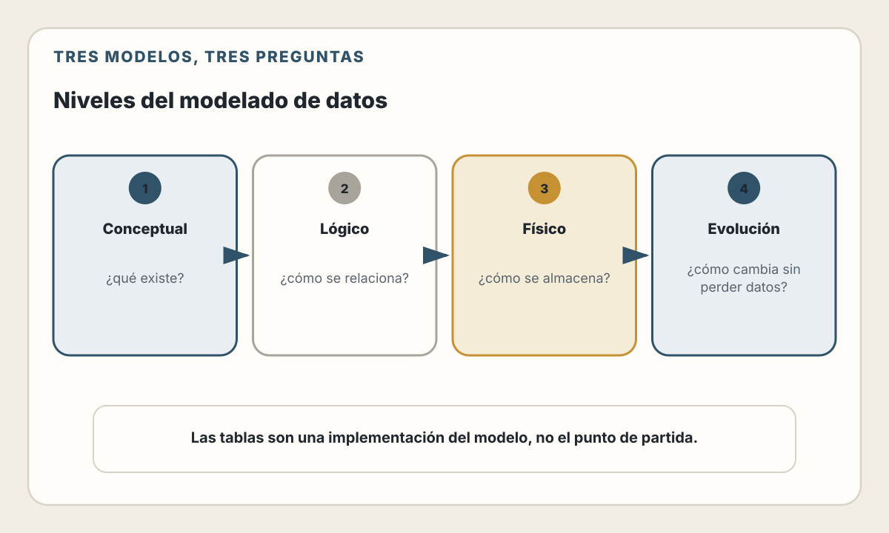
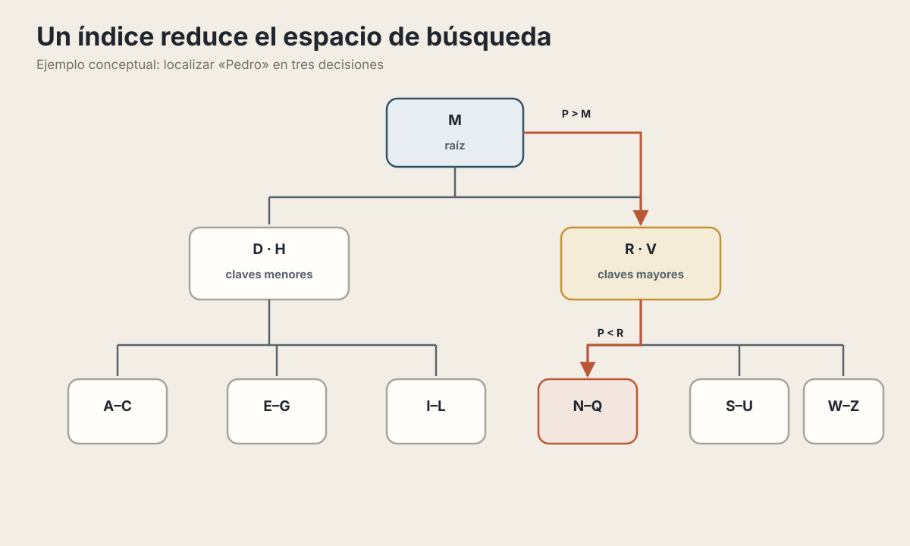
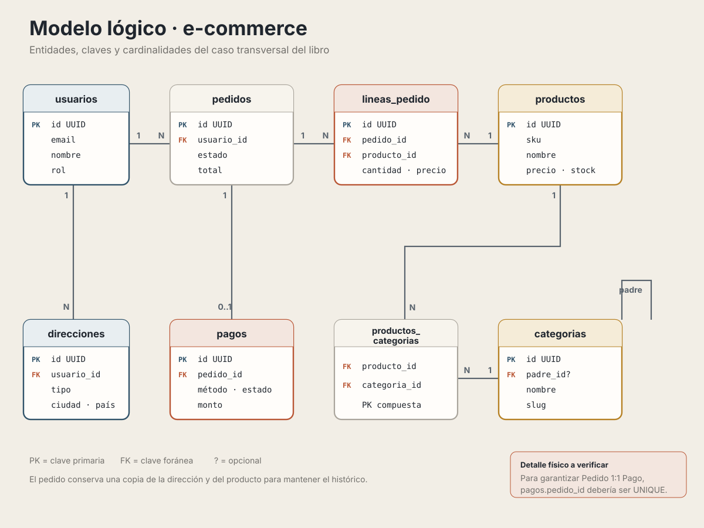

# 13. Modelado de Datos

> "Dame seis horas para cortar un árbol y pasaré las primeras cuatro afilando el hacha." — Abraham Lincoln

## Objetivos de Aprendizaje

Al finalizar este capítulo, serás capaz de:
- Diseñar modelos de datos que reflejen correctamente el dominio del negocio
- Elegir entre bases de datos relacionales y NoSQL según el caso de uso
- Aplicar técnicas de normalización y saber cuándo desnormalizar
- Diseñar esquemas que soporten la evolución del producto
- Evitar errores comunes que causan problemas de rendimiento

## Ruta de lectura y alcance

Este capítulo tiene tres capas:

1. **Modelo**: entidades, relaciones, normalización e invariantes.
2. **Elección física**: familias de bases de datos, índices y patrones de
   esquema.
3. **Evolución**: migraciones compatibles y un caso integrado.

Aquí se decide qué significan los datos y qué restricciones deben preservarse.
El capítulo 19 aborda cómo leerlos y modificarlos mediante repositorios,
transacciones, niveles de aislamiento y caché. Evita resolver en el modelo una
preocupación que pertenece al acceso, y viceversa.

---

## ¿Por qué el modelado de datos importa tanto?

Imagina que estás construyendo una casa. Puedes cambiar el color de las paredes fácilmente. Puedes cambiar los muebles sin problema. Pero cambiar los cimientos... eso es otra historia.

El modelo de datos es el cimiento de tu aplicación.

La interfaz suele cambiar con relativa facilidad. Las reglas del negocio y las
APIs requieren más coordinación. El modelo de datos es especialmente costoso
de modificar cuando ya existen integraciones, consultas y datos reales que
deben migrarse sin pérdida.

Un mal modelo de datos te perseguirá durante toda la vida del proyecto:

- **Queries lentas** que ningún índice puede salvar
- **Datos inconsistentes** que generan bugs misteriosos
- **Código complejo** para compensar un modelo pobre
- **Migraciones dolorosas** cada vez que el negocio evoluciona

📖 **Concepto**: El modelado de datos es el proceso de definir cómo se estructura, almacena y relaciona la información en tu sistema. Es traducir el mundo real a estructuras que una computadora puede manejar eficientemente.

---

## Los tres niveles de modelado

Antes de escribir una sola línea de SQL, necesitas pensar en tres niveles:

<picture>
  <source media="(max-width: 820px)" srcset="../assets/diagrams/cap13-niveles-modelado-mobile.svg">
  
</picture>

### 1. Modelo Conceptual — ¿Qué existe?

Este es el nivel más abstracto. Solo identificas:
- Las **entidades** (cosas que existen en tu dominio)
- Las **relaciones** entre ellas
- Los **atributos** principales

No piensas en tablas, columnas ni tipos de datos. Solo en conceptos.

En un comercio, por ejemplo, un **usuario realiza pedidos** y cada pedido
**contiene productos**. Esta descripción todavía no decide tablas, claves ni
tipos: solo nombra conceptos y relaciones del dominio.

### 2. Modelo Lógico — ¿Cómo se relaciona?

Aquí defines con más detalle:
- Los **atributos** de cada entidad
- Los **tipos de relación** (1:1, 1:N, N:M)
- Las **claves primarias** y **foráneas**
- Las **restricciones** de negocio

| Entidad | Atributos y restricciones principales |
|---|---|
| Usuario | `id` como clave primaria; `email` único; nombre y fecha de creación |
| Pedido | `id`; `usuario_id` como clave foránea; fecha, estado y total |
| Producto | `id`; nombre, precio y stock |
| Línea de pedido | `pedido_id` y `producto_id` como claves foráneas; cantidad y precio unitario |

La línea de pedido resuelve la relación muchos-a-muchos entre pedidos y
productos y conserva el precio aplicado en el momento de la compra.

### 3. Modelo Físico — ¿Cómo se almacena?

Este es el nivel de implementación:
- **Tipos de datos** específicos (VARCHAR(255), DECIMAL(10,2))
- **Índices** para optimizar consultas
- **Particionamiento** para escala
- **Decisiones específicas** del motor de base de datos

```sql
CREATE TABLE usuarios (
    id UUID PRIMARY KEY DEFAULT gen_random_uuid(),
    email VARCHAR(255) NOT NULL UNIQUE,
    nombre VARCHAR(100) NOT NULL,
    password_hash VARCHAR(255) NOT NULL,
    created_at TIMESTAMP WITH TIME ZONE DEFAULT NOW(),
    updated_at TIMESTAMP WITH TIME ZONE DEFAULT NOW()
);

CREATE INDEX idx_usuarios_email ON usuarios(email);
CREATE INDEX idx_usuarios_created_at ON usuarios(created_at);
```

💡 **Insight**: Muchos desarrolladores saltan directamente al modelo físico. Esto es como empezar a construir sin planos. Tómate el tiempo de pensar en los tres niveles.

---

## Entidades y Relaciones: El corazón del modelado

### Identificando Entidades

Una **entidad** es algo sobre lo que necesitas almacenar información. Pregúntate:

- ¿Es algo que existe independientemente?
- ¿Necesito rastrear su ciclo de vida?
- ¿Tiene atributos propios?

**Son entidades:**
- Usuario, Producto, Pedido, Factura, Categoría

**Probablemente NO son entidades (son atributos):**
- Nombre, Precio, Fecha, Estado

**Zona gris (depende del contexto):**
- Dirección: ¿Es un atributo del usuario o una entidad separada?
- Teléfono: ¿El usuario tiene uno o muchos?

### Tipos de Relaciones

#### Uno a Uno (1:1)

Poco común. Generalmente indica que podrías fusionar las tablas.

Ejemplo: cada `Usuario` tiene como máximo un `PerfilExtendido`, y cada perfil
pertenece a un solo usuario.

**Úsalo cuando:**
- Quieres separar datos sensibles (usuario vs datos_bancarios)
- Tienes datos opcionales que la mayoría no tiene
- Por razones de rendimiento (separar columnas pesadas)

```sql
-- Separar datos que raramente se consultan juntos
CREATE TABLE usuarios (
    id UUID PRIMARY KEY,
    email VARCHAR(255) NOT NULL,
    nombre VARCHAR(100) NOT NULL
);

CREATE TABLE perfiles_extendidos (
    usuario_id UUID PRIMARY KEY REFERENCES usuarios(id),
    bio TEXT,
    avatar_url VARCHAR(500),
    configuracion JSONB
);
```

#### Uno a Muchos (1:N)

La relación más común.

Ejemplo: un `Usuario` puede realizar muchos `Pedidos`; cada pedido pertenece a
un usuario.

```sql
CREATE TABLE pedidos (
    id UUID PRIMARY KEY,
    usuario_id UUID NOT NULL REFERENCES usuarios(id),
    -- el usuario_id crea la relación 1:N
    fecha TIMESTAMP NOT NULL,
    total DECIMAL(10,2) NOT NULL
);
```

#### Muchos a Muchos (N:M)

Requiere una tabla intermedia (tabla de unión o pivot).

Ejemplo: un `Pedido` contiene muchos `Productos` y un producto puede aparecer
en muchos pedidos. `LineaPedido` convierte esa relación N:M en dos relaciones
1:N y conserva atributos como cantidad y precio de compra.

```sql
-- Tabla intermedia con datos adicionales
CREATE TABLE lineas_pedido (
    id UUID PRIMARY KEY,
    pedido_id UUID NOT NULL REFERENCES pedidos(id),
    producto_id UUID NOT NULL REFERENCES productos(id),
    cantidad INTEGER NOT NULL CHECK (cantidad > 0),
    precio_unitario DECIMAL(10,2) NOT NULL,

    -- Evitar duplicados
    UNIQUE(pedido_id, producto_id)
);
```

💡 **Insight**: Las tablas intermedias frecuentemente tienen datos propios (cantidad, precio al momento de la compra, fecha). No son solo "pegamento" entre tablas.

---

## Normalización: Organizando los datos

La **normalización** es el proceso de organizar datos para reducir redundancia y mejorar integridad.

### La metáfora de la biblioteca

Imagina una biblioteca desorganizada donde cada libro tiene pegado en la portada: el nombre del autor, su biografía, su foto, su dirección, y la lista de todos sus otros libros.

**Problemas:**
- Si el autor cambia de dirección, hay que actualizar TODOS sus libros
- La misma información se repite miles de veces
- Inconsistencias cuando alguien olvida actualizar un libro

**Solución normalizada:**
- Una ficha para cada autor (con su info)
- Cada libro solo tiene el ID del autor
- Para ver la info del autor, consultas su ficha

### Las Formas Normales (simplificadas)

#### Primera Forma Normal (1NF): Sin grupos repetitivos

❌ **Mal:**

| pedido_id | productos                    |
|-----------|------------------------------|
| 1         | "Laptop, Mouse, Teclado"     |
| 2         | "Monitor"                    |

✅ **Bien:**

| pedido_id | producto  |
|-----------|-----------|
| 1         | Laptop    |
| 1         | Mouse     |
| 1         | Teclado   |
| 2         | Monitor   |

#### Segunda Forma Normal (2NF): Sin dependencias parciales

Cada columna no-clave debe depender de TODA la clave primaria.

❌ **Mal:**

| pedido_id | producto_id | cantidad | nombre_producto | precio_producto |
|-----------|-------------|----------|-----------------|-----------------|

(nombre_producto y precio_producto solo dependen de producto_id, no de la clave completa)

✅ **Bien:**

Tabla de líneas de pedido:

| pedido_id | producto_id | cantidad |
|---|---|---:|

Tabla de productos separada:

| producto_id | nombre_producto | precio_producto |
|---|---|---:|

#### Tercera Forma Normal (3NF): Sin dependencias transitivas

Cada columna no-clave debe depender DIRECTAMENTE de la clave primaria.

❌ **Mal:**

| pedido_id | cliente_id | nombre_cliente | email_cliente |
|---|---|---|---|

(nombre_cliente y email_cliente dependen de cliente_id, no de pedido_id)

✅ **Bien:**

Tabla de pedidos:

| pedido_id | cliente_id |
|---|---|

Tabla de clientes separada:

| cliente_id | nombre_cliente | email_cliente |
|---|---|---|

### Cuándo Desnormalizar

La normalización perfecta no siempre es práctica. Desnormalizar significa agregar redundancia intencionalmente para mejorar el rendimiento.

**Desnormaliza cuando:**

1. **Lecturas frecuentes de datos relacionados**
```sql
-- En lugar de JOIN cada vez que muestras un pedido
-- Guarda el nombre del producto en la línea de pedido
CREATE TABLE lineas_pedido (
    id UUID PRIMARY KEY,
    producto_id UUID REFERENCES productos(id),
    producto_nombre VARCHAR(200),  -- Desnormalizado
    cantidad INTEGER,
    precio_unitario DECIMAL(10,2)
);
```

2. **Datos históricos que no deben cambiar**
```sql
-- El precio del producto puede cambiar, pero el precio
-- al momento de la compra debe preservarse
CREATE TABLE lineas_pedido (
    precio_unitario DECIMAL(10,2),  -- Precio al momento de compra
    -- NO usar: precio = productos.precio (cambiaría!)
);
```

3. **Contadores y agregados frecuentes**
```sql
-- En lugar de COUNT(*) cada vez
CREATE TABLE posts (
    id UUID PRIMARY KEY,
    titulo VARCHAR(200),
    likes_count INTEGER DEFAULT 0,      -- Desnormalizado
    comments_count INTEGER DEFAULT 0    -- Desnormalizado
);
```

⚠️ **Advertencia**: Cada desnormalización es deuda técnica. Debes mantener la consistencia manualmente (triggers, código de aplicación). Solo desnormaliza cuando tengas evidencia de que es necesario.

---

## Bases de Datos Relacionales vs NoSQL

### Cuándo usar SQL (Relacional)

Las bases de datos relacionales (PostgreSQL, MySQL) brillan cuando:

✅ **Datos estructurados con relaciones claras**

Por ejemplo, usuarios relacionados con pedidos y pedidos relacionados con sus
líneas y productos.

✅ **Necesitas transacciones ACID**
- Atomicidad: Todo o nada
- Consistencia: Las restricciones que la base conoce se preservan
- Aislamiento: Las anomalías visibles dependen del nivel elegido
- Durabilidad: Cambios persistentes

ACID no conoce por sí solo todas las reglas del negocio. Una transacción puede
ser perfectamente ACID y aun así guardar un pedido con un descuento inválido si
esa regla no está expresada mediante constraints, lógica transaccional o ambos.

✅ **Queries complejas y ad-hoc**
```sql
-- Este tipo de consulta es natural en SQL
SELECT
    c.nombre,
    COUNT(p.id) as total_pedidos,
    SUM(p.total) as valor_total
FROM clientes c
JOIN pedidos p ON c.id = p.cliente_id
WHERE p.fecha > '2024-01-01'
GROUP BY c.id
HAVING SUM(p.total) > 1000
ORDER BY valor_total DESC;
```

✅ **Integridad referencial es crítica**
```sql
-- La BD garantiza que no puedes crear un pedido
-- para un usuario que no existe
ALTER TABLE pedidos
ADD CONSTRAINT fk_usuario
FOREIGN KEY (usuario_id) REFERENCES usuarios(id);
```

### Cuándo usar NoSQL

**NoSQL** agrupa familias de bases de datos con modelos distintos: documentos,
clave-valor, columnas anchas, grafos y otras. No comparten una única semántica
de transacciones, consistencia o consultas. Por eso no conviene decidir entre
“SQL” y “NoSQL” como si fueran dos productos equivalentes: primero identifica
el patrón de acceso, las invariantes, la escala y la operación que necesitas.

#### Document Stores (MongoDB, Firestore)

**El problema que pueden resolver:**

Algunos dominios manejan agregados jerárquicos cuyos atributos varían mucho.
Un catálogo, por ejemplo, puede representar laptops y camisetas. Una tabla
relacional única con una columna para cada atributo posible sería una mala
solución:

```sql
-- SQL: Una tabla con TODOS los atributos posibles
CREATE TABLE productos (
    id INT,
    nombre VARCHAR(200),
    -- Atributos de laptop
    procesador VARCHAR(100),      -- NULL para camisetas
    ram VARCHAR(50),              -- NULL para camisetas
    gpu VARCHAR(100),             -- NULL para camisetas
    -- Atributos de ropa
    talla VARCHAR(10),            -- NULL para laptops
    color VARCHAR(50),            -- NULL para laptops
    material VARCHAR(100)         -- NULL para laptops
    -- Y si agregas muebles, libros, comida...
    -- La tabla se vuelve inmanejable
);
```

Un document store permite guardar cada agregado con una estructura distinta:

Cada documento es independiente — puede tener los campos que necesite:

```javascript
// Documento de laptop
{
  "_id": "prod_123",
  "nombre": "Laptop Gaming",
  "categoria": "electrónica",
  "precio": 1500,
  "especificaciones": {
    "procesador": "Intel i9",
    "ram": "32GB",
    "gpu": "RTX 4080",
    "pantalla": "15.6 pulgadas"
  }
}

// Documento de camiseta - estructura completamente diferente
{
  "_id": "prod_456",
  "nombre": "Camiseta Rock",
  "categoria": "ropa",
  "precio": 25,
  "especificaciones": {
    "talla": "M",
    "color": "negro",
    "material": "algodón 100%"
  },
  "tallas_disponibles": ["S", "M", "L", "XL"]
}
```

**¿Por qué no usar tablas por subtipo o JSONB en PostgreSQL?**

También son alternativas válidas. PostgreSQL no obliga a crear la tabla ancha
anterior: puedes usar tablas relacionadas, JSONB o una combinación. Un
document store merece evaluación cuando el documento coincide con la unidad
que lees y escribes, el esquema flexible es una necesidad real y sus garantías
de consulta, transacción y consistencia encajan con el producto. El sharding no
es automático ni gratuito en sentido operativo: exige elegir claves,
distribuir carga y manejar límites entre particiones.

**Ideal para:**
- Catálogos de productos con atributos variables
- CMS donde cada página tiene diferente estructura
- Configuraciones de usuario personalizadas
- Prototipos donde el esquema cambia constantemente

---

#### Key-Value (Redis, DynamoDB)

**El problema que resuelven:**

Imagina que cada vez que alguien visita tu web, verificas su sesión:

```sql
-- Esto se ejecuta en CADA request
SELECT * FROM sesiones WHERE token = 'abc123';
```

Una tabla relacional bien indexada también puede resolver esta consulta. Un
almacén clave-valor resulta atractivo cuando el acceso es casi exclusivamente
por clave, el vencimiento forma parte del modelo y la latencia o el volumen
justifican operar otro sistema.

**La solución Key-Value:**

Conceptualmente se parece a un diccionario distribuido:

| Clave | Valor conceptual |
|---|---|
| `session:abc123` | Usuario, rol y vencimiento de una sesión |
| `user:42:cart` | Identificadores de productos del carrito |
| `rate:ip:192.168.1.1` | Contador dentro de una ventana temporal |

```bash
# Ejemplo con Redis; la latencia real debe medirse en tu entorno
SET session:abc123 '{"user_id": 42}'
GET session:abc123
DEL session:abc123

# Expiración automática
SETEX session:abc123 3600 '{"user_id": 42}'  # Expira en 1 hora
```

En Redis, gran parte del conjunto activo se mantiene en memoria y las
operaciones están diseñadas alrededor de estructuras conocidas. Otras bases
clave-valor, como DynamoDB, tienen una arquitectura diferente. “Clave-valor”
describe el modelo de acceso, no garantiza un medio de almacenamiento ni una
latencia concreta.

**Ideal para:**
- Sesiones de usuario
- Caché de datos costosos de calcular
- Rate limiting (¿cuántos requests ha hecho esta IP?)
- Colas de trabajos simples
- Contadores en tiempo real

---

#### Wide-Column (Cassandra, ScyllaDB)

**El problema que resuelven:**

Tienes 10 000 sensores IoT enviando datos cada segundo. Eso produce 864
millones de registros al día. Una base relacional puede manejar grandes
volúmenes con particionamiento y una arquitectura adecuada, pero este patrón
obliga a evaluar distribución, retención, costo de escritura y consultas antes
de elegir.

```sql
-- Esta carga requiere diseño, medición y una política de retención
INSERT INTO lecturas (sensor_id, timestamp, temperatura, humedad)
VALUES ('sensor_1', NOW(), 23.5, 65);
-- × 864,000,000 veces al día
```

**La solución Wide-Column:**

Diseñadas desde cero para escrituras masivas distribuidas:

Una clave de partición como `sensor_1` agrupa columnas o filas ordenadas por
tiempo. Las lecturas de temperatura y humedad se diseñan alrededor de las
consultas que el sistema debe responder, por ejemplo “últimas lecturas de un
sensor durante una ventana”.

**Características habituales:**
- El esquema se diseña alrededor de consultas conocidas
- Los datos se distribuyen mediante una clave de partición
- La replicación y el nivel de consistencia son decisiones explícitas
- La tolerancia a fallos depende de la topología y de su operación

**El trade-off:**

No puedes hacer queries flexibles como en SQL:

```sql
-- Esto es FÁCIL en SQL
SELECT * FROM lecturas WHERE temperatura > 25;

-- En Cassandra, necesitas diseñar tu esquema
-- alrededor de las queries que harás
```

**Ideal para:**
- Logs de aplicación (billones de entradas)
- Datos de sensores IoT
- Series temporales (métricas, analytics)
- Cualquier cosa que sea "append-only" a gran escala

---

#### Graph (Neo4j, Amazon Neptune)

**El problema que resuelven:**

En una red social, quieres mostrar "Personas que quizás conozcas" — amigos de tus amigos que no conoces.

```sql
-- SQL: Amigos de mis amigos (2 niveles)
SELECT DISTINCT u3.nombre
FROM usuarios u1
JOIN amistades a1 ON u1.id = a1.usuario_id
JOIN amistades a2 ON a1.amigo_id = a2.usuario_id
JOIN usuarios u3 ON a2.amigo_id = u3.id
WHERE u1.id = 1
  AND u3.id != 1
  AND u3.id NOT IN (SELECT amigo_id FROM amistades WHERE usuario_id = 1);

-- Esto ya es complicado. ¿Y si quieres 3 niveles? ¿O 6?
```

La diferencia de rendimiento no puede expresarse con una tabla universal de
milisegundos. Depende del volumen, los índices, la forma del grafo, la
selectividad y el motor. Una base de grafos ofrece un lenguaje y estructuras
orientadas a recorrer relaciones; una base relacional puede ser excelente para
relaciones conocidas y consultas bien indexadas. Compara ambas con recorridos
representativos de tu dominio.

**La solución Graph:**

Los datos se almacenan como nodos y relaciones:

En un ejemplo mínimo, María sigue a Carlos y Ana; Carlos sigue a Pedro y Pedro
sigue a Ana. El valor del modelo no está en dibujar cuatro personas, sino en
poder recorrer relaciones como “a quién siguen las personas que María sigue”.

```text
// Query en Cypher (lenguaje de Neo4j)
// "¿A quién siguen los amigos de María que ella no sigue?"
MATCH (maria:Usuario {nombre: "María"})-[:SIGUE]->(amigo)-[:SIGUE]->(sugerencia)
WHERE NOT (maria)-[:SIGUE]->(sugerencia)
  AND sugerencia <> maria
RETURN DISTINCT sugerencia.nombre
```

**Casos de uso reales:**

1. **LinkedIn**: "Personas que quizás conozcas"
2. **Netflix**: "Usuarios que vieron X también vieron Y"
3. **Detección de fraude**: "Esta cuenta transfirió dinero a 3 cuentas que están conectadas a cuentas bloqueadas"
4. **Google Maps**: Ruta más corta entre dos puntos

**Cuándo NO usarlo:**

- Si tus datos son tabulares sin relaciones complejas → SQL
- Si las relaciones son simples (1:N, N:M básico) → SQL
- Si la mayoría de queries no involucran navegación de relaciones → SQL

---

#### Search Engines (Elasticsearch, Meilisearch)

**El problema que resuelven:**

El usuario busca "lapto gamer" (con typo). En SQL:

```sql
-- Esto NO encuentra nada
SELECT * FROM productos WHERE nombre LIKE '%lapto gamer%';

-- LIKE es limitado:
-- ❌ No maneja typos
-- ❌ No entiende sinónimos (laptop = notebook = portátil)
-- ❌ No ordena por relevancia
-- ❌ Es lento en tablas grandes
```

**La solución Search Engine:**

Elasticsearch indexa el texto de forma inteligente:

| Término normalizado | Documentos que lo contienen |
|---|---|
| `laptop` | `doc_1`, `doc_5`, `doc_12` |
| `gaming` | `doc_1`, `doc_3`, `doc_7` |
| `asus` | `doc_1`, `doc_8` |
| `rog` | `doc_1` |
| `portátil`, `notebook` | `doc_1` mediante sinónimos configurados |

```javascript
// Búsqueda que funciona
GET /productos/_search
{
  "query": {
    "multi_match": {
      "query": "lapto gamer",           // Con typo
      "fields": ["nombre^2", "descripcion"],  // nombre pesa más
      "fuzziness": "AUTO"               // Tolera errores
    }
  }
}

// Resultado: encuentra "Laptop Gaming ASUS ROG" con score 8.5
```

**Capacidades que SQL no tiene:**

- **Fuzzy matching**: "lapto" encuentra "laptop"
- **Sinónimos**: "portátil" encuentra "laptop"
- **Relevancia**: Ordena resultados por qué tan bien coinciden
- **Autocompletado**: Mientras escribes "lap..." sugiere "laptop gaming"
- **Facetas**: "10 productos en Electrónica, 5 en Gaming"
- **Highlighting**: Resalta dónde encontró el término

**Ideal para:**
- Búsqueda de productos en e-commerce
- Búsqueda de artículos en un blog/CMS
- Logs y analytics (ELK stack)
- Autocompletado en formularios

### La realidad: Polyglot Persistence

Algunos sistemas usan varias bases de datos porque tienen patrones de acceso
realmente distintos:

| Necesidad | Almacén que podría encajar | Responsabilidad operativa añadida |
|---|---|---|
| Usuarios, pedidos y transacciones | Base relacional | Migraciones, copias y recuperación |
| Sesiones, caché o límites temporales | Clave-valor | Vencimiento, presión de memoria y persistencia |
| Búsqueda por relevancia | Motor de búsqueda | Indexación, sincronización y reindexado |

💡 **Insight**: Empieza con el menor número de sistemas que satisfaga tus
requisitos. Agrega otro almacén solo cuando la evidencia compense el costo de
operarlo, respaldarlo, observarlo y mantener datos coherentes entre fronteras.

---

## Patrones Comunes de Modelado

### 1. Soft Delete (Borrado Lógico)

En lugar de eliminar registros, los marcas como eliminados.

```sql
CREATE TABLE usuarios (
    id UUID PRIMARY KEY,
    email VARCHAR(255) NOT NULL,
    deleted_at TIMESTAMP WITH TIME ZONE NULL  -- NULL = activo
);

-- "Eliminar" un usuario
UPDATE usuarios SET deleted_at = NOW() WHERE id = '...';

-- Consultar solo usuarios activos
SELECT * FROM usuarios WHERE deleted_at IS NULL;
```

**Ventajas:**
- Recuperar datos "eliminados"
- Mantener integridad referencial
- Auditoría

**Desventajas:**
- Todas las queries necesitan `WHERE deleted_at IS NULL`
- La tabla crece indefinidamente
- Índices menos eficientes

### 2. Tabla de Auditoría / Event Sourcing

Guarda cada cambio como un evento.

```sql
CREATE TABLE eventos_usuario (
    id UUID PRIMARY KEY,
    usuario_id UUID NOT NULL,
    tipo VARCHAR(50) NOT NULL,  -- 'CREATED', 'UPDATED', 'EMAIL_CHANGED'
    datos JSONB NOT NULL,        -- El cambio específico
    created_at TIMESTAMP NOT NULL DEFAULT NOW(),
    created_by UUID              -- Quién hizo el cambio
);

-- Insertar evento cuando cambia algo
INSERT INTO eventos_usuario (usuario_id, tipo, datos, created_by)
VALUES (
    'user_123',
    'EMAIL_CHANGED',
    '{"old": "viejo@email.com", "new": "nuevo@email.com"}',
    'admin_456'
);
```

### 3. Patrón de Enumeración (Lookup Tables)

Para valores que podrían cambiar o necesitan metadata.

```sql
-- En lugar de: estado VARCHAR(20) CHECK (estado IN ('pendiente', 'activo'))

CREATE TABLE estados_pedido (
    id SERIAL PRIMARY KEY,
    codigo VARCHAR(20) UNIQUE NOT NULL,
    nombre VARCHAR(100) NOT NULL,
    descripcion TEXT,
    orden INTEGER,  -- Para ordenar en UI
    activo BOOLEAN DEFAULT true
);

INSERT INTO estados_pedido (codigo, nombre, orden) VALUES
('pendiente', 'Pendiente de pago', 1),
('pagado', 'Pagado', 2),
('enviado', 'En camino', 3),
('entregado', 'Entregado', 4),
('cancelado', 'Cancelado', 99);

CREATE TABLE pedidos (
    id UUID PRIMARY KEY,
    estado_id INTEGER REFERENCES estados_pedido(id)
);
```

### 4. Patrón EAV (Entity-Attribute-Value)

Para atributos dinámicos (úsalo con cautela).

```sql
CREATE TABLE producto_atributos (
    producto_id UUID REFERENCES productos(id),
    atributo VARCHAR(100),
    valor TEXT,
    PRIMARY KEY (producto_id, atributo)
);

-- Laptop
INSERT INTO producto_atributos VALUES
('prod_1', 'procesador', 'Intel i9'),
('prod_1', 'ram', '32GB'),
('prod_1', 'almacenamiento', '1TB SSD');

-- Camiseta
INSERT INTO producto_atributos VALUES
('prod_2', 'talla', 'M'),
('prod_2', 'color', 'Azul'),
('prod_2', 'material', 'Algodón');
```

⚠️ **Advertencia**: EAV hace queries complejas muy difíciles. Considera JSONB en PostgreSQL como alternativa moderna:

```sql
CREATE TABLE productos (
    id UUID PRIMARY KEY,
    nombre VARCHAR(200),
    atributos JSONB  -- Flexible pero queryable
);

-- Query con JSONB
SELECT * FROM productos
WHERE atributos->>'procesador' = 'Intel i9';
```

### 5. Herencia de Tablas

Cuando tienes entidades que comparten atributos pero tienen diferencias.

**Opción A: Single Table Inheritance**

Una tabla con todos los campos, discriminador de tipo.

```sql
CREATE TABLE vehiculos (
    id UUID PRIMARY KEY,
    tipo VARCHAR(20) NOT NULL,  -- 'auto', 'moto', 'camion'
    marca VARCHAR(100),
    modelo VARCHAR(100),
    -- Campos de auto
    num_puertas INTEGER,
    -- Campos de moto
    cilindrada INTEGER,
    -- Campos de camión
    capacidad_carga DECIMAL
);
```

**Pros:** Simple, queries fáciles
**Cons:** Muchos NULLs, no hay constraints por tipo

**Opción B: Table per Type**

Una tabla base y tablas específicas.

```sql
CREATE TABLE vehiculos (
    id UUID PRIMARY KEY,
    tipo VARCHAR(20) NOT NULL,
    marca VARCHAR(100),
    modelo VARCHAR(100)
);

CREATE TABLE autos (
    vehiculo_id UUID PRIMARY KEY REFERENCES vehiculos(id),
    num_puertas INTEGER NOT NULL
);

CREATE TABLE motos (
    vehiculo_id UUID PRIMARY KEY REFERENCES vehiculos(id),
    cilindrada INTEGER NOT NULL
);
```

**Pros:** Sin NULLs, constraints específicos
**Cons:** JOINs necesarios, más complejo

---

## Diseñando para el Cambio

Los requerimientos van a cambiar. Tu modelo debe poder evolucionar.

### Principios de Evolución

#### 1. Prefiere agregar sobre modificar

```sql
-- Bien: Agregar columna nueva
ALTER TABLE usuarios ADD COLUMN telefono VARCHAR(20);

-- Arriesgado: Cambiar tipo de columna existente
ALTER TABLE usuarios ALTER COLUMN email TYPE TEXT;
```

#### 2. Retira columnas mediante una migración compatible

```sql
-- Paso 1: Dejar de escribir en la columna (en código)
-- Paso 2: Desplegar lectores que ya no dependan de ella
-- Paso 3: Verificar que nada la usa
-- Paso 4: Eliminarla en una migración posterior
ALTER TABLE usuarios DROP COLUMN campo_viejo;
```

La separación entre pasos depende de la estrategia de despliegue. Antes de
eliminar, considera procesos atrasados, réplicas, exportaciones y posibilidad de
reversión.

#### 3. Usa migraciones versionadas

```
migrations/
├── 001_create_usuarios.sql
├── 002_add_telefono_to_usuarios.sql
├── 003_create_pedidos.sql
└── 004_add_index_pedidos_fecha.sql
```

```sql
-- 002_add_telefono_to_usuarios.sql
-- UP
ALTER TABLE usuarios ADD COLUMN telefono VARCHAR(20);

-- DOWN
ALTER TABLE usuarios DROP COLUMN telefono;
```

#### 4. Planifica para datos opcionales

```sql
-- Bien: Permite NULL para datos nuevos/opcionales
ALTER TABLE usuarios ADD COLUMN bio TEXT;

-- Problema: NOT NULL requiere valor default o migración de datos
ALTER TABLE usuarios ADD COLUMN pais VARCHAR(2) NOT NULL DEFAULT 'XX';
```

### Ejemplo: Evolución de un modelo

**Versión 1: MVP**
```sql
CREATE TABLE usuarios (
    id SERIAL PRIMARY KEY,
    email VARCHAR(255) UNIQUE NOT NULL,
    nombre VARCHAR(100) NOT NULL
);
```

**Versión 2: Agregamos autenticación**
```sql
ALTER TABLE usuarios ADD COLUMN password_hash VARCHAR(255);
ALTER TABLE usuarios ADD COLUMN ultimo_login TIMESTAMP;
```

**Versión 3: Múltiples direcciones**
```sql
-- Antes: direccion era columna en usuarios
-- Ahora: tabla separada para N direcciones
CREATE TABLE direcciones (
    id UUID PRIMARY KEY,
    usuario_id INTEGER REFERENCES usuarios(id),
    tipo VARCHAR(20),  -- 'envio', 'facturacion'
    calle TEXT,
    ciudad VARCHAR(100),
    codigo_postal VARCHAR(20),
    es_principal BOOLEAN DEFAULT false
);
```

**Versión 4: Internacionalización**
```sql
-- Agregar soporte para múltiples idiomas
ALTER TABLE usuarios ADD COLUMN idioma VARCHAR(5) DEFAULT 'es';
ALTER TABLE usuarios ADD COLUMN zona_horaria VARCHAR(50) DEFAULT 'America/Mexico_City';
```

---

## Índices: El arte del rendimiento

### ¿Qué es un índice? (No es un caché)

Un **caché** guarda resultados de consultas previas. Si preguntas "dame los usuarios de México" y lo guardas en caché, la próxima vez devuelves ese resultado sin consultar la base de datos.

Un **índice** es completamente diferente. Es una **estructura de datos adicional** que la base de datos mantiene para encontrar filas más rápido. No guarda resultados — guarda una forma eficiente de buscar.

**La metáfora del libro:**

Imagina un libro de 1000 páginas sobre programación. Quieres encontrar dónde habla de "recursión".

**Sin índice (Sequential Scan):**
```
Página 1: ¿Habla de recursión? No.
Página 2: ¿Habla de recursión? No.
Página 3: ¿Habla de recursión? No.
...
Página 847: ¿Habla de recursión? ¡Sí!
```
Tuviste que revisar 847 páginas. En una base de datos, esto es un **Seq Scan** — leer toda la tabla fila por fila.

**Con índice:**
```
Índice del libro:
...
Recursión ........... páginas 127, 342, 847
Refactoring ......... páginas 89, 156
...
```
Vas directo al índice (ordenado alfabéticamente), encuentras "Recursión" en segundos, y saltas a las páginas exactas.

### Cómo funciona internamente: B-Tree

La mayoría de índices usan una estructura llamada **B-Tree** (árbol balanceado). Visualízalo así:

<picture>
  <source media="(max-width: 820px)" srcset="../assets/diagrams/cap13-indice-btree-mobile.svg">
  
</picture>

Una búsqueda sin un índice útil puede revisar muchas filas. Un B-Tree reduce el
espacio de búsqueda por niveles y suele ofrecer crecimiento logarítmico, aunque
el número real de páginas leídas depende del tamaño de los nodos, la
selectividad, la caché y el plan elegido por la base de datos.

### El costo de los índices

Los índices no son gratis:

**1. Espacio en disco**
```sql
-- La tabla ocupa 100MB
-- Cada índice puede agregar 10-30MB adicionales
-- 5 índices = potencialmente 150MB extra
```

**2. Escrituras más lentas**
```sql
INSERT INTO usuarios (email, nombre) VALUES ('nuevo@email.com', 'Juan');

-- Sin índices: 1 escritura (a la tabla)
-- Con 3 índices: 4 escrituras (tabla + 3 índices que actualizar)
```

Cada INSERT, UPDATE, DELETE debe actualizar todos los índices afectados.

**3. Mantenimiento**
Los índices pueden fragmentarse con el tiempo y necesitan `REINDEX` ocasional.

### La regla de trabajo

> Diseña índices para consultas concretas y confirma su efecto con el plan de
> ejecución y datos representativos.

Que una columna aparezca en `WHERE` no basta. Importan la selectividad, el orden
de un índice compuesto, el tamaño de la tabla, la frecuencia de escritura y las
consultas que el índice puede cubrir. Una restricción `UNIQUE`, además, suele
crear su propio índice; no debes duplicarlo sin comprobar el esquema.

### Cuándo crear índices

✅ **Columnas en WHERE frecuentemente**
```sql
-- Si siempre filtras por email
CREATE INDEX idx_usuarios_email ON usuarios(email);

SELECT * FROM usuarios WHERE email = 'x@y.com';  -- Rápido
```

✅ **Columnas en JOIN**
```sql
-- Foreign keys deberían tener índice
CREATE INDEX idx_pedidos_usuario ON pedidos(usuario_id);
```

✅ **Columnas en ORDER BY**
```sql
-- Si ordenas por fecha frecuentemente
CREATE INDEX idx_pedidos_fecha ON pedidos(fecha DESC);
```

✅ **Columnas en GROUP BY**
```sql
CREATE INDEX idx_ventas_producto ON ventas(producto_id);
```

### Índices compuestos

El orden importa. El índice `(a, b)` sirve para:
- `WHERE a = ?`
- `WHERE a = ? AND b = ?`
- `WHERE a = ? ORDER BY b`

Pero NO sirve bien para:
- `WHERE b = ?` (solo)

```sql
-- Para queries como: WHERE usuario_id = ? AND fecha > ?
CREATE INDEX idx_pedidos_usuario_fecha ON pedidos(usuario_id, fecha);
```

### Cuándo NO crear índices

❌ **Tablas pequeñas** — El overhead no vale la pena

❌ **Columnas con baja cardinalidad** — `activo BOOLEAN` tiene solo 2 valores

❌ **Columnas que cambian frecuentemente** — El índice debe actualizarse

❌ **Demasiados índices** — Ralentizan INSERT/UPDATE

### EXPLAIN: Tu mejor amigo

```sql
EXPLAIN ANALYZE
SELECT * FROM pedidos
WHERE usuario_id = 123
AND fecha > '2024-01-01';

-- Resultado muestra:
-- - Si usa índice o hace Seq Scan
-- - Tiempo estimado vs real
-- - Filas estimadas vs reales
```

---

## Errores Comunes y Cómo Evitarlos

### 1. El problema del N+1

❌ **Mal:**
```javascript
// 1 query para usuarios
const usuarios = await db.query('SELECT * FROM usuarios');

// N queries para pedidos (uno por usuario)
for (const usuario of usuarios) {
    usuario.pedidos = await db.query(
        'SELECT * FROM pedidos WHERE usuario_id = $1',
        [usuario.id]
    );
}
```

✅ **Bien:**
```javascript
// 1 query con JOIN
const usuariosConPedidos = await db.query(`
    SELECT u.*, p.id as pedido_id, p.total
    FROM usuarios u
    LEFT JOIN pedidos p ON u.id = p.usuario_id
`);

// O 2 queries y combinar en código
const usuarios = await db.query('SELECT * FROM usuarios');
const pedidos = await db.query(`
    SELECT * FROM pedidos
    WHERE usuario_id = ANY($1)
`, [usuarios.map(u => u.id)]);
```

### 2. Guardar datos calculables

❌ **Mal:**
```sql
CREATE TABLE pedidos (
    subtotal DECIMAL,
    impuesto DECIMAL,
    total DECIMAL  -- subtotal + impuesto (redundante)
);
```

✅ **Bien:**
```sql
CREATE TABLE pedidos (
    subtotal DECIMAL,
    tasa_impuesto DECIMAL
);

-- Calcular total en query o vista
CREATE VIEW pedidos_con_total AS
SELECT *, subtotal * (1 + tasa_impuesto) as total FROM pedidos;
```

**Excepción:** Desnormalizar cuando el cálculo es costoso y el dato se lee mucho más de lo que se escribe.

### 3. Confundir identificadores difíciles de adivinar con autorización

❌ **Mal:**
```
GET /api/usuarios/1
GET /api/usuarios/2  -- Fácil enumerar todos los usuarios
```

Un UUID reduce la enumeración casual y puede ser una buena decisión de diseño,
pero no protege el recurso. Cada petición todavía debe comprobar que la
identidad autenticada puede acceder al usuario solicitado.

✅ **Mejor:**
```sql
-- UUID como identificador, no como mecanismo de autorización
CREATE TABLE usuarios (
    id UUID PRIMARY KEY DEFAULT gen_random_uuid()
);

GET /api/usuarios/550e8400-e29b-41d4-a716-446655440000
```

```javascript
const user = await users.findById(req.params.id);

if (!user || !authorization.canReadUser(req.auth, user)) {
    // La política puede elegir 403 o 404 para no revelar existencia.
    return res.sendStatus(404);
}
```

### 4. Ignorar los límites transaccionales

Un modelo puede expresar invariantes correctas y aun así permitir estados
inválidos si la aplicación actualiza sus partes por separado. Antes de elegir
un nivel de aislamiento, identifica qué cambios deben confirmarse o revertirse
como una sola unidad.

En una transferencia, por ejemplo, el débito, el crédito y el registro de la
operación pertenecen al mismo límite. El modelo debe permitir imponer esa
invariante mediante restricciones y una operación atómica; el capítulo 19
explica cómo implementarla, tratar la concurrencia y elegir el aislamiento.

La pregunta de modelado no es solo “¿qué tablas participan?”, sino “¿qué estado
intermedio nunca debe hacerse visible?”.
### 5. Usar un único tipo para conceptos temporales distintos

No toda fecha representa un instante:

- Un pago ocurrido a una hora concreta es un **instante**.
- Un cumpleaños es una **fecha civil** sin zona horaria.
- “Todos los lunes a las 09:00 en Toronto” es una **hora local más una zona
  IANA**; su offset futuro puede cambiar.

❌ **Ambiguo para un instante:**
```sql
CREATE TABLE eventos (
    fecha TIMESTAMP  -- ¿Qué zona horaria?
);
```

✅ **Instante ocurrido:**
```sql
CREATE TABLE eventos (
    ocurrido_en TIMESTAMP WITH TIME ZONE NOT NULL DEFAULT NOW()
);

-- NOW() ya devuelve TIMESTAMPTZ. PostgreSQL normaliza el instante
-- internamente y lo muestra usando la zona de la sesión.
INSERT INTO eventos (ocurrido_en) VALUES (NOW());
```

✅ **Conceptos civiles:**
```sql
CREATE TABLE recordatorios (
    fecha_local DATE NOT NULL,
    hora_local TIME NOT NULL,
    zona_horaria TEXT NOT NULL  -- Por ejemplo: America/Toronto
);
```

`AT TIME ZONE` sirve para convertir entre un instante y una representación
local; no debe añadirse mecánicamente al insertar `NOW()`.

---

## Herramientas de Modelado

### Diseño Visual

- **dbdiagram.io** — Diagramas con sintaxis simple
- **DrawSQL** — Colaborativo, exporta a SQL
- **pgModeler** — Específico para PostgreSQL
- **DBeaver** — Cliente universal con diagramas

### Migraciones

- **Prisma Migrate** — TypeScript, genera cliente tipado
- **Flyway** — Java pero funciona con cualquier lenguaje
- **golang-migrate** — Simple, archivos SQL puros
- **Alembic** — Python/SQLAlchemy

### ORMs (con cautela)

| ORM | Lenguaje | Característica |
|-----|----------|----------------|
| Prisma | TypeScript | Type-safe, migraciones |
| SQLAlchemy | Python | Flexible, maduro |
| GORM | Go | Simple, popular |
| TypeORM | TypeScript | Decoradores, migraciones |
| Drizzle | TypeScript | Ligero, SQL-like |

⚠️ **Advertencia**: Los ORMs abstraen SQL pero no te salvan de entender modelado. Un mal modelo con ORM sigue siendo un mal modelo.

---

## Caso Práctico: Modelando un E-commerce

Vamos a diseñar el modelo de datos para una tienda online.

### Paso 1: Identificar Entidades

```
Usuarios (clientes y admins)
Productos
Categorías
Pedidos
Líneas de Pedido
Direcciones
Pagos
```

### Paso 2: Definir Relaciones

<picture>
  <source media="(max-width: 820px)" srcset="../assets/diagrams/cap13-modelo-ecommerce-mobile.svg">
  
</picture>

El diagrama es lógico, no una orden de implementación. Por ejemplo, el texto y
el DDL deben decidir si un pedido admite cero o un pago, varios intentos de pago
o un historial completo. Si se exige como máximo un pago, `pagos.pedido_id`
necesita una restricción `UNIQUE`; si se modelan intentos, la cardinalidad debe
cambiar.

### Paso 3: Modelo Lógico

```sql
-- Usuarios
CREATE TABLE usuarios (
    id UUID PRIMARY KEY DEFAULT gen_random_uuid(),
    email VARCHAR(255) UNIQUE NOT NULL,
    password_hash VARCHAR(255) NOT NULL,
    nombre VARCHAR(100) NOT NULL,
    rol VARCHAR(20) DEFAULT 'cliente',  -- 'cliente', 'admin'
    activo BOOLEAN DEFAULT true,
    created_at TIMESTAMPTZ DEFAULT NOW(),
    updated_at TIMESTAMPTZ DEFAULT NOW()
);

-- Direcciones
CREATE TABLE direcciones (
    id UUID PRIMARY KEY DEFAULT gen_random_uuid(),
    usuario_id UUID NOT NULL REFERENCES usuarios(id) ON DELETE CASCADE,
    tipo VARCHAR(20) NOT NULL,  -- 'envio', 'facturacion'
    nombre_receptor VARCHAR(100) NOT NULL,
    calle TEXT NOT NULL,
    ciudad VARCHAR(100) NOT NULL,
    estado VARCHAR(100),
    codigo_postal VARCHAR(20) NOT NULL,
    pais VARCHAR(2) NOT NULL DEFAULT 'MX',
    telefono VARCHAR(20),
    es_principal BOOLEAN DEFAULT false,
    created_at TIMESTAMPTZ DEFAULT NOW()
);

-- Categorías
CREATE TABLE categorias (
    id UUID PRIMARY KEY DEFAULT gen_random_uuid(),
    nombre VARCHAR(100) NOT NULL,
    slug VARCHAR(100) UNIQUE NOT NULL,
    descripcion TEXT,
    padre_id UUID REFERENCES categorias(id),  -- Categorías anidadas
    orden INTEGER DEFAULT 0,
    activa BOOLEAN DEFAULT true
);

-- Productos
CREATE TABLE productos (
    id UUID PRIMARY KEY DEFAULT gen_random_uuid(),
    sku VARCHAR(50) UNIQUE NOT NULL,
    nombre VARCHAR(200) NOT NULL,
    slug VARCHAR(200) UNIQUE NOT NULL,
    descripcion TEXT,
    precio DECIMAL(10,2) NOT NULL,
    precio_comparacion DECIMAL(10,2),  -- Precio "antes"
    stock INTEGER NOT NULL DEFAULT 0,
    activo BOOLEAN DEFAULT true,
    destacado BOOLEAN DEFAULT false,
    atributos JSONB DEFAULT '{}',  -- Atributos flexibles
    created_at TIMESTAMPTZ DEFAULT NOW(),
    updated_at TIMESTAMPTZ DEFAULT NOW()
);

-- Relación N:M Productos-Categorías
CREATE TABLE productos_categorias (
    producto_id UUID REFERENCES productos(id) ON DELETE CASCADE,
    categoria_id UUID REFERENCES categorias(id) ON DELETE CASCADE,
    PRIMARY KEY (producto_id, categoria_id)
);

-- Pedidos
CREATE TABLE pedidos (
    id UUID PRIMARY KEY DEFAULT gen_random_uuid(),
    numero VARCHAR(20) UNIQUE NOT NULL,  -- PED-2024-00001
    usuario_id UUID NOT NULL REFERENCES usuarios(id),
    estado VARCHAR(20) NOT NULL DEFAULT 'pendiente',

    -- Dirección de envío (copiada, no referencia)
    envio_nombre VARCHAR(100) NOT NULL,
    envio_calle TEXT NOT NULL,
    envio_ciudad VARCHAR(100) NOT NULL,
    envio_codigo_postal VARCHAR(20) NOT NULL,
    envio_pais VARCHAR(2) NOT NULL,

    -- Totales
    subtotal DECIMAL(10,2) NOT NULL,
    descuento DECIMAL(10,2) DEFAULT 0,
    envio DECIMAL(10,2) DEFAULT 0,
    impuestos DECIMAL(10,2) NOT NULL,
    total DECIMAL(10,2) NOT NULL,

    notas TEXT,
    created_at TIMESTAMPTZ DEFAULT NOW(),
    updated_at TIMESTAMPTZ DEFAULT NOW()
);

-- Líneas de Pedido
CREATE TABLE lineas_pedido (
    id UUID PRIMARY KEY DEFAULT gen_random_uuid(),
    pedido_id UUID NOT NULL REFERENCES pedidos(id) ON DELETE CASCADE,
    producto_id UUID NOT NULL REFERENCES productos(id),

    -- Datos copiados del producto (histórico)
    producto_nombre VARCHAR(200) NOT NULL,
    producto_sku VARCHAR(50) NOT NULL,

    cantidad INTEGER NOT NULL CHECK (cantidad > 0),
    precio_unitario DECIMAL(10,2) NOT NULL,
    subtotal DECIMAL(10,2) NOT NULL,

    created_at TIMESTAMPTZ DEFAULT NOW()
);

-- Pagos
CREATE TABLE pagos (
    id UUID PRIMARY KEY DEFAULT gen_random_uuid(),
    pedido_id UUID NOT NULL REFERENCES pedidos(id),
    metodo VARCHAR(50) NOT NULL,  -- 'tarjeta', 'paypal', 'transferencia'
    estado VARCHAR(20) NOT NULL DEFAULT 'pendiente',
    monto DECIMAL(10,2) NOT NULL,

    -- Referencia externa (Stripe, PayPal, etc)
    referencia_externa VARCHAR(255),
    datos_respuesta JSONB,

    created_at TIMESTAMPTZ DEFAULT NOW(),
    updated_at TIMESTAMPTZ DEFAULT NOW()
);
```

### Paso 4: Índices

```sql
-- Búsquedas frecuentes
CREATE INDEX idx_usuarios_email ON usuarios(email);
CREATE INDEX idx_productos_slug ON productos(slug);
CREATE INDEX idx_productos_activo ON productos(activo) WHERE activo = true;
CREATE INDEX idx_categorias_slug ON categorias(slug);

-- Foreign keys
CREATE INDEX idx_direcciones_usuario ON direcciones(usuario_id);
CREATE INDEX idx_pedidos_usuario ON pedidos(usuario_id);
CREATE INDEX idx_pedidos_estado ON pedidos(estado);
CREATE INDEX idx_lineas_pedido ON lineas_pedido(pedido_id);

-- Búsqueda de productos
CREATE INDEX idx_productos_nombre ON productos USING gin(to_tsvector('spanish', nombre));
```

---

## 🤖 Usando IA para Modelado de Datos

La IA ha transformado el diseño de bases de datos, permitiendo generar schemas completos desde descripciones en lenguaje natural.

### Generación de schemas desde requisitos

```
Prompt efectivo:
"Diseña el modelo de datos para una aplicación de gestión
de eventos con:
- Usuarios que pueden crear y asistir a eventos
- Eventos con fecha, ubicación, capacidad máxima
- Sistema de tickets con diferentes tipos (VIP, general)
- Pagos y confirmaciones

Genera DDL para PostgreSQL con:
- Tipos de datos apropiados
- Constraints y validaciones
- Índices para consultas frecuentes"
```

La IA genera un borrador que puedes refinar, ahorrando horas de diseño inicial.

### Casos de uso principales

**1. De descripción a ERD**

```
Prompt:
"Necesito un sistema donde los doctores atienden pacientes,
cada consulta genera un diagnóstico, y los pacientes pueden
tener múltiples seguros médicos.

Dibuja las entidades y relaciones con cardinalidades."
```

Herramientas como **ChartDB** o **Eraser** generan diagramas visuales directamente.

**2. Revisión y optimización**

```
Prompt:
"Revisa este schema y sugiere mejoras:

CREATE TABLE pedidos (
    id INT,
    cliente VARCHAR(255),
    email VARCHAR(255),
    producto VARCHAR(255),
    precio FLOAT,
    fecha DATE
);

- ¿Está normalizado correctamente?
- ¿Qué índices debería crear?
- ¿Hay problemas de tipos de datos?"
```

**3. Generación de migraciones**

```
Prompt:
"Tengo esta tabla de usuarios:
CREATE TABLE users (name VARCHAR(100), address TEXT);

Necesito:
1. Separar name en first_name y last_name
2. Mover address a una tabla separada (users pueden tener múltiples)
3. Generar las migraciones up y down"
```

**4. Consultas complejas**

```
Prompt:
"Dado este schema [pegar DDL], genera una consulta que:
- Muestre el total de ventas por categoría por mes
- Solo categorías con más de 10 productos
- Ordenado por monto descendente
- Con porcentaje respecto al total general"
```

### Herramientas potenciadas por IA

| Herramienta | Función |
|-------------|---------|
| **ChartDB** | ERD desde lenguaje natural, sincroniza con DB real |
| **Eraser AI** | Genera diagramas desde código o requisitos |
| **dbForge AI** | Asistente integrado en IDE con sugerencias de normalización |
| **DrawSQL** | Visualización colaborativa de schemas |
| **Xano AI** | Backend completo desde descripción |

### Limitaciones importantes

| ❌ Cuidado con... | ✅ Usa IA para... |
|-------------------|-------------------|
| Tipos de datos sin verificar | Generar estructura inicial |
| Índices sin analizar queries reales | Sugerir índices candidatos |
| Normalización excesiva o insuficiente | Revisar diseño y detectar anomalías |
| Migraciones sin probar | Generar borradores de migración |

### Flujo recomendado

1. Describe conceptos, invariantes y consultas del dominio en lenguaje natural.
2. Usa IA para generar un borrador del modelo conceptual.
3. Revisa relaciones, cardinalidades y ciclos de vida.
4. Genera un primer DDL con claves y restricciones explícitas.
5. Valida migraciones y casos límite con datos representativos.
6. Itera a partir de consultas reales y planes de ejecución.

> 🤖 **Nota**: La IA genera schemas rápidamente, pero el modelado de datos requiere entender **cómo crecerán los datos** y **qué consultas serán frecuentes**. Eso solo lo sabes tú conociendo el negocio.

---

## Resumen

- El modelo de datos es el cimiento de tu aplicación — invierte tiempo en diseñarlo bien
- Piensa en tres niveles: conceptual, lógico, físico
- Normaliza para evitar redundancia, desnormaliza conscientemente para rendimiento
- SQL es el default seguro; usa NoSQL cuando tengas una necesidad específica
- Los índices son críticos — pero no abuses de ellos
- Diseña para el cambio: migraciones versionadas, agregar sobre modificar
- Usa transacciones para operaciones que deben ser atómicas

---

## Ejercicios

1. **Diseño conceptual**: Dibuja el modelo entidad-relación para un sistema de reservas de hotel. Identifica entidades, relaciones y cardinalidades.

2. **Normalización**: Dado esta tabla desnormalizada, normalízala a 3NF:
   ```
   | pedido_id | cliente_nombre | cliente_email | producto | cantidad | precio |
   ```

3. **Índices**: Para esta consulta frecuente, ¿qué índice crearías?
   ```sql
   SELECT * FROM eventos
   WHERE usuario_id = ? AND tipo = 'click' AND fecha > ?
   ORDER BY fecha DESC
   LIMIT 100;
   ```

4. **Evolución**: Tienes un campo `direccion TEXT` en la tabla usuarios. Los requerimientos cambiaron y ahora cada usuario puede tener múltiples direcciones. Diseña la migración.

---

## Referencias

- Date, C.J. (2003). *An Introduction to Database Systems*. Addison-Wesley. — La biblia del modelado relacional
- Kleppmann, M. (2017). *Designing Data-Intensive Applications*. O'Reilly. — Imprescindible para sistemas modernos
- PostgreSQL Documentation. *Data Types*. https://www.postgresql.org/docs/current/datatype.html
- PostgreSQL Documentation. *Date/Time Types*. https://www.postgresql.org/docs/current/datatype-datetime.html
- PostgreSQL Documentation. *Indexes*. https://www.postgresql.org/docs/current/indexes.html

---

**Anterior**: [Diseño de APIs](./12-diseno-apis.md) | **Siguiente**: [Planificación Técnica](./14-planificacion-tecnica.md)
