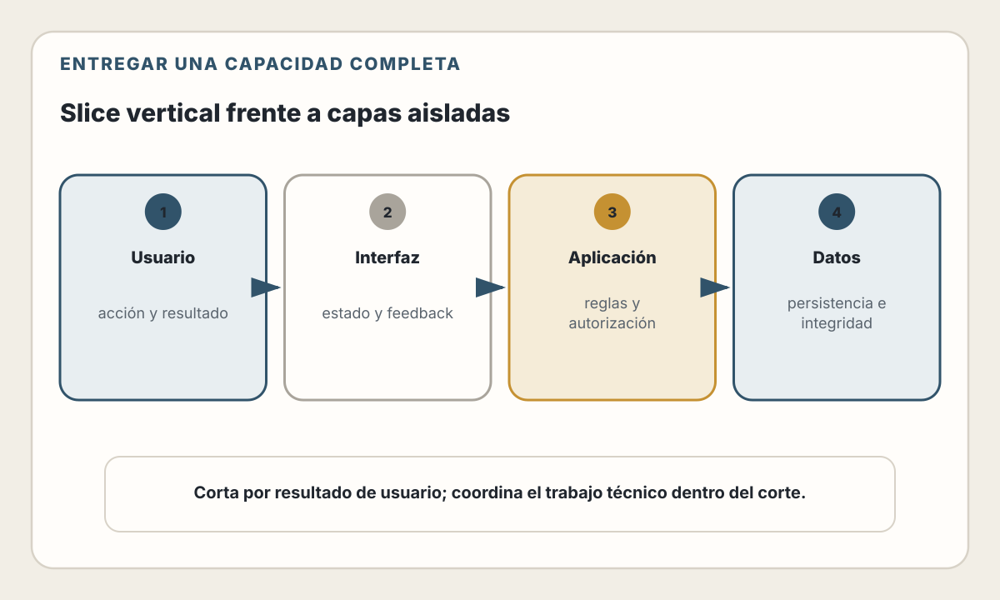
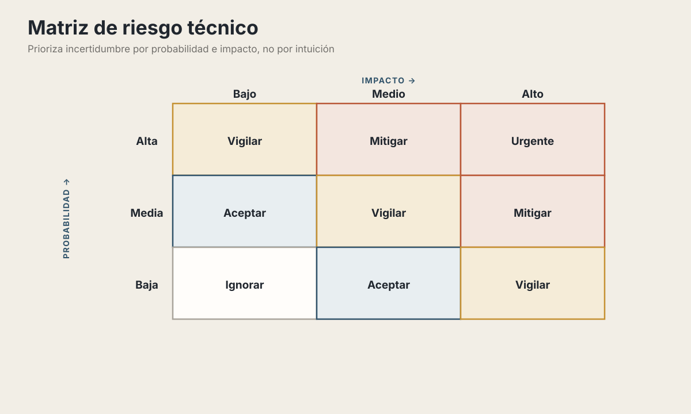
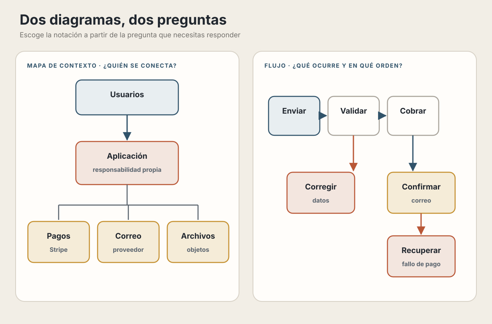
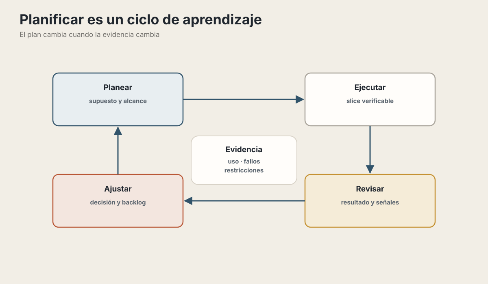

# 14. Planificación Técnica

> "Los planes son inútiles, pero la planificación es indispensable." — Dwight D. Eisenhower

## Objetivos de Aprendizaje

Al finalizar este capítulo, serás capaz de:
- Traducir requerimientos de negocio en tareas técnicas accionables
- Estimar esfuerzo de manera realista (y comunicar la incertidumbre)
- Dividir proyectos grandes en entregables incrementales
- Identificar riesgos técnicos antes de que se conviertan en problemas
- Crear documentación técnica que realmente se use

---

## ¿Por qué planificar?

"Solo escribe código" suena atractivo. Y para un proyecto personal de fin de semana, funciona. Pero en un equipo, con deadlines, con usuarios reales... la falta de planificación se paga caro.

**Historias de terror reales:**

```
❌ "Pensé que la integración con pagos tomaría un día.
    Fueron tres semanas y dos pasarelas diferentes."

❌ "Construimos todo el frontend antes de darnos cuenta
    que la API no podía soportar los filtros que necesitábamos."

❌ "El feature estaba 'casi listo' durante un mes.
    Resultó que 'casi' significaba el 50% del trabajo."
```

La planificación no es burocracia. Es **reducir sorpresas**.

| Fase | Qué puede implicar descubrir un cambio |
|---|---|
| Idea o diseño | Ajustar una hipótesis, un flujo o un documento |
| Desarrollo | Cambiar código, contratos y pruebas |
| Verificación | Rehacer comportamiento y volver a probar integraciones |
| Producción | Coordinar corrección, despliegue, comunicación y posible reversión |
| Después del lanzamiento | Migrar datos, atender soporte y reparar efectos en usuarios |

El costo tiende a crecer cuando una decisión ya está incorporada en más capas y
depende de datos o integraciones reales. No existe un multiplicador universal:
la relación varía según reversibilidad, acoplamiento y alcance.

💡 **Insight**: El objetivo de planificar no es predecir el futuro perfectamente. Es descubrir problemas cuando son baratos de resolver.

---

## Del Requerimiento a la Tarea Técnica

Los stakeholders hablan en necesidades de negocio. Los desarrolladores trabajan en tareas técnicas. La planificación es el puente entre ambos mundos.

### El proceso de descomposición

**Requerimiento de negocio:**
> "Los usuarios deben poder guardar productos en una lista de deseos"

**Paso 1: Identificar los casos de uso**

```
Como usuario autenticado:
- Puedo agregar un producto a mi lista de deseos
- Puedo ver mi lista de deseos
- Puedo eliminar un producto de mi lista
- Puedo mover un producto de la lista al carrito

Como usuario no autenticado:
- ¿Puedo tener lista de deseos? (pregunta al PM)
- Si sí, ¿se fusiona al hacer login?
```

**Paso 2: Identificar componentes técnicos**

**Backend**

- Modelo de datos para listas y elementos.
- Operaciones para consultar, agregar y quitar productos.
- Validación de existencia, duplicados y límites del negocio.

**Frontend**

- Acción «Agregar a la lista» y página de consulta.
- Estado actual del producto y feedback de la operación.
- Estados vacío, carga, error y permisos.

**Integraciones por decidir**

- Notificaciones de cambios de precio.
- Analítica de productos guardados.
- Listas compartidas.

**Paso 3: Crear tareas accionables**

Una descomposición inicial de la épica «Lista de deseos» podría incluir:

- **Backend:** migración; operaciones para crear, consultar y eliminar; reglas
  contra duplicados; pruebas de integración.
- **Frontend:** botón y página de lista; sincronización del estado; estados
  vacío, carga y error; acción para mover un producto al carrito.
- **Calidad y contrato:** casos de prueba, prueba con usuarios y actualización
  de la documentación de la API.

### Características de una buena tarea

Una tarea bien definida es **INVEST**:

| Letra | Significado | Ejemplo malo | Ejemplo bueno |
|-------|-------------|--------------|---------------|
| **I** | Independiente | "Hacer el frontend (depende del backend)" | "Crear componente con datos mock" |
| **N** | Negociable | "Debe usar Redis" | "Necesita caché (implementación a definir)" |
| **V** | Valiosa | "Refactorizar código" | "Reducir tiempo de carga de 5s a 1s" |
| **E** | Estimable | "Mejorar rendimiento" | "Agregar índice a tabla pedidos" |
| **S** | Small (pequeña) | "Implementar checkout" | "Validar tarjeta de crédito" |
| **T** | Comprobable | "Hacer que funcione bien" | "El usuario puede completar la compra en menos de tres clics" |

---

## Estimación: El Arte de lo Imposible

Estimar es difícil. Nadie lo hace bien consistentemente. Pero hay formas de equivocarse menos.

### Por qué fallamos al estimar

**1. Olvidamos el "trabajo invisible"**

Estimar «escribir el código» ignora parte del trabajo: entender el sistema
existente, preparar el entorno, revisar cambios, depurar casos infrecuentes,
coordinar decisiones, esperar dependencias y refactorizar lo que la
implementación permite comprender mejor.

**2. El sesgo del optimismo**

Siempre pensamos en el "happy path":
- El API externa funcionará como dice la documentación ✗
- No habrá conflictos de merge ✗
- Entenderé el código legacy a la primera ✗
- Las dependencias serán compatibles ✗

**3. La Ley de Hofstadter**

> "Siempre toma más tiempo del que esperas, incluso cuando tomas en cuenta la Ley de Hofstadter."

### Técnicas de estimación

#### 1. Planning Poker (para equipos)

Cada miembro estima independientemente usando la secuencia de Fibonacci: 1, 2, 3, 5, 8, 13, 21...

Ante la tarea “implementar autenticación con Google”, María estima 5 puntos,
Ana 8 y Carlos 13. La diferencia revela dos alcances distintos: Carlos incluye
sesiones y renovación de credenciales; María asumía que una biblioteca resolvía
todo el flujo. Después de acordar el alcance, el equipo vuelve a estimar.

La magia no está en el número — está en la **discusión** que revela supuestos diferentes.

#### 2. Estimación por analogía

```
"¿Cuánto tomará la integración con Stripe?"

Referencia: La integración con PayPal tomó 2 semanas
Diferencias:
  + Podemos reutilizar parte del flujo de pagos
  - Ahora necesitamos suscripciones y webhooks
  - El equipo no ha usado este proveedor

Conclusión: dos semanas son un punto de partida, no una conversión matemática.
Separa un spike para los riesgos desconocidos y ofrece un rango revisable.
```

#### 3. Descomposición (la más confiable)

Divide hasta que cada parte sea estimable con confianza:

«Implementar checkout» es demasiado grande para estimarlo como una unidad. Se
puede descomponer en dirección de envío, método de entrega, integración de
pago, confirmación, recuperación de errores y pruebas. La incertidumbre no es
una tarea adicional arbitraria: debe vincularse a riesgos concretos y reducirse
con investigación o slices pequeños.

### Comunicando incertidumbre

Cuando existe incertidumbre relevante, evita comunicar una precisión que la
evidencia no permite. Un **rango** hace visibles los supuestos:

```
❌ "Tomará 2 semanas"

✅ "Mi estimación es:
    - Mejor caso: 1.5 semanas (si todo sale bien)
    - Caso esperado: 2.5 semanas
    - Peor caso: 4 semanas (si encontramos problemas con X)"
```

O usa **niveles de confianza**:

```
"Estoy 90% seguro de que estará listo en 3 semanas.
 Estoy 50% seguro de que estará listo en 2 semanas."
```

Este ejemplo solo es válido si el equipo calibra esos niveles comparando
predicciones anteriores con resultados. Sin esa calibración, el porcentaje es
una forma distinta de falsa precisión.

---

## Entregables Incrementales: El Arte del Slice Vertical

No construyas todo el backend, luego todo el frontend, luego integras. Eso es receta para el desastre.

### Slice Horizontal vs Vertical

<picture>
  <source media="(max-width: 820px)" srcset="../assets/diagrams/cap14-slice-vertical-mobile.svg">
  
</picture>

**Horizontal (malo):**
```
Semana 1-2: Todo el backend
Semana 3-4: Todo el frontend
Semana 5: Integración
Semana 6-8: Arreglar todo lo que no funciona
```

Problemas:
- No tienes nada funcionando hasta la semana 5
- Los problemas de integración aparecen al final
- Si hay cambios de requerimientos, pierdes trabajo

**Vertical (bueno):**
```
Semana 1: Usuario puede registrarse (BE + FE + DB)
Semana 2: Usuario puede ver lista de productos
Semana 3: Usuario puede agregar al carrito
Semana 4: Usuario puede hacer checkout básico
...
```

Cada semana tienes algo **funcionando end-to-end**.

### MVP Técnico vs MVP de Producto

**MVP de Producto**: El mínimo para validar con usuarios
**MVP Técnico**: El mínimo para que el sistema funcione

A veces necesitas un MVP técnico antes del MVP de producto:

El MVP de producto puede expresarse como «las personas pueden comprar un
producto». Para exponerlo a usuarios reales necesitas un mínimo técnico
operable: identidad si el flujo la requiere, datos desplegados, entrega
repetible, HTTPS y observabilidad básica. Ese soporte debe crecer dentro del
slice, no convertirse en meses de infraestructura sin conducta verificable.

### Walking Skeleton

Un "esqueleto caminante" es la arquitectura mínima que atraviesa todas las capas:

```javascript
// Walking Skeleton de un e-commerce

// 1. Frontend: Un botón que hace una llamada
<button onClick={() => fetch('/api/health')}>
  Test Connection
</button>

// 2. API: Un endpoint que responde
app.get('/api/health', (req, res) => {
  res.json({ status: 'ok', db: db.isConnected() });
});

// 3. Database: Una conexión que funciona
const db = await Database.connect(process.env.DATABASE_URL);
```

No hace nada útil, pero prueba que:
- El frontend puede comunicarse con el backend
- El backend puede comunicarse con la base de datos
- El deployment funciona

**Construye el walking skeleton primero.** Luego agrégale carne (features).

---

## Identificación de Riesgos

Un **riesgo** es algo que podría salir mal. La planificación proactiva los identifica y mitiga antes de que exploten.

### Categorías de riesgos técnicos

**1. Riesgos de integración**
```
- API externa: ¿Qué pasa si cambia? ¿Si está caída?
- Dependencias: ¿Son estables? ¿Mantenidas?
- Servicios de terceros: ¿Tienen rate limits? ¿Costos ocultos?
```

**2. Riesgos de rendimiento**
```
- ¿Qué pasa con 1000 usuarios concurrentes?
- ¿Qué pasa cuando la tabla tiene 10 millones de filas?
- ¿Qué pasa si un usuario sube un archivo de 500MB?
```

**3. Riesgos de seguridad**
```
- ¿Cómo manejamos datos sensibles?
- ¿Qué pasa si alguien intenta SQL injection?
- ¿Cómo protegemos las API keys?
```

**4. Riesgos de conocimiento**
```
- ¿Alguien en el equipo conoce esta tecnología?
- ¿Qué pasa si esa persona se va?
- ¿La documentación está actualizada?
```

### Matriz de riesgos

Para cada riesgo, evalúa **probabilidad** e **impacto**:

<picture>
  <source media="(max-width: 820px)" srcset="../assets/diagrams/cap14-matriz-riesgos-mobile.svg">
  
</picture>

**Ejemplo:**

| Riesgo | Prob | Impacto | Acción |
|--------|------|---------|--------|
| Stripe cambia su API | Baja | Alto | Plan de contingencia |
| Base de datos se queda sin espacio | Media | Alto | Alertas + plan de escalado |
| El desarrollador senior se enferma | Media | Alto | Documentar, pair programming |
| El diseño no está listo a tiempo | Alta | Medio | Usar diseño provisional |

### Spike: Reduciendo incertidumbre

Un **spike** es una investigación técnica timeboxed para reducir riesgo:

```
Spike: ¿Podemos integrar con la API de envíos de FedEx?

Timebox: 2 días máximo

Objetivos:
1. Crear cuenta de sandbox
2. Hacer una llamada exitosa para cotizar envío
3. Documentar limitaciones encontradas
4. Recomendar: seguir adelante / buscar alternativa

Resultado del spike:
- API funciona, pero solo soporta direcciones de EEUU
- Para México necesitamos FedEx International (API diferente)
- Recomendación: Investigar Shippo como agregador

El spike evitó 2 semanas de desarrollo en la dirección equivocada.
```

---

## Documentación Técnica que Funciona

La documentación tiene mala fama porque la mayoría es inútil. Pero la buena documentación ahorra horas de "¿cómo funciona esto?"

### La regla: Documenta decisiones, no obviedades

**Mala documentación:**
```
// Suma dos números
// @param a - primer número
// @param b - segundo número
// @return la suma de a y b
function add(a, b) {
  return a + b;
}
```
Esto es ruido. El código ya dice lo que hace.

**Buena documentación:**
```
// Usamos redondeo bancario (round half to even) en lugar del
// redondeo estándar para evitar sesgo acumulativo en reportes
// financieros. Ver: https://en.wikipedia.org/wiki/Rounding#Round_half_to_even
//
// Decisión tomada el 2024-03-15 después de detectar discrepancias
// de $0.03 en el cierre mensual de febrero.
function roundCurrency(amount) {
  return bankersRound(amount, 2);
}
```
Esto explica **por qué**, no qué.

### Architecture Decision Records (ADRs)

Un ADR documenta una decisión arquitectónica importante:

```markdown
# ADR-001: Usar PostgreSQL como base de datos principal

## Estado
Aceptado (2024-03-01)

## Contexto
Necesitamos elegir una base de datos para el MVP.
Opciones consideradas: PostgreSQL, MySQL, MongoDB.

## Decisión
Usaremos PostgreSQL.

## Razones
- Soporte nativo de JSONB para datos semi-estructurados
- Mejor manejo de transacciones que MongoDB
- El equipo tiene experiencia con PostgreSQL
- Hosting fácil en Railway/Supabase para MVP

## Consecuencias
- Positivas: Flexibilidad, rendimiento, comunidad
- Negativas: Más complejo que SQLite para desarrollo local
- Riesgos: Si necesitamos escala horizontal, hay que evaluar Citus

## Alternativas descartadas
- MongoDB: Overkill para nuestro modelo relacional
- MySQL: Menos features que PostgreSQL, sin ventajas claras
```

Guarda los ADRs en el repositorio: `/docs/adr/`

### Diagramas que valen la pena

<picture>
  <source media="(max-width: 820px)" srcset="../assets/diagrams/cap14-diagramas-utiles-mobile.svg">
  
</picture>

El **mapa de contexto** responde quién usa el sistema y con qué sistemas
externos se relaciona. El **flujo** responde qué ocurre en orden y dónde existen
decisiones o salidas de error. Mezclar ambas preguntas en una sola notación
suele producir diagramas difíciles de mantener.

**README del repositorio:**
```markdown
# Mi Proyecto

## Levantar el proyecto
git clone ...
cp .env.example .env
docker-compose up -d
npm install
npm run dev

## Estructura
/src
  /api        # Endpoints REST
  /services   # Lógica de negocio
  /models     # Modelos de datos
  /utils      # Utilidades compartidas

## Decisiones técnicas
Ver /docs/adr/

## Troubleshooting común
- Error "ECONNREFUSED": ¿Está corriendo Docker?
- Error "JWT expired": Hacer logout y login de nuevo
```

---

## Herramientas de Planificación

### Para gestión de tareas

| Herramienta | Mejor para | Limitación |
|-------------|------------|------------|
| **GitHub Issues** | Proyectos open source, equipos técnicos | UI limitada para no-técnicos |
| **Linear** | Startups, equipos de producto | Curva de aprendizaje |
| **Jira** | Empresas grandes, compliance | Complejidad excesiva |
| **Notion** | Equipos pequeños, flexibilidad | No es especializado |
| **Trello** | Kanban simple, visual | Escala mal |

### Para documentación

| Herramienta | Mejor para |
|-------------|------------|
| **Notion** | Wiki del equipo, documentos vivos |
| **Confluence** | Empresas con Jira |
| **GitBook** | Documentación técnica pública |
| **Markdown en repo** | Documentación cercana al código |

### Para diagramas

| Herramienta | Mejor para |
|-------------|------------|
| **Excalidraw** | Diagramas rápidos, estilo boceto |
| **Mermaid** | Diagramas en markdown (versionables) |
| **draw.io** | Diagramas formales, gratis |
| **Figma** | Cuando necesitas colaboración en tiempo real |

---

## El Ciclo de Planificación

La planificación no es un evento único. Es un ciclo continuo:

<picture>
  <source media="(max-width: 820px)" srcset="../assets/diagrams/cap14-ciclo-planificacion-mobile.svg">
  
</picture>

### Sprint Planning (si usas Scrum)

```
Cada 2 semanas:

1. Revisar backlog priorizado
2. Seleccionar items para el sprint
3. Descomponer en tareas
4. Estimar en equipo
5. Comprometer lo realista (no lo deseado)

Regla: Si no cabe, no cabe. No comprimas la estimación.
```

### Retrospectiva técnica

```
Al final de cada sprint/milestone:

¿Qué funcionó?
- Los spikes nos ahorraron tiempo
- Pair programming en features complejos

¿Qué no funcionó?
- Estimamos sin considerar vacaciones
- La integración con X tomó el doble

¿Qué haremos diferente?
- Reservar contingencia para los riesgos de integración identificados
- Spike obligatorio para integraciones externas
```

---

## Antipatrones de Planificación

### 1. "Lo estimamos después"

```
PM: "¿Cuánto toma agregar filtros a la búsqueda?"
Dev: "No sé, hay que ver cómo está implementada"
PM: "Ok, ponle 3 días"
Dev: "..."

Resultado: 3 días se convierten en 3 semanas cuando
descubren que la búsqueda usa una librería abandonada.
```

**Solución**: No estimes sin investigar. Pide un spike.

### 2. "Vamos a hacerlo todo"

```
Sprint de 2 semanas, capacidad: 40 puntos

Items seleccionados:
- Feature A: 15 puntos
- Feature B: 20 puntos
- Feature C: 12 puntos
- Tech debt: 8 puntos
Total: 55 puntos

"Lo vamos a lograr si trabajamos un poco más"

Resultado: Nada se termina completamente.
```

**Solución**: Prioriza despiadadamente. Menos es más.

### 3. "El deadline es inamovible"

```
"La fecha de lanzamiento es el 15 de marzo, sin excepciones"

Opciones reales:
1. Reducir alcance (menos features)
2. Reducir calidad (más bugs)
3. Agregar recursos (más gente, si es posible)
4. Mover la fecha

Si no eliges conscientemente, el proyecto elige por ti
(generalmente opción 2: más bugs).
```

**Solución**: El triángulo de hierro es real. Tiempo, alcance, calidad — elige dos.

### 4. "Ya casi está"

```
Semana 1: "La implementación principal está"
Semana 2: "Faltan algunos detalles"
Semana 3: "Solo queda probar"
Semana 4: "Aparecieron casos borde"
Semana 5: "Falta preparar la operación"
...
```

Las etiquetas de avance ocultan el trabajo restante si no enumeran pruebas,
casos borde, migración, despliegue y operación.

**Solución**: Define "terminado" antes de empezar. Usa una checklist de Definition of Done.

---

## Definition of Done

Una tarea NO está terminada hasta que cumple todos los criterios:

```markdown
## Definition of Done - Feature

- [ ] Código escrito y funcionando
- [ ] Pruebas seleccionadas según riesgos y criterios de aceptación
- [ ] Pruebas de integración para los flujos críticos
- [ ] Code review aprobado
- [ ] Documentación actualizada (si aplica)
- [ ] Sin warnings en linter
- [ ] Desplegado en staging
- [ ] QA aprobó en staging
- [ ] Métricas de monitoreo configuradas
- [ ] Feature flag configurado (si aplica)
```

Si falta algo, **no está terminado**. No hay "90% terminado".

---

## Caso Práctico: Planificando un MVP

Contexto: Startup de delivery de comida para oficinas.

### Paso 1: Definir el MVP

```
Debe tener (MVP):
- Usuarios pueden ver restaurantes cercanos
- Usuarios pueden hacer pedido
- Usuarios pueden pagar con tarjeta
- Restaurantes reciben notificación de pedido

No es MVP (v2+):
- Reviews de restaurantes
- Programa de lealtad
- Múltiples direcciones de entrega
- Pedidos grupales
```

### Paso 2: Identificar riesgos

| Riesgo | Probabilidad | Impacto | Tratamiento inicial |
|---|---|---|---|
| Integración con la pasarela de pago | Alta | Alto | Ejecutar un spike |
| Notificaciones a restaurantes | Media | Alto | Definir y probar el canal |
| Geolocalización de restaurantes | Baja | Medio | Evaluar un servicio existente |

### Paso 3: Walking Skeleton

```
Semana 1:
- Frontend: lista fija de restaurantes
- Backend: API que devuelve JSON estático
- Deploy: Funcionando en staging
- Pago: Stripe en modo test

Resultado: Sistema end-to-end funcionando, sin datos reales.
```

### Paso 4: Slices verticales

```
Semana 2: Restaurantes
- DB: Modelo de restaurantes
- API: CRUD de restaurantes
- UI: Lista y detalle de restaurante
- Admin: Formulario para agregar restaurantes

Semana 3: Menú
- DB: Modelo de productos
- API: Productos por restaurante
- UI: Menú del restaurante
- Admin: Gestión de menú

Semana 4: Carrito
- State: Carrito en memoria/localStorage
- UI: Agregar/quitar items
- API: Validar disponibilidad

Semana 5: Checkout
- API: Crear pedido
- Stripe: Integración real
- Email: Confirmación
- Notificación: Al restaurante

Semana 6: Buffer + Polish
- Bugs encontrados
- Mejoras de UX
- Testing final
```

### Paso 5: Estimación con incertidumbre

```
Mejor caso: 5 semanas (todo sale perfecto)
Esperado: 7 semanas (problemas menores)
Peor caso: 10 semanas (problemas con pagos o pivotes)

Comunicación al stakeholder:
"Estaremos listos para beta privada en 7-8 semanas,
con posibilidad de adelantar a 5 si todo fluye bien."
```

---

## 🤖 Usando IA para Planificación Técnica

La IA está transformando la planificación de proyectos, desde la descomposición de tareas hasta la estimación basada en datos históricos.

### Descomposición de requerimientos

```
Prompt efectivo:
"Descompón este requerimiento en tareas técnicas:

'Los usuarios deben poder dejar reviews de productos
con calificación 1-5 estrellas y texto opcional'

Para cada tarea indica:
- Descripción clara
- Criterios de aceptación
- Dependencias
- Complejidad estimada (S/M/L)"
```

La IA genera un borrador que luego el equipo valida y ajusta.

### Casos de uso principales

**1. Generación de user stories**

```
Prompt:
"Convierte estos requisitos de negocio en user stories:
- Los clientes necesitan ver su historial de compras
- Los clientes quieren repetir pedidos fácilmente
- Los clientes necesitan descargar facturas

Usa el formato: Como [rol], quiero [acción] para [beneficio]
Incluye criterios de aceptación para cada una."
```

**2. Identificación de riesgos**

```
Prompt:
"Estamos desarrollando un sistema de pagos recurrentes.
Stack: Node.js, PostgreSQL, Stripe.
Equipo: 2 devs seniors, 1 junior.
Deadline: 8 semanas.

Identifica riesgos técnicos potenciales, clasifícalos
por probabilidad/impacto, y sugiere mitigaciones."
```

**3. Estimación asistida**

```
Prompt:
"Dado este historial de sprints:
- Sprint 1: 23 story points completados
- Sprint 2: 28 story points completados
- Sprint 3: 21 story points completados

Y estas tareas pendientes (42 story points total),
¿cuántos sprints necesitaremos? ¿Qué riesgos ves?"
```

**4. Generación de ADRs**

```
Prompt:
"Genera un ADR para la decisión de usar PostgreSQL
en lugar de MongoDB para nuestro sistema de inventario.

Contexto: Operaciones transaccionales complejas,
equipo con experiencia en SQL, necesidad de reportes.

Incluye: alternativas consideradas, pros/contras,
decisión y consecuencias."
```

### Herramientas potenciadas por IA

| Herramienta | Función |
|-------------|---------|
| **Jira AI** | Sugerencias de story points basadas en histórico |
| **Zenhub** | Estimación predictiva con datos de GitHub |
| **Linear** | Priorización automática y detección de bloqueos |
| **ClickUp AI** | Generación de acceptance criteria |
| **Baseliner** | Forecasting multi-equipo con ML |

### Limitaciones importantes

| ❌ Cuidado con... | ✅ Usa IA para... |
|-------------------|-------------------|
| Estimaciones sin contexto del equipo | Generar borradores de descomposición |
| Predicciones sin datos históricos | Identificar riesgos que podrías olvidar |
| Reemplazar la discusión del equipo | Preparar material para planning |
| Fechas exactas basadas en IA | Comunicar rangos con incertidumbre |

### Advertencia sobre estimaciones

> ⚠️ **Importante**: La IA puede informar estimaciones, pero **no debe reemplazar el consenso del equipo**. Las estimaciones son compromisos humanos, no cálculos matemáticos.

El valor de técnicas como Planning Poker no está solo en el número final, sino en la **conversación** que revela supuestos diferentes entre miembros del equipo.

### Flujo recomendado

1. Describe resultados, restricciones y criterios en lenguaje natural.
2. Usa IA para generar una descomposición inicial.
3. Haz que el equipo revise alcance, dependencias y omisiones.
4. Usa IA para ampliar el inventario de riesgos, no para decidir su prioridad.
5. Estima con contexto e historial del equipo.
6. Comunica rangos, supuestos y señales que obligarían a revisar el plan.

> 🤖 **Nota**: La IA acelera la preparación del planning, pero la **planificación efectiva requiere conversación humana**. Los malentendidos se descubren hablando, no generando texto.

---

## Resumen

- La planificación reduce sorpresas — el objetivo no es predecir perfectamente
- Descompón requisitos en tareas INVEST (pequeñas, estimables y comprobables)
- Estima con rangos, no números exactos; comunica la incertidumbre
- Construye en slices verticales, no horizontales
- Identifica y mitiga riesgos con spikes antes de comprometer fechas
- Documenta decisiones, no obviedades (usa ADRs)
- El Definition of Done evita el "casi terminado" eterno
- El triángulo de hierro es real: tiempo, alcance, calidad — elige dos

---

## Ejercicios

1. **Descomposición**: Toma el requerimiento "Los usuarios deben poder dejar reviews de productos" y descomponlo en tareas técnicas siguiendo el proceso del capítulo.

2. **Estimación**: Para las tareas del ejercicio anterior, estima usando Planning Poker con tu equipo (o simula tres perspectivas diferentes).

3. **Riesgos**: Identifica 5 riesgos para un proyecto de "agregar login con Google" y clasifícalos en la matriz de probabilidad/impacto.

4. **ADR**: Escribe un ADR para la decisión de usar React vs Vue en un nuevo proyecto.

---

## Referencias

- McConnell, S. (2006). *Software Estimation: Demystifying the Black Art*. Microsoft Press.
- Cohn, M. (2005). *Agile Estimating and Planning*. Prentice Hall.
- Brown, S. (2018). *The C4 Model for Software Architecture*. https://c4model.com/
- Nygard, M. (2007). *Release It!*. Pragmatic Bookshelf.

---

**Anterior**: [Modelado de Datos](./13-modelado-datos.md) | **Siguiente**: [Arquitectura Frontend](./15-arquitectura-frontend.md)
