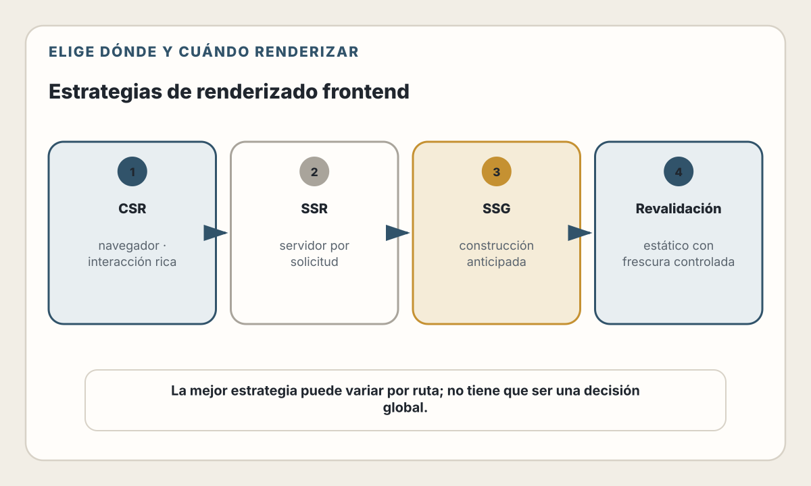
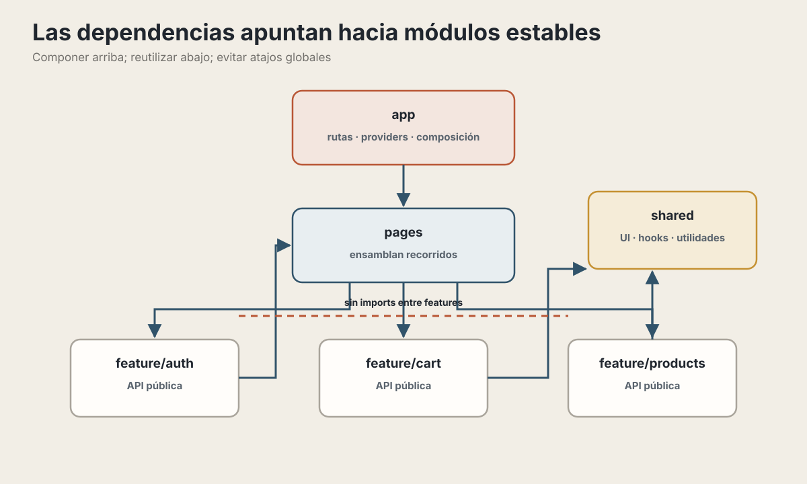
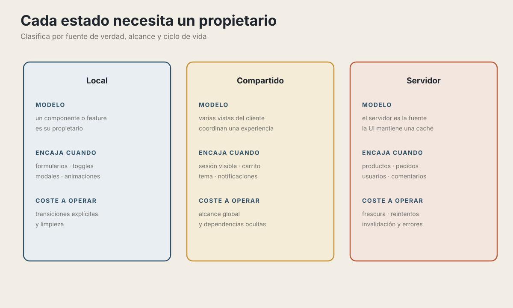

# 15. Arquitectura Frontend

> "La complejidad del frontend no está en el código, está en el estado."

## Objetivos de Aprendizaje

Al finalizar este capítulo, serás capaz de:
- Elegir el framework adecuado para tu proyecto (o decidir no usar ninguno)
- Estructurar proyectos frontend de manera escalable
- Manejar estado de forma predecible y mantenible
- Implementar patrones de renderizado según las necesidades (CSR, SSR, SSG)
- Optimizar el rendimiento percibido y real de tu aplicación

## Ruta de lectura y alcance

La ruta esencial es: elegir el límite servidor/cliente → organizar por cambio →
clasificar el estado → decidir renderizado y caché → medir rendimiento. Las
comparaciones de librerías y estilos sirven como ejemplos; no son un ranking.

Los fundamentos de HTML, CSS y runtime están en los capítulos 2–5. Las pruebas
frontend se desarrollan en el capítulo 21. Aquí solo se estudia cómo esas piezas
afectan la arquitectura y el coste de operación de la interfaz.

---

## Un Mapa del Ecosistema Frontend

El frontend combina capacidades estables de la plataforma con herramientas que
evolucionan rápidamente. Conviene separar ambas capas para no confundir una
decisión de producto con la popularidad momentánea de un framework.

### El panorama actual

> **Estado del ecosistema — verificado el 30 de julio de 2026.** Este mapa sirve
> para reconocer familias de soluciones. Las etiquetas de popularidad o
> tendencia envejecen rápidamente y no deben sustituir una evaluación del
> equipo, el producto y la plataforma.

| Capa de decisión | Ejemplos | Qué resuelve |
|---|---|---|
| Meta-framework | Next.js, Nuxt, SvelteKit, Astro | Rutas, renderizado, datos, build y despliegue |
| Biblioteca o compilador de UI | React, Vue, Svelte, Solid | Componentes, reactividad e interacción |
| Herramienta de construcción | Vite, Turbopack, esbuild | Transformación, empaquetado y entorno de desarrollo |

Estas categorías se superponen y cambian. Elige primero el modelo de ejecución
y las responsabilidades del sistema; después verifica qué herramienta las
cubre en la versión que usarás.

### Lo que NO muestra este diagrama

El ecosistema JavaScript acapara buena parte de la conversación, pero React no
representa todas las formas de construir para la web.

Millones de aplicaciones en producción usan:
- **PHP**: Laravel, Symfony, CodeIgniter, WordPress
- **Python**: Django, Flask
- **Ruby**: Ruby on Rails
- **Java/.NET**: Spring, ASP.NET

La antigüedad de una tecnología no determina por sí sola su idoneidad. Revisa
soporte, mantenimiento, seguridad, capacidades del equipo y coste de cambio.

---

## El Renacimiento del Server-Rendered

### Un poco de historia

Antes de que las SPA se generalizaran, el renderizado en servidor era el enfoque
habitual para muchas aplicaciones:

Entre mediados de la década de 2000 y comienzos de la siguiente, muchas
aplicaciones combinaron renderizado en servidor con JavaScript progresivo:
PHP en gestores de contenido, Rails en productos web, Django en servicios de
contenido y ASP.NET en entornos empresariales. Las arquitecturas reales de esos
productos evolucionaron; los nombres no deben interpretarse como fotografías
permanentes de su stack actual.

Luego llegaron los SPAs (Single Page Applications) y prometieron:
- Experiencias más fluidas "como apps nativas"
- Separación frontend/backend
- Reutilización de APIs

**También introdujeron costes posibles:**
- más JavaScript y trabajo de hidratación en el cliente;
- coordinación entre estado remoto y estado de interfaz;
- rutas, foco y semántica que el equipo debe implementar correctamente;
- una carga inicial mayor si no se controla el presupuesto de recursos.

### El péndulo regresa

Una respuesta es mantener en el servidor la mayor parte del estado y enviar HTML
para actualizar regiones de la página. Este enfoque suele llamarse
**HTML-over-the-wire**:

En una SPA tradicional, el servidor suele enviar datos y JavaScript produce el
HTML. En un enfoque **HTML over the wire**, el servidor devuelve fragmentos de
HTML que el cliente inserta en el DOM. HTMX, Livewire y Hotwire representan
variantes de esta idea, con distintos grados de acoplamiento al framework del
servidor.

### Ejemplos de enfoques server-driven

#### Laravel + Livewire (PHP)

Livewire permite expresar desde PHP buena parte de la interacción y sincroniza
actualizaciones con el navegador. Aun así, la interfaz resultante utiliza
JavaScript proporcionado por la propia herramienta.

```php
// Livewire: Componente reactivo en PHP puro
class SearchUsers extends Component
{
    public $search = '';

    public function render()
    {
        return view('livewire.search-users', [
            'users' => User::where('name', 'like', "%{$this->search}%")->get()
        ]);
    }
}
```

```html
<!-- La vista se actualiza automáticamente al escribir -->
<div>
    <input wire:model.live="search" placeholder="Buscar usuarios...">

    @foreach($users as $user)
        <div>{{ $user->name }}</div>
    @endforeach
</div>
```

**Trade-offs relevantes:**
- reduce el cambio de contexto para equipos centrados en PHP;
- encaja bien con CRUD y flujos guiados por el servidor;
- la latencia de red y el ciclo de actualización forman parte de la interacción;
- crea dependencia de las convenciones y el runtime del framework.

**Puede encajar en:** aplicaciones empresariales, CRMs y paneles administrativos.

#### Django + HTMX (Python)

Django sigue siendo sólido para aplicaciones data-heavy. HTMX le da interactividad moderna.

```html
<!-- HTMX: Interactividad declarativa en HTML -->
<button hx-post="/like/{{ post.id }}"
        hx-target="#like-count"
        hx-swap="innerHTML">
    👍 Me gusta
</button>

<span id="like-count">{{ post.likes }}</span>
```

```python
# Vista Django normal
def like_post(request, post_id):
    post = Post.objects.get(id=post_id)
    post.likes += 1
    post.save()
    return HttpResponse(str(post.likes))  # Solo el número
```

**Trade-offs relevantes:**
- conserva plantillas, validación y autorización cerca del servidor;
- permite añadir interacción a una aplicación existente de forma incremental;
- exige diseñar respuestas parciales, historial, foco y errores de red;
- compartir Python con otros dominios no vuelve correcta automáticamente la
  arquitectura web.

**Puede encajar en:** aplicaciones de datos y herramientas administrativas.

#### Ruby on Rails + Hotwire

Rails inventó muchas de las convenciones que otros copiaron. Hotwire (Turbo + Stimulus) es su respuesta moderna a los SPAs.

```erb
<!-- Turbo Frame: Actualiza solo una parte de la página -->
<%= turbo_frame_tag "cart" do %>
  <div>Items: <%= @cart.items.count %></div>
  <%= button_to "Agregar", add_to_cart_path, method: :post %>
<% end %>
```

**Trade-offs relevantes:**
- aprovecha las convenciones de Rails y mantiene el servidor como fuente de
  verdad;
- evita crear una API JSON para cada interacción;
- necesita observar el número de viajes de red y el comportamiento bajo
  latencia;
- no elimina JavaScript: Turbo y Stimulus lo encapsulan y organizan.

**Puede encajar en:** productos SaaS y equipos con experiencia en Rails.

#### CodeIgniter y Symfony (PHP)

Ambos permiten aplicaciones renderizadas en servidor, con filosofías y niveles
de configuración diferentes. No deduzcas una migración a partir de una tabla de
popularidad.

### Cómo reconocer riesgo de ciclo de vida

Investiga señales verificables:

- fecha de la última versión y política de soporte;
- vulnerabilidades sin parchear;
- compatibilidad con el runtime que utiliza tu organización;
- capacidad del equipo para mantener y contratar;
- existencia de una ruta de actualización documentada.

Un producto sin soporte, como AngularJS 1.x, requiere un plan explícito de
contención o migración. Una biblioteca antigua pero mantenida no es
automáticamente obsoleta, y una reescritura también introduce riesgo.

---

## ¿Necesitas un framework JavaScript?

Antes de elegir React, Vue o Svelte, pregúntate: **¿realmente lo necesitas?**

**Un framework de UI aporta menos valor si:**
- Es un sitio mayormente estático (blog, landing, documentación)
- La interactividad es mínima (formularios simples, menús)
- El SEO es crítico y el contenido no cambia frecuentemente
- Ya usas Laravel/Django/Rails y Livewire/HTMX/Hotwire resuelven tu caso
- Tu equipo es más fuerte en PHP/Python/Ruby que en JavaScript
- Es un proyecto pequeño con vida útil corta

**Alternativas al JavaScript moderno:**
- **Laravel + Livewire** — Full-stack PHP, muy productivo
- **Rails + Hotwire** — Full-stack Ruby, convenciones sólidas
- **Django + HTMX** — Full-stack Python, ideal para data apps
- **Astro** — Genera HTML estático, agrega JS solo donde necesitas
- **HTML + Alpine.js** — Reactividad ligera, directamente en HTML

**Un framework de UI puede aportar más valor si:**
- La UI es altamente interactiva (editores de texto/imagen, drag & drop complejo)
- Necesitas funcionalidad offline (PWA)
- Es una aplicación tipo "app" más que tipo "sitio web"
- El equipo ya domina React/Vue y quiere reutilizar ese conocimiento
- Necesitas React Native para móvil

💡 **Insight**: No todo necesita ser una SPA. Decide dónde debe vivir el estado,
qué interacción requiere continuidad en el cliente y cuánto JavaScript puedes
operar con confianza.

---

## Comparativa de Stacks: La vista completa

Antes de elegir una herramienta, decide dónde y cuándo debe producirse el HTML
de cada ruta. Esa decisión cambia la carga inicial, la frescura, la caché y la
cantidad de JavaScript que tendrás que operar.

<picture>
  <source media="(max-width: 820px)" srcset="../assets/diagrams/cap15-estrategias-renderizado-mobile.svg">
  
</picture>

| Familia | Centro de renderizado | Coste que debes evaluar |
|---------|-----------------------|--------------------------|
| Meta-framework de componentes | Servidor y cliente | Hidratación, caché y límites de ejecución |
| Framework server-driven | Principalmente servidor | Viajes de red y acoplamiento al backend |
| Generador orientado a contenido | Build y servidor | Interactividad añadida por islas |
| SPA cliente | Principalmente navegador | Carga inicial, estado remoto y operación de la API |

---

## Eligiendo tu Stack JavaScript

Si decidiste que necesitas un framework JavaScript, estas son las opciones principales:

### React

**Fortalezas:**
- Amplio ecosistema de librerías y meta-frameworks
- Composición explícita mediante componentes y funciones
- Integración con renderizado de servidor a través de frameworks
- React Native para móvil

**Debilidades:**
- Verboso comparado con alternativas
- Muchas formas de hacer lo mismo (confusión)
- El rendimiento depende de los límites cliente/servidor y de la arquitectura
- "JavaScript fatigue" — demasiadas decisiones

**Úsalo cuando:**
- Necesitas alguna capacidad concreta de su ecosistema
- El equipo ya lo conoce
- El equipo puede mantener sus convenciones y dependencias

```jsx
// React: Componente típico
function ProductCard({ product, onAddToCart }) {
  const [quantity, setQuantity] = useState(1);

  return (
    <div className="product-card">
      
      <h3>{product.name}</h3>
      <p>${product.price}</p>
      <input
        type="number"
        min="1"
        value={quantity}
        onChange={(event) => setQuantity(Number(event.target.value))}
      />
      <button onClick={() => onAddToCart(product, quantity)}>
        Agregar al carrito
      </button>
    </div>
  );
}
```

### Vue

**Fortalezas:**
- Plantillas cercanas a HTML y reactividad integrada
- Documentación oficial extensa
- Single File Components (HTML, CSS, JS juntos)
- Menos decisiones que tomar

**Debilidades:**
- Algunas bibliotecas de terceros se diseñan primero para otros ecosistemas
- Un proyecto antiguo en Vue 2 requiere evaluar su ruta de actualización

**Úsalo cuando:**
- Quieres productividad rápida
- El equipo tiene experiencia variada
- Prefieres convenciones sobre configuración

```html
<!-- Vue: Single File Component -->
<template>
  <div class="product-card">
    
    <h3>{{ product.name }}</h3>
    <p>${{ product.price }}</p>
    <input type="number" min="1" v-model.number="quantity" />
    <button @click="addToCart">Agregar al carrito</button>
  </div>
</template>

<script setup>
import { ref } from 'vue';

const props = defineProps(['product']);
const emit = defineEmits(['add-to-cart']);

const quantity = ref(1);

function addToCart() {
  emit('add-to-cart', props.product, quantity.value);
}
</script>

<style scoped>
.product-card {
  /* Estilos encapsulados automáticamente */
}
</style>
```

### Svelte

**Fortalezas:**
- Compila componentes y reduce parte del trabajo del runtime
- Reactividad explícita mediante runes en Svelte 5
- Estilos acotados al componente

**Debilidades:**
- Algunas integraciones tienen menos opciones que ecosistemas más antiguos
- La sintaxis moderna difiere de ejemplos escritos para Svelte 4

**Úsalo cuando:**
- Su modelo de compilación encaja con tus restricciones
- El equipo acepta sus convenciones y verifica el soporte de sus dependencias

```html
<!-- Svelte: Sintaxis minimalista -->
<script>
  let { product, onAddToCart } = $props();
  let quantity = $state(1);
</script>

<div class="product-card">
  
  <h3>{product.name}</h3>
  <p>${product.price}</p>
  <input type="number" min="1" bind:value={quantity} />
  <button onclick={() => onAddToCart(product, quantity)}>
    Agregar al carrito
  </button>
</div>

<style>
  .product-card {
    /* Estilos automáticamente scoped */
  }
</style>
```

### Comparación rápida

| Aspecto | React | Vue | Svelte |
|---------|-------|-----|--------|
| Modelo de vista | JSX | Plantillas o JSX | Plantillas compiladas |
| Reactividad | Estado y hooks | Refs/reactive | Runes |
| Estilos acotados | Mediante solución elegida | Integrados en SFC | Integrados |
| Renderizado servidor | Mediante framework | Mediante framework | Mediante SvelteKit |
| Decisión clave | Límites y estado | Convenciones de componentes | Modelo de compilación |

---

## Estructura de Proyecto

Una buena estructura te salva cuando el proyecto crece.

### Estructura por tipo (la clásica)

```
src/
├── components/        # Todos los componentes
│   ├── Button.jsx
│   ├── Card.jsx
│   ├── Modal.jsx
│   └── ...
├── pages/            # Páginas/rutas
│   ├── Home.jsx
│   ├── Product.jsx
│   └── Checkout.jsx
├── hooks/            # Custom hooks
├── utils/            # Funciones utilitarias
├── services/         # Llamadas a APIs
├── styles/           # CSS global
└── assets/           # Imágenes, fuentes
```

**Pros:** Simple, familiar
**Cons:** Escala mal, archivos no relacionados juntos

### Estructura por feature (recomendada)

```
src/
├── features/
│   ├── auth/
│   │   ├── components/
│   │   │   ├── LoginForm.jsx
│   │   │   └── RegisterForm.jsx
│   │   ├── hooks/
│   │   │   └── useAuth.js
│   │   ├── services/
│   │   │   └── authApi.js
│   │   └── index.js          # Exporta la API pública
│   │
│   ├── products/
│   │   ├── components/
│   │   │   ├── ProductCard.jsx
│   │   │   ├── ProductList.jsx
│   │   │   └── ProductFilters.jsx
│   │   ├── hooks/
│   │   │   └── useProducts.js
│   │   ├── services/
│   │   │   └── productsApi.js
│   │   └── index.js
│   │
│   └── cart/
│       ├── components/
│       ├── hooks/
│       └── ...
│
├── shared/               # Componentes compartidos
│   ├── components/
│   │   ├── Button.jsx
│   │   ├── Input.jsx
│   │   └── Modal.jsx
│   ├── hooks/
│   │   └── useLocalStorage.js
│   └── utils/
│       └── formatCurrency.js
│
├── pages/               # Solo routing, importa de features
│   ├── index.jsx
│   ├── products/[id].jsx
│   └── checkout.jsx
│
└── app/                 # Configuración global
    ├── providers.jsx
    ├── routes.jsx
    └── store.js
```

**Pros:**
- Código relacionado junto
- Fácil de navegar
- Escala bien
- Fácil de extraer a paquetes

**Cons:**
- Más setup inicial
- Puede ser overkill para proyectos pequeños

### Reglas de importación

<picture>
  <source media="(max-width: 820px)" srcset="../assets/diagrams/cap15-dependencias-features-mobile.svg">
  
</picture>

`app` es la raíz de composición: puede conocer páginas y módulos para
conectarlos. Una `feature` no debería importar `app/store`, porque convertiría
la capa superior en una dependencia global. Si dos features colaboran,
coordínalas desde una página o caso de uso, o extrae un contrato realmente
compartido; no muevas lógica de negocio a `shared` solo para evitar una regla.

💡 **Insight**: Si un componente se usa en múltiples features, pertenece a `shared/`. Si solo se usa en una feature, quédate ahí.

---

## Manejo de Estado

El estado es la fuente de la mayoría de bugs en frontend. Manejarlo bien es crítico.

### Tipos de estado

<picture>
  <source media="(max-width: 820px)" srcset="../assets/diagrams/cap15-tipos-estado-mobile.svg">
  
</picture>

“Estado del servidor” no significa copiar la fuente de verdad al navegador. La
interfaz mantiene una caché con políticas de frescura, reintento e invalidación;
el servidor sigue siendo la autoridad sobre productos, pedidos y permisos.

### Estado Local: useState y useReducer

**useState** — Para estado simple:

```jsx
function Counter() {
  const [count, setCount] = useState(0);

  return (
    <button onClick={() => setCount(count + 1)}>
      Clicks: {count}
    </button>
  );
}
```

**useReducer** — Para estado con lógica compleja:

```jsx
const initialState = {
  items: [],
  loading: false,
  error: null
};

function cartReducer(state, action) {
  switch (action.type) {
    case 'ADD_ITEM':
      return {
        ...state,
        items: [...state.items, action.payload]
      };
    case 'REMOVE_ITEM':
      return {
        ...state,
        items: state.items.filter(item => item.id !== action.payload)
      };
    case 'SET_LOADING':
      return { ...state, loading: action.payload };
    case 'SET_ERROR':
      return { ...state, error: action.payload, loading: false };
    default:
      return state;
  }
}

function Cart() {
  const [state, dispatch] = useReducer(cartReducer, initialState);

  const addItem = (item) => dispatch({ type: 'ADD_ITEM', payload: item });
  const removeItem = (id) => dispatch({ type: 'REMOVE_ITEM', payload: id });

  // ...
}
```

### Estado Compartido: Las opciones

#### 1. Context API (built-in)

Bueno para estado que cambia poco (tema, usuario, idioma).

```jsx
// AuthContext.jsx
const AuthContext = createContext(null);

export function AuthProvider({ children }) {
  const [user, setUser] = useState(null);

  const login = async (credentials) => {
    const user = await authApi.login(credentials);
    setUser(user);
  };

  const logout = () => {
    authApi.logout();
    setUser(null);
  };

  return (
    <AuthContext.Provider value={{ user, login, logout }}>
      {children}
    </AuthContext.Provider>
  );
}

export const useAuth = () => useContext(AuthContext);

// Uso
function Header() {
  const { user, logout } = useAuth();

  return user ? (
    <button onClick={logout}>Cerrar sesión</button>
  ) : (
    <Link to="/login">Iniciar sesión</Link>
  );
}
```

⚠️ **Trade-off**: cuando cambia el `value` del provider, React vuelve a renderizar
los consumidores de ese contexto. Separa contextos por responsabilidad y mide
antes de introducir otra herramienta.

#### 2. Zustand

Una opción de store externo con suscripción mediante selectores:

```jsx
// stores/cartStore.js
import { create } from 'zustand';

const useCartStore = create((set, get) => ({
  items: [],

  addItem: (product) => set((state) => ({
    items: [...state.items, { ...product, quantity: 1 }]
  })),

  removeItem: (productId) => set((state) => ({
    items: state.items.filter(item => item.id !== productId)
  })),

  updateQuantity: (productId, quantity) => set((state) => ({
    items: state.items.map(item =>
      item.id === productId ? { ...item, quantity } : item
    )
  })),

  // Computed values
  get totalItems() {
    return get().items.reduce((sum, item) => sum + item.quantity, 0);
  },

  get totalPrice() {
    return get().items.reduce(
      (sum, item) => sum + item.price * item.quantity,
      0
    );
  },

  clearCart: () => set({ items: [] })
}));

// Uso - solo re-renderiza si cambia lo que usas
function CartIcon() {
  const totalItems = useCartStore((state) => state.totalItems);
  return <span>🛒 {totalItems}</span>;
}

function CartTotal() {
  const totalPrice = useCartStore((state) => state.totalPrice);
  return <span>Total: ${totalPrice}</span>;
}
```

**Trade-offs frente a Redux Toolkit:**
- API y configuración más pequeñas para casos simples
- Puede utilizarse sin un Provider global
- Los selectores permiten suscribirse a porciones del store
- Ofrece menos convenciones integradas para flujos y tooling complejos

#### 3. Redux Toolkit

Puede encajar cuando el equipo necesita convenciones explícitas, middleware,
trazabilidad de acciones o un ecosistema ya adoptado:

```jsx
// features/cart/cartSlice.js
import { createSlice } from '@reduxjs/toolkit';

const cartSlice = createSlice({
  name: 'cart',
  initialState: { items: [] },
  reducers: {
    addItem: (state, action) => {
      state.items.push(action.payload); // Immer permite "mutación"
    },
    removeItem: (state, action) => {
      state.items = state.items.filter(item => item.id !== action.payload);
    }
  }
});

export const { addItem, removeItem } = cartSlice.actions;
export default cartSlice.reducer;
```

### Estado del Servidor: React Query / TanStack Query

Los datos remotos tienen problemas distintos al estado efímero de UI:
- Caché
- Revalidación
- Estados de carga/error
- Sincronización

TanStack Query ofrece primitivas para estos problemas:

```jsx
// hooks/useProducts.js
import { useQuery, useMutation, useQueryClient } from '@tanstack/react-query';

export function useProducts(filters) {
  return useQuery({
    queryKey: ['products', filters],
    queryFn: () => api.getProducts(filters),
    staleTime: 5 * 60 * 1000, // 5 minutos antes de refetch
  });
}

export function useProduct(id) {
  return useQuery({
    queryKey: ['product', id],
    queryFn: () => api.getProduct(id),
  });
}

export function useCreateProduct() {
  const queryClient = useQueryClient();

  return useMutation({
    mutationFn: api.createProduct,
    onSuccess: () => {
      // Invalida el caché para que se refetche
      queryClient.invalidateQueries({ queryKey: ['products'] });
    }
  });
}

// Uso en componente
function ProductList() {
  const { data: products, isLoading, error } = useProducts({ category: 'electronics' });

  if (isLoading) return <Spinner />;
  if (error) return <Error message={error.message} />;

  return (
    <ul>
      {products.map(product => (
        <ProductCard key={product.id} product={product} />
      ))}
    </ul>
  );
}
```

**Capacidades:**
- caché y deduplicación según claves;
- revalidación y refetch en segundo plano configurables;
- actualizaciones optimistas;
- reintentos configurables;
- herramientas de inspección.

💡 **Insight**: No existe una combinación universal. Context, un store externo y
una caché de datos remotos resuelven problemas diferentes; incorpora cada pieza
solo cuando el modelo de estado lo requiera.

---

## Patrones de Renderizado

### CSR: Client-Side Rendering

El navegador recibe HTML vacío, JavaScript construye la UI.

Secuencia habitual: el servidor entrega un shell HTML; el navegador descarga y
ejecuta JavaScript; la aplicación solicita datos y finalmente representa la
interfaz. “CSR” no obliga a enviar HTML vacío, pero traslada al cliente una
parte importante del trabajo y del manejo de estado.

**Pros:**
- Simple de implementar
- Hosting barato (CDN)
- Buena experiencia después de carga inicial

**Cons:**
- Mala primera carga (pantalla blanca)
- Malo para SEO (robots ven HTML vacío)
- Requiere JavaScript

**Úsalo para:** Dashboards, apps internas, SPAs detrás de login

### SSR: Server-Side Rendering

El servidor genera HTML para la petición y el navegador puede mostrar ese
contenido antes de descargar toda la lógica del cliente. Si la página incluye
componentes interactivos, el JavaScript posterior conecta manejadores y estado
mediante hidratación u otro mecanismo del framework.

**Pros:**
- Puede entregar contenido HTML en la respuesta inicial
- Facilita que contenido y metadatos estén disponibles sin ejecutar la app
- Las funciones basadas en HTML nativo pueden operar antes de la hidratación

**Cons:**
- El renderizado consume recursos del servidor o del edge runtime
- TTFB y capacidad dependen de datos, caché y ubicación
- La hidratación puede duplicar trabajo si se envía demasiado código al cliente

**Úsalo para:** E-commerce, blogs, contenido público que necesita SEO

### SSG: Static Site Generation

El HTML se genera antes de recibir la petición y se distribuye como un artefacto
cacheable. En runtime, el navegador recibe esa versión y descarga JavaScript
solo para las partes que deban ser interactivas.

**Pros:**
- Respuestas cacheables y fáciles de distribuir
- Contenido y metadatos disponibles en el HTML generado
- Menor superficie de ejecución durante cada petición

**Cons:**
- Los datos generados pueden quedar obsoletos
- Los cambios requieren regeneración o invalidación
- El build puede crecer con el número de variantes

**Úsalo para:** Blogs, documentación, landing pages, sitios de marketing

### Revalidación de contenido generado

Algunos frameworks permiten servir una versión cacheada y regenerarla por
tiempo o por una señal de invalidación.

```tsx
// Next.js App Router con Cache Components habilitado
import { cacheLife } from 'next/cache';

export default async function ProductsPage() {
  'use cache';
  cacheLife('hours');

  const products = await getProducts();
  return <ProductList products={products} />;
}
```

**Cómo funciona:**
1. El framework guarda la salida del ámbito cacheado.
2. El perfil define cuándo puede servirse, revalidarse y expirar.
3. Una mutación también puede invalidarla mediante etiquetas o rutas.

Los nombres y la semántica de estas APIs son específicos del framework. Define
primero cuánta obsolescencia admite el producto y cómo se invalida cada dato.

### Comparación

| Patrón | HTML inicial | Ejecución por petición | Riesgo principal |
|--------|--------------|------------------------|------------------|
| CSR | Shell o contenido parcial | API, no necesariamente vista | Carga y estado en cliente |
| SSR | Generado para la petición | Sí | Latencia y capacidad |
| SSG | Generado durante build | No para la vista | Obsolescencia |
| Revalidación | Versión cacheada | Al regenerar | Invalidación incorrecta |

### React Server Components (RSC)

React Server Components es estable en React 19, aunque su integración depende
del framework. El código de un Server Component se ejecuta antes del bundling y
no forma parte del bundle de cliente.

```jsx
// El código de este Server Component no se envía al navegador
async function ProductList() {
  // Puedes hacer fetch directamente, sin useEffect
  const products = await db.query('SELECT * FROM products');

  return (
    <ul>
      {products.map(product => (
        // ProductCard será cliente solo si su módulo declara "use client"
        <ProductCard key={product.id} product={product} />
      ))}
    </ul>
  );
}
```

**Beneficios posibles:**
- Menos código de aplicación en el bundle cliente
- Acceso directo a base de datos
- Acceso a datos durante el renderizado; los waterfalls aún deben diseñarse

En Next.js App Router, páginas y layouts son Server Components de forma
predeterminada; la interactividad y las APIs del navegador requieren un límite
`"use client"`.

---

## Performance Frontend

### Core Web Vitals

> **Estado del ecosistema — verificado el 3 de agosto de 2026.** INP reemplazó a
> FID el 12 de marzo de 2024. Los umbrales se evalúan en el percentil 75 de las
> visitas y deben analizarse por separado para dispositivos móviles y de
> escritorio. Consulta la referencia vigente de [Web Vitals](https://web.dev/articles/vitals).

Las tres métricas clave son:

| Métrica | Pregunta | Bueno | Necesita mejorar | Deficiente |
|---|---|---:|---:|---:|
| LCP | ¿Cuándo aparece el contenido principal? | ≤ 2,5 s | > 2,5 y ≤ 4 s | > 4 s |
| INP | ¿Con qué rapidez responde la página a las interacciones? | ≤ 200 ms | > 200 y ≤ 500 ms | > 500 ms |
| CLS | ¿Cuánto se desplaza inesperadamente el contenido? | ≤ 0,1 | > 0,1 y ≤ 0,25 | > 0,25 |

Estas métricas describen resultados observados, no una receta de optimización.
Mide primero con datos de usuarios reales; usa pruebas de laboratorio para
diagnosticar las causas.

### Optimizaciones comunes

#### 1. Code Splitting

No cargues todo el JavaScript de una vez:

```jsx
// Antes: todo en un bundle
import HeavyChart from './HeavyChart';

// Después: carga bajo demanda
const HeavyChart = lazy(() => import('./HeavyChart'));

function Dashboard() {
  return (
    <Suspense fallback={<ChartSkeleton />}>
      <HeavyChart data={data} />
    </Suspense>
  );
}
```

#### 2. Imágenes optimizadas

```jsx
// Next.js Image - optimización automática
import Image from 'next/image';

<Image
  src="/hero.jpg"
  alt="Hero"
  width={1200}
  height={600}
  priority // Para LCP
  placeholder="blur" // Evita CLS
/>

// HTML nativo con lazy loading

```

#### 3. Memoización

Evita re-renders innecesarios:

```jsx
// memo: evita re-render si props no cambian
const ProductCard = memo(function ProductCard({ product }) {
  return <div>{product.name}</div>;
});

// useMemo: cachea valores calculados
function ProductList({ products }) {
  const sortedProducts = useMemo(
    () => products.sort((a, b) => a.price - b.price),
    [products]
  );

  return sortedProducts.map(p => <ProductCard key={p.id} product={p} />);
}

// useCallback: cachea funciones
function Parent() {
  const handleClick = useCallback((id) => {
    // ...
  }, []);

  return <Child onClick={handleClick} />;
}
```

⚠️ **Advertencia**: No memoices todo. Medir primero, optimizar después. La memoización prematura puede empeorar el rendimiento.

#### 4. Virtualización

Para listas largas (miles de items):

```jsx
import { useVirtualizer } from '@tanstack/react-virtual';

function VirtualList({ items }) {
  const parentRef = useRef(null);

  const virtualizer = useVirtualizer({
    count: items.length,
    getScrollElement: () => parentRef.current,
    estimateSize: () => 50, // altura estimada de cada item
  });

  return (
    <div ref={parentRef} style={{ height: '400px', overflow: 'auto' }}>
      <div style={{ height: virtualizer.getTotalSize() }}>
        {virtualizer.getVirtualItems().map((virtualItem) => (
          <div
            key={virtualItem.key}
            style={{
              position: 'absolute',
              top: virtualItem.start,
              height: virtualItem.size,
            }}
          >
            {items[virtualItem.index].name}
          </div>
        ))}
      </div>
    </div>
  );
}
```

Solo renderiza los items visibles, no importa si tienes 10,000.

#### 5. Prefetching

Carga recursos antes de que se necesiten:

```jsx
// Next.js: precarga automática de enlaces visibles
<Link href="/products" prefetch>
  Ver productos
</Link>

// React Query - prefetch en hover
function ProductLink({ id }) {
  const queryClient = useQueryClient();

  const prefetchProduct = () => {
    queryClient.prefetchQuery({
      queryKey: ['product', id],
      queryFn: () => api.getProduct(id),
    });
  };

  return (
    <Link
      href={`/products/${id}`}
      onMouseEnter={prefetchProduct}
    >
      Ver producto
    </Link>
  );
}
```

---

## Estrategia de estilos: una decisión arquitectónica

El capítulo 3 explica cascada, layout, diseño adaptable, tokens y estados de
componentes. Aquí no se repiten esos fundamentos: la pregunta es cómo organizar
los estilos para que puedan evolucionar junto con la interfaz.

La elección debe responder a cuatro restricciones:

1. **Alcance:** cómo evitar que un cambio local afecte componentes ajenos.
2. **Lenguaje visual:** dónde viven los tokens y quién puede modificarlos.
3. **Renderizado:** qué CSS llega al cliente, cuándo se genera y cuánto cuesta.
4. **Mantenimiento:** qué convención entiende el equipo y cómo se verifica.

| Enfoque | Aporta | Coste o riesgo principal |
|---|---|---|
| CSS global por capas | Pocas herramientas y reglas visibles | Colisiones si no hay una convención clara |
| CSS Modules | Alcance local en tiempo de compilación | Dependencia de la integración del proyecto |
| Clases utilitarias | Composición rápida sobre una escala compartida | Marcado denso y necesidad de gobernar variantes |
| CSS-in-JS | Estilos próximos al componente y variantes dinámicas | Coste de runtime o acoplamiento a una herramienta, según la implementación |
| Preprocesador | Funciones y composición en proyectos que ya lo usan | Puede duplicar capacidades nativas y aumentar el proceso de build |

Las propiedades personalizadas de CSS no compiten con estos enfoques: suelen
ser el mecanismo común para exponer tokens de color, espacio, tipografía o
movimiento. Tampoco una herramienta elimina la cascada; solo cambia dónde se
expresan sus límites.

### Una estructura mínima

```text
src/
├── styles/
│   ├── tokens.css       # decisiones del sistema visual
│   ├── reset.css        # base explícita y pequeña
│   └── globals.css      # reglas realmente globales
└── features/
    └── checkout/
        ├── Checkout.tsx
        └── Checkout.module.css
```

Los nombres concretos importan menos que la dirección de dependencia: los
componentes consumen tokens; una feature no redefine silenciosamente el sistema
visual; y los estilos globales no conocen detalles de cada feature.

### Marco de decisión

- Empieza con las capacidades nativas de CSS y la convención existente.
- Añade una abstracción cuando resuelva un problema observado de alcance,
  variantes, tematización o entrega; documenta ese problema.
- No migres por popularidad. Compara tamaño enviado, compatibilidad con el
  renderizado, experiencia del equipo y coste de retirada.
- Verifica estados de interacción, contraste, zoom, preferencias de movimiento
  y contenido extremo con los criterios del capítulo 3 y del capítulo 10.

Una decisión de estilos es defendible cuando se puede explicar con requisitos y
comprobar en el producto. El nombre de una librería, por sí solo, no constituye
una arquitectura.

---

## Límite de verificación

Una arquitectura frontend debe ofrecer puntos observables para comprobar lógica
pura, componentes integrados y flujos completos. La estrategia y los ejemplos
de pruebas pertenecen al capítulo 21. Aquí basta decidir:

- qué lógica puede probarse sin DOM;
- qué límite integra estado, red y vista;
- qué flujo crítico requiere un navegador real;
- qué señales permitirán diagnosticar un fallo en producción.

---

## 🤖 Usando IA para Desarrollo Frontend

La IA puede acelerar el borrador de componentes, estilos y pruebas. El efecto
real depende del sistema de diseño, el contexto suministrado y el coste de
revisar e integrar la salida.

### Generación de componentes

```
Prompt efectivo:
"Crea un componente React de ProductCard que:
- Muestre imagen, nombre, precio y rating
- Tenga botón de agregar al carrito
- Use Tailwind CSS para estilos
- Incluya estados de hover y loading
- Sea accesible (ARIA labels apropiados)"
```

Los generadores de interfaz pueden acortar la exploración inicial. Mide por
separado el tiempo de generación y el de adaptar, revisar, probar y mantener.

### Casos de uso principales

**1. De diseño a código**

```
Prompt:
"Convierte este diseño de Figma/screenshot en un componente React:
- Usa los colores y espaciados exactos
- Hazlo responsive (mobile-first)
- Usa mi sistema de diseño existente (Tailwind config adjunta)"
```

Algunas herramientas traducen diseños o capturas a código. El resultado debe
reconciliarse con los componentes, tokens, estados y puntos de ruptura reales
del producto.

**2. Refactoring de componentes**

```
Prompt:
"Este componente de 300 líneas hace demasiado.
Divídelo en componentes más pequeños siguiendo
el principio de responsabilidad única.
Mantén la misma funcionalidad."
```

**3. Optimización de rendimiento**

```
Prompt:
"Revisa este componente React y sugiere optimizaciones:
- ¿Hay re-renders innecesarios?
- ¿Debería usar useMemo/useCallback?
- ¿Se puede hacer lazy loading de algo?
- ¿Los event handlers están bien optimizados?"
```

**4. Tests automatizados**

```
Prompt:
"Para este componente LoginForm, genera:
1. Tests unitarios con Vitest
2. Tests de integración con Testing Library
3. Casos edge (validación, errores de red)
Usa el patrón AAA (Arrange, Act, Assert)"
```

**5. Accesibilidad**

```
Prompt:
"Revisa este formulario de checkout y:
- Identifica problemas de accesibilidad
- Sugiere ARIA labels faltantes
- Verifica el orden de tabulación
- Genera atributos para screen readers"
```

### Categorías de herramientas

| Categoría | Función | Riesgo que debes comprobar |
|-----------|---------|-----------------------------|
| Generador de UI | Prototipos y componentes desde texto o imagen | Fidelidad, semántica y dependencias |
| Asistente en el editor | Cambios dentro del repositorio | Contexto incompleto y diffs amplios |
| Diseño a código | Traducción de un artefacto visual | Estados, responsive y accesibilidad |
| Generador de aplicaciones | Flujo vertical con servicios | Seguridad, datos, operación y propiedad |

### Limitaciones importantes

| ❌ Cuidado con... | ✅ Usa IA para... |
|-------------------|-------------------|
| Código generado sin revisar | Prototipos rápidos y borradores |
| Estilos inconsistentes con tu design system | Explorar ideas de UI |
| Componentes sin tests | Generar tests para código existente |
| Accesibilidad asumida | Auditar y sugerir mejoras de a11y |
| Lógica de negocio en la UI | Separar concerns cuando refactorizas |

### Flujo recomendado

1. Describe tarea, estados, restricciones y criterio de éxito.
2. Usa IA para generar una estructura inicial pequeña.
3. Adapta semántica, componentes y tokens al sistema visual del producto.
4. Genera o completa pruebas sobre conducta observable.
5. Revisa accesibilidad con herramientas automáticas y navegación real.
6. Mide rendimiento antes de optimizar y conserva evidencia del cambio.

### Advertencia sobre código generado

> ⚠️ **Importante**: El código generado por IA puede:
> - No seguir tus convenciones de proyecto
> - Tener dependencias que no usas
> - Incluir patrones obsoletos
> - Fallar en casos límite
>
> **Revisa, prueba y adapta** con controles proporcionales al riesgo.

> 🤖 **Nota**: La IA puede acelerar el desarrollo de UI, pero no observa por sí
> sola las necesidades del usuario. Combina la generación con investigación,
> pruebas de usabilidad y revisión técnica.

---

## Resumen

- **Evalúa si necesitas un framework** — A veces vanilla JS o Astro es suficiente
- **Elige basándote en tu contexto** — capacidades, experiencia, soporte y coste
- **Estructura por feature** cuando ayude a mantener junto el código que cambia
- **Estado**: distingue estado local, compartido y datos remotos
- **Renderizado**: decide dónde se genera HTML y cómo se mantiene fresco
- **Performance**: Core Web Vitals, code splitting, lazy loading
- **Testing**: Unit → Integration → E2E

---

## Ejercicios

1. **Auditoría**: Toma un proyecto frontend existente y mide sus Core Web Vitals con Lighthouse. Identifica 3 mejoras.

2. **Refactor**: Convierte una estructura "por tipo" a "por feature" en un proyecto pequeño.

3. **Estado**: Implementa un carrito de compras usando Zustand con persistencia en localStorage.

4. **Testing**: Escribe tests de integración para un formulario de login con Testing Library.

---

## Referencias

- React. *Server Components*. https://react.dev/reference/rsc/server-components
- Next.js. *Server and Client Components*. https://nextjs.org/docs/app/getting-started/server-and-client-components
- Next.js. *Revalidating*. https://nextjs.org/docs/app/getting-started/revalidating
- Svelte. *Svelte 5 migration guide*. https://svelte.dev/docs/svelte/v5-migration-guide
- Tailwind CSS. *Tailwind CSS v4.0*. https://tailwindcss.com/blog/tailwindcss-v4
- MDN Web Docs. *CSS nesting*. https://developer.mozilla.org/en-US/docs/Web/CSS/Guides/Nesting
- web.dev. *Core Web Vitals*. https://web.dev/vitals/
- web.dev. *Interaction to Next Paint (INP)*. https://web.dev/articles/inp
- TanStack. *TanStack Query*. https://tanstack.com/query/latest

---

**Anterior**: [Planificación Técnica](./14-planificacion-tecnica.md) | **Siguiente**: [Arquitectura Backend](./16-arquitectura-backend.md)
