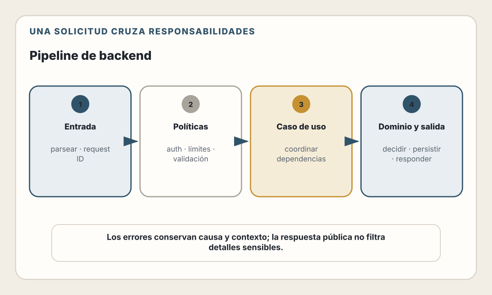

# 16. Arquitectura Backend

> "El backend es donde la magia sucede y donde los problemas se esconden."

---

## Objetivos de Aprendizaje

Al finalizar este capítulo, serás capaz de:

- Diseñar una arquitectura backend en capas clara y mantenible
- Implementar el patrón Controller-Service-Repository
- Aplicar inyección de dependencias para código fácil de probar
- Manejar errores de forma consistente y útil
- Implementar logging estructurado para observabilidad

## Alcance

Este capítulo aplica límites y dependencias al runtime del backend: entrada,
casos de uso, acceso a infraestructura, errores y señales operativas. El
capítulo 11 explica los patrones arquitectónicos; el 12 define contratos; el 13
modela datos; y el 19 profundiza en persistencia. Los ejemplos de capas aquí no
pretenden redefinir esos temas.

---

## Del patrón arquitectónico al runtime

El capítulo 11 ya presenta separación de responsabilidades, capas e inversión
de dependencias. En un backend, esas ideas se vuelven útiles cuando permiten
seguir una petición sin mezclar el protocolo HTTP, el caso de uso y la
infraestructura.

El recorrido mínimo es:

1. **Adaptador de entrada:** traduce HTTP a una llamada de aplicación y convierte
   el resultado en una respuesta.
2. **Caso de uso:** aplica políticas del negocio y coordina colaboradores.
3. **Puerto:** declara la capacidad que necesita el caso de uso.
4. **Adaptador de salida:** implementa esa capacidad con PostgreSQL, correo u
   otro servicio.
5. **Raíz de composición:** crea implementaciones y conecta dependencias al
   iniciar el proceso.

| Pieza | Puede conocer | No debería conocer |
|---|---|---|
| Controlador | HTTP, validación de forma, caso de uso | SQL, detalles del proveedor de correo |
| Caso de uso | Reglas, entidades y puertos | `req`, `res`, driver de base de datos |
| Repositorio | Consultas y mapeo de persistencia | Códigos de estado HTTP |
| Raíz de composición | Implementaciones y configuración | Reglas del negocio |

<picture>
  <source media="(max-width: 820px)" srcset="../assets/diagrams/cap16-pipeline-backend-mobile.svg">
  
</picture>

### Un corte vertical completo

El ejemplo omite validación exhaustiva y persistencia real para mostrar los
límites. La interfaz pertenece al consumidor: el caso de uso declara solo la
capacidad que necesita.

```typescript
interface UserRecord {
  id: string;
  email: string;
}

interface UserRepository {
  findByEmail(email: string): Promise<UserRecord | null>;
  create(input: { email: string; passwordHash: string }): Promise<UserRecord>;
}

interface PasswordHasher {
  hash(password: string): Promise<string>;
}

class RegisterUser {
  constructor(
    private readonly users: UserRepository,
    private readonly passwords: PasswordHasher,
  ) {}

  async execute(input: { email: string; password: string }): Promise<UserRecord> {
    const email = input.email.trim().toLowerCase();

    if (await this.users.findByEmail(email)) {
      throw new ConflictError("La cuenta ya existe");
    }

    const passwordHash = await this.passwords.hash(input.password);
    return this.users.create({ email, passwordHash });
  }
}
```

El adaptador HTTP conserva las decisiones propias del protocolo:

```typescript
function registerUserController(registerUser: RegisterUser) {
  return async (req, res, next) => {
    try {
      const user = await registerUser.execute(req.body);
      res.status(201).json({ id: user.id, email: user.email });
    } catch (error) {
      next(error);
    }
  };
}
```

La raíz de composición es el único lugar que elige las implementaciones:

```typescript
const userRepository = new PostgresUserRepository(pool);
const passwordHasher = new ArgonPasswordHasher(passwordConfig);
const registerUser = new RegisterUser(userRepository, passwordHasher);

app.post("/users", registerUserController(registerUser));
```

Esto es inyección de dependencias sin un contenedor. Un contenedor puede reducir
código repetitivo en un sistema grande, pero también vuelve implícita la
construcción. Empieza con composición manual y adopta una herramienta cuando la
cantidad de objetos o ciclos de vida lo justifique.

### Límites que deben sobrevivir al framework

- El caso de uso se prueba sin servidor HTTP ni base de datos real.
- Cambiar el driver de persistencia no modifica reglas de negocio.
- Los errores del dominio no contienen códigos HTTP; una capa externa los
  traduce.
- Una transacción abarca el caso de uso que protege la invariante, no llamadas
  arbitrarias del controlador.
- La configuración se valida al arrancar y se entrega como dependencia; no se
  consulta el entorno desde cualquier módulo.

No todo endpoint necesita cuatro archivos. Una lectura simple puede atravesar
menos capas si conserva autorización, observabilidad y un lugar claro para la
consulta. El objetivo es que la estructura haga visibles los cambios y riesgos,
no cumplir una plantilla.
## Manejo de Errores

Un buen sistema de errores distingue entre diferentes tipos de problemas y comunica información útil.

### Tipos de errores

```typescript
// errors/AppError.ts
export abstract class AppError extends Error {
  abstract readonly statusCode: number;
  abstract readonly isOperational: boolean;

  constructor(message: string) {
    super(message);
    this.name = this.constructor.name;
    Error.captureStackTrace(this, this.constructor);
  }
}

// Errores de cliente (4xx) - errores operacionales esperados
export class ValidationError extends AppError {
  readonly statusCode = 400;
  readonly isOperational = true;

  constructor(message: string, public readonly field?: string) {
    super(message);
  }
}

export class NotFoundError extends AppError {
  readonly statusCode = 404;
  readonly isOperational = true;

  constructor(resource: string, id: string) {
    super(`${resource} con id ${id} no encontrado`);
  }
}

export class UnauthorizedError extends AppError {
  readonly statusCode = 401;
  readonly isOperational = true;

  constructor(message = 'No autorizado') {
    super(message);
  }
}

export class ConflictError extends AppError {
  readonly statusCode = 409;
  readonly isOperational = true;

  constructor(message: string) {
    super(message);
  }
}

// Errores específicos del dominio
export class UserAlreadyExistsError extends ConflictError {
  constructor() {
    super('Ya existe una cuenta con ese identificador');
  }
}
```

### Middleware de manejo de errores

```typescript
// middleware/errorHandler.ts
import { Request, Response, NextFunction } from 'express';
import { AppError } from '../errors/AppError';
import { logger } from '../utils/logger';

export function errorHandler(
  error: Error,
  req: Request,
  res: Response,
  next: NextFunction
) {
  if (res.headersSent) {
    return next(error);
  }

  // Si es un error conocido (operacional)
  if (error instanceof AppError) {
    // Registrar con el nivel apropiado
    if (error.statusCode >= 500) {
      logger.error('Error del servidor', {
        error: error.message,
        stack: error.stack,
        requestId: req.id
      });
    } else {
      logger.warn('Error de cliente', {
        error: error.message,
        statusCode: error.statusCode,
        requestId: req.id
      });
    }

    return res.status(error.statusCode).json({
      error: {
        code: error.name,
        message: error.message,
        ...(error instanceof ValidationError && error.field && { field: error.field })
      }
    });
  }

  // Error no esperado (bug, error de programación)
  logger.error('Error no manejado', {
    error: error.message,
    stack: error.stack,
    requestId: req.id
  });

  // En producción, no exponer detalles internos
  const message = process.env.NODE_ENV === 'production'
    ? 'Error interno del servidor'
    : error.message;

  res.status(500).json({
    error: {
      code: 'INTERNAL_ERROR',
      message
    }
  });
}
```

### Errores asíncronos

**Express 5** reenvía automáticamente al middleware de errores las excepciones
de handlers `async` y las promesas devueltas que se rechazan:

```typescript
app.get('/users/:id', async (req, res) => {
  const user = await userService.findById(req.params.id);
  res.json(user);
});
```

En Express 4 se necesita un wrapper como `asyncHandler` o un `try/catch` que
llame a `next(error)`. Ni Express 4 ni Express 5 pueden capturar trabajo que el
handler inicia pero no devuelve ni espera. Una promesa «desprendida», un
callback tardío o un error después de comenzar la respuesta requieren manejo
explícito. El middleware final debe delegar con `next(error)` cuando
`res.headersSent` ya sea verdadero.

### Formato consistente de respuestas de error

```typescript
// Respuestas exitosas
{
  "data": { ... },
  "meta": { "page": 1, "total": 100 }
}

// Respuestas de error
{
  "error": {
    "code": "VALIDATION_ERROR",
    "message": "El email no es válido",
    "field": "email",
    "details": [
      { "field": "email", "message": "Debe ser un email válido" },
      { "field": "password", "message": "Debe tener mínimo 8 caracteres" }
    ]
  }
}
```

---

## Logging Estructurado

El logging es fundamental para entender qué pasa en producción. Pero no cualquier logging — necesitas **logging estructurado**.

### El problema del logging tradicional

```javascript
// ❌ Logs como strings — difíciles de procesar
console.log('Usuario creado: ' + userId + ' por IP ' + ip);
console.log('Error al procesar pedido ' + orderId + ': ' + error.message);

// En producción, esto se vuelve imposible de analizar:
// "Usuario creado: 123 por IP 192.168.1.1"
// "Error al procesar pedido 456: Connection refused"
```

### Logging estructurado con JSON

```typescript
// ✅ Logs estructurados — fáciles de procesar, filtrar, analizar
logger.info('Usuario creado', {
  userId: '123',
  ip: '192.168.1.1',
  duration: 45
});

// Salida:
// {"level":"info","message":"Usuario creado","userId":"123","ip":"192.168.1.1","duration":45,"timestamp":"2025-01-02T12:00:00Z"}
```

### Configuración con Winston o Pino (Node.js)

En Node.js hay dos opciones principales:
- **Winston**: Más flexible, múltiples transportes, ideal para aplicaciones complejas
- **Pino**: Hasta 5x más rápido, ideal para APIs de alto tráfico y microservicios

**Con Winston** (flexibilidad):

```typescript
// utils/logger.ts
import winston from 'winston';

const logger = winston.createLogger({
  level: process.env.LOG_LEVEL || 'info',
  format: winston.format.combine(
    winston.format.timestamp(),
    winston.format.errors({ stack: true }),
    winston.format.json()
  ),
  defaultMeta: {
    service: 'user-service',
    version: process.env.APP_VERSION
  },
  transports: [
    new winston.transports.Console({
      format: process.env.NODE_ENV === 'development'
        ? winston.format.combine(
            winston.format.colorize(),
            winston.format.simple()
          )
        : winston.format.json()
    })
  ]
});

export { logger };
```

**Con Pino** (performance):

```typescript
// utils/logger.ts
import pino from 'pino';

const logger = pino({
  level: process.env.LOG_LEVEL || 'info',
  base: {
    service: 'user-service',
    version: process.env.APP_VERSION
  },
  transport: process.env.NODE_ENV === 'development'
    ? { target: 'pino-pretty' }
    : undefined
});

export { logger };
```

> 💡 **Tip**: Si tu aplicación maneja alto tráfico (>1000 req/s), considera Pino. Para aplicaciones típicas con necesidades de logging complejas (múltiples destinos, formatos), Winston es suficiente.

### Configuración con structlog (Python)

```python
# utils/logger.py
import structlog
import logging

structlog.configure(
    processors=[
        structlog.stdlib.filter_by_level,
        structlog.stdlib.add_logger_name,
        structlog.stdlib.add_log_level,
        structlog.stdlib.PositionalArgumentsFormatter(),
        structlog.processors.TimeStamper(fmt="iso"),
        structlog.processors.StackInfoRenderer(),
        structlog.processors.format_exc_info,
        structlog.processors.UnicodeDecoder(),
        structlog.processors.JSONRenderer()
    ],
    wrapper_class=structlog.stdlib.BoundLogger,
    context_class=dict,
    logger_factory=structlog.stdlib.LoggerFactory(),
    cache_logger_on_first_use=True,
)

logger = structlog.get_logger()
```

### Niveles de log apropiados

| Nivel | Cuándo usarlo | Ejemplo |
|-------|---------------|---------|
| **ERROR** | Algo falló y requiere atención | Error de conexión a DB, excepción no manejada |
| **WARN** | Algo inesperado pero no crítico | Rate limit casi alcanzado, retry exitoso |
| **INFO** | Eventos importantes de negocio | Usuario creado, pedido completado |
| **DEBUG** | Detalles para desarrollo | Query SQL ejecutada, valores de variables |

### Context y Request ID

Para correlacionar logs de un mismo request:

```typescript
// middleware/requestId.ts
import { v4 as uuid } from 'uuid';
import { AsyncLocalStorage } from 'async_hooks';

export const asyncLocalStorage = new AsyncLocalStorage<{ requestId: string }>();

export function requestIdMiddleware(req: Request, res: Response, next: NextFunction) {
  const requestId = req.headers['x-request-id'] as string || uuid();
  req.id = requestId;
  res.setHeader('x-request-id', requestId);

  asyncLocalStorage.run({ requestId }, () => {
    next();
  });
}

// logger con contexto automático
export function getLogger() {
  const store = asyncLocalStorage.getStore();
  return logger.child({ requestId: store?.requestId });
}
```

### Qué registrar y qué no

**✅ Registrar:**
- Inicio y fin de operaciones importantes
- Errores con contexto suficiente para depurar
- Métricas de performance (duración de queries, latencia de APIs)
- Eventos de seguridad (login, cambio de password, acceso denegado)

**❌ No registrar:**
- Contraseñas ni sus hashes
- Tokens de sesión o API keys
- Datos personales sensibles (PII) sin enmascarar
- Información de tarjetas de crédito
- Datos de salud

```typescript
// Enmascarar datos sensibles
logger.info('Pago procesado', {
  userId: user.id,
  amount: payment.amount,
  cardLast4: payment.card.slice(-4),  // Solo últimos 4 dígitos
  email: maskEmail(user.email)         // j***@example.com
});
```

---

## Middleware y Pipelines

Los middlewares permiten procesar requests de forma modular:

```typescript
// Orden de middlewares (importa!)
app.use(requestIdMiddleware);        // 1. Asignar ID a cada request
app.use(express.json());             // 2. Parsear body JSON
app.use(rateLimitMiddleware);        // 3. Rate limiting
app.use(authMiddleware);             // 4. Autenticación
app.use(loggerMiddleware);           // 5. Logging de requests

// Rutas
app.use('/api/users', userRoutes);
app.use('/api/orders', orderRoutes);

// Middleware de errores (siempre al final)
app.use(notFoundHandler);            // 6. 404 para rutas no encontradas
app.use(errorHandler);               // 7. Manejo centralizado de errores
```

### Middleware de logging

```typescript
// middleware/requestLogger.ts
export function requestLogger(req: Request, res: Response, next: NextFunction) {
  const start = Date.now();

  res.on('finish', () => {
    const duration = Date.now() - start;

    logger.info('Request completado', {
      method: req.method,
      path: req.path,
      statusCode: res.statusCode,
      duration,
      userAgent: req.get('user-agent'),
      ip: req.ip
    });
  });

  next();
}
```

---

## 🤖 Usando IA para Desarrollo Backend

La IA puede acelerar significativamente el desarrollo backend, especialmente en tareas repetitivas y boilerplate.

### Generación de código estructurado

```
Prompt efectivo:
"Genera un módulo completo para gestión de productos:

- Entity: Product con id, name, price, categoryId, stock
- DTO: CreateProductDto, UpdateProductDto
- Repository interface y implementación PostgreSQL
- Service con validaciones de negocio
- Controller con endpoints REST

Usa TypeScript, el patrón que te mostré arriba,
y manejo de errores con clases personalizadas."
```

La IA genera todo el boilerplate manteniendo consistencia.

### Casos de uso principales

**1. Generar repositories**

```
Prompt:
"Dado este schema de Prisma:
model Order {
  id        String   @id @default(uuid())
  userId    String
  status    OrderStatus
  total     Decimal
  items     OrderItem[]
  createdAt DateTime @default(now())
}

Genera el repository con:
- Métodos CRUD básicos
- findByUserId con paginación
- updateStatus con validación de transiciones
- Cálculo de totales"
```

**2. Diseñar manejo de errores**

```
Prompt:
"Para un sistema de e-commerce, diseña la jerarquía de errores:
- Errores de validación
- Errores de autenticación/autorización
- Errores de negocio (stock insuficiente, etc.)
- Errores de integración (pasarela de pago)

Incluye códigos de error únicos y mensajes claros."
```

**3. Configurar logging**

```
Prompt:
"Configura Winston para un proyecto Node.js con:
- Diferentes formatos para dev y prod
- Rotación de archivos
- Integración con Datadog
- Enmascarado automático de campos sensibles"
```

### Herramientas

| Herramienta | Uso para backend |
|-------------|------------------|
| **GitHub Copilot** | Autocompletado de métodos, queries SQL |
| **Cursor** | Refactoring de clases completas |
| **Claude** | Diseño de arquitectura, code review |
| **Amazon Q** | Integración con AWS services |

### Limitaciones

| ❌ Cuidado con... | ✅ Usa IA para... |
|-------------------|-------------------|
| Lógica de negocio sin contexto | Boilerplate y estructura repetitiva |
| Queries SQL complejas sin verificar | Generar queries simples, luego optimizar |
| Configuración de seguridad | Generar base, luego auditar |
| Código de producción sin review | Prototipos rápidos y pruebas de concepto |

> 🤖 **Nota**: La IA es excelente para generar la estructura de capas y boilerplate, pero la **lógica de negocio crítica** y las **decisiones de arquitectura** requieren tu criterio. Siempre revisa el código generado, especialmente queries SQL y manejo de errores.

---

## Resumen

### Arquitectura en capas
- **Controller**: Punto de entrada HTTP, extrae datos, delega al service
- **Service**: Lógica de negocio, orquesta repositories, aplica reglas
- **Repository**: Abstracción sobre almacenamiento, implementa acceso a datos

### Inyección de dependencias
- Las clases reciben sus dependencias, no las crean
- Permite probar con dobles y cambiar implementaciones fácilmente
- Usa DI manual para proyectos pequeños, contenedores para grandes

### Errores
- Diferencia entre errores operacionales (esperados) y de programación
- Usa clases de error personalizadas con status codes
- Centraliza el manejo en un middleware

### Observabilidad mediante logs
- Usa JSON, no strings concatenados
- Incluye contexto: requestId, userId, timestamps
- Niveles apropiados: ERROR, WARN, INFO, DEBUG
- Nunca registrar datos sensibles

---

## Ejercicios

1. **Refactoring a capas**: Toma un endpoint que tenga todo mezclado (HTTP + lógica + SQL) y refactorízalo en Controller + Service + Repository. ¿Cuántas líneas tiene cada capa?

2. **Inyección de dependencias**: modifica tu servicio para recibir el
   repositorio por el constructor. Escribe una prueba con un repositorio falso
   que devuelva datos prefijados.

3. **Sistema de errores**: Diseña 5 clases de error personalizadas para tu dominio. Implementa el middleware de manejo de errores que formatee respuestas consistentes.

4. **Logging**: Configura Winston o Pino con formato JSON. Agrega logging a un endpoint completo (inicio, operaciones intermedias, fin, errores). Verifica que los logs sean parseables.

---

## Referencias

- Goldberger, Y. *Node.js Best Practices*. https://github.com/goldbergyoni/nodebestpractices — Catálogo comunitario de prácticas
- Martin, R. C. (2017). *Clean Architecture*. — Principios de arquitectura por capas
- NestJS Documentation. *Dependency Injection*. https://docs.nestjs.com/providers — Implementación de DI en Node.js
- Express. *Error handling*. https://expressjs.com/en/guide/error-handling.html
- Express. *Migrating to Express 5*. https://expressjs.com/en/guide/migrating-5.html
- Pino. *Documentation*. https://getpino.io/#/docs/api
- Winston. *Documentation and source*. https://github.com/winstonjs/winston
- OpenTelemetry. *Logging specification*. https://opentelemetry.io/docs/specs/otel/logs/

---

**Anterior**: [Arquitectura Frontend](./15-arquitectura-frontend.md) | **Siguiente**: [Autenticación y Autorización](./17-autenticacion-autorizacion.md)
