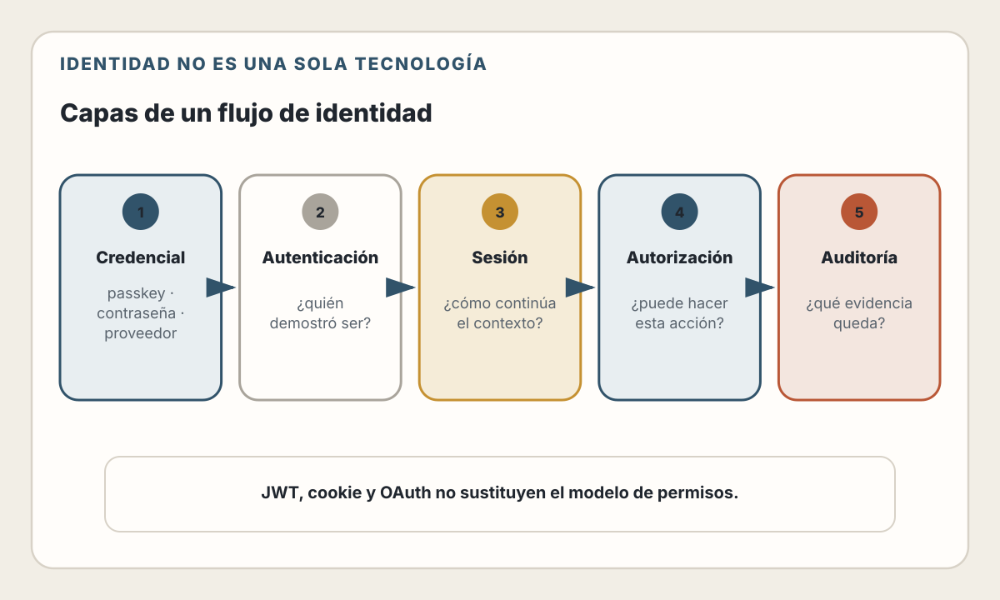
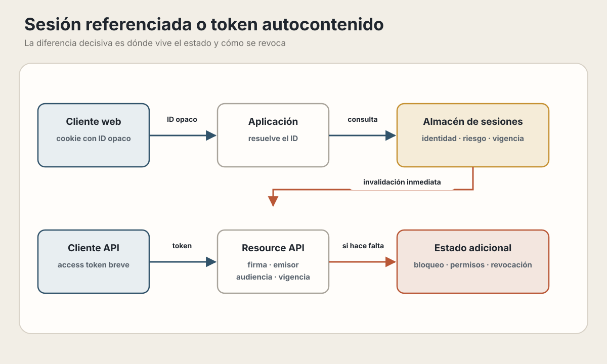
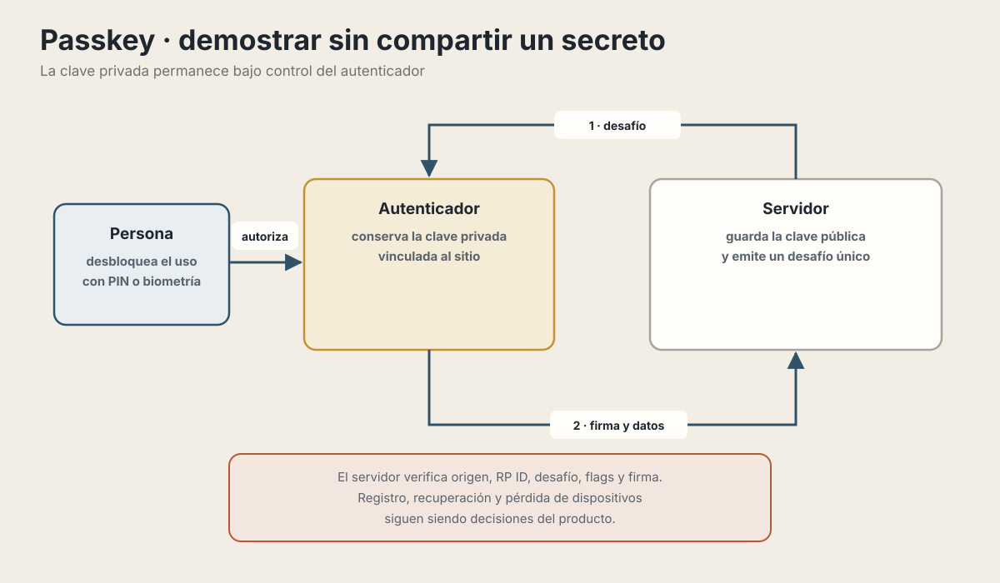
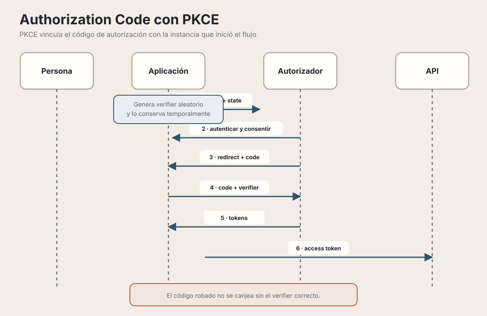
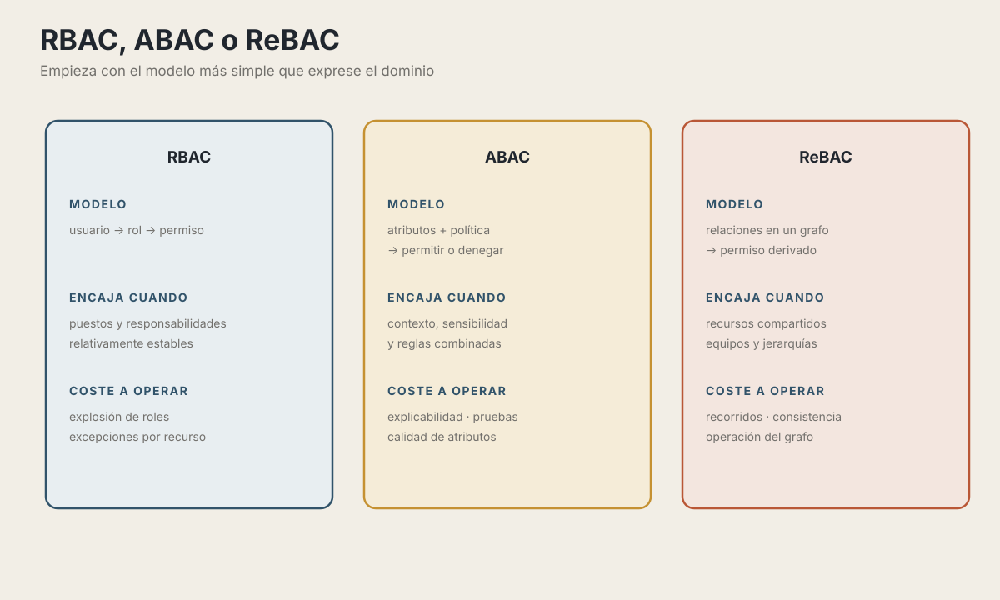

# 17. Autenticación y Autorización

> "La autenticación responde '¿quién eres?', la autorización responde '¿qué puedes hacer?'. Confundirlas es el origen de innumerables vulnerabilidades."

---

## Objetivos de Aprendizaje

Al finalizar este capítulo, serás capaz de:

- distinguir identidad, credencial, autenticación, sesión y autorización;
- elegir entre sesiones y tokens según el cliente y el modelo de revocación;
- almacenar contraseñas y aplicar OAuth, OpenID Connect y WebAuthn con criterios
  actuales;
- expresar permisos mediante RBAC, ABAC o ReBAC sin introducir complejidad
  innecesaria;
- revisar un flujo de acceso mediante defensa en profundidad.

## Modelo mental

La identidad es un dato del dominio; una credencial aporta evidencia sobre esa
identidad; una sesión conserva el resultado de autenticación; y una política
decide si esa identidad puede realizar una acción sobre un recurso. Cada capa
puede fallar o cambiar de forma independiente.

<picture>
  <source media="(max-width: 820px)" srcset="../assets/diagrams/cap17-flujos-identidad-mobile.svg">
  
</picture>

## Ruta de lectura y alcance

Para una aplicación web convencional, sigue sesiones y cookies → contraseñas o
passkeys → autorización → controles de abuso. OAuth y OpenID Connect se vuelven
centrales cuando intervienen proveedores de identidad o terceros.

Este capítulo se limita a identidad y control de acceso. El capítulo 5 explica
el modelo de seguridad del navegador; el 13 protege invariantes de datos; y el
capítulo 26 reunirá amenazas transversales, supply chain, secretos y respuesta a
incidentes.

---

## La Diferencia Fundamental

Antes de profundizar en implementaciones, debemos tener absolutamente clara la distinción entre estos dos conceptos:

| Concepto | Pregunta | Ejemplos |
|---|---|---|
| Autenticación (`AuthN`) | ¿Quién demostró ser esta persona o sistema? | Contraseña, passkey, proveedor de identidad |
| Autorización (`AuthZ`) | ¿Puede realizar esta acción sobre este recurso? | Roles, atributos, relaciones y políticas |

Autenticarse como Juan no implica poder eliminar usuarios. Esa decisión debe
evaluarse para la acción y el recurso concretos.

### La Analogía del Hotel

Imagina un hotel:

1. **Autenticación**: En recepción verifican tu identidad con tu documento y te dan una tarjeta-llave. Han confirmado *quién eres*.

2. **Autorización**: Tu tarjeta-llave solo abre *tu* habitación, el gimnasio (si pagaste ese servicio), y el estacionamiento (si tienes auto registrado). No abre otras habitaciones ni áreas de servicio. Han definido *qué puedes acceder*.

Un error común es pensar que "si está autenticado, puede hacer todo". Un usuario autenticado solo ha probado su identidad; sus permisos son una capa completamente separada.

---

## Estrategias de Autenticación

### Sesiones, cookies y tokens: conceptos diferentes

Una **sesión** es estado de autenticación mantenido por el sistema. El cliente
suele portar un identificador opaco que apunta a ese estado. Una **cookie** es
un mecanismo del navegador para transportar datos en peticiones; puede
transportar un identificador de sesión o un token autocontenido. Un **JWT** es
un formato de token firmado, no un reemplazo automático de las sesiones.

La decisión importante es cuánto estado y cuánta verificación conserva el
servidor. El mecanismo de transporte —cookie o header `Authorization`— es otra
decisión, condicionada por el tipo de cliente y el modelo de amenazas.

| Aspecto | Sesión referenciada por cookie | Token autocontenido |
|---|---|---|
| Estado principal | El servidor conserva la sesión | El token firmado lleva claims verificables |
| Cada solicitud | El navegador envía la cookie y el servidor resuelve la sesión | El cliente envía el token y el servidor valida firma, vigencia y audiencia |
| Revocación | Directa al invalidar la sesión | Requiere tokens breves, rotación o estado adicional |
| Operación | Exige un almacén de sesiones disponible | Exige manejo de claves y límites estrictos para los claims |
| Riesgo frecuente | Cookies sin protección CSRF o almacén frágil | Suponer que «firmado» significa secreto o irrevocable |

Ninguna opción elimina la autorización ni vuelve innecesario consultar estado
cuando una regla depende de datos actuales, como una cuenta bloqueada.

<picture>
  <source media="(max-width: 820px)" srcset="../assets/diagrams/cap17-sesion-token-revocacion-mobile.svg">
  
</picture>

### 💡 Desde el Punto de Vista del Usuario

Para entender mejor la diferencia, veamos qué experimenta el usuario en cada caso:

#### Escenario 1: Login en una Aplicación Web Tradicional (Sessions)

1. María inicia sesión y el servidor crea un registro asociado a un
   identificador aleatorio enviado en una cookie protegida.
2. En cada solicitud, el navegador envía la cookie y el servidor recupera la
   sesión para conocer su identidad y contexto.
3. Si María elige «cerrar todas las sesiones», el servidor invalida sus
   registros activos.
4. Una cookie robada deja de servir porque ya no apunta a una sesión válida.

**Lo que María experimenta:** Control inmediato. Cuando cierra sesiones, el efecto es instantáneo en todos los dispositivos.

#### Escenario 2: Login en una App Móvil Moderna (Tokens)

1. Carlos inicia sesión y recibe un token de acceso breve con emisor,
   audiencia, identidad y expiración.
2. La aplicación presenta el token en cada solicitud y el servidor valida sus
   propiedades criptográficas y semánticas.
3. Si Carlos pierde el teléfono, bloquear la cuenta no modifica por arte de
   magia un token ya emitido.
4. Las acciones críticas deben comprobar el estado vigente de la cuenta o un
   mecanismo de revocación; al expirar, el token deja de aceptarse.

**Lo que Carlos experimenta:** verificar la firma evita una consulta para
validar el token, pero la aplicación todavía puede consultar estado para
comprobar bloqueo, permisos, riesgo o revocación. El rendimiento debe medirse;
no se deduce únicamente del formato del token.

#### Escenario 3: Comparación Directa - Múltiples Dispositivos

Si el plan de Laura permite dos reproducciones simultáneas, la decisión depende
de estado actual: qué dispositivos están reproduciendo ahora. Una sesión
central facilita ese control, pero un token no lo impide ni lo resuelve. Incluso
con tokens, el servicio puede consultar o mantener presencia activa. El diseño
se elige por la regla del negocio, no por la etiqueta «stateful» o «stateless».

#### Escenario 4: ¿Qué pasa si el servidor se reinicia?

Un reinicio elimina las sesiones guardadas solo en la memoria de ese proceso.
Las sesiones almacenadas en un servicio compartido pueden sobrevivir, igual que
los tokens que todavía sean válidos. La continuidad también depende de que las
claves, la configuración y los almacenes requeridos estén disponibles tras el
reinicio.

#### Escenario 5: La aplicación funciona offline

Pedro usa una aplicación de notas durante un vuelo sin conexión. La aplicación:

1. detecta que no puede consultar al servidor;
2. aplica su política de acceso local;
3. permite editar únicamente los datos disponibles y las operaciones admitidas;
4. conserva los cambios pendientes para sincronizarlos después.

El acceso offline no depende necesariamente de JWT. Depende de cómo la
aplicación protege el almacenamiento local, autentica al usuario en el
dispositivo, resuelve conflictos y limita operaciones que requieren una
autorización fresca del servidor. Un token válido offline tampoco prueba que la
cuenta no haya sido revocada desde otro dispositivo.

### ⚠️ ¿Cuándo Usar Cada Uno?

| Necesidad | Opción que conviene evaluar | Pregunta de verificación |
|-----------|-----------------------------|--------------------------|
| Aplicación web propia | Sesión opaca en cookie | ¿Necesitas revocación simple y control del navegador? |
| API para clientes externos | Access token con alcance y audiencia | ¿Cómo emitirás, rotarás y revocarás credenciales? |
| Aplicación móvil | Token en almacenamiento seguro del sistema | ¿Qué operaciones requieren autorización online reciente? |
| Comunicación entre servicios | Tokens breves y específicos por audiencia | ¿Cómo rotarás claves y limitarás privilegios? |
| Riesgo elevado | Estado de sesión más señales y reautenticación | ¿Qué eventos invalidan o elevan la sesión? |

### 🛠️ JWT (JSON Web Tokens) en Profundidad

Un JWT consta de tres partes separadas por puntos:

```
eyJhbGciOiJIUzI1NiIsInR5cCI6IkpXVCJ9.    <- Header (algoritmo)
eyJzdWIiOiIxMjM0NTY3ODkwIiwibmFtZSI6...  <- Payload (datos)
SflKxwRJSMeKKF2QT4fwpMeJf36POk6yJV...    <- Signature (firma)
```

```typescript
// Estructura decodificada
{
  // Header
  "alg": "ES256",      // Algoritmo de firma
  "typ": "JWT"
}

{
  // Payload (Claims)
  "sub": "user_123",           // Subject: ID del usuario
  "iat": 1704067200,           // Issued At: cuándo se emitió
  "exp": 1704068100,           // Expiration: cuándo expira
  "iss": "https://auth.app",   // Issuer: quién lo emitió
  "aud": "https://api.app",    // Audience: para quién es

  // Claims personalizados
  "role": "editor",
  "permissions": ["read", "write"]
}
```

#### ⚠️ Mejores Prácticas de JWT

Basado en [RFC 8725](https://datatracker.ietf.org/doc/html/rfc8725) y recomendaciones actuales:

```typescript
import jwt from 'jsonwebtoken';

// Ejemplo conceptual: las claves se cargan desde un gestor seguro.
const jwtConfig = {
  // Elige un algoritmo admitido explícitamente por emisor y receptor.
  algorithm: 'ES256',

  // Duración de ejemplo; ajústala al riesgo y al flujo de renovación.
  expiresIn: '15m',

  // 3. Especificar issuer y audience
  issuer: 'https://auth.myapp.com',
  audience: 'https://api.myapp.com',
};

// Generar token
function generateAccessToken(user: User): string {
  const payload = {
    sub: user.id,
    email: user.email,
    role: user.role,
    // ❌ NUNCA incluir datos sensibles
    // password: user.password  <- NUNCA
    // ssn: user.ssn            <- NUNCA
  };

  return jwt.sign(payload, privateKey, jwtConfig);
}

// Verificar token
function verifyToken(token: string): JwtPayload {
  return jwt.verify(token, publicKey, {
    // ✅ Whitelist de algoritmos permitidos
    algorithms: ['ES256'],  // NUNCA usar 'none' o permitir todos

    // ✅ Validar issuer y audience
    issuer: 'https://auth.myapp.com',
    audience: 'https://api.myapp.com',

    // Limita además la edad del token.
    maxAge: '15m',
  });
}
```

No existe un algoritmo universalmente “mejor” ni una duración máxima de quince
minutos aplicable a todos los sistemas. El emisor y el receptor deben acordar
algoritmo, claves, audiencia, duración y rotación. La verificación debe rechazar
algoritmos no permitidos y validar los claims requeridos por el protocolo.

#### Almacenamiento Seguro de Tokens

```typescript
// Una opción habitual para aplicaciones web: cookie HttpOnly
res.cookie('access_token', token, {
  httpOnly: true,      // JavaScript no puede leer el valor de la cookie
  secure: true,        // Solo HTTPS
  sameSite: 'lax',     // Mitiga muchos envíos cross-site; no reemplaza CSRF
  maxAge: 15 * 60 * 1000,  // 15 minutos
  path: '/api',        // Solo se envía a rutas /api
});

// ⚠️ ACEPTABLE: Memoria (para SPAs)
// Se pierde al refrescar la página
class TokenStore {
  private accessToken: string | null = null;

  setToken(token: string) {
    this.accessToken = token;
  }

  getToken(): string | null {
    return this.accessToken;
  }
}

// ❌ EVITAR: localStorage
// Vulnerable a XSS - cualquier script puede leerlo
localStorage.setItem('token', token);  // NO RECOMENDADO
```

`HttpOnly` reduce el robo directo del token mediante JavaScript, pero un XSS
todavía puede realizar acciones desde el origen del usuario. `SameSite` agrega
una defensa frente a ciertos escenarios CSRF, con diferencias funcionales
entre `Strict`, `Lax` y `None`; las operaciones sensibles todavía necesitan una
estrategia CSRF acorde con la arquitectura.

#### Patrón de Refresh Tokens

```typescript
// Access Token: corta duración, lleva la información
// Refresh Token: larga duración, solo sirve para obtener nuevos access tokens

interface TokenPair {
  accessToken: string;   // Expira en 15 minutos
  refreshToken: string;  // Expira en 7 días
}

async function login(credentials: Credentials): Promise<TokenPair> {
  const user = await validateCredentials(credentials);

  const accessToken = generateAccessToken(user);  // 15 min
  const refreshToken = generateRefreshToken(user); // 7 días

  // Guardar un digest del refresh token, no el secreto reutilizable.
  await saveRefreshTokenDigest(user.id, digestToken(refreshToken));

  return { accessToken, refreshToken };
}

async function refresh(refreshToken: string): Promise<TokenPair> {
  // Verificar que el refresh token es válido
  const payload = verifyRefreshToken(refreshToken);

  // Verificar que no ha sido revocado
  const isValid = await isRefreshTokenValid(
    payload.sub,
    digestToken(refreshToken)
  );
  if (!isValid) {
    throw new UnauthorizedError('Refresh token revocado');
  }

  // Rotación de refresh token (buena práctica de seguridad)
  await revokeRefreshToken(digestToken(refreshToken));

  const user = await getUserById(payload.sub);
  return issueTokenPair(user);
}

async function logout(userId: string, refreshToken: string): Promise<void> {
  // Revocar el refresh token
  await revokeRefreshToken(digestToken(refreshToken));

  // Opcionalmente, revocar todos los refresh tokens del usuario
  // await revokeAllRefreshTokens(userId);
}
```

La rotación debe ser atómica: consumir el refresh token anterior y registrar el
nuevo en una misma operación. Si un token ya consumido reaparece, trátalo como
posible reutilización y aplica la política de revocación definida para su
familia.

---

## Hashing de Contraseñas

Si tu aplicación permite autenticación con contraseñas, **nunca** almacenes contraseñas en texto plano. Usa algoritmos de hashing diseñados específicamente para contraseñas.

### Selección de algoritmos — verificada el 30 de julio de 2026

| Algoritmo | Recomendación | Cuándo usar |
|-----------|---------------|-------------|
| **Argon2id** | ✅ Preferido | Nuevos sistemas |
| **scrypt** | ✅ Bueno | Si Argon2 no está disponible |
| **bcrypt** | ⚠️ Aceptable | Sistemas legacy |
| **PBKDF2** | ⚠️ Solo FIPS | Requisitos de compliance |
| SHA-256/MD5 | ❌ Nunca | No usar para contraseñas |

### 🛠️ Implementación con Argon2id

```typescript
import argon2 from 'argon2';
import crypto from 'node:crypto';

// Perfil de ejemplo que supera el mínimo vigente de OWASP.
// Debe calibrarse con memoria, latencia y concurrencia reales.
const hashConfig = {
  type: argon2.argon2id,  // Variante híbrida (resistente a GPU y side-channel)
  memoryCost: 65536,      // 64 MB de memoria
  timeCost: 3,            // 3 iteraciones
  parallelism: 1,         // 1 hilo
  hashLength: 32,         // 32 bytes de salida
};

// Crear hash de contraseña
async function hashPassword(password: string): Promise<string> {
  return argon2.hash(password, hashConfig);
  // Resultado: $argon2id$v=19$m=65536,t=3,p=1$salt$hash
  // El salt se genera automáticamente y se incluye en el resultado
}

// Verificar contraseña
async function verifyPassword(password: string, hash: string): Promise<boolean> {
  try {
    return await argon2.verify(hash, password);
  } catch {
    return false;  // Hash inválido o error
  }
}

// Inicialización del servicio: generar una sola vez un hash válido con el
// mismo perfil de costo. No uses un string que solo "parezca" Argon2.
const DUMMY_PASSWORD_HASH = await hashPassword(
  crypto.randomBytes(32).toString('base64url')
);

// Ejemplo de uso
async function register(email: string, password: string) {
  // Validar fortaleza de contraseña primero
  if (!isStrongPassword(password)) {
    throw new Error('Contraseña muy débil');
  }

  const passwordHash = await hashPassword(password);

  await db.user.create({
    data: {
      email,
      passwordHash,  // NUNCA almacenar password, solo el hash
    },
  });
}

async function login(email: string, password: string) {
  const user = await db.user.findUnique({ where: { email } });

  // Se genera una vez al iniciar el servicio. Debe ser un hash Argon2 válido
  // con el mismo perfil que las contraseñas reales.
  const hashToVerify = user?.passwordHash ?? DUMMY_PASSWORD_HASH;

  const isValid = await verifyPassword(password, hashToVerify);

  if (!user || !isValid) {
    throw new Error('Credenciales inválidas');  // Mensaje genérico
  }

  return user;
}
```

OWASP publica mínimos, no números mágicos para todo hardware. Al desplegar,
mide consumo de memoria, latencia en percentiles altos y concurrencia; aumenta
el costo mientras el servicio conserve su presupuesto operativo. Mantén también
un mecanismo para rehash progresivo cuando cambie el perfil.

### bcrypt para Sistemas Legacy

```typescript
import bcrypt from 'bcrypt';

// Cada incremento duplica aproximadamente el trabajo.
// 12 es un punto de partida; mide en el hardware de producción.
const BCRYPT_ROUNDS = 12;

async function hashPasswordBcrypt(password: string): Promise<string> {
  // ⚠️ bcrypt tiene límite de 72 bytes
  if (Buffer.byteLength(password, 'utf8') > 72) {
    throw new Error('Contraseña muy larga para bcrypt');
  }

  return bcrypt.hash(password, BCRYPT_ROUNDS);
}

async function verifyPasswordBcrypt(password: string, hash: string): Promise<boolean> {
  return bcrypt.compare(password, hash);
}
```

### 💡 Pepper: Capa Adicional de Seguridad

```typescript
import { createHmac } from 'node:crypto';

// El pepper vive en un gestor de secretos separado de la base de datos.
const PEPPER = process.env.PASSWORD_PEPPER;
if (!PEPPER) throw new Error('PASSWORD_PEPPER no configurado');

async function hashWithPepper(password: string): Promise<string> {
  const pepperedPassword = createHmac('sha256', PEPPER)
    .update(password, 'utf8')
    .digest('base64url');

  return argon2.hash(pepperedPassword, hashConfig);
}

// La verificación debe aplicar el mismo HMAC antes de argon2.verify().
```

Un pepper agrega defensa en profundidad si la base de datos se compromete sin
el gestor de secretos. También introduce rotación y recuperación operativa:
perderlo inutiliza todas las contraseñas, y cambiarlo exige una estrategia
explícita.

---

## Autenticación Moderna: Passkeys y WebAuthn

Los **passkeys** permiten autenticar mediante credenciales criptográficas
vinculadas al sitio y resistentes al phishing. El soporte de plataforma es
amplio, pero la disponibilidad técnica no equivale a adopción por parte de tus
usuarios. Antes de implementarlos, diseña también registro, recuperación de
cuenta, pérdida de dispositivos, credenciales múltiples y convivencia temporal
con otros métodos.

<picture>
  <source media="(max-width: 820px)" srcset="../assets/diagrams/cap17-passkey-desafio-mobile.svg">
  
</picture>

La biometría o el PIN desbloquean localmente el uso de la credencial; no se
envían al servidor. WebAuthn Level 3 se encontraba como *Candidate
Recommendation Snapshot* de W3C el 26 de mayo de 2026, por lo que conviene
verificar la versión y la interoperabilidad del entorno objetivo.

### 🛠️ Implementando WebAuthn

> ⚠️ **Ejemplo conceptual**: WebAuthn exige validaciones criptográficas y de
> protocolo en el servidor que este fragmento omite. En producción, usa una
> biblioteca mantenida, conserva el challenge en el servidor y verifica como
> mínimo origen, RP ID, challenge, contador, flags y firma. No implementes el
> protocolo desde cero copiando este ejemplo.

```typescript
// Registro de passkey (simplificado)
// En el frontend
async function registerPasskey() {
  // 1. Obtener challenge del servidor
  const options = await fetch('/api/auth/webauthn/register-options', {
    method: 'POST',
  }).then(r => r.json());

  // 2. Crear credencial con el navegador
  const credential = await navigator.credentials.create({
    publicKey: {
      challenge: base64ToBuffer(options.challenge),
      rp: {
        name: 'Mi Aplicación',
        id: 'miapp.com',  // Vinculado al dominio
      },
      user: {
        id: base64ToBuffer(options.userId),
        name: options.userEmail,
        displayName: options.userName,
      },
      pubKeyCredParams: [
        { alg: -7, type: 'public-key' },   // ES256
        { alg: -257, type: 'public-key' }, // RS256
      ],
      authenticatorSelection: {
        authenticatorAttachment: 'platform',  // Dispositivo actual
        residentKey: 'required',
        userVerification: 'required',
      },
    },
  });

  // 3. Enviar credencial al servidor
  await fetch('/api/auth/webauthn/register', {
    method: 'POST',
    body: JSON.stringify({
      id: credential.id,
      rawId: bufferToBase64(credential.rawId),
      response: {
        clientDataJSON: bufferToBase64(credential.response.clientDataJSON),
        attestationObject: bufferToBase64(credential.response.attestationObject),
      },
    }),
  });
}

// Login con passkey
async function loginWithPasskey() {
  // 1. Obtener challenge
  const options = await fetch('/api/auth/webauthn/login-options').then(r => r.json());

  // 2. Obtener credencial (activa biometría)
  const credential = await navigator.credentials.get({
    publicKey: {
      challenge: base64ToBuffer(options.challenge),
      rpId: 'miapp.com',
      userVerification: 'required',
    },
  });

  // 3. Verificar en servidor
  const result = await fetch('/api/auth/webauthn/login', {
    method: 'POST',
    body: JSON.stringify({
      id: credential.id,
      rawId: bufferToBase64(credential.rawId),
      response: {
        clientDataJSON: bufferToBase64(credential.response.clientDataJSON),
        authenticatorData: bufferToBase64(credential.response.authenticatorData),
        signature: bufferToBase64(credential.response.signature),
      },
    }),
  }).then(r => r.json());

  return result;  // { accessToken, refreshToken }
}
```

---

## OAuth 2.1 y OpenID Connect

OAuth permite que una aplicación acceda a recursos de un usuario en otro servicio, **sin que el usuario comparta su contraseña**.

### La evolución: OAuth 2.0, su BCP de seguridad y OAuth 2.1

> **Estado del ecosistema — verificado el 3 de agosto de 2026.** OAuth 2.1
> continúa como Internet-Draft activo del IETF (revisión 15, publicada el 2 de
> marzo de 2026), no como estándar publicado. El borrador consolida prácticas
> de seguridad que ya pueden adoptarse, pero su contenido todavía puede
> cambiar. Para sistemas basados en OAuth 2.0, RFC 9700 es la referencia
> publicada de mejores prácticas de seguridad.

No compares una implementación actual únicamente con el RFC 6749 de 2012. La
práctica publicada cambió mediante RFC 9700, y el borrador de OAuth 2.1 pretende
consolidarla:

| Tema | Marco vigente para una implementación nueva |
|---|---|
| Authorization Code | Los clientes públicos deben usar PKCE; también se recomienda para clientes confidenciales |
| Implicit Grant | RFC 9700 recomienda no usarlo; el borrador de OAuth 2.1 lo omite |
| Password Grant | RFC 9700 indica que no debe utilizarse; el borrador lo omite |
| Redirect URI | Comparación exacta, salvo la excepción del puerto `localhost` para aplicaciones nativas |
| Access tokens | No exponerlos en URL; restringir audiencia y privilegios; evaluar *sender constraining* |
| Refresh tokens de clientes públicos | Rotación en cada uso o vínculo criptográfico con el emisor |

### El Flujo Authorization Code con PKCE

<picture>
  <source media="(max-width: 820px)" srcset="../assets/diagrams/cap17-oauth-pkce-mobile.svg">
  
</picture>

PKCE vincula el código con la instancia que inició el flujo. OpenID Connect
añade identidad y validación del `ID Token`; OAuth por sí solo delega acceso a
recursos. `state`, `nonce`, `iss` y PKCE no son intercambiables en todos los
despliegues: aplica las verificaciones requeridas por el protocolo y por la
cantidad de proveedores con los que interactúa el cliente.

### 🛠️ Implementación con PKCE

```typescript
function toBase64Url(bytes: ArrayBuffer | Uint8Array): string {
  const view = bytes instanceof Uint8Array ? bytes : new Uint8Array(bytes);
  const binary = String.fromCharCode(...view);
  return btoa(binary)
    .replaceAll('+', '-')
    .replaceAll('/', '_')
    .replace(/=+$/, '');
}

function randomBase64Url(byteLength: number): string {
  const bytes = crypto.getRandomValues(new Uint8Array(byteLength));
  return toBase64Url(bytes);
}

// Generar PKCE (en el cliente)
async function generatePKCE(): Promise<{
  verifier: string;
  challenge: string;
}> {
  // Code Verifier: string aleatorio de alta entropía
  const verifier = randomBase64Url(32);

  // Code Challenge: BASE64URL(SHA-256(verifier))
  const digest = await crypto.subtle.digest(
    'SHA-256',
    new TextEncoder().encode(verifier)
  );
  const challenge = toBase64Url(digest);

  return { verifier, challenge };
}

// Paso 1: Iniciar flujo OAuth
async function startOAuthFlow(): Promise<void> {
  const { verifier, challenge } = await generatePKCE();
  const state = randomBase64Url(16);

  // Guardar para validar después
  sessionStorage.setItem('oauth_verifier', verifier);
  sessionStorage.setItem('oauth_state', state);

  const params = new URLSearchParams({
    client_id: 'my_client_id',
    redirect_uri: 'https://myapp.com/callback',
    response_type: 'code',
    scope: 'openid profile email',
    state: state,
    code_challenge: challenge,
    code_challenge_method: 'S256',
  });

  window.location.href = `https://auth.provider.com/authorize?${params}`;
}

// Paso 2: Manejar callback
async function handleOAuthCallback(): Promise<TokenPair> {
  const params = new URLSearchParams(window.location.search);
  const code = params.get('code');
  const state = params.get('state');

  // Validar state para prevenir CSRF
  const savedState = sessionStorage.getItem('oauth_state');
  const verifier = sessionStorage.getItem('oauth_verifier');

  if (!code || !state || !savedState || !verifier || state !== savedState) {
    throw new Error('Invalid state - possible CSRF attack');
  }

  // Intercambiar code por tokens
  const response = await fetch('https://auth.provider.com/token', {
    method: 'POST',
    headers: { 'Content-Type': 'application/x-www-form-urlencoded' },
    body: new URLSearchParams({
      grant_type: 'authorization_code',
      client_id: 'my_client_id',
      code: code,
      redirect_uri: 'https://myapp.com/callback',
      code_verifier: verifier,  // PKCE: el servidor verifica el hash
    }),
  });

  // Limpiar datos temporales
  sessionStorage.removeItem('oauth_verifier');
  sessionStorage.removeItem('oauth_state');

  if (!response.ok) {
    throw new Error(`Token endpoint failed: ${response.status}`);
  }

  return response.json();
}
```

Este ejemplo representa un cliente público que usa Web Crypto en el navegador.
No incluye descubrimiento del proveedor, validación completa de OIDC ni manejo
de errores del callback. En una aplicación web con backend, un patrón BFF puede
realizar el canje y conservar los tokens fuera de JavaScript; elige la
arquitectura a partir del modelo de amenazas y del proveedor.

### OpenID Connect: Identidad sobre OAuth

OAuth fue diseñado para **autorización** (acceder a recursos), no para **autenticación** (verificar identidad). OpenID Connect (OIDC) añade una capa de identidad:

```typescript
// OAuth solo te da un access_token para acceder a recursos
// OIDC además te da un id_token con información del usuario

interface OIDCTokenResponse {
  access_token: string;   // Para acceder a APIs
  refresh_token: string;  // Para renovar
  id_token: string;       // JWT con identidad del usuario
  token_type: 'Bearer';
  expires_in: number;
}

// El id_token contiene claims estándar
interface IDTokenPayload {
  iss: string;        // Issuer
  sub: string;        // Subject (user ID único)
  aud: string;        // Audience (client ID)
  exp: number;        // Expiration
  iat: number;        // Issued at

  // Claims de identidad (con scope 'profile')
  name?: string;
  given_name?: string;
  family_name?: string;
  picture?: string;

  // Con scope 'email'
  email?: string;
  email_verified?: boolean;
}
```

---

## Modelos de Autorización

Una vez autenticado el usuario, ¿cómo determinamos qué puede hacer?

<picture>
  <source media="(max-width: 820px)" srcset="../assets/diagrams/cap17-modelos-autorizacion-mobile.svg">
  
</picture>

Los tres modelos deben negar por defecto, comprobar la acción sobre el recurso
concreto y producir evidencia suficiente para explicar una decisión. La
sofisticación del motor no corrige un modelo de dominio ambiguo.

### RBAC: Role-Based Access Control

En RBAC, los permisos se asignan a roles y los roles a usuarios. Funciona bien
cuando las responsabilidades son estables; se degrada cuando cada recurso o
excepción exige crear otro rol.

```typescript
// Definición de roles y permisos
const ROLES = {
  ADMIN: 'admin',
  EDITOR: 'editor',
  VIEWER: 'viewer',
} as const;

const PERMISSIONS = {
  CREATE_USER: 'create_user',
  DELETE_USER: 'delete_user',
  VIEW_REPORTS: 'view_reports',
  EDIT_CONFIG: 'edit_config',
  CREATE_ARTICLE: 'create_article',
  EDIT_ARTICLE: 'edit_article',
  VIEW_ARTICLE: 'view_article',
} as const;

const ROLE_PERMISSIONS: Record<string, string[]> = {
  [ROLES.ADMIN]: Object.values(PERMISSIONS),
  [ROLES.EDITOR]: [
    PERMISSIONS.CREATE_ARTICLE,
    PERMISSIONS.EDIT_ARTICLE,
    PERMISSIONS.VIEW_ARTICLE,
    PERMISSIONS.VIEW_REPORTS,
  ],
  [ROLES.VIEWER]: [
    PERMISSIONS.VIEW_ARTICLE,
    PERMISSIONS.VIEW_REPORTS,
  ],
};

// Middleware de autorización
function requirePermission(permission: string) {
  return (req: Request, res: Response, next: NextFunction) => {
    const userRole = req.user?.role;

    if (!userRole) {
      return res.status(401).json({ error: 'No autenticado' });
    }

    const permissions = ROLE_PERMISSIONS[userRole] || [];

    if (!permissions.includes(permission)) {
      return res.status(403).json({
        error: 'No autorizado',
        required: permission,
        userRole: userRole,
      });
    }

    next();
  };
}

// Uso
router.delete(
  '/users/:id',
  authenticate,
  requirePermission(PERMISSIONS.DELETE_USER),
  deleteUserHandler
);
```

### ABAC: Attribute-Based Access Control

ABAC evalúa atributos del sujeto, recurso, acción y contexto. Aporta
flexibilidad, pero exige atributos confiables, políticas testeables y una forma
de explicar por qué se permitió o denegó una operación.

```typescript
// Ejemplo: Solo el dueño puede editar, o un admin del mismo departamento

interface PolicyContext {
  user: {
    id: string;
    role: string;
    department: string;
    clearanceLevel: number;
  };
  resource: {
    id: string;
    ownerId: string;
    department: string;
    sensitivityLevel: number;
    status: 'draft' | 'published' | 'archived';
  };
  action: 'read' | 'write' | 'delete';
  environment: {
    ipAddress: string;
    time: Date;
    riskScore: number;
  };
}

// Motor de políticas ABAC
class PolicyEngine {
  private policies: Policy[] = [];

  addPolicy(policy: Policy) {
    this.policies.push(policy);
  }

  evaluate(context: PolicyContext): 'ALLOW' | 'DENY' {
    // Evaluar todas las políticas aplicables
    for (const policy of this.policies) {
      if (policy.appliesTo(context)) {
        const result = policy.evaluate(context);
        if (result === 'DENY') {
          return 'DENY';  // Deny tiene precedencia
        }
      }
    }

    // Por defecto denegar (fail-closed)
    return 'DENY';
  }
}

// Definición de políticas
const documentEditPolicy: Policy = {
  name: 'document-edit',

  appliesTo: (ctx) => ctx.action === 'write',

  evaluate: (ctx) => {
    // El dueño siempre puede editar
    if (ctx.resource.ownerId === ctx.user.id) {
      return 'ALLOW';
    }

    // Admin del mismo departamento puede editar
    if (ctx.user.role === 'admin' &&
        ctx.user.department === ctx.resource.department) {
      return 'ALLOW';
    }

    // Verificar nivel de clearance para documentos sensibles
    if (ctx.resource.sensitivityLevel > ctx.user.clearanceLevel) {
      return 'DENY';
    }

    // No editar documentos archivados
    if (ctx.resource.status === 'archived') {
      return 'DENY';
    }

    // Denegar acceso fuera de horario laboral para documentos sensibles
    const hour = ctx.environment.time.getHours();
    if (ctx.resource.sensitivityLevel > 2 && (hour < 8 || hour > 18)) {
      return 'DENY';
    }

    return 'DENY';
  },
};
```

### ReBAC: Relationship-Based Access Control

En ReBAC, los permisos derivan de relaciones entre entidades. Expresa bien
recursos compartidos, equipos y jerarquías; a cambio, introduce recorridos,
consistencia del grafo y una operación de autorización más especializada.

```typescript
// Usando un sistema como SpiceDB/Authzed o OpenFGA

// Definir el modelo de relaciones
const schema = `
definition user {}

definition team {
  relation member: user
  relation admin: user

  permission can_manage = admin
}

definition folder {
  relation owner: user
  relation editor: user | team#member
  relation viewer: user | team#member

  permission can_edit = owner + editor
  permission can_view = owner + editor + viewer
}

definition document {
  relation parent: folder
  relation owner: user
  relation editor: user

  // Hereda permisos del folder padre
  permission can_edit = owner + editor + parent->can_edit
  permission can_view = can_edit + parent->can_view
}
`;

// Crear relaciones
await authz.writeRelationships([
  { resource: 'team:engineering', relation: 'member', subject: 'user:ana' },
  { resource: 'folder:projects', relation: 'editor', subject: 'team:engineering#member' },
  { resource: 'document:roadmap', relation: 'parent', subject: 'folder:projects' },
]);

// Verificar permisos
const canEdit = await authz.check({
  resource: 'document:roadmap',
  permission: 'can_edit',
  subject: 'user:ana',
});
// → true (Ana es miembro de engineering, que tiene editor en projects,
//         que es parent de roadmap)
```

---

## Seguridad en la Práctica

### Checklist de Seguridad para Autenticación

```typescript
// ❌ ERRORES COMUNES

// 1. Comparación de timing insegura
if (providedToken === storedToken) { ... }  // Vulnerable a timing attacks

// ✅ Compara digests de longitud fija
import { createHash, timingSafeEqual } from 'node:crypto';

function tokenMatches(providedToken: string, storedToken: string): boolean {
  const providedDigest = createHash('sha256')
    .update(providedToken, 'utf8')
    .digest();
  const storedDigest = createHash('sha256')
    .update(storedToken, 'utf8')
    .digest();

  return timingSafeEqual(providedDigest, storedDigest);
}


// 2. Mensajes de error que revelan información
if (!user) {
  throw new Error('Usuario no existe');  // ❌ Revela que el email no está registrado
}
if (!validPassword) {
  throw new Error('Contraseña incorrecta');  // ❌ Confirma que el email sí existe
}

// ✅ Mensaje genérico
throw new Error('Credenciales inválidas');


// 3. Rate limiting ausente
app.post('/login', loginHandler);  // ❌ Vulnerable a fuerza bruta

// ✅ Combina límites por origen y por identificador de cuenta
import rateLimit from 'express-rate-limit';
import crypto from 'node:crypto';

const rateLimitKeySecret = requireSecret('RATE_LIMIT_KEY_SECRET');

function digestAccountKey(normalizedAccountId: string): string {
  return crypto
    .createHmac('sha256', rateLimitKeySecret)
    .update(normalizedAccountId, 'utf8')
    .digest('base64url');
}

const ipLoginLimiter = rateLimit({
  windowMs: 15 * 60 * 1000,  // 15 minutos
  limit: 30,
  standardHeaders: true,
  legacyHeaders: false,
});

const accountLoginLimiter = rateLimit({
  windowMs: 15 * 60 * 1000,
  limit: 10,
  standardHeaders: true,
  legacyHeaders: false,
  keyGenerator: (req) =>
    digestAccountKey(normalizeAccountId(req.body.email)),
});

app.post('/login', ipLoginLimiter, accountLoginLimiter, loginHandler);


// 4. Sesiones que no se invalidan
async function logout(req, res) {
  res.clearCookie('session');  // ❌ El token sigue siendo válido
}

// ✅ Invalidar en el servidor
async function logout(req, res) {
  await invalidateSession(req.session.id);  // Marcar como inválida en DB
  await revokeRefreshToken(req.user.id, req.refreshToken);
  res.clearCookie('session');
  res.clearCookie('refresh_token');
}
```

Un límite por IP puede afectar redes compartidas y puede evadirse con múltiples
orígenes. Un límite por cuenta puede usarse para bloquear deliberadamente a una
víctima. Combínalos con respuestas genéricas, retrasos progresivos, señales de
riesgo, MFA y observabilidad; no conviertas un único umbral en un bloqueo
permanente.

Los valores de ventana y límite son ilustrativos. En varias instancias necesitas
un almacén compartido y debes configurar correctamente la IP del cliente detrás
de proxies confiables. `normalizeAccountId` representa exactamente la misma
normalización que usa el registro; no improvises reglas diferentes solo en el
limitador.

### Protección contra Ataques Comunes

```typescript
// CSRF (Cross-Site Request Forgery)
// Atacante hace que el usuario ejecute acciones no deseadas

// Ejemplo conceptual de synchronizer token ligado a la sesión.
import crypto from 'node:crypto';

function digestToken(token: string): string {
  return crypto.createHash('sha256').update(token, 'utf8').digest('base64url');
}

function digestMatches(provided: string, expectedDigest: string): boolean {
  const providedDigest = Buffer.from(digestToken(provided), 'base64url');
  const expected = Buffer.from(expectedDigest, 'base64url');

  return providedDigest.length === expected.length
    && crypto.timingSafeEqual(providedDigest, expected);
}

function issueCsrfToken(req): string {
  const token = crypto.randomBytes(32).toString('base64url');
  req.session.csrfTokenDigest = digestToken(token);
  return token;
}

function requireCsrf(req, res, next) {
  const provided = req.get('X-CSRF-Token') ?? req.body.csrfToken;
  const expected = req.session.csrfTokenDigest;

  if (!provided || !expected || !digestMatches(provided, expected)) {
    return res.sendStatus(403);
  }

  next();
}

app.get('/form', (req, res) => {
  res.render('form', { csrfToken: issueCsrfToken(req) });
});

app.post('/transfer', requireCsrf, transferHandler);

// SameSite agrega otra capa; no sustituye el token ni validar Origin.
res.cookie('session', sessionId, {
  httpOnly: true,
  secure: true,
  sameSite: 'lax',
});


// Session Fixation
// Atacante fija un session ID antes del login

// ✅ Regenerar session ID después del login
async function login(req, res) {
  const user = await authenticate(req.body);

  // Regenerar ID de sesión
  req.session.regenerate((err) => {
    if (err) throw err;

    req.session.userId = user.id;
    req.session.save();
  });
}


// Brute Force en Reset de Password
// ✅ Tokens de un solo uso con expiración corta
async function requestPasswordReset(email: string) {
  const user = await findUserByEmail(email);

  // No revelar si el email existe
  if (!user) {
    return { message: 'Si el email existe, recibirás instrucciones' };
  }

  // Token seguro, un solo uso
  const token = crypto.randomBytes(32).toString('hex');
  const expiry = Date.now() + 15 * 60 * 1000; // 15 minutos

  await saveResetToken(user.id, {
    tokenHash: await hash(token),  // Guardar hash, no el token
    expiresAt: expiry,
    used: false,
  });

  await sendEmail(email, `Reset: https://app.com/reset?token=${token}`);

  return { message: 'Si el email existe, recibirás instrucciones' };
}

async function resetPassword(token: string, newPassword: string) {
  const tokenHash = await hash(token);

  await db.transaction(async (tx) => {
    // Consume de forma condicional: solo una petición puede pasar de
    // unused a used antes de la expiración.
    const resetRequest = await tx.consumeValidResetToken(
      tokenHash,
      new Date()
    );

    if (!resetRequest) {
      throw new Error('Token inválido o expirado');
    }

    await tx.updatePassword(
      resetRequest.userId,
      await hashPassword(newPassword)
    );
    await tx.invalidateAllSessions(resetRequest.userId);
  });
}
```

`consumeValidResetToken` representa un `UPDATE ... WHERE used = false AND
expires_at > NOW() RETURNING ...` ejecutado en la misma transacción. Separar la
lectura, el marcado y el cambio de contraseña deja una carrera entre
peticiones concurrentes.

### Controles HTTP en flujos de identidad

El capítulo 5 explica cookies, SameSite, CORS, CSRF y CSP. En autenticación no
conviene copiar una configuración genérica de cabeceras: hay que derivarla del
flujo concreto y de los orígenes que participan.

Para cada pantalla de acceso, retorno OAuth, formulario sensible y endpoint de
sesión, verifica al menos:

- cookies `Secure` y `HttpOnly`, con un alcance y una política `SameSite`
  compatibles con el flujo esperado;
- protección CSRF en operaciones que dependen de credenciales ambientales;
- validación exacta de redirecciones y orígenes permitidos;
- CSP y protección contra framing coherentes con los proveedores que deban
  cargarse;
- HSTS solo después de confirmar que todo el dominio y los subdominios incluidos
  funcionan exclusivamente mediante HTTPS.

Una librería como Helmet puede establecer valores iniciales, pero no conoce los
orígenes, recursos ni excepciones legítimas de la aplicación. Inspecciona las
cabeceras resultantes en el navegador y mantén pruebas para los flujos de
identidad. El capítulo 26 ampliará estos controles al resto de la superficie de
ataque.

---

## IA en Autenticación y Autorización

### Detección de Anomalías

```typescript
// La IA puede detectar patrones sospechosos de login

interface LoginAttempt {
  userId: string;
  timestamp: Date;
  ipAddress: string;
  userAgent: string;
  location: GeoLocation;
  success: boolean;
}

async function analyzeLoginRisk(attempt: LoginAttempt): Promise<RiskScore> {
  const userHistory = await getRecentLogins(attempt.userId);

  const riskFactors = {
    // ¿Nuevo dispositivo?
    newDevice: !userHistory.some(h => h.userAgent === attempt.userAgent),

    // ¿Nueva ubicación?
    newLocation: !userHistory.some(h =>
      isNearby(h.location, attempt.location, 100) // 100km
    ),

    // ¿Viaje imposible? (login desde otra ciudad muy rápido)
    impossibleTravel: detectImpossibleTravel(userHistory, attempt),

    // ¿Hora inusual?
    unusualTime: isUnusualHour(attempt.timestamp, userHistory),

    // ¿Muchos intentos fallidos recientes?
    recentFailures: countRecentFailures(attempt.userId, attempt.ipAddress),
  };

  // Calcular score de riesgo
  return calculateRiskScore(riskFactors);
}

// Basado en el riesgo, decidir acción
async function handleLogin(credentials: Credentials, context: LoginContext) {
  const user = await validateCredentials(credentials);

  const riskScore = await analyzeLoginRisk({
    userId: user.id,
    ...context,
    success: true,
  });

  if (riskScore > 0.8) {
    // Alto riesgo: bloquear y notificar
    await notifyUser(user, 'Intento de login bloqueado desde ubicación sospechosa');
    throw new Error('Login bloqueado por seguridad');
  }

  if (riskScore > 0.5) {
    // Riesgo medio: requerir verificación adicional
    return { requiresMFA: true, mfaMethod: 'email' };
  }

  // Riesgo bajo: login normal
  return generateTokens(user);
}
```

### Generación de Políticas con IA

```typescript
// La IA puede ayudar a generar políticas ABAC basadas en patrones observados

const prompt = `
Analiza los siguientes patrones de acceso y sugiere políticas de autorización:

Patrones observados:
- Usuarios del departamento "ventas" acceden a documentos en /sales/ en horario 9-18
- Usuarios con rol "manager" acceden a reportes de su equipo
- El usuario admin@company.com accede a todo
- Usuarios externos (email no @company.com) solo acceden a /public/

Genera políticas ABAC en formato estructurado.
`;

// La IA puede generar:
const suggestedPolicies = [
  {
    name: 'sales-department-access',
    conditions: {
      user: { department: 'ventas' },
      resource: { path: { startsWith: '/sales/' } },
      environment: { hour: { between: [9, 18] } },
    },
    effect: 'ALLOW',
  },
  {
    name: 'manager-team-reports',
    conditions: {
      user: { role: 'manager' },
      resource: { type: 'report', teamId: '${user.teamId}' },
    },
    effect: 'ALLOW',
  },
  // ...
];
```

---

## Ideas clave

1. **Siempre separa autenticación de autorización** - Son preocupaciones diferentes que cambian independientemente.

2. **JWT no es sinónimo de sesión sin estado** - Define una estrategia de
   expiración y revocación proporcional al riesgo: tokens breves, estado de
   sesión, rotación, lista de revocación o una combinación.

3. **Passkeys merecen una evaluación seria** - Reducen la exposición al
   phishing, pero su adopción debe contemplar recuperación de cuenta,
   sincronización entre dispositivos y compatibilidad con los usuarios reales.

4. **Adopta las prácticas modernas de OAuth sin confundir borrador con
   estándar** - Usa Authorization Code con PKCE y evita Implicit Grant y
   Resource Owner Password Credentials.

5. **Empieza con el modelo de autorización más simple que exprese el dominio**
   - No introduzcas ABAC o ReBAC si roles y permisos explícitos resuelven el
   problema.

6. **La seguridad es en capas** - Rate limiting + CSRF protection + secure cookies + CSP + validación = defensa en profundidad.

---

## Ejercicios

1. **Flujo de sesión**: dibuja el recorrido desde el formulario de acceso hasta
   una operación autorizada. Identifica dónde se crean, transportan, validan y
   revocan las credenciales de sesión.
2. **Modelo de amenazas**: para recuperación de cuenta, enumera abusos posibles,
   controles preventivos y evidencia que registrarías sin almacenar secretos.
3. **Autorización**: modela el acceso a documentos compartidos con RBAC y ReBAC.
   Explica cuál representa mejor el dominio y qué consultas exige.
4. **Revisión asistida por IA**: solicita una implementación de login y audítala
   contra las referencias del capítulo. Registra al menos tres afirmaciones que
   hayas tenido que verificar.

---

## Referencias

- [RFC 8725 - JWT Best Current Practices](https://datatracker.ietf.org/doc/html/rfc8725)
- [OAuth 2.1 Draft](https://oauth.net/2.1/)
- [IETF: The OAuth 2.1 Authorization Framework](https://datatracker.ietf.org/doc/draft-ietf-oauth-v2-1/)
- [RFC 9700 - Best Current Practice for OAuth 2.0 Security](https://datatracker.ietf.org/doc/html/rfc9700)
- [WebAuthn Level 3 Specification](https://www.w3.org/TR/webauthn-3/)
- [OWASP Authentication Cheat Sheet](https://cheatsheetseries.owasp.org/cheatsheets/Authentication_Cheat_Sheet.html)
- [OWASP Password Storage Cheat Sheet](https://cheatsheetseries.owasp.org/cheatsheets/Password_Storage_Cheat_Sheet.html)
- [FIDO Alliance - Passkeys](https://fidoalliance.org/passkeys/)
