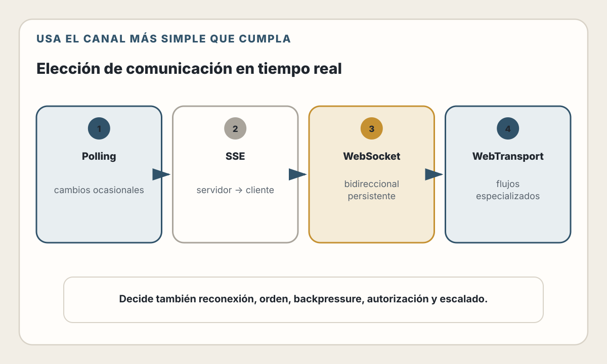
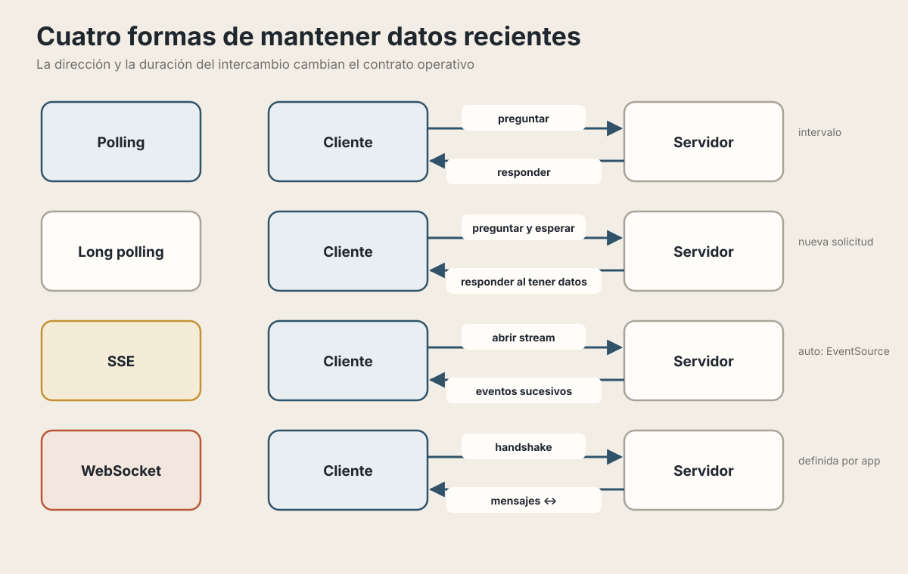
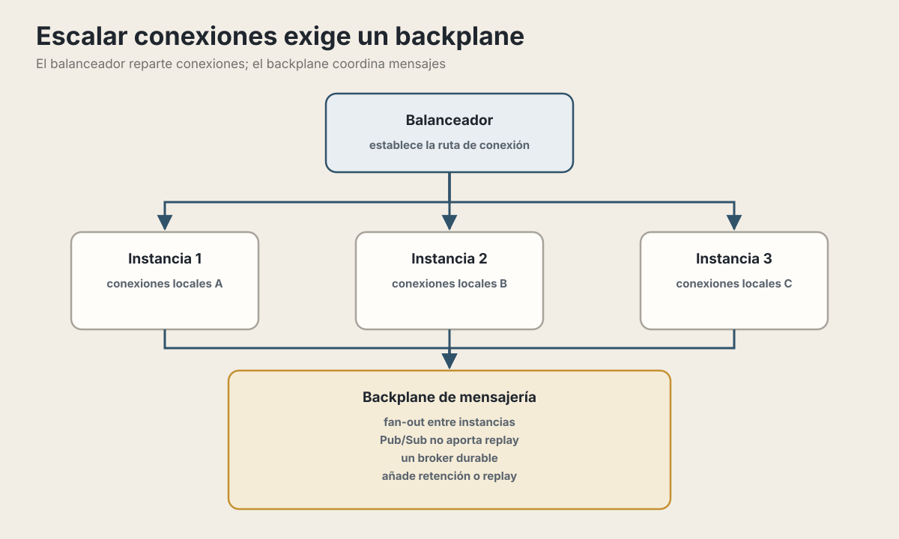

# 18. Comunicación y Datos en Tiempo Real

> "La web nació como un sistema de documentos estáticos. Hoy esperamos que las aplicaciones reaccionen instantáneamente. Entender cómo lograrlo es fundamental."

---

## Objetivos de Aprendizaje

Al finalizar este capítulo, serás capaz de:

- distinguir actualización periódica, streaming unidireccional y comunicación
  bidireccional;
- elegir entre polling, SSE y WebSockets a partir de frecuencia, dirección,
  latencia y compatibilidad;
- diseñar reconexión, orden, duplicados, backpressure y recuperación;
- escalar conexiones sin confundir transporte con entrega duradera;
- observar y proteger un canal de comunicación de larga duración.

## Modelo mental

“Tiempo real” no describe una tecnología concreta. Describe un presupuesto de
latencia y una semántica de entrega. Antes de elegir transporte, define quién
inicia los mensajes, cuánto retraso admite el usuario, qué ocurre al perder una
conexión y si cada evento debe recuperarse.

---

## El Problema: HTTP es Request-Response

HTTP conserva el modelo petición-respuesta: el cliente inicia una petición y el
servidor responde dentro de ella. La conexión subyacente puede reutilizarse o
multiplexar intercambios; “respuesta terminada” no implica necesariamente
“conexión cerrada”.

En un intercambio HTTP convencional, el cliente solicita `/noticias`, el
servidor responde y ese intercambio termina. Si aparece una noticia cinco
minutos después, el navegador no la conoce hasta iniciar otra solicitud o
mantener abierto algún mecanismo de actualización.

**El límite**: el servidor no inicia una petición HTTP arbitraria hacia el
navegador. Puede mantener abierta una respuesta, y ambos extremos pueden
negociar otros protocolos o canales para intercambios posteriores.

### Lo Que Queremos vs Lo Que HTTP Ofrece

Distintos productos piden ritmos y garantías diferentes:

- un chat necesita mensajes y presencia con baja demora;
- un tablero puede tolerar actualizaciones cada varios segundos;
- la edición colaborativa necesita además un protocolo de convergencia;
- un juego o telemetría especializada puede requerir mensajes binarios y
  tolerancia explícita a pérdida.

Todos necesitan alguna vía de servidor a cliente, pero no necesariamente el
mismo transporte ni la misma latencia.

---

## Las Soluciones: Del Más Simple al Más Sofisticado

<picture>
  <source media="(max-width: 820px)" srcset="../assets/diagrams/cap18-eleccion-tiempo-real-mobile.svg">
  
</picture>

La progresión no implica que la opción más compleja sea mejor. Elige el canal
más simple que satisfaga la dirección de los mensajes, la frecuencia, el orden,
la reconexión y la presión de flujo que realmente necesita el producto.

<picture>
  <source media="(max-width: 820px)" srcset="../assets/diagrams/cap18-patrones-conexion-mobile.svg">
  
</picture>

---

## Polling: La Solución Ingenua

La idea más simple: preguntar repetidamente si hay algo nuevo.

Con polling, el cliente pregunta cada cierto intervalo si existen datos nuevos.
Si consulta cada cinco segundos, un evento puede tardar casi cinco segundos en
verse y muchas respuestas pueden llegar vacías. A cambio, el mecanismo funciona
sobre HTTP convencional, es fácil de observar y suele bastar para cambios
ocasionales.

### 🛠️ Implementación de Polling

```typescript
// Cliente: Polling simple
class PollingClient {
  private intervalId: number | null = null;

  start(intervalMs: number = 5000) {
    this.intervalId = setInterval(async () => {
      try {
        const response = await fetch('/api/messages/new');
        const data = await response.json();

        if (data.messages.length > 0) {
          this.onNewMessages(data.messages);
        }
      } catch (error) {
        console.error('Error polling:', error);
      }
    }, intervalMs);
  }

  stop() {
    if (this.intervalId) {
      clearInterval(this.intervalId);
    }
  }

  onNewMessages(messages: Message[]) {
    // Procesar mensajes nuevos
    messages.forEach(msg => displayMessage(msg));
  }
}

// Uso
const poller = new PollingClient();
poller.start(3000); // Cada 3 segundos
```

```typescript
// Servidor: Endpoint para polling
app.get('/api/messages/new', async (req, res) => {
  const lastSeenId = req.query.since || 0;

  const newMessages = await db.message.findMany({
    where: {
      id: { gt: Number(lastSeenId) },
      recipientId: req.user.id,
    },
    orderBy: { createdAt: 'asc' },
  });

  res.json({
    messages: newMessages,
    lastId: newMessages.at(-1)?.id || lastSeenId,
  });
});
```

### ⚠️ Cuándo Usar Polling

| Escenario | ¿Polling? | Por qué |
|-----------|-----------|---------|
| Dashboard que actualiza cada minuto | Sí | Demora predecible y mecanismo simple |
| Feed de noticias | Puede bastar | Depende de la frescura esperada y del volumen |
| Chat en vivo | Normalmente no | Muchas respuestas vacías o demora visible |
| Precios financieros | Depende del contrato | No confundas una interfaz informativa con ejecución de baja latencia |
| Cliente o red restrictiva | Conviene evaluarlo | HTTP convencional puede ser el camino más interoperable |

---

## Long Polling: Polling Mejorado

La idea: el servidor **no responde hasta que tenga algo que decir**.

Cuando llega un evento, el servidor responde y el cliente abre de inmediato
otra solicitud. Proxies y servidores pueden cerrar la espera, por lo que el
cliente necesita timeout, reconexión, cursor y un límite de reintentos. La
latencia no es «casi cero» por definición: depende de intermediarios, carga y
tiempo de reconexión.

### 🛠️ Implementación de Long Polling

```typescript
// Cliente: Long Polling
async function longPoll(lastEventId: string = '0'): Promise<void> {
  try {
    const response = await fetch(`/api/events?since=${lastEventId}`, {
      // Timeout largo para esperar eventos
      signal: AbortSignal.timeout(30000),
    });

    if (response.ok) {
      const data = await response.json();

      if (data.events.length > 0) {
        data.events.forEach(handleEvent);
        lastEventId = data.lastEventId;
      }
    }
  } catch (error) {
    if (error.name === 'TimeoutError') {
      // Timeout normal, reconectar
      console.log('Timeout, reconnecting...');
    } else {
      // Error real, esperar antes de reintentar
      console.error('Error:', error);
      await sleep(5000);
    }
  }

  // Siempre reconectar
  longPoll(lastEventId);
}

// Iniciar
longPoll();
```

```typescript
// Servidor: Long Polling con Express
const waitingClients = new Map<string, Response>();

app.get('/api/events', async (req, res) => {
  const userId = req.user.id;
  const since = req.query.since || '0';

  // Verificar si hay eventos pendientes
  const pendingEvents = await getEventsSince(userId, since);

  if (pendingEvents.length > 0) {
    // Hay eventos, responder inmediatamente
    return res.json({
      events: pendingEvents,
      lastEventId: pendingEvents.at(-1).id,
    });
  }

  // No hay eventos, guardar conexión para responder después
  waitingClients.set(userId, res);

  // Timeout después de 30 segundos
  const timeout = setTimeout(() => {
    waitingClients.delete(userId);
    res.json({ events: [], lastEventId: since });
  }, 30000);

  // Limpiar si el cliente se desconecta
  req.on('close', () => {
    clearTimeout(timeout);
    waitingClients.delete(userId);
  });
});

// Cuando hay un nuevo evento, notificar al cliente esperando
async function notifyUser(userId: string, event: Event) {
  const waitingResponse = waitingClients.get(userId);

  if (waitingResponse) {
    waitingClients.delete(userId);
    waitingResponse.json({
      events: [event],
      lastEventId: event.id,
    });
  }
}
```

---

## Server-Sent Events (SSE): El Servidor Empuja

SSE es un estándar del navegador para recibir un **stream de eventos del
servidor**. `EventSource` define reconexión y `Last-Event-ID`, pero la
recuperación depende de que el servidor conserve y pueda volver a entregar los
eventos. Es un flujo UTF-8 unidireccional; proxies, CDNs y gateways deben admitir
streaming y evitar buffering o timeouts incompatibles.

### 🛠️ Implementación de SSE

```typescript
// Cliente: EventSource API nativa del navegador
const eventSource = new EventSource('/api/events/stream');

// Evento por defecto (sin nombre)
eventSource.onmessage = (event) => {
  const data = JSON.parse(event.data);
  console.log('Mensaje:', data);
};

// Eventos con nombre específico
eventSource.addEventListener('price-update', (event) => {
  const { symbol, price } = JSON.parse(event.data);
  updatePriceDisplay(symbol, price);
});

eventSource.addEventListener('notification', (event) => {
  const notification = JSON.parse(event.data);
  showNotification(notification);
});

// Manejo de errores y reconexión
eventSource.onerror = (error) => {
  console.error('SSE error:', error);
  // El navegador reconecta automáticamente
};

// Cerrar conexión cuando no se necesite
function disconnect() {
  eventSource.close();
}
```

```typescript
// Servidor: SSE con Express
app.get('/api/events/stream', (req, res) => {
  // Headers para SSE
  res.setHeader('Content-Type', 'text/event-stream');
  res.setHeader('Cache-Control', 'no-cache');
  res.setHeader('Connection', 'keep-alive');

  // Deshabilitar buffering (importante para nginx)
  res.setHeader('X-Accel-Buffering', 'no');

  // Enviar comentario inicial para establecer conexión
  res.write(':ok\n\n');

  const userId = req.user.id;

  // Función para enviar eventos
  const sendEvent = (eventName: string, data: unknown) => {
    res.write(`event: ${eventName}\n`);
    res.write(`data: ${JSON.stringify(data)}\n\n`);
  };

  // Registrar este cliente
  const clientId = addSSEClient(userId, sendEvent);

  // Enviar heartbeat cada 30 segundos (mantiene conexión viva)
  const heartbeat = setInterval(() => {
    res.write(':heartbeat\n\n');
  }, 30000);

  // Limpiar cuando el cliente se desconecta
  req.on('close', () => {
    clearInterval(heartbeat);
    removeSSEClient(clientId);
  });
});

// Gestión de clientes SSE conectados
const sseClients = new Map<string, { userId: string; send: Function }>();

function addSSEClient(userId: string, send: Function): string {
  const clientId = crypto.randomUUID();
  sseClients.set(clientId, { userId, send });
  return clientId;
}

function removeSSEClient(clientId: string) {
  sseClients.delete(clientId);
}

// Enviar evento a un usuario específico
function sendToUser(userId: string, eventName: string, data: unknown) {
  for (const [, client] of sseClients) {
    if (client.userId === userId) {
      client.send(eventName, data);
    }
  }
}

// Enviar a todos los clientes (broadcast)
function broadcast(eventName: string, data: unknown) {
  for (const [, client] of sseClients) {
    client.send(eventName, data);
  }
}

// Uso: cuando hay una actualización de precio
priceService.onPriceChange((symbol, price) => {
  broadcast('price-update', { symbol, price, timestamp: Date.now() });
});
```

### Formato del Protocolo SSE

```
// Formato del stream SSE

// Evento sin nombre (usa onmessage)
data: {"mensaje": "Hola mundo"}

// Evento con nombre (usa addEventListener)
event: notification
data: {"tipo": "info", "texto": "Nuevo usuario"}

// Evento con ID (para reconexión)
id: 12345
event: message
data: {"texto": "Hola"}

// Datos multilínea
data: {"linea1": "valor1",
data:  "linea2": "valor2"}

// Comentario (ignorado, útil para heartbeat)
:esto es un comentario

// Cada mensaje termina con doble newline
```

### 💡 SSE con HTTP/2: multiplexación, no capacidad infinita

| Transporte | Efecto relevante para SSE |
|---|---|
| HTTP/1.1 | Los navegadores suelen limitar las conexiones simultáneas por origen; varias pestañas compiten por ellas |
| HTTP/2 | Multiplexa streams sobre una conexión y reduce esa presión, pero negocia su propio límite de streams concurrentes |

HTTP/2 también negocia un número máximo de streams concurrentes. Ese límite
depende del cliente, el servidor y la infraestructura intermedia. Antes de
escalar SSE, mide conexiones simultáneas, memoria, buffers, timeouts de proxies
y comportamiento de reconexión.

---

## WebSockets: Comunicación Bidireccional

WebSockets establecen una conexión **persistente y bidireccional**. Tras el
handshake, ambos extremos pueden enviar texto o binario. La API nativa no define
reconexión, recuperación ni autorización por mensaje: la aplicación debe
diseñar esos contratos, además de heartbeat, límites y presión de salida.

### 🛠️ Implementación con WebSocket Nativo

```typescript
// Cliente: WebSocket API nativa
class ChatClient {
  private ws: WebSocket | null = null;
  private reconnectAttempts = 0;
  private maxReconnectAttempts = 5;

  connect() {
    this.ws = new WebSocket('wss://api.myapp.com/chat');

    this.ws.onopen = () => {
      console.log('Conectado');
      this.reconnectAttempts = 0;

      // Autenticarse
      this.send({
        type: 'auth',
        token: getAuthToken(),
      });
    };

    this.ws.onmessage = (event) => {
      const message = JSON.parse(event.data);
      this.handleMessage(message);
    };

    this.ws.onerror = (error) => {
      console.error('WebSocket error:', error);
    };

    this.ws.onclose = (event) => {
      console.log('Desconectado:', event.code, event.reason);
      this.attemptReconnect();
    };
  }

  private attemptReconnect() {
    if (this.reconnectAttempts < this.maxReconnectAttempts) {
      this.reconnectAttempts++;
      const delay = Math.min(1000 * Math.pow(2, this.reconnectAttempts), 30000);

      console.log(`Reconectando en ${delay}ms...`);
      setTimeout(() => this.connect(), delay);
    } else {
      console.error('Máximo de reconexiones alcanzado');
    }
  }

  send(data: object) {
    if (this.ws?.readyState === WebSocket.OPEN) {
      this.ws.send(JSON.stringify(data));
    }
  }

  private handleMessage(message: any) {
    switch (message.type) {
      case 'chat':
        displayChatMessage(message);
        break;
      case 'typing':
        showTypingIndicator(message.userId);
        break;
      case 'presence':
        updateUserPresence(message.userId, message.status);
        break;
    }
  }

  disconnect() {
    this.maxReconnectAttempts = 0; // Prevenir reconexión
    this.ws?.close();
  }
}
```

```typescript
// Servidor: WebSocket con ws (Node.js)
import { WebSocketServer, WebSocket } from 'ws';
import { createServer } from 'http';

const server = createServer(app);
const wss = new WebSocketServer({ server });

// Mapa de usuarios conectados
const clients = new Map<string, WebSocket>();

wss.on('connection', (ws, req) => {
  let userId: string | null = null;

  ws.on('message', async (data) => {
    try {
      const message = JSON.parse(data.toString());

      switch (message.type) {
        case 'auth':
          // Verificar token y obtener usuario
          const user = await verifyToken(message.token);
          if (user) {
            userId = user.id;
            clients.set(userId, ws);

            // Notificar a otros que este usuario está online
            broadcast({
              type: 'presence',
              userId,
              status: 'online',
            }, userId);
          } else {
            ws.close(4001, 'Unauthorized');
          }
          break;

        case 'chat':
          if (!userId) return;

          const chatMessage = {
            type: 'chat',
            from: userId,
            text: message.text,
            timestamp: Date.now(),
          };

          // Guardar en DB
          await saveMessage(chatMessage);

          // Enviar a todos (o a un canal específico)
          broadcast(chatMessage);
          break;

        case 'typing':
          if (!userId) return;

          broadcast({
            type: 'typing',
            userId,
            channelId: message.channelId,
          }, userId);
          break;
      }
    } catch (error) {
      console.error('Error procesando mensaje:', error);
    }
  });

  ws.on('close', () => {
    if (userId) {
      clients.delete(userId);

      // Notificar que el usuario se fue
      broadcast({
        type: 'presence',
        userId,
        status: 'offline',
      });
    }
  });

  // Heartbeat para detectar conexiones muertas
  ws.on('pong', () => {
    (ws as any).isAlive = true;
  });
});

// Ping periódico para detectar clientes desconectados
setInterval(() => {
  wss.clients.forEach((ws) => {
    if ((ws as any).isAlive === false) {
      return ws.terminate();
    }
    (ws as any).isAlive = false;
    ws.ping();
  });
}, 30000);

function broadcast(message: object, excludeUserId?: string) {
  const data = JSON.stringify(message);

  for (const [id, client] of clients) {
    if (id !== excludeUserId && client.readyState === WebSocket.OPEN) {
      client.send(data);
    }
  }
}

function sendToUser(userId: string, message: object) {
  const client = clients.get(userId);
  if (client?.readyState === WebSocket.OPEN) {
    client.send(JSON.stringify(message));
  }
}
```

### 🛠️ Socket.IO: WebSockets con Superpoderes

Socket.IO añade funcionalidades útiles sobre WebSockets:

```typescript
// Servidor: Socket.IO
import { Server } from 'socket.io';

const io = new Server(server, {
  cors: {
    origin: 'https://myapp.com',
    methods: ['GET', 'POST'],
  },
});

// Middleware de autenticación
io.use(async (socket, next) => {
  const token = socket.handshake.auth.token;
  try {
    const user = await verifyToken(token);
    socket.data.user = user;
    next();
  } catch {
    next(new Error('Authentication error'));
  }
});

io.on('connection', (socket) => {
  const user = socket.data.user;
  console.log(`${user.name} conectado`);

  // Unirse a "rooms" (canales)
  socket.join(`user:${user.id}`);
  socket.join('general');

  // Escuchar eventos
  socket.on('chat:message', async (data) => {
    const message = {
      from: user.id,
      text: data.text,
      room: data.room,
      timestamp: Date.now(),
    };

    await saveMessage(message);

    // Enviar a todos en el room
    io.to(data.room).emit('chat:message', message);
  });

  socket.on('chat:typing', (data) => {
    // Enviar a todos EXCEPTO el que envía
    socket.to(data.room).emit('chat:typing', {
      userId: user.id,
      userName: user.name,
    });
  });

  socket.on('disconnect', () => {
    console.log(`${user.name} desconectado`);
    io.emit('user:offline', { userId: user.id });
  });
});

// Enviar a un usuario específico desde cualquier parte del código
function notifyUser(userId: string, event: string, data: any) {
  io.to(`user:${userId}`).emit(event, data);
}
```

```typescript
// Cliente: Socket.IO
import { io } from 'socket.io-client';

const socket = io('https://api.myapp.com', {
  auth: {
    token: getAuthToken(),
  },
  reconnection: true,           // ✅ Reconexión automática
  reconnectionAttempts: 5,
  reconnectionDelay: 1000,
  reconnectionDelayMax: 5000,
});

socket.on('connect', () => {
  console.log('Conectado con ID:', socket.id);
});

socket.on('chat:message', (message) => {
  displayMessage(message);
});

socket.on('chat:typing', (data) => {
  showTypingIndicator(data.userName);
});

// Emitir eventos
function sendMessage(room: string, text: string) {
  socket.emit('chat:message', { room, text });
}

function startTyping(room: string) {
  socket.emit('chat:typing', { room });
}

// Socket.IO tiene "acknowledgements" para confirmar recepción
socket.emit('chat:message', { room: 'general', text: 'Hola' }, (response) => {
  if (response.ok) {
    console.log('Mensaje entregado');
  }
});
```

### Opciones alrededor de WebSockets

| Herramienta | Tipo | Aspecto que conviene evaluar |
|-------------|------|------------------------------|
| **ws** | Self-hosted | Control total, Node.js puro |
| **Socket.IO** | Self-hosted | Features out-of-the-box, rooms |
| **Ably** | Managed | Escala global, sin infraestructura |
| **Pusher** | Managed | API administrada y modelo de coste |
| **Azure Web PubSub** | Managed | Ecosistema Microsoft |
| **SocketCluster** | Self-hosted | Multi-proceso, alta escala |

---

## WebTransport: transporte especializado

WebTransport ofrece una API de bajo nivel para comunicación bidireccional con
múltiples streams y datagramas. No reemplaza automáticamente a WebSockets:
resuelve necesidades distintas y exige soporte coordinado de navegador,
servidor, proxies y observabilidad. La especificación web continúa en desarrollo.

| Aspecto | WebSocket | WebTransport |
|---|---|---|
| Unidad principal | Mensajes sobre un flujo fiable y ordenado | Streams independientes y datagramas |
| Pérdida y orden | El transporte entrega el flujo en orden | Los datagramas pueden perderse o reordenarse |
| Madurez operativa | Amplia | Requiere verificar toda la ruta |
| Mejor encaje | Conversación bidireccional de aplicación | Necesidades especializadas de transporte |

### 🛠️ Ejemplo de WebTransport

```typescript
// Cliente: requiere HTTPS y soporte de WebTransport en toda la ruta
async function connectWebTransport() {
  const transport = new WebTransport('https://api.myapp.com/webtransport');

  await transport.ready;
  console.log('WebTransport conectado');

  // Stream bidireccional (como WebSocket)
  const stream = await transport.createBidirectionalStream();
  const writer = stream.writable.getWriter();
  const reader = stream.readable.getReader();

  // Enviar mensaje
  await writer.write(new TextEncoder().encode('Hola servidor'));

  // Leer respuesta
  const { value } = await reader.read();
  console.log('Respuesta:', new TextDecoder().decode(value));

  // Datagramas: pueden perderse o llegar desordenados; siguen sujetos
  // a congestión y a los límites de tamaño del transporte.
  const datagramWriter = transport.datagrams.writable.getWriter();
  await datagramWriter.write(new Uint8Array([1, 2, 3, 4]));

  transport.closed.then(() => {
    console.log('Conexión cerrada');
  });
}
```

### ⚠️ ¿Cuándo Usar WebTransport?

> **Estado del ecosistema — verificado el 30 de julio de 2026.** La
> especificación de WebTransport publicada por W3C el 25 de marzo de 2026
> continúa como Working Draft. La disponibilidad del navegador no convierte el
> protocolo en una recomendación final: comprueba versiones, proxies y soporte
> del servidor en el entorno objetivo.

Considéralo cuando controlas suficientemente el entorno cliente y necesitas:
- Gaming multiplayer con baja latencia
- Streaming de video/audio custom
- IoT con muchos mensajes pequeños

**Para la mayoría**: Sigue usando WebSockets o SSE.

---

## Comparativa: ¿Cuál Elegir?

Una guía inicial de decisión:

1. Para cambios ocasionales que toleran demora, empieza con polling.
2. Para un flujo continuo del servidor al navegador, evalúa SSE.
3. Para conversación bidireccional persistente, evalúa WebSocket.
4. Para flujos múltiples, datagramas o requisitos de transporte especializados,
   considera WebTransport solo después de verificar soporte e infraestructura.
5. En todos los casos, diseña reconexión, orden, duplicados, autorización y
   límites de recursos.

### Tabla Comparativa

| Característica | Polling | Long Polling | SSE | WebSockets | WebTransport |
|----------------|---------|--------------|-----|------------|--------------|
| **Dirección** | Cliente→Server | Cliente→Server | Server→Cliente | Bidireccional | Bidireccional |
| **Flujo principal** | Solicitud/respuesta periódica | Solicitud mantenida | Servidor → cliente | Bidireccional | Bidireccional |
| **Datos binarios** | Sí, como cuerpo HTTP | Sí, como cuerpo HTTP | No directamente; eventos UTF-8 | Sí | Sí |
| **Reconexión definida por API** | No | No | Sí, con `EventSource` | No | No |
| **Unidad de transporte** | Respuesta HTTP | Respuesta HTTP | Eventos de texto | Mensajes sobre un flujo fiable | Streams fiables y datagramas |
| **Infraestructura** | HTTP convencional | HTTP con solicitudes largas | HTTP streaming y buffering desactivado | Upgrade y conexiones persistentes | Servidor y red compatibles |
| **Compatibilidad** | Muy amplia | Muy amplia | Amplia en navegadores modernos | Amplia en navegadores modernos | Navegadores recientes; verificar |

La latencia y la capacidad de escala no son propiedades fijas del protocolo:
dependen de frecuencia, tamaño, intermediarios, implementación y topología.

### Casos de Uso Reales

| Aplicación | Tecnología | Por qué |
|------------|------------|---------|
| **Estado de un proceso** | SSE o polling | Flujo principalmente servidor → cliente |
| **Chat interactivo** | WebSockets | Mensajes bidireccionales y presencia |
| **Edición colaborativa** | WebSockets más protocolo de sincronización | La convergencia no la resuelve el transporte |
| **Telemetría tolerante a pérdida** | Evaluar WebTransport | Datagramas si perder muestras es aceptable |
| **Cliente antiguo o red restrictiva** | Polling o long polling | Compatibilidad antes que sofisticación |

---

## Escalando Conexiones en Tiempo Real

El desafío: cada conexión WebSocket/SSE consume recursos del servidor.

<picture>
  <source media="(max-width: 820px)" srcset="../assets/diagrams/cap18-escalado-backplane-mobile.svg">
  
</picture>

El balanceador decide dónde queda cada conexión. Cuando emisor y destinatario
están en procesos distintos, las instancias necesitan un canal común. Ese canal
no resuelve por sí solo presencia, orden, recuperación ni durabilidad.

### 🛠️ Escalando con Redis Pub/Sub

```typescript
// Adaptador de Socket.IO con Redis
import { Server } from 'socket.io';
import { createAdapter } from '@socket.io/redis-adapter';
import { createClient } from 'redis';

const pubClient = createClient({ url: 'redis://localhost:6379' });
const subClient = pubClient.duplicate();

await Promise.all([pubClient.connect(), subClient.connect()]);

const io = new Server(server);

// Usar Redis como "puente" entre servidores
io.adapter(createAdapter(pubClient, subClient));

// Ahora io.emit() llegará a TODOS los clientes,
// sin importar a qué servidor estén conectados
io.on('connection', (socket) => {
  socket.on('chat:message', (data) => {
    // Esto se propaga automáticamente a todos los servidores
    io.to(data.room).emit('chat:message', data);
  });
});
```

Con el adaptador, la instancia que recibe un mensaje lo publica en Redis; las
demás instancias suscritas lo reciben y emiten únicamente a sus conexiones
locales relevantes. Redis Pub/Sub no conserva mensajes para procesos
desconectados. Si el producto necesita recuperar eventos, evalúa streams, un
broker durable o una fuente de verdad desde la cual reconstruirlos.

---

## IA en Comunicación en Tiempo Real

### Streaming de Respuestas de LLM

```typescript
// SSE es perfecto para streaming de respuestas de IA

// Servidor
app.get('/api/ai/chat', async (req, res) => {
  res.setHeader('Content-Type', 'text/event-stream');
  res.setHeader('Cache-Control', 'no-cache');

  const prompt = req.query.prompt as string;

  try {
    const stream = await openai.chat.completions.create({
      model: 'gpt-4',
      messages: [{ role: 'user', content: prompt }],
      stream: true,
    });

    for await (const chunk of stream) {
      const content = chunk.choices[0]?.delta?.content;
      if (content) {
        res.write(`data: ${JSON.stringify({ content })}\n\n`);
      }
    }

    res.write(`data: ${JSON.stringify({ done: true })}\n\n`);
    res.end();
  } catch (error) {
    res.write(`data: ${JSON.stringify({ error: error.message })}\n\n`);
    res.end();
  }
});

// Cliente
const eventSource = new EventSource(`/api/ai/chat?prompt=${encodeURIComponent(prompt)}`);

let fullResponse = '';

eventSource.onmessage = (event) => {
  const data = JSON.parse(event.data);

  if (data.done) {
    eventSource.close();
    return;
  }

  if (data.content) {
    fullResponse += data.content;
    updateChatUI(fullResponse);  // Actualiza en tiempo real como ChatGPT
  }
};
```

### Detección de Actividad Sospechosa

```typescript
// Analizar patrones de conexión en tiempo real
class ConnectionMonitor {
  private connectionHistory = new Map<string, number[]>();

  onNewConnection(userId: string, ip: string) {
    const now = Date.now();
    const key = `${userId}:${ip}`;

    if (!this.connectionHistory.has(key)) {
      this.connectionHistory.set(key, []);
    }

    const history = this.connectionHistory.get(key)!;
    history.push(now);

    // Mantener solo últimos 5 minutos
    const fiveMinutesAgo = now - 5 * 60 * 1000;
    const recent = history.filter(t => t > fiveMinutesAgo);
    this.connectionHistory.set(key, recent);

    // Detectar patrones sospechosos
    if (recent.length > 50) {
      // Más de 50 conexiones en 5 minutos = posible ataque
      this.flagSuspiciousActivity(userId, ip, 'rapid_reconnection');
    }
  }

  private async flagSuspiciousActivity(
    userId: string,
    ip: string,
    reason: string
  ) {
    await alertSecurityTeam({
      type: 'suspicious_ws_activity',
      userId,
      ip,
      reason,
      timestamp: new Date(),
    });

    // Opcionalmente, rate limit este usuario
    await rateLimiter.penalize(userId);
  }
}
```

---

## Ideas clave

1. **SSE cuando el flujo principal es servidor → cliente** - Para
   notificaciones, feeds o progreso, suele ofrecer un modelo más simple que
   WebSockets.

2. **WebSockets solo cuando necesitas bidireccional** - Chat, gaming, colaboración. No uses WebSockets "porque sí".

3. **Fallback según los clientes reales** - Polling o long polling pueden cubrir
   redes y clientes que no admiten el transporte principal, si el producto lo
   necesita.

4. **El backplane también tiene semántica** - Redis Pub/Sub puede distribuir
   mensajes entre instancias, pero no ofrece persistencia. Usa streams, un broker
   u otra estrategia cuando no puedas perder eventos.

5. **Define detección de conexiones muertas** - Usa ping/pong, timeouts o el
   mecanismo de la biblioteca cuando la aplicación necesite detectar
   desconexiones silenciosas.

6. **WebTransport es una opción especializada** - Adóptalo solo cuando sus
   capacidades resuelvan una necesidad medida y puedas sostener su
   compatibilidad operativa.

---

## Ejercicios

1. **Matriz de decisión**: compara polling, SSE y WebSockets para seguimiento de
   un pedido, edición colaborativa y progreso de una exportación.
2. **Reconexión**: diseña un cliente que recupere eventos después de una
   desconexión. Define identificadores, deduplicación y límite de reintentos.
3. **Capacidad**: estima conexiones concurrentes, mensajes por segundo y bytes
   transferidos para un dashboard. Indica qué medirías antes de escalar.
4. **Seguridad**: revisa autenticación, autorización por mensaje, límites y
   registros de auditoría para un canal WebSocket.

---

## Referencias

- [IETF: RFC 9110 — HTTP Semantics](https://www.rfc-editor.org/rfc/rfc9110.html)
- [MDN: Server-Sent Events](https://developer.mozilla.org/en-US/docs/Web/API/Server-sent_events)
- [MDN: WebSocket API](https://developer.mozilla.org/en-US/docs/Web/API/WebSocket)
- [Socket.IO Documentation](https://socket.io/docs/v4/)
- [W3C: WebTransport Working Draft](https://www.w3.org/TR/webtransport/)
- [MDN: WebTransport API](https://developer.mozilla.org/en-US/docs/Web/API/WebTransport_API)
- [Socket.IO: Using multiple nodes](https://socket.io/docs/v4/using-multiple-nodes/)
