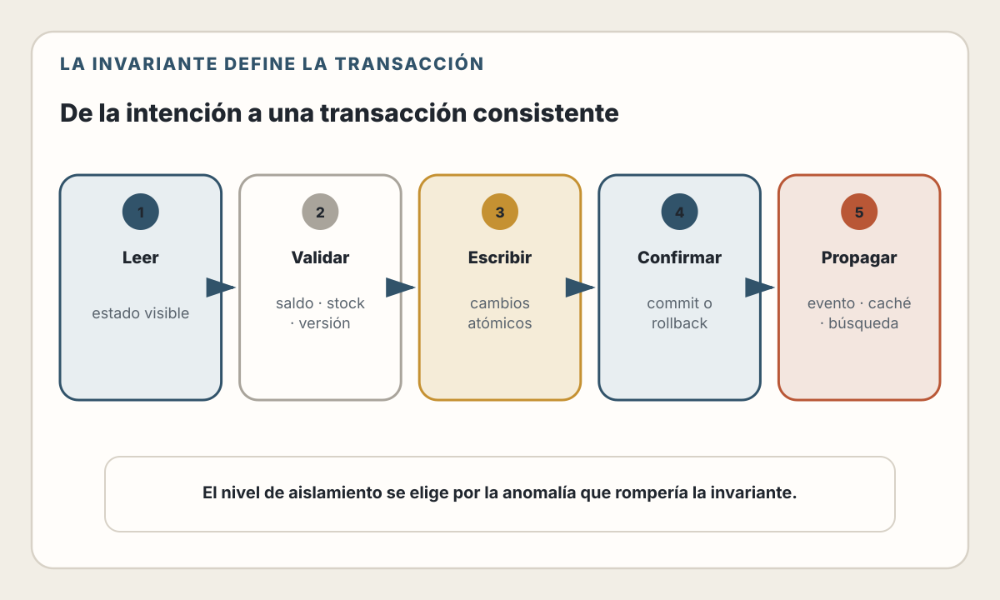
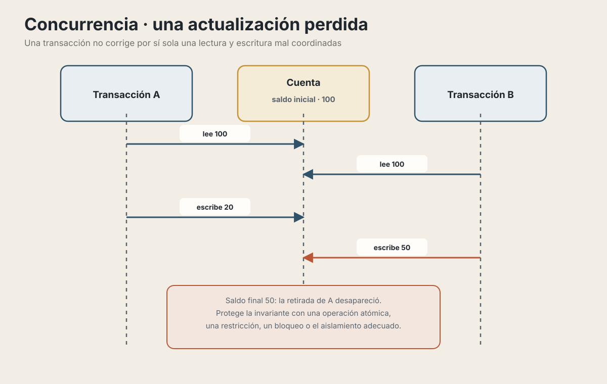
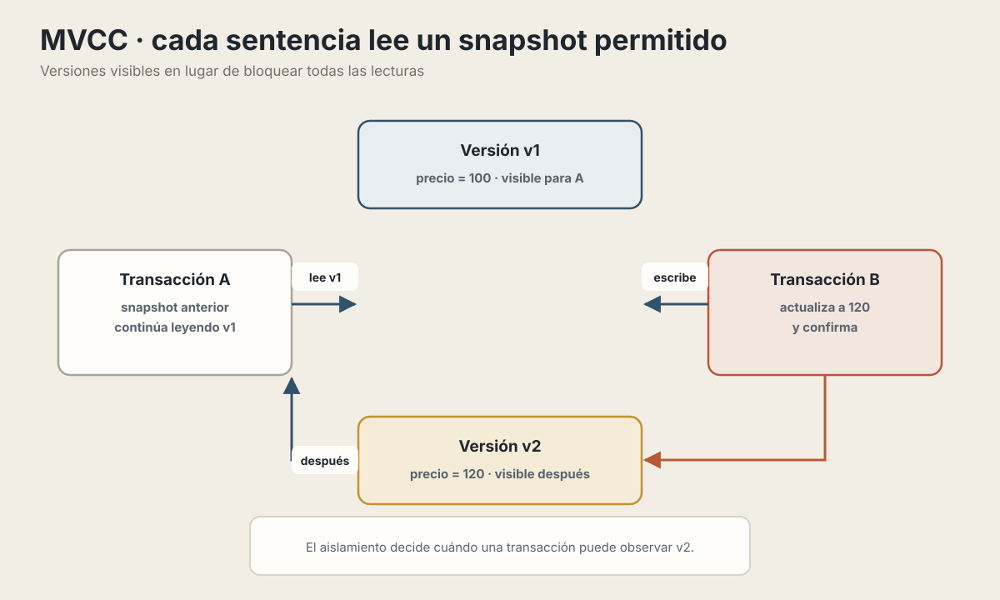
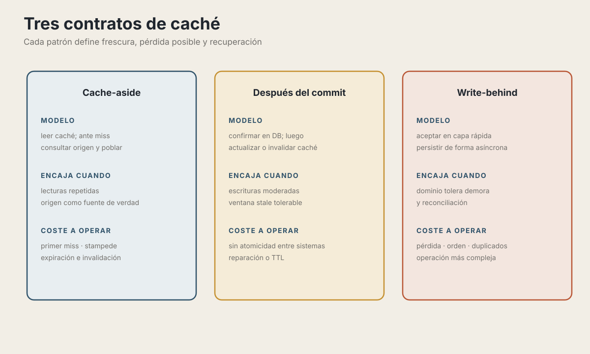

# 19. Persistencia y Bases de Datos

> "Los datos sobreviven al código. El schema que diseñes hoy seguirá ahí cuando hayas reescrito la aplicación tres veces."

---

## Objetivos de Aprendizaje

Al finalizar este capítulo, serás capaz de:

- Aplicar patrones de acceso a datos (Repository, Unit of Work) apropiadamente
- Elegir entre ORM, Query Builder o SQL puro según el contexto
- Diseñar transacciones con el nivel de aislamiento correcto
- Implementar estrategias de caching efectivas
- Optimizar queries mediante índices y entender cuándo usar búsqueda especializada

## Alcance

El capítulo 13 define entidades, relaciones, esquemas e índices desde el modelo.
Este capítulo comienza cuando la aplicación necesita acceder a esos datos:
repositorios, consultas, transacciones, concurrencia, caché y búsqueda. Repite
una idea de modelado solo cuando sea necesaria para explicar una garantía de
persistencia.

---

## Por Qué Este Capítulo Importa

En el capítulo 13 modelamos los datos. En el capítulo 16 estructuramos el backend en capas. Ahora conectamos ambos: **¿cómo accede tu aplicación a la base de datos de forma eficiente, segura y mantenible?**

La capa de persistencia debe responder cinco preguntas concretas:

- qué nivel de abstracción conviene para cada consulta: SQL, query builder u ORM;
- dónde empieza y termina una transacción;
- cómo se protegen invariantes ante operaciones concurrentes;
- cómo se detectan y corrigen consultas lentas;
- cuándo leer la fuente de verdad y cuándo aceptar una copia en caché.

Este capítulo responde esas preguntas con patrones probados y decisiones informadas.

---

## Patrones de Acceso a Datos

### El problema del acceso directo

Considera este código común en aplicaciones pequeñas:

```typescript
// ❌ Acceso directo desde el servicio
class OrderService {
  async createOrder(userId: string, items: CartItem[]) {
    // SQL directo mezclado con lógica de negocio
    const user = await db.query(
      'SELECT * FROM users WHERE id = $1',
      [userId]
    );

    if (!user) throw new Error('Usuario no encontrado');

    const order = await db.query(
      'INSERT INTO orders (user_id, total) VALUES ($1, $2) RETURNING *',
      [userId, calculateTotal(items)]
    );

    for (const item of items) {
      await db.query(
        'INSERT INTO order_items (order_id, product_id, qty) VALUES ($1, $2, $3)',
        [order.id, item.productId, item.quantity]
      );
    }

    return order;
  }
}
```

Este código tiene varios problemas:

- **Difícil de probar** — necesitas una base de datos real
- **Lógica de negocio mezclada con SQL** — difícil de mantener
- **Sin transacción** — si falla a mitad, quedan datos inconsistentes
- **Cambio costoso de motor o esquema** — decisiones específicas quedan dispersas

### El patrón Repository

El **Repository** abstrae el acceso a datos detrás de una interfaz que parece una colección en memoria:

```typescript
// ✅ Acceso a datos abstraído
interface OrderRepository {
  findById(id: string): Promise<Order | null>;
  findByUserId(userId: string): Promise<Order[]>;
  save(order: Order): Promise<Order>;
  delete(id: string): Promise<void>;
}

class PostgresOrderRepository implements OrderRepository {
  async findById(id: string): Promise<Order | null> {
    const result = await db.query(
      'SELECT * FROM orders WHERE id = $1',
      [id]
    );
    return result.rows[0] ? this.toOrder(result.rows[0]) : null;
  }

  async save(order: Order): Promise<Order> {
    // Lógica de INSERT o UPDATE según si existe
    // ...
  }

  private toOrder(row: any): Order {
    // Mapea de row de DB a objeto de dominio
    return new Order(row.id, row.user_id, row.total, row.status);
  }
}
```

**Beneficios:**

| Sin Repository | Con Repository |
|----------------|----------------|
| SQL disperso en servicios | SQL centralizado en un lugar |
| Tests de integración requieren DB real | La lógica de dominio puede probarse con un fake; el repositorio real todavía exige integración |
| El cambio de motor afecta muchos servicios | La implementación concentra parte del cambio; no elimina diferencias de SQL ni semántica |
| Lógica de mapeo repetida | Mapeo en un solo lugar |

📖 **Concepto**: El Repository actúa como una "colección de objetos de dominio". El resto de la aplicación no sabe ni le importa si los datos vienen de PostgreSQL, MongoDB, o un archivo JSON.

### El patrón Unit of Work

El **Unit of Work** agrupa múltiples operaciones en una sola transacción:

```typescript
// ✅ Múltiples operaciones en una transacción
class UnitOfWork {
  private connection: PoolClient;

  async begin(): Promise<void> {
    this.connection = await pool.connect();
    await this.connection.query('BEGIN');
  }

  async commit(): Promise<void> {
    await this.connection.query('COMMIT');
    this.connection.release();
  }

  async rollback(): Promise<void> {
    await this.connection.query('ROLLBACK');
    this.connection.release();
  }

  // Los repositorios usan esta conexión
  get orders(): OrderRepository {
    return new PostgresOrderRepository(this.connection);
  }

  get orderItems(): OrderItemRepository {
    return new PostgresOrderItemRepository(this.connection);
  }
}
```

Uso en el servicio:

```typescript
class OrderService {
  async createOrder(userId: string, items: CartItem[]) {
    const uow = new UnitOfWork();

    try {
      await uow.begin();

      const order = new Order(userId, calculateTotal(items));
      await uow.orders.save(order);

      for (const item of items) {
        await uow.orderItems.save(new OrderItem(order.id, item));
      }

      await uow.commit();
      return order;

    } catch (error) {
      await uow.rollback();
      throw error;
    }
  }
}
```

💡 **Insight**: Algunos ORM incorporan seguimiento de entidades y Unit of Work;
otros ofrecen principalmente una API transaccional. `prisma.$transaction()`
delimita una transacción, pero no convierte automáticamente el modelo de la
aplicación en el patrón Unit of Work descrito por Fowler.

### ¿Cuándo usar estos patrones?

| Señal | Decisión que conviene evaluar |
|---|---|
| Varias entidades cambian bajo una misma invariante | Delimitar explícitamente la transacción o Unit of Work |
| El dominio necesita una interfaz distinta al modelo del ORM | Introducir un Repository orientado al dominio |
| CRUD directo y consultas transparentes | Usar la API del ORM o query builder sin una capa ceremonial |
| Tests de lógica sin infraestructura | Separar reglas puras; no sustituir todas las pruebas de integración por mocks |
| «Quizá algún día cambiemos de base» | No añadir abstracción sin diferencias concretas que ocultar |

Agregar Repository y Unit of Work a cada tabla puede ser sobreingeniería. El
objetivo no es evitar SQL ni permitir un cambio mágico de motor, sino concentrar
contratos y proteger una unidad de consistencia cuando el dominio lo necesita.

---

## ORMs vs Query Builders vs SQL Puro

Esta es una de las decisiones más debatidas en desarrollo backend. No hay respuesta universal — depende del contexto.

### El espectro de abstracción

| Enfoque | Qué abstrae | Coste que permanece visible |
|---|---|---|
| ORM | Mapeo, relaciones y operaciones frecuentes | SQL generado, patrón de carga, transacciones y particularidades del motor |
| Query builder | Composición de consultas y parámetros | Modelo relacional, índices y semántica SQL |
| SQL directo | Muy poco por encima del driver | Mapeo, reutilización, tipos y organización de consultas |

### SQL Puro

```typescript
// SQL directo con el driver de PostgreSQL
const result = await pool.query(`
  SELECT u.name, COUNT(o.id) as order_count
  FROM users u
  LEFT JOIN orders o ON o.user_id = u.id
  WHERE u.created_at > $1
  GROUP BY u.id
  HAVING COUNT(o.id) > 5
  ORDER BY order_count DESC
  LIMIT 10
`, [lastMonth]);
```

**Ventajas:**
- Máximo control y performance
- Acceso a todas las features del motor de DB
- Sin "magia" — sabes exactamente qué ejecuta
- Ideal para queries complejas y optimizadas

**Desventajas:**
- Sin type-safety (aunque herramientas como PgTyped ayudan)
- Mapeo manual de resultados a objetos
- Más código repetitivo
- Vulnerable a SQL injection si no usas parámetros

### Query Builder (Knex.js, Kysely)

```typescript
// Misma query con Knex.js
const result = await knex('users as u')
  .select('u.name')
  .count('o.id as order_count')
  .leftJoin('orders as o', 'o.user_id', 'u.id')
  .where('u.created_at', '>', lastMonth)
  .groupBy('u.id')
  .having(knex.raw('COUNT(o.id) > 5'))
  .orderBy('order_count', 'desc')
  .limit(10);
```

**Ventajas:**
- Previene SQL injection por diseño
- Composición programática de queries
- Más portable entre bases de datos
- Buen balance entre control y conveniencia

**Desventajas:**
- API a aprender (aunque se parece a SQL)
- A veces queries complejas son más claras en SQL
- Menos ecosistema que ORMs populares

### ORM (Prisma, TypeORM, Drizzle)

```typescript
// Con Prisma: agrupar órdenes por usuario
const groups = await prisma.order.groupBy({
  by: ['userId'],
  where: {
    user: {
      createdAt: { gt: lastMonth }
    }
  },
  _count: {
    id: true
  },
  having: {
    id: {
      _count: { gt: 5 }
    }
  },
  orderBy: {
    _count: { id: 'desc' }
  },
  take: 10
});

const users = await prisma.user.findMany({
  where: {
    id: { in: groups.map((group) => group.userId) }
  },
  select: { id: true, name: true }
});
```

Prisma sí admite `groupBy()` y `having` para filtrar grupos por agregados. Aquí hacen falta dos consultas para recuperar también los nombres; SQL directo puede ser más claro cuando se necesita el resultado completo en una sola operación. La forma exacta de la API depende de la versión del cliente, por lo que conviene comprobar la consulta generada y su plan de ejecución.

**Ventajas:**
- Type-safety completo (especialmente Prisma y Drizzle)
- Desarrollo más rápido para CRUD
- Migraciones y schema management incluidos
- Relaciones manejadas automáticamente

**Desventajas:**
- Queries generadas pueden ser subóptimas
- Algunas queries complejas son difíciles o imposibles
- Abstracción que puede ocultar problemas de performance
- Curva de aprendizaje del API específico

### Comparativa práctica

| Criterio | SQL Puro | Query Builder | ORM |
|----------|----------|---------------|-----|
| **Abstracción inicial** | Baja | Media | Alta |
| **Control sobre el SQL** | Directo | Alto | Depende de la herramienta |
| **Type-safety** | Requiere herramientas adicionales | Bueno en builders tipados | Habitualmente alto |
| **Consultas específicas del motor** | Acceso completo | Acceso variable | Puede requerir SQL directo |
| **Portabilidad** | Requiere revisar SQL y esquema | Parcial | No elimina las diferencias entre motores |
| **Diagnóstico de rendimiento** | Exige dominar SQL y el motor | Exige revisar el SQL generado | Exige revisar el SQL generado |

### El enfoque híbrido

Un mismo sistema puede usar un ORM para operaciones habituales y SQL directo para consultas que necesitan capacidades específicas del motor. No es una receta universal: añade una segunda forma de acceso solo si el beneficio compensa la complejidad y el equipo puede mantener ambas.

```typescript
// ORM para operaciones CRUD comunes
const user = await prisma.user.create({
  data: { email, name, passwordHash }
});

// SQL puro para queries de reporting/analytics complejas
const salesReport = await prisma.$queryRaw`
  SELECT
    DATE_TRUNC('month', o.created_at) as month,
    SUM(o.total) as revenue,
    COUNT(DISTINCT o.user_id) as unique_customers
  FROM orders o
  WHERE o.created_at BETWEEN ${startDate} AND ${endDate}
  GROUP BY DATE_TRUNC('month', o.created_at)
  ORDER BY month
`;
```

### Ejemplos de herramientas

| Herramienta | Enfoque | Pregunta que conviene evaluar |
|-------------|---------|-------------------------------|
| **Prisma** | Cliente generado a partir de un esquema | ¿Sus consultas y migraciones cubren las necesidades del motor elegido? |
| **Drizzle** | API cercana a SQL y tipada | ¿El equipo prefiere expresar explícitamente joins y consultas? |
| **TypeORM** | Entidades y decoradores | ¿Su modelo de entidades encaja con la arquitectura del proyecto? |
| **MikroORM** | Data Mapper y Unit of Work | ¿El dominio se beneficia de identidad y seguimiento de entidades? |

Las APIs, compatibilidades y licencias evolucionan. Consulta la documentación de la versión que realmente instalarás antes de tomar una decisión.

---

## Transacciones y Consistencia

<picture>
  <source media="(max-width: 820px)" srcset="../assets/diagrams/cap19-transaccion-consistencia-mobile.svg">
  
</picture>

### El problema de la concurrencia

<picture>
  <source media="(max-width: 820px)" srcset="../assets/diagrams/cap19-concurrencia-perdida-mobile.svg">
  
</picture>

Una transacción delimita atomicidad, pero no vuelve correcta cualquier secuencia
de lectura y escritura. La invariante puede requerir una actualización
condicional o atómica, una restricción, un bloqueo explícito o un nivel de
aislamiento acompañado de reintentos.

### ACID: Las garantías fundamentales

📖 **Concepto**: ACID describe cuatro propiedades de las transacciones. No sustituye las reglas del dominio ni convierte cualquier secuencia de consultas en una operación correcta:

| Propiedad | Significado | Ejemplo |
|-----------|-------------|---------|
| **Atomicity** | Todo o nada | Si falla el paso 3 de 5, se revierten todos |
| **Consistency** | Se preservan las restricciones que la base de datos conoce | Un `CHECK` puede impedir un saldo negativo |
| **Isolation** | Limita las anomalías entre transacciones según el nivel elegido | Una lectura no observa cambios sin confirmar |
| **Durability** | Un `COMMIT` sobrevive fallos dentro de las garantías configuradas | El motor recupera la transacción desde su registro |

La base de datos no puede preservar una regla que nunca fue expresada mediante restricciones, claves, transacciones o lógica correcta. Además, distintos niveles de aislamiento permiten anomalías diferentes.

### Niveles de aislamiento

PostgreSQL 18 implementa tres comportamientos distintos; solicitar `Read
Uncommitted` equivale a `Read Committed`. Esta tabla resume su documentación
vigente, incluida la anomalía de serialización que suele omitirse en resúmenes:

| Nivel solicitado | Lectura sucia | Lectura no repetible | Fantasma | Anomalía de serialización |
|---|---|---|---|---|
| `Read Uncommitted` | No en PostgreSQL | Posible | Posible | Posible |
| `Read Committed` — predeterminado | No | Posible | Posible | Posible |
| `Repeatable Read` | No | No | No en PostgreSQL | Posible |
| `Serializable` | No | No | No | No para transacciones que logran confirmar |

**Las anomalías explicadas:**

- **Lectura sucia**: leer datos que otra transacción todavía no ha confirmado y
  podría revertir
- **Non-Repeatable Read**: Leer el mismo row dos veces y obtener valores diferentes porque otra transacción lo modificó
- **Phantom Read**: Ejecutar la misma query dos veces y obtener diferentes filas porque otra transacción insertó/eliminó

### MVCC: Cómo PostgreSQL maneja la concurrencia

PostgreSQL usa **Multi-Version Concurrency Control (MVCC)**:

<picture>
  <source media="(max-width: 820px)" srcset="../assets/diagrams/cap19-mvcc-snapshots-mobile.svg">
  
</picture>

En `Read Committed`, cada sentencia obtiene un snapshot al comenzar; dos
consultas de la misma transacción pueden ver resultados distintos. En
`Repeatable Read`, las consultas comparten un snapshot estable, pero todavía
pueden existir anomalías de serialización. MVCC reduce conflictos entre
lectores y escritores; no significa que nunca haya bloqueos, abortos ni
conflictos entre escrituras.

### Elegir el nivel a partir de invariantes

No elijas el aislamiento por la industria ni por una tabla genérica de rendimiento. Describe primero qué no puede ocurrir y diseña una prueba concurrente:

| Pregunta | Implicación posible |
|----------|---------------------|
| ¿Cada sentencia puede trabajar con una versión más reciente de los datos? | `Read Committed` puede ser suficiente |
| ¿Varias lecturas deben compartir el mismo *snapshot*? | Evalúa `Repeatable Read` |
| ¿El resultado debe equivaler a algún orden serial de ejecución? | Evalúa `Serializable` y reintentos acotados |
| ¿Una restricción única o una actualización condicional expresa la regla mejor que subir el aislamiento? | Prefiere la garantía más localizada |

El nivel real, sus valores por defecto y las anomalías permitidas dependen del motor. A mayor contención, `Serializable` puede abortar más transacciones; eso es parte de su funcionamiento, no una garantía «absoluta» de que el código de negocio sea correcto.

### Ejemplo práctico: Transferencia bancaria

Antes del código, expresa las invariantes que la base de datos sí puede comprobar:

```sql
ALTER TABLE accounts
  ADD CONSTRAINT accounts_balance_nonnegative CHECK (balance_minor >= 0);

ALTER TABLE transfers
  ADD CONSTRAINT transfers_amount_positive CHECK (amount_minor > 0);

CREATE UNIQUE INDEX transfers_idempotency_key_unique
  ON transfers (idempotency_key);
```

El siguiente ejemplo es deliberadamente conceptual. Usa unidades monetarias mínimas, una clave de idempotencia y una actualización condicional; `findUnique()` por sí solo **no** adquiere un bloqueo de fila:

```typescript
import { Prisma } from '@prisma/client';

type TransferInput = {
  fromId: string;
  toId: string;
  amountMinor: bigint;
  idempotencyKey: string;
};

async function transfer(input: TransferInput) {
  if (input.amountMinor <= 0n || input.fromId === input.toId) {
    throw new Error('Transferencia inválida');
  }

  const previous = await prisma.transfer.findUnique({
    where: { idempotencyKey: input.idempotencyKey }
  });
  if (previous) return previous;

  try {
    return await retrySerializationConflict(() =>
      prisma.$transaction(async (tx) => {
        const movement = await tx.transfer.create({
          data: {
            ...input,
            status: 'pending'
          }
        });

        const debit = await tx.account.updateMany({
          where: {
            id: input.fromId,
            balanceMinor: { gte: input.amountMinor }
          },
          data: { balanceMinor: { decrement: input.amountMinor } }
        });
        if (debit.count !== 1) {
          throw new Error('Cuenta inexistente o saldo insuficiente');
        }

        const credit = await tx.account.updateMany({
          where: { id: input.toId },
          data: { balanceMinor: { increment: input.amountMinor } }
        });
        if (credit.count !== 1) {
          throw new Error('Cuenta de destino inexistente');
        }

        return tx.transfer.update({
          where: { id: movement.id },
          data: { status: 'completed' }
        });
      }, {
        isolationLevel: Prisma.TransactionIsolationLevel.Serializable
      })
    );
  } catch (error) {
    // Dos solicitudes con la misma clave pueden competir por el índice único.
    if (error instanceof Prisma.PrismaClientKnownRequestError &&
        error.code === 'P2002') {
      return prisma.transfer.findUniqueOrThrow({
        where: { idempotencyKey: input.idempotencyKey }
      });
    }
    throw error;
  }
}

async function retrySerializationConflict<T>(
  operation: () => Promise<T>,
  maxAttempts = 3
): Promise<T> {
  for (let attempt = 1; attempt <= maxAttempts; attempt += 1) {
    try {
      return await operation();
    } catch (error) {
      const canRetry =
        error instanceof Prisma.PrismaClientKnownRequestError &&
        error.code === 'P2034' &&
        attempt < maxAttempts;

      if (!canRetry) throw error;
    }
  }

  throw new Error('No se pudo completar la transacción');
}
```

En producción también debes definir el contrato ante resultados desconocidos, conservar un libro mayor auditable y limitar los reintentos. Solo se reintenta una unidad idempotente, sin correos, webhooks u otros efectos externos dentro de la transacción.

---

## Caching: Estrategias y Patrones

### Por qué cachear

Una caché puede reducir latencia y carga del origen cuando existe reutilización
real. También añade otra copia de los datos, una política de frescura y nuevos
modos de fallo. Antes de incorporarla, mide tasa de aciertos, coste del *miss*,
memoria, caducidad, estampidas y comportamiento cuando la caché no está
disponible. No presupongas cifras universales para la base de datos o Redis.

### Estrategias de caching

<picture>
  <source media="(max-width: 820px)" srcset="../assets/diagrams/cap19-patrones-cache-mobile.svg">
  
</picture>

#### 1. Cache-Aside (Lazy Loading)

La aplicación maneja el cache explícitamente:

```typescript
async function getProduct(id: string): Promise<Product> {
  // 1. Intentar obtener del cache
  const cached = await redis.get(`product:${id}`);
  if (cached) {
    return JSON.parse(cached);
  }

  // 2. Cache miss: ir a la DB
  const product = await prisma.product.findUnique({ where: { id } });

  if (product) {
    // 3. Guardar en cache para próximas peticiones
    await redis.set(
      `product:${id}`,
      JSON.stringify(product),
      'EX', 3600  // Expira en 1 hora
    );
  }

  return product;
}
```

**Pros**: Simple, solo cachea lo que realmente se usa
**Contras**: La primera lectura de una clave no cacheada paga el coste del origen;
la latencia concreta depende del origen y de la red

#### 2. Actualización posterior al `commit`

Esta variante actualiza primero la base de datos y después la caché:

```typescript
async function updateProduct(id: string, data: ProductUpdate) {
  // 1. Actualizar en DB
  const product = await prisma.product.update({
    where: { id },
    data
  });

  // 2. Actualizar en cache inmediatamente
  await redis.set(
    `product:${id}`,
    JSON.stringify(product),
    'EX', 3600
  );

  return product;
}
```

**Pros**: Reduce la ventana en la que la caché conserva el valor anterior.
**Contras**: No hay atomicidad entre ambos sistemas. Si la escritura en caché falla después del `commit`, habrá datos obsoletos hasta invalidar o expirar la entrada.

En sentido estricto, *write-through* significa que la capa de caché confirma la escritura solo después de persistirla en el almacén subyacente. El ejemplo anterior es una coordinación desde la aplicación, no una transacción distribuida.

#### 3. Write-Behind (Write-Back)

Escribe en cache primero, DB después (asíncrono):

```typescript
async function updateProduct(id: string, data: ProductUpdate) {
  // 1. Actualizar en cache (rápido)
  await redis.set(`product:${id}`, JSON.stringify({...existingData, ...data}));

  // 2. Encolar actualización a DB (asíncrono)
  await queue.add('sync-to-db', { entity: 'product', id, data });

  return {...existingData, ...data};
}

// Worker procesa la cola
async function syncToDb(job) {
  await prisma.product.update({
    where: { id: job.data.id },
    data: job.data.data
  });
}
```

**Pros**: Reduce la latencia percibida de la escritura.
**Contras**: Puede perder o reordenar cambios si la caché o la cola fallan. Requiere persistencia durable, idempotencia, reintentos, observabilidad y una estrategia de reconciliación; no es apropiado para cualquier dato.

### Invalidación de cache

> "There are only two hard things in Computer Science: cache invalidation and naming things." — Phil Karlton

| Estrategia | Qué hace | Riesgo que conserva |
|---|---|---|
| TTL | El dato caduca después de un intervalo | Puede servir una copia antigua hasta expirar |
| Invalidación explícita | El flujo de escritura borra las claves afectadas | Una ruta olvidada o un fallo posterior al `commit` deja datos obsoletos |
| Evento de cambio | Suscriptores invalidan al recibir un evento | Entrega, duplicados y consumidores rezagados deben resolverse |
| Versión en la clave | Una nueva versión deja de consultar las claves anteriores | Las claves antiguas consumen espacio hasta caducar |

### Ejemplo: Invalidación explícita con patrón

```typescript
class ProductCache {
  private redis: Redis;
  private keyPrefix = 'product';

  private key(id: string): string {
    return `${this.keyPrefix}:${id}`;
  }

  private listKey(category?: string): string {
    return category
      ? `${this.keyPrefix}:list:${category}`
      : `${this.keyPrefix}:list:all`;
  }

  async get(id: string): Promise<Product | null> {
    const cached = await this.redis.get(this.key(id));
    return cached ? JSON.parse(cached) : null;
  }

  async set(product: Product): Promise<void> {
    await this.redis.set(
      this.key(product.id),
      JSON.stringify(product),
      'EX', 3600
    );
  }

  async invalidate(id: string, categoryId?: string): Promise<void> {
    // Invalida el producto específico
    await this.redis.del(this.key(id));

    // Invalida listas que podrían contenerlo
    await this.redis.del(this.listKey());
    if (categoryId) {
      await this.redis.del(this.listKey(categoryId));
    }
  }
}
```

💡 **Insight**: Redis no es la única opción. Para caching en proceso (misma instancia), soluciones como `node-cache` o `lru-cache` evitan el round-trip de red. Usa Redis cuando necesites cache compartido entre múltiples instancias.

---

## Índices desde la operación: medir antes de cambiar

El capítulo 13 explica qué es un índice, sus costes y cómo diseñarlo como parte
del modelo físico. En persistencia interesa una pregunta distinta: **¿la
consulta real utiliza el acceso que esperábamos bajo una carga representativa?**

Empieza por la consulta y su contexto, no por una colección de reglas:

1. captura la consulta lenta con sus parámetros y frecuencia;
2. revisa el plan con `EXPLAIN` y, en un entorno seguro con datos
   representativos, con `EXPLAIN ANALYZE`;
3. distingue estimaciones del plan y mediciones de ejecución;
4. cambia consulta, índice o modelo según la evidencia;
5. vuelve a medir lecturas y escrituras, porque cada índice también se mantiene.

```sql
EXPLAIN (ANALYZE, BUFFERS)
SELECT id, total, created_at
FROM orders
WHERE user_id = $1 AND status = $2
ORDER BY created_at DESC
LIMIT 20;
```

`EXPLAIN ANALYZE` ejecuta la consulta. No lo uses sin evaluar antes sus efectos
sobre escrituras, bloqueos, coste y volumen de salida. Un `Seq Scan` tampoco es
un error automático: puede ser la opción correcta para una tabla pequeña o una
consulta que recupera gran parte de sus filas.

### Del síntoma a la decisión

| Señal observada | Pregunta siguiente |
|---|---|
| Muchas filas descartadas por filtro | ¿El índice representa filtros y orden reales? |
| Estimación muy distinta de las filas reales | ¿Las estadísticas son adecuadas o los datos están sesgados? |
| Muchas lecturas aleatorias | ¿La consulta pide más columnas o filas de las necesarias? |
| Escrituras degradadas | ¿Hay índices redundantes o de poco uso? |
| El plan cambia entre parámetros | ¿La distribución exige otra consulta o estrategia? |

Las reglas sobre prefijos, índices parciales, columnas incluidas o tipos de
índice dependen del motor y de la consulta. Consúltalas en la documentación de
la versión utilizada y valida el resultado con el plan real. La optimización no
termina al crear un índice: debe quedar acompañada por una medición y una razón
que permita retirarlo cuando deje de aportar valor.

---

## Búsqueda: Más Allá de LIKE

### El espectro de soluciones de búsqueda

| Opción | Capacidad principal | Coste operativo |
|---|---|---|
| `LIKE` / `ILIKE` | Coincidencia de texto y patrones simples | Permanece dentro de la base; el plan depende del patrón y los índices disponibles |
| PostgreSQL FTS | Tokenización, diccionarios, ranking e índices GIN/GiST | Permanece transaccional, pero requiere configurar idioma, pesos y consultas |
| Motor de búsqueda dedicado | Tolerancia a errores, facetas, relevancia y distribución según el producto | Añade sincronización, operación, consistencia eventual y otro modelo de consulta |

### LIKE: Simple pero limitado

```sql
-- Funciona, pero tiene problemas
SELECT * FROM products WHERE name ILIKE '%laptop%';

-- ❌ No usa índices con wildcard al inicio (%)
-- ❌ No maneja typos ("laptp" no encuentra "laptop")
-- ❌ No entiende sinónimos ("computadora" vs "ordenador")
-- ❌ No rankea por relevancia
```

### PostgreSQL Full-Text Search

```sql
-- 1. Crear columna de búsqueda
ALTER TABLE products ADD COLUMN search_vector tsvector;

-- 2. Llenarla con datos tokenizados
UPDATE products SET search_vector =
  to_tsvector('spanish', name || ' ' || description);

-- 3. Crear índice GIN
CREATE INDEX idx_products_search ON products USING gin(search_vector);

-- 4. Buscar
SELECT name, ts_rank(search_vector, query) as rank
FROM products, to_tsquery('spanish', 'laptop & gaming') query
WHERE search_vector @@ query
ORDER BY rank DESC;
```

**Ventajas:**
- Sin infraestructura adicional
- Stemming (buscar "corriendo" encuentra "correr")
- Ranking por relevancia
- Integrado con transacciones

**Limitaciones:**
- No tolera typos por defecto (necesita pg_trgm)
- Faceted search es complejo de implementar
- Performance limitada en datasets muy grandes

### Cuándo escalar a búsqueda dedicada

No existe un umbral universal de documentos o milisegundos que obligue a
migrar. Considera un motor dedicado cuando los requisitos medidos de
relevancia, tolerancia a errores, facetas, distribución o aislamiento de carga
no encajen en la base principal. Antes de adoptarlo, define:

- cómo se publica cada cambio sin perderlo;
- cuánto retraso puede tener el índice;
- cómo se reconstruye desde la fuente de verdad;
- qué ocurre con borrados, permisos y datos sensibles;
- quién operará capacidad, respaldos, actualizaciones y observabilidad.

Meilisearch, Typesense y Elasticsearch no forman una escalera obligatoria. Son
productos con contratos y costes distintos; elige por necesidad y prueba con
el corpus y las consultas reales.

---

## 🤖 Usando IA para Persistencia

### Generación de queries

La IA es excelente para generar queries SQL complejas:

```
Prompt: "Escribe una query PostgreSQL que obtenga los 10 productos
más vendidos del último mes, incluyendo el nombre del producto,
cantidad total vendida, y revenue generado. Ordena por revenue."

-- La IA genera:
SELECT
  p.name,
  SUM(oi.quantity) as total_sold,
  SUM(oi.quantity * oi.unit_price) as revenue
FROM order_items oi
JOIN products p ON p.id = oi.product_id
JOIN orders o ON o.id = oi.order_id
WHERE o.created_at >= NOW() - INTERVAL '1 month'
  AND o.status = 'completed'
GROUP BY p.id, p.name
ORDER BY revenue DESC
LIMIT 10;
```

### Optimización de queries

```
Prompt: "Esta query tarda 5 segundos. Tengo un índice en
orders(user_id). ¿Cómo puedo optimizarla?

SELECT * FROM orders
WHERE user_id = 123
  AND status IN ('pending', 'processing')
ORDER BY created_at DESC;"

-- La IA sugiere:
-- 1. Crear índice compuesto: (user_id, status, created_at DESC)
-- 2. Evitar SELECT * si no necesitas todas las columnas
-- 3. Usar LIMIT si solo necesitas los primeros N
```

### Limitaciones a tener en cuenta

⚠️ **La IA no conoce:**
- Tu schema específico (a menos que se lo des)
- El volumen de datos que manejas
- Los índices que ya existen
- Las queries que corren en paralelo
- Las características específicas de tu versión de PostgreSQL

Siempre valida con `EXPLAIN ANALYZE` antes de implementar sugerencias.

---

## Resumen

- **Patrones de acceso**: Repository abstrae la persistencia, Unit of Work agrupa operaciones en transacciones. Úsalos en dominios complejos, no en CRUD simple.

- **ORM vs Query Builder vs SQL**: No hay ganador universal. Elige según las consultas, el motor, la experiencia del equipo y la capacidad de observar el SQL real.

- **Transacciones**: ACID tiene límites; las invariantes deben expresarse. El aislamiento se elige según las anomalías tolerables y los conflictos serializables se reintentan de forma acotada e idempotente.

- **Caching**: Toda estrategia define una consistencia y un modo de fallo. TTL, invalidación y caché distribuida son decisiones que deben medirse y probarse.

- **Índices**: El tipo y orden de columnas dependen del motor y de la consulta. Usa el plan real y mide lecturas y escrituras antes y después del cambio.

- **Búsqueda**: Empieza por el contrato de búsqueda y el corpus. Una base relacional o un motor dedicado son opciones, no etapas obligatorias.

---

## Ejercicios

1. **Repository pattern**: Tienes un servicio que hace queries SQL directamente. Refactoriza para usar el patrón Repository. ¿Qué métodos expondrías? ¿Cómo lo testearías sin base de datos?

2. **Diseño de índices**: Tu tabla `orders` tiene 10 millones de filas. Las queries más comunes son:
   - Órdenes de un usuario ordenadas por fecha
   - Órdenes pendientes de los últimos 7 días
   - Buscar orden por número de referencia

   Diseña los índices necesarios. ¿Crearías un índice para cada query o combinarías alguno?

3. **Estrategia de cache**: Tu e-commerce muestra productos con sus precios. Los precios cambian una vez al día a medianoche. ¿Qué estrategia de cache usarías? ¿Cómo invalidarías?

4. **Niveles de aislamiento**: Un sistema de reservas de cine permite reservar asientos. Dos usuarios intentan reservar el mismo asiento simultáneamente. ¿Qué nivel de aislamiento usarías? ¿Cómo manejarías el conflicto?

---

## Referencias

- PostgreSQL Documentation. *Transaction Isolation*. https://www.postgresql.org/docs/current/transaction-iso.html
- Fowler, M. *Patterns of Enterprise Application Architecture*. Addison-Wesley. (Repository, Unit of Work)
- AWS. *Database Caching Strategies Using Redis*. https://docs.aws.amazon.com/whitepapers/latest/database-caching-strategies-using-redis/
- Prisma. *Aggregation, grouping, and summarizing*. https://www.prisma.io/docs/orm/prisma-client/queries/aggregation-grouping-summarizing
- Prisma. *Transactions and batch queries*. https://www.prisma.io/docs/orm/prisma-client/queries/transactions
- Prisma. *Comparing SQL, Query Builders and ORMs*. https://www.prisma.io/dataguide/types/relational/comparing-sql-query-builders-and-orms
- PostgreSQL Documentation. *Using EXPLAIN*. https://www.postgresql.org/docs/current/using-explain.html

---

**Anterior**: [Comunicación y Datos en Tiempo Real](./18-tiempo-real.md) | **Siguiente**: [Manejo de Tareas Asíncronas](./20-tareas-asincronas.md)
