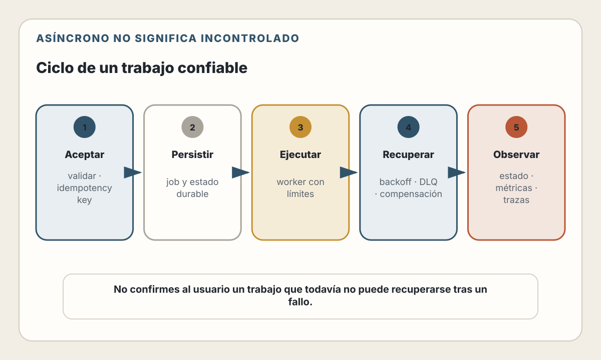
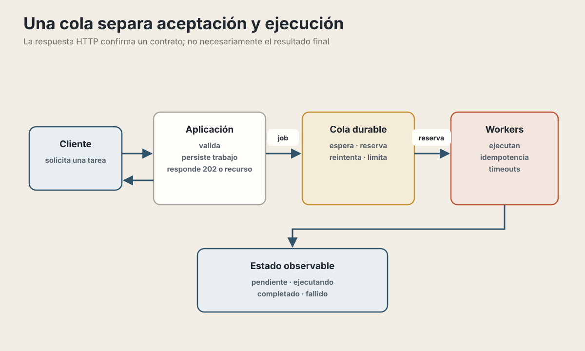
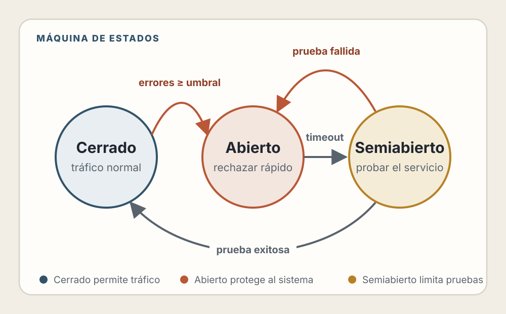
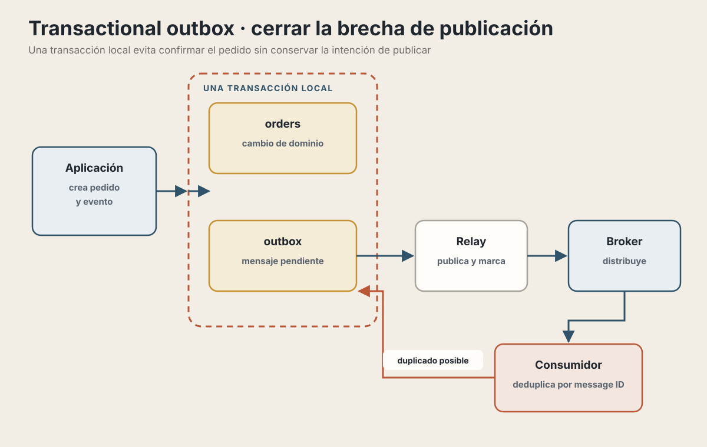
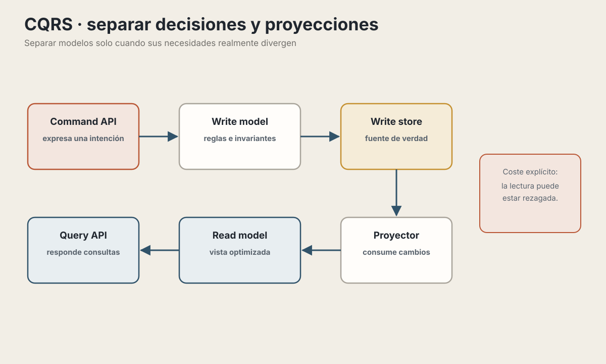
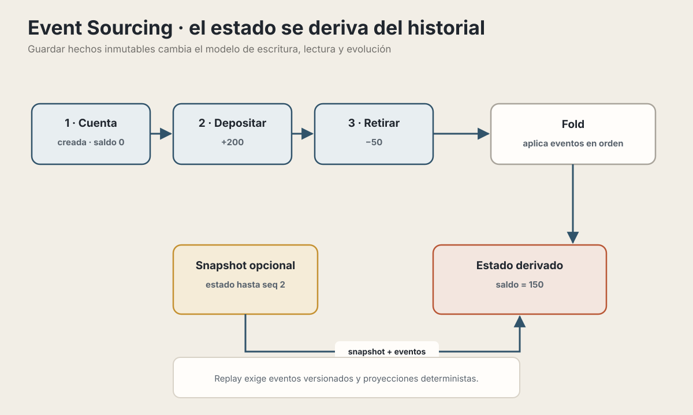

# 20. Manejo de Tareas Asíncronas

> "No hagas esperar al usuario por algo que puede pasar después."

---

## Objetivos de Aprendizaje

Al finalizar este capítulo, serás capaz de:

- Identificar qué tareas deben ejecutarse fuera del ciclo request-response
- Implementar colas de trabajo con BullMQ y Redis
- Aplicar patrones de resiliencia: retry con backoff y circuit breaker
- Diseñar sistemas event-driven con message brokers
- Entender cuándo CQRS y Event Sourcing aportan valor

---

## El Problema: El Request Que Tarda Demasiado

Un registro puede validar datos, crear el usuario, enviar correo, generar un
avatar, notificar a otro sistema y actualizar analítica antes de responder.
Cuando todo sucede dentro del request HTTP, la latencia y la disponibilidad de
cada dependencia pasan a formar parte del contrato que espera el usuario.

### La solución: procesar en background

<picture>
  <source media="(max-width: 820px)" srcset="../assets/diagrams/cap20-ciclo-job-confiable-mobile.svg">
  
</picture>

La respuesta HTTP puede terminar después de persistir el usuario y el trabajo.
El worker procesa correo, avatar o analítica posteriormente. La rapidez percibida
no basta: el sistema debe poder explicar si el trabajo está pendiente,
completado o necesita intervención.

---

## ¿Qué Mover a Background?

No todo debe procesarse en background. Aquí hay una guía:

| Mantener en el contrato síncrono | Evaluar como trabajo diferido |
|---|---|
| Validaciones que deciden si la acción se acepta | Correo, SMS y notificaciones push |
| Cambio de dominio que la respuesta afirma haber confirmado | Procesamiento de imágenes, video o PDF |
| Resultado imprescindible para el siguiente paso | Webhooks y sincronización con terceros |
| Lectura rápida necesaria para componer la respuesta | Reportes, mantenimiento e indexación secundaria |

Una llamada externa lenta no debe moverse automáticamente: si determina el
resultado de un pago o una reserva, el dominio necesita estados como
`pendiente`, `confirmado` o `resultado desconocido`, no una falsa confirmación.

📖 **Concepto**: Si el usuario no necesita el resultado para continuar, una tarea en segundo plano puede mejorar la experiencia. Antes de moverla, define qué confirmará la respuesta HTTP, cuánto retraso es aceptable y qué ocurrirá si la tarea nunca termina.

---

## Colas de Trabajo con BullMQ

### ¿Por qué BullMQ?

BullMQ es una biblioteca de colas para Node.js construida sobre Redis. Sirve como ejemplo concreto porque reúne productores, workers, reintentos y tareas programadas, pero no es una elección automática: hay que evaluar sus garantías, operación, coste y compatibilidad con la versión instalada.

<picture>
  <source media="(max-width: 820px)" srcset="../assets/diagrams/cap20-arquitectura-cola-mobile.svg">
  
</picture>

BullMQ concreta estas responsabilidades sobre Redis. La arquitectura sigue
necesitando una fuente clara de estado, idempotencia, límites de concurrencia,
timeouts y una política para trabajos que ya no deben reintentarse.

### Implementación básica

```typescript
// 1. Definir la cola
import { Queue, Worker } from 'bullmq';
import Redis from 'ioredis';

const connection = new Redis({
  host: process.env.REDIS_HOST,
  port: 6379,
  maxRetriesPerRequest: null  // Requerido por BullMQ
});

// Cola para emails
const emailQueue = new Queue('emails', { connection });

// 2. Agregar jobs desde tu aplicación
async function registerUser(userData: UserData) {
  // Operación síncrona: crear usuario
  const user = await prisma.user.create({ data: userData });

  // Operación async: minimizar datos personales en la cola
  await emailQueue.add('welcome', {
    userId: user.id
  }, {
    jobId: `welcome-${user.id}`,
    attempts: 3,           // Reintentar hasta 3 veces
    backoff: {
      type: 'exponential',
      delay: 1000
    }
  });

  return user;  // Responder inmediatamente
}

// 3. Procesar jobs con un worker (archivo separado)
const emailWorker = new Worker('emails', async (job) => {
  switch (job.name) {
    case 'welcome': {
      const user = await prisma.user.findUniqueOrThrow({
        where: { id: job.data.userId },
        select: { email: true, name: true }
      });
      await sendWelcomeEmail(user.email, user.name, {
        idempotencyKey: String(job.id)
      });
      break;
    }
    case 'password-reset':
      // Recuperar una solicitud vigente; no guardar el token en texto claro
      // dentro del payload durable de la cola.
      await sendPasswordReset(job.data.resetRequestId, String(job.id));
      break;
    default:
      throw new Error(`Unknown job type: ${job.name}`);
  }
}, {
  connection,
  concurrency: 5  // Procesar hasta 5 jobs en paralelo
});

// 4. Manejar eventos
emailWorker.on('completed', (job) => {
  console.log(`Job ${job.id} completed`);
});

emailWorker.on('failed', (job, err) => {
  console.error(`Job ${job?.id} failed:`, err.message);
  // Aquí podrías alertar a tu sistema de monitoreo
});
```

Este ejemplo todavía tiene una ventana de fallo: la base de datos puede confirmar el usuario y el proceso puede caer antes de ejecutar `queue.add()`. Una sección posterior introduce el patrón *transactional outbox* para cerrar esa brecha. Además, un `jobId` reduce duplicados mientras el job exista en Redis, pero no sustituye la idempotencia del efecto externo.

### Funciones avanzadas de BullMQ

| Feature | Uso | Ejemplo |
|---------|-----|---------|
| **Delayed jobs** | Ejecutar en el futuro | `{ delay: 60000 }` (1 min) |
| **Job Schedulers** | Crear ejecuciones recurrentes | `queue.upsertJobScheduler(...)` |
| **Priority** | Jobs urgentes primero | `{ priority: 1 }` (menor = más urgente) |
| **Rate limiting** | No saturar APIs externas | `{ limiter: { max: 100, duration: 60000 } }` |
| **Job dependencies** | Ejecutar después de otro | `{ parent: { queue: '...', id: '...' } }` |

Desde BullMQ 5.16, los **Job Schedulers** sustituyen las APIs antiguas de *repeatable jobs*:

```typescript
await maintenanceQueue.upsertJobScheduler(
  'daily-cleanup',
  { pattern: '0 0 3 * * *' },
  {
    name: 'cleanup-expired-sessions',
    data: {},
    opts: { attempts: 3 }
  }
);
```

### Ejemplo: Job con dependencias (Flows)

```typescript
import { FlowProducer } from 'bullmq';

const flowProducer = new FlowProducer({ connection });

// Crear un flujo: procesar imagen → generar thumbnail → notificar
await flowProducer.add({
  name: 'notify-user',
  queueName: 'notifications',
  data: { userId: '123', message: 'Tu imagen está lista' },
  children: [
    {
      name: 'generate-thumbnail',
      queueName: 'images',
      data: { imageId: 'abc', size: '200x200' },
      children: [
        {
          name: 'process-upload',
          queueName: 'images',
          data: { imageId: 'abc', url: 's3://...' }
        }
      ]
    }
  ]
});

// Se ejecuta: process-upload → generate-thumbnail → notify-user
```

### Monitoreo con Bull Board

```typescript
import { createBullBoard } from '@bull-board/api';
import { BullMQAdapter } from '@bull-board/api/bullMQAdapter';
import { ExpressAdapter } from '@bull-board/express';

const serverAdapter = new ExpressAdapter();
serverAdapter.setBasePath('/admin/queues');

createBullBoard({
  queues: [
    new BullMQAdapter(emailQueue),
    new BullMQAdapter(imageQueue),
  ],
  serverAdapter
});

app.use('/admin/queues', serverAdapter.getRouter());
```

💡 **Insight**: En producción, protege el dashboard de Bull Board con autenticación. No quieres que cualquiera vea y manipule tus colas.

---

## Patrones de Resiliencia

### El problema de las fallas

En sistemas distribuidos, las fallas son inevitables:

| Clase observada | Ejemplos | Respuesta posible |
|---|---|---|
| Posiblemente transitoria | Timeout, desconexión, `429`, algunos `503` | Reintento acotado si la operación es repetible; respetar `Retry-After` |
| Sobrecarga o degradación | Fallos repetidos y latencia creciente | Backpressure, límites de concurrencia y circuit breaker |
| No corregible mediante retry | Payload inválido, permiso denegado, credencial inválida, bug determinista | Detener, registrar, alertar y corregir la causa |

La clasificación depende de la operación y del contrato de la dependencia. Un
mismo código de estado no garantiza que repetir sea seguro.

### Retry con Exponential Backoff

Reintentar inmediatamente después de una falla puede empeorar las cosas. Antes del *backoff*, clasifica el error y comprueba que repetir la operación sea seguro:

```typescript
interface RetryConfig {
  maxAttempts: number;
  baseDelay: number;
  maxDelay: number;
  maxElapsedMs: number;
  signal?: AbortSignal;
  shouldRetry: (error: unknown) => boolean;
  retryAfterMs?: (error: unknown) => number | undefined;
}

async function withRetry<T>(
  fn: () => Promise<T>,
  config: RetryConfig
): Promise<T> {
  const startedAt = Date.now();

  for (let attempt = 1; attempt <= config.maxAttempts; attempt += 1) {
    config.signal?.throwIfAborted();

    try {
      return await fn();
    } catch (error) {
      const exhausted =
        attempt === config.maxAttempts ||
        Date.now() - startedAt >= config.maxElapsedMs;

      if (exhausted || !config.shouldRetry(error)) {
        throw error;
      }

      const serverDelay = config.retryAfterMs?.(error);
      const cap = Math.min(
        config.baseDelay * 2 ** (attempt - 1),
        config.maxDelay
      );
      // Full jitter distribuye los reintentos entre 0 y el límite calculado.
      const delay = serverDelay ?? Math.random() * cap;

      console.log(`Attempt ${attempt} failed, retrying in ${delay}ms...`);
      await sleep(delay, { signal: config.signal });
    }
  }

  throw new Error('Unreachable');
}

// Uso
const result = await withRetry(
  () => callExternalAPI(payload),
  {
    maxAttempts: 5,
    baseDelay: 1000,
    maxDelay: 60000,
    maxElapsedMs: 120000,
    signal: request.signal,
    shouldRetry: isTransientError,
    retryAfterMs: readRetryAfter
  }
);
```

El backoff aumenta un límite de espera entre intentos; el *jitter* elige un
instante dentro de ese límite para que muchos clientes no vuelvan a golpear la
dependencia al mismo tiempo. No prometas intervalos exactos: respeta el
presupuesto total, la cancelación y cualquier instrucción del servidor.

### Circuit Breaker

El Circuit Breaker previene llamadas a servicios que están fallando, dando tiempo para que se recuperen.

```typescript
import CircuitBreaker from 'opossum';

// Crear circuit breaker para una consulta a una API externa
const breaker = new CircuitBreaker(fetchShippingQuote, {
  timeout: 5000,           // Timeout por request
  errorThresholdPercentage: 50,  // Abre si 50% falla
  resetTimeout: 30000,     // Prueba la recuperación después de 30s
  volumeThreshold: 10,     // Mínimo 10 requests para evaluar
});

// Estados del circuit breaker
breaker.on('open', () => {
  console.warn('Circuit OPEN: shipping API is unavailable');
  alertOps('Shipping API circuit breaker opened');
});

breaker.on('halfOpen', () => {
  console.info('Circuit HALF-OPEN: Testing if Shipping API recovered');
});

breaker.on('close', () => {
  console.info('Circuit CLOSED: Shipping API is healthy again');
});

// Usar el breaker
async function getShippingQuote(request: ShippingQuoteRequest) {
  try {
    return await breaker.fire(request);
  } catch (error) {
    if (isCircuitOpen(error)) {
      // Un fallback solo es correcto si el producto admite este contrato.
      return { status: 'temporarily-unavailable' };
    }
    throw error;
  }
}
```

Un circuit breaker no repara credenciales, certificados ni datos inválidos. Tampoco autoriza a convertir silenciosamente un cobro fallido en un job: los pagos requieren un estado de dominio explícito, una clave de idempotencia y reconciliación.

<picture>
  <source media="(max-width: 600px)" srcset="../assets/diagrams/cap20-circuit-breaker-mobile.svg">
  
</picture>

### Combinando patrones

En producción, estos patrones trabajan juntos:

```typescript
// Pipeline de resiliencia completo
async function resilientExternalCall(payload: any) {
  // 1. Rate limiter: no exceder límites de la API
  await rateLimiter.acquire();

  // 2. Circuit breaker: no llamar si el servicio está caído
  return circuitBreaker.fire(async () => {
    // 3. Retry: manejar fallas transitorias
    return withRetry(
      () => externalAPI.call(payload),
      { maxAttempts: 3, baseDelay: 1000, maxDelay: 10000 }
    );
  });
}
```

⚠️ **Advertencia**: Solo reintenta operaciones **idempotentes** o protegidas por una clave de idempotencia aceptada por el receptor. Considera también el límite global de latencia: varias capas con sus propios reintentos pueden multiplicar la carga y exceder el tiempo disponible.

---

## Arquitectura Event-Driven

### De llamadas directas a eventos

Una llamada directa y un evento no son versiones «mala» y «buena» del mismo
diseño; expresan contratos temporales diferentes:

| Aspecto | Llamada directa | Evento |
|---|---|---|
| Conocimiento | El emisor conoce al receptor y la operación | El productor publica un hecho; los consumidores evolucionan por separado |
| Resultado | Puede formar parte de la respuesta actual | Normalmente se observa después |
| Fallo | Se propaga dentro del presupuesto de la llamada | Se maneja con redelivery, idempotencia, DLQ y reconciliación |
| Cambio de consumidor | Puede exigir modificar la orquestación | Puede añadirse una suscripción, pero el contrato del evento debe sostenerla |
| Coste | Acoplamiento temporal y latencia de dependencia | Broker, versionado, duplicados y consistencia eventual |

### La brecha de publicación y el *transactional outbox*

Guardar una orden y publicar `order.created` son operaciones sobre dos sistemas distintos. Cualquiera de estas secuencias pierde una garantía:

- Confirmar la base de datos y publicar después puede dejar una orden sin evento si el proceso cae.
- Publicar primero puede emitir un evento sobre una orden cuya transacción finalmente se revierte.

El patrón **transactional outbox** guarda el cambio de dominio y un registro pendiente en la misma transacción local:

<picture>
  <source media="(max-width: 820px)" srcset="../assets/diagrams/cap20-outbox-eventos-mobile.svg">
  
</picture>

```typescript
const order = await prisma.$transaction(async (tx) => {
  const created = await tx.order.create({
    data: orderInput
  });

  await tx.outboxMessage.create({
    data: {
      id: crypto.randomUUID(),
      topic: 'order.created',
      aggregateId: created.id,
      payload: {
        orderId: created.id,
        userId: created.userId
      }
    }
  });

  return created;
});
```

Un publicador independiente reclama registros pendientes, publica el evento y marca cada registro como enviado. Puede usar `FOR UPDATE SKIP LOCKED`, un arrendamiento con vencimiento o Change Data Capture, según el motor y la infraestructura.

Todavía existe una ventana: el publicador puede enviar el mensaje y caer antes de marcarlo como enviado. Por eso el outbox evita mensajes perdidos entre el `commit` y el broker, pero normalmente implica **entrega al menos una vez**. El consumidor debe tolerar duplicados mediante un identificador estable del mensaje y una operación idempotente.

### Message Brokers: Kafka vs RabbitMQ

| Aspecto | RabbitMQ | Kafka |
|---------|----------|-------|
| **Abstracción principal** | Exchanges, colas y también streams | Log distribuido por particiones |
| **Retención habitual** | La cola elimina mensajes confirmados; streams tienen otra semántica | Retención configurable independiente del consumo |
| **Orden** | Depende de cola, consumidores, prioridades y redelivery | Dentro de cada partición |
| **Replay** | Requiere elegir la modalidad y retención adecuadas | Es parte central del modelo |
| **Operación** | Depende de topología, tipo de cola y garantías | Depende de particionado, replicación y grupos |

Elige a partir de la semántica requerida —trabajo competitivo, fan-out, replay, orden, retención y tolerancia a fallos— y valida con el volumen real. El nombre del producto no sustituye ese análisis.

### Implementación con RabbitMQ

```typescript
import amqp from 'amqplib';
import { once } from 'node:events';

// Publisher (Order Service)
class OrderEventPublisher {
  private channel: amqp.ConfirmChannel;

  async connect() {
    const connection = await amqp.connect(process.env.RABBITMQ_URL!);
    this.channel = await connection.createConfirmChannel();

    await this.channel.assertExchange('orders', 'topic', { durable: true });
  }

  async publishOrderCreated(order: Order, messageId: string) {
    const event = {
      id: messageId,
      type: 'order.created',
      version: 1,
      occurredAt: new Date().toISOString(),
      data: {
        orderId: order.id,
        userId: order.userId
      }
    };

    const writable = this.channel.publish(
      'orders',
      'order.created',
      Buffer.from(JSON.stringify(event)),
      {
        persistent: true,
        contentType: 'application/json',
        messageId
      }
    );

    // publish() puede aplicar backpressure sobre el socket.
    if (!writable) await once(this.channel, 'drain');

    // Esperar a que el broker asuma responsabilidad por lo publicado.
    await this.channel.waitForConfirms();
  }
}

// Consumer de una proyección interna
class OrderProjectionConsumer {
  async start() {
    const connection = await amqp.connect(process.env.RABBITMQ_URL!);
    const channel = await connection.createChannel();

    const queue = await channel.assertQueue('order-projection', { durable: true });

    await channel.bindQueue(queue.queue, 'orders', 'order.*');
    await channel.prefetch(20);

    channel.consume(queue.queue, async (msg) => {
      if (!msg) return;

      try {
        const event = parseAndValidateOrderEvent(msg.content);
        await this.processOnce(event);
        // Confirmar únicamente después de persistir el efecto.
        channel.ack(msg);
      } catch (error) {
        // Este ejemplo envía el fallo a la DLQ. Una topología de reintentos
        // debe limitar intentos y retrasarlos; requeue=true puede crear un loop.
        channel.nack(msg, false, false);
      }
    }, { noAck: false });
  }

  private async processOnce(event: OrderEvent) {
    await prisma.$transaction(async (tx) => {
      const claim = await tx.processedMessage.createMany({
        data: [{
          consumer: 'order-projection',
          messageId: event.id
        }],
        skipDuplicates: true
      });

      if (claim.count === 0) {
        return; // Este consumidor ya aplicó el mensaje.
      }

      await tx.orderProjection.upsert({
        where: { orderId: event.data.orderId },
        create: {
          orderId: event.data.orderId,
          userId: event.data.userId
        },
        update: {
          userId: event.data.userId
        }
      });
    });
  }
}
```

La tabla `processed_messages` necesita una restricción única sobre
`(consumer, message_id)`. En este caso, deduplicación y actualización comparten
base de datos y transacción. Para un efecto externo como enviar un correo no
existe una transacción común con el proveedor: usa su clave de idempotencia si
la ofrece o modela explícitamente intentos y resultados desconocidos.

`persistent: true`, un exchange durable y una cola durable son necesarios, pero
no bastan por separado. Los **publisher confirms** indican que RabbitMQ asumió
responsabilidad por el mensaje; no cierran la brecha con la transacción de la
aplicación, que sigue correspondiendo al outbox.

### Dead Letter Queues

Una DLQ recibe mensajes rechazados o expirados según la configuración. El broker no sabe por sí solo cuántos intentos de negocio quieres hacer:

```typescript
// Configurar dead letter exchange
await channel.assertExchange('orders-dlx', 'direct', { durable: true });
await channel.assertQueue('orders-dead-letter', { durable: true });
await channel.bindQueue('orders-dead-letter', 'orders-dlx', 'failed');

// Cola principal con dead letter configurado
await channel.assertQueue('email-service-orders', {
  durable: true,
  deadLetterExchange: 'orders-dlx',
  deadLetterRoutingKey: 'failed'
});
```

Para reintentos diferidos se suelen usar colas de retry con TTL y un contador de
intentos, o una funcionalidad administrada equivalente. Limita los ciclos y
alerta sobre la DLQ. En RabbitMQ, las políticas operativas son preferibles a
argumentos rígidos cuando necesitas cambiar la topología sin redeclarar colas.

---

## CQRS y Event Sourcing (Introducción)

Estos son patrones avanzados. No los necesitas para la mayoría de aplicaciones, pero es importante saber cuándo considerarlos.

### CQRS: Command Query Responsibility Segregation

📖 **Concepto**: Separar el modelo de escritura (commands) del modelo de lectura (queries).

<picture>
  <source media="(max-width: 820px)" srcset="../assets/diagrams/cap20-cqrs-proyeccion-mobile.svg">
  
</picture>

CQRS no exige dos bases de datos ni Event Sourcing. Puede empezar separando
interfaces y modelos dentro de una misma aplicación. Cuando la proyección es
asíncrona, el producto debe definir cómo comunica y repara el retraso de lectura.

### Event Sourcing

📖 **Concepto**: El flujo de eventos es la fuente de verdad y el estado se deriva de él. En sistemas grandes se suelen usar *snapshots* para no reconstruir siempre desde el primer evento.

<picture>
  <source media="(max-width: 820px)" srcset="../assets/diagrams/cap20-event-sourcing-mobile.svg">
  
</picture>

Un historial de eventos no es automáticamente una auditoría legal ni un log
inmutable: esas propiedades dependen de acceso, integridad, retención y
controles operativos. El replay también exige eventos versionados y
proyecciones deterministas o migrables.

### ¿Cuándo usar CQRS / Event Sourcing?

| Señal | CQRS | Event Sourcing |
|---|---|---|
| Escrituras y lecturas necesitan modelos muy distintos | Puede aportar | No es requisito |
| Debes reconstruir estado histórico desde hechos del dominio | Puede acompañar | Señal central |
| CRUD y reportes caben en el mismo modelo | Probablemente sobra | Probablemente sobra |
| Equipo sin estrategia de versionado, replay y reparación | Mantén separación simple | No lo adoptes todavía |
| Único motivo: «quizá lo necesitemos» | No basta | No basta |

💡 **Insight**: CQRS y Event Sourcing tienen costes de versionado, proyecciones, consistencia eventual y operación. Empieza con el modelo más sencillo que satisfaga los requisitos y adopta estos patrones cuando exista evidencia concreta.

---

## 🤖 Usando IA para Tareas Asíncronas

### Diseño de workers

```
Prompt: "Tengo un sistema de e-commerce que necesita:
- Enviar email de confirmación al crear orden
- Actualizar inventario
- Notificar al warehouse
- Generar factura PDF

¿Debería usar una cola para todo o colas separadas?
¿Cómo manejo si el servicio de email falla?"
```

La IA puede ayudar a diseñar la estructura de colas y estrategias de error handling.

### Debugging de jobs fallidos

```
Prompt: "Este job de BullMQ falla intermitentemente con este error:
[error log]. El job procesa webhooks de Stripe. ¿Qué podría
estar causando el problema y cómo lo depuro?"
```

### Limitaciones

⚠️ **La IA no puede:**
- Ver el estado actual de tus colas en producción
- Saber qué volumen de jobs procesas
- Conocer las características de tus servicios externos
- Depurar condiciones de carrera sin el contexto completo

Siempre complementa con métricas y logs reales.

---

## Resumen

- **Background jobs**: Mueve trabajo fuera del request cuando el contrato admita procesamiento diferido. BullMQ + Redis es una opción, no un estándar universal.

- **Retry + Backoff**: Clasifica la falla, respeta cancelación y `Retry-After`, y aplica presupuesto y jitter. Solo reintenta operaciones idempotentes o protegidas.

- **Circuit Breaker**: Previene cascadas de fallas cortando llamadas a servicios que están fallando.

- **Event-Driven Architecture**: Desacopla temporalmente productores y consumidores, pero introduce entrega duplicada, contratos versionados y consistencia eventual. El outbox evita perder el evento tras el `commit`.

- **CQRS/Event Sourcing**: Patrones avanzados para escenarios específicos. No los uses "por si acaso" — tienen costos significativos.

---

## Ejercicios

1. **Diseño de colas**: Tu aplicación permite a usuarios subir videos que se transcodifican a múltiples resoluciones. Diseña el sistema de colas: ¿cuántas colas? ¿cómo manejas si la transcodificación falla a la mitad? ¿cómo notificas al usuario cuando termina?

2. **Circuit breaker**: tu servicio depende de una API de pagos externa. Diseña
   un circuit breaker y modela qué ve el usuario cuando el resultado es
   desconocido. Explica cómo una clave de idempotencia, la consulta posterior
   del estado y la reconciliación evitan cobrar dos veces; no encoles un cobro
   como *fallback* silencioso.

3. **Event-driven refactor**: Tienes un `OrderService.createOrder()` que llama directamente a `InventoryService`, `PaymentService`, `EmailService` y `AnalyticsService`. Refactoriza para usar eventos. ¿Qué eventos publicarías? ¿Qué pasa si uno de los consumidores falla?

4. **¿CQRS o no?**: Tu sistema tiene un dashboard que muestra métricas agregadas de ventas por región, producto y período. Las queries son lentas porque agregan sobre millones de filas. ¿Aplicarías CQRS? ¿Cómo sincronizarías el read model?

---

## Referencias

- BullMQ. *Documentation*. https://docs.bullmq.io/
- BullMQ. *Job Schedulers*. https://docs.bullmq.io/guide/job-schedulers
- Microsoft. *Circuit Breaker Pattern*. https://learn.microsoft.com/azure/architecture/patterns/circuit-breaker
- RabbitMQ. *Tutorials*. https://www.rabbitmq.com/getstarted.html
- RabbitMQ. *Reliability Guide*. https://www.rabbitmq.com/docs/reliability
- Opossum. *Node.js Circuit Breaker*. https://nodeshift.dev/opossum/
- Fowler, M. *CQRS*. https://martinfowler.com/bliki/CQRS.html
- Event-Driven.io. *Event Sourcing with TypeScript and Node.js*. https://event-driven.io/en/type_script_node_js_event_sourcing/

---

**Anterior**: [Persistencia y Bases de Datos](./19-persistencia.md) | **Siguiente**: [Testing](./21-testing.md)
