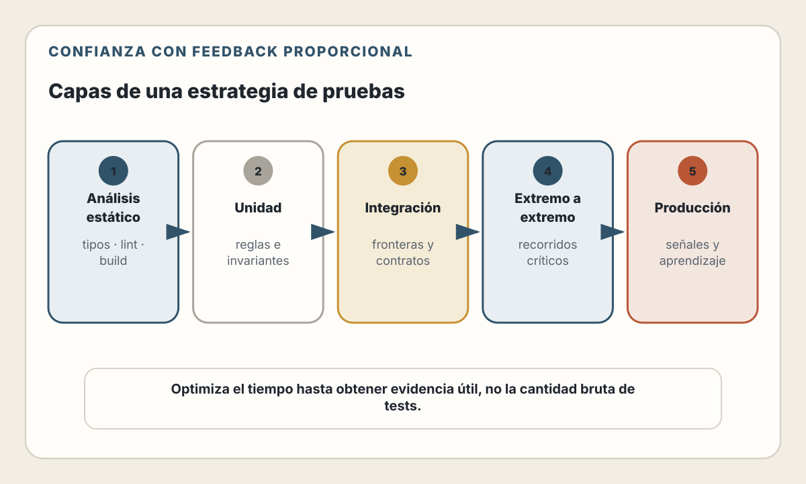
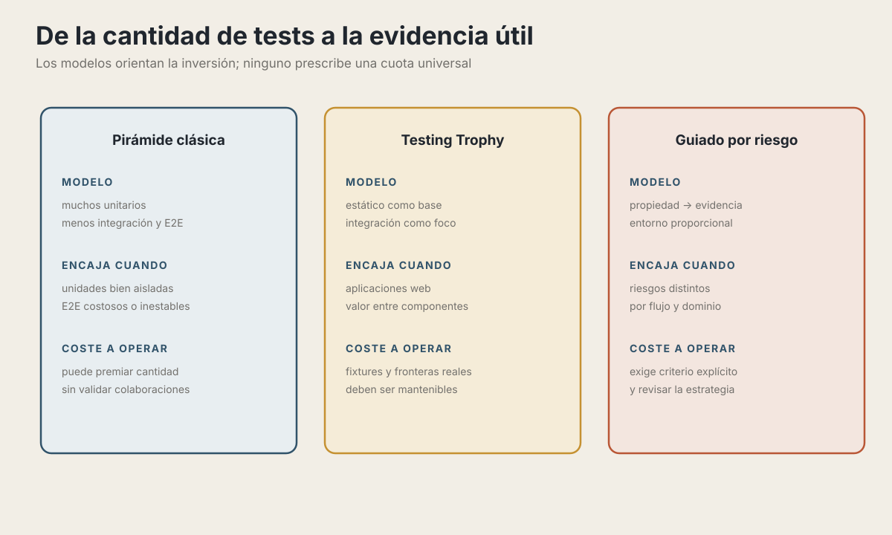
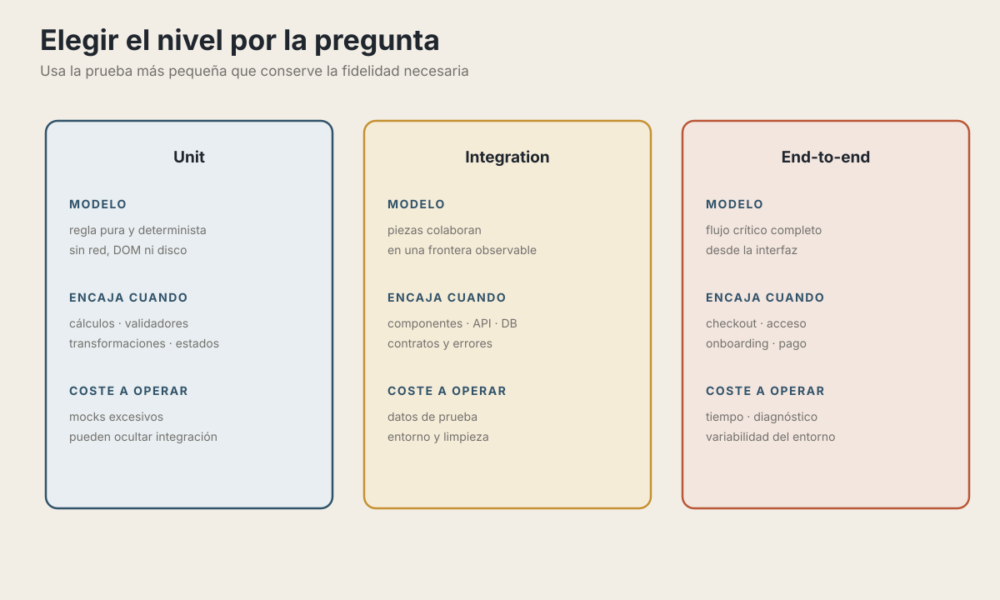
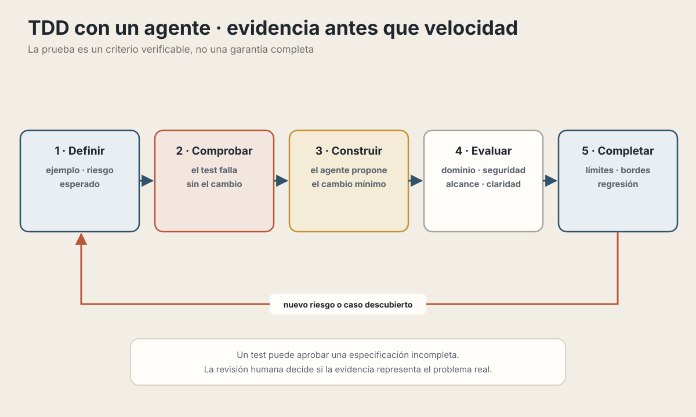

# 21. Estrategias de Testing

> "Write tests. Not too many. Mostly integration." — Kent C. Dodds

---

## Objetivos de Aprendizaje

Al finalizar este capítulo, serás capaz de:

- Elegir el nivel de testing apropiado para cada situación (unit, integration, e2e)
- Aplicar el modelo del Testing Trophy en aplicaciones modernas
- Implementar tests con Vitest, Testing Library y Playwright
- Diseñar tests que den confianza real sin volverse una carga de mantenimiento
- Usar herramientas de IA para acelerar la escritura de tests

## Modelo mental

Una prueba no demuestra que el sistema sea correcto en general. Aporta evidencia
sobre una propiedad concreta, bajo unas condiciones determinadas. Elige cada
nivel por el riesgo que cubre y por la fidelidad del entorno que necesita.

<picture>
  <source media="(max-width: 820px)" srcset="../assets/diagrams/cap21-estrategia-testing-mobile.svg">
  
</picture>

---

## El Problema: Tests Que No Dan Confianza

> **Tres escenarios, una misma pregunta:** sin pruebas no hay evidencia; una gran cantidad de pruebas aisladas puede seguir sin cubrir el comportamiento real; una estrategia útil protege los flujos y riesgos que importan. El objetivo no es acumular casos, sino poder explicar qué confianza aporta cada uno.

El objetivo del testing no es alcanzar un número mágico de cobertura. Es **ganar confianza** de que tu aplicación funciona como debe.

---

## Del Testing Pyramid al Testing Trophy

### La Pirámide Tradicional (2009)

Martin Fowler popularizó la pirámide de testing:

La pirámide proponía muchas pruebas unitarias, algunas de integración y pocas pruebas de extremo a extremo. Su aporte duradero es pensar en coste y alcance; el número de pruebas de cada nivel depende del sistema y de sus riesgos.

Esta estrategia asumía que:
- Los unit tests son baratos de escribir y mantener
- Los tests de integración son lentos y complicados
- Los E2E son frágiles y deben minimizarse

En aplicaciones web actuales, estas suposiciones ya no son universales.

### El Testing Trophy (2018-presente)

Kent C. Dodds propuso un modelo diferente, más alineado con aplicaciones web modernas:

<picture>
  <source media="(max-width: 820px)" srcset="../assets/diagrams/cap21-modelos-confianza-mobile.svg">
  
</picture>

**Diferencias clave:**

| Aspecto | Pirámide | Trophy |
|---------|----------|--------|
| Foco principal | Unit tests | Integration tests |
| Static analysis | No incluido | Base fundamental |
| E2E | Evitar | Usar estratégicamente |
| Mocks | Abundantes | Mínimos |
| Confianza | En funciones | En comportamiento |

📖 **Concepto**: El Trophy prioriza tests que verifican cómo los componentes trabajan **juntos**, no cómo funcionan aislados. Esto es especialmente relevante en aplicaciones web donde el valor está en la integración.

---

## Nivel 1: Static Analysis

El nivel más barato y rápido de testing. Atrapa errores antes de ejecutar código.

### TypeScript: Tu Primera Línea de Defensa

```typescript
// ❌ Sin TypeScript: Error en runtime
function calculateDiscount(price, percentage) {
  return price - (price * percentage / 100);
}

calculateDiscount("100", "10");  // NaN - descubierto en producción 😱

// ✅ Con TypeScript: Error en tiempo de compilación
function calculateDiscount(price: number, percentage: number): number {
  return price - (price * percentage / 100);
}

calculateDiscount("100", "10");  // ❌ Error: Argument of type 'string'...
```

### ESLint: Más Allá de Sintaxis

```javascript
// .eslintrc.js - Reglas que atrapan bugs reales
module.exports = {
  extends: [
    'eslint:recommended',
    '@typescript-eslint/recommended',
    'plugin:react-hooks/recommended'  // Evita errores comunes con hooks
  ],
  rules: {
    // Evita comparaciones siempre true/false
    '@typescript-eslint/no-unnecessary-condition': 'error',

    // Requiere manejar promesas
    '@typescript-eslint/no-floating-promises': 'error',

    // Evita usar 'any'
    '@typescript-eslint/no-explicit-any': 'warn',

    // Requiere exhaustive checks en switch
    '@typescript-eslint/switch-exhaustiveness-check': 'error'
  }
};
```

💡 **Insight**: TypeScript y ESLint detectan determinadas clases de defectos
antes de ejecutar el programa. No sustituyen las pruebas: no pueden demostrar
que una regla de negocio o una integración se comporten correctamente.

---

## Nivel 2: Unit Tests

Tests para lógica pura que no depende de I/O, DOM, o servicios externos.

### Cuándo Escribir Unit Tests

<picture>
  <source media="(max-width: 820px)" srcset="../assets/diagrams/cap21-eleccion-nivel-prueba-mobile.svg">
  
</picture>

### Vitest: El Estándar Moderno

Vitest es el framework de testing recomendado para proyectos con Vite (y funciona excelente en cualquier proyecto TypeScript).

```typescript
// src/utils/pricing.ts
export function calculateTotal(items: CartItem[]): number {
  return items.reduce((sum, item) => sum + item.price * item.quantity, 0);
}

export function applyDiscount(total: number, discountPercent: number): number {
  if (discountPercent < 0 || discountPercent > 100) {
    throw new Error('Discount must be between 0 and 100');
  }
  return total * (1 - discountPercent / 100);
}

export function calculateShipping(total: number, country: string): number {
  if (total >= 100) return 0;  // Envío gratis sobre $100
  return country === 'US' ? 5.99 : 15.99;
}
```

```typescript
// src/utils/pricing.test.ts
import { describe, it, expect } from 'vitest';
import { calculateTotal, applyDiscount, calculateShipping } from './pricing';

describe('pricing utilities', () => {
  describe('calculateTotal', () => {
    it('sums item prices correctly', () => {
      const items = [
        { id: '1', price: 10, quantity: 2 },
        { id: '2', price: 25, quantity: 1 }
      ];

      expect(calculateTotal(items)).toBe(45);
    });

    it('returns 0 for empty cart', () => {
      expect(calculateTotal([])).toBe(0);
    });
  });

  describe('applyDiscount', () => {
    it('applies percentage discount correctly', () => {
      expect(applyDiscount(100, 20)).toBe(80);
      expect(applyDiscount(50, 10)).toBe(45);
    });

    it('throws for invalid discount percentages', () => {
      expect(() => applyDiscount(100, -10)).toThrow();
      expect(() => applyDiscount(100, 150)).toThrow();
    });
  });

  describe('calculateShipping', () => {
    it('is free for orders over $100', () => {
      expect(calculateShipping(100, 'US')).toBe(0);
      expect(calculateShipping(150, 'MX')).toBe(0);
    });

    it('charges less for US orders', () => {
      expect(calculateShipping(50, 'US')).toBe(5.99);
      expect(calculateShipping(50, 'MX')).toBe(15.99);
    });
  });
});
```

### Property-Based Testing

Para lógica matemática o transformaciones, considera tests basados en propiedades:

```typescript
import { describe, it, expect } from 'vitest';
import fc from 'fast-check';
import { applyDiscount } from './pricing';

describe('applyDiscount properties', () => {
  it('never returns more than the original', () => {
    fc.assert(
      fc.property(
        fc.float({ min: 0, max: 10000 }),     // total
        fc.float({ min: 0, max: 100 }),        // discount
        (total, discount) => {
          const result = applyDiscount(total, discount);
          return result <= total;
        }
      )
    );
  });

  it('0% discount returns original price', () => {
    fc.assert(
      fc.property(
        fc.float({ min: 0, max: 10000 }),
        (total) => applyDiscount(total, 0) === total
      )
    );
  });

  it('100% discount returns zero', () => {
    fc.assert(
      fc.property(
        fc.float({ min: 0, max: 10000 }),
        (total) => applyDiscount(total, 100) === 0
      )
    );
  });
});
```

---

## Nivel 3: Integration Tests (El Foco Principal)

Los integration tests verifican que múltiples unidades trabajan correctamente **juntas**. Aquí es donde debes invertir la mayor parte de tu esfuerzo.

### Testing de Componentes React

```tsx
// src/components/ProductCard.tsx
interface ProductCardProps {
  product: Product;
  onAddToCart: (product: Product) => void;
}

export function ProductCard({ product, onAddToCart }: ProductCardProps) {
  const [quantity, setQuantity] = useState(1);

  return (
    <div className="product-card">
      
      <h3>{product.name}</h3>
      <p className="price">${product.price.toFixed(2)}</p>

      <div className="quantity-selector">
        <button
          onClick={() => setQuantity(q => Math.max(1, q - 1))}
          disabled={quantity <= 1}
        >
          -
        </button>
        <span>{quantity}</span>
        <button onClick={() => setQuantity(q => q + 1)}>+</button>
      </div>

      <button
        onClick={() => onAddToCart({ ...product, quantity })}
        disabled={!product.inStock}
      >
        {product.inStock ? 'Add to Cart' : 'Out of Stock'}
      </button>
    </div>
  );
}
```

```tsx
// src/components/ProductCard.test.tsx
import { describe, it, expect, vi } from 'vitest';
import { render, screen } from '@testing-library/react';
import userEvent from '@testing-library/user-event';
import { ProductCard } from './ProductCard';

const mockProduct = {
  id: '1',
  name: 'Mechanical Keyboard',
  price: 149.99,
  imageUrl: '/keyboard.jpg',
  inStock: true
};

describe('ProductCard', () => {
  it('displays product information', () => {
    render(<ProductCard product={mockProduct} onAddToCart={() => {}} />);

    expect(screen.getByText('Mechanical Keyboard')).toBeInTheDocument();
    expect(screen.getByText('$149.99')).toBeInTheDocument();
    expect(screen.getByRole('img')).toHaveAttribute('alt', 'Mechanical Keyboard');
  });

  it('allows adjusting quantity before adding to cart', async () => {
    const user = userEvent.setup();
    const onAddToCart = vi.fn();

    render(<ProductCard product={mockProduct} onAddToCart={onAddToCart} />);

    // Incrementar cantidad a 3
    await user.click(screen.getByText('+'));
    await user.click(screen.getByText('+'));

    expect(screen.getByText('3')).toBeInTheDocument();

    // Agregar al carrito
    await user.click(screen.getByText('Add to Cart'));

    expect(onAddToCart).toHaveBeenCalledWith({
      ...mockProduct,
      quantity: 3
    });
  });

  it('disables add button when out of stock', () => {
    const outOfStock = { ...mockProduct, inStock: false };

    render(<ProductCard product={outOfStock} onAddToCart={() => {}} />);

    expect(screen.getByText('Out of Stock')).toBeDisabled();
  });

  it('prevents quantity from going below 1', async () => {
    const user = userEvent.setup();

    render(<ProductCard product={mockProduct} onAddToCart={() => {}} />);

    const decreaseButton = screen.getByText('-');
    expect(decreaseButton).toBeDisabled();

    // Incrementar y luego decrementar
    await user.click(screen.getByText('+'));
    expect(decreaseButton).toBeEnabled();

    await user.click(decreaseButton);
    expect(decreaseButton).toBeDisabled();
  });
});
```

### Testing de APIs y Servicios

```typescript
// src/services/orders.ts
export class OrderService {
  constructor(
    private orderRepo: OrderRepository,
    private paymentGateway: PaymentGateway,
    private emailService: EmailService
  ) {}

  async createOrder(userId: string, items: CartItem[]): Promise<Order> {
    // Validar items
    if (items.length === 0) {
      throw new Error('Cannot create empty order');
    }

    // Calcular total
    const total = items.reduce((sum, item) =>
      sum + item.price * item.quantity, 0
    );

    // Crear orden
    const order = await this.orderRepo.create({
      userId,
      items,
      total,
      status: 'pending'
    });

    return order;
  }

  async processPayment(orderId: string, paymentMethod: PaymentMethod): Promise<Order> {
    const order = await this.orderRepo.findById(orderId);

    if (!order) {
      throw new Error('Order not found');
    }

    if (order.status !== 'pending') {
      throw new Error('Order already processed');
    }

    try {
      await this.paymentGateway.charge(order.total, paymentMethod);

      const updatedOrder = await this.orderRepo.update(orderId, {
        status: 'paid'
      });

      await this.emailService.sendOrderConfirmation(order.userId, updatedOrder);

      return updatedOrder;
    } catch (error) {
      await this.orderRepo.update(orderId, { status: 'failed' });
      throw error;
    }
  }
}
```

```typescript
// src/services/orders.test.ts
import { describe, it, expect, vi, beforeEach } from 'vitest';
import { OrderService } from './orders';

describe('OrderService', () => {
  // Mocks mínimos - solo lo necesario
  const mockOrderRepo = {
    create: vi.fn(),
    findById: vi.fn(),
    update: vi.fn()
  };

  const mockPaymentGateway = {
    charge: vi.fn()
  };

  const mockEmailService = {
    sendOrderConfirmation: vi.fn()
  };

  let service: OrderService;

  beforeEach(() => {
    vi.clearAllMocks();
    service = new OrderService(
      mockOrderRepo as any,
      mockPaymentGateway as any,
      mockEmailService as any
    );
  });

  describe('createOrder', () => {
    it('creates order with correct total', async () => {
      const items = [
        { id: '1', price: 10, quantity: 2 },
        { id: '2', price: 25, quantity: 1 }
      ];

      mockOrderRepo.create.mockResolvedValue({
        id: 'order-1',
        items,
        total: 45,
        status: 'pending'
      });

      const result = await service.createOrder('user-1', items);

      expect(mockOrderRepo.create).toHaveBeenCalledWith({
        userId: 'user-1',
        items,
        total: 45,
        status: 'pending'
      });
      expect(result.total).toBe(45);
    });

    it('rejects empty orders', async () => {
      await expect(service.createOrder('user-1', []))
        .rejects.toThrow('Cannot create empty order');
    });
  });

  describe('processPayment', () => {
    const pendingOrder = {
      id: 'order-1',
      userId: 'user-1',
      total: 100,
      status: 'pending'
    };

    it('charges payment and updates order status', async () => {
      mockOrderRepo.findById.mockResolvedValue(pendingOrder);
      mockOrderRepo.update.mockResolvedValue({ ...pendingOrder, status: 'paid' });
      mockPaymentGateway.charge.mockResolvedValue({ success: true });

      const result = await service.processPayment('order-1', { type: 'card' });

      expect(mockPaymentGateway.charge).toHaveBeenCalledWith(100, { type: 'card' });
      expect(mockOrderRepo.update).toHaveBeenCalledWith('order-1', { status: 'paid' });
      expect(mockEmailService.sendOrderConfirmation).toHaveBeenCalled();
      expect(result.status).toBe('paid');
    });

    it('marks order as failed if payment fails', async () => {
      mockOrderRepo.findById.mockResolvedValue(pendingOrder);
      mockPaymentGateway.charge.mockRejectedValue(new Error('Card declined'));

      await expect(service.processPayment('order-1', { type: 'card' }))
        .rejects.toThrow('Card declined');

      expect(mockOrderRepo.update).toHaveBeenCalledWith('order-1', { status: 'failed' });
      expect(mockEmailService.sendOrderConfirmation).not.toHaveBeenCalled();
    });

    it('prevents double processing', async () => {
      mockOrderRepo.findById.mockResolvedValue({ ...pendingOrder, status: 'paid' });

      await expect(service.processPayment('order-1', { type: 'card' }))
        .rejects.toThrow('Order already processed');

      expect(mockPaymentGateway.charge).not.toHaveBeenCalled();
    });
  });
});
```

### Testing con Base de Datos Real

Para tests de integración más completos, usa una base de datos real (en contenedor):

```typescript
// tests/integration/orders.integration.test.ts
import { describe, it, expect, beforeAll, afterAll, beforeEach } from 'vitest';
import { PostgreSqlContainer } from '@testcontainers/postgresql';
import { drizzle } from 'drizzle-orm/postgres-js';
import postgres from 'postgres';
import { OrderRepository } from '../../src/repositories/orders';
import { migrate } from '../../src/db/migrate';

describe('OrderRepository Integration', () => {
  let container: PostgreSqlContainer;
  let db: ReturnType<typeof drizzle>;
  let repo: OrderRepository;

  beforeAll(async () => {
    // Iniciar PostgreSQL en contenedor
    container = await new PostgreSqlContainer().start();

    const client = postgres(container.getConnectionUri());
    db = drizzle(client);

    // Aplicar migraciones
    await migrate(db);

    repo = new OrderRepository(db);
  }, 60000); // Timeout largo para levantar contenedor

  afterAll(async () => {
    await container.stop();
  });

  beforeEach(async () => {
    // Limpiar datos entre tests
    await db.delete(orders);
  });

  it('persists and retrieves orders correctly', async () => {
    const order = await repo.create({
      userId: 'user-1',
      items: [{ id: '1', price: 50, quantity: 2 }],
      total: 100,
      status: 'pending'
    });

    const retrieved = await repo.findById(order.id);

    expect(retrieved).toMatchObject({
      userId: 'user-1',
      total: 100,
      status: 'pending'
    });
    expect(retrieved?.items).toHaveLength(1);
  });

  it('finds all orders for a user', async () => {
    await repo.create({ userId: 'user-1', items: [], total: 50, status: 'pending' });
    await repo.create({ userId: 'user-1', items: [], total: 75, status: 'paid' });
    await repo.create({ userId: 'user-2', items: [], total: 100, status: 'pending' });

    const userOrders = await repo.findByUserId('user-1');

    expect(userOrders).toHaveLength(2);
    expect(userOrders.map(o => o.total)).toContain(50);
    expect(userOrders.map(o => o.total)).toContain(75);
  });
});
```

⚠️ **Advertencia**: Las pruebas con contenedores son más lentas. Úsalas para
verificar la integración real con la base de datos, no para cada caso límite.
Los casos límite pueden probarse con dobles.

---

## Nivel 4: End-to-End Tests

Tests que interactúan con la aplicación como lo haría un usuario real, en un navegador real.

### Playwright: El Estándar E2E Moderno

```typescript
// e2e/checkout.spec.ts
import { test, expect } from '@playwright/test';

test.describe('Checkout Flow', () => {
  test.beforeEach(async ({ page }) => {
    // Seed de datos para tests
    await page.request.post('/api/test/seed', {
      data: { scenario: 'checkout-test' }
    });
  });

  test('complete purchase flow', async ({ page }) => {
    // 1. Navegar al catálogo
    await page.goto('/products');

    // 2. Agregar producto al carrito
    await page.getByRole('button', { name: 'Add to Cart' }).first().click();

    // 3. Verificar que se agregó
    await expect(page.getByTestId('cart-count')).toHaveText('1');

    // 4. Ir al checkout
    await page.getByRole('link', { name: 'Cart' }).click();
    await page.getByRole('button', { name: 'Checkout' }).click();

    // 5. Llenar formulario de envío
    await page.getByLabel('Email').fill('test@example.com');
    await page.getByLabel('Address').fill('123 Test St');
    await page.getByLabel('City').fill('Test City');
    await page.getByLabel('ZIP').fill('12345');

    // 6. Proceder al pago
    await page.getByRole('button', { name: 'Continue to Payment' }).click();

    // 7. Llenar datos de pago (usando Stripe test mode)
    const stripeFrame = page.frameLocator('iframe[name^="__privateStripeFrame"]').first();
    await stripeFrame.getByPlaceholder('Card number').fill('4242424242424242');
    await stripeFrame.getByPlaceholder('MM / YY').fill('12/30');
    await stripeFrame.getByPlaceholder('CVC').fill('123');

    // 8. Completar compra
    await page.getByRole('button', { name: 'Pay Now' }).click();

    // 9. Verificar confirmación
    await expect(page.getByRole('heading', { name: 'Order Confirmed!' }))
      .toBeVisible({ timeout: 10000 });
    await expect(page.getByText('Order #')).toBeVisible();
  });

  test('shows error for invalid card', async ({ page }) => {
    // ... navegar hasta el pago ...

    // Usar tarjeta que será rechazada
    const stripeFrame = page.frameLocator('iframe[name^="__privateStripeFrame"]').first();
    await stripeFrame.getByPlaceholder('Card number').fill('4000000000000002');
    await stripeFrame.getByPlaceholder('MM / YY').fill('12/30');
    await stripeFrame.getByPlaceholder('CVC').fill('123');

    await page.getByRole('button', { name: 'Pay Now' }).click();

    await expect(page.getByText('Your card was declined')).toBeVisible();
  });
});
```

### Cuándo Usar E2E

> **Usa E2E de forma selectiva.** Reserva estos recorridos para flujos críticos que atraviesan varias fronteras, como registro, acceso o pago. Variaciones locales, reglas puras y estados de error suelen diagnosticarse mejor en pruebas más pequeñas.

### Visual Regression Testing

Para verificar que los cambios de código no rompen la UI:

```typescript
// e2e/visual.spec.ts
import { test, expect } from '@playwright/test';

test.describe('Visual Regression', () => {
  test('homepage matches snapshot', async ({ page }) => {
    await page.goto('/');
    await expect(page).toHaveScreenshot('homepage.png', {
      fullPage: true,
      // Ignorar elementos dinámicos
      mask: [page.locator('.dynamic-content')]
    });
  });

  test('product card renders correctly', async ({ page }) => {
    await page.goto('/products');

    const productCard = page.getByTestId('product-card').first();
    await expect(productCard).toHaveScreenshot('product-card.png');
  });
});
```

---

## Component Testing: El Punto Medio

Vitest Browser Mode permite probar componentes en un navegador real y combina
la velocidad de las pruebas unitarias con la fidelidad de las pruebas de
extremo a extremo.

```typescript
// vitest.config.ts
import { defineConfig } from 'vitest/config';

export default defineConfig({
  test: {
    browser: {
      enabled: true,
      name: 'chromium',
      provider: 'playwright'
    }
  }
});
```

```tsx
// src/components/Modal.browser.test.tsx
import { describe, it, expect } from 'vitest';
import { render, screen } from '@testing-library/react';
import userEvent from '@testing-library/user-event';
import { Modal } from './Modal';

describe('Modal (browser)', () => {
  it('traps focus inside modal', async () => {
    const user = userEvent.setup();

    render(
      <Modal isOpen={true} onClose={() => {}}>
        <input data-testid="first" />
        <button data-testid="second">Click</button>
      </Modal>
    );

    // Focus inicial en primer elemento focuseable
    expect(document.activeElement).toBe(screen.getByTestId('first'));

    // Tab debería ciclar dentro del modal
    await user.tab();
    expect(document.activeElement).toBe(screen.getByTestId('second'));

    await user.tab();
    expect(document.activeElement).toBe(screen.getByTestId('first'));
  });

  it('closes on Escape key', async () => {
    const onClose = vi.fn();
    const user = userEvent.setup();

    render(
      <Modal isOpen={true} onClose={onClose}>
        Content
      </Modal>
    );

    await user.keyboard('{Escape}');

    expect(onClose).toHaveBeenCalled();
  });
});
```

💡 **Insight**: Component testing en browser real detecta bugs que JSDOM no puede: focus trapping, CSS animations, scroll behavior, y APIs del navegador.

---

## 🤖 Usando IA para Testing

Cuando un agente escribe código, las pruebas pueden funcionar también como una
especificación ejecutable. Eso no vuelve correcta a la especificación: el equipo
debe revisar que los ejemplos representen el dominio y sus riesgos.

### TDD × AI: El Nuevo Paradigma

TDD puede encajar bien con agentes de IA cuando el comportamiento esperado se
puede expresar antes de la implementación:

<picture>
  <source media="(max-width: 820px)" srcset="../assets/diagrams/cap21-tdd-agente-evidencia-mobile.svg">
  
</picture>

```typescript
// 1. Escribes los tests primero
describe('calculateShipping', () => {
  it('is free for orders over $100', () => {
    expect(calculateShipping(150)).toBe(0);
  });
  it('charges $5.99 for US orders under $100', () => {
    expect(calculateShipping(50, 'US')).toBe(5.99);
  });
});

// 2. Le dices al agente: "Implementa para que pasen estos tests"
// 3. El agente itera hasta que pasan
// 4. Tú revisas que la implementación tenga sentido
```

💡 **Insight**: Un resultado pasa/falla ofrece al agente una señal observable.
Sin embargo, optimizar para que una suite pase puede producir una solución
incorrecta si la suite está incompleta o permite atajos.

### Generación de tests

```
Prompt: "Genera tests para la función processPayment:
- Framework: Vitest
- Casos: pago exitoso, tarjeta rechazada, orden no encontrada
- Mock del payment gateway
- Nombres descriptivos"
```

La IA genera estructura, boilerplate, y casos obvios. Tú agregas casos de dominio específico.

### Agentes de testing

Algunas herramientas pueden localizar código sin cobertura, generar pruebas
candidatas, ejecutarlas y preparar un cambio para revisión. Evalúalas por la
capacidad de detectar mutaciones o regresiones reales, no por la cantidad de
tests producidos ni porque la suite quede en verde.

### Por qué es crítico probar código de IA

> **Código plausible no significa código correcto.** Un agente puede usar una API inexistente, introducir lógica sutilmente incorrecta, vulnerabilidades o condiciones de carrera. Las pruebas aportan evidencia, pero deben combinarse con revisión del dominio, seguridad, tipos, análisis estático y observación del sistema.

```typescript
// ❌ Bug sutil generado por IA
function calculateDiscount(price: number, percentage: number) {
  return price - (price * percentage);  // Falta dividir por 100!
}

// ✅ Test que lo atrapa
it('applies 20% discount correctly', () => {
  expect(calculateDiscount(100, 20)).toBe(80);  // Falla!
});
```

### El flujo recomendado

1. **Especificar** — Define el comportamiento y los casos límite
2. **Escribir tests** — Antes del código (deben fallar)
3. **Generar implementación** — El agente itera hasta que pasen
4. **Revisar** — ¿Tiene sentido? ¿Faltan casos?
5. **Refinar** — Agregar tests, pedir refactor

⚠️ No uses “compila” o “se ve bien” como única evidencia. Exige controles
proporcionales al riesgo: revisión, pruebas, tipos, análisis estático,
evaluaciones de seguridad y observación en ejecución.

### Limitaciones

⚠️ **La IA no puede garantizar:**
- que la selección de casos represente el negocio;
- que el test compruebe la propiedad correcta;
- que el entorno de prueba reproduzca producción;
- que se detecten todos los problemas de seguridad.

La IA genera tests que **pasan**, pero tú debes verificar que **verifican lo correcto**.

📖 **Concepto**: Tu rol evoluciona de "escritor de código" a "especificador de comportamiento". Los tests son el lenguaje en que comunicas expectativas al agente.

---

## Anti-patrones y Mejores Prácticas

### Tests Frágiles

```typescript
// ❌ Frágil: depende de texto exacto que puede cambiar
expect(screen.getByText('Welcome back, John!')).toBeInTheDocument();

// ✅ Robusto: busca por rol y contenido parcial
expect(screen.getByRole('heading', { name: /welcome/i })).toBeInTheDocument();

// ❌ Frágil: depende de orden de elementos
expect(container.querySelector('div > div > span')).toHaveTextContent('...');

// ✅ Robusto: usa data-testid para elementos sin semántica
expect(screen.getByTestId('user-greeting')).toHaveTextContent('...');
```

### Tests Lentos

```typescript
// ❌ Lento: espera fija
await page.waitForTimeout(3000);

// ✅ Rápido: espera condición específica
await expect(page.getByRole('button')).toBeEnabled();

// ❌ Lento: setup repetido en cada test
beforeEach(async () => {
  await seedDatabase();  // 2 segundos cada vez
});

// ✅ Rápido: setup compartido cuando es posible
beforeAll(async () => {
  await seedDatabase();
});
beforeEach(async () => {
  await db.exec('SAVEPOINT test_start');
});
afterEach(async () => {
  await db.exec('ROLLBACK TO test_start');
});
```

### Flaky Tests

```typescript
// ❌ Flaky: race condition
await page.click('button');
expect(await page.textContent('.result')).toBe('Done');

// ✅ Estable: espera explícita
await page.click('button');
await expect(page.locator('.result')).toHaveText('Done');

// ❌ Flaky: depende de timing externo
it('shows notification after 2 seconds', async () => {
  vi.useFakeTimers();
  render(<NotificationBanner />);

  act(() => {
    vi.advanceTimersByTime(2000);
  });

  expect(screen.getByRole('alert')).toBeVisible();
  vi.useRealTimers();
});
```

### La Regla de los 3 Failures

> **Política de tests inestables:** cuando una prueba falle de forma intermitente, asígnale responsable y prioridad. Corrige la condición de carrera, el aislamiento o la dependencia inestable; si bloquea al equipo, ponla en cuarentena de forma temporal y visible. Los reintentos pueden ayudar al diagnóstico, pero no convierten una prueba inestable en evidencia confiable.

---

## Estrategia de Testing por Tipo de Proyecto

### MVP / Startup Temprana

```
Prioridad:
1. TypeScript estricto (static)
2. Tests E2E del happy path crítico (3-5 tests)
3. Unit tests solo para lógica de negocio compleja

Evitar:
- Alta cobertura de código
- Mocks elaborados
- Tests de cada componente
```

### Aplicación en Crecimiento

```
Prioridad:
1. Static (TypeScript + ESLint)
2. Integration tests de servicios y APIs
3. Component tests de componentes reutilizables
4. E2E de flujos críticos (10-15 tests)

Balance:
- concentra más pruebas donde una regresión sea probable y costosa;
- revisa la distribución cuando cambien la arquitectura o los fallos observados.
```

### Aplicación Enterprise

```
Prioridad:
1. Static con reglas estrictas
2. Integration tests exhaustivos
3. Contract tests entre servicios
4. E2E con múltiples escenarios
5. Visual regression tests
6. Performance tests

Cobertura:
- Métricas de cobertura como guía, no como meta
- Enfoque en cobertura de branches críticos
```

---

## Configuración de CI/CD

```yaml
# .github/workflows/test.yml
name: Tests

on: [push, pull_request]

jobs:
  static:
    runs-on: ubuntu-latest
    steps:
      - uses: actions/checkout@v4
      - uses: actions/setup-node@v4
      - run: npm ci
      - run: npm run typecheck
      - run: npm run lint

  unit-integration:
    runs-on: ubuntu-latest
    steps:
      - uses: actions/checkout@v4
      - uses: actions/setup-node@v4
      - run: npm ci
      - run: npm run test:unit
      - run: npm run test:integration

  e2e:
    runs-on: ubuntu-latest
    steps:
      - uses: actions/checkout@v4
      - uses: actions/setup-node@v4
      - run: npm ci
      - run: npx playwright install --with-deps
      - run: npm run build
      - run: npm run test:e2e

  # Solo en PRs a main
  visual:
    if: github.event_name == 'pull_request'
    runs-on: ubuntu-latest
    steps:
      - uses: actions/checkout@v4
      - uses: actions/setup-node@v4
      - run: npm ci
      - run: npx playwright install --with-deps
      - run: npm run test:visual
      - uses: actions/upload-artifact@v4
        if: failure()
        with:
          name: visual-diff
          path: test-results/
```

---

## Ejercicios

Dado el siguiente componente de búsqueda, escribe tests en los 4 niveles:

```tsx
// SearchBar.tsx
export function SearchBar({ onSearch }: { onSearch: (query: string) => void }) {
  const [query, setQuery] = useState('');
  const [isLoading, setIsLoading] = useState(false);
  const debouncedQuery = useDebounce(query, 300);

  useEffect(() => {
    if (debouncedQuery) {
      setIsLoading(true);
      onSearch(debouncedQuery);
      setIsLoading(false);
    }
  }, [debouncedQuery, onSearch]);

  return (
    <div className="search-bar">
      <input
        type="search"
        value={query}
        onChange={(e) => setQuery(e.target.value)}
        placeholder="Search products..."
        aria-label="Search"
      />
      {isLoading && <Spinner />}
    </div>
  );
}
```

**Niveles a implementar:**

1. **Static**: ¿Qué errores atraparía TypeScript?
2. **Unit**: Test del hook `useDebounce`
3. **Integration**: Test del componente `SearchBar` completo
4. **E2E**: Test de búsqueda en la página de productos

---

## Resumen

- **Análisis estático** sobre todo el código para defectos detectables sin ejecutar.
- **Pruebas unitarias** para reglas puras y casos límite.
- **Pruebas de integración** para componentes, APIs, datos y contratos que colaboran.
- **Pruebas E2E** para pocos flujos críticos vistos desde la interfaz.
- **Señales de producción** para propiedades que solo aparecen bajo tráfico y condiciones reales.

Si dos pruebas aportan la misma evidencia, conserva la más pequeña y fácil de
diagnosticar. Si una prueba aislada no representa el riesgo, aumenta la
fidelidad del entorno.

---

## Referencias

### Fundamentos de Testing
- [Testing Trophy - Kent C. Dodds](https://kentcdodds.com/blog/the-testing-trophy-and-testing-classifications)
- [Write tests. Not too many. Mostly integration.](https://kentcdodds.com/blog/write-tests)
- [Static vs Unit vs Integration vs E2E Testing](https://kentcdodds.com/blog/static-vs-unit-vs-integration-vs-e2e-tests)
- [Testing Library Guiding Principles](https://testing-library.com/docs/guiding-principles)

### Herramientas
- [Vitest Documentation](https://vitest.dev/)
- [Playwright Documentation](https://playwright.dev/)
- [Vitest Browser Mode - Component Testing](https://vitest.dev/guide/browser/component-testing)

### IA y revisión
- [Accelerate TDD with GitHub Copilot - GitHub](https://github.com/readme/guides/github-copilot-automattic)
- [Review AI-generated code - GitHub Docs](https://docs.github.com/en/copilot/tutorials/review-ai-generated-code)
