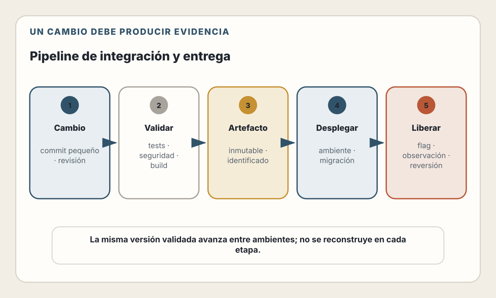
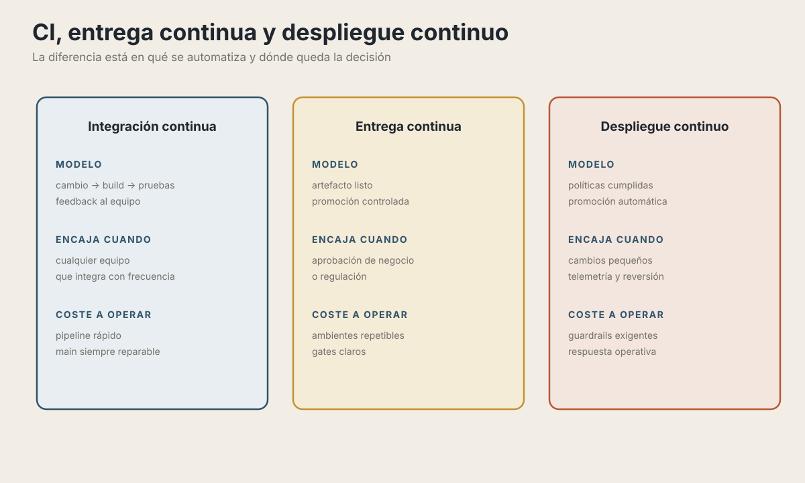
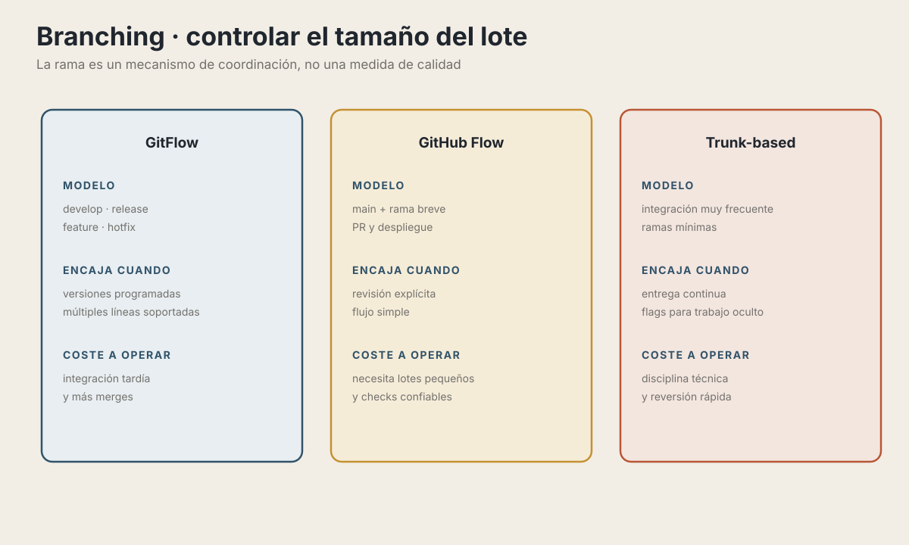
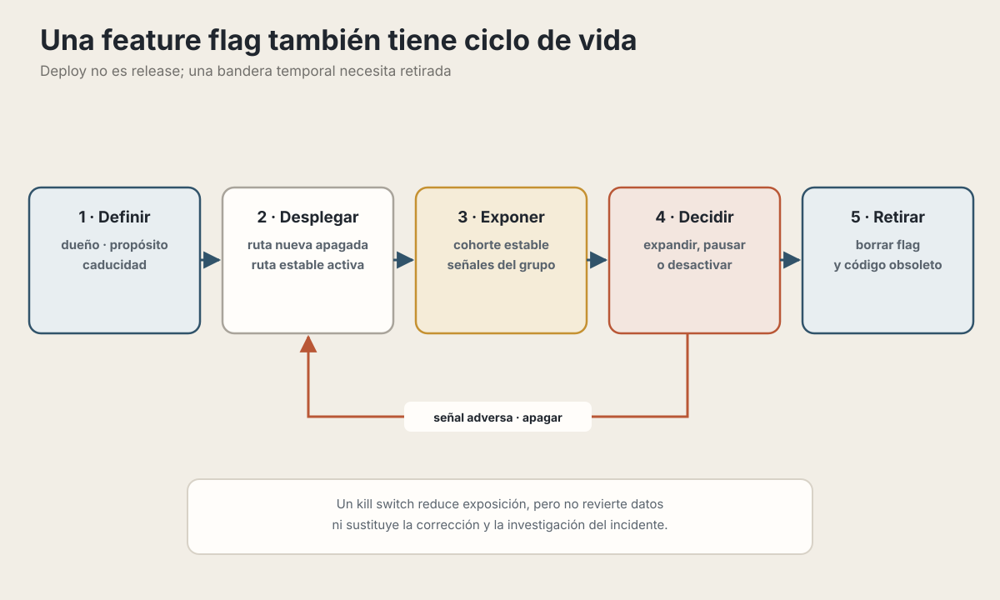

# 22. Integración y Entrega Continua

> "If it hurts, do it more frequently, and bring the pain forward." — Jez Humble

---

## Objetivos de Aprendizaje

Al finalizar este capítulo, serás capaz de:

- Distinguir entre Integración Continua, Entrega Continua y Deployment Continuo
- Elegir la estrategia de branching apropiada para tu equipo
- Configurar pipelines efectivos con GitHub Actions
- Aplicar feature flags para desacoplar deployment de release
- Diseñar pipelines que fallen rápido y den feedback claro

## Modelo mental

Un pipeline transforma una revisión manual y difícil de repetir en evidencia
automatizada sobre un cambio. CI reduce el tamaño del lote y el tiempo hasta
obtener feedback; entrega y despliegue controlan cómo ese cambio avanza entre
ambientes.

<picture>
  <source media="(max-width: 820px)" srcset="../assets/diagrams/cap22-pipeline-entrega-mobile.svg">
  
</picture>

---

## El Problema: El Deploy del Viernes

> Un lote grande tarda en integrarse, acumula incertidumbre y vuelve costoso averiguar qué salió mal. Cambios pequeños, feedback temprano y una mecánica repetible reducen ese ciclo; la frecuencia solo es segura cuando el pipeline produce evidencia útil.

La solución no es desplegar menos, sino hacerlo **con mayor frecuencia** y con
**menos cambios** cada vez.

---

## CI vs CD vs CD

Tres conceptos que suenan igual pero son diferentes:

<picture>
  <source media="(max-width: 820px)" srcset="../assets/diagrams/cap22-ci-entrega-despliegue-mobile.svg">
  
</picture>

**¿Cuál elegir?**

| Situación | Recomendación |
|-----------|---------------|
| Equipo nuevo, pocos tests | CI primero, luego CD |
| Producto B2B con clientes enterprise | Continuous Delivery (releases controlados) |
| SaaS con iteración rápida | Continuous Deployment |
| Regulación estricta (fintech, salud) | Continuous Delivery con gates de aprobación |

💡 **Insight**: No puedes tener Continuous Deployment sin primero dominar Continuous Integration. Cada nivel construye sobre el anterior.

---

## Estrategias de Branching

### GitFlow: El Modelo Tradicional

<picture>
  <source media="(max-width: 820px)" srcset="../assets/diagrams/cap22-branching-lotes-mobile.svg">
  
</picture>

**Ventajas:**
- Clara separación entre código estable y en desarrollo
- Releases planificados y predecibles
- Bueno para equipos grandes con múltiples features en paralelo

**Desventajas:**
- Branches de larga vida = merge conflicts
- Integración tardía = problemas tardíos
- Overhead de gestión de branches

### Trunk-Based Development: El Modelo Moderno

> Trunk-based development busca integrar lotes muy pequeños. Puede usar commits directos o ramas breves según las reglas de revisión del equipo; lo esencial es evitar que el trabajo permanezca aislado durante días o semanas.

**Ventajas:**
- Integración continua real (no "continuous isolation")
- Menos merge conflicts
- Feedback rápido

**Desventajas:**
- Requiere disciplina y buenos tests
- Features incompletas necesitan feature flags
- Puede ser intimidante al inicio

### ¿Cuál Elegir?

| Contexto | Sesgo inicial |
|---|---|
| Producto con entrega frecuente y automatización sólida | Trunk-based o GitHub Flow con ramas muy breves |
| Release coordinado o varias versiones soportadas | Un flujo con ramas de release puede ser útil |
| Equipo que aún no domina integración frecuente | GitHub Flow ofrece una transición sencilla |
| Trabajo incompleto que debe integrarse pronto | Trunk-based con una bandera temporal y una fecha de retiro |

La decisión no depende solo del tamaño del equipo. Importan la frecuencia de
integración, las versiones que deben mantenerse, las aprobaciones y la
capacidad de recuperar `main`.

📖 **Concepto**: GitHub Flow es un punto medio: una sola branch principal (main) con feature branches de corta vida. Más simple que GitFlow, más estructura que trunk-based puro.

---

## Feature Flags: Desacoplando Deploy de Release

Las banderas de funcionalidad permiten desplegar código inactivo y activarlo
después:

```typescript
// Código deployado pero no activo para todos
function CheckoutButton({ cart }: Props) {
  const flags = useFeatureFlags();

  if (flags.isEnabled('new-checkout-flow')) {
    return <NewCheckoutButton cart={cart} />;
  }

  return <LegacyCheckoutButton cart={cart} />;
}
```

### Casos de Uso

<picture>
  <source media="(max-width: 820px)" srcset="../assets/diagrams/cap22-ciclo-feature-flag-mobile.svg">
  
</picture>

Una bandera puede habilitar desarrollo incremental, programas beta, experimentos, canary releases o un *kill switch*. En todos los casos necesita segmentación estable, telemetría y una estrategia de eliminación.

### Plataformas para banderas

| Herramienta | Tipo | Mejor para |
|-------------|------|------------|
| **LaunchDarkly** | SaaS | Enterprise, features avanzados |
| **Unleash** | Open Source | Self-hosted, control total |
| **PostHog** | SaaS/Self-hosted | Feature flags + analytics |
| **Flagsmith** | Open Source | Balance features/simplicidad |
| **ConfigCat** | SaaS | Simple, económico |

### Implementación Básica

```typescript
// lib/feature-flags.ts
type FlagConfig = {
  name: string;
  enabled: boolean;
  percentage?: number;  // Para rollout gradual
  allowlist?: string[]; // IDs de usuarios específicos
};

const flags: Record<string, FlagConfig> = {
  'new-checkout': {
    name: 'new-checkout',
    enabled: true,
    percentage: 20,  // Solo 20% de usuarios
  },
  'dark-mode': {
    name: 'dark-mode',
    enabled: true,
    allowlist: ['user-123', 'user-456'],  // Solo beta testers
  },
};

export function isFeatureEnabled(
  flagName: string,
  userId?: string
): boolean {
  const flag = flags[flagName];
  if (!flag || !flag.enabled) return false;

  // Check allowlist primero
  if (flag.allowlist?.includes(userId ?? '')) {
    return true;
  }

  // Check percentage rollout
  if (flag.percentage !== undefined) {
    // Hash determinístico para consistencia
    const hash = simpleHash(userId + flagName);
    return (hash % 100) < flag.percentage;
  }

  return flag.enabled;
}
```

⚠️ **Advertencia**: Los feature flags son deuda técnica. Cada flag activo es código que mantener. Elimina flags cuando el feature esté 100% rolled out.

---

## Pipelines con GitHub Actions

### Anatomía de un Workflow

```yaml
# .github/workflows/ci.yml
name: CI

# Cuándo ejecutar
on:
  push:
    branches: [main]
  pull_request:
    branches: [main]
  workflow_call:

# Variables de entorno globales
env:
  NODE_VERSION: '24'

permissions:
  contents: read

jobs:
  # Job 1: Lint y Type Check
  lint:
    runs-on: ubuntu-latest
    steps:
      - uses: actions/checkout@v6

      - uses: actions/setup-node@v6
        with:
          node-version: ${{ env.NODE_VERSION }}
          cache: 'npm'

      - run: npm ci

      - run: npm run lint

      - run: npm run typecheck

  # Job 2: Tests (paralelo con lint)
  test:
    runs-on: ubuntu-latest
    steps:
      - uses: actions/checkout@v6

      - uses: actions/setup-node@v6
        with:
          node-version: ${{ env.NODE_VERSION }}
          cache: 'npm'

      - run: npm ci

      - run: npm run test:unit

      - run: npm run test:integration

  # Job 3: Build (después de lint y test)
  build:
    needs: [lint, test]  # Espera a que pasen
    runs-on: ubuntu-latest
    steps:
      - uses: actions/checkout@v6

      - uses: actions/setup-node@v6
        with:
          node-version: ${{ env.NODE_VERSION }}
          cache: 'npm'

      - run: npm ci

      - run: npm run build

      - uses: actions/upload-artifact@v7
        with:
          name: build
          path: dist/
```

> **Estado del ecosistema — verificado el 30 de julio de 2026.** Los ejemplos usan
> Node.js 24 LTS y los majors vigentes de las acciones oficiales mostradas.
> Node.js 20 está fuera de soporte desde marzo de 2026. Los tags como `@v6`
> son legibles pero mutables; en pipelines de alto riesgo, fija acciones de
> terceros a un SHA completo y automatiza su actualización.

### Optimizaciones Clave

#### 1. Caché de Dependencias

```yaml
- uses: actions/setup-node@v6
  with:
    node-version: '24'
    cache: 'npm'
    cache-dependency-path: package-lock.json
```

`setup-node` cachea los datos globales del gestor —por ejemplo `~/.npm`— y usa
el lockfile para invalidarlos. No cachea `node_modules`: `npm ci` sigue
reconstruyéndolo de forma reproducible. Una **caché** acelera ejecuciones y puede
ser desalojada; un **artifact** transporta una salida concreta entre jobs o la
conserva para inspección. Ninguno debe contener secretos.

#### 2. Ejecución en Paralelo

```yaml
jobs:
  lint:
    runs-on: ubuntu-latest
    # ...

  test-unit:
    runs-on: ubuntu-latest
    # ...

  test-integration:
    runs-on: ubuntu-latest
    # ...

  # Los tres corren en paralelo
  build:
    needs: [lint, test-unit, test-integration]  # Espera a todos
```

#### 3. Matrix Builds

```yaml
jobs:
  test:
    runs-on: ubuntu-latest
    strategy:
      matrix:
        node-version: [22, 24]
        os: [ubuntu-latest, windows-latest]
    steps:
      - uses: actions/setup-node@v6
        with:
          node-version: ${{ matrix.node-version }}
      # Corre 4 combinaciones en paralelo
```

#### 4. Fail Fast

```yaml
jobs:
  test:
    strategy:
      fail-fast: true  # Cancela otros si uno falla
      matrix:
        shard: [1, 2, 3, 4]
    steps:
      - run: npm run test -- --shard=${{ matrix.shard }}/4
```

### Pipeline Completo: CI + CD

```yaml
# .github/workflows/deploy.yml
name: Deploy

on:
  push:
    branches: [main]

permissions:
  contents: read

jobs:
  ci:
    uses: ./.github/workflows/ci.yml  # Reutiliza el workflow de CI

  deploy-staging:
    needs: ci
    runs-on: ubuntu-latest
    environment: staging  # Requiere aprobación si configurado
    env:
      STAGING_URL: ${{ vars.STAGING_URL }}
    steps:
      - uses: actions/checkout@v6

      - uses: actions/download-artifact@v8
        with:
          name: build
          path: dist/

      - uses: actions/setup-node@v6
        with:
          node-version: '24'
          cache: 'npm'

      - run: npm ci

      - name: Deploy to Staging
        env:
          DEPLOY_TOKEN: ${{ secrets.DEPLOY_TOKEN }}
        run: |
          ./scripts/deploy-artifact.sh staging dist/ "$DEPLOY_TOKEN"

      - name: Run E2E Tests
        run: |
          npm run test:e2e -- --base-url="$STAGING_URL"

  deploy-production:
    needs: deploy-staging
    runs-on: ubuntu-latest
    environment: production  # Requiere aprobación manual
    steps:
      - uses: actions/checkout@v6

      - uses: actions/download-artifact@v8
        with:
          name: build
          path: dist/

      - name: Deploy to Production
        env:
          DEPLOY_TOKEN: ${{ secrets.DEPLOY_TOKEN }}
        run: |
          ./scripts/deploy-artifact.sh production dist/ "$DEPLOY_TOKEN"

      - name: Notify Slack
        if: success()
        env:
          SLACK_WEBHOOK_URL: ${{ secrets.SLACK_WEBHOOK }}
        run: |
          curl --fail-with-body --request POST \
            --header 'Content-Type: application/json' \
            --data '{"text":"Deploy to production successful"}' \
            "$SLACK_WEBHOOK_URL"
```

`deploy-artifact.sh` representa el adaptador versionado de tu plataforma. Debe
desplegar el artifact recibido, no reconstruir desde una rama que podría haber
cambiado. Si usas un proveedor concreto, ajusta también la salida del job
`build`: por ejemplo, un despliegue `--prebuilt` puede exigir un directorio
distinto de `dist/`.

---

## Mejores Prácticas

### Presupuesto de feedback

Define un presupuesto de feedback a partir del flujo real del equipo:

- Separa comprobaciones rápidas para PR de suites profundas o programadas.
- Mide p50 y p95, tiempo en cola, camino crítico y tasa de reintentos.
- Paraleliza trabajos independientes y divide suites cuando reduzca el camino crítico.
- Cachea dependencias con claves correctas; una caché inválida ahorra tiempo a costa de reproducibilidad.
- Ejecuta pruebas afectadas solo si conservas una suite que detecte errores del análisis de impacto.
- Ajusta capacidad de los *runners* cuando el coste de espera lo justifique.

### Fail Fast, Fail Loud

```yaml
jobs:
  quick-checks:
    runs-on: ubuntu-latest
    steps:
      # Primero lo más rápido
      - run: npm run lint        # 30 segundos
      - run: npm run typecheck   # 1 minuto

  # Solo si quick-checks pasa
  slow-tests:
    needs: quick-checks
    runs-on: ubuntu-latest
    steps:
      - run: npm run test:integration  # 5 minutos
      - run: npm run test:e2e          # 8 minutos
```

### Secrets y Seguridad

```yaml
# ❌ NUNCA hagas esto
env:
  API_KEY: "sk-live-abc123"  # Expuesto en el repo

# ✅ Usa secrets de GitHub
env:
  API_KEY: ${{ secrets.API_KEY }}

# ✅ Limita permisos
permissions:
  contents: read     # Solo lectura del repo
  packages: write    # Puede publicar packages
```

### Notifications Útiles

```yaml
- name: Notify on Failure
  if: failure()
  env:
    SLACK_WEBHOOK_URL: ${{ secrets.SLACK_WEBHOOK }}
  run: |
    curl --fail-with-body --request POST \
      --header 'Content-Type: application/json' \
      --data '{"text":"El pipeline falló; revisa la ejecución en GitHub Actions"}' \
      "$SLACK_WEBHOOK_URL"
```

Si prefieres una acción de terceros, revisa su código, limita sus permisos y
fíjala a un commit completo. No interpolas títulos de PR, mensajes de commit u
otros datos no confiables directamente dentro de un script.

---

## Monorepos y Pipelines Condicionales

En monorepos, no quieres correr todos los tests para cada cambio:

```yaml
# .github/workflows/ci.yml
name: CI

on:
  push:
    paths:
      - 'apps/web/**'
      - 'packages/shared/**'
      - 'package.json'

permissions:
  contents: read
  pull-requests: read

jobs:
  detect-changes:
    runs-on: ubuntu-latest
    outputs:
      web: ${{ steps.filter.outputs.web }}
      api: ${{ steps.filter.outputs.api }}
    steps:
      - uses: actions/checkout@v6

      - uses: dorny/paths-filter@v4
        id: filter
        with:
          filters: |
            web:
              - 'apps/web/**'
              - 'packages/ui/**'
            api:
              - 'apps/api/**'
              - 'packages/shared/**'

  test-web:
    needs: detect-changes
    if: needs.detect-changes.outputs.web == 'true'
    runs-on: ubuntu-latest
    steps:
      - run: npm run test --workspace=apps/web

  test-api:
    needs: detect-changes
    if: needs.detect-changes.outputs.api == 'true'
    runs-on: ubuntu-latest
    steps:
      - run: npm run test --workspace=apps/api
```

---

## 🤖 Usando IA para CI/CD

### Análisis de pipelines

```
Prompt: "Mi pipeline de CI tarda 25 minutos. Estos son los tiempos
de cada job:
- lint: 2 min
- typecheck: 3 min
- test:unit: 8 min
- test:integration: 12 min
- build: 5 min

¿Cómo puedo reducir el camino crítico y definir un presupuesto
de feedback basado en estos datos?"
```

La IA puede sugerir: paralelización, sharding, caché, tests afectados.

### Debugging de failures

```
Prompt: "Este job falla intermitentemente con este error:
[pegar logs]. El job corre tests de Playwright.
¿Qué podría causar la flakiness?"
```

### Generación de workflows

```
Prompt: "Genera un workflow de GitHub Actions para:
- Node.js 24 con pnpm
- Lint, typecheck, y tests en paralelo
- Deploy a Vercel en staging para PRs
- Deploy a producción cuando se mergea a main
- Notificar a Slack en failures"
```

### Limitaciones

⚠️ **La IA no puede:**
- Ver tus logs de ejecución reales
- Conocer la configuración de tus secrets
- Saber qué runners tienes disponibles
- Optimizar sin métricas reales de timing

Siempre complementa con datos reales de tus pipelines.

---

## Anti-patrones Comunes

- **«Funciona en mi máquina».** Reproduce versiones, servicios y variables relevantes entre local y CI.
- **Pruebas que solo fallan en CI.** Investiga aislamiento, tiempo, recursos y diferencias de entorno.
- **Ignorar tests inestables.** Asigna responsable; corrige o pon en cuarentena temporal y visible.
- **Feedback habitualmente tardío.** Mide el camino crítico y separa suites profundas.
- **Pasos manuales ocultos.** Automatiza la mecánica y conserva las aprobaciones que controlan un riesgo real.
- **Ramas de larga vida.** Integra lotes más pequeños para descubrir conflictos antes.
- **CI solo en pull requests.** Verifica también la rama principal y cualquier ruta que produzca un artefacto.

---

## Ejercicios

Diseña el pipeline de CI/CD para una aplicación con:
- Frontend Next.js
- API Node.js
- Base de datos PostgreSQL
- Tests unitarios, integración, y E2E

**Requisitos:**
1. Pipeline debe cumplir el presupuesto de feedback definido por el equipo
2. E2E tests deben correr contra staging antes de producción
3. Producción requiere aprobación manual
4. Notificación a Slack en éxito y fallo

**Considera:**
- ¿Qué jobs pueden correr en paralelo?
- ¿Cómo manejas la base de datos en tests?
- ¿Dónde usarías caché?
- ¿Cómo estructurarías los environments en GitHub?

---

## Resumen

- **CI** integra cambios frecuentes y devuelve evidencia rápida.
- **Entrega continua** mantiene un artefacto listo para promover mediante una decisión explícita.
- **Despliegue continuo** automatiza también esa promoción bajo políticas observables.
- **Branching** controla coordinación y tamaño de lote; no sustituye pruebas ni revisión.
- **Feature flags** separan despliegue y liberación, pero añaden estado temporal que debe retirarse.
- **Pipeline** significa fallar pronto, construir una vez, promover el mismo artefacto y conservar una ruta de recuperación.

El principio guía es reducir el tamaño y la incertidumbre de cada cambio, no aumentar la frecuencia a cualquier precio.

---

## Referencias

### Fundamentos
- [Continuous Integration - Martin Fowler](https://martinfowler.com/articles/continuousIntegration.html)
- [Trunk-Based Development](https://trunkbaseddevelopment.com/)
- [Feature Flags Best Practices](https://launchdarkly.com/blog/feature-flag-best-practices/)

### Documentación de herramientas
- [GitHub Actions Documentation](https://docs.github.com/en/actions)
- [Node.js Release Schedule](https://nodejs.org/en/about/previous-releases)
- [GitHub Actions Dependency Caching](https://docs.github.com/en/actions/reference/workflows-and-actions/dependency-caching)
- [GitLab CI/CD Documentation](https://docs.gitlab.com/ee/ci/)
- [Act - Run GitHub Actions Locally](https://github.com/nektos/act)

### Optimización
- [CI/CD Best Practices - GitLab](https://about.gitlab.com/topics/ci-cd/continuous-integration-best-practices/)
