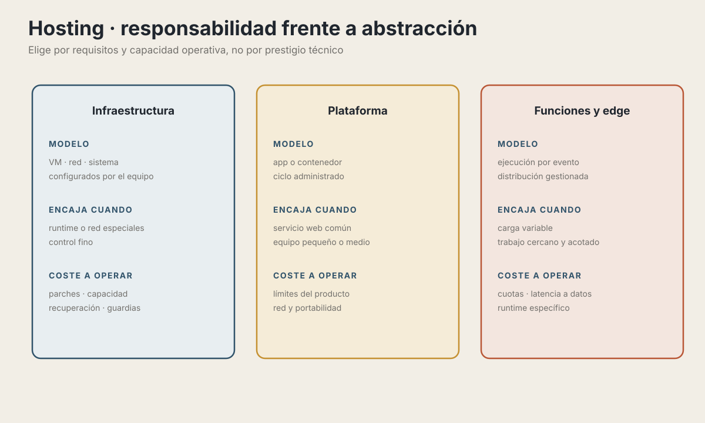
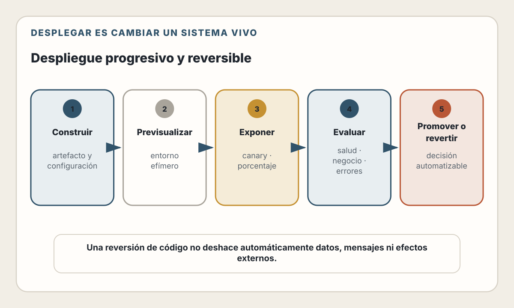
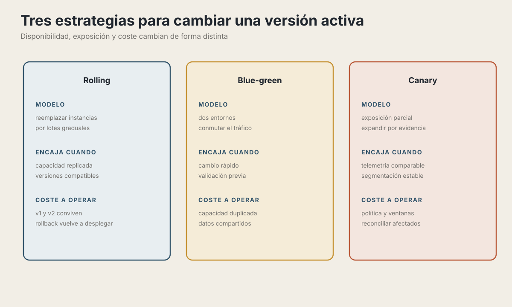
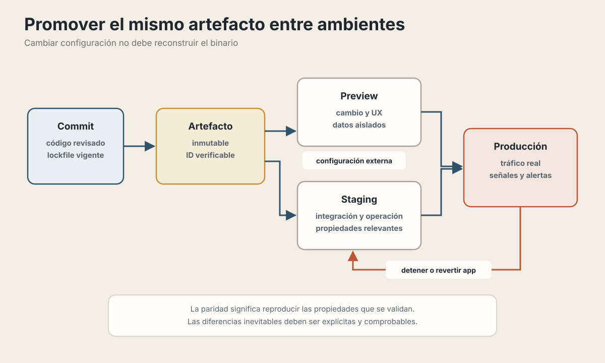

# 23. Deployment y Infraestructura

> "There are only two hard things in Computer Science: cache invalidation and naming things." — Phil Karlton (pero desplegar está cerca del podio)

---

## Objetivos de Aprendizaje

Al finalizar este capítulo, serás capaz de:

- Elegir la estrategia de hosting apropiada para tu aplicación
- Comparar modelos de plataforma y sus responsabilidades operativas
- Implementar Infrastructure as Code con herramientas actuales
- Diseñar arquitecturas multi-región y edge computing
- Elegir estrategias de despliegue, verificación y recuperación

## Modelo mental

Desplegar es cambiar un sistema en ejecución. La estrategia correcta limita el
radio de impacto, conserva una ruta de recuperación y produce señales que
permiten decidir si continuar, detener o revertir.

---

## El Espectro del Hosting

<picture>
  <source media="(max-width: 820px)" srcset="../assets/diagrams/cap23-espectro-hosting-mobile.svg">
  
</picture>

### ¿Cómo elegir?

| Pregunta | Por qué importa |
|----------|-----------------|
| ¿Qué runtime, protocolos y procesos necesita la aplicación? | Descarta plataformas incompatibles antes de comparar precio |
| ¿Puede escalar a cero o necesita instancias siempre disponibles? | Afecta coste, latencia inicial y conexiones persistentes |
| ¿Dónde viven los datos y los usuarios? | La computación cercana no elimina la latencia hacia una base remota |
| ¿Qué RTO, RPO y soporte exige el producto? | Determina redundancia, copias y capacidad de recuperación |
| ¿Qué puede operar realmente el equipo? | Una plataforma flexible puede transferir más responsabilidad |
| ¿Cómo se calcula el coste total? | Incluye cómputo, datos, egreso, observabilidad y tiempo operativo |

No elijas por la etapa de la empresa ni por una cifra de adopción. Empieza con
el servicio más sencillo que cumpla los requisitos y conserva una ruta de
salida proporcional al riesgo de dependencia.

---

## Modelos de plataforma

| Modelo | Ejemplos | Qué debes verificar |
|--------|----------|----------------------|
| Frontend y funciones administradas | Vercel, Cloudflare, Netlify | Runtime por ruta, caché, límites, regiones y portabilidad |
| PaaS de aplicaciones | Railway, Render | Ciclo de vida, discos, red privada, escalado y recuperación |
| Contenedores administrados | Cloud Run, ECS, Fly.io | Concurrencia, salud, escalado a cero, red y observabilidad |
| IaaS | AWS, Azure, Google Cloud | Responsabilidad sobre SO, red, parches y capacidad |
| Kubernetes administrado | EKS, AKS, GKE | Necesidad real del API de Kubernetes y coste operativo |

> **Estado del ecosistema — verificado el 30 de julio de 2026.** Productos, planes,
> regiones, límites y precios cambian con frecuencia. Esta tabla compara modelos,
> no promete características comerciales. Antes de decidir, consulta la
> documentación y la calculadora vigentes, crea una prueba representativa y
> mide coste y comportamiento bajo fallo.

---

## Containers y Orquestación

### Docker: un formato común de imagen

```dockerfile
# Dockerfile multi-stage para Node.js
# Stage 1: dependencias de producción
FROM node:24-alpine AS production-dependencies
WORKDIR /app
COPY package*.json ./
RUN npm ci --omit=dev

# Stage 2: build con todas las dependencias
FROM node:24-alpine AS builder
WORKDIR /app
COPY package*.json ./
RUN npm ci
COPY . .
RUN npm run build

# Stage 3: runtime
FROM node:24-alpine AS runner
WORKDIR /app

# Usuario no-root por seguridad
RUN addgroup --system --gid 1001 nodejs
RUN adduser --system --uid 1001 nextjs

COPY --chown=nextjs:nodejs --from=builder /app/dist ./dist
COPY --chown=nextjs:nodejs --from=production-dependencies /app/node_modules ./node_modules
COPY --chown=nextjs:nodejs --from=builder /app/package.json ./

USER nextjs
EXPOSE 3000
ENV NODE_ENV=production

HEALTHCHECK --interval=30s --timeout=3s --retries=3 \
  CMD node -e "fetch('http://127.0.0.1:3000/health').then(r => { if (!r.ok) process.exit(1) }).catch(() => process.exit(1))"

CMD ["node", "dist/server.js"]
```

Este Dockerfile presupone que existe `/health`. Usa `.dockerignore`, analiza
dependencias e imagen, genera SBOM cuando el proceso lo requiera y fija la imagen
base por digest si necesitas builds reproducibles. El usuario no root reduce
impacto, pero no reemplaza límites, filesystem de solo lectura ni una política
de capacidades.

### Docker Compose para Desarrollo Local

```yaml
# compose.yaml
services:
  app:
    build: .
    ports:
      - "3000:3000"
    environment:
      - DATABASE_URL=postgres://user:pass@db:5432/myapp
      - REDIS_URL=redis://redis:6379
    depends_on:
      - db
      - redis
    volumes:
      - .:/app
      - /app/node_modules  # Evita sobrescribir node_modules

  db:
    image: postgres:16-alpine
    environment:
      POSTGRES_USER: user
      POSTGRES_PASSWORD: pass
      POSTGRES_DB: myapp
    volumes:
      - postgres_data:/var/lib/postgresql/data
    ports:
      - "5432:5432"

  redis:
    image: redis:7-alpine
    ports:
      - "6379:6379"

volumes:
  postgres_data:
```

Las credenciales anteriores son marcadores exclusivos del entorno local, no
secretos reutilizados. Para que el hot reload sea útil, normalmente conviene un
Dockerfile o un target de desarrollo distinto del runner mínimo de producción.
Añade health checks a los servicios cuando el arranque de la aplicación dependa
de que estén listos: `depends_on` por sí solo expresa orden, no disponibilidad.

### ¿Cuándo Kubernetes?

No lo decidas por cantidad de desarrolladores, pods o tráfico. Pregunta qué
capacidad concreta necesitas:

| Señal | Pregunta de comprobación |
|-------|--------------------------|
| API y ecosistema de Kubernetes | ¿Usas operadores, CRD, políticas o tooling que una plataforma más simple no ofrece? |
| Portabilidad | ¿La organización acepta limitarse al subconjunto realmente portable y probar la salida? |
| Operación | ¿Hay responsables, observabilidad, upgrades, seguridad y respuesta a incidentes? |
| Escala organizacional | ¿Los límites y contratos entre equipos justifican una plataforma compartida? |
| Coste total | ¿Incluiste control plane, capacidad ociosa, red y tiempo de operación? |

Si las respuestas no lo justifican, un PaaS o contenedor administrado puede
cumplir con menor carga. Si lo justifican, empieza por Kubernetes administrado;
operar también el control plane requiere una razón adicional.

---

## Edge Computing

El edge acerca tu código a los usuarios:

En una región única, el usuario distante recorre la red hasta el origen. Con ejecución distribuida, una parte del trabajo ocurre en un punto cercano, pero las solicitudes que necesitan datos remotos todavía deben alcanzar su origen. **Mover cómputo no mueve automáticamente los datos ni su consistencia.**

### Casos de Uso para Edge

| Caso de Uso | Solución Edge |
|-------------|---------------|
| A/B testing, personalization | Cloudflare Workers, routing middleware |
| Geolocation-based routing | Edge middleware |
| Auth token validation | Edge functions |
| Image optimization | Cloudflare Images, Vercel OG |
| API rate limiting | Edge-based limiters |
| Static + dynamic hybrid | CDN + funciones o procesos administrados |

### Ejemplo conceptual en el borde

```typescript
type DeploymentContext = {
  countryCode?: string;
};

export function routeAtEdge(
  request: Request,
  context: DeploymentContext
): Response | null {
  const url = new URL(request.url);

  if (context.countryCode === 'DE' && !url.pathname.startsWith('/de')) {
    url.pathname = `/de${url.pathname}`;
    return Response.redirect(url, 307);
  }

  return null; // Continuar hacia caché u origen según la plataforma.
}
```

El origen de `countryCode` es específico del proveedor y puede ser impreciso.
No lo uses como control de autorización ni como prueba de residencia. El nombre
del archivo y el runtime también cambian por framework: por ejemplo, Next.js 16
renombró `middleware.ts` a `proxy.ts`, cuyo runtime es Node.js, mientras las
plataformas ofrecen además primitivas propias de routing. Consulta el adaptador
que realmente desplegarás.

### Limitaciones del Edge

> **Edge es un contrato de ejecución, no solo una ubicación.** Verifica cuotas de CPU, memoria, duración y subsolicitudes; compatibilidad del runtime; distancia a los datos; estado efímero; y herramientas de observabilidad. Mantén en el borde el trabajo que realmente reduzca el camino completo y mide la latencia de extremo a extremo.

---

## Infrastructure as Code (IaC)

### Por Qué IaC

| Infraestructura manual | Infraestructura como código |
|---|---|
| Cambios difíciles de atribuir o repetir | Configuración versionada y revisable |
| Entornos que dependen de conocimiento tácito | Plan de cambios y módulos reutilizables |
| Diferencias que aparecen con el tiempo | Detección y reconciliación de *drift* |
| Recuperación improvisada | Estado remoto protegido, bloqueo y procedimientos probados |

IaC mejora la trazabilidad, pero no vuelve reversibles los cambios de datos ni elimina los efectos externos de una operación.

### Terraform vs Pulumi

| Aspecto | Terraform | Pulumi |
|---------|-----------|--------|
| Lenguaje | Lenguaje de configuración de Terraform (HCL) | TypeScript/JavaScript, Python, Go, .NET, Java y YAML |
| Abstracciones | Expresiones, módulos, `for_each`, funciones y bloques dinámicos | Funciones, clases, paquetes y abstracciones del lenguaje |
| Ecosistema | Providers y módulos de Terraform | Providers propios y puente para providers de Terraform |
| Estado | Backend local o remoto; exige bloqueo, cifrado y control de acceso | Pulumi Cloud o backend autogestionado |
| Testing | `validate`, `plan`, precondiciones y `terraform test` | Frameworks del lenguaje y pruebas de infraestructura de Pulumi |
| Riesgo común | Abstracciones HCL demasiado dinámicas y estado mal protegido | Abstracciones de software que ocultan cambios de infraestructura |

### Ejemplo Terraform

```text
# main.tf
terraform {
  required_providers {
    aws = {
      source  = "hashicorp/aws"
      version = "~> 6.0"
    }
  }

  backend "s3" {
    bucket = "my-terraform-state"
    key    = "prod/terraform.tfstate"
    region = "us-east-1"
    encrypt      = true
    use_lockfile = true
  }
}

provider "aws" {
  region = var.aws_region
}

# VPC
module "vpc" {
  source  = "terraform-aws-modules/vpc/aws"
  version = "~> 6.0"

  name = "${var.app_name}-vpc"
  cidr = "10.0.0.0/16"

  azs             = ["us-east-1a", "us-east-1b"]
  private_subnets = ["10.0.1.0/24", "10.0.2.0/24"]
  public_subnets  = ["10.0.101.0/24", "10.0.102.0/24"]

  enable_nat_gateway = true
  single_nat_gateway = var.environment != "production"

  tags = {
    Environment = var.environment
    Terraform   = "true"
  }
}

# ECS Cluster
resource "aws_ecs_cluster" "main" {
  name = "${var.app_name}-cluster"

  setting {
    name  = "containerInsights"
    value = "enabled"
  }
}

# RDS PostgreSQL
resource "aws_db_instance" "main" {
  identifier        = "${var.app_name}-db"
  engine            = "postgres"
  engine_version    = "16"
  instance_class    = "db.t3.micro"
  allocated_storage = 20

  db_name  = var.db_name
  username = var.db_username
  manage_master_user_password = true

  vpc_security_group_ids = [aws_security_group.rds.id]
  db_subnet_group_name   = aws_db_subnet_group.main.name

  storage_encrypted       = true
  publicly_accessible     = false
  backup_retention_period = var.environment == "production" ? 14 : 1
  deletion_protection     = var.environment == "production"
  skip_final_snapshot     = var.environment != "production"

  tags = {
    Environment = var.environment
  }
}
```

El fragmento ilustra composición y estado; no es una infraestructura completa.
El bucket de estado debe existir, tener versionado, cifrado y acceso restringido.
La topología de NAT, copias, alta disponibilidad, ventanas de mantenimiento y
protección de borrado deben surgir de RTO, RPO y coste. Ejecuta `fmt`, `validate`,
`test` y un `plan` revisado antes de aplicar. Las restricciones de versión se
verificaron el 30 de julio de 2026; conserva `.terraform.lock.hcl` para fijar la
selección exacta.

### Ejemplo Pulumi (TypeScript)

```typescript
// index.ts
import * as pulumi from "@pulumi/pulumi";
import * as aws from "@pulumi/aws";
import * as awsx from "@pulumi/awsx";

const config = new pulumi.Config();
const appName = config.require("appName");
const environment = config.require("environment");

// VPC con subnets automáticas
const vpc = new awsx.ec2.Vpc(`${appName}-vpc`, {
  numberOfAvailabilityZones: 2,
  natGateways: { strategy: "Single" },
  tags: { Environment: environment },
});

// ECS Cluster
const cluster = new aws.ecs.Cluster(`${appName}-cluster`, {
  settings: [{
    name: "containerInsights",
    value: "enabled",
  }],
});

// Load Balancer
const lb = new awsx.lb.ApplicationLoadBalancer(`${appName}-lb`, {
  subnetIds: vpc.publicSubnetIds,
});

// Fargate Service
const service = new awsx.ecs.FargateService(`${appName}-service`, {
  cluster: cluster.arn,
  desiredCount: 2,
  taskDefinitionArgs: {
    container: {
      name: appName,
      image: `${config.require("dockerImage")}:${config.require("version")}`,
      cpu: 256,
      memory: 512,
      portMappings: [{
        containerPort: 3000,
        targetGroup: lb.defaultTargetGroup,
      }],
      environment: [{ name: "NODE_ENV", value: "production" }],
      secrets: [
        { name: "DATABASE_URL", valueFrom: config.require("databaseSecretArn") },
      ],
    },
  },
});

// Outputs
export const url = pulumi.interpolate`http://${lb.loadBalancer.dnsName}`;
export const clusterName = cluster.name;
```

📖 **Concepto**: Ambos construyen un grafo declarativo de recursos. Pulumi
permite expresar ese grafo con un lenguaje de propósito general; Terraform tiene
expresiones, módulos, iteraciones y condicionales propios. La elección depende
del ecosistema, el modelo de estado, las políticas y la capacidad del equipo, no
de que uno sea simplemente «más poderoso».

En ECS, `secrets` debe contener referencias a Secrets Manager o Parameter Store,
no el valor secreto. El ejemplo de Pulumi es ilustrativo: confirma la forma
exacta contra las versiones bloqueadas de `@pulumi/aws` y `@pulumi/awsx`, y
protege también el backend de estado.

---

## Estrategias de Deployment

<picture>
  <source media="(max-width: 820px)" srcset="../assets/diagrams/cap23-despliegue-progresivo-mobile.svg">
  
</picture>

### Zero-Downtime Deployments

<picture>
  <source media="(max-width: 820px)" srcset="../assets/diagrams/cap23-estrategias-despliegue-mobile.svg">
  
</picture>

### Implementación con GitHub Actions

```yaml
# .github/workflows/deploy.yml
name: Deploy

on:
  push:
    branches: [main]

permissions:
  contents: read
  id-token: write

concurrency:
  group: production-deploy
  cancel-in-progress: false

jobs:
  deploy:
    runs-on: ubuntu-latest
    environment: production
    steps:
      - uses: actions/checkout@v6

      - name: Configure AWS credentials
        uses: aws-actions/configure-aws-credentials@v6
        with:
          role-to-assume: ${{ vars.AWS_DEPLOY_ROLE_ARN }}
          aws-region: us-east-1

      - name: Login to ECR
        id: login-ecr
        uses: aws-actions/amazon-ecr-login@v2

      - name: Build and push image
        env:
          ECR_REGISTRY: ${{ steps.login-ecr.outputs.registry }}
          IMAGE_TAG: ${{ github.sha }}
        run: |
          docker build -t "$ECR_REGISTRY/myapp:$IMAGE_TAG" .
          docker push "$ECR_REGISTRY/myapp:$IMAGE_TAG"

      - name: Render ECS task definition
        id: task-definition
        uses: aws-actions/amazon-ecs-render-task-definition@v1
        with:
          task-definition: infra/ecs-task-definition.json
          container-name: myapp
          image: ${{ steps.login-ecr.outputs.registry }}/myapp:${{ github.sha }}

      - name: Deploy to ECS
        uses: aws-actions/amazon-ecs-deploy-task-definition@v2
        with:
          task-definition: ${{ steps.task-definition.outputs.task-definition }}
          cluster: production
          service: myapp
          wait-for-service-stability: true

      - name: Health check
        run: |
          for i in {1..10}; do
            if curl -f https://myapp.com/health; then
              echo "Deployment successful!"
              exit 0
            fi
            sleep 10
          done
          echo "Health check failed"
          exit 1
```

El rol federado debe limitar su política de confianza al repositorio, rama o
environment esperado, y su política IAM a las acciones y recursos necesarios.
OIDC entrega credenciales temporales; evita mantener claves de acceso de larga
duración en secretos. Publicar una imagen con el SHA no basta: la nueva revisión
de la task definition debe referenciar exactamente esa imagen, que es lo que
hacen los pasos de render y deploy.

> **Versiones verificadas el 30 de julio de 2026.** Los tags mayores hacen legible el
> ejemplo, pero pueden moverse. Para un pipeline sensible, fija las acciones a
> commits completos y usa automatización para recibir actualizaciones revisadas.

---

## Secrets y Configuración

**Nunca incluyas secretos en:**

- Código fuente, imágenes o archivos versionados.
- Archivos de composición incluidos en el repositorio.
- Logs, mensajes de error o artefactos de CI.
- Variables expuestas al navegador o a procesos que no las necesitan.

**En su lugar:** usa credenciales locales ignoradas por Git durante desarrollo; identidades federadas y secretos protegidos en CI; y un gestor de secretos o la configuración segura de la plataforma en producción. Limita cada identidad al secreto y a la operación que necesita, registra el acceso y diseña la rotación.

### Patrón: Secrets en Runtime

```typescript
// config/secrets.ts
import {
  SecretsManagerClient,
  GetSecretValueCommand,
} from "@aws-sdk/client-secrets-manager";
import { z } from "zod";

const client = new SecretsManagerClient({ region: "us-east-1" });

const appSecretsSchema = z.object({
  databaseUrl: z.string().min(1),
  jwtSecret: z.string().min(32),
  stripeKey: z.string().min(1),
});

type AppSecrets = z.infer<typeof appSecretsSchema>;

let cache: { value: AppSecrets; expiresAt: number } | null = null;

export async function getSecrets(now = Date.now()): Promise<AppSecrets> {
  if (cache && cache.expiresAt > now) {
    return cache.value;
  }

  const secretId = process.env.SECRETS_ARN;
  if (!secretId) throw new Error("SECRETS_ARN is required");

  const command = new GetSecretValueCommand({
    SecretId: secretId,
  });

  const response = await client.send(command);
  if (!response.SecretString) {
    throw new Error("Secret value is empty");
  }

  const value = appSecretsSchema.parse(JSON.parse(response.SecretString));
  cache = { value, expiresAt: now + 5 * 60_000 };

  return value;
}

// Uso
const secrets = await getSecrets();
const db = new Database(secrets.databaseUrl);
```

El TTL permite observar rotaciones sin consultar el gestor en cada request; el
valor adecuado depende de tu política y del mecanismo de rotación. No registres
el contenido del secreto, valida su esquema y concede a la identidad de la
aplicación acceso solo al identificador necesario.

---

## Ambientes y Promoción

<picture>
  <source media="(max-width: 820px)" srcset="../assets/diagrams/cap23-promocion-artefacto-mobile.svg">
  
</picture>

### Preview Environments

```yaml
# Vercel: automático para cada PR
# Railway: template para PR previews
# Render: Preview Environments

# Ejemplo manual con GitHub Actions
name: Preview Deploy

on:
  pull_request:
    types: [opened, synchronize]

jobs:
  preview:
    runs-on: ubuntu-latest
    permissions:
      contents: read
      pull-requests: write
    steps:
      - uses: actions/checkout@v6

      - name: Deploy Preview
        id: deploy
        run: |
          # Crear ambiente efímero
          PREVIEW_URL=$(railway up --environment "pr-${{ github.event.number }}")
          echo "url=$PREVIEW_URL" >> "$GITHUB_OUTPUT"

      - name: Comment PR
        uses: actions/github-script@v9
        env:
          PREVIEW_URL: ${{ steps.deploy.outputs.url }}
        with:
          script: |
            github.rest.issues.createComment({
              issue_number: context.issue.number,
              owner: context.repo.owner,
              repo: context.repo.repo,
              body: `Preview desplegado: ${process.env.PREVIEW_URL}`
            })
```

Pasar valores mediante `env` evita insertar texto no confiable directamente en
el programa de `github-script`. Los pull requests desde forks no reciben
secretos y normalmente no tienen permiso de escritura; diseña el flujo de
previews para ese caso. No cambies a `pull_request_target` y ejecutes código del
fork con credenciales privilegiadas.

---

## 🤖 Usando IA para Deployment

### Generación de configuración

```
Prompt: "Genera un Dockerfile optimizado para una aplicación
Next.js 16 con:
- Multi-stage build
- Usuario no-root
- Health check
- Optimización de capas para caché"
```

### Debugging de deployments

```
Prompt: "Mi deployment en ECS falla con este error:
[pegar logs de CloudWatch después de retirar secretos y datos personales]
El task definition tiene 512MB de memoria.
¿Qué podría estar causando el OOM kill?"
```

### IaC desde cero

```
Prompt: "Genera configuración de Terraform para:
- VPC con subnets públicas y privadas
- RDS PostgreSQL en subnet privada
- ECS Fargate en subnet privada
- ALB en subnet pública
- Security groups apropiados"
```

### Limitaciones

⚠️ **No asumas que la IA conoce o puede comprobar:**
- Los límites y cuotas efectivos de tu cuenta y región
- Las métricas reales, salvo que le concedas acceso explícito
- Los precios, descuentos y compromisos vigentes
- La configuración desplegada o los secretos que no estén en su contexto

Un agente con herramientas sí podría acceder a esos sistemas. Concédele el
mínimo permiso, evita entregarle secretos directamente y revisa el plan antes de
aplicar cambios. Valida siempre la configuración generada contra documentación,
políticas y datos reales.

---

## Anti-patrones Comunes

- **Servidores irrepetibles.** Versiona la configuración y automatiza su creación y recuperación.
- **Desplegar y esperar.** Define pruebas de salud, señales, responsables y una decisión de reversión.
- **Kubernetes prematuro.** Adopta su carga operativa solo cuando sus capacidades resuelvan requisitos concretos.
- **Configuración rígida en el código.** Separa configuración, valida su esquema y protege los secretos.
- **Despliegue masivo.** Reduce el tamaño del lote y conserva compatibilidad durante la transición.
- **«Rollback» sin alcance.** Volver a la aplicación anterior no deshace migraciones, mensajes enviados ni efectos externos.

---

## Ejercicios

Diseña la infraestructura para una aplicación SaaS con:
- Frontend Next.js
- API Node.js
- Base de datos PostgreSQL
- Cola de trabajos Redis
- Almacenamiento de archivos S3

**Requisitos:**
1. Disponibilidad 99.9%
2. Tiempo de respuesta < 200ms globalmente
3. Presupuesto < $500/mes inicialmente
4. Escalar a 10,000 usuarios

**Considera:**
- ¿Qué plataforma(s) usarías?
- ¿Cómo manejarías los ambientes?
- ¿Qué estrategia de deployment?
- ¿Cómo garantizas la disponibilidad?
- ¿Dónde ahorras costos sin sacrificar calidad?

---

## Resumen

- Elige el modelo de hosting más simple que cumpla los requisitos y que el equipo pueda operar.
- Usa edge solo cuando mejore el camino completo, incluida la relación con los datos.
- Versiona la infraestructura y protege tanto sus credenciales como su estado.
- Construye un artefacto una vez y promueve esa identidad entre ambientes.
- Separa despliegue y liberación cuando necesites limitar exposición.
- Define observación, parada, reversión de aplicación y reconciliación de datos antes de cambiar producción.

Diseñar para recuperarse no significa aceptar cualquier fallo: significa limitar el impacto y poder restablecer el servicio con evidencia y procedimientos practicados.

---

## Referencias

### Plataformas
- [Vercel Documentation](https://vercel.com/docs)
- [Railway Documentation](https://docs.railway.app/)
- [Fly.io Documentation](https://fly.io/docs/)
- [Render Documentation](https://render.com/docs)

### Infrastructure as Code
- [Terraform Getting Started](https://developer.hashicorp.com/terraform/tutorials)
- [Pulumi Getting Started](https://www.pulumi.com/docs/get-started/)
- [AWS CDK Documentation](https://docs.aws.amazon.com/cdk/)

### Containers
- [Docker Best Practices](https://docs.docker.com/develop/develop-images/dockerfile_best-practices/)
- [Kubernetes Documentation](https://kubernetes.io/docs/)

### Documentación del edge
- [Cloudflare Workers](https://developers.cloudflare.com/workers/)
- [Cloudflare Workers Limits](https://developers.cloudflare.com/workers/platform/limits/)
- [Next.js Proxy](https://nextjs.org/docs/app/getting-started/proxy)
- [Vercel Functions](https://vercel.com/docs/functions)

### Identidad y despliegue seguro
- [GitHub Actions: OpenID Connect](https://docs.github.com/en/actions/reference/security/oidc)
- [Configure AWS Credentials](https://github.com/aws-actions/configure-aws-credentials)
- [Amazon ECS Deploy Task Definition](https://github.com/aws-actions/amazon-ecs-deploy-task-definition)
