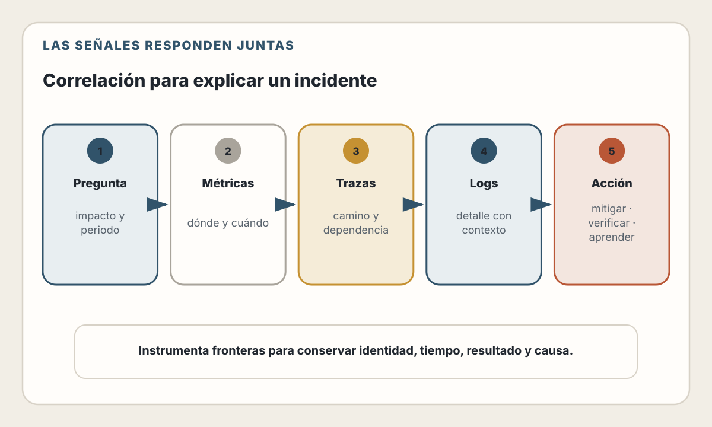

# 24. Observabilidad

> Un sistema no es observable porque acumula datos, sino porque permite
> convertir preguntas sobre producción en evidencia útil.

---

## Objetivos de Aprendizaje

Al finalizar este capítulo, serás capaz de:

- Distinguir observabilidad, monitoreo, telemetría y debugging
- Diseñar logs, métricas y trazas que puedan correlacionarse
- Definir indicadores y objetivos de nivel de servicio
- Crear alertas accionables basadas en impacto para los usuarios
- Investigar incidentes sin depender de intuiciones ni de un proveedor concreto
- Gestionar el coste, la privacidad y el riesgo de la telemetría
- Usar IA para analizar evidencia sin convertir sus hipótesis en hechos

## Modelo mental

Una aplicación en producción es un sistema que solo puedes conocer de forma
indirecta. Ves sus entradas, salidas y señales: peticiones, errores, tiempos,
eventos, cambios de estado y consumo de recursos.

La observabilidad construye un ciclo:

> formular una pregunta → consultar señales → relacionar evidencia → proponer
> una hipótesis → comprobarla → actuar → verificar el resultado

El objetivo no es registrar cada detalle. Es conservar suficiente contexto para
responder preguntas importantes, incluidas aquellas que no anticipaste al
diseñar los dashboards.

---

## Alcance: qué pertenece a este capítulo

El capítulo 23 explicó cómo cambiar un sistema en ejecución mediante despliegues
controlados. Este capítulo comienza después: ¿cómo sabemos si el cambio funcionó
y qué hacemos cuando el comportamiento real contradice nuestras expectativas?

Los capítulos siguientes continúan el recorrido:

- El capítulo 25 utilizará mediciones para localizar cuellos de botella,
  planificar capacidad y mejorar rendimiento.
- El capítulo 26 abordará amenazas, controles preventivos y respuesta de
  seguridad. Aquí solo trataremos la telemetría como dato sensible y como
  evidencia operativa.

La observabilidad no sustituye pruebas, diseño ni controles de seguridad. Aporta
evidencia sobre el comportamiento del sistema real.

---

## Observabilidad, monitoreo y telemetría

Estos términos se relacionan, pero no son sinónimos.

| Concepto | Pregunta principal | Ejemplo |
|----------|--------------------|---------|
| **Telemetría** | ¿Qué señales produce el sistema? | Una duración, un evento o un span |
| **Monitoreo** | ¿Se cumple una condición conocida? | La tasa de errores superó el objetivo |
| **Observabilidad** | ¿Podemos investigar el estado interno desde las señales disponibles? | ¿Por qué solo fallan ciertos pagos después del despliegue? |
| **Debugging** | ¿Qué explicación concreta resiste la evidencia? | Una dependencia agota su pool de conexiones |

El monitoreo suele empezar con preguntas conocidas. La observabilidad permite
explorar también problemas nuevos. No son alternativas: un buen monitor detecta
un síntoma y una buena instrumentación permite investigarlo.

### Las señales no son una lista cerrada

Logs, métricas y trazas suelen describirse como “los tres pilares”. La metáfora
es útil para comenzar, pero puede inducir dos errores:

1. Pensar que almacenar las tres señales produce observabilidad
   automáticamente.
2. Ignorar otras fuentes, como perfiles, eventos de negocio, cambios de
   configuración, datos de despliegue y pruebas sintéticas.

OpenTelemetry trata trazas, métricas y logs como señales principales, permite
propagar contexto mediante baggage y está incorporando perfiles y eventos con
distintos niveles de madurez. Lo importante no es contar productos o señales,
sino relacionar evidencia para responder preguntas.

---

## Logs: eventos con contexto

Un log registra que algo ocurrió. Es especialmente útil para eventos discretos:

- comenzó o terminó una operación;
- se rechazó una petición;
- cambió el estado de un pedido;
- falló una dependencia;
- se tomó una decisión de negocio relevante.

### Estructura antes que prosa

Compara:

```text
Payment failed for user 4821
```

con un evento estructurado:

```json
{
  "timestamp": "2026-07-31T14:05:22.481Z",
  "severity": "error",
  "service.name": "checkout-api",
  "deployment.environment.name": "production",
  "event.name": "payment.authorization_failed",
  "payment.provider": "example-provider",
  "error.type": "provider_timeout",
  "trace_id": "4bf92f3577b34da6a3ce929d0e0e4736",
  "span_id": "00f067aa0ba902b7"
}
```

El segundo evento puede filtrarse, agregarse y correlacionarse. Sus campos
conservan significado sin obligar a interpretar una frase.

No necesita incluir el identificador directo del usuario, su correo, el token de
acceso ni el detalle completo del instrumento de pago. Los logs son otra base
de datos: requieren clasificación, acceso, retención y eliminación.

### Severidad no es prioridad operativa

`debug`, `info`, `warn` y `error` expresan la naturaleza del evento desde el
componente. No deciden por sí solas si alguien debe ser despertado.

Un error aislado y recuperado puede no requerir intervención. Una sucesión de
respuestas aparentemente válidas pero incorrectas para miles de usuarios sí
puede requerirla. Las páginas deben depender del impacto y de una acción
posible, no del número de líneas con nivel `error`.

### Qué no registrar

Evita registrar directamente:

- contraseñas, claves, secretos y tokens;
- identificadores de sesión;
- cadenas de conexión;
- datos personales que no sean necesarios;
- cuerpos completos de peticiones y respuestas por defecto;
- texto no confiable sin neutralizar saltos de línea o delimitadores.

OWASP recomienda eliminar, enmascarar, seudonimizar o cifrar información
sensible según el contexto. La redacción también importa: un atacante puede
intentar inyectar entradas que falsifiquen eventos o dañen las herramientas que
los procesan.

---

## Métricas: comportamiento agregado a través del tiempo

Una métrica representa mediciones asociadas a dimensiones. Permite observar
tendencias, proporciones y distribuciones sin conservar cada evento individual.

### Instrumentos habituales

| Instrumento conceptual | Uso | Ejemplo |
|------------------------|-----|---------|
| Contador | Valor acumulativo que solo aumenta | Peticiones procesadas |
| Histograma | Distribución de observaciones | Duración de peticiones |
| Medición de estado | Valor actual que puede subir o bajar | Trabajos pendientes |

El nombre, la unidad y las dimensiones forman parte del contrato. Una duración
en segundos no debería cambiar silenciosamente a milisegundos.

### La cardinalidad tiene un coste

Cada combinación de valores de las etiquetas puede generar una serie temporal.
Estas dimensiones suelen estar acotadas:

- método HTTP;
- plantilla de ruta;
- clase de estado;
- región;
- versión desplegada.

Estas dimensiones pueden crecer sin límite:

- identificador de usuario;
- correo;
- URL completa con parámetros;
- mensaje de error libre;
- identificador de petición o trace.

Un identificador individual pertenece normalmente a logs o trazas, no a una
etiqueta de métrica. Usar `route="/orders/:id"` permite agregar; usar
`path="/orders/8b28..."` crea una dimensión distinta por pedido.

### Promedios que esconden el problema

Una latencia media de 120 ms no dice si:

- casi todas las peticiones tardan 120 ms;
- la mitad tarda 20 ms y la otra mitad 220 ms;
- una minoría espera varios segundos.

Para tiempos y tamaños interesa conservar una distribución y consultar
percentiles o proporciones bajo un umbral. Incluso entonces debes indicar
ventana, población y punto de medición. “p95 < 300 ms” no significa nada sin
saber qué operaciones, usuarios y período incluye.

### Señales orientadas al servicio

Para un servicio que responde peticiones, una primera vista puede cubrir:

- **tráfico:** volumen de trabajo;
- **errores:** proporción de resultados incorrectos;
- **latencia:** distribución del tiempo observado;
- **saturación:** cercanía de un recurso a su límite.

Son una guía, no una plantilla universal. Una cola necesita edad del trabajo más
antiguo y profundidad; un pipeline necesita retraso y progreso; una interfaz
necesita señales percibidas por el navegador. Empieza por el comportamiento que
importa al usuario y luego añade causas internas.

---

## Trazas: causalidad a través de fronteras

Una traza representa el recorrido de una operación. Cada **span** describe una
unidad de trabajo con inicio, fin, estado, atributos y relación con otros spans.

Una petición puede atravesar:

1. navegador;
2. gateway;
3. servicio de pedidos;
4. base de datos;
5. cola;
6. worker;
7. proveedor externo.

Sin contexto compartido, cada componente produce una historia aislada. La
propagación permite reconstruir la relación causal.

### Contexto distribuido

W3C Trace Context estandariza los headers `traceparent` y `tracestate`. El
primero transporta identificadores y flags básicos; el segundo permite estado
adicional específico de proveedores.

Propagar contexto no equivale a confiar en él. Los valores cruzan fronteras y
deben validarse. Tampoco debes utilizar un `trace_id` como credencial, prueba de
identidad o autorización.

El baggage de OpenTelemetry permite propagar pares clave-valor junto al contexto,
pero exige cautela:

- puede viajar hacia servicios de terceros;
- no incorpora por sí mismo una garantía de integridad;
- no se convierte automáticamente en atributos de cada señal;
- puede aumentar tamaño, coste y exposición.

No propagues secretos ni datos personales solo porque facilitan una consulta.

### Sampling: conservar una parte sin perder la pregunta

Guardar todas las trazas puede ser innecesario o costoso. Dos estrategias
comunes son:

- **Head sampling:** decide al comenzar la traza. Es eficiente, pero todavía no
  conoce el resultado completo.
- **Tail sampling:** decide después de observar la traza completa o casi
  completa. Puede conservar errores o latencias altas, pero necesita estado,
  memoria y una operación más compleja.

La política depende del volumen, el riesgo, el presupuesto y las preguntas que
debes responder. Muestrear el 1 % sin comprobar representatividad puede ocultar
casos raros. Conservar todos los errores tampoco basta si el sistema etiqueta
mal su estado.

---

## Correlación: cuando las señales se vuelven un sistema

Las señales aisladas responden preguntas distintas:

- una métrica muestra **que** aumentó la latencia;
- una traza muestra **dónde** se acumuló el tiempo;
- un log explica **qué decisión o error** ocurrió en ese contexto;
- un cambio de despliegue muestra **qué se modificó**;
- un perfil puede mostrar **qué código consumió recursos**.

La correlación requiere convenciones compartidas:

- nombre estable del servicio;
- entorno y región;
- versión o identificador de despliegue;
- nombres de operación consistentes;
- `trace_id` y `span_id` en logs cuando exista contexto;
- reloj razonablemente sincronizado;
- semántica común para errores y estados.

OpenTelemetry publica convenciones semánticas para recursos, trazas, métricas,
logs y perfiles. Adoptarlas reduce traducciones entre servicios y herramientas,
pero sus versiones también evolucionan. Trata el esquema de telemetría como un
contrato versionado.

<picture>
  <source media="(max-width: 820px)" srcset="../assets/diagrams/cap24-correlacion-senales-mobile.svg">
  
</picture>

---

## Diseñar instrumentación desde preguntas

Instrumentar cada función produce ruido. Instrumentar solo errores conocidos
deja ciegos los caminos inesperados. Una estrategia útil comienza por preguntas.

Para un checkout:

| Pregunta | Señal adecuada |
|----------|----------------|
| ¿Qué proporción de intentos termina en pedido confirmado? | Contadores de resultados por etapa |
| ¿Dónde esperan los checkouts lentos? | Trazas y spans de dependencias |
| ¿Qué clase de error devuelve el proveedor? | Evento estructurado correlacionado |
| ¿Afecta solo a una versión o región? | Atributos de recurso y despliegue |
| ¿La cola está acumulando trabajo? | Profundidad, edad y tasa de procesamiento |

### Instrumentar las fronteras

Prioriza:

- entradas HTTP, RPC o mensajes;
- llamadas a bases de datos y servicios externos;
- publicación y consumo de trabajos;
- transiciones de estado importantes;
- reintentos, timeouts y circuit breakers;
- límites de concurrencia y pools;
- operaciones que representan valor para el usuario.

La instrumentación automática puede cubrir frameworks, clientes HTTP y drivers.
No conoce por sí sola qué significa “pedido confirmado” o “documento publicado”.
Combina cobertura automática con instrumentación de dominio.

### Ejemplo conceptual: contrato de telemetría HTTP

El siguiente fragmento ilustra qué atributos registrar. Omite la configuración
del SDK, el exporter, la sanitización específica y la gestión del ciclo de vida;
no es código listo para producción.

```javascript
function recordHttpCompletion({ request, response, durationSeconds, telemetry }) {
  const route = request.routePattern ?? "unmatched";
  const statusClass = `${Math.floor(response.statusCode / 100)}xx`;
  const attributes = {
    "http.request.method": request.method,
    "http.route": route,
    "http.response.status_class": statusClass,
    "service.version": process.env.APP_VERSION ?? "unknown",
  };

  telemetry.requestCount.add(1, attributes);
  telemetry.requestDuration.record(durationSeconds, attributes);

  if (response.statusCode >= 500) {
    telemetry.logger.error({
      "event.name": "http.request_failed",
      ...attributes,
      "trace_id": telemetry.currentTraceId(),
      "error.type": response.errorType ?? "internal_error",
    });
  }
}
```

Observa lo que no aparece:

- URL completa;
- query string;
- headers de autorización;
- cuerpo de la petición;
- identificador de usuario como etiqueta;
- mensaje interno entregado directamente al cliente.

En una implementación real, usa las convenciones de la versión de OpenTelemetry
adoptada por el proyecto. Algunos nombres anteriores son deliberadamente
conceptuales para mostrar la separación entre ruta agregable, clase de estado y
contexto individual.

---

## Pipeline de telemetría

Producir señales es solo el comienzo. Un pipeline suele incluir:

1. **Instrumentación:** código, biblioteca o agente produce datos.
2. **SDK:** aplica configuración, sampling y procesamiento local.
3. **Collector o agente:** recibe, agrupa, filtra, transforma y exporta.
4. **Backend:** almacena e indexa.
5. **Consultas, dashboards y alertas:** convierten datos en evidencia.

OpenTelemetry Collector ofrece una capa neutral para recibir, procesar y exportar
telemetría. Puede desacoplar la aplicación del backend y centralizar batching,
reintentos o filtrado. También se convierte en infraestructura crítica.

Debes observar el propio pipeline:

- datos descartados;
- colas y backpressure;
- fallos de exportación;
- memoria y CPU;
- retraso de ingestión;
- configuración y versión;
- capacidad del destino.

Una aplicación sana con un collector saturado puede parecer invisible. La
ausencia de datos no demuestra ausencia de fallos.

### Decisiones de topología

| Opción | Ventaja | Coste o riesgo |
|--------|---------|----------------|
| Exportar directo desde la aplicación | Menos componentes para empezar | Acoplamiento y trabajo adicional en el proceso |
| Collector junto a cada carga | Aislamiento y descarga rápida | Más instancias que configurar |
| Gateway compartido | Políticas y exportación centralizadas | Capacidad, disponibilidad y tenancy |
| Capas local + gateway | Flexibilidad para sistemas grandes | Mayor complejidad operativa |

Empieza con la topología más sencilla que cumpla tus requisitos. Añade capas
cuando existan necesidades medidas de control, escala, seguridad o portabilidad.

> **Estado del ecosistema — verificado el 31 de julio de 2026.**
> OpenTelemetry Specification se encuentra en la versión 1.59.0. En la
> implementación JavaScript, trazas y métricas están marcadas como estables;
> logs continúan en desarrollo y la instrumentación del navegador sigue siendo
> experimental y poco especificada. Los SDK, componentes del Collector y
> convenciones semánticas no comparten necesariamente el mismo nivel de
> estabilidad. Verifica el estado de cada componente antes de adoptarlo.

---

## De métricas a objetivos de servicio

Un dashboard puede mostrar miles de números sin decir qué resultado debe
proteger el equipo. Los niveles de servicio conectan telemetría con expectativas.

### SLI, SLO y SLA

- **SLI (Service Level Indicator):** medición de un comportamiento relevante.
- **SLO (Service Level Objective):** objetivo para ese indicador durante una
  ventana.
- **SLA (Service Level Agreement):** acuerdo que asocia objetivos con
  consecuencias explícitas.

Ejemplo:

> Durante una ventana móvil de 30 días, al menos el 99,9 % de los intentos
> válidos de crear un pedido recibirán una confirmación correcta en menos de dos
> segundos, medidos desde la frontera pública del servicio. Se excluyen
> peticiones rechazadas antes de la autenticación y períodos de mantenimiento
> anunciados según la política publicada.

El texto define:

- población;
- resultado satisfactorio;
- umbral;
- punto de medición;
- ventana;
- exclusiones.

Sin esas condiciones, un porcentaje no puede verificarse ni discutirse.

### Indicadores basados en proporciones

Para disponibilidad:

```text
SLI = eventos satisfactorios / eventos válidos
```

Para latencia:

```text
SLI = eventos válidos bajo el umbral / eventos válidos
```

Una métrica de infraestructura puede explicar un fallo, pero rara vez representa
por sí sola lo que experimenta el usuario. CPU al 90 % no es necesariamente un
incidente; pedidos que no se confirman sí lo son.

### Error budget

Si el SLO es 99,9 %, el presupuesto de error es 0,1 % durante la misma ventana.
En 30 días continuos, una equivalencia temporal puramente ilustrativa sería 43
minutos y 12 segundos. Para servicios definidos por peticiones, calcula el
presupuesto sobre eventos, no conviertas automáticamente todo a “minutos de
caída”.

El presupuesto permite una conversación explícita:

- si se consume lentamente, el equipo puede seguir entregando cambios con el
  riesgo acordado;
- si se consume demasiado rápido, puede priorizar mitigación, confiabilidad o
  reducción del ritmo de cambios;
- si nunca se consume, quizá el objetivo sea demasiado laxo o el sistema esté
  sobredimensionado.

El objetivo no debe copiar el rendimiento histórico ni escogerse solo porque
“cuatro nueves” suena profesional. Es una decisión de producto, operación y
coste.

---

## Alertas que conducen a una acción

Una alerta útil comunica:

1. qué comportamiento se degrada;
2. a quién afecta;
3. con qué severidad y velocidad;
4. quién puede actuar;
5. dónde está el contexto inicial;
6. qué acción segura puede tomarse.

Prometheus recomienda alertar por síntomas asociados con dolor del usuario y
evitar páginas sin una acción posible. Las causas internas deben estar
disponibles para el diagnóstico, pero no todas necesitan despertar a una
persona.

### Alertar por consumo del presupuesto

Una tasa de error momentánea puede generar ruido. Una alerta basada en burn rate
pregunta a qué velocidad se consume el presupuesto de error.

- Una ventana corta detecta degradaciones rápidas.
- Una ventana larga confirma que el impacto es sostenido.
- Varias ventanas pueden separar una emergencia de un problema que debe
  atenderse durante horario laboral.

Los multiplicadores y ventanas dependen del SLO, el volumen y el proceso de
respuesta. No copies umbrales sin simular incidentes y tráfico real.

### Anatomía mínima

```yaml
# Ejemplo conceptual: nombres y sintaxis dependen de la plataforma.
name: CheckoutSLOBurningFast
condition: fast_burn_rate_exceeds_policy
for: sustained_short_window
severity: page
annotations:
  summary: "La confirmación de pedidos consume rápidamente su presupuesto"
  dashboard: "https://observability.example/runbooks/checkout"
  runbook: "https://operations.example/runbooks/checkout-slo"
```

Una alerta necesita propietario, pruebas y mantenimiento. Si nadie sabe qué
hacer cuando se dispara, todavía no está terminada.

### Antipatrones

- Alertar por cada excepción.
- Usar CPU alta como página sin relacionarla con impacto.
- Crear una alerta sin runbook ni responsable.
- Mantener alertas que siempre se ignoran.
- Depender de un único canal de notificación sin probarlo.
- Silenciar permanentemente un síntoma en lugar de corregir la causa o el SLO.

Prueba la ruta completa desde la condición hasta la persona que responde. Un
dashboard perfecto no ayuda si el sistema de notificación dejó de funcionar.

---

## Debugging en producción basado en evidencia

Durante un incidente, la presión favorece explicaciones rápidas. Usa un proceso
que separe hechos, hipótesis y acciones.

### 1. Define el impacto

- ¿Qué flujo del usuario falla?
- ¿Desde cuándo?
- ¿Qué proporción y segmentos están afectados?
- ¿Existe pérdida o corrupción de datos?
- ¿Sigue creciendo el impacto?

### 2. Establece una línea temporal

Relaciona el inicio con:

- despliegues;
- cambios de configuración;
- migraciones;
- rotación de secretos;
- fallos de proveedores;
- cambios de tráfico;
- tareas programadas.

Correlación temporal no demuestra causalidad, pero orienta la investigación.

### 3. Mitiga antes de explicar por completo

Si existe una acción segura y reversible —rollback, desactivar una bandera,
reducir tráfico o aislar una dependencia— limita el impacto. Registra quién tomó
la decisión y qué cambió.

Mitigar no significa dejar de investigar. Conserva evidencia y verifica que el
síntoma realmente disminuyó.

### 4. Navega de señal en señal

Un recorrido habitual:

1. La alerta identifica el SLI afectado.
2. Las métricas delimitan servicio, región, versión y operación.
3. Las trazas muestran el camino de peticiones representativas.
4. Los logs aportan eventos y errores correlacionados.
5. Los perfiles o métricas internas prueban una hipótesis de recursos.

No existe un orden universal. Elige la siguiente consulta por la información que
puede confirmar o refutar.

### 5. Cierra el ciclo

Después de aplicar un cambio:

- comprueba el SLI original;
- confirma que no desplazaste el problema;
- observa durante una ventana suficiente;
- documenta la evidencia;
- crea seguimiento con propietario y fecha.

---

## Incidentes y postmortems

Un incidente no termina cuando deja de sonar la alerta. Termina cuando el
servicio está estable, la comunicación está cerrada y el trabajo de seguimiento
está registrado.

### Roles durante la respuesta

En incidentes importantes conviene separar:

- **coordinación:** mantiene prioridades y decisiones;
- **operación:** investiga y ejecuta cambios;
- **comunicación:** informa a usuarios y partes interesadas;
- **registro:** conserva línea temporal, evidencia y acciones.

Una persona puede cubrir varios roles en equipos pequeños, pero las
responsabilidades deben ser explícitas.

### Postmortem sin culpa

Un postmortem útil contiene:

- resumen e impacto;
- detección;
- línea temporal;
- factores contribuyentes;
- qué funcionó y qué dificultó la respuesta;
- acciones correctivas con propietario y fecha;
- evidencia que permitirá verificar cada acción.

“Error humano” detiene el análisis demasiado pronto. Pregunta qué condiciones,
interfaces, permisos, incentivos o vacíos de información hicieron razonable esa
acción en ese momento.

Sin culpa no significa sin responsabilidad. Significa analizar el sistema sin
convertir el documento en castigo. Las acciones deben revisarse hasta cerrarse;
un postmortem archivado sin seguimiento es solo una narración.

---

## Coste, privacidad y confiabilidad de la observabilidad

Más telemetría no siempre produce más conocimiento. Puede elevar:

- almacenamiento e ingestión;
- tráfico de red;
- CPU y memoria de aplicaciones;
- tiempo de consulta;
- exposición de datos;
- dependencia de un proveedor;
- carga cognitiva durante incidentes.

### Diseña un presupuesto de telemetría

Decide por señal:

- volumen esperado;
- retención;
- sampling o agregación;
- dimensiones permitidas;
- clasificación de datos;
- equipo propietario;
- consultas y decisiones que justifica.

Elimina datos que nadie utiliza, pero no destruyas evidencia exigida por
seguridad, cumplimiento o investigación sin una política aprobada.

### La instrumentación puede fallar

Un exporter bloqueante, una etiqueta sin límite o logging excesivo pueden
degradar el servicio que intentan observar. El camino de telemetría debería:

- tener límites y timeouts;
- aplicar backpressure o descarte de forma explícita;
- fallar sin detener la operación principal cuando el riesgo lo permita;
- exponer sus propias pérdidas;
- evitar reintentos sin límite.

La prioridad entre operación y evidencia depende del dominio. Un sistema sujeto
a requisitos de auditoría puede necesitar detener ciertas operaciones si no
puede conservar el registro obligatorio.

---

## IA aplicada a observabilidad

La IA puede ayudar a:

- resumir una línea temporal extensa;
- agrupar errores parecidos;
- traducir una pregunta a una consulta;
- comparar cambios de configuración;
- sugerir hipótesis;
- redactar un primer borrador de postmortem;
- detectar huecos en un runbook.

También puede inventar causalidad, ignorar sampling, mezclar ventanas o exponer
información sensible al enviar telemetría a un modelo.

### Flujo responsable

1. **Especifica la pregunta.** “¿Qué cambió en la tasa de confirmación después
   del despliegue?” es mejor que “analiza estos logs”.
2. **Limita y clasifica los datos.** Elimina secretos y datos personales; usa un
   entorno y proveedor autorizados.
3. **Conserva consultas y ventanas.** El resultado debe poder reproducirse.
4. **Separa hechos de hipótesis.** Exige que cada conclusión apunte a evidencia.
5. **Contrasta con el sistema.** Ejecuta consultas independientes y comprueba la
   línea temporal.
6. **Revisa antes de actuar.** Un rollback, cambio de capacidad o bloqueo de
   tráfico necesita autoridad proporcional al riesgo.

La IA puede acelerar la investigación. La decisión operativa y la
responsabilidad sobre sus consecuencias no se delegan.

---

## Decisiones y trade-offs

### Comprar o operar la plataforma

| Opción | Ventaja | Coste |
|--------|---------|-------|
| Servicio administrado | Menor carga inicial y capacidades integradas | Coste variable, residencia y dependencia |
| Stack operado por el equipo | Control y personalización | Personal, actualizaciones y confiabilidad |
| Enfoque híbrido | Separación entre colección y almacenamiento | Más integración y contratos que mantener |

Una capa de instrumentación y exportación basada en estándares reduce
acoplamiento, pero no garantiza migración gratuita: dashboards, consultas,
alertas, retención y modelos de coste también forman parte de la dependencia.

### Retención o detalle

Conservar eventos detallados durante meses puede ser más caro y riesgoso que
mantener agregados a largo plazo y detalle durante una ventana corta. Diseña la
política desde los casos de uso, no desde el espacio disponible.

### Automatización o control

Automatizar deduplicación, enriquecimiento y routing reduce trabajo manual.
Automatizar mitigaciones exige límites, condiciones de salida, auditoría y una
forma de detener el proceso. Empieza por recomendaciones y acciones reversibles
antes de permitir cambios de alto impacto.

---

## Lista de Verificación

- [ ] Los flujos críticos tienen SLIs definidos desde la experiencia del usuario
- [ ] Cada SLO especifica población, umbral, ventana, medición y exclusiones
- [ ] Logs, métricas y trazas comparten servicio, entorno y versión
- [ ] Los logs estructurados evitan secretos y datos personales innecesarios
- [ ] Las etiquetas de métricas tienen cardinalidad acotada
- [ ] Las duraciones conservan distribución, unidad y punto de medición
- [ ] El contexto se propaga mediante un estándar y no se usa como autorización
- [ ] La política de sampling está documentada y se verifica con tráfico real
- [ ] La pérdida o retraso de telemetría es observable
- [ ] Las alertas representan impacto, tienen propietario y enlazan un runbook
- [ ] La ruta de notificación se prueba de extremo a extremo
- [ ] Los despliegues y cambios de configuración aparecen en la línea temporal
- [ ] Retención, acceso y eliminación responden a una política de datos
- [ ] Los postmortems producen acciones con propietario, fecha y verificación
- [ ] El uso de IA conserva reproducibilidad, privacidad y revisión humana

---

## Resumen

- Observabilidad es la capacidad de investigar el estado del sistema desde sus
  señales; monitoreo detecta condiciones conocidas.
- Logs, métricas y trazas son señales complementarias, no una garantía automática
  ni una lista cerrada.
- La correlación depende de contexto, convenciones y contratos compartidos.
- La instrumentación debe comenzar por preguntas y fronteras importantes.
- SLIs y SLOs conectan mediciones con resultados relevantes para usuarios.
- Las alertas útiles notifican síntomas accionables y consumo de presupuesto.
- Debugging e incidentes requieren separar hechos, hipótesis, mitigación y
  verificación.
- La telemetría tiene coste y puede contener datos sensibles.
- La IA ayuda a explorar evidencia, pero no demuestra causalidad ni asume la
  responsabilidad operativa.

---

## Ejercicios

1. **Contrato de telemetría:** elige un flujo crítico y define eventos, métricas,
   spans y atributos. Justifica qué dato no registrarías.
2. **Cardinalidad:** revisa diez etiquetas de un sistema real o imaginario.
   Clasifícalas como acotadas o no acotadas y mueve los identificadores
   individuales a una señal apropiada.
3. **SLO:** redacta un objetivo completo para una API o interfaz. Incluye
   población, éxito, umbral, ventana, medición y exclusiones.
4. **Alerta:** convierte una alerta de CPU alta en una alerta basada en impacto.
   Escribe el contexto y la acción que recibiría la persona de guardia.
5. **Incidente simulado:** parte de una degradación posterior a un despliegue.
   Construye la línea temporal, tres hipótesis falsables y una mitigación
   reversible.
6. **Revisión asistida por IA:** entrega a una IA un conjunto ficticio y
   anonimizado de eventos. Pídele separar hechos e hipótesis y verifica cada
   afirmación mediante una consulta reproducible.

---

## Referencias

- [OpenTelemetry — Observability Primer](https://opentelemetry.io/docs/concepts/observability-primer/)
- [OpenTelemetry — Signals](https://opentelemetry.io/docs/concepts/signals/)
- [OpenTelemetry — Semantic Conventions](https://opentelemetry.io/docs/concepts/semantic-conventions/)
- [OpenTelemetry — Baggage](https://opentelemetry.io/docs/concepts/signals/baggage/)
- [OpenTelemetry — Sampling](https://opentelemetry.io/docs/concepts/sampling/)
- [OpenTelemetry — Collector](https://opentelemetry.io/docs/collector/)
- [OpenTelemetry — JavaScript](https://opentelemetry.io/docs/languages/js/)
- [W3C — Trace Context](https://www.w3.org/TR/trace-context/)
- [Prometheus — Metric and Label Naming](https://prometheus.io/docs/practices/naming/)
- [Prometheus — Alerting](https://prometheus.io/docs/practices/alerting/)
- [Google SRE — Monitoring Distributed Systems](https://sre.google/sre-book/monitoring-distributed-systems/)
- [Google SRE — Service Level Objectives](https://sre.google/sre-book/service-level-objectives/)
- [Google SRE Workbook — Alerting on SLOs](https://sre.google/workbook/alerting-on-slos/)
- [Google SRE — Postmortem Culture: Learning from Failure](https://sre.google/sre-book/postmortem-culture/)
- [OWASP — Logging Cheat Sheet](https://cheatsheetseries.owasp.org/cheatsheets/Logging_Cheat_Sheet.html)
