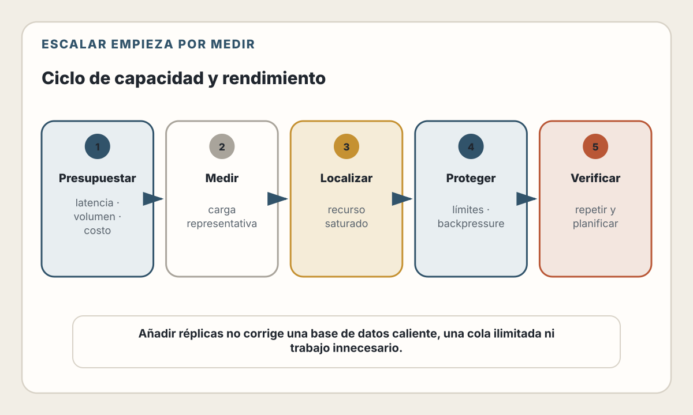

# 25. Escalabilidad y Rendimiento

> Escalar no es añadir máquinas. Es conservar un comportamiento aceptable
> mientras cambian la demanda, los datos y las condiciones de fallo.

---

## Objetivos de Aprendizaje

Al finalizar este capítulo, serás capaz de:

- Distinguir latencia, throughput, concurrencia, utilización y capacidad
- Localizar un cuello de botella mediante mediciones, no intuiciones
- Comparar escalado vertical, horizontal y particionamiento
- Diseñar cachés y CDNs sin perder corrección ni aislamiento
- Proteger servicios mediante límites, backpressure y degradación controlada
- Planificar capacidad y ejecutar pruebas de carga representativas
- Medir rendimiento web desde el laboratorio y desde usuarios reales
- Usar IA para proponer experimentos sin aceptar optimizaciones no demostradas

## Modelo mental

El rendimiento describe cómo utiliza recursos un sistema para completar trabajo.
La escalabilidad describe cómo cambia ese comportamiento cuando aumentan o se
redistribuyen la carga, los datos o los componentes.

El ciclo correcto es:

> definir una experiencia aceptable → medir una línea base → formular una
> hipótesis → cambiar una variable → volver a medir → decidir

<picture>
  <source media="(max-width: 820px)" srcset="../assets/diagrams/cap25-ciclo-capacidad-mobile.svg">
  
</picture>

Una optimización sin línea base es una apuesta. Un sistema “escalable” sin
presupuesto de latencia, coste y confiabilidad es solo una arquitectura más
compleja.

---

## Alcance

El capítulo 24 definió señales, SLIs y objetivos. Este capítulo usa esa evidencia
para responder:

- ¿qué limita hoy al sistema?;
- ¿qué ocurrirá si cambia la demanda?;
- ¿qué recurso debe ampliarse o protegerse?;
- ¿qué degradación es preferible cuando no alcanza la capacidad?

No repetiremos la selección de infraestructura del capítulo 23 ni el diseño de
índices del capítulo 13. Tampoco trataremos un pico de tráfico malicioso como un
problema meramente de escala: el capítulo 26 cubrirá amenazas y controles.

---

## El vocabulario de la capacidad

### Latencia

Tiempo transcurrido para completar una operación desde un punto de medición.
Debes especificar:

- inicio y fin;
- operación;
- población;
- resultado exitoso o fallido;
- distribución y ventana.

El tiempo observado por el navegador incluye componentes que el servidor no ve:
DNS, conexión, TLS, red, procesamiento y renderizado. La latencia interna de una
función no representa automáticamente la experiencia del usuario.

### Throughput

Cantidad de trabajo completado por unidad de tiempo: peticiones por segundo,
mensajes procesados, bytes transferidos o documentos generados.

Más throughput no siempre es mejor. Un sistema puede aceptar mucho trabajo,
acumularlo en una cola y responder tarde. Mide también edad, backlog y latencia.

### Concurrencia

Trabajo en progreso al mismo tiempo. Si llegan 100 operaciones por segundo y
cada una permanece un segundo en el sistema, habrá aproximadamente 100
operaciones concurrentes en estado estable. Si su duración aumenta, la
concurrencia también puede crecer aunque el tráfico no cambie.

Esta relación ayuda a detectar un círculo peligroso:

> más latencia → más trabajo concurrente → más contención → todavía más latencia

### Utilización, saturación y capacidad

- **Utilización:** proporción de un recurso ocupado durante una ventana.
- **Saturación:** trabajo que espera porque el recurso no puede atenderlo.
- **Capacidad:** carga que el sistema puede sostener dentro de objetivos
  definidos.

CPU al 70 % no significa por sí sola que quede 30 % de capacidad. El límite
puede estar en memoria, conexiones, I/O, locks, cuotas externas o una partición
caliente. La capacidad debe medirse como servicio, no deducirse de una sola
máquina.

---

## Presupuestos de rendimiento

Un presupuesto convierte “debe ser rápido” en una restricción verificable.

| Flujo | Indicador | Objetivo ilustrativo |
|-------|-----------|----------------------|
| Ver producto | LCP de visitas reales | 75 % bajo el umbral acordado |
| Crear pedido | Confirmaciones válidas bajo 2 s | 99 % en 30 días |
| Procesar imagen | Edad del trabajo al completarse | p95 bajo 60 s |
| Buscar | Respuestas correctas bajo 500 ms | 99 % por región |

Los valores son ejemplos, no recomendaciones universales. Derívalos de la
necesidad del usuario, el dispositivo, la red, el negocio y el coste.

Un presupuesto extremo puede desplazar problemas: reducir latencia mediante una
caché incorrecta, eliminar validaciones o multiplicar infraestructura no es una
mejora.

---

## Encontrar el cuello de botella

Un cuello de botella es el recurso o coordinación que limita el throughput o
la latencia bajo una carga concreta. Puede cambiar con el tráfico.

### Método

1. Define el síntoma y la población afectada.
2. Reproduce una carga representativa.
3. Observa latencia, errores, throughput y saturación juntos.
4. Sigue la traza hasta la etapa que acumula tiempo.
5. Compara uso y espera de cada recurso.
6. Cambia una variable o elimina una restricción.
7. Repite la prueba y busca el nuevo límite.

### Causas frecuentes

- consultas que leen o bloquean demasiado;
- pools de conexiones demasiado pequeños o demasiado grandes;
- llamadas remotas serializadas;
- trabajo de CPU dentro del hilo que atiende peticiones;
- payloads y respuestas innecesariamente grandes;
- contención por locks o estado compartido;
- una clave o partición mucho más activa que las demás;
- reintentos que multiplican el tráfico;
- colas sin límite;
- cachés con baja tasa de aciertos o invalidación masiva.

No optimices el código más visible. Optimiza la parte que la evidencia identifica
como límite dentro de un flujo importante.

### Ejemplo conceptual: presupuesto de latencia

Una petición con objetivo p95 de 500 ms podría reservar:

| Etapa | Presupuesto |
|-------|-------------|
| Gateway y red interna | 40 ms |
| Servicio | 80 ms |
| Base de datos | 180 ms |
| Dependencia externa | 150 ms |
| Margen | 50 ms |

La suma no garantiza el objetivo: las etapas pueden solaparse, tener colas o
mostrar distribuciones correlacionadas. El presupuesto sirve para localizar
dónde se consume el tiempo y negociar límites entre dependencias.

---

## Escalado vertical y horizontal

### Vertical

Aumenta recursos de una instancia: CPU, memoria, IOPS o conexiones.

**Ventajas:**

- cambio operativo sencillo;
- evita coordinación distribuida adicional;
- puede ser suficiente durante mucho tiempo.

**Límites:**

- existe un máximo físico o comercial;
- algunas ampliaciones requieren reinicio;
- una instancia mayor puede aumentar el radio de impacto;
- no resuelve por sí sola disponibilidad.

### Horizontal

Aumenta el número de instancias que atienden trabajo.

**Ventajas:**

- distribuye carga y puede mejorar tolerancia a fallos;
- permite añadir o retirar capacidad gradualmente;
- encaja con unidades de trabajo independientes.

**Costes:**

- balanceo y descubrimiento;
- coordinación de estado;
- consistencia de cachés;
- límites compartidos;
- distribución desigual;
- arranque, drenaje y escalado tardío.

Kubernetes Horizontal Pod Autoscaler, por ejemplo, ajusta réplicas a partir de
métricas de recursos, personalizadas o externas. Eso automatiza una decisión de
capacidad; no determina qué métrica expresa demanda ni garantiza que una nueva
réplica alivie el límite.

### El estado define la dificultad

Un handler sin estado local durable puede ejecutarse en varias instancias si
sesiones, archivos y coordinación viven en servicios adecuados. “Stateless” no
significa que la aplicación no tenga estado, sino que una instancia no sea la
única propietaria implícita de información necesaria para continuar.

Antes de escalar horizontalmente, pregunta:

- ¿dónde vive la sesión?;
- ¿qué ocurre con conexiones persistentes?;
- ¿cómo se distribuyen tareas?;
- ¿qué límites impone la base de datos?;
- ¿cómo se drena una instancia?;
- ¿qué sucede con trabajo en curso?

---

## Particionamiento: cuando replicar no basta

Replicar lectores distribuye ciertas consultas, pero un conjunto de datos o una
tasa de escritura puede superar una sola unidad. Particionar divide propiedad.

Una clave de partición debe:

- distribuir carga y almacenamiento;
- permitir las consultas importantes;
- evitar concentrar clientes o fechas populares;
- conservar una ruta para reequilibrar;
- hacer explícitas operaciones entre particiones.

### El problema de la partición caliente

Particionar por `tenant_id` parece natural hasta que un cliente produce la mitad
del tráfico. Particionar por fecha puede enviar todas las escrituras actuales al
mismo destino.

No existe una clave perfecta. Mide distribución, diseña límites por tenant y
prepara subdivisión o migración. El particionamiento añade metadatos, routing,
rebalanceo y nuevas formas de fallo; no debe ser el primer recurso para una base
que aún cabe y cumple objetivos.

---

## Caché: evitar trabajo con reglas de corrección

Una caché mejora rendimiento cuando reutiliza una respuesta válida más barato
que volver a producirla.

Cada decisión necesita:

- **clave:** qué solicitudes comparten valor;
- **valor:** qué se conserva;
- **frescura:** cuándo puede reutilizarse;
- **invalidación:** qué cambio lo vuelve incorrecto;
- **consistencia:** cuánto desfase acepta el producto;
- **fallo:** qué ocurre si la caché no está disponible.

### Patrones

| Patrón | Comportamiento | Riesgo |
|--------|----------------|--------|
| Cache-aside | La aplicación carga después de un miss | Stampede y datos obsoletos |
| Read-through | La capa de caché carga el valor | Acoplamiento a la plataforma |
| Write-through | Escribe caché y origen en el flujo | Más latencia y fallo coordinado |
| Stale-while-revalidate | Sirve valor antiguo mientras actualiza | Ventana explícita de obsolescencia |

Una expiración no garantiza corrección; solo limita cuánto puede durar un valor
obsoleto. Para datos sensibles, la clave debe incluir toda dimensión que cambie
la representación autorizada. Una caché compartida mal configurada puede
entregar contenido de un usuario a otro.

### Stampede

Cuando expiran muchas entradas o una clave popular, múltiples peticiones pueden
recalcular lo mismo y sobrecargar el origen. Mitigaciones:

- coalescing o single flight;
- expiraciones con variación;
- actualización anticipada;
- límites de concurrencia;
- servir stale durante una degradación;
- precalentamiento medido.

---

## CDN y edge

Una CDN acerca representaciones cacheables y absorbe trabajo repetido lejos del
origen. Reduce latencia y tráfico cuando la clave, la política HTTP y la
distribución de solicitudes permiten reutilización.

No acerca automáticamente los datos. Ejecutar código en el edge mientras cada
petición consulta una base en otra región puede añadir saltos y complejidad.

Antes de mover trabajo, mide:

- ubicación de usuarios y datos;
- hit ratio;
- latencia de miss y de hit;
- coste de egreso;
- invalidación;
- personalización;
- consistencia y residencia.

RFC 9111 define la semántica de caché HTTP. Las reglas de un proveedor añaden
capacidades, pero no reemplazan `Cache-Control`, validadores ni una clave
correcta.

---

## Límites, backpressure y degradación

Todo sistema tiene capacidad finita. Sin límites, la sobrecarga puede convertir
una degradación parcial en fallo total.

### Rate limiting y throttling

- **Rate limiting:** rechaza o difiere trabajo al superar una política.
- **Throttling:** reduce la tasa aceptada o procesada.
- **Cuotas:** asignan consumo durante una ventana o presupuesto.

Define la identidad del consumidor, la ventana, el comportamiento al excederla
y la distribución del contador. Un límite por IP puede agrupar usuarios detrás
de una red; uno por cuenta necesita autenticación y protección contra abuso.

### Backpressure

Un consumidor lento debe comunicar o imponer que el productor reduzca el ritmo.
Si cada capa sigue aceptando trabajo, la espera solo se mueve a memoria, sockets
o una cola.

Usa:

- colas acotadas;
- límites de concurrencia;
- deadlines propagados;
- cancelación;
- admisión por prioridad;
- rechazo temprano y barato.

### Load shedding y degradación

Cuando no puedes atender todo:

- rechaza trabajo de menor prioridad;
- omite funciones costosas;
- sirve una representación más barata;
- conserva capacidad para recuperación y control;
- devuelve una señal clara para evitar reintentos agresivos.

Los reintentos necesitan límite, backoff, jitter, idempotencia y presupuesto
total. De lo contrario amplifican la sobrecarga.

---

## Planificación de capacidad

Una previsión combina:

- demanda orgánica;
- lanzamientos y campañas;
- estacionalidad;
- crecimiento de datos;
- pérdida prevista de instancias o regiones;
- margen para despliegues y recuperación;
- tiempo necesario para aprovisionar.

No uses una relación histórica de “instancias por petición” indefinidamente. El
código, el mix de operaciones y los datos cambian. Google SRE recomienda
relacionar recursos con capacidad mediante pruebas de carga periódicas.

### Autoscaling no sustituye planificación

El escalado necesita tiempo para detectar, aprovisionar, iniciar y calentar.
También puede reaccionar a una señal retrasada o escalar una capa mientras otra
permanece limitada.

Define:

- mínimo y máximo;
- señal objetivo;
- tiempo de arranque;
- cooldown y estabilización;
- capacidad de dependencias;
- comportamiento al alcanzar el máximo;
- coste máximo aceptable.

---

## Pruebas de carga

Una prueba útil reproduce una hipótesis, no un número espectacular.

### Tipos

- **Baseline:** comportamiento bajo carga normal.
- **Load:** cumplimiento de objetivos bajo carga esperada.
- **Stress:** punto y forma de degradación.
- **Spike:** cambio brusco de demanda.
- **Soak:** fugas, acumulación y degradación prolongada.
- **Failover:** capacidad durante pérdida de componentes.

### Modelo de carga

Incluye:

- mezcla realista de operaciones;
- distribución de payloads;
- usuarios o tenants desiguales;
- caché fría y caliente;
- datos de tamaño representativo;
- dependencias con latencia y errores;
- ramp-up y steady state;
- criterios de parada seguros.

La prueba debe proteger producción. Usa entornos aislados cuando pueda causar
impacto y coordina cualquier experimento autorizado sobre sistemas reales.

### Resultado reproducible

Registra:

- versión y configuración;
- generador y ubicación;
- conjunto de datos;
- perfil de carga;
- métricas y trazas;
- límites alcanzados;
- coste;
- conclusión y siguiente experimento.

---

## Rendimiento en el navegador

El laboratorio ofrece control y repetibilidad. Real User Monitoring muestra
dispositivos, redes y comportamientos reales. Necesitas ambos.

### Core Web Vitals

> **Estado del ecosistema — verificado el 31 de julio de 2026.**
> Los Core Web Vitals estables son Largest Contentful Paint (LCP), Interaction
> to Next Paint (INP) y Cumulative Layout Shift (CLS). El conjunto y sus
> umbrales pueden evolucionar; consulta la documentación y el changelog antes de
> fijar políticas de producto.

No conviertas estos tres indicadores en la definición completa de rendimiento.
También importan inicio de navegación, respuesta del servidor, peso de recursos,
errores, consumo de memoria y duración de los flujos.

Resource Timing y Navigation Timing permiten descomponer tiempos desde el
navegador. Server Timing puede exponer mediciones del servidor al cliente. La
información cross-origin está limitada por diseño y requiere headers
específicos; considera privacidad antes de ampliar visibilidad.

### Presupuestos por recurso

Define límites para:

- JavaScript inicial;
- CSS bloqueante;
- fuentes;
- imágenes;
- peticiones de terceros;
- trabajo en el hilo principal.

Un bundle menor no garantiza una interacción rápida si ejecuta trabajo costoso.
Mide transferencia, parseo, ejecución y experiencia.

---

## IA aplicada a rendimiento

La IA puede:

- resumir perfiles y trazas;
- proponer hipótesis de cuello de botella;
- generar consultas;
- comparar resultados de pruebas;
- identificar operaciones repetidas;
- preparar un plan experimental.

No puede inferir capacidad real desde un diagrama ni asegurar que un benchmark
sintético represente producción.

Flujo recomendado:

1. Proporciona objetivo, línea base y perfil de carga.
2. Pide hipótesis falsables, no una lista de “mejores prácticas”.
3. Cambia una variable.
4. Ejecuta la misma medición.
5. Revisa corrección, coste y confiabilidad.
6. Conserva el experimento y sus resultados.

Rechaza optimizaciones que desactiven controles, cambien semántica o reduzcan
durabilidad sin hacer explícito el trade-off.

---

## Decisiones y trade-offs

| Decisión | Beneficio | Coste |
|----------|-----------|-------|
| Más instancias | Capacidad y aislamiento | Coordinación y coste |
| Caché | Menos latencia y origen | Invalidación y consistencia |
| Particionamiento | Distribuye datos y carga | Routing y operaciones cruzadas |
| Cola | Absorbe variación | Latencia y backlog |
| Sampling | Menor coste de medición | Menos detalle |
| Degradación | Conserva funciones críticas | Experiencia parcial |

Elige la solución más simple que cumpla el objetivo bajo carga y fallo medidos.

---

## Lista de Verificación

- [ ] Los objetivos definen latencia, población, ventana y punto de medición
- [ ] Se miden distribución, errores, throughput y saturación juntos
- [ ] El cuello de botella se demostró con una prueba reproducible
- [ ] La estrategia horizontal resuelve estado, drenaje y límites compartidos
- [ ] Las claves de partición se evaluaron con distribución realista
- [ ] Cada caché define clave, frescura, invalidación y fallo
- [ ] Las respuestas personalizadas no pueden cruzar usuarios mediante caché
- [ ] Las colas y pools tienen límites explícitos
- [ ] Los reintentos tienen deadline, backoff, jitter e idempotencia
- [ ] Existe un comportamiento de degradación al alcanzar capacidad
- [ ] Autoscaling considera tiempo de arranque y límites de dependencias
- [ ] Las pruebas de carga incluyen datos y mix de operaciones representativos
- [ ] Se mide rendimiento real del navegador además del laboratorio
- [ ] Cada optimización vuelve a verificar corrección, coste y SLOs

---

## Resumen

- Rendimiento y escalabilidad necesitan objetivos observables.
- Latencia, throughput, concurrencia y saturación describen aspectos distintos.
- El cuello de botella cambia con la carga y debe demostrarse.
- Escalar verticalmente puede ser correcto; escalar horizontalmente añade
  coordinación.
- Caché, CDN y particionamiento intercambian trabajo por nuevas reglas de
  corrección.
- Los límites y la degradación controlada evitan que la sobrecarga se propague.
- Planificación, autoscaling y pruebas de carga resuelven problemas diferentes.
- El navegador y el servidor deben medirse como un flujo, no como mundos
  separados.
- La IA propone experimentos; la evidencia decide.

---

## Ejercicios

1. **Modelo de capacidad:** define carga, concurrencia y objetivos para una API.
2. **Cuello de botella:** diseña un experimento que distinga CPU, base de datos y
   dependencia externa.
3. **Caché:** especifica clave, TTL, invalidación y comportamiento ante fallo
   para un catálogo personalizado.
4. **Sobrecarga:** diseña límites, prioridades y degradación para una venta
   relámpago.
5. **Prueba de carga:** redacta un perfil con ramp-up, steady state, mix de
   operaciones y criterios de parada.
6. **IA y evidencia:** pide tres optimizaciones a una IA y convierte cada una en
   una hipótesis medible con condición de éxito y rollback.

---

## Referencias

- [Google SRE — Production Services Best Practices](https://sre.google/sre-book/service-best-practices/)
- [Google SRE — Addressing Cascading Failures](https://sre.google/sre-book/addressing-cascading-failures/)
- [Google SRE — Handling Overload](https://sre.google/sre-book/handling-overload/)
- [Google SRE Workbook — Managing Load](https://sre.google/workbook/managing-load/)
- [Kubernetes — Horizontal Pod Autoscaling](https://kubernetes.io/docs/concepts/workloads/autoscaling/horizontal-pod-autoscale/)
- [IETF — RFC 9111: HTTP Caching](https://www.rfc-editor.org/rfc/rfc9111)
- [W3C — Resource Timing](https://www.w3.org/TR/resource-timing/)
- [W3C — Server Timing](https://www.w3.org/TR/server-timing/)
- [web.dev — Web Vitals](https://web.dev/articles/vitals)
- [Cloudflare — Cache Keys](https://developers.cloudflare.com/cache/how-to/cache-keys/)
- [AWS — Exponential Backoff and Jitter](https://aws.amazon.com/blogs/architecture/exponential-backoff-and-jitter/)
