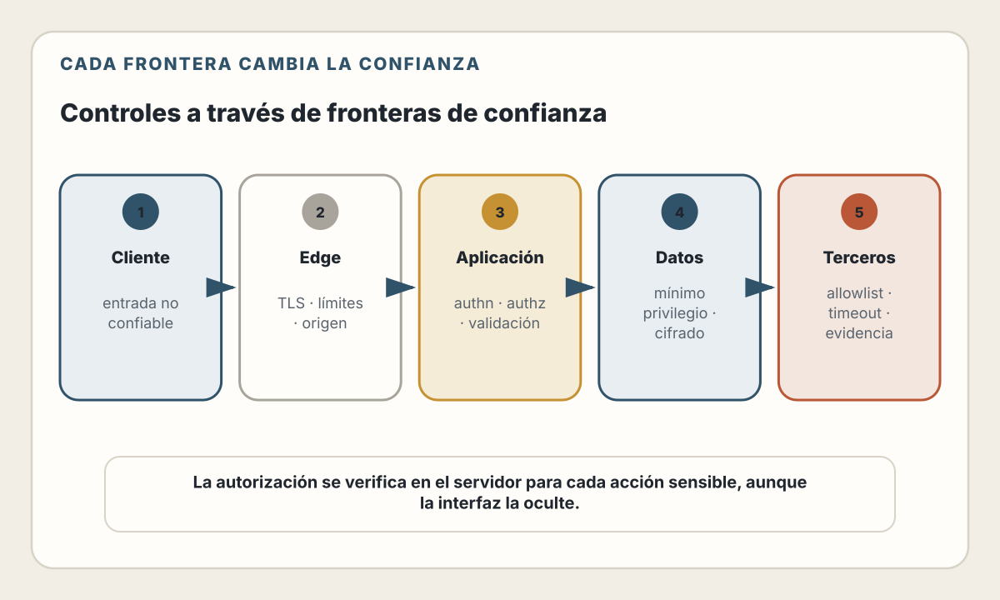

# 26. Seguridad en Aplicaciones Web

> La seguridad no es una propiedad que se añade al final. Es la capacidad de
> conservar límites y resultados válidos incluso ante entradas y actores
> hostiles.

---

## Objetivos de Aprendizaje

Al finalizar este capítulo, serás capaz de:

- Modelar activos, actores, fronteras de confianza y abusos
- Convertir riesgos en requisitos y pruebas verificables
- Distinguir validación, sanitización, codificación y parametrización
- Prevenir clases comunes de inyección, XSS, SSRF y manejo inseguro de archivos
- Diseñar configuración, secretos y dependencias con menor radio de impacto
- Integrar seguridad en diseño, implementación, CI/CD y operación
- Priorizar vulnerabilidades mediante exposición, impacto y explotabilidad
- Usar IA sin enviar secretos ni aceptar controles plausibles sin verificarlos

## Modelo mental

Una aplicación segura mantiene invariantes bajo condiciones adversas:

- una persona solo accede a recursos autorizados;
- datos no confiables no se convierten en instrucciones;
- secretos no aparecen donde no son necesarios;
- un componente comprometido tiene permisos y alcance limitados;
- fallos excepcionales terminan en un estado seguro y observable;
- el equipo puede detectar, contener, corregir y aprender.

El ciclo es:

> identificar activos → modelar amenazas → definir controles → verificar →
> observar → responder → mejorar

No existe “100 % seguro”. Existe riesgo entendido, reducido, transferido,
aceptado o pendiente, con responsables y evidencia.

---

## Alcance y relación con otros capítulos

La seguridad atraviesa todo el libro:

- El capítulo 5 explica origen, cookies, CORS, CSP y controles del navegador.
- El capítulo 12 cubre contratos y validación en APIs.
- El capítulo 13 trata restricciones e integridad de datos.
- El capítulo 17 desarrolla autenticación, sesiones y autorización.
- El capítulo 20 aborda idempotencia y reintentos.
- Los capítulos 22 y 23 cubren pipelines, permisos y despliegue.
- El capítulo 24 explica logging, alertas e incidentes.

Este capítulo no repite esas implementaciones. Las conecta mediante un proceso
de seguridad de aplicaciones: modelar amenazas, elegir defensas por contexto,
verificarlas y mantenerlas durante la vida del producto.

---

## De listas de riesgos a requisitos

OWASP Top 10 es un documento de concientización. Ayuda a reconocer familias de
riesgo, pero no constituye por sí solo una especificación completa ni una
certificación.

> **Estado del ecosistema — verificado el 31 de julio de 2026.**
> OWASP Top 10:2025 incluye control de acceso roto, configuración insegura,
> fallos de cadena de suministro, fallos criptográficos, inyección, diseño
> inseguro, fallos de autenticación, fallos de integridad de software o datos,
> fallos de logging y alertas, y manejo incorrecto de condiciones
> excepcionales.

La lista cambia porque cambian datos, categorías y énfasis. No diseñes una
aplicación solo para “pasar el Top 10”.

OWASP Application Security Verification Standard (ASVS) 5.0.0 proporciona
requisitos verificables para controles técnicos. Puedes seleccionar requisitos
según riesgo y nivel de aseguramiento, conservar sus identificadores versionados
y convertirlos en criterios de aceptación.

| Herramienta | Uso correcto |
|-------------|--------------|
| OWASP Top 10 | Concientización y conversación inicial sobre riesgos |
| ASVS | Requisitos y cobertura de verificación |
| Cheat Sheets | Guía específica para implementar controles |
| Threat model | Riesgos propios del sistema y del negocio |
| Pen test | Evaluación acotada en un momento concreto |

Ninguna reemplaza a las demás.

---

## Modelado de amenazas

Un threat model es una representación revisable de cómo puede abusarse del
sistema. Empieza antes del código y cambia con arquitectura, datos y atacantes.

### 1. Define el alcance

- sistema y versión;
- flujos incluidos;
- datos y operaciones;
- dependencias;
- supuestos;
- exclusiones y responsables.

### 2. Identifica activos

No solo “la base de datos”:

- identidad y sesiones;
- datos personales;
- dinero, saldo o inventario;
- disponibilidad;
- reputación;
- capacidad de desplegar;
- secretos y claves;
- logs y evidencia;
- modelos, instrucciones y herramientas de IA.

### 3. Dibuja fronteras de confianza

Una frontera aparece cuando datos o acciones cruzan entre:

- navegador y servidor;
- servicio y servicio;
- tenant y tenant;
- aplicación y proveedor;
- pipeline y producción;
- persona y automatización;
- componente con menos y más privilegios.

“Interno” no significa confiable. Una cuenta, dependencia o servicio interno
puede estar comprometido.

<picture>
  <source media="(max-width: 820px)" srcset="../assets/diagrams/cap26-fronteras-confianza-mobile.svg">
  
</picture>

### 4. Describe abusos

Formula historias concretas:

> Un usuario autenticado modifica el identificador de un documento e intenta
> leer el de otro tenant.

> Un atacante proporciona una URL que obliga al servidor a consultar un
> endpoint interno de metadatos.

> Una dependencia comprometida intenta extraer el token disponible durante el
> build.

Cada historia debe conducir a prevención, detección, respuesta o aceptación
explícita.

### 5. Prioriza

Considera:

- impacto;
- exposición;
- facilidad y precondiciones;
- detectabilidad;
- alcance;
- controles existentes;
- recuperación.

Una puntuación ayuda a ordenar, pero no sustituye juicio de producto, legal,
privacidad y seguridad.

---

## Datos no confiables: conservar su naturaleza

El error común es permitir que datos se interpreten como código, consulta,
markup, ruta o comando.

### Validación

Comprueba que una entrada satisface el contrato:

- tipo;
- longitud;
- rango;
- estructura;
- relación con otros campos;
- regla de negocio.

Debe ocurrir en el servidor y en cada frontera relevante. La validación del
cliente mejora experiencia, pero el cliente es controlable.

OWASP distingue validación sintáctica y semántica. Una fecha puede tener formato
válido y aun así ser imposible para el flujo. Las allowlists son adecuadas para
dominios acotados; una denylist de caracteres “peligrosos” se evade con
facilidad.

### Parametrización

Separa consulta e información:

```javascript
// Conceptual: el driver y su API concreta pueden variar.
const result = await database.query(
  "SELECT id, name FROM projects WHERE tenant_id = $1 AND id = $2",
  [tenantId, projectId],
);
```

Los parámetros protegen valores, no nombres de tabla, fragmentos de orden ni
partes arbitrarias de la consulta. Para esos elementos usa elecciones
predefinidas y mapeos explícitos.

### Codificación de salida

Representa datos de forma segura para el contexto de destino: HTML, atributo,
URL, JavaScript o CSS. Una función de escape universal no existe.

Prefiere APIs que tratan texto como texto, como `textContent`, y plantillas con
codificación automática. Evita construir HTML con concatenación.

### Sanitización

La sanitización transforma contenido cuando el producto necesita aceptar un
subconjunto activo, por ejemplo HTML enriquecido. Usa una biblioteca mantenida,
una política explícita y pruebas adversariales. Sanitizar no es eliminar la
palabra `script`.

### Canonicalización

Decodifica y normaliza de forma controlada antes de comparar rutas, hosts o
identificadores. Diferentes representaciones del mismo valor pueden evadir
validaciones hechas en otra etapa.

---

## Riesgos por frontera

### Control de acceso

La autorización se verifica en el servidor para cada operación y objeto. Una UI
que oculta un botón no es un control.

Evita:

- confiar en roles enviados por el cliente;
- filtrar por `id` sin incluir tenant o propietario;
- asumir que un UUID vuelve secreto un recurso;
- autorizar al principio de un workflow y no al ejecutar el paso diferido.

Centraliza políticas donde sea posible, pero conserva contexto de negocio.
Prueba acceso horizontal, vertical y entre tenants.

### XSS

Cross-Site Scripting ocurre cuando contenido no confiable se ejecuta en el
contexto de un sitio. La defensa principal depende del contexto:

- codificación de salida;
- APIs seguras;
- sanitización para contenido enriquecido;
- evitar sinks peligrosos;
- CSP como defensa adicional.

CSP reduce impacto y aporta reportes, pero no corrige por sí sola una inyección.

### CSRF

Cuando el navegador adjunta credenciales automáticamente, una petición inducida
desde otro sitio puede ejecutar una acción. Usa:

- métodos y contratos correctos;
- tokens anti-CSRF cuando correspondan;
- verificación de origen;
- cookies `SameSite` como capa;
- reautenticación para acciones críticas.

No uses CORS como defensa contra CSRF. CORS controla qué respuestas puede leer
el JavaScript de otro origen; no impide todas las peticiones.

### SSRF

Una función que descarga una URL proporcionada puede convertirse en proxy hacia
redes internas, servicios cloud o protocolos no previstos.

Controles:

- evitar destinos arbitrarios;
- allowlist de esquemas, hosts y puertos;
- resolver y validar direcciones;
- bloquear rangos internos y metadatos;
- limitar redirects;
- egress control;
- timeouts y tamaño;
- ejecutar con identidad de mínimo privilegio.

La validación de texto no basta si DNS, redirects o diferencias entre parsers
cambian el destino efectivo.

### Archivos

Para uploads:

- limita cantidad y tamaño;
- genera nombres propios;
- almacena fuera de rutas ejecutables;
- valida tipo mediante más de una señal;
- analiza cuando el riesgo lo justifique;
- sirve con headers y origen apropiados;
- aplica autorización a lectura y eliminación;
- procesa en aislamiento.

El nombre y `Content-Type` entregados por el cliente no demuestran contenido.

---

## Criptografía y secretos

No diseñes algoritmos criptográficos. Usa bibliotecas y protocolos mantenidos y
parámetros vigentes.

### Datos en tránsito y reposo

TLS protege conexiones, no arregla autorización ni evita que el servidor
registre datos sensibles. El cifrado en reposo protege frente a ciertos accesos
al medio o backups, pero una aplicación comprometida con la clave puede leer.

Define:

- amenaza;
- datos cubiertos;
- ubicación y acceso a claves;
- rotación;
- recuperación;
- eliminación;
- auditoría.

### Ciclo de vida de secretos

Un secreto necesita:

1. generación;
2. almacenamiento;
3. entrega;
4. uso;
5. rotación;
6. revocación;
7. eliminación.

Prefiere identidades de workload y credenciales breves frente a secretos
compartidos y duraderos. Limita privilegios, entorno y recursos. Un gestor de
secretos no ayuda si la aplicación imprime el valor o cualquier maintainer del
repositorio puede extraerlo.

Si un secreto se filtra:

- revócalo o rótalo;
- determina alcance y uso;
- conserva evidencia;
- elimina la copia del historial cuando proceda, sin asumir que eso lo invalida;
- corrige la ruta que permitió la exposición.

---

## Configuración segura y condiciones excepcionales

Una aplicación puede usar código correcto con una configuración peligrosa.

Revisa:

- modo debug desactivado;
- errores externos sin stack ni detalles internos;
- headers y cookies;
- orígenes permitidos;
- permisos de archivos y red;
- cuentas y endpoints por defecto;
- paneles administrativos;
- almacenamiento público;
- límites de petición;
- versiones y flags.

### Fallar de forma segura

Timeouts, errores parciales y estados inesperados deben terminar en un estado
definido:

- una autorización fallida deniega;
- una transacción incompleta revierte o compensa;
- un parser excedido rechaza;
- una dependencia lenta respeta deadline;
- un paso crítico sin evidencia requerida no continúa silenciosamente.

Capturar una excepción y devolver éxito puede convertir un fallo operativo en
un fallo de integridad.

---

## Cadena de suministro

Tu aplicación incluye:

- dependencias directas y transitivas;
- runtime e imagen base;
- acciones de CI;
- compiladores y package managers;
- artefactos descargados;
- infraestructura y proveedores.

### Reducir riesgo

- minimiza dependencias;
- usa lockfiles y builds reproducibles;
- revisa procedencia y mantenedores;
- fija artefactos sensibles de forma verificable;
- escanea vulnerabilidades y secretos;
- genera inventario o SBOM cuando el contexto lo requiera;
- firma y verifica artefactos según el modelo de amenaza;
- limita permisos y red del build;
- conserva trazabilidad desde commit hasta despliegue.

Una alerta de vulnerabilidad no determina prioridad automáticamente. Comprueba:

- si la versión está afectada;
- si el componente se incluye y ejecuta;
- si la ruta vulnerable es alcanzable;
- qué privilegios tiene;
- qué mitigaciones existen;
- si actualizar introduce otro riesgo.

Tampoco ignores una vulnerabilidad solo porque “no se ha explotado todavía”.
Registra la decisión y su fecha de revisión.

---

## Seguridad dentro del ciclo de desarrollo

NIST SSDF organiza prácticas para preparar la organización, proteger el
software, producir software bien asegurado y responder a vulnerabilidades. La
seguridad no debe depender de una revisión final.

### Antes de implementar

- clasifica datos;
- modela amenazas;
- selecciona requisitos ASVS;
- define abuso y criterios negativos;
- diseña mínimo privilegio y aislamiento.

### Durante

- revisa cambios sensibles;
- usa análisis estático y de dependencias;
- prueba autorización y validación;
- protege secretos de desarrollo;
- registra decisiones de riesgo.

### Antes de desplegar

- verifica configuración;
- revisa permisos del pipeline y runtime;
- prueba rollback y rotación;
- confirma logging y alertas de seguridad;
- conserva inventario y procedencia.

### En producción

- recibe reportes y vulnerabilidades;
- prioriza y remedia;
- detecta abuso;
- rota credenciales;
- ejercita respuesta;
- incorpora aprendizajes al diseño y las pruebas.

Un pentest aporta evidencia acotada. No demuestra ausencia de vulnerabilidades y
no sustituye controles continuos.

---

## Verificación de seguridad

Combina técnicas:

| Técnica | Encuentra bien | Limitación |
|---------|----------------|------------|
| Revisión de diseño | Fronteras y controles ausentes | Depende de modelos actualizados |
| SAST | Patrones en código | Falsos positivos y contexto limitado |
| SCA | Componentes conocidos | No prueba alcance ni explotación |
| DAST | Comportamiento desplegado | Cobertura limitada |
| Tests de seguridad | Invariantes específicas | Solo cubren casos escritos |
| Pentest | Cadenas y abuso creativo | Muestra temporal y acotada |
| Revisión manual | Lógica y contexto | Coste y variabilidad |

Los hallazgos necesitan:

- evidencia reproducible;
- activo y versión;
- impacto;
- precondiciones;
- prioridad;
- propietario;
- mitigación;
- verificación de la corrección.

No copies payloads con datos sensibles a tickets públicos.

---

## Logging, detección y respuesta

Registra eventos relevantes:

- accesos y cambios de privilegio;
- fallos de autenticación y autorización;
- cambios de configuración;
- uso y rotación de secretos;
- operaciones administrativas;
- validaciones anómalas;
- exportaciones y eliminaciones;
- decisiones de controles automáticos.

Evita registrar secretos y datos personales innecesarios. Protege integridad,
acceso y retención de la evidencia.

Una alerta de seguridad necesita contexto y respuesta. “Actividad rara” sin
acción ni umbral produce fatiga. Define runbooks para contener credenciales,
cuentas, tráfico o despliegues sin destruir evidencia.

Los requisitos de notificación, retención y comunicación dependen de
jurisdicción, contrato y sector. Compliance es una obligación contextual, no
sinónimo de seguridad.

---

## IA aplicada a seguridad

La IA puede:

- generar casos de abuso;
- mapear un diseño contra ASVS;
- revisar cambios;
- explicar un hallazgo;
- proponer pruebas negativas;
- correlacionar evidencia autorizada;
- ayudar a redactar un plan de remediación.

Riesgos:

- inventar garantías de una librería;
- sugerir criptografía casera;
- marcar código como seguro sin ejecutar pruebas;
- filtrar secretos o vulnerabilidades a un servicio externo;
- producir payloads peligrosos fuera de un entorno autorizado;
- aplicar una remediación que rompe el control o la lógica.

### Flujo responsable

1. Define activo, frontera y modelo de amenaza.
2. Proporciona código y datos mínimos, sin secretos reales.
3. Solicita afirmaciones con evidencia y referencias primarias.
4. Reproduce el hallazgo en un entorno autorizado.
5. Verifica impacto y alcance.
6. Implementa una corrección pequeña.
7. Añade una prueba que falle antes y pase después.
8. Revisa regresiones y controles adyacentes.

Nunca autorices pruebas contra sistemas o datos fuera del alcance acordado.

---

## Decisiones y trade-offs

| Decisión | Beneficio | Riesgo |
|----------|-----------|--------|
| Bloquear por defecto | Reduce exposición | Puede impedir casos legítimos |
| Más logging | Mejor investigación | Privacidad, coste y nuevos secretos |
| WAF | Mitigación rápida | No corrige diseño ni lógica |
| Dependencia de seguridad | Implementación mantenida | Riesgo de suministro y configuración |
| Credenciales breves | Menor ventana de abuso | Más dependencia del emisor |
| Aislamiento | Menor radio de impacto | Complejidad y coste |

Documenta quién acepta el riesgo residual y cuándo debe revisarse.

---

## Lista de Verificación

- [ ] Activos, actores y fronteras de confianza están documentados
- [ ] Los abusos críticos tienen prevención, detección y respuesta
- [ ] Los requisitos de seguridad están versionados y son verificables
- [ ] La autorización se comprueba por operación, objeto y tenant
- [ ] Las entradas se validan sintáctica y semánticamente en el servidor
- [ ] Consultas y comandos separan instrucciones de datos
- [ ] La salida se codifica según su contexto
- [ ] El HTML permitido usa una sanitización mantenida
- [ ] URLs, redirects, archivos y parsers tienen límites
- [ ] Secretos poseen propietario, alcance, rotación y revocación
- [ ] Configuración de producción falla de forma segura
- [ ] Builds y artefactos conservan procedencia e inventario
- [ ] Hallazgos se priorizan por alcance e impacto real
- [ ] Eventos de seguridad son detectables sin registrar secretos
- [ ] Existe un proceso de divulgación y respuesta a vulnerabilidades
- [ ] Las herramientas de IA operan con datos y alcance autorizados

---

## Resumen

- La seguridad conserva invariantes bajo comportamiento hostil.
- Top 10 orienta; ASVS convierte riesgos en requisitos verificables.
- El threat model conecta activos y fronteras con abusos propios del producto.
- Validación, parametrización, codificación y sanitización resuelven problemas
  distintos.
- El mínimo privilegio limita el radio de impacto.
- Configuración, excepciones y cadena de suministro son parte de la aplicación.
- Verificación combina diseño, automatización, pruebas y revisión humana.
- Compliance no demuestra seguridad.
- La IA amplía análisis y pruebas, pero también la exposición y la velocidad de
  cometer errores.

---

## Ejercicios

1. **Threat model:** modela un sistema de documentos compartidos e identifica
   cinco historias de abuso.
2. **Fronteras:** revisa un flujo de upload desde navegador hasta almacenamiento
   y procesamiento. Define un control en cada frontera.
3. **ASVS:** selecciona diez requisitos de ASVS 5.0.0 para una API y conviértelos
   en criterios de aceptación.
4. **Cadena de suministro:** crea un inventario desde commit, dependencias y
   build hasta imagen desplegada.
5. **Incidente:** diseña la respuesta ante un secreto publicado en un repositorio.
6. **IA y verificación:** pide una revisión de seguridad de un fragmento
   ficticio, reproduce dos hallazgos y documenta un falso positivo.

---

## Referencias

- [OWASP Top 10:2025](https://owasp.org/Top10/2025/)
- [OWASP Application Security Verification Standard](https://owasp.org/www-project-application-security-verification-standard/)
- [OWASP Cheat Sheet — Input Validation](https://cheatsheetseries.owasp.org/cheatsheets/Input_Validation_Cheat_Sheet.html)
- [OWASP Cheat Sheet — Cross Site Scripting Prevention](https://cheatsheetseries.owasp.org/cheatsheets/Cross_Site_Scripting_Prevention_Cheat_Sheet.html)
- [OWASP Cheat Sheet — Server-Side Request Forgery Prevention](https://cheatsheetseries.owasp.org/cheatsheets/Server_Side_Request_Forgery_Prevention_Cheat_Sheet.html)
- [OWASP Cheat Sheet — File Upload](https://cheatsheetseries.owasp.org/cheatsheets/File_Upload_Cheat_Sheet.html)
- [OWASP Cheat Sheet — Secrets Management](https://cheatsheetseries.owasp.org/cheatsheets/Secrets_Management_Cheat_Sheet.html)
- [OWASP Cheat Sheet — Content Security Policy](https://cheatsheetseries.owasp.org/cheatsheets/Content_Security_Policy_Cheat_Sheet.html)
- [OWASP Cheat Sheet — Logging](https://cheatsheetseries.owasp.org/cheatsheets/Logging_Cheat_Sheet.html)
- [NIST SP 800-218 — Secure Software Development Framework 1.1](https://csrc.nist.gov/pubs/sp/800/218/final)
