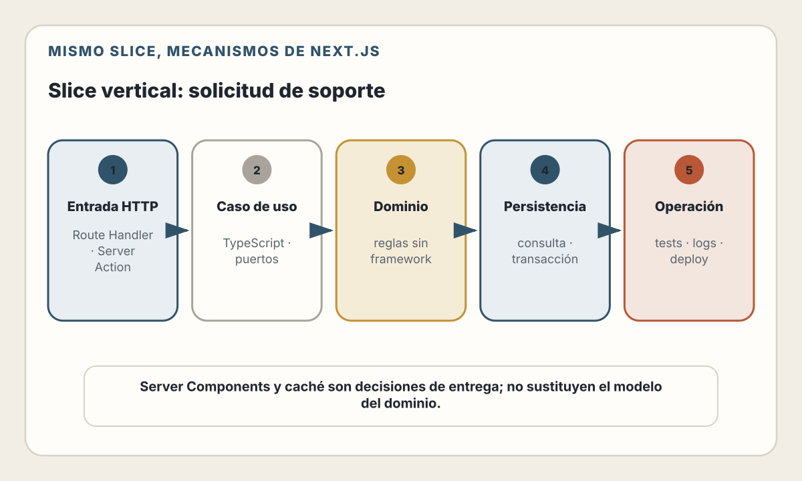

# 27. Stack: Next.js + Node.js

> Un framework full stack acorta la distancia entre interfaz y servidor. No
> elimina contratos, fronteras de confianza ni decisiones de arquitectura.

---

## Objetivos de Aprendizaje

Al finalizar este capítulo, serás capaz de:

- Organizar una aplicación Next.js por capacidades y responsabilidades
- Decidir qué código pertenece al servidor y qué código necesita el navegador
- Implementar un slice vertical con Server Components y Server Actions
- Distinguir una acción interna de un contrato HTTP para otros clientes
- Centralizar persistencia y autorización en una capa de acceso a datos
- Diseñar pruebas que cubran dominio, integración y experiencia
- Desplegar un servidor Node.js con migraciones y observabilidad
- Usar IA para acelerar el trabajo sin ocultar límites de seguridad

## Modelo mental

Next.js puede reunir en un repositorio:

- documentos y componentes de interfaz;
- lectura de datos en el servidor;
- mutaciones iniciadas desde formularios;
- endpoints HTTP;
- recursos estáticos;
- configuración de build y ejecución.

La proximidad es útil, pero no convierte todo en una sola responsabilidad. El
navegador sigue siendo un entorno no confiable. La base de datos sigue siendo
una dependencia remota. Una Server Action sigue siendo un punto de entrada. Un
Route Handler sigue siendo una API.

El modelo de este capítulo es:

> interfaz → punto de entrada → caso de uso → acceso a datos → PostgreSQL

Autenticación, validación y observabilidad atraviesan ese recorrido. La interfaz
no decide qué puede hacer una persona; solo representa decisiones verificadas
en el servidor.

---

## Estado del ecosistema

> **Verificado el 31 de julio de 2026.**
> Node.js 24 se encuentra en soporte LTS. Node.js 26 es la rama Current y
> Node.js 20 ya alcanzó fin de vida. Para producción conviene elegir una rama
> LTS soportada, fijar su versión menor mediante la imagen o el entorno de
> ejecución y actualizar sus parches de seguridad.

La documentación actual de Next.js presenta App Router como el router que usa
Server Components, Suspense y Server Functions. Las páginas y layouts son
Server Components por defecto; los Client Components se reservan para estado,
eventos y APIs del navegador.

No fijaremos una versión de Next.js en el texto. El proyecto real debe:

1. declarar versiones concretas en `package.json`;
2. conservar el lockfile;
3. revisar la guía de actualización antes de subir una versión mayor;
4. ejecutar pruebas y un build reproducible.

El fundamento es más estable que la sintaxis: mantener el código sensible en el
servidor, autorizar cerca de los datos y hacer explícitas las fronteras.

---

## El slice vertical: solicitudes de soporte

Construiremos una capacidad pequeña:

- una persona autenticada crea una solicitud;
- consulta solamente sus solicitudes;
- ve una solicitud propia;
- cierra una solicitud propia que aún está abierta.

El modelo mínimo es:

| Campo | Regla |
|-------|-------|
| `id` | Identificador generado por el servidor |
| `user_id` | Propietario obtenido de la sesión, nunca del formulario |
| `subject` | Entre 5 y 120 caracteres |
| `description` | Entre 20 y 5 000 caracteres |
| `status` | `open` o `closed` |
| `created_at` | Instante asignado por la base de datos |
| `updated_at` | Instante de la última modificación |

La regla crítica es:

> Toda lectura o mutación de una solicitud incluye el `user_id` autenticado en
> la consulta.

<picture>
  <source media="(max-width: 820px)" srcset="../assets/diagrams/cap27-slice-nextjs-mobile.svg">
  
</picture>

Ocultar un enlace en la UI no implementa autorización. Consultar por `id` y
comprobar al final tampoco es una buena frontera si la consulta ya expuso datos.

### Contrato HTTP

Aunque la primera interfaz sea web, escribimos el contrato antes de elegir el
mecanismo de entrada:

| Operación | HTTP | Resultado |
|-----------|------|-----------|
| Crear | `POST /api/support-requests` | `201` y recurso creado |
| Listar propias | `GET /api/support-requests` | `200` y colección |
| Ver propia | `GET /api/support-requests/{id}` | `200` o `404` |
| Cerrar propia | `POST /api/support-requests/{id}/close` | `200`, `404` o `409` |

La aplicación web puede invocar el mismo caso de uso mediante Server Actions
sin hacer una petición HTTP a sí misma. El contrato HTTP es necesario cuando
habrá una app móvil, integraciones, webhooks inversos o consumidores externos.
No crees una Route Handler solo para que un Server Component local la llame:
esa vuelta añade serialización, red interna y otra superficie de error.

---

## Estructura por capacidad

Una estructura razonable para este slice es:

```text
app/
  support/
    actions.ts
    new/
      page.tsx
    [id]/
      page.tsx
    page.tsx
  api/
    support-requests/
      route.ts
      [id]/
        route.ts
        close/
          route.ts
instrumentation.ts
lib/
  auth/
    session.ts
  support/
    contracts.ts
    repository.ts
    service.ts
  database.ts
tests/
  integration/
  e2e/
```

No es una plantilla universal. Sus decisiones sí son intencionales:

- `app/` contiene adaptadores de interfaz y HTTP;
- `lib/support/` concentra reglas del caso de uso;
- el repositorio es el único lugar que conoce SQL;
- la sesión se verifica desde el servidor;
- las pruebas no dependen de que todo viva en un archivo.

En un producto grande pueden existir módulos de dominio, colas y servicios
separados. Empieza con límites claros dentro del monolito antes de distribuirlos.

---

## Persistencia e invariantes

La migración es parte del producto, no un efecto lateral al arrancar:

```sql
CREATE TABLE support_requests (
  id uuid PRIMARY KEY,
  user_id uuid NOT NULL,
  subject text NOT NULL CHECK (char_length(subject) BETWEEN 5 AND 120),
  description text NOT NULL
    CHECK (char_length(description) BETWEEN 20 AND 5000),
  status text NOT NULL DEFAULT 'open'
    CHECK (status IN ('open', 'closed')),
  created_at timestamptz NOT NULL DEFAULT now(),
  updated_at timestamptz NOT NULL DEFAULT now()
);

CREATE INDEX support_requests_owner_created_idx
  ON support_requests (user_id, created_at DESC);
```

La validación de aplicación produce errores comprensibles. Las restricciones
de base de datos protegen invariantes frente a otros procesos y carreras. No
son sustitutos entre sí.

### Acceso a datos del lado servidor

El siguiente fragmento es conceptual: la API concreta depende del driver u ORM.
Lo importante es el límite.

```typescript
import "server-only";

type NewSupportRequest = {
  subject: string;
  description: string;
};

export async function createForUser(
  userId: string,
  input: NewSupportRequest,
) {
  const id = crypto.randomUUID();

  const result = await database.query(
    `INSERT INTO support_requests
       (id, user_id, subject, description)
     VALUES ($1, $2, $3, $4)
     RETURNING id, subject, description, status, created_at, updated_at`,
    [id, userId, input.subject, input.description],
  );

  return result.rows[0];
}

export async function findForUser(userId: string, id: string) {
  const result = await database.query(
    `SELECT id, subject, description, status, created_at, updated_at
       FROM support_requests
      WHERE id = $1 AND user_id = $2`,
    [id, userId],
  );

  return result.rows[0] ?? null;
}
```

Observa dos detalles:

- `user_id` se recibe desde la identidad verificada, no desde los datos del
  cliente;
- el objeto de salida omite `user_id` porque la interfaz no lo necesita.

Una capa de acceso a datos también facilita revisar todas las consultas de
autorización y evita importar credenciales de base de datos en un Client
Component.

---

## Lectura con Server Components

Una página de App Router es un Server Component por defecto. Puede verificar la
sesión y consultar datos sin enviar al navegador el cliente de base de datos ni
sus credenciales:

```tsx
import { requireSession } from "@/lib/auth/session";
import { listForUser } from "@/lib/support/repository";

export default async function SupportPage() {
  const session = await requireSession();
  const requests = await listForUser(session.userId);

  return (
    <main>
      <h1>Mis solicitudes</h1>
      <ul>
        {requests.map((request) => (
          <li key={request.id}>
            <a href={`/support/${request.id}`}>{request.subject}</a>
            <span>{request.status}</span>
          </li>
        ))}
      </ul>
    </main>
  );
}
```

Usa un Client Component cuando el comportamiento requiera:

- estado interactivo que cambia en el navegador;
- manejadores de eventos;
- `window`, `localStorage` u otra API web;
- un hook exclusivamente cliente.

No añadas `"use client"` a un árbol entero por comodidad. Esa directiva crea
una frontera de bundle: sus imports y descendientes pasan a formar parte del
grafo cliente. Mantener la frontera pequeña reduce JavaScript, exposición
accidental y trabajo de hidratación.

### Carga, error y ausencia

Diseña estados separados:

- `loading.tsx` para una espera recuperable;
- `error.tsx` para un fallo inesperado, con identificador correlacionable;
- `not-found.tsx` o una respuesta equivalente para recurso inexistente o no
  visible;
- estado vacío para una colección válida sin elementos.

No muestres una traza ni detalles de infraestructura al usuario. Regístralos en
el servidor con contexto suficiente.

---

## Mutaciones con Server Actions

Una Server Action reduce pegamento entre formulario y servidor, pero no es una
función “interna” confiable. Debe tratarse como un endpoint expuesto:

```typescript
"use server";

import { revalidatePath } from "next/cache";
import { redirect } from "next/navigation";
import { requireSession } from "@/lib/auth/session";
import { createForUser } from "@/lib/support/repository";
import { validateNewRequest } from "@/lib/support/contracts";

export async function createSupportRequest(formData: FormData) {
  const session = await requireSession();
  const input = validateNewRequest({
    subject: formData.get("subject"),
    description: formData.get("description"),
  });

  if (!input.ok) {
    return { ok: false, errors: input.errors };
  }

  const request = await createForUser(session.userId, input.value);
  revalidatePath("/support");
  redirect(`/support/${request.id}`);
}
```

La secuencia importa:

1. autenticar;
2. validar forma y reglas;
3. autorizar el objeto o acción;
4. mutar dentro de la frontera transaccional necesaria;
5. invalidar la vista afectada;
6. redirigir o devolver un resultado seguro.

El estado pendiente y los errores de campo pueden representarse con las APIs de
formularios de React. Conserva HTML funcional y labels correctos; JavaScript
debe mejorar la experiencia, no ser la única explicación de un error.

### Idempotencia y doble envío

Deshabilitar un botón mejora UX, pero no evita duplicados en el servidor. Para
operaciones con efecto importante, acepta una clave de idempotencia o usa una
restricción única asociada al intento. Una acción de “cerrar” puede modelarse
como transición condicional:

```sql
UPDATE support_requests
   SET status = 'closed', updated_at = now()
 WHERE id = $1
   AND user_id = $2
   AND status = 'open'
RETURNING id, status, updated_at;
```

El resultado de cero filas debe distinguir “no existe o no es visible” de “ya
estaba cerrada” solo si el contrato y la privacidad permiten esa diferencia.

---

## Route Handlers: cuando sí existe una API

Una integración externa necesita HTTP explícito:

```typescript
import { requireApiPrincipal } from "@/lib/auth/session";
import { createForUser } from "@/lib/support/repository";
import { validateJsonRequest } from "@/lib/support/contracts";

export async function POST(request: Request) {
  const principal = await requireApiPrincipal(request);
  const input = await validateJsonRequest(request);

  if (!input.ok) {
    return Response.json(
      { type: "validation_error", errors: input.errors },
      { status: 422 },
    );
  }

  const created = await createForUser(principal.userId, input.value);
  return Response.json(created, { status: 201 });
}
```

El ejemplo omite deliberadamente la implementación del proveedor de identidad.
En producción:

- usa una biblioteca de autenticación mantenida;
- valida emisor, audiencia, firma, expiración y algoritmo cuando corresponda;
- aplica rate limits por identidad y origen;
- limita tamaño y tiempo de lectura del body;
- define CORS solo para los orígenes que realmente deban leer la respuesta;
- conserva un formato de error estable.

Server Actions sirven bien a la interfaz Next.js. Route Handlers sirven a
clientes HTTP. Ambos pueden llamar al mismo servicio o repositorio sin duplicar
reglas.

---

## Caché: una decisión de corrección

No memorices reglas de caché de una versión concreta. Clasifica cada lectura:

| Lectura | Frescura | Riesgo |
|---------|----------|--------|
| Documentación pública | Puede tolerar minutos | Contenido obsoleto |
| Lista personal | Debe cambiar tras una mutación | Fuga entre usuarios |
| Solicitud individual | Debe respetar propietario y estado | Acceso indebido |

Para datos personalizados:

- incluye identidad y permisos en la frontera de consulta;
- no reutilices una respuesta entre personas por una clave incompleta;
- invalida la ruta o etiqueta afectada después de mutar;
- prueba explícitamente que dos usuarios no comparten datos.

`revalidatePath` invalida una página o layout concreto. Las etiquetas permiten
relacionar datos usados en varias vistas. La estrategia debe documentar qué se
invalida y cuándo; “el framework lo resuelve” no es una política.

---

## Pruebas

La pirámide se organiza por riesgo, no por archivo:

### Pruebas de dominio

- límites de longitud;
- normalización de espacios;
- transición `open → closed`;
- rechazo de estados imposibles.

Son rápidas y no requieren Next.js.

### Pruebas de integración

Ejecuta el repositorio contra PostgreSQL aislado y migrado:

- una inserción conserva el propietario autenticado;
- `findForUser(A, idDeB)` devuelve ausencia;
- la consulta usa parámetros;
- dos cierres concurrentes producen un solo cambio;
- la migración sube desde la versión anterior.

Una base real encuentra problemas que un mock de SQL no puede representar.

### Pruebas de entrada

Comprueba Server Actions y Route Handlers con sesiones válidas, expiradas y sin
permisos. Verifica códigos, formato de errores y límites. No pruebes solo el
camino feliz.

### Pruebas de extremo a extremo

Con un navegador real:

1. inicia sesión como usuario A;
2. crea una solicitud;
3. comprueba estado pendiente, validación y redirección;
4. intenta abrir el identificador con usuario B;
5. cierra la solicitud;
6. confirma que la lista se actualizó.

La documentación de Next.js advierte que el soporte de pruebas unitarias para
Server Components asíncronos depende de las herramientas; una prueba E2E suele
ser la frontera más estable para ese recorrido.

---

## Despliegue y operación

Next.js puede ejecutarse como servidor Node.js o dentro de un contenedor con su
conjunto completo de capacidades. Un export estático no sirve para este slice:
necesitamos sesión, mutaciones y acceso a datos en tiempo de ejecución.

Un release seguro sigue este orden:

1. construir una imagen inmutable con Node.js LTS y dependencias bloqueadas;
2. escanear dependencias y artefacto;
3. probar la imagen;
4. aplicar la migración compatible hacia adelante como tarea separada;
5. desplegar instancias nuevas;
6. comprobar salud y recorrido sintético;
7. observar errores, latencia y saturación;
8. retirar instancias anteriores.

No ejecutes migraciones desde cada réplica al arrancar. Varias instancias pueden
competir y una migración larga puede impedir el restablecimiento del servicio.

En un despliegue con varias réplicas, cualquier caché o coordinación que deba
ser compartida requiere una solución compartida. El filesystem local y la
memoria de un proceso no constituyen estado global.

La plataforma concreta —Vercel, contenedores administrados o máquinas
virtuales— cambia el mecanismo, no las preguntas:

- ¿qué runtime ejecuta el código?;
- ¿dónde viven secretos y conexiones?;
- ¿cómo se aplican migraciones?;
- ¿qué ocurre con requests en vuelo durante un release?;
- ¿cómo se coordinan caché y rate limits?;
- ¿qué evidencia permite un rollback?

---

## Observabilidad

La instrumentación debe conectar la experiencia del navegador con el trabajo
del servidor:

- Core Web Vitals y errores de cliente;
- duración y resultado de Server Actions;
- método, ruta normalizada y estado de Route Handlers;
- latencia y errores de consultas;
- pool de conexiones;
- versión del release;
- identificador de traza o correlación.

Next.js ofrece archivos de instrumentación del servidor y del cliente. Una
integración OpenTelemetry puede propagar trazas hacia la base de datos y otras
dependencias. No registres bodies, cookies, tokens ni descripciones de soporte
sin una política explícita: pueden contener datos personales o secretos.

Métricas mínimas del slice:

| Señal | Pregunta |
|-------|----------|
| Tasa de creación exitosa | ¿La capacidad principal funciona? |
| Latencia p95 de creación | ¿La persona espera demasiado? |
| Errores por tipo | ¿Falla validación, auth, DB o código? |
| Conexiones ocupadas | ¿El pool se aproxima al límite? |
| Solicitudes abiertas | ¿Existe acumulación operativa? |

La última es una métrica de producto. No debe confundirse con salud técnica.

---

## IA como colaborador en este stack

Una IA puede:

- generar el esqueleto de una migración;
- proponer casos de prueba;
- comparar Server Action y Route Handler;
- revisar fronteras `"use client"`;
- detectar consultas sin `user_id`;
- explicar un trace y sugerir hipótesis.

Exige evidencia. Un flujo útil es:

1. entregar contrato, invariantes y estructura relevante;
2. pedir un cambio pequeño;
3. revisar imports y APIs contra la versión instalada;
4. ejecutar typecheck, lint, pruebas y build;
5. inspeccionar el diff;
6. probar autorización con dos identidades;
7. medir el comportamiento desplegado.

No pegues tokens, cookies, datos de soporte ni variables de producción en un
prompt. La IA puede producir código verosímil que use APIs retiradas, mezcle
Pages Router con App Router o confíe en una comprobación visual de permisos.

---

## Decisiones y trade-offs

| Decisión | Beneficio | Coste o riesgo |
|----------|-----------|----------------|
| Server Component para lectura | Menos JS cliente y acceso directo al servidor | Acoplamiento al modelo de render |
| Server Action para formulario | Menos código de transporte interno | No es contrato para clientes externos |
| Route Handler para integración | HTTP explícito y reutilizable | Más superficie que operar y versionar |
| DAL centralizada | Auth y selección de campos revisables | Disciplina y una capa adicional |
| SQL/driver directo | Control de consulta y rendimiento | Más mapeo manual |
| ORM | Productividad y tipos | Consultas ocultas y dependencia de herramienta |
| Despliegue administrado | Menos operación de plataforma | Límites y acoplamiento al proveedor |
| Contenedor propio | Runtime reproducible y portátil | Más responsabilidad operativa |

No elijas una combinación por tendencia. Elige la menor arquitectura que
conserve el contrato, la seguridad y la operabilidad del producto.

---

## Lista de Verificación

- [ ] La versión de Node.js está soportada y fijada en build
- [ ] Las dependencias están bloqueadas y el proyecto compila desde cero
- [ ] Server y Client Components tienen fronteras intencionales
- [ ] Ningún secreto ni cliente de base de datos llega al bundle del navegador
- [ ] Server Actions se validan y autorizan como endpoints públicos
- [ ] Route Handlers existen solo para consumidores HTTP reales
- [ ] El propietario procede de la identidad verificada
- [ ] Cada consulta de objeto aplica usuario o tenant
- [ ] Las consultas están parametrizadas
- [ ] Las restricciones de base de datos protegen invariantes críticas
- [ ] La caché personalizada no cruza identidades
- [ ] Los dobles envíos tienen comportamiento definido
- [ ] Las pruebas incluyen dos usuarios y acceso entre propietarios
- [ ] Las migraciones se ejecutan una vez y fuera del arranque de réplicas
- [ ] Salud, latencia, errores y pool son observables
- [ ] Logs y trazas excluyen tokens y contenido sensible

---

## Resumen

- Next.js aproxima interfaz y servidor, pero no elimina fronteras.
- Server Components son adecuados para leer datos en el servidor.
- Client Components deben ocupar la menor frontera interactiva necesaria.
- Server Actions son puntos de entrada y requieren validación y autorización.
- Route Handlers son apropiados cuando existe un consumidor HTTP real.
- La autorización cercana a la consulta evita accesos entre usuarios.
- La caché es una decisión de corrección, especialmente con datos personales.
- Un despliegue incluye runtime soportado, migraciones, estado compartido y
  observabilidad.
- La IA acelera la implementación; las invariantes y las pruebas determinan si
  el resultado es confiable.

---

## Ejercicios

1. **Fronteras:** clasifica diez componentes de una pantalla como Server o
   Client Components y justifica cada frontera.
2. **Contrato:** implementa el listado mediante Server Component y expón el
   mismo caso de uso como Route Handler sin duplicar SQL.
3. **Autorización:** escribe una prueba que falle si el usuario A puede leer o
   cerrar una solicitud del usuario B.
4. **Caché:** define política de frescura e invalidación para lista y detalle.
5. **Despliegue:** diseña el orden de release para una migración que agrega un
   campo obligatorio sin interrumpir instancias anteriores.
6. **IA:** pide una revisión del slice y verifica manualmente cada hallazgo
   contra código, documentación y pruebas.

---

## Referencias

- [Node.js — Previous Releases](https://nodejs.org/en/about/previous-releases)
- [Next.js — App Router](https://nextjs.org/docs/app)
- [Next.js — Server and Client Components](https://nextjs.org/docs/app/getting-started/server-and-client-components)
- [Next.js — Forms with Server Actions](https://nextjs.org/docs/app/guides/forms)
- [Next.js — Authentication](https://nextjs.org/docs/app/guides/authentication)
- [Next.js — Route Handlers](https://nextjs.org/docs/app/getting-started/route-handlers)
- [Next.js — Testing](https://nextjs.org/docs/app/guides/testing)
- [Next.js — Deploying](https://nextjs.org/docs/app/getting-started/deploying)
- [Next.js — Instrumentation](https://nextjs.org/docs/app/guides/instrumentation)
- [Next.js — `revalidatePath`](https://nextjs.org/docs/app/api-reference/functions/revalidatePath)
- [PostgreSQL — Constraints](https://www.postgresql.org/docs/current/ddl-constraints.html)
- [OpenTelemetry — JavaScript](https://opentelemetry.io/docs/languages/js/)
