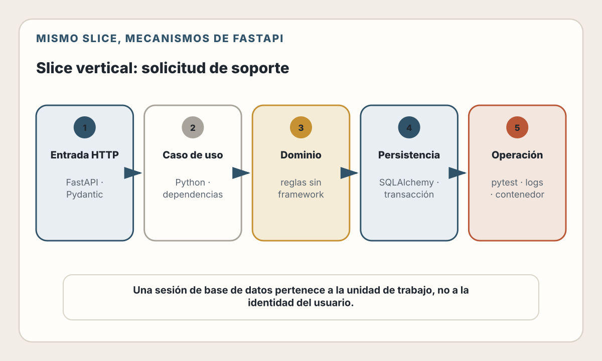

# 28. Stack: Python + FastAPI

> Los type hints hacen visible un contrato. La corrección aparece cuando ese
> contrato también gobierna validación, autorización, persistencia y pruebas.

---

## Objetivos de Aprendizaje

Al finalizar este capítulo, serás capaz de:

- Organizar una API FastAPI por capacidades y límites
- Separar modelos HTTP, dominio y persistencia
- Usar Pydantic para validar datos no confiables
- Elegir correctamente entre código síncrono y asíncrono
- Gestionar transacciones con SQLAlchemy y migraciones con Alembic
- Aplicar identidad y autorización mediante dependencias
- Probar contrato, base de datos y aislamiento entre usuarios
- Desplegar procesos FastAPI reproducibles y observables
- Evaluar código generado por IA contra tipos, invariantes y evidencia

## Modelo mental

FastAPI conecta cuatro piezas:

- routing HTTP;
- type hints de Python;
- validación y serialización con Pydantic;
- generación de un contrato OpenAPI.

Esa integración reduce trabajo repetitivo, pero no crea por sí sola una
arquitectura. Un modelo que valida JSON no es una entidad de dominio. Una
dependencia que obtiene identidad no autoriza todos los objetos. Una sesión ORM
no es un repositorio. `async def` no vuelve no bloqueante a una biblioteca
síncrona.

El flujo que construiremos es:

> request → modelo HTTP → identidad → caso de uso → transacción → respuesta

Cada flecha es una frontera que puede fallar y debe producir un resultado
definido.

---

## Estado del ecosistema

> **Verificado el 31 de julio de 2026.**
> Python 3.14 es la rama estable actual y su documentación publicada corresponde
> a Python 3.14.6. FastAPI recomienda actualmente declarar su entrypoint en
> `pyproject.toml` y documenta tanto funciones `def` como `async def`.
> SQLAlchemy 2.0 continúa como rama estable documentada y Alembic 1.18 como
> herramienta de migraciones asociada.

Un proyecto puede elegir otra versión de Python todavía soportada por sus
dependencias. Debe fijar:

- versión del intérprete;
- versiones directas y transitivas mediante un lockfile;
- imagen de contenedor por tag y, en producción, digest;
- versión de esquema mediante migraciones.

No copies fragmentos de Pydantic 1 ni de la API `Query` heredada de SQLAlchemy
sin verificar la versión instalada. Mucho código plausible en blogs y modelos
de IA mezcla generaciones incompatibles.

---

## El mismo slice vertical

Conservamos el contrato del capítulo anterior:

| Operación | HTTP | Regla principal |
|-----------|------|-----------------|
| Crear | `POST /support-requests` | El propietario procede del token validado |
| Listar | `GET /support-requests` | Solo recursos del propietario |
| Ver | `GET /support-requests/{id}` | `404` si no existe o no es visible |
| Cerrar | `POST /support-requests/{id}/close` | Solo una solicitud propia y abierta |

La entidad mantiene `id`, `user_id`, `subject`, `description`, `status`,
`created_at` y `updated_at`. Los límites de longitud y la transición
`open → closed` no cambian por usar Python.

Esta continuidad permite comparar stacks con honestidad. Si el contrato o los
datos cambiaran en cada capítulo, compararíamos productos diferentes.

<picture>
  <source media="(max-width: 820px)" srcset="../assets/diagrams/cap28-slice-fastapi-mobile.svg">
  
</picture>

---

## Estructura por capacidad

FastAPI permite dividir aplicaciones con `APIRouter`. Una estructura útil es:

```text
app/
  main.py
  config.py
  auth/
    dependencies.py
    principal.py
  database/
    engine.py
    models.py
  support/
    router.py
    schemas.py
    repository.py
    service.py
  observability.py
migrations/
tests/
  unit/
  integration/
  api/
```

La intención:

- `router.py` traduce HTTP;
- `schemas.py` define entrada y salida;
- `service.py` aplica reglas y coordina la transacción;
- `repository.py` expresa consultas;
- `database/models.py` mapea almacenamiento;
- `auth/` valida identidad sin mezclarla con el dominio.

No conviertas cada clase en una capa ceremonial. Para un CRUD pequeño,
router–repository puede ser suficiente. Introduce un servicio cuando existe una
transacción, una política o coordinación que no pertenece a HTTP ni a SQL.

### Ensamblaje explícito

`main.py` debería ser aburrido:

```python
from fastapi import FastAPI

from app.support.router import router as support_router

app = FastAPI(title="Support API", version="1.0.0")
app.include_router(support_router, prefix="/support-requests")
```

Configuración, conexiones y telemetría se inicializan mediante el ciclo de vida
de la aplicación, no como efectos laterales impredecibles al importar módulos.

---

## Modelos HTTP con Pydantic

Los datos entrantes no son confiables. Define lo que aceptas y rechaza campos
desconocidos cuando puedan esconder errores de cliente:

```python
from datetime import datetime
from typing import Literal
from uuid import UUID

from pydantic import BaseModel, ConfigDict, Field


class SupportRequestCreate(BaseModel):
    model_config = ConfigDict(
        extra="forbid",
        str_strip_whitespace=True,
    )

    subject: str = Field(min_length=5, max_length=120)
    description: str = Field(min_length=20, max_length=5_000)


class SupportRequestRead(BaseModel):
    id: UUID
    subject: str
    description: str
    status: Literal["open", "closed"]
    created_at: datetime
    updated_at: datetime
```

Pydantic garantiza la forma de la instancia resultante. Puede convertir algunos
valores de entrada, salvo que configures validación estricta. Decide si esa
coerción pertenece al contrato y pruébala; no asumas que un type hint equivale
a `isinstance` sobre el JSON original.

### Tres modelos, tres responsabilidades

Evita un único modelo para todo:

| Modelo | Puede contener | No debería contener |
|--------|----------------|---------------------|
| Entrada HTTP | Campos enviados por cliente | `user_id`, estado interno, timestamps |
| Dominio/caso de uso | Datos e invariantes necesarias | Detalles de FastAPI |
| Persistencia | Columnas y relaciones | Campos calculados de respuesta |
| Salida HTTP | Datos públicos del contrato | Hashes, secretos, columnas internas |

Separarlos evita mass assignment: un cliente no puede declararse propietario ni
establecer `status="closed"` al crear.

### OpenAPI no reemplaza diseño

FastAPI genera OpenAPI desde rutas y modelos. Revisa el documento resultante:

- códigos de éxito y error;
- campos obligatorios;
- formatos de identificadores y fechas;
- paginación;
- esquema de autenticación;
- ejemplos sin datos sensibles.

Guárdalo como artefacto y detecta cambios incompatibles en CI. “Se generó” no
significa “es un buen contrato”.

---

## Identidad y autorización con dependencias

El sistema de dependencias es adecuado para recursos por request: principal,
sesión de base de datos, configuración o cliente HTTP.

El siguiente fragmento representa una integración con un proveedor OIDC/OAuth
existente:

```python
from dataclasses import dataclass
from typing import Annotated
from uuid import UUID

from fastapi import Depends
from fastapi.security import HTTPAuthorizationCredentials, HTTPBearer

bearer = HTTPBearer(auto_error=False)


@dataclass(frozen=True)
class Principal:
    user_id: UUID
    scopes: frozenset[str]


async def require_principal(
    credentials: Annotated[
        HTTPAuthorizationCredentials | None,
        Depends(bearer),
    ],
) -> Principal:
    token = credentials.credentials if credentials else None
    claims = await identity_provider.verify_access_token(token)
    return Principal(
        user_id=UUID(claims.subject),
        scopes=frozenset(claims.scopes),
    )


CurrentPrincipal = Annotated[Principal, Depends(require_principal)]
```

`identity_provider.verify_access_token` debe comprobar firma, algoritmo
permitido, emisor, audiencia, expiración y revocación cuando el diseño lo
requiera. Usa una biblioteca mantenida o validación remota del proveedor. Este
capítulo no implementa contraseñas ni emite tokens caseros.

La dependencia autentica. La consulta autoriza el objeto:

```sql
SELECT id, subject, description, status, created_at, updated_at
  FROM support_requests
 WHERE id = :request_id
   AND user_id = :user_id;
```

Devolver `404` tanto para un recurso ajeno como inexistente reduce filtración de
identificadores. Usa `403` cuando el cliente ya puede conocer el recurso y el
contrato necesita distinguir falta de permiso.

---

## SQLAlchemy: una sesión por unidad de trabajo

Una `Session` representa estado mutable y una transacción lógica. Una
`AsyncSession` no es segura para compartir entre tareas concurrentes. El patrón
es una sesión por request o unidad de trabajo:

```python
from collections.abc import AsyncIterator

from sqlalchemy.ext.asyncio import AsyncSession, async_sessionmaker

SessionFactory = async_sessionmaker(
    engine,
    expire_on_commit=False,
)


async def get_session() -> AsyncIterator[AsyncSession]:
    async with SessionFactory() as session:
        yield session
```

La factoría puede ser compartida. La instancia de sesión no.

### Modelo de persistencia

El mapeo conserva restricciones también en PostgreSQL:

```python
class SupportRequestRow(Base):
    __tablename__ = "support_requests"
    __table_args__ = (
        CheckConstraint("char_length(subject) BETWEEN 5 AND 120"),
        CheckConstraint("char_length(description) BETWEEN 20 AND 5000"),
        CheckConstraint("status IN ('open', 'closed')"),
        Index("support_requests_owner_created_idx", "user_id", "created_at"),
    )

    id: Mapped[UUID] = mapped_column(primary_key=True)
    user_id: Mapped[UUID] = mapped_column(index=True)
    subject: Mapped[str]
    description: Mapped[str]
    status: Mapped[str] = mapped_column(default="open")
    created_at: Mapped[datetime] = mapped_column(server_default=func.now())
    updated_at: Mapped[datetime] = mapped_column(
        server_default=func.now(),
        onupdate=func.now(),
    )
```

El fragmento es conceptual: tipos UUID y comportamiento de `updated_at` deben
adaptarse al motor y a la migración real. No confíes en que `create_all()` sea
un sistema de migraciones de producción.

### Transacción en el caso de uso

```python
async def create_support_request(
    session: AsyncSession,
    principal: Principal,
    command: SupportRequestCreate,
) -> SupportRequestRow:
    row = SupportRequestRow(
        id=uuid4(),
        user_id=principal.user_id,
        subject=command.subject,
        description=command.description,
        status="open",
    )

    async with session.begin():
        session.add(row)
        await session.flush()
        await session.refresh(row)

    return row
```

La capa que conoce el caso de uso controla commit y rollback. Si el repositorio
hace `commit()` silenciosamente, combinar dos escrituras en una transacción se
vuelve difícil.

Para cerrar, usa un `UPDATE` condicional por `id`, `user_id` y `status`. Una
lectura seguida de escritura sin bloqueo puede permitir carreras.

---

## Rutas: HTTP delgado, políticas explícitas

```python
from typing import Annotated

from fastapi import APIRouter, Depends, status
from sqlalchemy.ext.asyncio import AsyncSession

router = APIRouter(tags=["support"])
DatabaseSession = Annotated[AsyncSession, Depends(get_session)]


@router.post(
    "",
    response_model=SupportRequestRead,
    status_code=status.HTTP_201_CREATED,
)
async def create_request(
    payload: SupportRequestCreate,
    principal: CurrentPrincipal,
    session: DatabaseSession,
) -> SupportRequestRead:
    created = await create_support_request(session, principal, payload)
    return SupportRequestRead.model_validate(created, from_attributes=True)
```

El router:

- recibe modelos ya validados;
- obtiene dependencias;
- llama a un caso de uso;
- traduce resultados a HTTP.

No debería contener SQL ni atrapar `Exception` para devolver siempre `500`.
Define errores de dominio y un mapeo central a respuestas estables. Registra el
detalle interno, pero devuelve solo información segura.

### Paginación

La lista necesita un límite desde el primer día:

- `limit` con máximo razonable;
- cursor estable compuesto por `created_at` e `id`;
- orden determinista;
- filtro por `user_id` antes de paginar.

`offset` es simple, pero se degrada en páginas profundas y puede producir saltos
cuando hay inserciones concurrentes. Para una colección pequeña puede ser una
decisión válida y documentada.

---

## `async` no significa “más rápido”

Usa `async def` cuando las bibliotecas de I/O exponen operaciones awaitables.
Usa `def` para una ruta que llama a una biblioteca bloqueante y deja que FastAPI
la ejecute en su thread pool. Lo peligroso es llamar I/O bloqueante directamente
dentro de `async def`: detiene el event loop y afecta otras requests.

| Trabajo | Enfoque |
|---------|---------|
| Driver async de PostgreSQL | `async def` + `await` |
| Cliente HTTP async | `async def` + timeouts |
| SDK exclusivamente bloqueante | `def` o aislamiento explícito |
| Cálculo breve | Directo y medido |
| Cálculo pesado | Proceso o sistema de trabajos separado |
| Trabajo durable tras responder | Cola persistente, no `create_task()` |

Concurrencia no elimina límites. Configura:

- timeout por dependencia;
- tamaño del pool de conexiones;
- máximo de requests en vuelo;
- límites de body;
- backpressure y rechazo controlado.

No uses `asyncio.gather()` con la misma `AsyncSession`. Cada tarea concurrente
necesita su propia sesión/transacción, o las operaciones deben permanecer
secuenciales dentro de una sola transacción.

---

## Alembic: evolución incremental del esquema

Alembic registra una secuencia de revisiones. El flujo seguro es:

1. generar una revisión candidata;
2. revisar manualmente `upgrade()` y sus efectos;
3. probarla desde el esquema anterior con datos representativos;
4. comprobar compatibilidad con código viejo y nuevo;
5. aplicar `alembic upgrade head` una sola vez en el release;
6. verificar la revisión activa.

Autogenerate compara metadata y esquema, pero no comprende intención. Puede no
detectar renombres, migraciones de datos o semántica de una restricción.

Para agregar un campo obligatorio en un servicio activo:

1. añade el campo nullable o con default compatible;
2. despliega código que escribe ambos formatos;
3. rellena datos en lotes observables;
4. valida que no quedan nulos;
5. aplica la restricción;
6. elimina compatibilidad temporal en otro release.

Nunca resetees una base para resolver una migración fallida. Corrige la revisión
y reintenta de manera incremental después de entender el estado actual.

---

## Pruebas

### Unidad

Prueba reglas sin ASGI ni base:

- validación de límites;
- transición de estado;
- normalización;
- mapeo de errores.

### API

`TestClient` permite pruebas síncronas sobre la aplicación. Para recorridos
asíncronos y recursos async, HTTPX con transporte ASGI evita esconder el ciclo
de eventos.

Sobrescribe dependencias de forma acotada:

```python
app.dependency_overrides[require_principal] = lambda: Principal(
    user_id=USER_A,
    scopes=frozenset({"support:write"}),
)
```

Restaura el override después de cada prueba para evitar contaminación. No
reemplaces toda la autorización por `True`; devuelve identidades concretas.

### Integración con PostgreSQL

Una base aislada y migrada debe verificar:

- restricciones y tipos;
- rollback;
- consulta por propietario;
- paginación estable;
- carreras al cerrar;
- migración desde la revisión anterior.

Usa transacciones o un esquema aislado para pruebas, pero no sustituyas
PostgreSQL por SQLite cuando dependes de sus tipos, locking o semántica.

### Casos mínimos de seguridad

- sin token → `401`;
- token válido sin scope → `403`;
- usuario B consulta ID de A → `404`;
- body con `user_id` extra → `422`;
- payload demasiado grande → rechazo temprano;
- token expirado → `401`;
- error interno → respuesta opaca y log correlacionado.

---

## Despliegue con contenedores

Un contenedor de producción debe ser reproducible:

- imagen base de Python soportada y fijada;
- usuario sin privilegios;
- dependencias instaladas desde lockfile;
- sin compiladores ni herramientas innecesarias en la etapa final;
- configuración y secretos inyectados en runtime;
- comando de producción, no servidor de desarrollo;
- señal y periodo de terminación compatibles con el orquestador.

Un Dockerfile conceptual puede comenzar así:

```dockerfile
FROM python:3.14-slim

WORKDIR /app
COPY pyproject.toml uv.lock ./
RUN uv sync --frozen --no-dev

COPY app ./app
USER 10001
CMD ["uv", "run", "fastapi", "run", "app/main.py", "--port", "8000"]
```

En el repositorio real fija también el digest, instala `uv` de forma
reproducible y comprueba que el usuario pueda leer el entorno creado. El
fragmento enseña decisiones, no es una imagen completa copiable.

### Procesos y réplicas

Un solo proceso aprovecha concurrencia I/O, no todos los núcleos para Python
arbitrario. Puedes usar varios workers o varias réplicas. Cada proceso tiene:

- su propio heap;
- su propio pool de conexiones;
- sus propios caches locales;
- su propia inicialización.

Multiplicar workers multiplica conexiones y memoria. Calcula el total antes de
configurarlos. En Kubernetes suele ser más claro un proceso por contenedor y
escalar réplicas; en una máquina única, varios workers pueden aprovechar CPU.

Ejecuta Alembic como job de release, no desde cada worker. Separa:

- liveness: el proceso responde;
- readiness: puede servir tráfico según dependencias críticas;
- diagnóstico: información protegida para operadores.

---

## Observabilidad

Instrumenta el borde ASGI, SQLAlchemy y llamadas salientes. Propaga contexto y
añade spans del dominio solo donde expliquen trabajo relevante.

Señales mínimas:

- requests por ruta normalizada, método y estado;
- latencia p50, p95 y p99;
- errores por tipo;
- tiempo de adquisición de conexión;
- conexiones activas y espera de pool;
- duración y rollback de transacciones;
- versión de migración y release;
- tasa de creación y cierre.

No uses `request_id`, `user_id` o `support_request_id` como etiqueta de una
métrica: su alta cardinalidad degrada el sistema. Esos identificadores pueden
aparecer en logs o trazas bajo una política de privacidad.

OpenTelemetry Python mantiene trazas y métricas como componentes estables; su
documentación marca logs todavía en desarrollo. Puedes correlacionar logging
estructurado de Python con trace ID sin depender de que toda la señal de logs
use el SDK.

---

## IA como colaborador en Python

Los type hints y OpenAPI dan a la IA contexto estructurado. Puede ayudar a:

- proponer modelos de entrada y salida;
- generar casos de prueba desde el contrato;
- detectar una sesión compartida;
- revisar una migración candidata;
- convertir un endpoint grande en caso de uso y repositorio;
- investigar una traza.

Verifica especialmente:

- imports que existen en la versión bloqueada;
- Pydantic 2 frente a ejemplos de Pydantic 1;
- API moderna de SQLAlchemy frente a `Query` heredado;
- funciones async que llaman código bloqueante;
- commits ocultos dentro del repositorio;
- autorización aplicada después de cargar un objeto;
- migraciones destructivas disfrazadas de “limpieza”.

El type checker detecta incompatibilidades; no demuestra autorización,
aislamiento de tenants ni corrección transaccional.

---

## Decisiones y trade-offs

| Decisión | Beneficio | Coste o riesgo |
|----------|-----------|----------------|
| Pydantic separado del ORM | Contratos explícitos y menor exposición | Mapeo adicional |
| Modelos compartidos | Menos duplicación inicial | Acoplamiento y mass assignment |
| SQLAlchemy async | Concurrencia I/O sin bloquear | Disciplina de sesión y lazy loading |
| SQLAlchemy sync | Modelo simple y ecosistema amplio | Threads y menor control del event loop |
| ORM | Productividad y relaciones | Consultas implícitas |
| SQL explícito | Rendimiento visible | Más mapeo y portabilidad limitada |
| Un proceso por contenedor | Escalado y memoria predecibles | Más réplicas para varios núcleos |
| Varios workers | Aprovecha una máquina | Multiplica memoria y conexiones |

FastAPI destaca cuando los contratos tipados y el ecosistema Python aportan
valor. No es una razón para llevar procesamiento CPU pesado al request ni para
omitir límites operativos.

---

## Lista de Verificación

- [ ] Python y dependencias están fijados y soportados
- [ ] Modelos de entrada, persistencia y salida tienen responsabilidades claras
- [ ] Campos desconocidos y coerción siguen una política explícita
- [ ] El OpenAPI generado se revisa y versiona
- [ ] La identidad se valida con una biblioteca o proveedor mantenido
- [ ] La autorización de objeto ocurre en la consulta
- [ ] Cada request o tarea usa su propia Session/AsyncSession
- [ ] La transacción se controla en el caso de uso
- [ ] Código bloqueante no se ejecuta dentro del event loop
- [ ] Trabajo durable sale a una cola persistente
- [ ] Alembic se revisa y aplica incrementalmente una sola vez
- [ ] Pruebas de integración usan la semántica real de PostgreSQL
- [ ] Dos identidades verifican aislamiento de recursos
- [ ] Workers, pools y memoria se calculan como un conjunto
- [ ] Logs, métricas y trazas excluyen tokens y contenido sensible

---

## Resumen

- FastAPI convierte type hints y modelos Pydantic en una frontera HTTP útil.
- Validación de forma, reglas de negocio y autorización son controles distintos.
- Separar modelos evita exponer o aceptar campos internos.
- Una Session o AsyncSession pertenece a una unidad de trabajo y no se comparte.
- `async` beneficia espera I/O; no acelera CPU ni corrige bibliotecas bloqueantes.
- Alembic requiere revisión humana y despliegue incremental.
- Pruebas con una base real encuentran fallos de transacción y aislamiento.
- Workers, pools y réplicas deben dimensionarse juntos.
- La IA trabaja mejor con contratos explícitos, pero sus propuestas todavía
  necesitan typecheck, pruebas y revisión.

---

## Ejercicios

1. **Modelos:** diseña entrada, dominio, fila y salida para el slice e identifica
   qué campos nunca debe aceptar el cliente.
2. **Async:** clasifica cinco dependencias como bloqueantes o awaitables y
   decide `def`, `async def` o aislamiento.
3. **Autorización:** prueba que una consulta por ID sin `user_id` rompe el
   aislamiento y corrígela.
4. **Migración:** diseña una expansión y contracción para agregar prioridad
   obligatoria sin detener el servicio.
5. **Capacidad:** calcula el máximo de conexiones para cuatro réplicas con dos
   workers cada una.
6. **IA:** entrega OpenAPI y una migración a un asistente; valida sus casos de
   prueba contra PostgreSQL y las reglas del dominio.

---

## Referencias

- [Python 3.14 Documentation](https://docs.python.org/3.14/)
- [FastAPI — Tutorial](https://fastapi.tiangolo.com/tutorial/)
- [FastAPI — Bigger Applications](https://fastapi.tiangolo.com/tutorial/bigger-applications/)
- [FastAPI — Dependencies](https://fastapi.tiangolo.com/tutorial/dependencies/)
- [FastAPI — Concurrency and `async`/`await`](https://fastapi.tiangolo.com/async/)
- [FastAPI — Testing](https://fastapi.tiangolo.com/tutorial/testing/)
- [FastAPI — Deployment Concepts](https://fastapi.tiangolo.com/deployment/concepts/)
- [Pydantic — Models](https://docs.pydantic.dev/latest/concepts/models/)
- [SQLAlchemy 2.0 — Unified Tutorial](https://docs.sqlalchemy.org/en/20/tutorial/)
- [SQLAlchemy — Session Basics](https://docs.sqlalchemy.org/en/20/orm/session_basics.html)
- [SQLAlchemy — Asyncio](https://docs.sqlalchemy.org/en/20/orm/extensions/asyncio.html)
- [Alembic — Documentation](https://alembic.sqlalchemy.org/en/latest/)
- [OpenTelemetry — Python](https://opentelemetry.io/docs/languages/python/)
