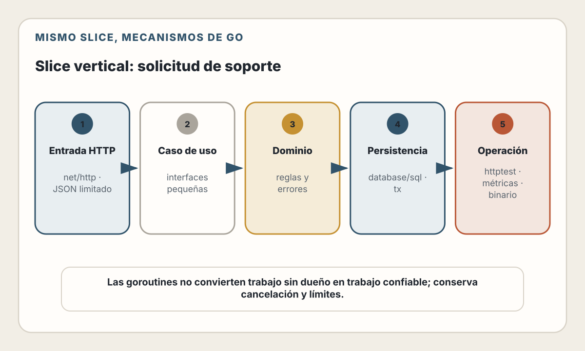

# 29. Stack: Go + APIs de Alto Rendimiento

> Go facilita construir servicios pequeños y concurrentes. “Alto rendimiento”
> sigue siendo una propiedad medida del sistema completo, no del lenguaje
> elegido.

---

## Objetivos de Aprendizaje

Al finalizar este capítulo, serás capaz de:

- Organizar un servicio Go con límites simples y explícitos
- Construir rutas y middleware con `net/http`
- Decodificar, validar y responder JSON de forma segura
- Acceder a PostgreSQL mediante `database/sql` y transacciones
- Propagar cancelación y deadlines con `context.Context`
- Usar goroutines sin crear trabajo ilimitado ni perder errores
- Probar handlers, repositorios, carreras y entradas inesperadas
- Desplegar un binario con terminación controlada y observabilidad
- Elegir Go por restricciones reales, no por una promesa genérica de velocidad

## Modelo mental

Un servicio Go puede construirse con pocas abstracciones:

> `http.Handler` → caso de uso → repositorio → `sql.DB`

Los tipos hacen visibles dependencias y resultados. Las interfaces permiten
reemplazar un colaborador en pruebas. `context.Context` transporta cancelación y
deadlines. El runtime programa goroutines sobre threads. `database/sql` gestiona
un pool de conexiones.

Ninguna pieza decide por sí misma:

- cuánto trabajo aceptar;
- qué usuario puede tocar un objeto;
- cuándo iniciar una transacción;
- qué errores son públicos;
- qué medir;
- cómo apagar sin perder requests.

La simplicidad aparece al hacer esas decisiones explícitas, no al esconderlas
detrás de muchas capas.

---

## Estado del ecosistema

> **Verificado el 31 de julio de 2026.**
> Go 1.26.0 se publicó el 10 de febrero de 2026 y Go 1.26.5 el 7 de julio,
> incluyendo correcciones de seguridad. La política oficial mantiene una rama
> mayor hasta que existen dos ramas mayores posteriores.

El proyecto debe usar el último parche soportado, declarar la versión en
`go.mod`, bloquear dependencias con `go.sum` y repetir las pruebas al actualizar.

Desde Go 1.22, `http.ServeMux` admite método y comodines en patrones, por ejemplo
`"GET /support-requests/{id}"`, y `Request.PathValue` recupera el valor. Para un
servicio moderado, la biblioteca estándar puede ser suficiente. Un router
externo sigue siendo válido si aporta middleware, grupos o convenciones que el
equipo necesita.

---

## El slice vertical, sin cambiar el dominio

Implementamos el mismo contrato:

| Operación | Ruta |
|-----------|------|
| Crear | `POST /support-requests` |
| Listar propias | `GET /support-requests` |
| Ver propia | `GET /support-requests/{id}` |
| Cerrar propia | `POST /support-requests/{id}/close` |

Las invariantes permanecen:

- `user_id` proviene de una identidad validada;
- asunto entre 5 y 120 caracteres;
- descripción entre 20 y 5 000;
- estado `open` o `closed`;
- toda consulta de objeto incluye propietario;
- cerrar es una transición condicional e idempotente según el contrato.

Si Go produce más throughput pero permite leer recursos ajenos, el servicio no
es mejor. Corrección, seguridad, latencia, capacidad y coste se evalúan juntos.

<picture>
  <source media="(max-width: 820px)" srcset="../assets/diagrams/cap29-slice-go-mobile.svg">
  
</picture>

---

## Estructura de proyecto

Go no exige una arquitectura universal. Una estructura adecuada para este
servicio es:

```text
cmd/
  api/
    main.go
internal/
  auth/
    middleware.go
    principal.go
  httpapi/
    handler.go
    response.go
    routes.go
  support/
    model.go
    service.go
    repository.go
  postgres/
    support_repository.go
  telemetry/
    telemetry.go
migrations/
tests/
```

- `cmd/api` ensambla el proceso;
- `httpapi` adapta HTTP;
- `support` contiene comandos, reglas e interfaces;
- `postgres` implementa persistencia;
- `auth` convierte credenciales verificadas en un principal;
- `telemetry` inicializa logs, métricas y trazas.

El directorio `internal` impide que módulos externos importen esos paquetes.
Es una frontera de compilación útil, no una razón para fragmentar cada función
en un paquete.

### Dependencias explícitas

```go
type SupportRepository interface {
	Create(ctx context.Context, userID uuid.UUID, input NewRequest) (Request, error)
	ListByUser(ctx context.Context, userID uuid.UUID, page Page) ([]Request, error)
	FindByUser(ctx context.Context, userID, requestID uuid.UUID) (Request, error)
	CloseByUser(ctx context.Context, userID, requestID uuid.UUID) (Request, error)
}

type Service struct {
	repository SupportRepository
}
```

Define interfaces donde se consumen. No crees una interfaz para cada struct por
anticipación. Esta es útil porque el caso de uso depende de comportamiento y
las pruebas pueden proporcionar una implementación pequeña.

---

## Routing con `net/http`

El router expresa método y recurso:

```go
func Routes(handler *Handler, authMiddleware func(http.Handler) http.Handler) http.Handler {
	mux := http.NewServeMux()

	mux.Handle(
		"POST /support-requests",
		authMiddleware(http.HandlerFunc(handler.Create)),
	)
	mux.Handle(
		"GET /support-requests",
		authMiddleware(http.HandlerFunc(handler.List)),
	)
	mux.Handle(
		"GET /support-requests/{id}",
		authMiddleware(http.HandlerFunc(handler.Get)),
	)
	mux.Handle(
		"POST /support-requests/{id}/close",
		authMiddleware(http.HandlerFunc(handler.Close)),
	)

	return recoverMiddleware(requestLogMiddleware(mux))
}
```

El orden del middleware debe revisarse. La recuperación de panics no reemplaza
manejo de errores: evita que una condición inesperada derribe el proceso,
registra una traza segura y devuelve `500`. Autenticación, rate limit, tamaño de
body y telemetría deben cubrir las rutas que corresponden.

### Timeouts del servidor

No uses un `http.Server` con defaults accidentales en Internet:

```go
server := &http.Server{
	Addr:              ":8080",
	Handler:           routes,
	ReadHeaderTimeout: 5 * time.Second,
	ReadTimeout:       10 * time.Second,
	WriteTimeout:      15 * time.Second,
	IdleTimeout:       60 * time.Second,
}
```

Los valores son ejemplos, no universales. Streaming y uploads necesitan una
política diferente. Coordina estos límites con proxy, balanceador y deadlines
de dependencias para evitar que una capa abandone mientras otra sigue trabajando.

---

## Entrada JSON: límites antes que parsing

El handler debe limitar bytes, rechazar campos desconocidos y comprobar que
existe un solo valor JSON:

```go
type createRequestBody struct {
	Subject     string `json:"subject"`
	Description string `json:"description"`
}

func (h *Handler) Create(w http.ResponseWriter, r *http.Request) {
	principal, ok := auth.PrincipalFromContext(r.Context())
	if !ok {
		writeProblem(w, http.StatusUnauthorized, "authentication_required")
		return
	}

	r.Body = http.MaxBytesReader(w, r.Body, 64<<10)
	decoder := json.NewDecoder(r.Body)
	decoder.DisallowUnknownFields()

	var body createRequestBody
	if err := decoder.Decode(&body); err != nil {
		writeProblem(w, http.StatusBadRequest, "invalid_json")
		return
	}
	if err := ensureJSONEnd(decoder); err != nil {
		writeProblem(w, http.StatusBadRequest, "invalid_json")
		return
	}

	command, violations := support.ValidateNewRequest(
		body.Subject,
		body.Description,
	)
	if len(violations) > 0 {
		writeValidationProblem(w, violations)
		return
	}

	created, err := h.service.Create(r.Context(), principal.UserID, command)
	if err != nil {
		h.writeServiceError(w, r, err)
		return
	}

	writeJSON(w, http.StatusCreated, requestResponseFrom(created))
}
```

El fragmento es conceptual: helpers, UUID y errores pertenecen al proyecto. Sus
decisiones importantes son:

- el body tiene un máximo;
- el DTO no contiene `user_id`;
- validar JSON y validar negocio son pasos distintos;
- el contexto del request llega al servicio;
- los errores internos no se serializan directamente.

`json.Decoder` acepta un primer valor aunque haya datos posteriores; por eso
`ensureJSONEnd` debe intentar una segunda decodificación y exigir `io.EOF`.

### Respuestas consistentes

Centraliza escritura JSON:

- `Content-Type: application/json`;
- status antes del body;
- formato de problema estable;
- sin stack traces;
- logging separado de la respuesta.

No llames a `http.Error` en unas rutas y devuelvas objetos distintos en otras si
el contrato promete errores JSON consistentes.

---

## Autenticación y autorización

Un middleware autentica credenciales y añade un principal al contexto:

```go
type Principal struct {
	UserID uuid.UUID
	Scopes map[string]struct{}
}
```

No uses `context.WithValue` con una clave string exportada. Un tipo privado evita
colisiones. El contexto transporta datos del request, deadlines y cancelación;
no es un contenedor global de dependencias.

La validación del access token debe usar una implementación OIDC/JWT mantenida y
comprobar:

- firma y algoritmo permitido;
- emisor y audiencia;
- expiración y vigencia;
- scopes necesarios;
- rotación de claves y fallos del proveedor.

La autorización de objeto vive también en SQL:

```sql
SELECT id, subject, description, status, created_at, updated_at
  FROM support_requests
 WHERE id = $1
   AND user_id = $2;
```

Un middleware no conoce el propietario de cada fila. Autenticación global y
autorización por objeto resuelven problemas distintos.

---

## Persistencia con `database/sql`

`sql.DB` no representa una sola conexión. Es un handle concurrente que gestiona
un pool. Ábrelo al iniciar el proceso, verifica conectividad y ciérralo al
terminar:

```go
db, err := sql.Open("pgx", databaseURL)
if err != nil {
	return fmt.Errorf("open database: %w", err)
}

db.SetMaxOpenConns(20)
db.SetMaxIdleConns(10)
db.SetConnMaxIdleTime(5 * time.Minute)
db.SetConnMaxLifetime(30 * time.Minute)

ctx, cancel := context.WithTimeout(context.Background(), 5*time.Second)
defer cancel()
if err := db.PingContext(ctx); err != nil {
	return fmt.Errorf("ping database: %w", err)
}
```

Los valores deben derivarse de capacidad de PostgreSQL, número máximo de
réplicas y otras aplicaciones. Si hay diez réplicas con 20 conexiones, el techo
potencial es 200, no 20. Un límite de pool también puede producir espera y
deadlocks si el código retiene una conexión mientras intenta adquirir otra.

### Consulta parametrizada

```go
func (r *Repository) Create(
	ctx context.Context,
	userID uuid.UUID,
	input support.NewRequest,
) (support.Request, error) {
	const query = `
		INSERT INTO support_requests
			(id, user_id, subject, description, status)
		VALUES ($1, $2, $3, $4, 'open')
		RETURNING id, subject, description, status, created_at, updated_at`

	request := support.Request{ID: uuid.New(), UserID: userID}
	err := r.db.QueryRowContext(
		ctx,
		query,
		request.ID,
		userID,
		input.Subject,
		input.Description,
	).Scan(
		&request.ID,
		&request.Subject,
		&request.Description,
		&request.Status,
		&request.CreatedAt,
		&request.UpdatedAt,
	)
	if err != nil {
		return support.Request{}, fmt.Errorf("create support request: %w", err)
	}

	return request, nil
}
```

Los placeholders separan SQL y datos. No construyas filtros u orden con
concatenación de entrada. Mapea las opciones permitidas a fragmentos constantes.

Para consultas de varias filas:

- llama `defer rows.Close()` después de comprobar `err`;
- comprueba `rows.Err()` al terminar;
- limita cantidad;
- selecciona solo columnas necesarias.

### Transacciones

Usa `DB.BeginTx`, métodos de `sql.Tx`, `Commit` y `Rollback`. No envíes
`BEGIN`/`COMMIT` como strings ni mezcles métodos de `DB` dentro de la transacción.

```go
tx, err := r.db.BeginTx(ctx, nil)
if err != nil {
	return err
}
defer tx.Rollback()

// Todas las operaciones de la unidad usan tx.QueryContext/ExecContext.

if err := tx.Commit(); err != nil {
	return fmt.Errorf("commit transaction: %w", err)
}
```

Un rollback posterior a commit es inocuo. La transacción debe ser breve y no
envolver llamadas de red lentas.

Cerrar una solicitud puede ser una sola sentencia condicional por `id`,
`user_id` y `status`. Esto evita la carrera de “leer abierta, luego actualizar”.

---

## Contexto, goroutines y trabajo limitado

`net/http` atiende requests concurrentemente. No necesitas crear una goroutine
para cada handler. Propaga `r.Context()` a base de datos y clientes HTTP: cuando
el cliente desconecta o vence el deadline, el trabajo puede cancelarse.

### Antipatrón: responder y olvidar

```go
go sendNotification(request)
```

Esa goroutine:

- no sobrevive al reinicio;
- puede perder contexto y errores;
- no tiene reintento durable;
- puede crecer sin límite;
- compite por memoria, conexiones y CPU.

Si la notificación importa, publica un evento en una cola durable mediante
outbox o una frontera transaccional apropiada. Si el trabajo es opcional y
efímero, usa un pool limitado, deadline, recuperación y métricas.

### Concurrencia estructurada

Cuando una request necesita dos llamadas independientes:

- limita fan-out;
- propaga cancelación si una falla;
- conserva el primer error relevante;
- no comparte objetos no seguros;
- respeta el deadline total.

Una goroutine es barata, no gratuita. El límite real suele estar en la base de
datos, el proveedor externo o la memoria, no en la cantidad que el runtime puede
crear.

### CPU y paralelismo

Antes de optimizar:

1. mide latencia y perfiles;
2. identifica CPU, asignaciones, GC, locks o I/O;
3. crea un benchmark representativo;
4. cambia una variable;
5. vuelve a medir bajo carga y con `-race` donde corresponda.

No introduzcas object pools, buffers reutilizados ni atomics solo porque parecen
rápidos. Aumentan la superficie de carreras y pueden empeorar el rendimiento.

---

## Errores como parte del diseño

Define errores que el caso de uso pueda clasificar:

```go
var (
	ErrNotFound      = errors.New("support request not found")
	ErrAlreadyClosed = errors.New("support request already closed")
)
```

Envuelve con contexto usando `%w` y clasifica con `errors.Is`. No compares
mensajes. El adaptador HTTP decide:

| Error | Respuesta |
|-------|-----------|
| Entrada inválida | `422` con campos |
| Sin identidad | `401` |
| Scope insuficiente | `403` |
| No existe o es ajeno | `404` |
| Ya cerrado | `409` o éxito idempotente, según contrato |
| Deadline | `504` si la capa puede afirmarlo |
| Inesperado | `500` opaco + log correlacionado |

Evita registrar el mismo error en cada capa. Añade contexto al propagar y
regístralo una vez en el borde que conoce request, identidad segura y trace ID.

---

## Pruebas en Go

### Unidad y tablas de casos

Las table-driven tests funcionan bien para validación:

```go
tests := []struct {
	name        string
	subject     string
	description string
	wantValid   bool
}{
	{"valid", "Cannot sign in", strings.Repeat("x", 20), true},
	{"short subject", "Help", strings.Repeat("x", 20), false},
	{"short description", "Cannot sign in", "too short", false},
}
```

Nombres claros vuelven útil cada fallo. No metas todos los escenarios en una
aserción opaca.

### Handlers con `httptest`

Construye el handler con un servicio falso, crea `httptest.NewRequest` y
`httptest.NewRecorder`, y verifica:

- status;
- headers;
- esquema JSON;
- comando recibido;
- propietario obtenido del contexto;
- tamaño y campos desconocidos;
- ausencia de detalles internos.

La prueba debe pasar por el middleware real cuando evalúa autenticación,
recuperación o logging.

### Integración con PostgreSQL

Ejecuta migraciones incrementales sobre una base aislada y prueba:

- restricciones;
- placeholders y scanning;
- `FindByUser` entre A y B;
- rollback;
- transición concurrente de cierre;
- pool bajo carga.

Un fake comprueba interacción. No reproduce locking, tipos ni errores del driver.

### Herramientas del lenguaje

En CI:

```text
go test ./...
go test -race ./...
go vet ./...
govulncheck ./...
```

El detector de carreras aumenta coste y no demuestra ausencia total de carreras;
encuentra las que ejecutan las pruebas. `govulncheck` relaciona vulnerabilidades
con código alcanzable, pero requiere triage y versiones actualizadas.

Fuzzing es apropiado para decodificadores, validadores y parsers:

- nunca debe provocar panic;
- debe respetar límites;
- no debe aceptar estados imposibles;
- cualquier fallo se conserva como caso de regresión.

Benchmarks deben incluir tamaños y distribución realistas, no solo una función
trivial aislada.

---

## Despliegue como binario

Go puede producir un binario autocontenido, pero “un solo archivo” no significa
“sin dependencias”. El proceso todavía necesita:

- certificados CA;
- zona horaria si el producto la usa;
- configuración;
- red y DNS;
- migraciones;
- compatibilidad de arquitectura y, según build, libc/CGO.

Un build conceptual:

```dockerfile
FROM golang:1.26 AS build
WORKDIR /src
COPY go.mod go.sum ./
RUN go mod download
COPY . .
RUN CGO_ENABLED=0 go build -trimpath -o /out/api ./cmd/api

FROM gcr.io/distroless/static-debian12:nonroot
COPY --from=build /out/api /api
USER nonroot:nonroot
ENTRYPOINT ["/api"]
```

Fija tags por digest en producción. `CGO_ENABLED=0` solo es correcto si todas
las dependencias y funciones requeridas lo soportan. Incluye información de
versión y commit en el binario o en metadata del artefacto.

Las migraciones se ejecutan como job de release, no desde cada réplica. El
binario de aplicación debe tolerar el periodo de compatibilidad entre esquema
viejo y nuevo.

### Terminación controlada

El orquestador envía una señal. El proceso debe dejar de aceptar trabajo, drenar
requests y cerrar recursos dentro de un plazo:

```go
shutdownCtx, stop := signal.NotifyContext(
	context.Background(),
	os.Interrupt,
	syscall.SIGTERM,
)
defer stop()

go func() {
	<-shutdownCtx.Done()
	ctx, cancel := context.WithTimeout(context.Background(), 15*time.Second)
	defer cancel()
	_ = server.Shutdown(ctx)
}()
```

El proceso principal debe tratar `http.ErrServerClosed` como cierre esperado y
esperar el drenaje antes de salir. Consumidores de cola y telemetría requieren
su propio cierre ordenado.

---

## Observabilidad

`log/slog` proporciona logging estructurado en la biblioteca estándar. Registra:

- mensaje estable;
- nivel;
- ruta normalizada y método;
- status y duración;
- trace ID;
- versión;
- tipo de error.

No uses URL completa con IDs como nombre de ruta ni registres token, body o
descripción. Mantén cardinalidad baja en métricas.

OpenTelemetry Go marca trazas y métricas como estables y logs como beta en su
documentación actual. La instrumentación de `net/http` puede crear spans y
métricas de borde; añade spans manuales para operaciones de dominio o
dependencias no instrumentadas.

Métricas del servicio:

- requests, errores y latencia;
- requests en vuelo;
- tiempo de espera y uso del pool (`DB.Stats`);
- timeouts de dependencias;
- goroutines solo como señal diagnóstica, no objetivo;
- tasa de creación y cierre;
- backlog si existe una cola.

Protege `pprof` detrás de una red o listener de administración autenticado. Un
perfil puede exponer nombres, rutas y datos útiles para un atacante y añade
coste durante la captura.

---

## IA como colaborador en Go

La compilación rápida y los tipos ofrecen feedback útil para código generado.
Una IA puede:

- proponer table-driven tests;
- generar mocks pequeños a partir de una interfaz;
- revisar cierres de `rows`, bodies y timers;
- buscar goroutines sin límite;
- diseñar un benchmark;
- explicar un profile o race report.

Comprueba manualmente:

- errores ignorados;
- goroutines huérfanas;
- canales que pueden bloquear;
- `context.Background()` usado dentro de un request;
- copia o acceso concurrente a mapas;
- límites ausentes en JSON y paginación;
- SQL sin propietario;
- uso de paquetes o APIs que no existen en la versión declarada.

`go test` y el compilador rechazan mucho código inválido. No comprueban que el
usuario B no vea los datos del usuario A a menos que escribas esa prueba.

---

## Cómo elegir entre los tres stacks

Los capítulos 27–29 implementaron el mismo slice. La elección se puede razonar
así:

| Necesidad dominante | Next.js + Node.js | FastAPI + Python | Go |
|---------------------|--------------------|------------------|----|
| UI web y servidor en un producto | Integración directa | Requiere frontend separado | Requiere frontend separado |
| Contratos de API tipados | TypeScript + validación runtime | Pydantic + OpenAPI integrado | Structs + validación/documentación explícita |
| Ecosistema de datos/ML | Posible, menos natural | Muy fuerte | Integración por servicio |
| Binario y consumo predecible | Runtime Node | Runtime Python | Ventaja frecuente |
| Concurrencia I/O | Event loop | Async o threads | Goroutines |
| Curva para equipo web TS | Baja | Media | Media |
| Control explícito del servidor | Medio | Medio | Alto |

No son puntuaciones universales:

- Next.js conviene cuando la interfaz y sus operaciones de servidor evolucionan
  juntas.
- FastAPI conviene cuando Python, contratos y ecosistemas de datos son centrales.
- Go conviene cuando un servicio autónomo, concurrencia y operación compacta
  justifican un lenguaje adicional.

La familiaridad del equipo, bibliotecas obligatorias, plataforma, contratación,
latencia, memoria y coste de operación pueden dominar cualquier tabla.

---

## Decisiones y trade-offs

| Decisión | Beneficio | Coste o riesgo |
|----------|-----------|----------------|
| Solo `net/http` | Menos dependencias y conceptos | Más utilidades propias |
| Router/framework externo | Convenciones y middleware | Dependencia y abstracción adicional |
| `database/sql` | Control y estándar estable | Mapeo manual |
| Generador de SQL tipado | Menos scanning repetitivo | Toolchain y código generado |
| ORM | Relaciones y productividad | Consultas implícitas |
| Goroutine en request | Concurrencia local | Fugas y fan-out sin límite |
| Cola durable | Reintentos y supervivencia | Infraestructura y consistencia |
| Binario mínimo | Arranque y superficie reducidos | Certificados/CGO/debugging requieren cuidado |

La solución idiomática no es siempre “solo stdlib”. Es la que el equipo puede
explicar, probar y operar con menor complejidad total.

---

## Lista de Verificación

- [ ] La versión de Go y las dependencias están soportadas y fijadas
- [ ] El dominio no depende de detalles HTTP ni PostgreSQL
- [ ] Routing, timeouts y middleware son explícitos
- [ ] Bodies, JSON, campos y paginación tienen límites
- [ ] El propietario proviene de un principal validado
- [ ] Cada consulta de objeto incluye usuario o tenant
- [ ] SQL usa parámetros y selecciona columnas necesarias
- [ ] `rows.Close()` y `rows.Err()` se manejan
- [ ] Transacciones usan solo métodos de `sql.Tx`
- [ ] El contexto del request llega a cada dependencia
- [ ] Goroutines y fan-out tienen límites, deadlines y propietario
- [ ] Trabajo durable no depende de goroutines efímeras
- [ ] Pruebas cubren handlers, PostgreSQL, carreras y dos identidades
- [ ] Pool total se calcula para el máximo de réplicas
- [ ] El proceso drena requests y telemetría al terminar
- [ ] Logs, métricas, trazas y perfiles protegen datos sensibles

---

## Resumen

- Go permite servicios web claros con `net/http`, tipos e interfaces pequeñas.
- `sql.DB` es un pool concurrente, no una conexión individual.
- `Context` propaga cancelación y deadlines; no almacena dependencias globales.
- Goroutines facilitan concurrencia, pero necesitan límites y ciclo de vida.
- Transacciones, autorización y errores deben permanecer explícitos.
- `httptest`, `-race`, fuzzing y benchmarks cubren riesgos distintos.
- Un binario pequeño todavía depende de configuración, certificados, esquema y
  una estrategia de release.
- Alto rendimiento se demuestra con SLOs, carga y perfiles.
- El mejor stack depende del sistema y del equipo, no de una clasificación
  universal.

---

## Ejercicios

1. **Handler:** implementa `GET /support-requests/{id}` con límites, identidad,
   UUID válido y error `404` opaco.
2. **Pool:** calcula conexiones máximas para un autoscaling de 2 a 12 réplicas y
   diseña una alerta de espera.
3. **Carrera:** escribe una prueba concurrente para cerrar la misma solicitud y
   define el resultado contractual.
4. **Cancelación:** simula un cliente que abandona y verifica que PostgreSQL
   recibe la cancelación.
5. **Fuzzing:** aplica fuzzing al decoder o validador y conserva un caso de
   regresión.
6. **Selección:** compara los tres stacks para un producto concreto mediante
   equipo, UI, datos, operación, latencia y coste.

---

## Referencias

- [Go — Release History](https://go.dev/doc/devel/release)
- [Go Packages — `net/http`](https://pkg.go.dev/net/http)
- [Go Packages — `net/http/httptest`](https://pkg.go.dev/net/http/httptest)
- [Go — Accessing Relational Databases](https://go.dev/doc/database/)
- [Go — Managing Connections](https://go.dev/doc/database/manage-connections)
- [Go — Executing Transactions](https://go.dev/doc/database/execute-transactions)
- [Go — Canceling Database Operations](https://go.dev/doc/database/cancel-operations)
- [Go Packages — `context`](https://pkg.go.dev/context)
- [Go Packages — `log/slog`](https://pkg.go.dev/log/slog)
- [Go — Fuzzing Tutorial](https://go.dev/doc/tutorial/fuzz)
- [Go — Race Detector](https://go.dev/doc/articles/race_detector)
- [Go — `govulncheck`](https://go.dev/doc/tutorial/govulncheck)
- [OpenTelemetry — Go](https://opentelemetry.io/docs/languages/go/)
