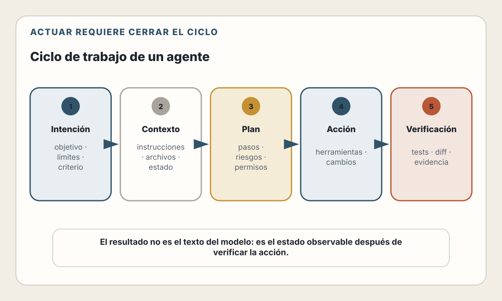
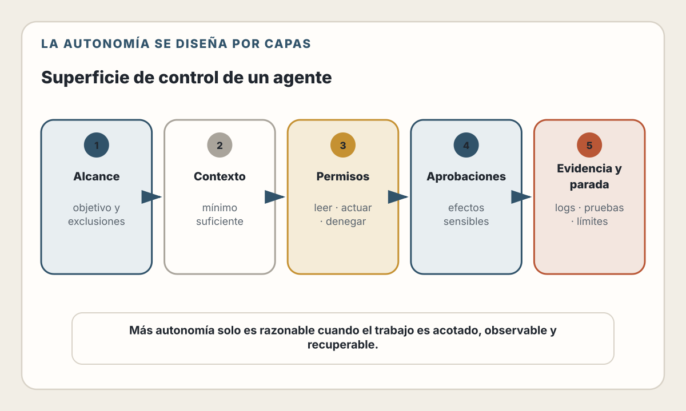
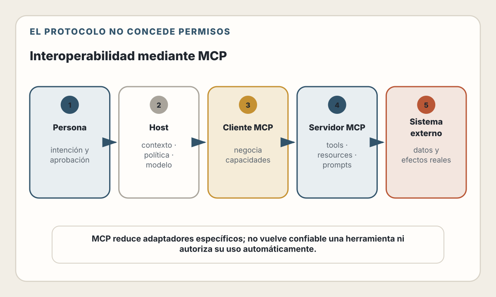
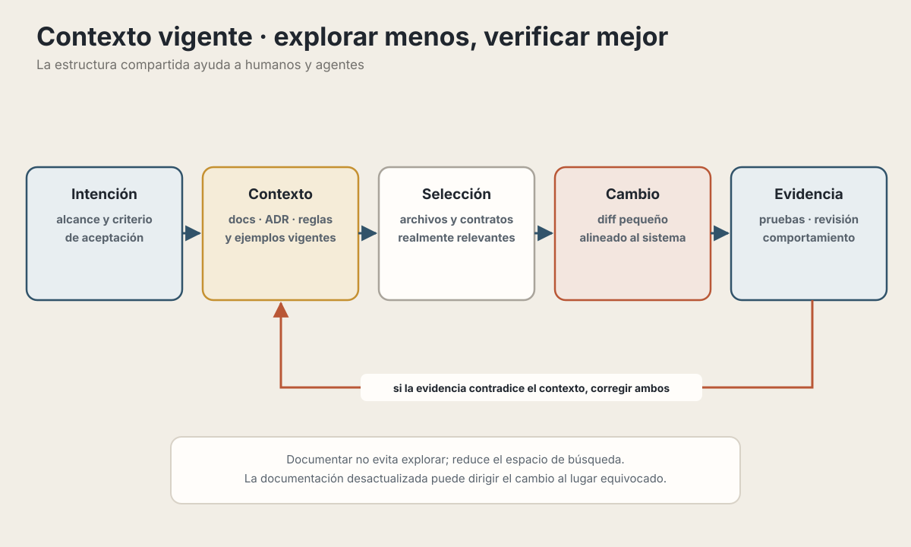
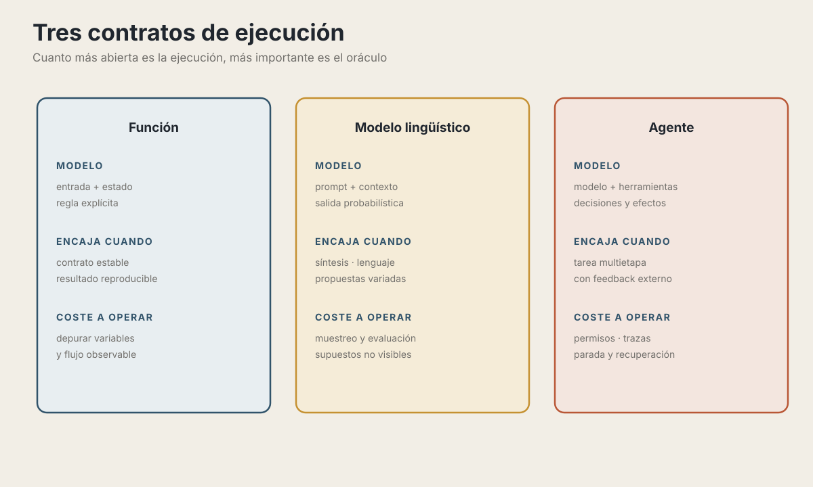
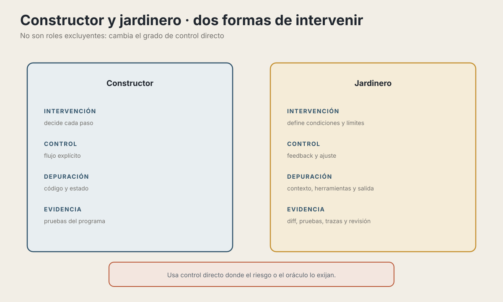
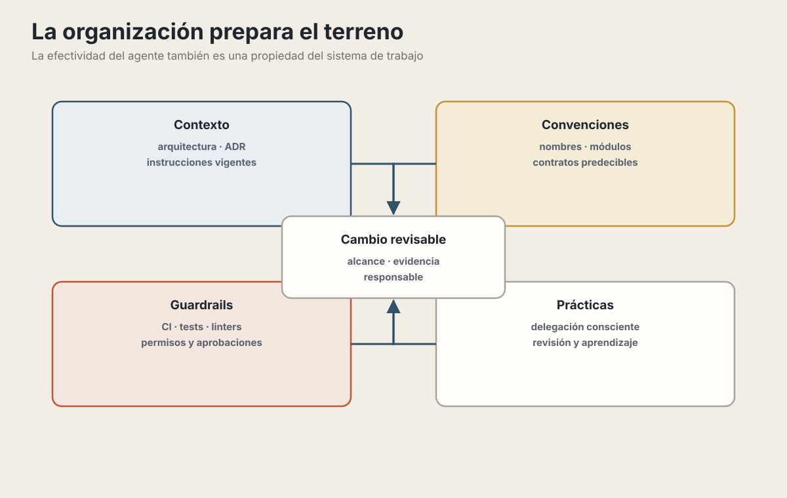
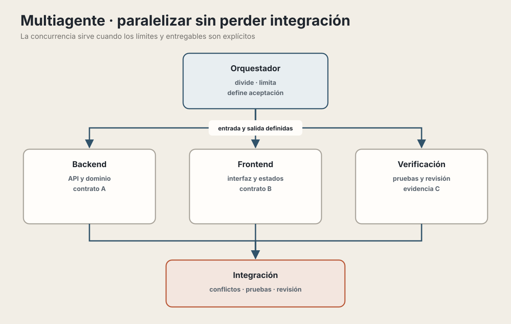

# 30. La Nueva Capa de Abstracción

> "Nunca me había sentido tan atrás como programador. La profesión está siendo dramáticamente refactorizada... Hay una nueva capa de abstracción programable que dominar, que incluye agentes, subagentes, sus prompts, contextos, memoria, modos, permisos, herramientas, plugins, skills, hooks, MCP, LSP, slash commands, workflows, integraciones con IDEs, y la necesidad de construir un modelo mental integral para entidades fundamentalmente estocásticas, falibles, ininteligibles y cambiantes, que de repente se entremezclan con lo que solía ser la buena y vieja ingeniería."
>
> — Andrej Karpathy, diciembre de 2025 (traducción propia)

---

## Objetivos de Aprendizaje

Al terminar este capítulo podrás:

- Entender qué es la "nueva capa de abstracción" y por qué representa un cambio de paradigma
- Conocer los componentes del ecosistema agéntico: agentes, MCP, hooks y skills
- Desarrollar el modelo mental necesario para trabajar con entidades estocásticas
- Configurar tu entorno de desarrollo para un trabajo agéntico efectivo
- Reconocer patrones y antipatrones en el uso de agentes de IA

---

## El Terremoto de Magnitud 9

La metáfora del terremoto captura la velocidad del cambio. Para hacerla útil,
necesitamos separar los fundamentos de las interfaces y nombres que cambian cada
pocos meses.

### Las capas que ya conocíamos

Como desarrolladores, siempre hemos trabajado con capas de abstracción:

| Capa | Abstracción que ofrece |
|---|---|
| Código de aplicación | Conducta específica del producto |
| Frameworks y bibliotecas | Convenciones y capacidades reutilizables |
| Lenguaje | Modelo para expresar y ejecutar programas |
| Sistema operativo | Procesos, memoria, archivos, red y dispositivos |
| Hardware | Cómputo, almacenamiento y comunicación física |

Cada capa oculta complejidad. No necesitas saber cómo funcionan los transistores para escribir JavaScript. No necesitas entender el kernel para usar un framework web.

### La nueva capa

Ahora hay una capa adicional **encima** de tu código:

Agentes, contexto y herramientas interpretan una intención y pueden modificar
las capas inferiores. No reemplazan sus contratos: el código continúa
ejecutándose sobre frameworks, lenguaje, sistema operativo y hardware, y debe
seguir verificándose allí.

Esta nueva capa incluye:

| Componente | Qué hace |
|------------|----------|
| **Agentes** | Pueden decidir y usar herramientas dentro de límites definidos |
| **Subagentes** | Ejecuciones delegadas con contexto y permisos definidos |
| **Contexto** | Información que el sistema entrega al modelo en una inferencia |
| **Memoria** | Mecanismos del host para persistir y recuperar información |
| **Modos** | Perfiles de autonomía, interacción y permisos |
| **Permisos** | Qué puede y qué no puede hacer el agente |
| **Herramientas** | Capacidades que el agente puede usar |
| **MCP** | Un protocolo para interoperar con herramientas y fuentes de contexto |
| **Hooks** | Automatización ligada al ciclo de vida de un cliente |
| **Skills** | Paquetes de instrucciones y recursos reutilizables |

Para que el capítulo siga siendo útil aunque cambien las herramientas, separa
dos niveles:

| Fundamentos duraderos | Convenciones volátiles |
|-----------------------|------------------------|
| Ciclo observar → decidir → actuar → verificar | Nombres de modos y herramientas |
| Contexto limitado y memoria gestionada por el host | Tamaño exacto de ventanas y políticas de compactación |
| Permisos mínimos, aislamiento y aprobación | Formato de archivos como `AGENTS.md` o `CLAUDE.md` |
| Evidencia mediante pruebas, tipos, logs y revisión | Hooks, comandos, carpetas y frontmatter de un cliente |
| Protocolos y contratos negociados | Versiones, proveedores y soporte de extensiones |

Aprende primero la columna izquierda. Consulta documentación vigente y verifica
experimentalmente la derecha.

### Por qué esto es diferente

Las capas anteriores suelen ofrecer **contratos verificables**: para unas entradas
y un estado definidos, puedes comprobar qué debe ocurrir. Los sistemas
concurrentes y distribuidos ya introducían variabilidad; la diferencia es que el
componente lingüístico añade probabilidad y ambigüedad al camino de ejecución.

La nueva capa puede ser **estocástica**. Pides «escribe una función que sume dos
números» y la forma de la respuesta puede variar según el modelo, la configuración
de inferencia, el contexto y las herramientas disponibles. El resultado puede ser
correcto, incompleto o incorrecto.

> 📖 **Concepto**: **Estocástico** significa que interviene una distribución de
> probabilidades. Un LLM estima probabilidades para los siguientes tokens y el
> sistema decide cómo decodificarlas. Algunas configuraciones reducen la
> variación, pero no convierten al agente completo —con herramientas, red y estado
> externo— en una función pura.

Esta diferencia fundamental requiere un cambio en cómo pensamos sobre desarrollo de software.

---

## Anatomía de la Nueva Capa

### Agentes y subagentes

Un **agente** es un sistema de IA que puede:
- Recibir instrucciones en lenguaje natural
- Analizar contexto (archivos, código, estado)
- Decidir qué acciones tomar
- Ejecutar esas acciones
- Evaluar resultados e iterar

No es simplemente "autocompletado inteligente". Es un sistema que **actúa**.

<picture>
  <source media="(max-width: 820px)" srcset="../assets/diagrams/cap30-ciclo-agente-mobile.svg">
  
</picture>

Los **subagentes** son ejecuciones que un orquestador puede delegar. Sus nombres y
capacidades dependen del producto; los roles siguientes son ejemplos:

| Tipo | Especialización | Cuándo se usa |
|------|-----------------|---------------|
| **Exploración** | Búsqueda y síntesis | Encontrar archivos y patrones |
| **Planificación** | Análisis y diseño | Delimitar cambios complejos |
| **Implementación** | Tareas de varios pasos | Editar, probar y documentar |

El aislamiento no es universal. Un sistema puede entregar al subagente todo el
historial, una selección o solo una instrucción nueva. También decide qué parte
del resultado vuelve al orquestador. Esta frontera reduce ruido y permisos si se
diseña bien, pero puede ocultar supuestos importantes. Define explícitamente
entrada, entregable, herramientas y criterio de aceptación.

### Contexto y Memoria

El **contexto** es la información que el host ensambla para una llamada al modelo:

- Tu prompt actual
- Los archivos que ha leído
- El historial de la conversación
- Las instrucciones del sistema, usuario y proyecto
- El resultado de herramientas ejecutadas

La **ventana de contexto** tiene un límite. El host combina instrucciones del
sistema y del proyecto, historial, archivos, resultados de herramientas y el
prompt actual. Cuando el material no cabe, puede rechazar la solicitud,
recortar datos, resumir o compactar. Eso puede perder matices, pero no equivale
a un mecanismo humano de olvido y varía entre productos.

La palabra **memoria** agrupa mecanismos distintos:

- Estado de la conversación conservado por el host
- Instrucciones versionadas dentro del repositorio
- Notas o perfiles guardados por una aplicación
- Recuperación desde bases vectoriales, documentos u otras fuentes

> 📖 **Concepto**: El modelo no recuerda por sí solo entre llamadas. Es la
> aplicación la que conserva, recupera y vuelve a presentar información. Por eso
> la memoria debe poder inspeccionarse, corregirse, caducar y protegerse como
> cualquier otro dato.

### Modos y Permisos

Los nombres de los **modos** dependen del producto. Conceptualmente expresan
cuánta autonomía y qué permisos recibe una ejecución:

| Modo | Permisos | Uso |
|------|----------|-----|
| **Análisis** | Solo lectura | Investigar y proponer |
| **Supervisado** | Solicita aprobación para acciones sensibles | Trabajo habitual |
| **Autónomo acotado** | Ejecuta acciones preautorizadas | Tareas repetibles y reversibles |

<picture>
  <source media="(max-width: 820px)" srcset="../assets/diagrams/cap30-control-autonomia-mobile.svg">
  
</picture>

Los **permisos** controlan qué herramientas puede usar:

- **Permitido:** leer el repositorio y ejecutar pruebas locales.
- **Requiere aprobación:** desplegar, enviar mensajes o modificar datos externos.
- **Denegado:** exponer secretos, borrar datos o saltarse protecciones.

Esta configuración es tu **superficie de control**. Define los límites dentro de
los cuales el agente puede operar.

---

## MCP: Un Protocolo de Interoperabilidad

### El problema N×M

Imagina que tienes N herramientas de IA y M sistemas que quieres conectar:

Sin un protocolo común, tres hosts conectados de manera específica con cuatro
sistemas pueden requerir hasta doce adaptadores distintos. Cada combinación
debe resolver transporte, autenticación, capacidades y errores.

Cada combinación requiere código específico. Esto no escala.

### La solución N+M

MCP (Model Context Protocol) estandariza la comunicación:

Cada host implementa el lado cliente y cada sistema puede exponer un servidor
compatible. En el ejemplo idealizado, el trabajo se aproxima a tres clientes y
cuatro servidores, en lugar de doce combinaciones específicas.

El modelo N+M es una simplificación útil, no una garantía. El host y el servidor
deben implementar versiones compatibles, negociar capacidades, configurar un
transporte y resolver autenticación y consentimiento. MCP reduce adaptadores
específicos, pero nada se conecta ni obtiene permisos automáticamente.

### Los 3 primitivos de MCP

MCP define tres tipos de capacidades:

| Primitivo | Controlado por | Descripción |
|-----------|----------------|-------------|
| **Tools** | El modelo | Acciones que el agente puede ejecutar |
| **Resources** | La aplicación | Datos que la aplicación expone |
| **Prompts** | El usuario | Plantillas predefinidas de instrucciones |

**Tools** son cosas como "crear issue en GitHub", "ejecutar query SQL", "enviar mensaje a Slack".

**Resources** son datos como "lista de issues abiertos", "schema de la base de datos", "mensajes recientes del canal".

**Prompts** son plantillas como "revisa este PR siguiendo estos criterios...".

### Arquitectura

<picture>
  <source media="(max-width: 820px)" srcset="../assets/diagrams/cap30-mcp-interoperabilidad-mobile.svg">
  
</picture>

El modelo ve las herramientas disponibles y decide cuándo usarlas basándose en tu instrucción.

### Ejemplos de integraciones

| Servidor | Funcionalidad |
|----------|---------------|
| **GitHub** | Issues, PRs, repos, acciones |
| **Postgres** | Queries SQL, schema |
| **Slack** | Mensajes, canales |
| **Sentry** | Errores, alertas |
| **Notion** | Páginas, bases de datos |
| **Puppeteer** | Automatización de navegador |

La tabla describe categorías, no garantiza que exista un servidor oficial,
seguro o completo para cada producto. Revisa siempre autor, código, permisos,
método de autenticación y política de datos.

> **Estado del ecosistema — verificado el 30 de julio de 2026.** La revisión
> 2026-07-28 de MCP mantiene tools, resources y prompts entre las capacidades
> centrales del servidor. El protocolo también define capacidades del cliente y
> un marco de extensiones. Funciones como tareas de larga duración o interfaces
> embebidas son opcionales y requieren soporte explícito de las partes; no deben
> asumirse por el solo hecho de usar MCP.

### Consideraciones de seguridad

MCP introduce nuevos vectores de ataque:

| Riesgo | Descripción | Mitigación |
|--------|-------------|------------|
| **Prompt injection** | Contenido malicioso en datos | Validar inputs, aislar contextos |
| **Tool poisoning** | Servidor MCP malicioso | Usar solo servidores confiables |
| **Privilege escalation** | Combinar herramientas para obtener acceso | Principio de mínimo privilegio |
| **Data exfiltration** | Enviar datos sensibles a servidores | Auditar qué datos fluyen |

> ⚠️ **Importante**: Cada herramienta que conectas es una superficie de ataque potencial. Conecta solo lo necesario y audita regularmente.

---

## Configurando tu Entorno Agéntico

### Instrucciones del proyecto

Muchos clientes reconocen archivos de instrucciones, pero no comparten nombre,
jerarquía ni reglas de carga. Claude Code usa `CLAUDE.md`; otros agentes usan
`AGENTS.md` o mecanismos equivalentes. El fundamento no es el nombre: es mantener
instrucciones breves, versionadas, comprobables y cercanas al código al que se
aplican. Antes de crear el archivo, consulta la convención del cliente que usará
el equipo.

**Qué incluir:**

```markdown
# Proyecto: E-commerce API

## Stack
- Node.js 24 + TypeScript
- PostgreSQL con Prisma
- Jest para tests

## Estructura
/src
  /modules     # Módulos por feature
  /shared      # Código compartido
  /config      # Configuración
/tests
  /unit        # Tests unitarios
  /integration # Tests de integración

## Convenciones
- Usar kebab-case para archivos
- Cada módulo tiene su propio barrel export
- Tests junto al código que prueban (.test.ts)

## Comandos frecuentes
- npm run dev: Desarrollo
- npm run test: Ejecutar tests
- npm run build: Build de producción

## Decisiones técnicas
- Usamos Zod para validación (no class-validator)
- Prisma sobre TypeORM por simplicidad
- No usamos decoradores de NestJS
```

**Ejemplo específico de Claude Code:**

| Ubicación | Alcance |
|-----------|---------|
| `~/.claude/CLAUDE.md` | Todos tus proyectos (preferencias globales) |
| `./CLAUDE.md` | Este proyecto específico |
| `./src/auth/CLAUDE.md` | Solo el módulo de auth |

Claude Code carga al inicio los archivos situados por encima del directorio de
trabajo y descubre los de subdirectorios cuando lee archivos allí. Otros clientes
pueden sobrescribir, concatenar o ignorar esas instrucciones. Comprueba el
comportamiento real y evita reglas contradictorias.

### Carpeta docs/ para Contexto Persistente

Además de CLAUDE.md, considera mantener una carpeta `docs/` con descripciones de subsistemas que los agentes pueden consultar:

```
docs/
├── architecture.md      # Visión general del sistema
├── auth-subsystem.md    # Cómo funciona autenticación
├── data-model.md        # Entidades y relaciones
└── api-conventions.md   # Patrones de API usados
```

**Por qué funciona:**

Cuando el agente necesita contexto sobre un área específica, puede leer el
documento relevante en lugar de explorar todo el código. Esto reduce ruido y
puede mejorar la precisión si la documentación está vigente.

<picture>
  <source media="(max-width: 820px)" srcset="../assets/diagrams/cap30-contexto-vigente-mobile.svg">
  
</picture>

Mantén estos documentos actualizados. Son una inversión que paga dividendos cada vez que trabajas con agentes.

### Estructura que sirve a humanos y agentes

Un insight importante: **la misma estructura que ayuda a humanos también ayuda a agentes**.

> "Structure in tools works for humans and agents the same way — it reduces the ambiguity what is expected." — Karri Saarinen

No necesitas crear "documentación para la IA" separada de la documentación para humanos. Un proyecto bien organizado es más fácil de navegar tanto para un desarrollador nuevo como para un agente de IA.

> Una estructura clara reduce ambigüedad para todos: acelera el *onboarding* humano y ayuda al agente a localizar contratos, imitar convenciones y limitar el cambio. No elimina los errores; hace más visibles los supuestos y más barata su comprobación.

**Ejemplos de estructura que beneficia a ambos:**

| Elemento | Beneficio humano | Beneficio agente |
|----------|------------------|------------------|
| Nombres de archivos descriptivos | Fácil de encontrar | Fácil de inferir contenido |
| Carpetas organizadas por feature | Navegación intuitiva | Cambios aislados correctamente |
| Convenciones consistentes | Código predecible | Genera código que encaja |
| README actualizado | Onboarding rápido | Contexto preciso |
| Tests junto al código | Fácil de mantener | Sabe dónde crear tests |

La implicación es que invertir en organización del proyecto tiene un **doble
retorno**: mejora la experiencia de desarrolladores humanos y la efectividad de
agentes de IA.

### Hooks: Control determinístico

Algunos clientes permiten ejecutar validaciones determinísticas en eventos de su
ciclo de vida. El esquema y los eventos no son parte de MCP ni son portables. El
siguiente ejemplo es específico de Claude Code y fue verificado el 30 de julio de 2026.

**Ejemplo: Formatear código después de cada edición**

```json
{
  "hooks": {
    "PostToolUse": [{
      "matcher": "Edit|Write",
      "hooks": [{
        "type": "command",
        "command": "\"$CLAUDE_PROJECT_DIR\"/.claude/hooks/format-edited-file.sh"
      }]
    }]
  }
}
```

El hook recibe JSON por la entrada estándar; no existe una variable universal
`$FILE_PATH`. El script extrae el campo, limita el archivo al proyecto, filtra
extensiones y cita el argumento:

```bash
#!/usr/bin/env bash
set -euo pipefail

input="$(cat)"
file_path="$(jq -r '.tool_input.file_path // empty' <<<"$input")"
project_dir="$(jq -r '.cwd // empty' <<<"$input")"
file_path="$(realpath "$file_path")"
project_dir="$(realpath "$project_dir")"

case "$file_path" in
  "$project_dir"/*) ;;
  *) exit 0 ;;
esac

case "$file_path" in
  *.js|*.jsx|*.ts|*.tsx|*.json|*.css|*.md)
    formatter="$project_dir/node_modules/.bin/prettier"
    [[ -x "$formatter" ]] && "$formatter" --write -- "$file_path"
    ;;
esac
```

Un hook `PreToolUse` puede inspeccionar `tool_input.file_path` y devolver una
decisión estructurada para bloquear una escritura sensible. No uses `grep` sobre
texto sin citar ni construyas comandos concatenando datos del modelo. Recuerda
que los hooks ejecutan código local: revisa los hooks que llegan desde un
repositorio y no los trates como sustituto del sandbox, los permisos o la
revisión humana.

**Algunos eventos de Claude Code:**

| Evento | Cuándo | Uso común |
|--------|--------|-----------|
| `PreToolUse` | Antes de una herramienta | Validar o bloquear |
| `PostToolUse` | Después de una herramienta exitosa | Formatear o registrar |
| `Stop` | Cuando termina la respuesta | Comprobaciones finales |

La lista de eventos crece con el producto; consulta su referencia antes de
copiar una configuración.

### Skills: Conocimiento reutilizable

Una skill empaqueta instrucciones y recursos alrededor de una tarea. `SKILL.md`
es una convención abierta adoptada por varios clientes, pero el descubrimiento,
la activación, las ubicaciones y las extensiones de frontmatter dependen de cada
implementación. En Claude Code, una ubicación de proyecto es:

```
.claude/skills/
└── pr-review/
    ├── SKILL.md          # Instrucciones
    └── checklist.md      # Referencia
```

**SKILL.md:**

```markdown
---
name: pr-review
description: "Revisa PRs siguiendo estándares del equipo"
---

# Code Review Guidelines

Al revisar código, enfócate en:

1. **Seguridad**: inyección SQL, XSS, secretos expuestos
2. **Rendimiento**: consultas N+1, trabajo innecesario
3. **Mantenibilidad**: nombres claros, responsabilidades acotadas
4. **Pruebas**: cobertura de casos límite y comportamiento

Formato de comentarios:
- Blocker: debe resolverse antes del merge
- Sugerencia: mejora recomendada
- Pregunta: hace falta aclarar el propósito
```

La descripción ayuda al cliente a decidir cuándo ofrecer o cargar la skill; eso
no garantiza que se active ni que sus instrucciones se cumplan literalmente.
Prueba el disparador, limita herramientas y versiona los cambios.

### Comandos invocables

Algunos clientes convierten skills o archivos de comandos en acciones que el
usuario activa con `/nombre`. Esta es una interfaz de producto, no un fundamento
del agente. Por ejemplo, una skill podría aceptar un número de issue, leerlo,
proponer un plan, implementar con pruebas y preparar un PR. Mantén por separado
los pasos que crean efectos externos y exige confirmación antes de publicar.

---

## El Modelo Mental

Esta es la sección más importante del capítulo. Sin el modelo mental correcto, usarás las herramientas de forma subóptima.

### El Desplazamiento del Esfuerzo Mental

El desarrollo con IA puede cambiar **dónde** inviertes tu energía mental. Si
reduce el coste de producir una primera implementación, el cuello de botella
suele desplazarse hacia formular el problema, proporcionar evidencia, revisar
cambios y validar el comportamiento. No ocurre igual en todos los equipos: mide
tiempo total, retrabajo, defectos y coste, no solo tokens generados o velocidad
de escritura.

El trabajo de mayor valor se concentra en preguntas como:

- ¿Qué problema realmente estoy resolviendo?
- ¿Este enfoque tiene sentido arquitectónicamente?
- ¿La salida de la IA es correcta, segura y mantenible?
- ¿Cómo estructuro el contexto para obtener mejor resultado?

> 💡 **Insight clave**: Automatizar la producción de código no automatiza la
> responsabilidad sobre el sistema. El valor se desplaza hacia especificar,
> observar, verificar y decidir.

### Entidades estocásticas

Los LLMs no son funciones puras. Son sistemas probabilísticos.

<picture>
  <source media="(max-width: 820px)" srcset="../assets/diagrams/cap30-modelos-ejecucion-mobile.svg">
  
</picture>

Esto significa que:

1. **La misma entrada puede dar diferentes salidas**
2. **No puedes predecir exactamente qué hará**
3. **Necesitas verificar los resultados**

### Falibles pero poderosos

Los agentes cometen errores y también pueden acelerar mucho una tarea. No hay
tiempos universales: el resultado depende del repositorio, el modelo, las
herramientas, el tamaño del cambio y la calidad del oráculo de validación.

Calibra la autonomía según el riesgo y la verificabilidad:

| Característica de la tarea | Autonomía razonable | Evidencia mínima |
|----------------------------|---------------------|-----------------|
| Cambio mecánico, acotado y reversible | Alta dentro de una rama o sandbox | Diff, formatter y pruebas |
| Documentación o código convencional | Supervisada | Fuentes, revisión y ejemplos ejecutables |
| Lógica de negocio o migración de datos | Baja | Casos de aceptación, pruebas y revisión de dominio |
| Seguridad, permisos o efectos externos | Muy baja | Threat model, doble revisión y aprobación explícita |

La confianza debe surgir de evaluaciones repetibles sobre tu propio trabajo, no
de una etiqueta genérica como «boilerplate» o «arquitectura».

### No puedes depurar el pensamiento

Cuando una función tradicional falla, puedes poner breakpoints, inspeccionar variables, seguir el flujo.

Cuando un LLM falla, no puedes inspeccionar su proceso interno como un stack
trace. Sí puedes observar el prompt efectivo que tu plataforma permita registrar,
la configuración, las llamadas a herramientas, sus resultados, el estado externo
y la salida final. Una explicación generada después no es un registro fiel del
proceso interno.

Esto cambia cómo investigas problemas:

| Debugging tradicional | Debugging de agentes |
|----------------------|---------------------|
| Preservar entrada y versión del código | Preservar prompt, modelo, configuración y herramientas |
| Añadir logs e inspeccionar estado | Registrar llamadas, resultados y cambios de estado |
| Seguir el stack trace | Identificar el paso u observación que desvió la ejecución |
| Escribir una prueba de regresión | Crear un eval con criterio de corrección |
| Reproducir exactamente | Repetir una muestra acotada y medir frecuencia de fallo |

### El desarrollador como supervisor

El cambio más importante es en tu rol:

| Antes | Con agentes |
|---|---|
| Escribías directamente la mayor parte del código | El agente puede proponer, editar y ejecutar dentro de límites |
| Decidías cada paso de la implementación | Defines alcance, permisos y criterios de aceptación |
| Ejecutabas y depurabas el programa | Pruebas, trazas y controles aportan evidencia |
| Respondías por el resultado | Sigues validando el resultado y respondiendo por él |

Esto no significa menos trabajo. Significa **trabajo diferente**:

- Más tiempo pensando qué pedir
- Más tiempo revisando resultados
- Menos tiempo escribiendo caracteres
- Más tiempo entendiendo sistemas

### De constructor a jardinero

Hay una metáfora que captura este cambio mejor que "supervisor":

> "Writing code is less like constructing a solution and more like **setting up the conditions for a good solution to emerge**." — Karri Saarinen

No eres un **constructor** que pone ladrillo sobre ladrillo. Eres más como un **jardinero** que:
- Prepara el terreno (contexto, estructura del proyecto)
- Planta las semillas correctas (prompts bien diseñados)
- Crea las condiciones para el crecimiento (instrucciones, documentación y convenciones claras)
- Poda lo que no sirve (revisión, refactoring)

<picture>
  <source media="(max-width: 820px)" srcset="../assets/diagrams/cap30-constructor-jardinero-mobile.svg">
  
</picture>

Esta mentalidad tiene implicaciones prácticas:

1. **Invertir en contexto paga dividendos** — Un archivo de instrucciones
   compatible con el cliente, documentación clara y una estructura coherente
   mejoran cada interacción

2. **La variabilidad es esperada** — No te frustres si el mismo prompt da resultados diferentes. Ajusta las condiciones, no solo el prompt

3. **La evidencia importa más que la elocuencia** — Evalúa el diff, las pruebas,
   la seguridad y el comportamiento; una explicación convincente no demuestra
   corrección

### La nueva habilidad: saber qué delegar

No existe una lista fija de tareas «para humanos» y «para agentes». Decide el
grado de delegación preguntando:

- ¿El alcance está acotado y los efectos son reversibles?
- ¿Existe un oráculo confiable: pruebas, tipos, invariantes o revisión de dominio?
- ¿Qué datos, permisos y sistemas externos necesita?
- ¿Quién puede detectar un fallo y quién responde por él?

Las capacidades cambian, pero el principio permanece: **tú y tu organización
siguen siendo responsables del resultado**.

### La dimensión organizacional

Hasta ahora hemos hablado de cómo **tú** trabajas con agentes. Pero hay una pregunta más grande:

> "This might not be even an individual task, but an organizational one: how can you create these conditions as to the whole product team." — Karri Saarinen

**¿Cómo crea una organización las condiciones para que los agentes sean efectivos a escala?**

Esta pregunta es nueva y las respuestas están emergiendo:

<picture>
  <source media="(max-width: 820px)" srcset="../assets/diagrams/cap30-condiciones-organizacionales-mobile.svg">
  
</picture>

**Implicaciones para equipos:**

1. **La documentación se vuelve infraestructura crítica** — No es un añadido
   opcional: aporta parte de la información necesaria para que humanos y agentes
   trabajen con el sistema

2. **Las convenciones importan más** — Cuando humanos y agentes trabajan en el mismo código, la consistencia reduce fricción

3. **El onboarding cambia** — Nuevos miembros del equipo necesitan aprender no solo el código, sino cómo trabajar efectivamente con agentes en ese proyecto específico

4. **El code review conserva el mismo estándar** — La procedencia no cambia los
   criterios de corrección, seguridad y mantenibilidad. Sí debes controlar el
   mayor volumen de cambios y evitar que la velocidad de generación reduzca la
   profundidad de revisión.

Esta es un área donde las mejores prácticas aún se están definiendo. Lo que sí está claro es que **la efectividad de los agentes no es solo responsabilidad individual** — es algo que las organizaciones pueden (y deben) cultivar intencionalmente.

---

## Patrones y Antipatrones

### Patrones efectivos

**1. Dar contexto suficiente**

```
❌ "Arregla el bug"
✓ "Hay un bug en el checkout: cuando el usuario tiene
   cupón de descuento, el total se calcula mal. El error
   está probablemente en calculateTotal() en cart.ts.
   Los tests en cart.test.ts deberían cubrir este caso."
```

**2. Iterar en conversación**

1. Pide un primer cambio pequeño: «Crea un componente de acceso».
2. Revisa estructura, accesibilidad, supuestos y alcance.
3. Añade las reglas de validación documentadas y los errores que no revelen datos sensibles.
4. Revisa de nuevo y agrega el manejo de respuestas del API.
5. Termina cuando los criterios de aceptación y la evidencia acordada estén satisfechos.

Cada iteración debe reducir incertidumbre; no es una invitación a aprobar cambios por partes sin entender el resultado completo.

**3. Pedir explicaciones**

```
"Explica qué hace este código antes de modificarlo"
"¿Por qué elegiste este enfoque en lugar de X?"
"¿Qué casos límite podrían fallar?"
```

La explicación ayuda a detectar supuestos y orientar la revisión, pero no
demuestra corrección. Contrástala con el código y con pruebas.

**4. Verificar resultados críticos**

Antes de hacer commit:
- Lee el diff completo
- Ejecuta los tests
- Prueba manualmente casos límite
- Revisa por vulnerabilidades de seguridad

### Antipatrones a evitar

**1. Confiar ciegamente**

> **Confiar ciegamente:** pedir un cambio amplio y hacer *commit* sin revisar puede alterar reglas, introducir vulnerabilidades o romper casos límite. Reduce el alcance, define invariantes y revisa el diff completo.

**2. Ignorar los límites del contexto**

```
❌ "Lee los 500 archivos del proyecto y entiende todo"

El contexto tiene límites. Si intentas cargar demasiado, el
host puede resumir, recortar o diluir información relevante.
```

**3. No leer lo que produce**

> **Aceptar pruebas sin leer:** una prueba generada puede omitir riesgos, ser frágil o comprobar la implementación en vez del comportamiento. Revisa que falle por la razón correcta y que represente el dominio.

**4. Prompts vagos para tareas complejas**

```
❌ "Mejora el rendimiento"
✓ "El endpoint /api/products tarda 2s. Probablemente
   hay un N+1 query. Optimiza la consulta de productos
   con sus categorías."
```

---

## Prácticas Emergentes

### Multi-agente

En julio de 2026, varios clientes y SDK permiten coordinar ejecuciones en
paralelo. La concurrencia ayuda cuando las tareas son independientes y los
entregables están bien definidos; en áreas solapadas también multiplica el uso de
recursos, los conflictos y el trabajo de integración.

<picture>
  <source media="(max-width: 820px)" srcset="../assets/diagrams/cap30-orquestacion-multiagente-mobile.svg">
  
</picture>

Cada agente puede trabajar en un área o verificación distinta. El orquestador
recopila resultados, pero no garantiza que los conflictos se resuelvan
correctamente: siguen haciendo falta contratos, pruebas, control de versiones y,
para decisiones sensibles, revisión humana.

### Agentes especializados

También puedes configurar agentes o skills para tareas específicas:

| Agente | Especialización |
|--------|-----------------|
| **Revisor de código** | Revisa PRs según estándares definidos |
| **Autor de pruebas** | Propone casos límite y pruebas |
| **Migrador** | Prepara actualizaciones de dependencias |
| **Documentador** | Detecta divergencias entre código y documentación |

### La evolución del rol

El desarrollador de 2030 probablemente:

- Pase más tiempo diseñando sistemas que escribiendo código
- Gestione equipos de agentes como hoy gestiona pipelines de CI
- Se especialice en áreas que los agentes no dominan bien
- Sea valorado por su juicio y creatividad, no por su velocidad de escritura

Pero esto es especulación. Lo único seguro es que el cambio continúa.

---

## Resumen

### La nueva capa en 5 puntos

1. **Hay una nueva capa de abstracción** que incluye agentes, contexto, MCP, hooks, y más

2. **Los agentes son estocásticos y falibles**. No son deterministas como el código tradicional

3. **MCP es un protocolo de interoperabilidad**; su uso no concede confianza,
   compatibilidad ni permisos por sí solo

4. **Tu rol se amplía**: además de escribir código, diseñas condiciones,
   supervisas ejecución y validas resultados

5. **El modelo mental importa más** que memorizar comandos específicos

### El principio guía

> La IA amplifica tu capacidad, pero **la responsabilidad sobre el resultado no
> se delega**.

---

## Ejercicios

1. **Escribe el archivo de instrucciones que reconozca tu agente** —por
   ejemplo, `AGENTS.md` o `CLAUDE.md`— para un proyecto en el que trabajes.
   Incluye stack, convenciones y comandos frecuentes. Úsalo por una semana y
   refínalo basándote en los errores y preguntas que se repitan.

2. **Identifica tareas delegables**: Haz una lista de 10 tareas que hiciste la semana pasada. Clasifícalas en "delegable al agente", "necesita supervisión", "mejor hacerlo yo". Justifica cada clasificación.

3. **Analiza un MCP server**: Encuentra un servidor MCP open source (GitHub tiene varios en `modelcontextprotocol/servers`). Lee su código y responde: ¿Qué herramientas expone? ¿Qué recursos? ¿Qué permisos necesita?

4. **Ejercicio de calibración**: Pide al agente que resuelva 5 problemas de diferente complejidad. Antes de ver el resultado, predice tu nivel de confianza (alto/medio/bajo). Después, evalúa si tu predicción fue correcta. Esto entrena tu intuición.

---

## Referencias

- Anthropic. (2024). *Introducing the Model Context Protocol*. https://anthropic.com/news/model-context-protocol
- Model Context Protocol. (2026). *MCP Specification, revision 2026-07-28*. https://modelcontextprotocol.io/specification/2026-07-28
- Anthropic. (2026). *How Claude remembers your project*. https://code.claude.com/docs/en/memory
- Anthropic. (2026). *Hooks reference*. https://code.claude.com/docs/en/hooks
- Anthropic. (2026). *Extend Claude with skills*. https://code.claude.com/docs/en/skills
- Karpathy, A. (2025). *On the changing nature of programming*. X/Twitter thread.
- Saarinen, K. (2025). *The disappearing middle of software work*. https://x.com/karrisaarinen/status/2007534281011155419
- Steinberger, P. (2025). *Shipping at Inference Speed*. https://steipete.me/posts/2025/shipping-at-inference-speed
- Agentic AI Foundation. (2025). *Establishing the AAIF*. Linux Foundation.

---

**Navegación**: [Volver al índice](../README.md)
