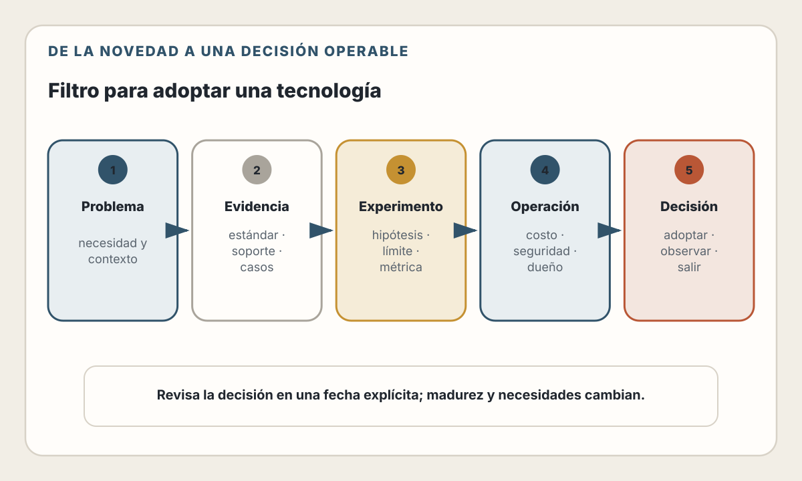

# 31. Tendencias y Horizontes

> El futuro técnico no se adivina eligiendo ganadores. Se prepara conservando
> fundamentos, observando señales y diseñando opciones reversibles.

---

## Objetivos de Aprendizaje

Al finalizar este capítulo, serás capaz de:

- Distinguir fundamentos, tendencias, señales e hipótesis
- Evaluar cuándo ejecutar cerca del usuario o cerca de los datos
- Entender qué aporta WebAssembly dentro y fuera del navegador
- Interpretar la convergencia entre frontend y backend sin perder fronteras
- Evaluar plataformas low-code, no-code y generación asistida por IA
- Reconocer nuevas superficies de seguridad, portabilidad y dependencia
- Construir un radar técnico basado en evidencia y decisiones reversibles
- Identificar qué conocimientos conservan valor aunque cambien las herramientas

## Modelo mental

Una tendencia no es una instrucción de compra. Es una dirección observable cuyo
impacto depende del sistema.

Usaremos cuatro categorías:

| Categoría | Pregunta |
|-----------|----------|
| Fundamento | ¿Seguiría siendo cierto si cambia el framework? |
| Señal | ¿Existe hoy en estándares, productos o prácticas observables? |
| Tendencia | ¿Varias señales apuntan en una dirección común? |
| Hipótesis | ¿Qué podría ocurrir, con qué supuestos y qué la refutaría? |

Por ejemplo:

- “la velocidad de la luz limita la latencia” es un fundamento;
- “varias plataformas ejecutan funciones en más regiones” es una señal;
- “más lógica se distribuirá geográficamente” es una tendencia razonable;
- “toda aplicación se ejecutará en el edge” es una predicción injustificada.

El objetivo no es acertar un año lejano. Es tomar mejores decisiones hoy sin
cerrar innecesariamente las opciones de mañana.

---

## Cómo leer el horizonte técnico

Las novedades suelen atravesar etapas:

1. una necesidad aparece en sistemas especializados;
2. proveedores ofrecen soluciones incompatibles;
3. comunidades encuentran patrones y límites;
4. estándares o interfaces comunes reducen diferencias;
5. algunas capacidades se vuelven infraestructura ordinaria;
6. otras desaparecen o permanecen como nichos.

Adoptar en cada etapa tiene un perfil distinto:

| Momento | Ventaja | Riesgo |
|---------|---------|--------|
| Experimental | Aprendizaje y diferenciación temprana | Cambios, herramientas incompletas |
| Emergente | Casos reales y comunidad creciente | Interoperabilidad parcial |
| Consolidado | Operación y contratación más sencillas | Menor diferenciación |
| Maduro | Estabilidad y conocimiento abundante | Inercia o límites heredados |

“Moderno” no significa “apropiado”. Un producto regulado y un prototipo
personal pueden elegir puntos diferentes de la curva.

### Evidencia antes de entusiasmo

Para evaluar una tecnología pregunta:

- ¿qué problema concreto resuelve?;
- ¿quién mantiene la especificación y la implementación?;
- ¿qué partes son estándar, propuesta o extensión de proveedor?;
- ¿existen dos implementaciones interoperables?;
- ¿cómo se prueba, depura, observa y actualiza?;
- ¿qué datos, permisos y costes introduce?;
- ¿cuál es el camino de salida?;
- ¿qué resultado medible justificaría adoptarla?

Una demo demuestra posibilidad. No demuestra mantenibilidad, coste ni
corrección bajo carga y fallo.

---

## Estado del ecosistema

> **Verificado el 31 de julio de 2026.**
>
> - WebAssembly 3.0 está descrito en un Candidate Recommendation Draft del W3C,
>   no en una Recomendación final de esa versión.
> - WASI 0.2 y 0.3 figuran como releases estables del proyecto WASI; WASI 0.3,
>   publicado en junio de 2026, añade soporte asíncrono nativo. Las APIs de WASI
>   continúan organizadas como propuestas del subgrupo.
> - WebGPU y WebAuthn Level 3 se encuentran en estado de estándar candidato.
> - WCAG 3.0 continúa como Working Draft; no reemplaza todavía a WCAG 2.2 como
>   referencia estable.
> - WinterTC, comité técnico TC55 de Ecma, trabaja en una superficie común de
>   APIs web para runtimes JavaScript del servidor.

Estos estados pueden cambiar después del corte editorial. Consulta siempre la
publicación normativa y el soporte real de tus runtimes objetivo.

---

## Distribución: cerca del usuario, de los datos o del efecto

“Edge” se usa para describir ejecución en ubicaciones distribuidas cercanas a
usuarios o redes de acceso. No define una única arquitectura ni garantiza baja
latencia.

Una solicitud puede recorrer:

> dispositivo → punto de presencia → función distribuida → base regional →
> servicio externo

Si la función está cerca del usuario pero la base de datos permanece lejos, la
distancia solo se movió dentro del sistema.

### Tres ubicaciones útiles

| Ubicación | Conviene cuando | Riesgo principal |
|-----------|-----------------|------------------|
| Cliente | Interacción local, offline, privacidad en dispositivo | Cliente no confiable y recursos variables |
| Edge o región cercana | Lecturas, personalización ligera, protección de borde | Estado distribuido y límites del runtime |
| Región de datos | Transacciones, consistencia, sistemas de registro | Latencia para usuarios lejanos |

La mejor ubicación suele estar cerca de la dependencia dominante:

- validación de un token firmado puede ocurrir cerca del borde;
- una transferencia de dinero debe respetar la frontera transaccional de sus
  datos;
- una transformación de imagen puede ir donde existan CPU y almacenamiento;
- una operación offline puede comenzar en el dispositivo y sincronizar después.

### La consistencia no desaparece

Distribuir réplicas introduce preguntas:

- ¿qué lectura puede estar obsoleta?;
- ¿quién acepta escrituras?;
- ¿cómo se resuelven conflictos?;
- ¿qué ocurre durante una partición?;
- ¿dónde se exige residencia de datos?;
- ¿cómo se invalida una caché global?;
- ¿qué identidad y política llegan a cada ubicación?

No conviertas un problema de producto en consenso distribuido por seguir una
tendencia. Una región, una base y una CDN resuelven una cantidad sorprendente de
productos.

### Portabilidad de runtimes

Los runtimes JavaScript no limitados al navegador adoptan APIs como `fetch`,
`Request`, `Response`, streams y Web Crypto con diferencias históricas.
WinterTC intenta definir un mínimo interoperable y colaborar con WHATWG y W3C.

Es una señal útil, no portabilidad automática. Antes de mover código prueba:

- APIs realmente disponibles;
- límites de CPU, memoria, sockets y filesystem;
- formato y ciclo de vida de variables y secretos;
- compatibilidad de paquetes nativos;
- caché y estado entre requests;
- observabilidad;
- semántica de despliegue.

La interfaz común reduce cambios. Las capacidades de la plataforma todavía
forman parte del contrato.

---

## WebAssembly: un formato, no una arquitectura completa

WebAssembly es un formato de código de bajo nivel, portable y validable,
diseñado para ejecución eficiente y representación compacta. Comenzó en el
navegador y hoy también se usa en runtimes de servidor, plugins, funciones y
componentes aislados.

### Casos donde aporta valor

- reutilizar bibliotecas escritas en Rust, C, C++ u otros lenguajes;
- procesamiento de audio, video, imágenes o datos en el navegador;
- ejecutar plugins no confiables dentro de una frontera de capacidades;
- distribuir lógica portable entre runtimes compatibles;
- aislar extensiones con una superficie de host pequeña;
- combinar componentes de varios lenguajes mediante interfaces explícitas.

### Lo que no resuelve por sí solo

- acceso al DOM;
- diseño de UI;
- red, archivos, relojes o aleatoriedad;
- autorización del negocio;
- almacenamiento y transacciones;
- compatibilidad entre APIs del host;
- depuración y observabilidad;
- tamaño y tiempo de descarga;
- seguridad de una capacidad concedida.

Un módulo WebAssembly solo puede hacer lo que el host expone. Esa restricción
favorece el aislamiento, pero el host sigue siendo responsable de límites,
permisos y datos.

### WASI y el Component Model

WASI define interfaces de sistema para componentes ejecutados fuera del
navegador. El Component Model y WIT describen contratos entre componentes y
permiten composición entre lenguajes.

La promesa es importante:

> compilar una capacidad contra una interfaz y conectarla a distintos hosts o
> componentes sin compartir el mismo runtime de lenguaje.

La práctica todavía exige verificar:

- versión de WASI soportada por cada runtime;
- herramientas de cada lenguaje;
- modelo async;
- recursos y capacidades disponibles;
- coste de cruces entre host y componente;
- estrategia de actualización;
- madurez de depuración y telemetría.

WASI 0.3 añade primitivas asíncronas nativas, pero “estable” dentro del proyecto
no significa que todos los runtimes y toolchains ya lo implementen igual.

### ¿Wasm reemplazará JavaScript?

No hay evidencia para convertir esa pregunta en una decisión general. HTML,
CSS y JavaScript integran directamente la plataforma web. WebAssembly es un
complemento valioso para componentes concretos.

El criterio es medible:

1. identifica una operación costosa o una biblioteca reutilizable;
2. construye una medición de referencia en la plataforma actual;
3. mide descarga, compilación, memoria, latencia y accesibilidad;
4. evalúa mantenimiento y depuración;
5. conserva la alternativa simple si la mejora no justifica el coste.

---

## WebGPU y cómputo especializado en el navegador

WebGPU expone capacidades modernas de GPU para gráficos y cómputo. Amplía lo
posible en visualización, edición, simulación y modelos locales.

La tendencia más amplia es que el navegador puede ejecutar trabajo antes
reservado a aplicaciones nativas o servidores. Esto puede mejorar:

- latencia interactiva;
- privacidad cuando los datos no salen del dispositivo;
- uso offline;
- distribución del coste de cómputo.

También añade:

- matrices complejas de soporte;
- drivers y hardware heterogéneos;
- consumo de batería y memoria;
- nuevos fallos y superficie de prueba;
- necesidad de una alternativa;
- riesgo de congelar la interfaz.

No envíes una carga al cliente solo para reducir tu factura. El dispositivo y
la batería pertenecen al usuario. Diseña presupuesto, cancelación, progreso,
degradación y alternativa accesible.

---

## La convergencia entre frontend y backend

Server Components, Server Actions, Route Handlers, loaders, actions y funciones
co-localizadas aproximan UI y servidor. Esta dirección reduce capas de pegamento
y permite elegir render estático o dinámico por ruta o componente.

Convergencia no significa identidad:

| Puede converger | Debe conservar frontera |
|-----------------|--------------------------|
| Repositorio y flujo de despliegue | Navegador y servidor |
| Tipos y esquemas | Datos confiables y no confiables |
| Caso de uso y formulario | Presentación y autorización |
| Render y acceso a datos | Contrato interno y contrato público |
| Telemetría del recorrido | Secretos y bundle cliente |

Un framework full stack puede actuar como Backend for Frontend. Eso es útil
cuando sirve las necesidades de una interfaz concreta. No siempre reemplaza:

- APIs públicas versionadas;
- workers de larga duración;
- procesamiento asíncrono;
- protocolos especializados;
- servicios compartidos por varios productos;
- fronteras organizacionales o regulatorias.

### Arquitectura por recorrido

La unidad útil deja de ser “frontend versus backend” y pasa a ser el recorrido:

> intención del usuario → interfaz → validación → caso de uso → datos → efecto
> observable

El equipo puede ser propietario del recorrido completo y aun conservar módulos
y contratos. Esta forma reduce handoffs sin borrar seguridad ni responsabilidad.

### Riesgo: magia distribuida

Cuando una llamada parece local pero cruza red o frontera de ejecución, puede
ocultar:

- serialización;
- autenticación;
- reintentos;
- caché;
- timeouts;
- compatibilidad de versiones;
- fallos parciales.

Las herramientas pueden generar el transporte. El ingeniero todavía debe
entender dónde ocurre cada operación y qué pasa si no termina.

---

## Plataformas low-code, no-code y desarrollo generado

Low-code y no-code no son una categoría binaria. Existe un continuo:

| Nivel | Ejemplo de responsabilidad humana |
|-------|-----------------------------------|
| Configuración | Reglas y formularios sobre un sistema existente |
| Composición visual | Flujos, datos y componentes conectados |
| Código generado | Especificación revisada que produce artefactos editables |
| Agente con herramientas | Objetivo, permisos, ejecución y verificación |
| Código manual | Implementación directa y control detallado |

Cada nivel intercambia control local por velocidad, estandarización o
accesibilidad para más personas.

### La pregunta correcta

No preguntes “¿puede construir una app?”. Pregunta:

- ¿quién posee código, datos, dominio y artefactos?;
- ¿cómo se representa la lógica compleja?;
- ¿puede revisarse y probarse en CI?;
- ¿cómo se gestionan ambientes y migraciones?;
- ¿qué ocurre cuando el generador cambia?;
- ¿existe exportación o API de salida?;
- ¿cómo se observan fallos?;
- ¿quién responde por seguridad y accesibilidad?;
- ¿cuál es el coste de abandonar la plataforma?

La capacidad de generar una pantalla no demuestra que el sistema pueda
evolucionar durante cinco años.

### Escape hatches

Una plataforma sostenible ofrece:

- código o configuración versionable;
- extensiones documentadas;
- APIs y webhooks;
- exportación de datos;
- ambientes separados;
- pruebas automatizables;
- logs y auditoría;
- control de identidad y permisos;
- límites conocidos;
- plan de migración.

Sin escape hatches, cada requisito no previsto se convierte en una negociación
con la plataforma.

---

## IA: de generar texto a operar sistemas

El capítulo 30 estudió agentes, contexto, herramientas y permisos. La tendencia
relevante para aplicaciones web es que la interfaz también puede volverse
orientada a intención:

> “reprograma mi entrega para después de las cinco y avísame si cambia el
> precio”

Esa frase puede requerir:

1. interpretar intención;
2. recuperar estado autorizado;
3. proponer un plan;
4. solicitar confirmación;
5. ejecutar herramientas;
6. verificar efectos;
7. explicar el resultado.

El componente lingüístico no reemplaza las APIs. Las invoca. Por ello aumentan
el valor de:

- contratos claros;
- operaciones idempotentes;
- permisos granulares;
- previews y dry-runs;
- aprobaciones;
- logs de auditoría;
- límites de gasto y alcance;
- compensación de efectos;
- evaluaciones reproducibles.

### Interfaces duales

Un producto puede necesitar servir:

- UI visual para personas;
- HTML semántico para accesibilidad y automatización;
- API para integraciones;
- herramientas estructuradas para agentes.

No dupliques cuatro lógicas de negocio. Diseña casos de uso comunes con
adaptadores distintos y políticas de autorización consistentes.

### Datos y contenido para máquinas

Más clientes automáticos leerán documentación, catálogos y políticas. Formatos
estructurados ayudan, pero no reemplazan la web accesible:

- HTML semántico;
- metadatos claros;
- URLs estables;
- contenido negociado correctamente;
- esquemas versionados;
- procedencia y fechas;
- rate limits y términos de uso.

No publiques una variante especial para IA que contradiga la experiencia humana
o exponga información adicional.

---

## Identidad, confianza y procedencia

El aumento de automatización vuelve más importantes las preguntas:

- ¿quién solicita la acción?;
- ¿en nombre de quién opera?;
- ¿qué credencial y scopes usa?;
- ¿qué artefacto produjo el cambio?;
- ¿qué persona o política lo aprobó?;
- ¿qué evidencia permite reconstruirlo?

WebAuthn y passkeys reducen dependencia de secretos memorizados para
autenticación de personas. Identidades de workload y credenciales breves
reducen secretos persistentes entre sistemas. Firmas, atestaciones y metadatos
de compilación mejoran la procedencia de los artefactos.

Ninguna tecnología elimina phishing, recuperación de cuenta, autorización ni
abuso de una sesión válida. La confianza es un recorrido:

> identidad → credencial → sesión → autorización → acción → evidencia

Cada paso necesita límites y revocación.

---

## Lo que permanece constante

### La plataforma web

- URL identifica recursos.
- HTTP expresa solicitudes, respuestas, caché y semántica.
- HTML comunica estructura y significado.
- CSS adapta presentación.
- JavaScript coordina comportamiento.
- El navegador aplica origen, permisos y aislamiento imperfecto.

Las APIs crecen; estos modelos siguen explicando el sistema.

### Los datos

- Los nombres y tipos importan.
- Las invariantes deben vivir en más de una defensa cuando el riesgo lo exige.
- Las transacciones tienen fronteras.
- Tiempo, identidad y dinero requieren modelos precisos.
- Distribución intercambia latencia, disponibilidad y coordinación.
- Una migración cambia un sistema vivo, no solo un archivo.

### La seguridad

- El cliente no es confiable.
- Autenticación y autorización son distintas.
- Datos no deben convertirse en instrucciones.
- Menor privilegio reduce radio de impacto.
- Secretos necesitan alcance, rotación y revocación.
- Todo nuevo intérprete —plantilla, shell, SQL o agente— crea una frontera.

### La calidad

- Un requisito ambiguo produce software ambiguo más rápido.
- Los contratos permiten colaboración.
- Las pruebas aportan evidencia acotada.
- Observabilidad conecta comportamiento real con hipótesis.
- Rollback y degradación son parte del diseño.
- La accesibilidad no se recupera automáticamente al final.

### El juicio

La herramienta no conoce por sí sola:

- qué problema merece resolverse;
- qué riesgo puede aceptar la organización;
- qué experiencia respeta a las personas;
- qué complejidad podrá operar el equipo;
- cuándo una optimización no vale su coste;
- quién responde por el resultado.

La IA amplifica opciones. El juicio selecciona y asume responsabilidad.

---

## Un radar técnico operativo

Mantén un documento trimestral con cuatro zonas:

<picture>
  <source media="(max-width: 820px)" srcset="../assets/diagrams/cap31-filtro-adopcion-mobile.svg">
  
</picture>

| Zona | Acción |
|------|--------|
| Adoptar | Existe problema, evidencia, propietario y plan operativo |
| Probar | Experimento acotado con hipótesis y criterio de salida |
| Observar | Señal relevante, pero sin necesidad inmediata |
| Evitar por ahora | Riesgo, inmadurez o coste supera el beneficio |

Cada entrada debe incluir:

```text
Tecnología o práctica:
Problema que podría resolver:
Estado: estándar / borrador / producto / experimento
Evidencia disponible:
Hipótesis:
Experimento máximo:
Métrica de éxito:
Riesgos y datos expuestos:
Salida o rollback:
Fecha de revisión:
Responsable:
```

### Presupuesto de exploración

Reserva una fracción explícita de tiempo para explorar sin introducir cada demo
en producción. El resultado de una exploración puede ser “no adoptar”. Ese
resultado tiene valor si documenta:

- qué se probó;
- con qué versión;
- en qué carga;
- qué falló;
- qué tendría que cambiar para reconsiderarlo.

La curiosidad sin registro repite experimentos. La estandarización sin
curiosidad acumula obsolescencia.

---

## Estrategia personal de aprendizaje

Un desarrollador preparado para cambios no intenta dominar cada framework.
Construye una forma de aprender:

1. **Conserva fundamentos:** navegador, red, datos, concurrencia, seguridad.
2. **Domina un recorrido:** lleva una capacidad desde problema hasta operación.
3. **Aprende por contraste:** implementa el mismo slice en dos modelos.
4. **Lee fuentes primarias:** especificaciones, documentación y notas de versión.
5. **Mide:** performance, accesibilidad, errores, coste y experiencia.
6. **Explica:** escribir una decisión revela huecos de comprensión.
7. **Usa IA con verificación:** permite velocidad sin ceder responsabilidad.
8. **Enseña y revisa:** la retroalimentación de otros corrige modelos mentales.

Una API de moda puede desaparecer. Saber investigar su contrato, aislarla,
probarla y reemplazarla permanece.

---

## Decisiones y trade-offs

| Tendencia | Beneficio posible | Riesgo |
|-----------|-------------------|--------|
| Ejecución distribuida | Menor latencia y mayor resiliencia regional | Consistencia y operación complejas |
| WebAssembly | Portabilidad y aislamiento de componentes | Tooling y APIs de host en evolución |
| Cómputo cliente | Latencia, offline y privacidad | Hardware, batería y soporte variable |
| Framework full stack | Menos pegamento y responsabilidad por recorrido | Fronteras implícitas y acoplamiento |
| Low/no-code | Entrega rápida y participación más amplia | Lock-in y límites de extensión |
| Agentes | Automatización de recorridos complejos | Acciones incorrectas y nuevos permisos |
| Más estándares | Interoperabilidad | Adopción desigual y versiones transitorias |

El patrón común es el mismo: una abstracción elimina trabajo visible y añade un
contrato que debe comprenderse.

---

## Lista de Verificación

- [ ] La propuesta parte de un problema, no de una tendencia
- [ ] Se distingue estándar final, candidato, borrador y extensión de proveedor
- [ ] La fecha y las versiones de afirmaciones volátiles están registradas
- [ ] Existe más de una implementación o se acepta el riesgo de dependencia
- [ ] El experimento tiene hipótesis, métrica, presupuesto y criterio de salida
- [ ] Se evaluaron depuración, pruebas, observabilidad y actualización
- [ ] La ubicación de ejecución considera usuario, datos y efecto
- [ ] Estado y consistencia distribuidos tienen una política explícita
- [ ] La frontera cliente-servidor conserva validación y autorización
- [ ] La plataforma permite exportar datos y extender capacidades
- [ ] Las acciones de agentes tienen permisos, aprobación y auditoría
- [ ] Existe una alternativa para una capacidad, dispositivo o runtime no compatible
- [ ] El equipo puede explicar y operar la solución
- [ ] Hay una estrategia de salida o rollback
- [ ] La decisión tiene fecha de revisión

---

## Resumen

- Las tendencias orientan experimentos; no ordenan arquitecturas.
- Edge reduce latencia solo cuando la ubicación de datos y efectos acompaña.
- WebAssembly aporta un formato portable; WASI y Component Model amplían su
  composición fuera del navegador.
- WebGPU lleva más cómputo al cliente con nuevos costes y responsabilidades.
- Frontend y backend pueden co-localizarse sin borrar su frontera de confianza.
- Low-code, no-code, código generado y agentes forman un continuo de abstracción.
- Las interfaces orientadas a intención necesitan APIs, permisos y evidencia más
  rigurosos.
- HTTP, semántica, datos, seguridad, pruebas, observabilidad y juicio permanecen.
- Prepararse para el futuro consiste en aprender a evaluar y reemplazar, no en
  acertar qué herramienta ganará.

---

## Ejercicios

1. **Clasificación:** toma cinco afirmaciones tecnológicas y clasifícalas como
   fundamento, señal, tendencia o hipótesis.
2. **Ubicación:** decide dónde ejecutar autenticación, catálogo, checkout y
   procesamiento de imagen para usuarios en tres continentes.
3. **Wasm:** selecciona una operación de CPU, define una medición de referencia y diseña un
   experimento que mida descarga, memoria y latencia.
4. **Plataforma:** evalúa una herramienta low-code mediante propiedad, pruebas,
   observabilidad, extensibilidad y salida.
5. **Agente:** convierte una operación sensible en herramienta con scopes,
   simulación previa, aprobación, idempotencia y registro de auditoría.
6. **Radar:** crea las cuatro zonas para tu equipo y limita “Probar” a dos
   experimentos con responsables.
7. **Carta al futuro:** escribe qué partes de tu stack actual esperas reemplazar
   en tres años y qué fundamentos seguirán explicándolo.

---

## Referencias

- [W3C — WebAssembly Core Specification](https://www.w3.org/TR/wasm-core/)
- [W3C — WebAssembly Web API](https://www.w3.org/TR/wasm-web-api-2/)
- [WASI — Releases](https://wasi.dev/releases)
- [WASI — Roadmap](https://wasi.dev/roadmap)
- [WebAssembly Component Model](https://component-model.bytecodealliance.org/)
- [W3C — WebGPU](https://www.w3.org/TR/webgpu/)
- [Ecma International — TC55: Web-interoperable server runtimes](https://ecma-international.org/technical-committees/tc55/)
- [Ecma International — colaboración entre W3C y Ecma en WinterTC](https://ecma-international.org/news/collaborating-across-w3c-and-ecma-for-web-interoperable-server-runtimes-through-wintertc/)
- [Next.js — Backend for Frontend](https://nextjs.org/docs/app/guides/backend-for-frontend)
- [React — Server Components](https://react.dev/reference/rsc/server-components)
- [W3C — Web Authentication Level 3](https://www.w3.org/TR/webauthn-3/)
- [W3C — WCAG 3.0 Working Draft](https://www.w3.org/TR/wcag-3.0/)
- [WHATWG — HTML Living Standard](https://html.spec.whatwg.org/)
- [WHATWG — Fetch Living Standard](https://fetch.spec.whatwg.org/)
- [W3C TAG — Web Platform Design Principles](https://www.w3.org/TR/design-principles/)
